# Report of ssn-clustering run 2206101141
## Metadata
CD-HIT threshold: 99%

Length filter: min 320, max 600

Expansion threshold: e-value 1e-15

SSN threshold: score 110

## Info
Total number of proteins in network: 6176 

Number of singletons: 46 

Number of nodes in clusters: 6130 

Number of clusters: 205 

[File with accessions in each cluster](https://github.com/idameitil/phd/tree/master/data/wzy/ssn-clusterings/2206101141/clusters.tsv)

Number of different taxonomical ranks before and after expansion:

|        |   kingdom |   phylum |   class |   order |   family |   genus |   species |
|:-------|----------:|---------:|--------:|--------:|---------:|--------:|----------:|
| before |         1 |        2 |       2 |       4 |        5 |      10 |        15 |
| after  |         1 |       42 |      52 |      95 |      200 |     610 |      2359 |

## Navigation
[8(548)](#cluster-8)  [3(478)](#cluster-3)  [32(270)](#cluster-32)  [15(258)](#cluster-15)  [9(240)](#cluster-9)  [11(152)](#cluster-11)  [6(139)](#cluster-6)  [29(136)](#cluster-29)  [23(134)](#cluster-23)  [50(129)](#cluster-50)  [33(129)](#cluster-33)  [39(119)](#cluster-39)  [2(107)](#cluster-2)  [46(91)](#cluster-46)  [1(89)](#cluster-1)  [44(83)](#cluster-44)  [37(82)](#cluster-37)  [67(71)](#cluster-67)  [27(67)](#cluster-27)  [68(66)](#cluster-68)  [12(66)](#cluster-12)  [56(59)](#cluster-56)  [36(59)](#cluster-36)  [21(58)](#cluster-21)  [75(51)](#cluster-75)  [17(48)](#cluster-17)  [22(46)](#cluster-22)  [58(45)](#cluster-58)  [57(43)](#cluster-57)  [31(43)](#cluster-31)  [79(42)](#cluster-79)  [53(41)](#cluster-53)  [48(41)](#cluster-48)  [13(40)](#cluster-13)  [63(39)](#cluster-63)  [84(37)](#cluster-84)  [43(37)](#cluster-43)  [94(36)](#cluster-94)  [65(36)](#cluster-65)  [171(36)](#cluster-171)  [66(35)](#cluster-66)  [4(34)](#cluster-4)  [93(33)](#cluster-93)  [59(33)](#cluster-59)  [73(29)](#cluster-73)  [72(29)](#cluster-72)  [54(28)](#cluster-54)  [41(26)](#cluster-41)  [28(25)](#cluster-28)  [98(24)](#cluster-98)  [25(24)](#cluster-25)  [69(23)](#cluster-69)  [81(22)](#cluster-81)  [40(22)](#cluster-40)  [24(22)](#cluster-24)  [91(21)](#cluster-91)  [89(21)](#cluster-89)  [80(21)](#cluster-80)  [123(21)](#cluster-123)  [101(21)](#cluster-101)  [62(20)](#cluster-62)  [126(20)](#cluster-126)  [77(19)](#cluster-77)  [145(19)](#cluster-145)  [86(18)](#cluster-86)  [158(18)](#cluster-158)  [144(18)](#cluster-144)  [141(18)](#cluster-141)  [116(18)](#cluster-116)  [113(18)](#cluster-113)  [99(17)](#cluster-99)  [95(17)](#cluster-95)  [42(17)](#cluster-42)  [177(17)](#cluster-177)  [162(17)](#cluster-162)  [140(17)](#cluster-140)  [61(16)](#cluster-61)  [51(16)](#cluster-51)  [38(16)](#cluster-38)  [157(16)](#cluster-157)  [14(16)](#cluster-14)  [139(16)](#cluster-139)  [138(16)](#cluster-138)  [129(16)](#cluster-129)  [125(16)](#cluster-125)  [104(16)](#cluster-104)  [96(15)](#cluster-96)  [88(15)](#cluster-88)  [70(15)](#cluster-70)  [26(15)](#cluster-26)  [164(15)](#cluster-164)  [130(15)](#cluster-130)  [110(15)](#cluster-110)  [55(14)](#cluster-55)  [30(14)](#cluster-30)  [19(14)](#cluster-19)  [154(14)](#cluster-154)  [121(14)](#cluster-121)  [120(14)](#cluster-120)  [115(14)](#cluster-115)  [60(13)](#cluster-60)  [47(13)](#cluster-47)  [45(13)](#cluster-45)  [173(13)](#cluster-173)  [20(12)](#cluster-20)  [180(12)](#cluster-180)  [124(12)](#cluster-124)  [102(12)](#cluster-102)  [198(11)](#cluster-198)  [163(11)](#cluster-163)  [149(11)](#cluster-149)  [147(11)](#cluster-147)  [76(10)](#cluster-76)  [5(10)](#cluster-5)  [49(10)](#cluster-49)  [35(10)](#cluster-35)  [34(10)](#cluster-34)  [174(10)](#cluster-174)  [153(10)](#cluster-153)  [150(10)](#cluster-150)  [112(10)](#cluster-112)  [105(10)](#cluster-105)  [85(9)](#cluster-85)  [190(9)](#cluster-190)  [179(9)](#cluster-179)  [168(9)](#cluster-168)  [161(9)](#cluster-161)  [155(9)](#cluster-155)  [146(9)](#cluster-146)  [119(9)](#cluster-119)  [97(8)](#cluster-97)  [78(8)](#cluster-78)  [71(8)](#cluster-71)  [166(8)](#cluster-166)  [152(8)](#cluster-152)  [148(8)](#cluster-148)  [135(8)](#cluster-135)  [128(8)](#cluster-128)  [127(8)](#cluster-127)  [114(8)](#cluster-114)  [7(7)](#cluster-7)  [199(7)](#cluster-199)  [186(7)](#cluster-186)  [181(7)](#cluster-181)  [18(7)](#cluster-18)  [176(7)](#cluster-176)  [170(7)](#cluster-170)  [169(7)](#cluster-169)  [160(7)](#cluster-160)  [143(7)](#cluster-143)  [133(7)](#cluster-133)  [132(7)](#cluster-132)  [111(7)](#cluster-111)  [10(7)](#cluster-10)  [16(6)](#cluster-16)  [156(6)](#cluster-156)  [142(6)](#cluster-142)  [136(6)](#cluster-136)  [118(6)](#cluster-118)  [106(6)](#cluster-106)  [103(6)](#cluster-103)  [74(5)](#cluster-74)  [64(5)](#cluster-64)  [202(5)](#cluster-202)  [137(5)](#cluster-137)  [100(5)](#cluster-100)  [92(4)](#cluster-92)  [87(4)](#cluster-87)  [204(4)](#cluster-204)  [200(4)](#cluster-200)  [192(4)](#cluster-192)  [191(4)](#cluster-191)  [184(4)](#cluster-184)  [159(4)](#cluster-159)  [131(4)](#cluster-131)  [108(4)](#cluster-108)  [107(4)](#cluster-107)  [90(3)](#cluster-90)  [203(3)](#cluster-203)  [201(3)](#cluster-201)  [196(3)](#cluster-196)  [195(3)](#cluster-195)  [194(3)](#cluster-194)  [183(3)](#cluster-183)  [167(3)](#cluster-167)  [165(3)](#cluster-165)  [134(3)](#cluster-134)  [122(3)](#cluster-122)  [117(3)](#cluster-117)  [109(3)](#cluster-109)  [83(2)](#cluster-83)  [82(2)](#cluster-82)  [52(2)](#cluster-52)  [205(2)](#cluster-205)  [197(2)](#cluster-197)  [193(2)](#cluster-193)  [189(2)](#cluster-189)  [188(2)](#cluster-188)  [187(2)](#cluster-187)  [185(2)](#cluster-185)  [182(2)](#cluster-182)  [178(2)](#cluster-178)  [175(2)](#cluster-175)  [172(2)](#cluster-172)  [151(2)](#cluster-151)  

## Clusters
### Cluster 8
Total number of members in cluster: 548

Average length of proteins in cluster: 448.2

#### Conserved (non-aliphatic) residues: 

Y 160 (98.4%) Y 275 (100.0%) Y 295 (97.8%) Y 331 (98.5%) R 338 (100.0%) R 382 (100.0%) Y 383 (99.8%) D 415 (97.4%) S 418 (99.1%) N 473 (98.9%) T 479 (99.8%) S 506 (97.8%) T 508 (99.5%) S 512 (97.8%) D 538 (99.5%) R 578 (99.6%) 

#### Seeds in cluster:

| protein_accession   | order            | family             | genus       | species             | serotype                            |   Enterobacterial common antigen Wzy |
|:--------------------|:-----------------|:-------------------|:------------|:--------------------|:------------------------------------|-------------------------------------:|
| AAC45844.1          | Enterobacterales | Enterobacteriaceae | Escherichia | Escherichia coli    | O8                                  |                                    1 |
| ACF61556.1          | Enterobacterales | Enterobacteriaceae | Salmonella  | Salmonella enterica | ssp. enterica sv. Newport           |                                    1 |
| ACF69242.1          | Enterobacterales | Enterobacteriaceae | Salmonella  | Salmonella enterica | Heidelberg                          |                                    1 |
| WP_000055605.1      | Enterobacterales | Enterobacteriaceae | Salmonella  | nan                 | ssp. enterica sv. Kentucky O8 98/39 |                                    1 |
| ACF89798.1          | Enterobacterales | Enterobacteriaceae | Salmonella  | Salmonella enterica | Schwarzengrund                      |                                    1 |
| ACH73921.1          | Enterobacterales | Enterobacteriaceae | Salmonella  | Salmonella enterica | Dublin                              |                                    1 |
| ACH50550.1          | Enterobacterales | Enterobacteriaceae | Salmonella  | Salmonella enterica | Agona                               |                                    1 |
| CAS11643.1          | Enterobacterales | Enterobacteriaceae | Escherichia | Escherichia coli    | O127                                |                                    1 |
| CAR10598.2          | Enterobacterales | Enterobacteriaceae | Escherichia | Escherichia coli    | O81                                 |                                    1 |
| BAI33073.1          | Enterobacterales | Enterobacteriaceae | Escherichia | Escherichia coli    | O103                                |                                    1 |
| ADT77417.1          | Enterobacterales | Enterobacteriaceae | Escherichia | Escherichia coli    | O6                                  |                                    1 |

[MSA fasta](https://github.com/idameitil/phd/tree/master/data/wzy/ssn-clusterings/2206101141/clusters/0548_8/sequences.afa)

[Malign view](https://github.com/idameitil/phd/tree/master/data/wzy/ssn-clusterings/2206101141/clusters/0548_8/sequences.malign)

[Fasta of members](https://github.com/idameitil/phd/tree/master/data/wzy/ssn-clusterings/2206101141/clusters/0548_8/sequences.fa)

[Logoplot](https://github.com/idameitil/phd/tree/master/data/wzy/ssn-clusterings/2206101141/clusters/0548_8/sequences.logo.pdf)

[Phylogenetic tree](https://github.com/idameitil/phd/tree/master/data/wzy/ssn-clusterings/2206101141/clusters/0548_8/sequences.nwk)

[Hits in cluster](https://github.com/idameitil/phd/tree/master/data/wzy/ssn-clusterings/2206101141/clusters/0548_8/hits.tsv)

#### Sugars in cluster:

#### Sugars for blast hits:

CAB3270026.1:

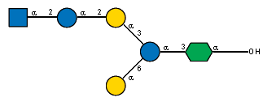

#### Alphafold models:

[ACH50550.1](https://github.com/idameitil/phd/tree/master/data/wzy/alphafold/2205031317-wzy_missing/af_out/ACH50550.1/ranked_0.pdb)

#### Taxonomy:

| order (count)          | family (count)             | genus (count)                       |
|:-----------------------|:---------------------------|:------------------------------------|
| Enterobacterales (491) | Enterobacteriaceae (235)   | Enterobacter (60)                   |
|                        |                            | Escherichia (35)                    |
|                        |                            | Salmonella (23)                     |
|                        |                            | Citrobacter (22)                    |
|                        |                            | Klebsiella (13)                     |
|                        |                            | Cronobacter (11)                    |
|                        |                            | Kosakonia (8)                       |
|                        |                            | Cedecea (7)                         |
|                        |                            | Buttiauxella (6)                    |
|                        |                            | Kluyvera (4)                        |
|                        |                            | Raoultella (4)                      |
|                        |                            | Leclercia (4)                       |
|                        |                            | Pseudocitrobacter (3)               |
|                        |                            | Pluralibacter (3)                   |
|                        |                            | Lelliottia (3)                      |
|                        |                            | Trabulsiella (2)                    |
|                        |                            | Phytobacter (2)                     |
|                        |                            | Atlantibacter (2)                   |
|                        |                            | Franconibacter (2)                  |
|                        |                            | Mangrovibacter (2)                  |
|                        |                            | Candidatus Symbiopectobacterium (2) |
|                        |                            | Yokenella (1)                       |
|                        |                            | Scandinavium (1)                    |
|                        |                            | Tenebrionibacter (1)                |
|                        |                            | Siccibacter (1)                     |
|                        |                            | Shigella (1)                        |
|                        |                            | Plesiomonas (1)                     |
|                        | Yersiniaceae (70)          | Serratia (32)                       |
|                        |                            | Yersinia (19)                       |
|                        |                            | Rahnella (9)                        |
|                        |                            | Rouxiella (4)                       |
|                        |                            | Chimaeribacter (2)                  |
|                        |                            | Candidatus Fukatsuia (1)            |
|                        |                            | Ewingella (1)                       |
|                        |                            | Nissabacter (1)                     |
|                        | Morganellaceae (65)        | Xenorhabdus (20)                    |
|                        |                            | Proteus (13)                        |
|                        |                            | Providencia (12)                    |
|                        |                            | Photorhabdus (10)                   |
|                        |                            | Morganella (5)                      |
|                        |                            | Arsenophonus (4)                    |
|                        |                            | Moellerella (1)                     |
|                        | Pectobacteriaceae (54)     | Dickeya (21)                        |
|                        |                            | Pectobacterium (19)                 |
|                        |                            | Brenneria (6)                       |
|                        |                            | Lonsdalea (5)                       |
|                        |                            | Affinibrenneria (1)                 |
|                        |                            | Samsonia (1)                        |
|                        |                            | Musicola (1)                        |
|                        | Erwiniaceae (52)           | Pantoea (25)                        |
|                        |                            | Erwinia (16)                        |
|                        |                            | nan (6)                             |
|                        |                            | Tatumella (4)                       |
|                        |                            | Mixta (3)                           |
|                        |                            | Izhakiella (2)                      |
|                        |                            | Phaseolibacter (1)                  |
|                        | Hafniaceae (9)             | Hafnia (4)                          |
|                        |                            | Edwardsiella (3)                    |
|                        |                            | Enterobacillus (1)                  |
|                        |                            | Obesumbacterium (1)                 |
|                        | Budviciaceae (3)           | Jinshanibacter (1)                  |
|                        |                            | Pragia (1)                          |
|                        |                            | Budvicia (1)                        |
|                        | Bruguierivoracaceae (2)    | Sodalis (2)                         |
| Pasteurellales (42)    | Pasteurellaceae (42)       | Glaesserella (13)                   |
|                        |                            | Actinobacillus (8)                  |
|                        |                            | Mannheimia (7)                      |
|                        |                            | Haemophilus (3)                     |
|                        |                            | Ursidibacter (2)                    |
|                        |                            | Bibersteinia (2)                    |
|                        |                            | Lonepinella (1)                     |
|                        |                            | Nicoletella (1)                     |
|                        |                            | Muribacter (1)                      |
|                        |                            | Otariodibacter (1)                  |
| Burkholderiales (5)    | Burkholderiaceae (5)       | Paraburkholderia (3)                |
|                        |                            | Mycoavidus (2)                      |
| Vibrionales (3)        | Vibrionaceae (3)           | Vibrio (2)                          |
|                        |                            | Aliivibrio (1)                      |
| Pseudomonadales (2)    | Pseudomonadaceae (2)       | Pseudomonas (2)                     |
| Flavobacteriales (1)   | nan (2)                    | nan (6)                             |
| Alteromonadales (1)    | Pseudoalteromonadaceae (1) | Flocculibacter (1)                  |
| Moraxellales (1)       | Moraxellaceae (1)          | Acinetobacter (1)                   |
| Xanthomonadales (1)    | Rhodanobacteraceae (1)     | Dyella (1)                          |
| nan (1)                | nan (2)                    | nan (6)                             |

[top](#navigation)

### Cluster 3
Total number of members in cluster: 478

Average length of proteins in cluster: 398.0

#### Conserved (non-aliphatic) residues: 

R 824 (98.3%) R 1156 (100.0%) D 1224 (100.0%) 

#### Seeds in cluster:

| protein_accession   | order           | family           | genus         | species                  | serotype   |   Enterobacterial common antigen Wzy |
|:--------------------|:----------------|:-----------------|:--------------|:-------------------------|:-----------|-------------------------------------:|
| CAI33309.1          | Lactobacillales | Streptococcaceae | Streptococcus | Streptococcus pneumoniae | 13         |                                    0 |
| CAI33441.1          | Lactobacillales | Streptococcaceae | Streptococcus | Streptococcus pneumoniae | 16A        |                                    0 |
| CAI34080.1          | Lactobacillales | Streptococcaceae | Streptococcus | Streptococcus pneumoniae | 29         |                                    0 |
| CAI34348.1          | Lactobacillales | Streptococcaceae | Streptococcus | Streptococcus pneumoniae | 35F        |                                    0 |
| CAI34286.1          | Lactobacillales | Streptococcaceae | Streptococcus | Streptococcus pneumoniae | 35A        |                                    0 |
| CAI34310.1          | Lactobacillales | Streptococcaceae | Streptococcus | Streptococcus pneumoniae | 35B        |                                    0 |
| CAI34328.1          | Lactobacillales | Streptococcaceae | Streptococcus | Streptococcus pneumoniae | 35C        |                                    0 |
| CAI34369.1          | Lactobacillales | Streptococcaceae | Streptococcus | Streptococcus pneumoniae | 36         |                                    0 |
| CAI34519.1          | Lactobacillales | Streptococcaceae | Streptococcus | Streptococcus pneumoniae | 42         |                                    0 |
| CAI34657.1          | Lactobacillales | Streptococcaceae | Streptococcus | Streptococcus pneumoniae | 47F        |                                    0 |

[MSA fasta](https://github.com/idameitil/phd/tree/master/data/wzy/ssn-clusterings/2206101141/clusters/0478_3/sequences.afa)

[Malign view](https://github.com/idameitil/phd/tree/master/data/wzy/ssn-clusterings/2206101141/clusters/0478_3/sequences.malign)

[Fasta of members](https://github.com/idameitil/phd/tree/master/data/wzy/ssn-clusterings/2206101141/clusters/0478_3/sequences.fa)

[Logoplot](https://github.com/idameitil/phd/tree/master/data/wzy/ssn-clusterings/2206101141/clusters/0478_3/sequences.logo.pdf)

[Phylogenetic tree](https://github.com/idameitil/phd/tree/master/data/wzy/ssn-clusterings/2206101141/clusters/0478_3/sequences.nwk)

[Hits in cluster](https://github.com/idameitil/phd/tree/master/data/wzy/ssn-clusterings/2206101141/clusters/0478_3/hits.tsv)

#### Sugars in cluster:

CAI33309.1:

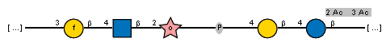

CAI33441.1:

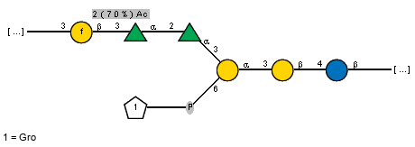

CAI34080.1:

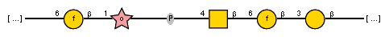

CAI34348.1:

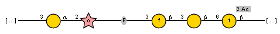

CAI34286.1:

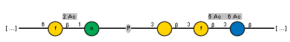

CAI34310.1:

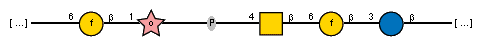

CAI34328.1:

CAI34519.1:

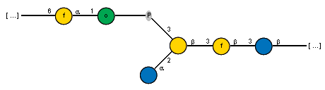

CAI34657.1:

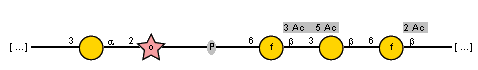

#### Sugars for blast hits:

#### Alphafold models:

[CAI33309.1](https://github.com/idameitil/phd/tree/master/data/wzy/alphafold/2202060002-wzy_100/af_out/CAI33309.1/ranked_0.pdb)

[CAI34369.1](https://github.com/idameitil/phd/tree/master/data/wzy/alphafold/2202060002-wzy_100/af_out/CAI34369.1/ranked_0.pdb)

#### Taxonomy:

| order (count)          | family (count)          | genus (count)            |
|:-----------------------|:------------------------|:-------------------------|
| Lactobacillales (301)  | Lactobacillaceae (170)  | Limosilactobacillus (67) |
|                        |                         | Lactiplantibacillus (31) |
|                        |                         | Ligilactobacillus (18)   |
|                        |                         | Lactobacillus (15)       |
|                        |                         | Loigolactobacillus (9)   |
|                        |                         | Pediococcus (8)          |
|                        |                         | Liquorilactobacillus (6) |
|                        |                         | Levilactobacillus (3)    |
|                        |                         | Lacticaseibacillus (3)   |
|                        |                         | Companilactobacillus (3) |
|                        |                         | Latilactobacillus (2)    |
|                        |                         | Paucilactobacillus (2)   |
|                        |                         | Fructilactobacillus (1)  |
|                        | Streptococcaceae (129)  | Streptococcus (129)      |
|                        | Enterococcaceae (1)     | Bavariicoccus (1)        |
| Eubacteriales (138)    | Lachnospiraceae (87)    | nan (19)                 |
|                        |                         | Coprococcus (9)          |
|                        |                         | Blautia (6)              |
|                        |                         | Mediterraneibacter (3)   |
|                        |                         | Oribacterium (3)         |
|                        |                         | Lachnoclostridium (2)    |
|                        |                         | Enterocloster (2)        |
|                        |                         | Dorea (2)                |
|                        |                         | Bilifractor (2)          |
|                        |                         | Lacrimispora (1)         |
|                        |                         | Muricomes (1)            |
|                        |                         | Luxibacter (1)           |
|                        |                         | Bariatricus (1)          |
|                        |                         | Kineothrix (1)           |
|                        |                         | Butyrivibrio (1)         |
|                        |                         | Anaerostipes (1)         |
|                        |                         | Faecalicatena (1)        |
|                        |                         | Fusicatenibacter (1)     |
|                        |                         | Lachnospira (1)          |
|                        |                         | Parasporobacterium (1)   |
|                        |                         | Roseburia (1)            |
|                        |                         | Eisenbergiella (1)       |
|                        | Clostridiaceae (13)     | Clostridium (9)          |
|                        | Eubacteriaceae (13)     | Eubacterium (7)          |
|                        |                         | Pseudoramibacter (6)     |
|                        | Oscillospiraceae (12)   | Ruminococcus (4)         |
|                        |                         | Pseudoflavonifractor (1) |
| Pasteurellales (10)    | Pasteurellaceae (10)    | Haemophilus (7)          |
|                        |                         | Gallibacterium (2)       |
|                        |                         | Rodentibacter (1)        |
| nan (6)                | nan (10)                | Sedimentibacter (1)      |
| Coriobacteriales (5)   | Atopobiaceae (3)        | nan (19)                 |
|                        |                         | Atopobium (1)            |
|                        | Coriobacteriaceae (2)   | Collinsella (1)          |
| Bacteroidales (4)      | nan (10)                | nan (19)                 |
|                        | Bacteroidaceae (3)      | Phocaeicola (2)          |
|                        |                         | Bacteroides (1)          |
| Erysipelotrichales (4) | Coprobacillaceae (2)    | Eggerthia (1)            |
|                        |                         | Sharpea (1)              |
|                        | Erysipelotrichaceae (2) | Solobacterium (2)        |
| Bacillales (3)         | nan (10)                | Gemella (3)              |
| Bifidobacteriales (2)  | Bifidobacteriaceae (2)  | Bifidobacterium (2)      |
| Selenomonadales (1)    | Selenomonadaceae (1)    | Anaerovibrio (1)         |
| Enterobacterales (1)   | Enterobacteriaceae (1)  | Citrobacter (1)          |
| Eggerthellales (1)     | Eggerthellaceae (1)     | Berryella (1)            |
| Actinomycetales (1)    | Actinomycetaceae (1)    | nan (19)                 |
| Veillonellales (1)     | Veillonellaceae (1)     | Dialister (1)            |

[top](#navigation)

### Cluster 32
Total number of members in cluster: 270

Average length of proteins in cluster: 348.9

#### Conserved (non-aliphatic) residues: 

D 199 (99.6%) Y 205 (97.8%) R 351 (100.0%) H 393 (100.0%) R 664 (100.0%) 

#### Seeds in cluster:

| protein_accession   | order            | family             | genus         | species                 | serotype   |   Enterobacterial common antigen Wzy |
|:--------------------|:-----------------|:-------------------|:--------------|:------------------------|:-----------|-------------------------------------:|
| AHB32462.1          | Moraxellales     | Moraxellaceae      | Acinetobacter | Acinetobacter baumannii | O17        |                                    0 |
| AFV46136.1          | Enterobacterales | Yersiniaceae       | Yersinia      | Yersinia similis        | O:12       |                                    0 |
| BAQ01024.1          | Enterobacterales | Enterobacteriaceae | Escherichia   | Escherichia coli        | O51        |                                    0 |
| ADC54967.1          | Enterobacterales | Enterobacteriaceae | Escherichia   | Escherichia coli        | O75        |                                    0 |
| BAQ00622.1          | Enterobacterales | Enterobacteriaceae | Escherichia   | Escherichia coli        | O10        |                                    0 |
| AQU71752.1          | Enterobacterales | Enterobacteriaceae | Escherichia   | Escherichia coli        | O1         |                                    0 |
| AFW04820.1          | Enterobacterales | Enterobacteriaceae | Salmonella    | Salmonella enterica     | O11        |                                    0 |
| AFW04883.1          | Enterobacterales | Enterobacteriaceae | Salmonella    | Salmonella enterica     | O57        |                                    0 |
| ABX51892.1          | Enterobacterales | Enterobacteriaceae | Cronobacter   | Cronobacter sakazakii   | O2         |                                    0 |

[MSA fasta](https://github.com/idameitil/phd/tree/master/data/wzy/ssn-clusterings/2206101141/clusters/0270_32/sequences.afa)

[Malign view](https://github.com/idameitil/phd/tree/master/data/wzy/ssn-clusterings/2206101141/clusters/0270_32/sequences.malign)

[Fasta of members](https://github.com/idameitil/phd/tree/master/data/wzy/ssn-clusterings/2206101141/clusters/0270_32/sequences.fa)

[Logoplot](https://github.com/idameitil/phd/tree/master/data/wzy/ssn-clusterings/2206101141/clusters/0270_32/sequences.logo.pdf)

[Phylogenetic tree](https://github.com/idameitil/phd/tree/master/data/wzy/ssn-clusterings/2206101141/clusters/0270_32/sequences.nwk)

[Hits in cluster](https://github.com/idameitil/phd/tree/master/data/wzy/ssn-clusterings/2206101141/clusters/0270_32/hits.tsv)

#### Sugars in cluster:

BAQ01024.1:

ADC54967.1:

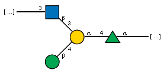

BAQ00622.1:

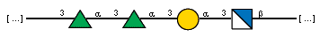

AQU71752.1:

AFW04820.1:

AFW04883.1:

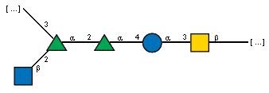

ABX51892.1:

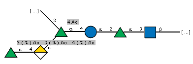

#### Sugars for blast hits:

#### Alphafold models:

[ADC54967.1](https://github.com/idameitil/phd/tree/master/data/wzy/alphafold/2202060002-wzy_100/af_out/ADC54967.1/ranked_0.pdb)

#### Taxonomy:

| order (count)          | family (count)             | genus (count)           |
|:-----------------------|:---------------------------|:------------------------|
| Bacteroidales (97)     | Prevotellaceae (40)        | Prevotella (37)         |
|                        |                            | Pseudoprevotella (1)    |
|                        |                            | Paraprevotella (1)      |
|                        |                            | Prevotellamassilia (1)  |
|                        | Bacteroidaceae (33)        | Bacteroides (11)        |
|                        |                            | Phocaeicola (1)         |
|                        | Rikenellaceae (7)          | Alistipes (7)           |
|                        | Paludibacteraceae (4)      | nan (9)                 |
|                        | Muribaculaceae (1)         | nan (9)                 |
|                        | Tannerellaceae (1)         | Parabacteroides (1)     |
| Enterobacterales (84)  | Enterobacteriaceae (68)    | Escherichia (25)        |
|                        |                            | Salmonella (14)         |
|                        |                            | Klebsiella (10)         |
|                        |                            | Enterobacter (8)        |
|                        |                            | Cronobacter (3)         |
|                        |                            | Citrobacter (3)         |
|                        |                            | Lelliottia (1)          |
|                        |                            | Cedecea (1)             |
|                        |                            | Jejubacter (1)          |
|                        |                            | Pseudocitrobacter (1)   |
|                        | Yersiniaceae (6)           | Yersinia (2)            |
|                        |                            | Rahnella (2)            |
|                        |                            | Ewingella (1)           |
|                        |                            | Serratia (1)            |
|                        | Morganellaceae (5)         | Providencia (3)         |
|                        |                            | Xenorhabdus (1)         |
|                        |                            | Proteus (1)             |
|                        | Pectobacteriaceae (3)      | Pectobacterium (2)      |
|                        |                            | Dickeya (1)             |
|                        | Budviciaceae (1)           | nan (9)                 |
|                        | Erwiniaceae (1)            | Pantoea (1)             |
| Flavobacteriales (24)  | Weeksellaceae (15)         | Chryseobacterium (11)   |
|                        |                            | Epilithonimonas (3)     |
|                        |                            | Kaistella (1)           |
|                        | Flavobacteriaceae (9)      | Flavobacterium (6)      |
|                        |                            | Maribacter (1)          |
|                        |                            | Cellulophaga (1)        |
| Burkholderiales (11)   | Oxalobacteraceae (5)       | Janthinobacterium (5)   |
|                        | Comamonadaceae (3)         | Comamonas (2)           |
|                        |                            | Acidovorax (1)          |
|                        | Burkholderiaceae (2)       | Ralstonia (1)           |
|                        |                            | Cupriavidus (1)         |
| nan (9)                | nan (22)                   | nan (9)                 |
| Sphingobacteriales (8) | Sphingobacteriaceae (8)    | Pedobacter (6)          |
|                        |                            | Arcticibacter (1)       |
|                        |                            | Mucilaginibacter (1)    |
| Moraxellales (5)       | Moraxellaceae (5)          | Acinetobacter (5)       |
| Chitinophagales (5)    | Chitinophagaceae (5)       | nan (9)                 |
|                        |                            | Chitinophaga (2)        |
|                        |                            | Ferruginibacter (1)     |
| Vibrionales (4)        | Vibrionaceae (4)           | Vibrio (3)              |
|                        |                            | Photobacterium (1)      |
| Pseudomonadales (4)    | Pseudomonadaceae (3)       | Pseudomonas (3)         |
|                        | Marinobacteraceae (1)      | Marinobacter (1)        |
| Lactobacillales (3)    | Enterococcaceae (2)        | Enterococcus (2)        |
|                        | Carnobacteriaceae (1)      | Marinilactibacillus (1) |
| Alteromonadales (3)    | Pseudoalteromonadaceae (1) | Pseudoalteromonas (1)   |
|                        | Moritellaceae (1)          | Moritella (1)           |
|                        | Colwelliaceae (1)          | Colwellia (1)           |
| Campylobacterales (3)  | Arcobacteraceae (1)        | Aliarcobacter (1)       |
|                        | Thiovulaceae (1)           | Sulfurimonas (1)        |
| Aeromonadales (3)      | Aeromonadaceae (3)         | Aeromonas (3)           |
| Cytophagales (2)       | Spirosomaceae (1)          | Dyadobacter (1)         |
|                        | Cyclobacteriaceae (1)      | Algoriphagus (1)        |
| Rickettsiales (1)      | nan (22)                   | nan (9)                 |
| Selenomonadales (1)    | Sporomusaceae (1)          | Pelosinus (1)           |
| Neisseriales (1)       | Chromobacteriaceae (1)     | Iodobacter (1)          |
| Aquificales (1)        | Aquificaceae (1)           | Hydrogenobacter (1)     |
| Desulfuromonadales (1) | Geobacteraceae (1)         | Geotalea (1)            |

[top](#navigation)

### Cluster 15
Total number of members in cluster: 258

Average length of proteins in cluster: 430.3

#### Conserved (non-aliphatic) residues: 

Y 503 (99.2%) R 506 (100.0%) Y 533 (99.2%) K 582 (97.3%) R 709 (100.0%) N 814 (99.2%) 

#### Seeds in cluster:

| protein_accession   | order            | family             | genus       | species          | serotype   |   Enterobacterial common antigen Wzy |
|:--------------------|:-----------------|:-------------------|:------------|:-----------------|:-----------|-------------------------------------:|
| CDF66396.1          | Enterobacterales | Yersiniaceae       | Yersinia    | Yersinia similis | O:9        |                                    0 |
| BAQ00780.1          | Enterobacterales | Enterobacteriaceae | Escherichia | Escherichia coli | O30        |                                    0 |

[MSA fasta](https://github.com/idameitil/phd/tree/master/data/wzy/ssn-clusterings/2206101141/clusters/0258_15/sequences.afa)

[Malign view](https://github.com/idameitil/phd/tree/master/data/wzy/ssn-clusterings/2206101141/clusters/0258_15/sequences.malign)

[Fasta of members](https://github.com/idameitil/phd/tree/master/data/wzy/ssn-clusterings/2206101141/clusters/0258_15/sequences.fa)

[Logoplot](https://github.com/idameitil/phd/tree/master/data/wzy/ssn-clusterings/2206101141/clusters/0258_15/sequences.logo.pdf)

[Phylogenetic tree](https://github.com/idameitil/phd/tree/master/data/wzy/ssn-clusterings/2206101141/clusters/0258_15/sequences.nwk)

[Hits in cluster](https://github.com/idameitil/phd/tree/master/data/wzy/ssn-clusterings/2206101141/clusters/0258_15/hits.tsv)

#### Sugars in cluster:

CDF66396.1:

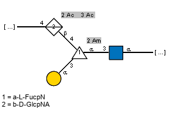

BAQ00780.1:

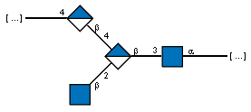

#### Sugars for blast hits:

#### Alphafold models:

[CDF66396.1](https://github.com/idameitil/phd/tree/master/data/wzy/alphafold/2205031317-wzy/af_out/CDF66396.1/ranked_0.pdb)

#### Taxonomy:

| order (count)           | family (count)                               | genus (count)                |
|:------------------------|:---------------------------------------------|:-----------------------------|
| Bacillales (79)         | Listeriaceae (49)                            | Listeria (49)                |
|                         | Bacillaceae (21)                             | Bacillus (12)                |
|                         |                                              | Peribacillus (4)             |
|                         |                                              | Halobacillus (1)             |
|                         |                                              | Neobacillus (1)              |
|                         |                                              | Virgibacillus (1)            |
|                         |                                              | Rossellomorea (1)            |
|                         | Paenibacillaceae (4)                         | Aneurinibacillus (3)         |
|                         |                                              | Cohnella (1)                 |
|                         | Staphylococcaceae (3)                        | Staphylococcus (2)           |
|                         |                                              | Jeotgalicoccus (1)           |
|                         | Planococcaceae (2)                           | Paenisporosarcina (1)        |
|                         |                                              | Planomicrobium (1)           |
| Bacteroidales (33)      | Prevotellaceae (14)                          | Prevotella (13)              |
|                         | Bacteroidaceae (6)                           | Bacteroides (6)              |
|                         | Odoribacteraceae (2)                         | Butyricimonas (2)            |
|                         | Porphyromonadaceae (2)                       | Sanguibacteroides (2)        |
| Flavobacteriales (28)   | Flavobacteriaceae (17)                       | Muricauda (3)                |
|                         |                                              | Flavobacterium (2)           |
|                         |                                              | Maribacter (2)               |
|                         |                                              | Myroides (1)                 |
|                         |                                              | Galbibacter (1)              |
|                         |                                              | Cellulophaga (1)             |
|                         |                                              | Winogradskyella (1)          |
|                         |                                              | Pseudozobellia (1)           |
|                         |                                              | Zobellia (1)                 |
|                         |                                              | Pareuzebyella (1)            |
|                         |                                              | Zeaxanthinibacter (1)        |
|                         |                                              | Aquimarina (1)               |
|                         |                                              | Polaribacter (1)             |
|                         | Weeksellaceae (6)                            | Chryseobacterium (5)         |
|                         |                                              | Elizabethkingia (1)          |
|                         | Crocinitomicaceae (1)                        | nan (2)                      |
| nan (13)                | nan (27)                                     | nan (2)                      |
| Burkholderiales (11)    | Comamonadaceae (5)                           | Ramlibacter (2)              |
|                         |                                              | Rhodoferax (2)               |
|                         |                                              | Limnohabitans (1)            |
|                         | Burkholderiaceae (3)                         | Pandoraea (2)                |
|                         | Alcaligenaceae (2)                           | Achromobacter (2)            |
|                         | Oxalobacteraceae (1)                         | Janthinobacterium (1)        |
| Hyphomicrobiales (11)   | Phyllobacteriaceae (8)                       | Mesorhizobium (7)            |
|                         |                                              | Hoeflea (1)                  |
|                         | Bradyrhizobiaceae (2)                        | Nitrobacter (1)              |
|                         |                                              | Afipia (1)                   |
|                         | Rhizobiaceae (1)                             | nan (2)                      |
| Eubacteriales (11)      | Clostridiaceae (4)                           | Caminicella (1)              |
|                         |                                              | Clostridium (1)              |
|                         |                                              | Alkaliphilus (1)             |
|                         |                                              | Paraclostridium (1)          |
|                         | Lachnospiraceae (2)                          | nan (2)                      |
|                         |                                              | Lachnoclostridium (1)        |
|                         | Oscillospiraceae (2)                         | Ruminiclostridium (1)        |
|                         |                                              | Hydrogenoanaerobacterium (1) |
|                         | Proteinivoraceae (1)                         | Anaerobranca (1)             |
|                         | Eubacteriales Family XII. Incertae Sedis (1) | Fusibacter (1)               |
| Sphingomonadales (9)    | Sphingomonadaceae (7)                        | Citromicrobium (2)           |
|                         |                                              | Sphingomonas (2)             |
|                         |                                              | Sphingopyxis (2)             |
|                         |                                              | Sphingobium (1)              |
|                         | Erythrobacteraceae (1)                       | Alteriqipengyuania (1)       |
|                         | Sphingosinicellaceae (1)                     | Sphingosinicella (1)         |
| Vibrionales (9)         | Vibrionaceae (9)                             | Vibrio (8)                   |
|                         |                                              | Aliivibrio (1)               |
| Enterobacterales (8)    | Enterobacteriaceae (4)                       | Escherichia (4)              |
|                         | Morganellaceae (3)                           | Xenorhabdus (2)              |
|                         |                                              | Proteus (1)                  |
|                         | Yersiniaceae (1)                             | Yersinia (1)                 |
| Lactobacillales (8)     | Enterococcaceae (6)                          | Enterococcus (6)             |
|                         | Carnobacteriaceae (1)                        | Carnobacterium (1)           |
|                         | Lactobacillaceae (1)                         | Ligilactobacillus (1)        |
| Pseudomonadales (6)     | Pseudomonadaceae (5)                         | Pseudomonas (5)              |
|                         | Marinobacteraceae (1)                        | Marinobacter (1)             |
| Moraxellales (5)        | Moraxellaceae (5)                            | Acinetobacter (5)            |
| Oceanospirillales (3)   | Oceanospirillaceae (2)                       | Marinomonas (1)              |
|                         |                                              | Oceanospirillum (1)          |
|                         | Halomonadaceae (1)                           | Halomonas (1)                |
| Alteromonadales (3)     | Idiomarinaceae (1)                           | Idiomarina (1)               |
|                         | Pseudoalteromonadaceae (1)                   | Pseudoalteromonas (1)        |
|                         | Alteromonadaceae (1)                         | Alteromonas (1)              |
| Campylobacterales (3)   | Arcobacteraceae (2)                          | Aliarcobacter (2)            |
|                         | Campylobacteraceae (1)                       | Campylobacter (1)            |
| Micrococcales (2)       | Microbacteriaceae (1)                        | Microbacterium (1)           |
|                         | Micrococcaceae (1)                           | Citricoccus (1)              |
| Nostocales (2)          | Aphanizomenonaceae (1)                       | Sphaerospermopsis (1)        |
|                         | Calotrichaceae (1)                           | Calothrix (1)                |
| Marinilabiliales (1)    | Marinifilaceae (1)                           | Marinifilum (1)              |
| Pseudonocardiales (1)   | Pseudonocardiaceae (1)                       | Pseudonocardia (1)           |
| Pirellulales (1)        | Pirellulaceae (1)                            | Lignipirellula (1)           |
| Planctomycetales (1)    | Planctomycetaceae (1)                        | Rubinisphaera (1)            |
| Micromonosporales (1)   | Micromonosporaceae (1)                       | Actinoplanes (1)             |
| Tissierellales (1)      | Tissierellaceae (1)                          | Tepidimicrobium (1)          |
| Sphingobacteriales (1)  | Sphingobacteriaceae (1)                      | Solitalea (1)                |
| Propionibacteriales (1) | Actinopolymorphaceae (1)                     | Actinopolymorpha (1)         |
| Elusimicrobiales (1)    | Elusimicrobiaceae (1)                        | nan (2)                      |
| Nitrosomonadales (1)    | Nitrosomonadaceae (1)                        | Nitrosomonas (1)             |
| Rhodobacterales (1)     | Roseobacteraceae (1)                         | Roseovarius (1)              |
| Chromatiales (1)        | Ectothiorhodospiraceae (1)                   | Thioalkalivibrio (1)         |
| Dictyoglomales (1)      | Dictyoglomaceae (1)                          | Dictyoglomus (1)             |
| Eggerthellales (1)      | Eggerthellaceae (1)                          | Adlercreutzia (1)            |

[top](#navigation)

### Cluster 9
Total number of members in cluster: 240

Average length of proteins in cluster: 353.5

#### Conserved (non-aliphatic) residues: 

R 234 (99.6%) D 240 (99.6%) Y 244 (99.6%) R 417 (99.2%) Q 418 (100.0%) H 459 (99.6%) Y 578 (97.5%) R 627 (97.9%) D 710 (97.9%) R 711 (100.0%) 

#### Seeds in cluster:

| protein_accession   | order        | family        | genus         | species                 | serotype   |   Enterobacterial common antigen Wzy |
|:--------------------|:-------------|:--------------|:--------------|:------------------------|:-----------|-------------------------------------:|
| AHB32215.1          | Moraxellales | Moraxellaceae | Acinetobacter | Acinetobacter baumannii | O1         |                                    0 |
| AHB32861.1          | Moraxellales | Moraxellaceae | Acinetobacter | Acinetobacter baumannii | O25        |                                    0 |
| AHB32799.1          | Moraxellales | Moraxellaceae | Acinetobacter | Acinetobacter baumannii | O26        |                                    0 |

[MSA fasta](https://github.com/idameitil/phd/tree/master/data/wzy/ssn-clusterings/2206101141/clusters/0240_9/sequences.afa)

[Malign view](https://github.com/idameitil/phd/tree/master/data/wzy/ssn-clusterings/2206101141/clusters/0240_9/sequences.malign)

[Fasta of members](https://github.com/idameitil/phd/tree/master/data/wzy/ssn-clusterings/2206101141/clusters/0240_9/sequences.fa)

[Logoplot](https://github.com/idameitil/phd/tree/master/data/wzy/ssn-clusterings/2206101141/clusters/0240_9/sequences.logo.pdf)

[Phylogenetic tree](https://github.com/idameitil/phd/tree/master/data/wzy/ssn-clusterings/2206101141/clusters/0240_9/sequences.nwk)

[Hits in cluster](https://github.com/idameitil/phd/tree/master/data/wzy/ssn-clusterings/2206101141/clusters/0240_9/hits.tsv)

#### Sugars in cluster:

AHB32215.1:

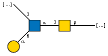

#### Sugars for blast hits:

#### Alphafold models:

[AHB32215.1](https://github.com/idameitil/phd/tree/master/data/wzy/alphafold/2202060002-wzy_100/af_out/AHB32215.1/ranked_0.pdb)

[AHB32861.1](https://github.com/idameitil/phd/tree/master/data/wzy/alphafold/2202060002-wzy_100/af_out/AHB32861.1/ranked_0.pdb)

#### Taxonomy:

| order (count)            | family (count)             | genus (count)               |
|:-------------------------|:---------------------------|:----------------------------|
| Sphingomonadales (49)    | Sphingomonadaceae (44)     | Sphingomonas (34)           |
|                          |                            | Novosphingobium (5)         |
|                          |                            | nan (2)                     |
|                          |                            | Allosphingosinicella (1)    |
|                          |                            | Novosphingopyxis (1)        |
|                          |                            | Sphingorhabdus (1)          |
|                          | Erythrobacteraceae (3)     | Pontixanthobacter (3)       |
|                          | Sphingosinicellaceae (2)   | Sphingosinicella (2)        |
| nan (26)                 | nan (2)                    | nan (2)                     |
| Moraxellales (21)        | Moraxellaceae (21)         | Acinetobacter (21)          |
| Hyphomicrobiales (17)    | Methylocystaceae (6)       | Methylosinus (3)            |
|                          |                            | Methylocystis (3)           |
|                          | Phyllobacteriaceae (5)     | Mesorhizobium (2)           |
|                          |                            | Tianweitania (1)            |
|                          |                            | Pseudaminobacter (1)        |
|                          |                            | Hoeflea (1)                 |
|                          | Devosiaceae (2)            | Devosia (2)                 |
|                          | Aurantimonadaceae (2)      | Aurantimonas (1)            |
|                          |                            | Aureimonas (1)              |
|                          | Rhizobiaceae (1)           | nan (2)                     |
|                          | Hyphomicrobiaceae (1)      | Rhodomicrobium (1)          |
| Campylobacterales (15)   | Campylobacteraceae (9)     | Campylobacter (8)           |
|                          | Sulfurovaceae (4)          | Sulfurovum (4)              |
|                          | Thiovulaceae (1)           | Sulfurimonas (1)            |
|                          | Arcobacteraceae (1)        | Poseidonibacter (1)         |
| Vibrionales (14)         | Vibrionaceae (14)          | Vibrio (11)                 |
|                          |                            | Photobacterium (3)          |
| Oceanospirillales (10)   | Alcanivoracaceae (6)       | Alcanivorax (6)             |
|                          | Halomonadaceae (3)         | Halomonas (3)               |
|                          | Oceanospirillaceae (1)     | Marinobacterium (1)         |
| Xanthomonadales (8)      | Xanthomonadaceae (6)       | Luteimonas (5)              |
|                          |                            | Pseudoxanthomonas (1)       |
|                          | Rhodanobacteraceae (2)     | Rhodanobacter (1)           |
|                          |                            | Dokdonella (1)              |
| Rhodobacterales (7)      | Rhodobacteraceae (4)       | Thioclava (2)               |
|                          |                            | Rhodovulum (1)              |
|                          | Roseobacteraceae (3)       | Maritimibacter (1)          |
|                          |                            | Sulfitobacter (1)           |
|                          |                            | Jannaschia (1)              |
| Burkholderiales (7)      | Comamonadaceae (3)         | Polaromonas (1)             |
|                          |                            | Ramlibacter (1)             |
|                          |                            | Diaphorobacter (1)          |
|                          | Burkholderiaceae (3)       | Polynucleobacter (3)        |
| Enterobacterales (6)     | Morganellaceae (5)         | Proteus (3)                 |
|                          |                            | Photorhabdus (1)            |
|                          |                            | Xenorhabdus (1)             |
|                          | Enterobacteriaceae (1)     | Enterobacter (1)            |
| Pseudomonadales (6)      | Marinobacteraceae (5)      | Marinobacter (5)            |
|                          | Pseudomonadaceae (1)       | Pseudomonas (1)             |
| Flavobacteriales (4)     | Flavobacteriaceae (1)      | Capnocytophaga (1)          |
|                          | Crocinitomicaceae (1)      | nan (2)                     |
|                          | Weeksellaceae (1)          | Chryseobacterium (1)        |
| Chromatiales (4)         | Ectothiorhodospiraceae (2) | Alkalilimnicola (1)         |
|                          |                            | Spiribacter (1)             |
|                          | Chromatiaceae (2)          | Candidatus Thiosymbion (2)  |
| Synechococcales (4)      | Synechococcaceae (3)       | Synechococcus (3)           |
|                          | Prochlorococcaceae (1)     | Prochlorococcus (1)         |
| Pasteurellales (3)       | Pasteurellaceae (3)        | Actinobacillus (3)          |
| Aeromonadales (3)        | Aeromonadaceae (3)         | Aeromonas (3)               |
| Pseudanabaenales (3)     | Thermosynechococcaceae (3) | Thermosynechococcus (3)     |
| Thermotogales (3)        | Thermotogaceae (2)         | Pseudothermotoga (1)        |
|                          |                            | Thermotoga (1)              |
|                          | Fervidobacteriaceae (1)    | Fervidobacterium (1)        |
| Thermostichales (2)      | Thermostichaceae (2)       | Thermostichus (2)           |
| Nitrosomonadales (2)     | nan (2)                    | nan (2)                     |
|                          | Methylophilaceae (1)       | nan (2)                     |
| Salinisphaerales (2)     | Salinisphaeraceae (2)      | Salinisphaera (2)           |
| Cellvibrionales (2)      | Halieaceae (2)             | Haliea (2)                  |
| Caulobacterales (2)      | Caulobacteraceae (2)       | Caulobacter (1)             |
|                          |                            | Brevundimonas (1)           |
| Desulfuromonadales (2)   | Desulfuromonadaceae (2)    | Desulfuromonas (2)          |
| Nevskiales (2)           | Sinobacteraceae (2)        | Fontimonas (1)              |
|                          |                            | Flagellatimonas (1)         |
| Desulfobacterales (2)    | Desulfobulbaceae (1)       | Candidatus Electrothrix (1) |
|                          | Desulfocapsaceae (1)       | Desulfopila (1)             |
| Methylococcales (2)      | Methylococcaceae (2)       | Methylovulum (1)            |
|                          |                            | Methylobacter (1)           |
| Pirellulales (2)         | Pirellulaceae (2)          | Rhodopirellula (2)          |
| Hydrogenophilales (1)    | Hydrogenophilaceae (1)     | Tepidiphilus (1)            |
| Neisseriales (1)         | Chromobacteriaceae (1)     | Chromobacterium (1)         |
| Rhodocyclales (1)        | Azonexaceae (1)            | Dechloromonas (1)           |
| Bacteroidales (1)        | Lentimicrobiaceae (1)      | nan (2)                     |
| Mariprofundales (1)      | Mariprofundaceae (1)       | Mariprofundus (1)           |
| Leptospirales (1)        | Leptospiraceae (1)         | nan (2)                     |
| Acidiferrobacterales (1) | Acidiferrobacteraceae (1)  | nan (2)                     |
| Desulfurellales (1)      | Desulfurellaceae (1)       | Hippea (1)                  |
| Pelagibacterales (1)     | Pelagibacteraceae (1)      | nan (2)                     |
| Rickettsiales (1)        | nan (2)                    | nan (2)                     |

[top](#navigation)

### Cluster 11
Total number of members in cluster: 152

Average length of proteins in cluster: 412.2

#### Conserved (non-aliphatic) residues: 

R 593 (100.0%) Y 633 (98.0%) D 664 (100.0%) 

#### Seeds in cluster:

| protein_accession   | order           | family           | genus         | species                  | serotype   |   Enterobacterial common antigen Wzy |
|:--------------------|:----------------|:-----------------|:--------------|:-------------------------|:-----------|-------------------------------------:|
| CAI34150.1          | Lactobacillales | Streptococcaceae | Streptococcus | Streptococcus pneumoniae | 32F        |                                    0 |
| CAI34124.1          | Lactobacillales | Streptococcaceae | Streptococcus | Streptococcus pneumoniae | 32A        |                                    0 |
| CAI34680.1          | Lactobacillales | Streptococcaceae | Streptococcus | Streptococcus pneumoniae | 48         |                                    0 |

[MSA fasta](https://github.com/idameitil/phd/tree/master/data/wzy/ssn-clusterings/2206101141/clusters/0152_11/sequences.afa)

[Malign view](https://github.com/idameitil/phd/tree/master/data/wzy/ssn-clusterings/2206101141/clusters/0152_11/sequences.malign)

[Fasta of members](https://github.com/idameitil/phd/tree/master/data/wzy/ssn-clusterings/2206101141/clusters/0152_11/sequences.fa)

[Logoplot](https://github.com/idameitil/phd/tree/master/data/wzy/ssn-clusterings/2206101141/clusters/0152_11/sequences.logo.pdf)

[Phylogenetic tree](https://github.com/idameitil/phd/tree/master/data/wzy/ssn-clusterings/2206101141/clusters/0152_11/sequences.nwk)

[Hits in cluster](https://github.com/idameitil/phd/tree/master/data/wzy/ssn-clusterings/2206101141/clusters/0152_11/hits.tsv)

#### Sugars in cluster:

CAI34150.1:

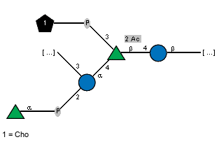

CAI34124.1:

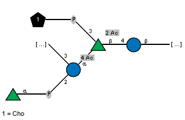

#### Sugars for blast hits:

#### Alphafold models:

[CAI34124.1](https://github.com/idameitil/phd/tree/master/data/wzy/alphafold/2205031317-wzy/af_out/CAI34124.1/ranked_0.pdb)

#### Taxonomy:

| order (count)          | family (count)            | genus (count)               |
|:-----------------------|:--------------------------|:----------------------------|
| Eubacteriales (66)     | Lachnospiraceae (27)      | nan (6)                     |
|                        |                           | Blautia (4)                 |
|                        |                           | Coprococcus (2)             |
|                        |                           | Anaerostipes (2)            |
|                        |                           | Mediterraneibacter (2)      |
|                        |                           | Lachnospira (1)             |
|                        |                           | Oribacterium (1)            |
|                        |                           | Oliverpabstia (1)           |
|                        |                           | Lachnotalea (1)             |
|                        |                           | Anaerobutyricum (1)         |
|                        |                           | Butyrivibrio (1)            |
|                        |                           | Lacrimispora (1)            |
|                        | Clostridiaceae (20)       | Clostridium (19)            |
|                        |                           | Paraclostridium (1)         |
|                        | Oscillospiraceae (9)      | nan (6)                     |
|                        |                           | Ruminococcus (2)            |
|                        |                           | Ruminiclostridium (2)       |
|                        |                           | Faecalibacterium (1)        |
|                        |                           | Drancourtella (1)           |
|                        | Eubacteriaceae (6)        | Eubacterium (6)             |
|                        | nan (5)                   | nan (6)                     |
|                        | Peptostreptococcaceae (1) | Romboutsia (1)              |
| Lactobacillales (38)   | Lactobacillaceae (18)     | Lactobacillus (7)           |
|                        |                           | Leuconostoc (2)             |
|                        |                           | Levilactobacillus (2)       |
|                        |                           | Lactiplantibacillus (2)     |
|                        |                           | Loigolactobacillus (1)      |
|                        |                           | Weissella (1)               |
|                        |                           | Ligilactobacillus (1)       |
|                        |                           | Limosilactobacillus (1)     |
|                        | Enterococcaceae (10)      | Enterococcus (10)           |
|                        | Streptococcaceae (9)      | Streptococcus (8)           |
|                        |                           | Lactococcus (1)             |
|                        | Carnobacteriaceae (1)     | Carnobacterium (1)          |
| Bacillales (20)        | Listeriaceae (15)         | Listeria (15)               |
|                        | Bacillaceae (5)           | Priestia (4)                |
|                        |                           | Bacillus (1)                |
| Coriobacteriales (9)   | Coriobacteriaceae (9)     | Collinsella (9)             |
| Erysipelotrichales (5) | Erysipelotrichaceae (5)   | Erysipelatoclostridium (2)  |
|                        |                           | Lactimicrobium (1)          |
|                        |                           | Amedibacillus (1)           |
|                        |                           | Candidatus Stoquefichus (1) |
| Eggerthellales (4)     | Eggerthellaceae (4)       | Gordonibacter (1)           |
|                        |                           | Slackia (1)                 |
|                        |                           | Eggerthella (1)             |
|                        |                           | Adlercreutzia (1)           |
| Bacteroidales (3)      | Bacteroidaceae (2)        | Bacteroides (1)             |
|                        |                           | Phocaeicola (1)             |
|                        | Muribaculaceae (1)        | Duncaniella (1)             |
| nan (3)                | nan (5)                   | nan (6)                     |
| Fibrobacterales (1)    | Fibrobacteraceae (1)      | Fibrobacter (1)             |
| Bifidobacteriales (1)  | Bifidobacteriaceae (1)    | Bifidobacterium (1)         |
| Aeromonadales (1)      | Succinivibrionaceae (1)   | nan (6)                     |
| Tissierellales (1)     | Peptoniphilaceae (1)      | Anaerococcus (1)            |

[top](#navigation)

### Cluster 6
Total number of members in cluster: 139

Average length of proteins in cluster: 443.5

#### Conserved (non-aliphatic) residues: 

R 401 (100.0%) Y 510 (100.0%) N 608 (100.0%) D 619 (97.1%) 

#### Seeds in cluster:

| protein_accession   | order           | family           | genus         | species                  | serotype   |   Enterobacterial common antigen Wzy |
|:--------------------|:----------------|:-----------------|:--------------|:-------------------------|:-----------|-------------------------------------:|
| CAI32823.1          | Lactobacillales | Streptococcaceae | Streptococcus | Streptococcus pneumoniae | 6A         |                                    0 |
| CAI32843.1          | Lactobacillales | Streptococcaceae | Streptococcus | Streptococcus pneumoniae | 6B         |                                    0 |
| CAI33700.1          | Lactobacillales | Streptococcaceae | Streptococcus | Streptococcus pneumoniae | 19F        |                                    0 |
| CAI33631.1          | Lactobacillales | Streptococcaceae | Streptococcus | Streptococcus pneumoniae | 19A        |                                    0 |
| CAI34269.1          | Lactobacillales | Streptococcaceae | Streptococcus | Streptococcus pneumoniae | 34         |                                    0 |

[MSA fasta](https://github.com/idameitil/phd/tree/master/data/wzy/ssn-clusterings/2206101141/clusters/0139_6/sequences.afa)

[Malign view](https://github.com/idameitil/phd/tree/master/data/wzy/ssn-clusterings/2206101141/clusters/0139_6/sequences.malign)

[Fasta of members](https://github.com/idameitil/phd/tree/master/data/wzy/ssn-clusterings/2206101141/clusters/0139_6/sequences.fa)

[Logoplot](https://github.com/idameitil/phd/tree/master/data/wzy/ssn-clusterings/2206101141/clusters/0139_6/sequences.logo.pdf)

[Phylogenetic tree](https://github.com/idameitil/phd/tree/master/data/wzy/ssn-clusterings/2206101141/clusters/0139_6/sequences.nwk)

[Hits in cluster](https://github.com/idameitil/phd/tree/master/data/wzy/ssn-clusterings/2206101141/clusters/0139_6/hits.tsv)

#### Sugars in cluster:

CAI32823.1:

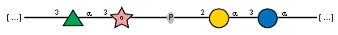

CAI32843.1:

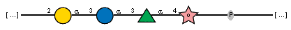

CAI33700.1:

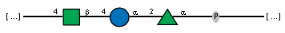

CAI33631.1:

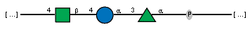

CAI34269.1:

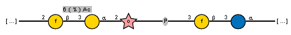

#### Sugars for blast hits:

AAL82786.1:

VJK41440.1:

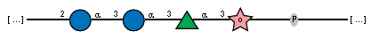

VNC99741.1, VSB76654.1, CMX58981.1:

VOS41126.1:

VMG48693.1:

#### Alphafold models:

#### Taxonomy:

| order (count)          | family (count)          | genus (count)                       |
|:-----------------------|:------------------------|:------------------------------------|
| Lactobacillales (67)   | Streptococcaceae (35)   | Streptococcus (35)                  |
|                        | Lactobacillaceae (19)   | Lactobacillus (5)                   |
|                        |                         | Limosilactobacillus (3)             |
|                        |                         | Liquorilactobacillus (2)            |
|                        |                         | Lactiplantibacillus (2)             |
|                        |                         | Leuconostoc (1)                     |
|                        |                         | Levilactobacillus (1)               |
|                        |                         | Ligilactobacillus (1)               |
|                        |                         | Companilactobacillus (1)            |
|                        |                         | Lacticaseibacillus (1)              |
|                        |                         | Latilactobacillus (1)               |
|                        |                         | Lentilactobacillus (1)              |
|                        | nan (11)                | nan (2)                             |
|                        | Enterococcaceae (11)    | Enterococcus (11)                   |
|                        | Carnobacteriaceae (1)   | Carnobacterium (1)                  |
| Eubacteriales (41)     | Lachnospiraceae (20)    | Blautia (5)                         |
|                        |                         | Butyrivibrio (2)                    |
|                        |                         | Coprococcus (2)                     |
|                        |                         | Anaerostipes (1)                    |
|                        |                         | Enterocloster (1)                   |
|                        |                         | Lachnoclostridium (1)               |
|                        |                         | Roseburia (1)                       |
|                        |                         | Oribacterium (1)                    |
|                        |                         | Sellimonas (1)                      |
|                        |                         | Epulopiscium (1)                    |
|                        | Oscillospiraceae (9)    | Faecalibacterium (4)                |
|                        |                         | nan (2)                             |
|                        |                         | Drancourtella (1)                   |
|                        | Clostridiaceae (6)      | Clostridium (4)                     |
|                        |                         | Massilioclostridium (1)             |
|                        |                         | Youngiibacter (1)                   |
|                        | Eubacteriaceae (2)      | Eubacterium (2)                     |
|                        | Xylanivirgaceae (1)     | Xylanivirga (1)                     |
|                        | Christensenellaceae (1) | Christensenella (1)                 |
| nan (10)               | nan (11)                | Candidatus Avigastranaerophilus (1) |
| Pasteurellales (5)     | Pasteurellaceae (5)     | Haemophilus (2)                     |
|                        |                         | Actinobacillus (1)                  |
|                        |                         | Mannheimia (1)                      |
|                        |                         | Pasteurella (1)                     |
| Coriobacteriales (4)   | Coriobacteriaceae (3)   | nan (2)                             |
|                        |                         | Collinsella (2)                     |
|                        | Atopobiaceae (1)        | Olsenella (1)                       |
| Bifidobacteriales (3)  | Bifidobacteriaceae (3)  | Bifidobacterium (3)                 |
| Erysipelotrichales (3) | Erysipelotrichaceae (2) | Massilimicrobiota (1)               |
|                        |                         | Absiella (1)                        |
|                        | Coprobacillaceae (1)    | Sharpea (1)                         |
| Bacillales (2)         | Bacillaceae (1)         | Bacillus (1)                        |
|                        | Paenibacillaceae (1)    | Paenibacillus (1)                   |
| Synergistales (1)      | Synergistaceae (1)      | Cloacibacillus (1)                  |
| Fusobacteriales (1)    | Fusobacteriaceae (1)    | Fusobacterium (1)                   |
| Methanobacteriales (1) | Methanobacteriaceae (1) | Methanobrevibacter (1)              |
| Anaerolineales (1)     | Anaerolineaceae (1)     | nan (2)                             |

[top](#navigation)

### Cluster 29
Total number of members in cluster: 136

Average length of proteins in cluster: 394.0

#### Conserved (non-aliphatic) residues: 

R 292 (98.5%) R 364 (99.3%) Y 423 (97.8%) Y 425 (100.0%) N 432 (98.5%) 

#### Seeds in cluster:

| protein_accession   | order            | family             | genus         | species                 | serotype   |   Enterobacterial common antigen Wzy |
|:--------------------|:-----------------|:-------------------|:--------------|:------------------------|:-----------|-------------------------------------:|
| AHB32411.1          | Moraxellales     | Moraxellaceae      | Acinetobacter | Acinetobacter baumannii | O10        |                                    0 |
| AFC91458.1          | Enterobacterales | Enterobacteriaceae | Escherichia   | Escherichia coli        | O45        |                                    0 |
| AFC91419.1          | Enterobacterales | Enterobacteriaceae | Escherichia   | Escherichia coli        | O45        |                                    0 |
| AAX07747.1          | Enterobacterales | Enterobacteriaceae | Escherichia   | Escherichia coli        | O45        |                                    0 |

[MSA fasta](https://github.com/idameitil/phd/tree/master/data/wzy/ssn-clusterings/2206101141/clusters/0136_29/sequences.afa)

[Malign view](https://github.com/idameitil/phd/tree/master/data/wzy/ssn-clusterings/2206101141/clusters/0136_29/sequences.malign)

[Fasta of members](https://github.com/idameitil/phd/tree/master/data/wzy/ssn-clusterings/2206101141/clusters/0136_29/sequences.fa)

[Logoplot](https://github.com/idameitil/phd/tree/master/data/wzy/ssn-clusterings/2206101141/clusters/0136_29/sequences.logo.pdf)

[Phylogenetic tree](https://github.com/idameitil/phd/tree/master/data/wzy/ssn-clusterings/2206101141/clusters/0136_29/sequences.nwk)

[Hits in cluster](https://github.com/idameitil/phd/tree/master/data/wzy/ssn-clusterings/2206101141/clusters/0136_29/hits.tsv)

#### Sugars in cluster:

AHB32411.1:

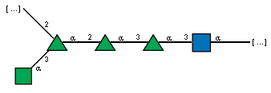

AFC91458.1, AFC91419.1, AAX07747.1:

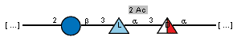

#### Sugars for blast hits:

#### Alphafold models:

[AHB32411.1](https://github.com/idameitil/phd/tree/master/data/wzy/alphafold/2202060002-wzy_100/af_out/AHB32411.1/ranked_0.pdb)

#### Taxonomy:

| order (count)           | family (count)            | genus (count)           |
|:------------------------|:--------------------------|:------------------------|
| Enterobacterales (25)   | Enterobacteriaceae (19)   | Escherichia (7)         |
|                         |                           | Klebsiella (5)          |
|                         |                           | Enterobacter (5)        |
|                         |                           | Raoultella (1)          |
|                         |                           | Kosakonia (1)           |
|                         | Pectobacteriaceae (4)     | Pectobacterium (3)      |
|                         |                           | Brenneria (1)           |
|                         | Yersiniaceae (2)          | Rahnella (1)            |
|                         |                           | Serratia (1)            |
| Sphingobacteriales (16) | Sphingobacteriaceae (16)  | Pedobacter (9)          |
|                         |                           | Mucilaginibacter (6)    |
| Lactobacillales (14)    | Lactobacillaceae (9)      | Latilactobacillus (3)   |
|                         |                           | Lacticaseibacillus (2)  |
|                         |                           | Lactobacillus (1)       |
|                         |                           | Lactiplantibacillus (1) |
|                         |                           | Lapidilactobacillus (1) |
|                         |                           | Ligilactobacillus (1)   |
|                         | Carnobacteriaceae (4)     | Carnobacterium (3)      |
|                         |                           | Isobaculum (1)          |
|                         | Streptococcaceae (1)      | Streptococcus (1)       |
| Bacteroidales (12)      | Bacteroidaceae (8)        | Bacteroides (7)         |
|                         |                           | Phocaeicola (1)         |
|                         | Muribaculaceae (2)        | nan (3)                 |
|                         | Prevotellaceae (1)        | Prevotella (1)          |
| Eubacteriales (9)       | Clostridiaceae (6)        | Clostridium (6)         |
|                         | Peptostreptococcaceae (1) | Romboutsia (1)          |
|                         | Eubacteriaceae (1)        | nan (3)                 |
| Burkholderiales (8)     | Burkholderiaceae (8)      | Ralstonia (8)           |
| Pseudomonadales (8)     | Pseudomonadaceae (8)      | Pseudomonas (8)         |
| Bacillales (7)          | Bacillaceae (6)           | Bacillus (4)            |
|                         |                           | Rossellomorea (1)       |
|                         | Sporolactobacillaceae (1) | Sporolactobacillus (1)  |
| Flavobacteriales (6)    | Flavobacteriaceae (6)     | Flavobacterium (5)      |
|                         |                           | Maribacter (1)          |
| Moraxellales (5)        | Moraxellaceae (5)         | Acinetobacter (5)       |
| Cytophagales (5)        | Cytophagaceae (2)         | Spirosoma (2)           |
|                         | Spirosomaceae (2)         | Fibrella (2)            |
|                         | Reichenbachiellaceae (1)  | Reichenbachiella (1)    |
| Vibrionales (4)         | Vibrionaceae (4)          | Vibrio (3)              |
|                         |                           | Photobacterium (1)      |
| nan (2)                 | nan (1)                   | nan (3)                 |
| Chitinophagales (2)     | Chitinophagaceae (2)      | Ilyomonas (1)           |
| Aeromonadales (2)       | Aeromonadaceae (2)        | Aeromonas (2)           |
| Sphingomonadales (2)    | Sphingomonadaceae (2)     | Sphingomonas (2)        |
| Rhodospirillales (2)    | Rhodospirillaceae (2)     | Inquilinus (2)          |
| Methanotrichales (1)    | Methanotrichaceae (1)     | Methanothrix (1)        |
| Nostocales (1)          | Calotrichaceae (1)        | Calothrix (1)           |
| Chlorobiales (1)        | Chlorobiaceae (1)         | nan (3)                 |
| Rickettsiales (1)       | nan (1)                   | nan (3)                 |
| Spirochaetales (1)      | Treponemataceae (1)       | Treponema (1)           |
| Acidobacteriales (1)    | Acidobacteriaceae (1)     | Granulicella (1)        |
| Salinisphaerales (1)    | Salinisphaeraceae (1)     | Salinisphaera (1)       |

[top](#navigation)

### Cluster 23
Total number of members in cluster: 134

Average length of proteins in cluster: 356.2

#### Conserved (non-aliphatic) residues: 

R 163 (99.3%) D 170 (100.0%) Y 175 (100.0%) R 298 (100.0%) H 336 (100.0%) R 561 (100.0%) 

#### Seeds in cluster:

| protein_accession   | order           | family           | genus         | species                  | serotype   |   Enterobacterial common antigen Wzy |
|:--------------------|:----------------|:-----------------|:--------------|:-------------------------|:-----------|-------------------------------------:|
| AHB32715.1          | Moraxellales    | Moraxellaceae    | Acinetobacter | Acinetobacter baumannii  | O23        |                                    0 |
| AHB32637.1          | Moraxellales    | Moraxellaceae    | Acinetobacter | Acinetobacter baumannii  | O23        |                                    0 |
| CAI33718.1          | Lactobacillales | Streptococcaceae | Streptococcus | Streptococcus pneumoniae | 20         |                                    0 |

[MSA fasta](https://github.com/idameitil/phd/tree/master/data/wzy/ssn-clusterings/2206101141/clusters/0134_23/sequences.afa)

[Malign view](https://github.com/idameitil/phd/tree/master/data/wzy/ssn-clusterings/2206101141/clusters/0134_23/sequences.malign)

[Fasta of members](https://github.com/idameitil/phd/tree/master/data/wzy/ssn-clusterings/2206101141/clusters/0134_23/sequences.fa)

[Logoplot](https://github.com/idameitil/phd/tree/master/data/wzy/ssn-clusterings/2206101141/clusters/0134_23/sequences.logo.pdf)

[Phylogenetic tree](https://github.com/idameitil/phd/tree/master/data/wzy/ssn-clusterings/2206101141/clusters/0134_23/sequences.nwk)

[Hits in cluster](https://github.com/idameitil/phd/tree/master/data/wzy/ssn-clusterings/2206101141/clusters/0134_23/hits.tsv)

#### Sugars in cluster:

AHB32715.1, AHB32637.1:

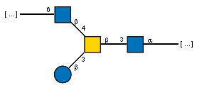

CAI33718.1:

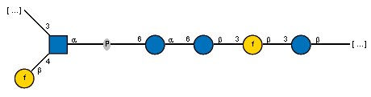

#### Sugars for blast hits:

VLD07009.1:

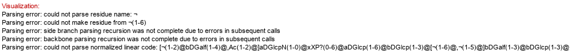

#### Alphafold models:

#### Taxonomy:

| order (count)          | family (count)             | genus (count)            |
|:-----------------------|:---------------------------|:-------------------------|
| Moraxellales (39)      | Moraxellaceae (39)         | Acinetobacter (23)       |
|                        |                            | Psychrobacter (13)       |
|                        |                            | Moraxella (2)            |
| Lactobacillales (29)   | Lactobacillaceae (19)      | Lactiplantibacillus (7)  |
|                        |                            | Pediococcus (6)          |
|                        |                            | Loigolactobacillus (1)   |
|                        |                            | Lactobacillus (1)        |
|                        |                            | Weissella (1)            |
|                        |                            | Companilactobacillus (1) |
|                        |                            | Latilactobacillus (1)    |
|                        |                            | Leuconostoc (1)          |
|                        | Streptococcaceae (5)       | Streptococcus (5)        |
|                        | Enterococcaceae (5)        | Enterococcus (5)         |
| Eubacteriales (18)     | Lachnospiraceae (9)        | nan (5)                  |
|                        |                            | Eisenbergiella (1)       |
|                        | Clostridiaceae (5)         | Clostridium (5)          |
|                        | Oscillospiraceae (3)       | Ruminiclostridium (1)    |
|                        |                            | Ruminococcus (1)         |
|                        |                            | Faecalibacterium (1)     |
| Enterobacterales (13)  | Enterobacteriaceae (10)    | Klebsiella (7)           |
|                        |                            | Raoultella (2)           |
|                        |                            | Escherichia (1)          |
|                        | Erwiniaceae (2)            | Pantoea (1)              |
|                        |                            | Erwinia (1)              |
|                        | Hafniaceae (1)             | Edwardsiella (1)         |
| Flavobacteriales (6)   | Flavobacteriaceae (6)      | Flavobacterium (3)       |
|                        |                            | Lutibacter (1)           |
|                        |                            | Robertkochia (1)         |
| nan (6)                | nan (2)                    | Candidatus Coprosoma (1) |
| Bacillales (5)         | Bacillaceae (3)            | Bacillus (2)             |
|                        |                            | Halobacillus (1)         |
|                        | nan (2)                    | Exiguobacterium (1)      |
|                        | Sporolactobacillaceae (1)  | Sporolactobacillus (1)   |
| Bacteroidales (3)      | Bacteroidaceae (2)         | Bacteroides (2)          |
|                        | Tannerellaceae (1)         | Parabacteroides (1)      |
| Alteromonadales (3)    | Colwelliaceae (1)          | Thalassotalea (1)        |
|                        | Shewanellaceae (1)         | Shewanella (1)           |
|                        | Pseudoalteromonadaceae (1) | Pseudoalteromonas (1)    |
| Fibrobacterales (2)    | Fibrobacteraceae (2)       | Fibrobacter (2)          |
| Xanthomonadales (2)    | Xanthomonadaceae (2)       | Lysobacter (1)           |
|                        |                            | Stenotrophomonas (1)     |
| Vibrionales (2)        | Vibrionaceae (2)           | Vibrio (2)               |
| Pseudomonadales (1)    | Marinobacteraceae (1)      | Marinobacter (1)         |
| Sphingomonadales (1)   | Erythrobacteraceae (1)     | Alteriqipengyuania (1)   |
| Oceanospirillales (1)  | Halomonadaceae (1)         | Halomonas (1)            |
| Chromatiales (1)       | Chromatiaceae (1)          | Rheinheimera (1)         |
| Erysipelotrichales (1) | Coprobacillaceae (1)       | Coprobacillus (1)        |
| Coriobacteriales (1)   | nan (2)                    | nan (5)                  |

[top](#navigation)

### Cluster 50
Total number of members in cluster: 129

Average length of proteins in cluster: 452.7

#### Conserved (non-aliphatic) residues: 

R 250 (97.7%) K 324 (100.0%) R 402 (100.0%) K 516 (98.4%) 

#### Seeds in cluster:

| protein_accession   | order            | family             | genus       | species          | serotype   |   Enterobacterial common antigen Wzy |
|:--------------------|:-----------------|:-------------------|:------------|:-----------------|:-----------|-------------------------------------:|
| AAT77177.1          | Enterobacterales | Enterobacteriaceae | Escherichia | Escherichia coli | O114       |                                    0 |
| AFN02899.1          | Enterobacterales | Enterobacteriaceae | Escherichia | Escherichia coli | O180       |                                    0 |
| BAQ00569.1          | Enterobacterales | Enterobacteriaceae | Escherichia | Escherichia coli | O5         |                                    0 |

[MSA fasta](https://github.com/idameitil/phd/tree/master/data/wzy/ssn-clusterings/2206101141/clusters/0129_50/sequences.afa)

[Malign view](https://github.com/idameitil/phd/tree/master/data/wzy/ssn-clusterings/2206101141/clusters/0129_50/sequences.malign)

[Fasta of members](https://github.com/idameitil/phd/tree/master/data/wzy/ssn-clusterings/2206101141/clusters/0129_50/sequences.fa)

[Logoplot](https://github.com/idameitil/phd/tree/master/data/wzy/ssn-clusterings/2206101141/clusters/0129_50/sequences.logo.pdf)

[Phylogenetic tree](https://github.com/idameitil/phd/tree/master/data/wzy/ssn-clusterings/2206101141/clusters/0129_50/sequences.nwk)

[Hits in cluster](https://github.com/idameitil/phd/tree/master/data/wzy/ssn-clusterings/2206101141/clusters/0129_50/hits.tsv)

#### Sugars in cluster:

AAT77177.1:

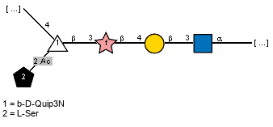

AFN02899.1:

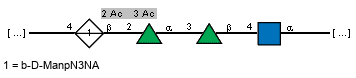

BAQ00569.1:

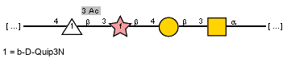

#### Sugars for blast hits:

#### Alphafold models:

[AAT77177.1](https://github.com/idameitil/phd/tree/master/data/wzy/alphafold/2202060002-wzy_100/af_out/AAT77177.1/ranked_0.pdb)

#### Taxonomy:

| order (count)         | family (count)             | genus (count)          |
|:----------------------|:---------------------------|:-----------------------|
| Bacillales (53)       | Bacillaceae (49)           | Bacillus (14)          |
|                       |                            | Geobacillus (11)       |
|                       |                            | Cytobacillus (7)       |
|                       |                            | nan (5)                |
|                       |                            | Psychrobacillus (4)    |
|                       |                            | Anoxybacillus (2)      |
|                       |                            | Metabacillus (2)       |
|                       |                            | Fictibacillus (2)      |
|                       |                            | Alkalihalobacillus (1) |
|                       |                            | Siminovitchia (1)      |
|                       |                            | Lederbergia (1)        |
|                       | Thermoactinomycetaceae (3) | Risungbinella (1)      |
|                       |                            | Hazenella (1)          |
|                       |                            | Shimazuella (1)        |
|                       | Planococcaceae (1)         | Chryseomicrobium (1)   |
| Eubacteriales (26)    | Clostridiaceae (20)        | Clostridium (18)       |
|                       |                            | nan (5)                |
|                       |                            | Hathewaya (1)          |
|                       | Lachnospiraceae (2)        | nan (5)                |
|                       |                            | Mediterraneibacter (1) |
|                       | Oscillospiraceae (2)       | Ruminococcus (1)       |
|                       | Eubacteriaceae (1)         | Eubacterium (1)        |
| Enterobacterales (12) | Enterobacteriaceae (10)    | Escherichia (5)        |
|                       |                            | Shigella (1)           |
|                       |                            | Citrobacter (1)        |
|                       |                            | Klebsiella (1)         |
|                       |                            | Salmonella (1)         |
|                       |                            | Enterobacter (1)       |
|                       | Budviciaceae (1)           | Pragia (1)             |
|                       | Morganellaceae (1)         | Providencia (1)        |
| nan (7)               | nan (4)                    | nan (5)                |
| Moraxellales (6)      | Moraxellaceae (6)          | Acinetobacter (6)      |
| Bacteroidales (6)     | Bacteroidaceae (3)         | Bacteroides (3)        |
|                       | Rikenellaceae (1)          | Acetobacteroides (1)   |
|                       | Odoribacteraceae (1)       | Odoribacter (1)        |
| Flavobacteriales (3)  | Flavobacteriaceae (2)      | Tenacibaculum (2)      |
|                       | Crocinitomicaceae (1)      | Crocinitomix (1)       |
| Chitinophagales (3)   | nan (4)                    | nan (5)                |
|                       | Chitinophagaceae (1)       | Chitinophaga (1)       |
| Tissierellales (3)    | Peptoniphilaceae (3)       | Anaerococcus (2)       |
|                       |                            | Miniphocaeibacter (1)  |
| Vibrionales (2)       | Vibrionaceae (2)           | Vibrio (2)             |
| Campylobacterales (2) | Arcobacteraceae (2)        | Aliarcobacter (2)      |
| Cytophagales (2)      | Cyclobacteriaceae (2)      | Cecembia (1)           |
|                       |                            | Echinicola (1)         |
| Thiotrichales (1)     | Thiotrichaceae (1)         | Thiothrix (1)          |
| Alteromonadales (1)   | Alteromonadaceae (1)       | Paraglaciecola (1)     |
| Silvanigrellales (1)  | nan (4)                    | nan (5)                |
| Synergistales (1)     | Synergistaceae (1)         | Acetomicrobium (1)     |

[top](#navigation)

### Cluster 33
Total number of members in cluster: 129

Average length of proteins in cluster: 395.6

#### Conserved (non-aliphatic) residues: 

D 33 (99.2%) R 42 (100.0%) Y 118 (100.0%) K 120 (98.4%) Q 159 (99.2%) S 199 (99.2%) E 200 (100.0%) Q 204 (99.2%) Y 206 (100.0%) R 207 (100.0%) T 212 (98.4%) S 220 (99.2%) R 261 (100.0%) S 270 (98.4%) Y 274 (98.4%) Y 283 (98.4%) H 310 (99.2%) E 313 (100.0%) N 317 (98.4%) S 345 (99.2%) Q 361 (97.7%) D 366 (99.2%) Y 369 (100.0%) Y 380 (98.4%) Y 381 (100.0%) D 385 (99.2%) S 386 (99.2%) R 390 (99.2%) Q 391 (98.4%) Y 394 (99.2%) Y 399 (98.4%) S 430 (98.4%) K 441 (98.4%) D 443 (99.2%) 

#### Seeds in cluster:

| protein_accession   | order            | family             | genus       | species          | serotype   |   Enterobacterial common antigen Wzy |
|:--------------------|:-----------------|:-------------------|:------------|:-----------------|:-----------|-------------------------------------:|
| BAQ00795.1          | Enterobacterales | Enterobacteriaceae | Escherichia | Escherichia coli | O33        |                                    0 |

[MSA fasta](https://github.com/idameitil/phd/tree/master/data/wzy/ssn-clusterings/2206101141/clusters/0129_33/sequences.afa)

[Malign view](https://github.com/idameitil/phd/tree/master/data/wzy/ssn-clusterings/2206101141/clusters/0129_33/sequences.malign)

[Fasta of members](https://github.com/idameitil/phd/tree/master/data/wzy/ssn-clusterings/2206101141/clusters/0129_33/sequences.fa)

[Logoplot](https://github.com/idameitil/phd/tree/master/data/wzy/ssn-clusterings/2206101141/clusters/0129_33/sequences.logo.pdf)

[Phylogenetic tree](https://github.com/idameitil/phd/tree/master/data/wzy/ssn-clusterings/2206101141/clusters/0129_33/sequences.nwk)

[Hits in cluster](https://github.com/idameitil/phd/tree/master/data/wzy/ssn-clusterings/2206101141/clusters/0129_33/hits.tsv)

#### Sugars in cluster:

BAQ00795.1:

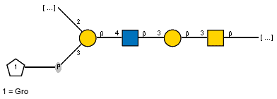

#### Sugars for blast hits:

QEH45435.1:

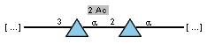

#### Alphafold models:

[BAQ00795.1](https://github.com/idameitil/phd/tree/master/data/wzy/alphafold/2202060002-wzy_100/af_out/BAQ00795.1/ranked_0.pdb)

#### Taxonomy:

| order (count)        | family (count)         | genus (count)        |
|:---------------------|:-----------------------|:---------------------|
| Pasteurellales (122) | Pasteurellaceae (122)  | Haemophilus (35)     |
|                      |                        | Aggregatibacter (20) |
|                      |                        | Pasteurella (18)     |
|                      |                        | Rodentibacter (13)   |
|                      |                        | Mannheimia (9)       |
|                      |                        | Actinobacillus (8)   |
|                      |                        | Glaesserella (4)     |
|                      |                        | Ursidibacter (3)     |
|                      |                        | Muribacter (2)       |
|                      |                        | Avibacterium (2)     |
|                      |                        | Bibersteinia (2)     |
|                      |                        | Frederiksenia (1)    |
|                      |                        | nan (1)              |
|                      |                        | Bisgaardia (1)       |
|                      |                        | Basfia (1)           |
|                      |                        | Nicoletella (1)      |
|                      |                        | Lonepinella (1)      |
| Enterobacterales (4) | Enterobacteriaceae (2) | Escherichia (2)      |
|                      | Morganellaceae (2)     | Providencia (2)      |
| Aeromonadales (2)    | Aeromonadaceae (2)     | Aeromonas (2)        |
| Vibrionales (1)      | Vibrionaceae (1)       | Photobacterium (1)   |

[top](#navigation)

### Cluster 39
Total number of members in cluster: 119

Average length of proteins in cluster: 423.2

#### Conserved (non-aliphatic) residues: 

R 501 (97.5%) N 502 (100.0%) E 508 (100.0%) S 685 (98.3%) 

#### Seeds in cluster:

| protein_accession   | order           | family           | genus         | species                  | serotype   |   Enterobacterial common antigen Wzy |
|:--------------------|:----------------|:-----------------|:--------------|:-------------------------|:-----------|-------------------------------------:|
| CAI34254.1          | Lactobacillales | Streptococcaceae | Streptococcus | Streptococcus pneumoniae | 33F        |                                    0 |
| CAI34177.1          | Lactobacillales | Streptococcaceae | Streptococcus | Streptococcus pneumoniae | 33A        |                                    0 |
| CAI34198.1          | Lactobacillales | Streptococcaceae | Streptococcus | Streptococcus pneumoniae | 33B        |                                    0 |
| CAI34217.1          | Lactobacillales | Streptococcaceae | Streptococcus | Streptococcus pneumoniae | 33C        |                                    0 |
| CAI34236.1          | Lactobacillales | Streptococcaceae | Streptococcus | Streptococcus pneumoniae | 33D        |                                    0 |

[MSA fasta](https://github.com/idameitil/phd/tree/master/data/wzy/ssn-clusterings/2206101141/clusters/0119_39/sequences.afa)

[Malign view](https://github.com/idameitil/phd/tree/master/data/wzy/ssn-clusterings/2206101141/clusters/0119_39/sequences.malign)

[Fasta of members](https://github.com/idameitil/phd/tree/master/data/wzy/ssn-clusterings/2206101141/clusters/0119_39/sequences.fa)

[Logoplot](https://github.com/idameitil/phd/tree/master/data/wzy/ssn-clusterings/2206101141/clusters/0119_39/sequences.logo.pdf)

[Phylogenetic tree](https://github.com/idameitil/phd/tree/master/data/wzy/ssn-clusterings/2206101141/clusters/0119_39/sequences.nwk)

[Hits in cluster](https://github.com/idameitil/phd/tree/master/data/wzy/ssn-clusterings/2206101141/clusters/0119_39/hits.tsv)

#### Sugars in cluster:

CAI34254.1:

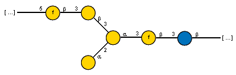

CAI34177.1:

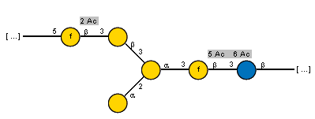

CAI34198.1:

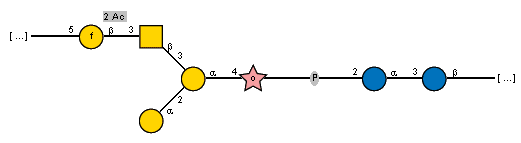

CAI34217.1:

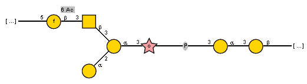

CAI34236.1:

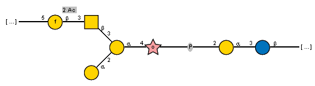

#### Sugars for blast hits:

VQJ42306.1:

VIU37569.1:

#### Alphafold models:

[CAI34254.1](https://github.com/idameitil/phd/tree/master/data/wzy/alphafold/2202060002-wzy_100/af_out/CAI34254.1/ranked_0.pdb)

[CAI34198.1](https://github.com/idameitil/phd/tree/master/data/wzy/alphafold/2202060002-wzy_100/af_out/CAI34198.1/ranked_0.pdb)

[CAI34217.1](https://github.com/idameitil/phd/tree/master/data/wzy/alphafold/2202060002-wzy_100/af_out/CAI34217.1/ranked_0.pdb)

#### Taxonomy:

| order (count)        | family (count)        | genus (count)            |
|:---------------------|:----------------------|:-------------------------|
| Lactobacillales (60) | Lactobacillaceae (39) | Lactobacillus (11)       |
|                      |                       | Pediococcus (5)          |
|                      |                       | Levilactobacillus (5)    |
|                      |                       | Lactiplantibacillus (4)  |
|                      |                       | Limosilactobacillus (2)  |
|                      |                       | Leuconostoc (2)          |
|                      |                       | Companilactobacillus (2) |
|                      |                       | Lacticaseibacillus (2)   |
|                      |                       | Ligilactobacillus (2)    |
|                      |                       | Latilactobacillus (1)    |
|                      |                       | Weissella (1)            |
|                      |                       | Liquorilactobacillus (1) |
|                      |                       | Secundilactobacillus (1) |
|                      | Streptococcaceae (18) | Streptococcus (18)       |
|                      | Enterococcaceae (3)   | Enterococcus (3)         |
| Eubacteriales (37)   | Lachnospiraceae (19)  | Mediterraneibacter (3)   |
|                      |                       | Enterocloster (3)        |
|                      |                       | Blautia (2)              |
|                      |                       | Cuneatibacter (1)        |
|                      |                       | Roseburia (1)            |
|                      |                       | Butyrivibrio (1)         |
|                      |                       | Pseudobutyrivibrio (1)   |
|                      | nan (16)              | nan (18)                 |
|                      | Clostridiaceae (10)   | Clostridium (10)         |
|                      | Oscillospiraceae (5)  | nan (18)                 |
|                      |                       | Ruminococcus (1)         |
| nan (14)             | nan (16)              | nan (18)                 |
| Pasteurellales (3)   | Pasteurellaceae (3)   | Haemophilus (2)          |
| Bacteroidales (3)    | Bacteroidaceae (3)    | nan (18)                 |
|                      |                       | Phocaeicola (2)          |
| Coriobacteriales (2) | Coriobacteriaceae (1) | Collinsella (1)          |
|                      | Atopobiaceae (1)      | nan (18)                 |

[top](#navigation)

### Cluster 2
Total number of members in cluster: 107

Average length of proteins in cluster: 411.8

#### Conserved (non-aliphatic) residues: 

Q 243 (98.1%) R 291 (100.0%) R 356 (100.0%) S 480 (100.0%) D 537 (100.0%) R 542 (98.1%) 

#### Seeds in cluster:

| protein_accession   | order            | family             | genus         | species                 | serotype   |   Enterobacterial common antigen Wzy |
|:--------------------|:-----------------|:-------------------|:--------------|:------------------------|:-----------|-------------------------------------:|
| AHB32563.2          | Moraxellales     | Moraxellaceae      | Acinetobacter | Acinetobacter baumannii | O3         |                                    0 |
| ACA24764.1          | Enterobacterales | Enterobacteriaceae | Escherichia   | Escherichia coli        | O143       |                                    0 |
| BAQ02088.1          | Enterobacterales | Enterobacteriaceae | Escherichia   | Escherichia coli        | O187       |                                    0 |
| ACA24754.1          | Enterobacterales | Enterobacteriaceae | Shigella      | Shigella boydii         | 8          |                                    0 |
| AFW04847.1          | Enterobacterales | Enterobacteriaceae | Salmonella    | Salmonella enterica     | O59        |                                    0 |

[MSA fasta](https://github.com/idameitil/phd/tree/master/data/wzy/ssn-clusterings/2206101141/clusters/0107_2/sequences.afa)

[Malign view](https://github.com/idameitil/phd/tree/master/data/wzy/ssn-clusterings/2206101141/clusters/0107_2/sequences.malign)

[Fasta of members](https://github.com/idameitil/phd/tree/master/data/wzy/ssn-clusterings/2206101141/clusters/0107_2/sequences.fa)

[Logoplot](https://github.com/idameitil/phd/tree/master/data/wzy/ssn-clusterings/2206101141/clusters/0107_2/sequences.logo.pdf)

[Phylogenetic tree](https://github.com/idameitil/phd/tree/master/data/wzy/ssn-clusterings/2206101141/clusters/0107_2/sequences.nwk)

[Hits in cluster](https://github.com/idameitil/phd/tree/master/data/wzy/ssn-clusterings/2206101141/clusters/0107_2/hits.tsv)

#### Sugars in cluster:

ACA24764.1, ACA24754.1:

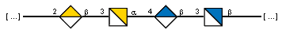

BAQ02088.1:

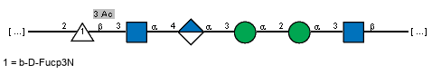

AFW04847.1:

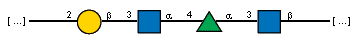

#### Sugars for blast hits:

#### Alphafold models:

[BAQ02088.1](https://github.com/idameitil/phd/tree/master/data/wzy/alphafold/2202060002-wzy_100/af_out/BAQ02088.1/ranked_0.pdb)

[ACA24754.1](https://github.com/idameitil/phd/tree/master/data/wzy/alphafold/2205031317-wzy/af_out/ACA24754.1/ranked_0.pdb)

#### Taxonomy:

| order (count)          | family (count)             | genus (count)         |
|:-----------------------|:---------------------------|:----------------------|
| Moraxellales (21)      | Moraxellaceae (21)         | Acinetobacter (21)    |
| Enterobacterales (21)  | Enterobacteriaceae (12)    | Escherichia (6)       |
|                        |                            | Shigella (3)          |
|                        |                            | Salmonella (1)        |
|                        |                            | Citrobacter (1)       |
|                        |                            | Buttiauxella (1)      |
|                        | Morganellaceae (6)         | Providencia (3)       |
|                        |                            | Proteus (2)           |
|                        |                            | Photorhabdus (1)      |
|                        | Erwiniaceae (1)            | Mixta (1)             |
|                        | Hafniaceae (1)             | Obesumbacterium (1)   |
|                        | Pectobacteriaceae (1)      | Pectobacterium (1)    |
| Bacteroidales (18)     | Bacteroidaceae (8)         | Bacteroides (7)       |
|                        |                            | nan (2)               |
|                        | nan (2)                    | nan (2)               |
|                        | Tannerellaceae (2)         | Parabacteroides (2)   |
|                        | Rikenellaceae (2)          | nan (2)               |
|                        |                            | Alistipes (1)         |
|                        | Prevotellaceae (1)         | Prevotella (1)        |
|                        | Odoribacteraceae (1)       | Odoribacter (1)       |
|                        | Muribaculaceae (1)         | nan (2)               |
| Pasteurellales (10)    | Pasteurellaceae (10)       | Gallibacterium (9)    |
|                        |                            | Glaesserella (1)      |
| Vibrionales (10)       | Vibrionaceae (10)          | Vibrio (9)            |
|                        |                            | Photobacterium (1)    |
| Aeromonadales (5)      | Aeromonadaceae (5)         | Aeromonas (5)         |
| Alteromonadales (5)    | Shewanellaceae (3)         | Shewanella (3)        |
|                        | Colwelliaceae (1)          | Colwellia (1)         |
|                        | Pseudoalteromonadaceae (1) | Pseudoalteromonas (1) |
| Flavobacteriales (4)   | Weeksellaceae (2)          | Elizabethkingia (2)   |
|                        | Flavobacteriaceae (2)      | Polaribacter (1)      |
|                        |                            | Tenacibaculum (1)     |
| Sphingobacteriales (4) | Sphingobacteriaceae (4)    | Parapedobacter (2)    |
|                        |                            | Pseudopedobacter (1)  |
|                        |                            | Sphingobacterium (1)  |
| nan (2)                | nan (2)                    | Gallaecimonas (1)     |
| Spirochaetales (1)     | Treponemataceae (1)        | Treponema (1)         |
| Synergistales (1)      | Synergistaceae (1)         | Dethiosulfovibrio (1) |
| Lactobacillales (1)    | Lactobacillaceae (1)       | Ligilactobacillus (1) |
| Eubacteriales (1)      | Clostridiaceae (1)         | Clostridium (1)       |
| Chitinophagales (1)    | Chitinophagaceae (1)       | Chitinophaga (1)      |
| Neisseriales (1)       | Neisseriaceae (1)          | Neisseria (1)         |
| Methylococcales (1)    | Methylococcaceae (1)       | Methyloprofundus (1)  |

[top](#navigation)

### Cluster 46
Total number of members in cluster: 91

Average length of proteins in cluster: 431.6

#### Conserved (non-aliphatic) residues: 

D 344 (100.0%) E 408 (100.0%) R 538 (100.0%) 

#### Seeds in cluster:

| protein_accession   | order           | family           | genus         | species                  | serotype   |   Enterobacterial common antigen Wzy |
|:--------------------|:----------------|:-----------------|:--------------|:-------------------------|:-----------|-------------------------------------:|
| CAI32935.1          | Lactobacillales | Streptococcaceae | Streptococcus | Streptococcus pneumoniae | 7F         |                                    0 |
| CAI32867.1          | Lactobacillales | Streptococcaceae | Streptococcus | Streptococcus pneumoniae | 7A         |                                    0 |

[MSA fasta](https://github.com/idameitil/phd/tree/master/data/wzy/ssn-clusterings/2206101141/clusters/0091_46/sequences.afa)

[Malign view](https://github.com/idameitil/phd/tree/master/data/wzy/ssn-clusterings/2206101141/clusters/0091_46/sequences.malign)

[Fasta of members](https://github.com/idameitil/phd/tree/master/data/wzy/ssn-clusterings/2206101141/clusters/0091_46/sequences.fa)

[Logoplot](https://github.com/idameitil/phd/tree/master/data/wzy/ssn-clusterings/2206101141/clusters/0091_46/sequences.logo.pdf)

[Phylogenetic tree](https://github.com/idameitil/phd/tree/master/data/wzy/ssn-clusterings/2206101141/clusters/0091_46/sequences.nwk)

[Hits in cluster](https://github.com/idameitil/phd/tree/master/data/wzy/ssn-clusterings/2206101141/clusters/0091_46/hits.tsv)

#### Sugars in cluster:

CAI32935.1:

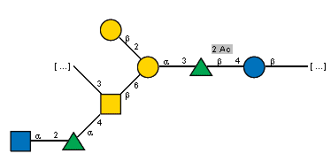

CAI32867.1:

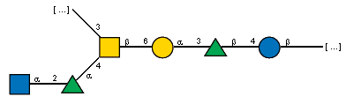

#### Sugars for blast hits:

#### Alphafold models:

#### Taxonomy:

| order (count)          | family (count)          | genus (count)           |
|:-----------------------|:------------------------|:------------------------|
| Eubacteriales (44)     | Lachnospiraceae (17)    | nan (19)                |
|                        |                         | Butyrivibrio (5)        |
|                        |                         | Blautia (2)             |
|                        |                         | Dorea (1)               |
|                        |                         | Faecalicatena (1)       |
|                        |                         | Anaerostipes (1)        |
|                        | Oscillospiraceae (16)   | nan (19)                |
|                        |                         | Ruminococcus (4)        |
|                        |                         | Faecalibacterium (3)    |
|                        | nan (14)                | nan (19)                |
|                        | Clostridiaceae (5)      | nan (19)                |
|                        |                         | Clostridium (4)         |
|                        | Eubacteriaceae (4)      | Eubacterium (4)         |
| Lactobacillales (17)   | Streptococcaceae (12)   | Streptococcus (10)      |
|                        |                         | Lactococcus (2)         |
|                        | Enterococcaceae (2)     | Enterococcus (2)        |
|                        | Lactobacillaceae (2)    | Limosilactobacillus (2) |
|                        | Carnobacteriaceae (1)   | Trichococcus (1)        |
| nan (13)               | nan (14)                | nan (19)                |
| Coriobacteriales (5)   | Atopobiaceae (4)        | Olsenella (2)           |
|                        |                         | Atopobium (1)           |
|                        |                         | Parafannyhessea (1)     |
|                        | Coriobacteriaceae (1)   | Collinsella (1)         |
| Erysipelotrichales (4) | Erysipelotrichaceae (3) | Amedibacillus (1)       |
|                        |                         | Faecalicoccus (1)       |
|                        | Turicibacteraceae (1)   | Turicibacter (1)        |
| Bacillales (3)         | Bacillaceae (2)         | Bacillus (2)            |
|                        | Planococcaceae (1)      | Ureibacillus (1)        |
| Eggerthellales (2)     | Eggerthellaceae (2)     | Adlercreutzia (1)       |
|                        |                         | Eggerthella (1)         |
| Tissierellales (1)     | Peptoniphilaceae (1)    | Anaerococcus (1)        |
| Fibrobacterales (1)    | Fibrobacteraceae (1)    | Fibrobacter (1)         |
| Bifidobacteriales (1)  | Bifidobacteriaceae (1)  | Bifidobacterium (1)     |

[top](#navigation)

### Cluster 1
Total number of members in cluster: 89

Average length of proteins in cluster: 427.7

#### Conserved (non-aliphatic) residues: 

Q 78 (100.0%) R 249 (100.0%) R 295 (100.0%) E 364 (97.8%) Q 399 (98.9%) K 406 (100.0%) T 462 (97.8%) H 519 (98.9%) 

#### Seeds in cluster:

| protein_accession   | order            | family             | genus       | species          | serotype   |   Enterobacterial common antigen Wzy |
|:--------------------|:-----------------|:-------------------|:------------|:-----------------|:-----------|-------------------------------------:|
| WP_097449287.1      | Enterobacterales | Enterobacteriaceae | Escherichia | Escherichia coli | O57        |                                    0 |

[MSA fasta](https://github.com/idameitil/phd/tree/master/data/wzy/ssn-clusterings/2206101141/clusters/0089_1/sequences.afa)

[Malign view](https://github.com/idameitil/phd/tree/master/data/wzy/ssn-clusterings/2206101141/clusters/0089_1/sequences.malign)

[Fasta of members](https://github.com/idameitil/phd/tree/master/data/wzy/ssn-clusterings/2206101141/clusters/0089_1/sequences.fa)

[Logoplot](https://github.com/idameitil/phd/tree/master/data/wzy/ssn-clusterings/2206101141/clusters/0089_1/sequences.logo.pdf)

[Phylogenetic tree](https://github.com/idameitil/phd/tree/master/data/wzy/ssn-clusterings/2206101141/clusters/0089_1/sequences.nwk)

[Hits in cluster](https://github.com/idameitil/phd/tree/master/data/wzy/ssn-clusterings/2206101141/clusters/0089_1/hits.tsv)

#### Sugars in cluster:

WP_097449287.1:

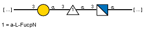

#### Sugars for blast hits:

#### Alphafold models:

[WP_097449287.1](https://github.com/idameitil/phd/tree/master/data/wzy/alphafold/2202060002-wzy_100/af_out/WP_097449287.1/ranked_0.pdb)

#### Taxonomy:

| order (count)             | family (count)             | genus (count)          |
|:--------------------------|:---------------------------|:-----------------------|
| Hyphomicrobiales (61)     | Rhizobiaceae (23)          | Rhizobium (10)         |
|                           |                            | Agrobacterium (8)      |
|                           |                            | Shinella (3)           |
|                           |                            | Neorhizobium (1)       |
|                           | Brucellaceae (21)          | Brucella (14)          |
|                           |                            | Ochrobactrum (6)       |
|                           | Phyllobacteriaceae (8)     | Phyllobacterium (4)    |
|                           |                            | Mesorhizobium (3)      |
|                           |                            | Aquamicrobium (1)      |
|                           | Methylocystaceae (4)       | Methylopila (3)        |
|                           |                            | Hansschlegelia (1)     |
|                           | Chelatococcaceae (2)       | Chelatococcus (2)      |
|                           | Kaistiaceae (1)            | Kaistia (1)            |
|                           | Afifellaceae (1)           | Afifella (1)           |
| nan (6)                   | nan (1)                    | nan (1)                |
| Pseudanabaenales (3)      | Leptolyngbyaceae (3)       | Leptolyngbya (2)       |
|                           |                            | nan (1)                |
| Chromatiales (2)          | Chromatiaceae (2)          | Halochromatium (1)     |
|                           |                            | Thiohalocapsa (1)      |
| Burkholderiales (2)       | Alcaligenaceae (1)         | nan (1)                |
|                           | Comamonadaceae (1)         | Kinneretia (1)         |
| Verrucomicrobiales (2)    | Verrucomicrobiaceae (2)    | Phragmitibacter (1)    |
|                           |                            | Prosthecobacter (1)    |
| Enterobacterales (1)      | Enterobacteriaceae (1)     | Escherichia (1)        |
| Sphingomonadales (1)      | Erythrobacteraceae (1)     | Altererythrobacter (1) |
| Nostocales (1)            | Nostocaceae (1)            | Richelia (1)           |
| Corynebacteriales (1)     | Mycobacteriaceae (1)       | Mycobacterium (1)      |
| Chroococcidiopsidales (1) | Chroococcidiopsidaceae (1) | Chroococcidiopsis (1)  |
| Rhodospirillales (1)      | nan (1)                    | nan (1)                |
| Kiritimatiellales (1)     | Pontiellaceae (1)          | nan (1)                |
| Bryobacterales (1)        | Bryobacteraceae (1)        | nan (1)                |
| Vibrionales (1)           | Vibrionaceae (1)           | Vibrio (1)             |
| Pirellulales (1)          | nan (1)                    | nan (1)                |
| Bacteroidales (1)         | Tannerellaceae (1)         | Parabacteroides (1)    |
| Hyphomonadales (1)        | Hyphomonadaceae (1)        | Henriciella (1)        |
| Synechococcales (1)       | Coelosphaeriaceae (1)      | Snowella (1)           |

[top](#navigation)

### Cluster 44
Total number of members in cluster: 83

Average length of proteins in cluster: 448.1

#### Conserved (non-aliphatic) residues: 

Y 264 (100.0%) R 345 (100.0%) R 421 (100.0%) 

#### Seeds in cluster:

| protein_accession   | order            | family             | genus         | species                    | serotype   |   Enterobacterial common antigen Wzy |
|:--------------------|:-----------------|:-------------------|:--------------|:---------------------------|:-----------|-------------------------------------:|
| AHB32510.1          | Moraxellales     | Moraxellaceae      | Acinetobacter | Acinetobacter nosocomialis | O11        |                                    0 |
| AHB32490.1          | Moraxellales     | Moraxellaceae      | Acinetobacter | Acinetobacter baumannii    | O15        |                                    0 |
| ABF01010.1          | Enterobacterales | Enterobacteriaceae | Escherichia   | Escherichia coli           | O28ac      |                                    0 |
| ACK44379.1          | Enterobacterales | Enterobacteriaceae | Escherichia   | Escherichia coli           | O42        |                                    0 |
| BAQ02048.1          | Enterobacterales | Enterobacteriaceae | Escherichia   | Escherichia coli           | O185       |                                    0 |
| AAM27546.1          | Pseudomonadales  | Pseudomonadaceae   | Pseudomonas   | Pseudomonas aeruginosa     | O1         |                                    0 |

[MSA fasta](https://github.com/idameitil/phd/tree/master/data/wzy/ssn-clusterings/2206101141/clusters/0083_44/sequences.afa)

[Malign view](https://github.com/idameitil/phd/tree/master/data/wzy/ssn-clusterings/2206101141/clusters/0083_44/sequences.malign)

[Fasta of members](https://github.com/idameitil/phd/tree/master/data/wzy/ssn-clusterings/2206101141/clusters/0083_44/sequences.fa)

[Logoplot](https://github.com/idameitil/phd/tree/master/data/wzy/ssn-clusterings/2206101141/clusters/0083_44/sequences.logo.pdf)

[Phylogenetic tree](https://github.com/idameitil/phd/tree/master/data/wzy/ssn-clusterings/2206101141/clusters/0083_44/sequences.nwk)

[Hits in cluster](https://github.com/idameitil/phd/tree/master/data/wzy/ssn-clusterings/2206101141/clusters/0083_44/hits.tsv)

#### Sugars in cluster:

ABF01010.1:

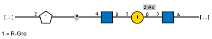

ACK44379.1:

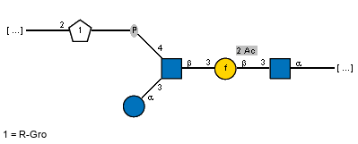

BAQ02048.1:

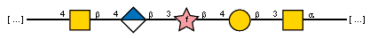

AAM27546.1:

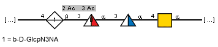

#### Sugars for blast hits:

#### Alphafold models:

[AHB32490.1](https://github.com/idameitil/phd/tree/master/data/wzy/alphafold/2201200806-polymerases_AlphaFold_batch1/af_out/AHB32490.1/ranked_0.pdb)

#### Taxonomy:

| order (count)         | family (count)             | genus (count)         |
|:----------------------|:---------------------------|:----------------------|
| Enterobacterales (28) | Enterobacteriaceae (17)    | Escherichia (15)      |
|                       |                            | Citrobacter (1)       |
|                       |                            | Enterobacter (1)      |
|                       | Morganellaceae (6)         | Morganella (3)        |
|                       |                            | Providencia (2)       |
|                       |                            | Proteus (1)           |
|                       | Hafniaceae (3)             | Edwardsiella (3)      |
|                       | Budviciaceae (1)           | Limnobaculum (1)      |
|                       | Yersiniaceae (1)           | Yersinia (1)          |
| Moraxellales (19)     | Moraxellaceae (19)         | Acinetobacter (18)    |
|                       |                            | Psychrobacter (1)     |
| Pseudomonadales (11)  | Pseudomonadaceae (11)      | Pseudomonas (11)      |
| Bacteroidales (9)     | Paludibacteraceae (3)      | nan (1)               |
|                       | Tannerellaceae (3)         | Parabacteroides (3)   |
|                       | Bacteroidaceae (2)         | Bacteroides (2)       |
|                       | nan (1)                    | nan (1)               |
| Vibrionales (6)       | Vibrionaceae (6)           | Photobacterium (3)    |
|                       |                            | Vibrio (3)            |
| Neisseriales (2)      | Neisseriaceae (2)          | Vitreoscilla (1)      |
|                       |                            | Conchiformibius (1)   |
| Burkholderiales (2)   | Burkholderiaceae (2)       | Caballeronia (1)      |
|                       |                            | Burkholderia (1)      |
| Alteromonadales (2)   | Pseudoalteromonadaceae (1) | Pseudoalteromonas (1) |
|                       | Shewanellaceae (1)         | Shewanella (1)        |
| Oceanospirillales (1) | Halomonadaceae (1)         | Zymobacter (1)        |
| Cytophagales (1)      | Cytophagaceae (1)          | Siphonobacter (1)     |
| Hyphomicrobiales (1)  | Devosiaceae (1)            | Devosia (1)           |
| Aeromonadales (1)     | Aeromonadaceae (1)         | Aeromonas (1)         |

[top](#navigation)

### Cluster 37
Total number of members in cluster: 82

Average length of proteins in cluster: 403.3

#### Conserved (non-aliphatic) residues: 

E 271 (100.0%) S 273 (98.8%) Y 377 (98.8%) R 381 (100.0%) N 393 (100.0%) N 457 (98.8%) D 460 (100.0%) K 467 (98.8%) E 471 (100.0%) 

#### Seeds in cluster:

| protein_accession   | order            | family             | genus       | species          | serotype   |   Enterobacterial common antigen Wzy |
|:--------------------|:-----------------|:-------------------|:------------|:-----------------|:-----------|-------------------------------------:|
| ADI43263.1          | Enterobacterales | Enterobacteriaceae | Escherichia | Escherichia coli | O25        |                                    0 |
| ADR74237.1          | Enterobacterales | Enterobacteriaceae | Escherichia | Escherichia coli | O109       |                                    0 |

[MSA fasta](https://github.com/idameitil/phd/tree/master/data/wzy/ssn-clusterings/2206101141/clusters/0082_37/sequences.afa)

[Malign view](https://github.com/idameitil/phd/tree/master/data/wzy/ssn-clusterings/2206101141/clusters/0082_37/sequences.malign)

[Fasta of members](https://github.com/idameitil/phd/tree/master/data/wzy/ssn-clusterings/2206101141/clusters/0082_37/sequences.fa)

[Logoplot](https://github.com/idameitil/phd/tree/master/data/wzy/ssn-clusterings/2206101141/clusters/0082_37/sequences.logo.pdf)

[Phylogenetic tree](https://github.com/idameitil/phd/tree/master/data/wzy/ssn-clusterings/2206101141/clusters/0082_37/sequences.nwk)

[Hits in cluster](https://github.com/idameitil/phd/tree/master/data/wzy/ssn-clusterings/2206101141/clusters/0082_37/hits.tsv)

#### Sugars in cluster:

ADI43263.1:

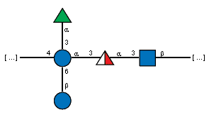

ADR74237.1:

#### Sugars for blast hits:

ADC84238.1:

#### Alphafold models:

[ADI43263.1](https://github.com/idameitil/phd/tree/master/data/wzy/alphafold/2202060002-wzy_100/af_out/ADI43263.1/ranked_0.pdb)

[ADR74237.1](https://github.com/idameitil/phd/tree/master/data/wzy/alphafold/2202060002-wzy_100/af_out/ADR74237.1/ranked_0.pdb)

#### Taxonomy:

| order (count)         | family (count)           | genus (count)        |
|:----------------------|:-------------------------|:---------------------|
| Enterobacterales (50) | Enterobacteriaceae (40)  | Escherichia (17)     |
|                       |                          | Klebsiella (11)      |
|                       |                          | Citrobacter (4)      |
|                       |                          | Enterobacter (4)     |
|                       |                          | Leclercia (2)        |
|                       |                          | Salmonella (2)       |
|                       | Pectobacteriaceae (8)    | Dickeya (8)          |
|                       | Erwiniaceae (1)          | Erwinia (1)          |
|                       | Morganellaceae (1)       | Proteus (1)          |
| Sphingomonadales (8)  | Sphingomonadaceae (7)    | Sphingomonas (7)     |
|                       | Sphingosinicellaceae (1) | Polymorphobacter (1) |
| Vibrionales (4)       | Vibrionaceae (4)         | Vibrio (3)           |
|                       |                          | Photobacterium (1)   |
| Burkholderiales (3)   | nan (2)                  | Rhizobacter (1)      |
|                       | Comamonadaceae (1)       | Comamonas (1)        |
|                       | Burkholderiaceae (1)     | Polynucleobacter (1) |
| Alteromonadales (3)   | Shewanellaceae (2)       | Shewanella (2)       |
|                       | Colwelliaceae (1)        | Colwellia (1)        |
| Flavobacteriales (2)  | Weeksellaceae (1)        | Chryseobacterium (1) |
| Pseudomonadales (2)   | Pseudomonadaceae (2)     | Pseudomonas (2)      |
| Oceanospirillales (2) | Halomonadaceae (2)       | Halomonas (2)        |
| Kordiimonadales (1)   | Kordiimonadaceae (1)     | nan (2)              |
| Rhodobacterales (1)   | Rhodobacteraceae (1)     | nan (2)              |
| Campylobacterales (1) | Thiovulaceae (1)         | Sulfurimonas (1)     |
| Nitrosomonadales (1)  | Thiobacillaceae (1)      | Thiobacillus (1)     |
| Cytophagales (1)      | Cyclobacteriaceae (1)    | Algoriphagus (1)     |
| Rhodocyclales (1)     | Zoogloeaceae (1)         | Zoogloea (1)         |
| Methylococcales (1)   | Methylococcaceae (1)     | Methyloprofundus (1) |
| Aeromonadales (1)     | Aeromonadaceae (1)       | Aeromonas (1)        |

[top](#navigation)

### Cluster 67
Total number of members in cluster: 71

Average length of proteins in cluster: 412.4

#### Conserved (non-aliphatic) residues: 

R 320 (100.0%) R 321 (97.2%) R 460 (97.2%) Q 463 (98.6%) R 498 (100.0%) E 507 (100.0%) Y 510 (100.0%) 

#### Seeds in cluster:

| protein_accession   | order            | family             | genus       | species                | serotype   |   Enterobacterial common antigen Wzy |
|:--------------------|:-----------------|:-------------------|:------------|:-----------------------|:-----------|-------------------------------------:|
| AAZ85713.1          | Enterobacterales | Enterobacteriaceae | Escherichia | Escherichia coli       | O138       |                                    0 |
| AAM27766.1          | Pseudomonadales  | Pseudomonadaceae   | Pseudomonas | Pseudomonas aeruginosa | O3         |                                    0 |
| AAM27615.1          | Pseudomonadales  | Pseudomonadaceae   | Pseudomonas | Pseudomonas aeruginosa | O13        |                                    0 |
| AAM27645.1          | Pseudomonadales  | Pseudomonadaceae   | Pseudomonas | Pseudomonas aeruginosa | O15        |                                    0 |

[MSA fasta](https://github.com/idameitil/phd/tree/master/data/wzy/ssn-clusterings/2206101141/clusters/0071_67/sequences.afa)

[Malign view](https://github.com/idameitil/phd/tree/master/data/wzy/ssn-clusterings/2206101141/clusters/0071_67/sequences.malign)

[Fasta of members](https://github.com/idameitil/phd/tree/master/data/wzy/ssn-clusterings/2206101141/clusters/0071_67/sequences.fa)

[Logoplot](https://github.com/idameitil/phd/tree/master/data/wzy/ssn-clusterings/2206101141/clusters/0071_67/sequences.logo.pdf)

[Phylogenetic tree](https://github.com/idameitil/phd/tree/master/data/wzy/ssn-clusterings/2206101141/clusters/0071_67/sequences.nwk)

[Hits in cluster](https://github.com/idameitil/phd/tree/master/data/wzy/ssn-clusterings/2206101141/clusters/0071_67/hits.tsv)

#### Sugars in cluster:

AAZ85713.1:

AAM27766.1:

AAM27615.1:

AAM27645.1:

#### Sugars for blast hits:

#### Alphafold models:

[AAM27615.1](https://github.com/idameitil/phd/tree/master/data/wzy/alphafold/2205031317-wzy/af_out/AAM27615.1/ranked_0.pdb)

#### Taxonomy:

| order (count)              | family (count)                                        | genus (count)             |
|:---------------------------|:------------------------------------------------------|:--------------------------|
| Pseudomonadales (23)       | Pseudomonadaceae (22)                                 | Pseudomonas (22)          |
|                            | Marinobacteraceae (1)                                 | Marinobacter (1)          |
| nan (6)                    | nan (5)                                               | nan (2)                   |
|                            | Dissulfurirhabdaceae (1)                              | Dissulfurirhabdus (1)     |
| Vibrionales (5)            | Vibrionaceae (5)                                      | Vibrio (4)                |
|                            |                                                       | Photobacterium (1)        |
| Lactobacillales (4)        | Enterococcaceae (3)                                   | Enterococcus (2)          |
|                            |                                                       | Vagococcus (1)            |
|                            | Carnobacteriaceae (1)                                 | Desemzia (1)              |
| Enterobacterales (3)       | Enterobacteriaceae (3)                                | Escherichia (3)           |
| Bacteroidales (3)          | Bacteroidaceae (2)                                    | Bacteroides (2)           |
|                            | Tannerellaceae (1)                                    | Parabacteroides (1)       |
| Bacillales (3)             | Bacillaceae (3)                                       | Bacillus (2)              |
|                            |                                                       | Gracilibacillus (1)       |
| Micrococcales (3)          | Microbacteriaceae (2)                                 | Salinibacterium (1)       |
|                            |                                                       | Cryobacterium (1)         |
|                            | Intrasporangiaceae (1)                                | Tetrasphaera (1)          |
| Deinococcales (3)          | Deinococcaceae (3)                                    | Deinococcus (3)           |
| Campylobacterales (2)      | nan (5)                                               | nan (2)                   |
|                            | Campylobacteraceae (1)                                | nan (2)                   |
| Alteromonadales (2)        | Shewanellaceae (2)                                    | Parashewanella (1)        |
|                            |                                                       | Shewanella (1)            |
| Eubacteriales (2)          | Clostridiaceae (1)                                    | Alkaliphilus (1)          |
|                            | Syntrophomonadaceae (1)                               | nan (2)                   |
| Chitinophagales (2)        | Chitinophagaceae (2)                                  | Chitinophaga (2)          |
| Flavobacteriales (2)       | Flavobacteriaceae (2)                                 | Flavobacterium (1)        |
|                            |                                                       | Winogradskyella (1)       |
| Burkholderiales (1)        | Comamonadaceae (1)                                    | Variovorax (1)            |
| Deferribacterales (1)      | nan (5)                                               | nan (2)                   |
| Thermoanaerobacterales (1) | Thermoanaerobacterales Family III. Incertae Sedis (1) | Thermoanaerobacterium (1) |
| Oceanospirillales (1)      | Halomonadaceae (1)                                    | Halomonas (1)             |
| Chitinivibrionales (1)     | nan (5)                                               | nan (2)                   |
| Sphingobacteriales (1)     | Sphingobacteriaceae (1)                               | Pedobacter (1)            |
| Neisseriales (1)           | Chromobacteriaceae (1)                                | Deefgea (1)               |
| Eggerthellales (1)         | Eggerthellaceae (1)                                   | Adlercreutzia (1)         |

[top](#navigation)

### Cluster 27
Total number of members in cluster: 67

Average length of proteins in cluster: 396.9

#### Conserved (non-aliphatic) residues: 

R 189 (100.0%) K 255 (97.0%) R 301 (97.0%) Y 326 (100.0%) N 393 (100.0%) D 404 (100.0%) Y 441 (97.0%) 

#### Seeds in cluster:

| protein_accession   | order            | family             | genus       | species          | serotype   |   Enterobacterial common antigen Wzy |
|:--------------------|:-----------------|:-------------------|:------------|:-----------------|:-----------|-------------------------------------:|
| ADC54950.1          | Enterobacterales | Enterobacteriaceae | Escherichia | Escherichia coli | O18        |                                    0 |
| BAQ00669.1          | Enterobacterales | Enterobacteriaceae | Escherichia | Escherichia coli | O18ab      |                                    0 |
| BAQ01732.1          | Enterobacterales | Enterobacteriaceae | Escherichia | Escherichia coli | O142       |                                    0 |
| BAQ00687.1          | Enterobacterales | Enterobacteriaceae | Escherichia | Escherichia coli | O18ac      |                                    0 |

[MSA fasta](https://github.com/idameitil/phd/tree/master/data/wzy/ssn-clusterings/2206101141/clusters/0067_27/sequences.afa)

[Malign view](https://github.com/idameitil/phd/tree/master/data/wzy/ssn-clusterings/2206101141/clusters/0067_27/sequences.malign)

[Fasta of members](https://github.com/idameitil/phd/tree/master/data/wzy/ssn-clusterings/2206101141/clusters/0067_27/sequences.fa)

[Logoplot](https://github.com/idameitil/phd/tree/master/data/wzy/ssn-clusterings/2206101141/clusters/0067_27/sequences.logo.pdf)

[Phylogenetic tree](https://github.com/idameitil/phd/tree/master/data/wzy/ssn-clusterings/2206101141/clusters/0067_27/sequences.nwk)

[Hits in cluster](https://github.com/idameitil/phd/tree/master/data/wzy/ssn-clusterings/2206101141/clusters/0067_27/hits.tsv)

#### Sugars in cluster:

ADC54950.1:

BAQ00669.1:

BAQ01732.1:

BAQ00687.1:

#### Sugars for blast hits:

ARD51912.1:

#### Alphafold models:

[ADC54950.1](https://github.com/idameitil/phd/tree/master/data/wzy/alphafold/2205031317-wzy/af_out/ADC54950.1/ranked_0.pdb)

#### Taxonomy:

| order (count)              | family (count)              | genus (count)        |
|:---------------------------|:----------------------------|:---------------------|
| Bacteroidales (32)         | Prevotellaceae (25)         | Prevotella (18)      |
|                            |                             | Alloprevotella (5)   |
|                            |                             | Paraprevotella (1)   |
|                            | Paludibacteraceae (5)       | nan (9)              |
| Enterobacterales (14)      | Enterobacteriaceae (13)     | Escherichia (11)     |
|                            |                             | Leclercia (1)        |
|                            |                             | Salmonella (1)       |
|                            | Morganellaceae (1)          | Morganella (1)       |
| Moraxellales (5)           | Moraxellaceae (5)           | Acinetobacter (5)    |
| Flavobacteriales (5)       | Weeksellaceae (3)           | Elizabethkingia (2)  |
|                            |                             | Chryseobacterium (1) |
|                            | Flavobacteriaceae (2)       | Capnocytophaga (1)   |
|                            |                             | Flavobacterium (1)   |
| nan (5)                    | nan (7)                     | nan (9)              |
| Vibrionales (4)            | Vibrionaceae (4)            | Photobacterium (3)   |
|                            |                             | Aliivibrio (1)       |
| Pseudomonadales (1)        | Pseudomonadaceae (1)        | Pseudomonas (1)      |
| Thermoanaerobacterales (1) | Thermoanaerobacteraceae (1) | nan (9)              |

[top](#navigation)

### Cluster 68
Total number of members in cluster: 66

Average length of proteins in cluster: 402.1

#### Conserved (non-aliphatic) residues: 

D 220 (100.0%) S 252 (100.0%) R 256 (100.0%) K 321 (100.0%) R 325 (100.0%) R 401 (100.0%) Q 403 (98.5%) 

#### Seeds in cluster:

| protein_accession   | order            | family             | genus       | species              | serotype   |   Enterobacterial common antigen Wzy |
|:--------------------|:-----------------|:-------------------|:------------|:---------------------|:-----------|-------------------------------------:|
| BAQ00758.1          | Enterobacterales | Enterobacteriaceae | Escherichia | Escherichia coli     | O28ab      |                                    0 |
| BAQ00879.1          | Enterobacterales | Enterobacteriaceae | Escherichia | Escherichia coli     | O39        |                                    0 |
| ABG81806.1          | Enterobacterales | Enterobacteriaceae | Escherichia | Escherichia coli     | O123       |                                    0 |
| BAQ02068.1          | Enterobacterales | Enterobacteriaceae | Escherichia | Escherichia coli     | O186       |                                    0 |
| AAD44158.1          | Enterobacterales | Enterobacteriaceae | Escherichia | Escherichia coli     | O7         |                                    0 |
| BAH24292.1          | Enterobacterales | Enterobacteriaceae | Escherichia | Escherichia coli     | O7         |                                    0 |
| AFC91472.1          | Enterobacterales | Enterobacteriaceae | Escherichia | Escherichia coli     | O121       |                                    0 |
| AFC91514.1          | Enterobacterales | Enterobacteriaceae | Escherichia | Escherichia coli     | O121       |                                    0 |
| AAO39700.1          | Enterobacterales | Enterobacteriaceae | Escherichia | Escherichia coli     | O121       |                                    0 |
| AFC91570.1          | Enterobacterales | Enterobacteriaceae | Escherichia | Escherichia coli     | O121       |                                    0 |
| AJR19430.1          | Enterobacterales | Enterobacteriaceae | Escherichia | Escherichia coli     | O186       |                                    0 |
| BAQ02224.1          | Enterobacterales | Enterobacteriaceae | Escherichia | Escherichia coli     | O123       |                                    0 |
| AAR97964.1          | Enterobacterales | Enterobacteriaceae | Shigella    | Shigella dysenteriae | 7          |                                    0 |

[MSA fasta](https://github.com/idameitil/phd/tree/master/data/wzy/ssn-clusterings/2206101141/clusters/0066_68/sequences.afa)

[Malign view](https://github.com/idameitil/phd/tree/master/data/wzy/ssn-clusterings/2206101141/clusters/0066_68/sequences.malign)

[Fasta of members](https://github.com/idameitil/phd/tree/master/data/wzy/ssn-clusterings/2206101141/clusters/0066_68/sequences.fa)

[Logoplot](https://github.com/idameitil/phd/tree/master/data/wzy/ssn-clusterings/2206101141/clusters/0066_68/sequences.logo.pdf)

[Phylogenetic tree](https://github.com/idameitil/phd/tree/master/data/wzy/ssn-clusterings/2206101141/clusters/0066_68/sequences.nwk)

[Hits in cluster](https://github.com/idameitil/phd/tree/master/data/wzy/ssn-clusterings/2206101141/clusters/0066_68/hits.tsv)

#### Sugars in cluster:

BAQ00758.1:

BAQ00879.1:

ABG81806.1, BAQ02224.1:

BAQ02068.1, AJR19430.1:

AAD44158.1, BAH24292.1:

AFC91472.1, AFC91514.1, AAO39700.1, AFC91570.1:

AAR97964.1:

#### Sugars for blast hits:

#### Alphafold models:

[ABG81806.1](https://github.com/idameitil/phd/tree/master/data/wzy/alphafold/2202060002-wzy_100/af_out/ABG81806.1/ranked_0.pdb)

[AFC91472.1](https://github.com/idameitil/phd/tree/master/data/wzy/alphafold/2202060002-wzy_100/af_out/AFC91472.1/ranked_0.pdb)

[BAQ02224.1](https://github.com/idameitil/phd/tree/master/data/wzy/alphafold/2201200806-polymerases_AlphaFold_batch1/af_out/BAQ02224.1/ranked_0.pdb)

#### Taxonomy:

| order (count)         | family (count)          | genus (count)          |
|:----------------------|:------------------------|:-----------------------|
| Enterobacterales (37) | Enterobacteriaceae (30) | Escherichia (19)       |
|                       |                         | Salmonella (5)         |
|                       |                         | Citrobacter (2)        |
|                       |                         | Enterobacter (2)       |
|                       |                         | Shigella (1)           |
|                       |                         | Kluyvera (1)           |
|                       | Morganellaceae (6)      | Providencia (2)        |
|                       |                         | Proteus (2)            |
|                       |                         | Photorhabdus (2)       |
|                       | Hafniaceae (1)          | Hafnia (1)             |
| Aeromonadales (6)     | Aeromonadaceae (6)      | Aeromonas (6)          |
| Burkholderiales (5)   | Oxalobacteraceae (2)    | Massilia (1)           |
|                       |                         | Noviherbaspirillum (1) |
|                       | Burkholderiaceae (2)    | Polynucleobacter (1)   |
|                       |                         | Pandoraea (1)          |
|                       | Comamonadaceae (1)      | Pelomonas (1)          |
| Vibrionales (5)       | Vibrionaceae (5)        | Vibrio (5)             |
| Moraxellales (5)      | Moraxellaceae (5)       | Acinetobacter (5)      |
| Pseudomonadales (2)   | Pseudomonadaceae (2)    | Pseudomonas (2)        |
| Neisseriales (1)      | Chromobacteriaceae (1)  | Aquitalea (1)          |
| Alteromonadales (1)   | Shewanellaceae (1)      | Shewanella (1)         |
| Rhodocyclales (1)     | Rhodocyclaceae (1)      | Propionivibrio (1)     |
| nan (1)               | nan (1)                 | nan (1)                |
| Nitrosomonadales (1)  | Methylophilaceae (1)    | Methylotenera (1)      |
| Oceanospirillales (1) | Oceanospirillaceae (1)  | Marinobacterium (1)    |

[top](#navigation)

### Cluster 12
Total number of members in cluster: 66

Average length of proteins in cluster: 369.6

#### Conserved (non-aliphatic) residues: 

R 188 (100.0%) K 218 (100.0%) D 226 (100.0%) S 227 (100.0%) N 228 (100.0%) S 281 (100.0%) R 282 (98.5%) D 367 (100.0%) S 369 (100.0%) K 373 (98.5%) H 414 (100.0%) E 423 (100.0%) 

#### Seeds in cluster:

| protein_accession   | order            | family             | genus         | species                    | serotype   |   Enterobacterial common antigen Wzy |
|:--------------------|:-----------------|:-------------------|:--------------|:---------------------------|:-----------|-------------------------------------:|
| AHB32538.1          | Moraxellales     | Moraxellaceae      | Acinetobacter | Acinetobacter nosocomialis | O2         |                                    0 |
| BAQ00846.1          | Enterobacterales | Enterobacteriaceae | Escherichia   | Escherichia coli           | O37        |                                    0 |
| BAQ00975.1          | Enterobacterales | Enterobacteriaceae | Escherichia   | Escherichia coli           | O48        |                                    0 |
| ACD37014.1          | Enterobacterales | Enterobacteriaceae | Escherichia   | Escherichia coli           | O112ac     |                                    0 |
| ACD37157.1          | Enterobacterales | Enterobacteriaceae | Escherichia   | Escherichia coli           | O130       |                                    0 |
| BAQ01494.1          | Enterobacterales | Enterobacteriaceae | Escherichia   | Escherichia coli           | O102       |                                    0 |
| AFS33314.1          | Enterobacterales | Enterobacteriaceae | Escherichia   | Escherichia coli           | O102       |                                    0 |
| ACD37006.1          | Enterobacterales | Enterobacteriaceae | Shigella      | Shigella dysenteriae       | 2          |                                    0 |
| AFW04741.1          | Enterobacterales | Enterobacteriaceae | Salmonella    | Salmonella enterica        | O21        |                                    0 |

[MSA fasta](https://github.com/idameitil/phd/tree/master/data/wzy/ssn-clusterings/2206101141/clusters/0066_12/sequences.afa)

[Malign view](https://github.com/idameitil/phd/tree/master/data/wzy/ssn-clusterings/2206101141/clusters/0066_12/sequences.malign)

[Fasta of members](https://github.com/idameitil/phd/tree/master/data/wzy/ssn-clusterings/2206101141/clusters/0066_12/sequences.fa)

[Logoplot](https://github.com/idameitil/phd/tree/master/data/wzy/ssn-clusterings/2206101141/clusters/0066_12/sequences.logo.pdf)

[Phylogenetic tree](https://github.com/idameitil/phd/tree/master/data/wzy/ssn-clusterings/2206101141/clusters/0066_12/sequences.nwk)

[Hits in cluster](https://github.com/idameitil/phd/tree/master/data/wzy/ssn-clusterings/2206101141/clusters/0066_12/hits.tsv)

#### Sugars in cluster:

BAQ00846.1:

BAQ00975.1:

ACD37014.1:

ACD37157.1:

BAQ01494.1, AFS33314.1:

ACD37006.1:

AFW04741.1:

#### Sugars for blast hits:

#### Alphafold models:

[AHB32538.1](https://github.com/idameitil/phd/tree/master/data/wzy/alphafold/2201200806-polymerases_AlphaFold_batch1/af_out/AHB32538.1/ranked_0.pdb)

[ACD37014.1](https://github.com/idameitil/phd/tree/master/data/wzy/alphafold/2202060002-wzy_100/af_out/ACD37014.1/ranked_0.pdb)

[ACD37157.1](https://github.com/idameitil/phd/tree/master/data/wzy/alphafold/2202060002-wzy_100/af_out/ACD37157.1/ranked_0.pdb)

#### Taxonomy:

| order (count)         | family (count)            | genus (count)         |
|:----------------------|:--------------------------|:----------------------|
| Enterobacterales (35) | Enterobacteriaceae (31)   | Escherichia (22)      |
|                       |                           | Salmonella (4)        |
|                       |                           | Citrobacter (2)       |
|                       |                           | Enterobacter (2)      |
|                       |                           | Shigella (1)          |
|                       | Morganellaceae (3)        | Proteus (1)           |
|                       |                           | Providencia (1)       |
|                       |                           | Xenorhabdus (1)       |
|                       | Hafniaceae (1)            | Edwardsiella (1)      |
| Moraxellales (9)      | Moraxellaceae (9)         | Acinetobacter (9)     |
| Vibrionales (8)       | Vibrionaceae (8)          | Vibrio (5)            |
|                       |                           | Photobacterium (2)    |
|                       |                           | Aliivibrio (1)        |
| Eubacteriales (5)     | Peptostreptococcaceae (2) | Paeniclostridium (2)  |
|                       | Clostridiaceae (1)        | Paraclostridium (1)   |
|                       | Oscillospiraceae (1)      | Pseudobacteroides (1) |
|                       | Lachnospiraceae (1)       | Schaedlerella (1)     |
| nan (3)               | nan (3)                   | nan (3)               |
| Bacillales (2)        | Bacillaceae (2)           | Bacillus (2)          |
| Campylobacterales (1) | Arcobacteraceae (1)       | Aliarcobacter (1)     |
| Cytophagales (1)      | Marivirgaceae (1)         | Marivirga (1)         |
| Spirochaetales (1)    | Treponemataceae (1)       | Rectinema (1)         |
| Aeromonadales (1)     | Aeromonadaceae (1)        | Aeromonas (1)         |

[top](#navigation)

### Cluster 56
Total number of members in cluster: 59

Average length of proteins in cluster: 359.0

#### Conserved (non-aliphatic) residues: 

R 65 (100.0%) D 71 (100.0%) Y 75 (100.0%) E 101 (100.0%) R 168 (100.0%) H 214 (100.0%) Y 288 (100.0%) R 371 (100.0%) Y 443 (100.0%) 

#### Seeds in cluster:

| protein_accession   | order            | family             | genus       | species              | serotype   |   Enterobacterial common antigen Wzy |
|:--------------------|:-----------------|:-------------------|:------------|:---------------------|:-----------|-------------------------------------:|
| ADQ37335.1          | Enterobacterales | Enterobacteriaceae | Escherichia | Escherichia coli     | O118       |                                    0 |
| ACA24821.1          | Enterobacterales | Enterobacteriaceae | Escherichia | Escherichia coli     | O152       |                                    0 |
| ADN43894.1          | Enterobacterales | Enterobacteriaceae | Escherichia | Escherichia coli     | O173       |                                    0 |
| ADQ37322.1          | Enterobacterales | Enterobacteriaceae | Escherichia | Escherichia coli     | O151       |                                    0 |
| ACA24811.1          | Enterobacterales | Enterobacteriaceae | Shigella    | Shigella dysenteriae | 12         |                                    0 |
| AFW04867.1          | Enterobacterales | Enterobacteriaceae | Salmonella  | Salmonella enterica  | O47        |                                    0 |

[MSA fasta](https://github.com/idameitil/phd/tree/master/data/wzy/ssn-clusterings/2206101141/clusters/0059_56/sequences.afa)

[Malign view](https://github.com/idameitil/phd/tree/master/data/wzy/ssn-clusterings/2206101141/clusters/0059_56/sequences.malign)

[Fasta of members](https://github.com/idameitil/phd/tree/master/data/wzy/ssn-clusterings/2206101141/clusters/0059_56/sequences.fa)

[Logoplot](https://github.com/idameitil/phd/tree/master/data/wzy/ssn-clusterings/2206101141/clusters/0059_56/sequences.logo.pdf)

[Phylogenetic tree](https://github.com/idameitil/phd/tree/master/data/wzy/ssn-clusterings/2206101141/clusters/0059_56/sequences.nwk)

[Hits in cluster](https://github.com/idameitil/phd/tree/master/data/wzy/ssn-clusterings/2206101141/clusters/0059_56/hits.tsv)

#### Sugars in cluster:

ADQ37335.1:

ACA24821.1, ACA24811.1:

ADN43894.1:

ADQ37322.1:

#### Sugars for blast hits:

#### Alphafold models:

[ACA24821.1](https://github.com/idameitil/phd/tree/master/data/wzy/alphafold/2202060002-wzy_100/af_out/ACA24821.1/ranked_0.pdb)

#### Taxonomy:

| order (count)         | family (count)          | genus (count)           |
|:----------------------|:------------------------|:------------------------|
| Enterobacterales (36) | Enterobacteriaceae (23) | Escherichia (11)        |
|                       |                         | Salmonella (7)          |
|                       |                         | Citrobacter (2)         |
|                       |                         | Shigella (1)            |
|                       |                         | nan (1)                 |
|                       |                         | Buttiauxella (1)        |
|                       | Morganellaceae (10)     | Morganella (4)          |
|                       |                         | Providencia (3)         |
|                       |                         | Proteus (3)             |
|                       | Erwiniaceae (2)         | Pantoea (2)             |
|                       | Hafniaceae (1)          | Hafnia (1)              |
| Bacteroidales (8)     | Bacteroidaceae (5)      | Bacteroides (5)         |
|                       | Tannerellaceae (3)      | Parabacteroides (3)     |
| Spirochaetales (5)    | Treponemataceae (4)     | Treponema (4)           |
|                       | Spirochaetaceae (1)     | nan (1)                 |
| Pasteurellales (2)    | Pasteurellaceae (2)     | Haemophilus (1)         |
|                       |                         | Spirabiliibacterium (1) |
| Aeromonadales (2)     | Aeromonadaceae (2)      | Aeromonas (2)           |
| nan (2)               | nan (2)                 | Wohlfahrtiimonas (2)    |
| Pseudomonadales (1)   | Pseudomonadaceae (1)    | Thiopseudomonas (1)     |
| Oceanospirillales (1) | Oceanospirillaceae (1)  | Venatorbacter (1)       |
| Campylobacterales (1) | Campylobacteraceae (1)  | Campylobacter (1)       |
| Flavobacteriales (1)  | Flavobacteriaceae (1)   | Flavobacterium (1)      |

[top](#navigation)

### Cluster 36
Total number of members in cluster: 59

Average length of proteins in cluster: 357.0

#### Conserved (non-aliphatic) residues: 

Q 75 (100.0%) D 81 (100.0%) Y 82 (100.0%) Y 85 (100.0%) E 106 (100.0%) N 178 (98.3%) R 181 (100.0%) H 216 (100.0%) Y 292 (100.0%) K 314 (100.0%) R 380 (100.0%) 

#### Seeds in cluster:

| protein_accession   | order            | family             | genus         | species                 | serotype   |   Enterobacterial common antigen Wzy |
|:--------------------|:-----------------|:-------------------|:--------------|:------------------------|:-----------|-------------------------------------:|
| AHB32283.1          | Moraxellales     | Moraxellaceae      | Acinetobacter | Acinetobacter baumannii | O21        |                                    0 |
| ACH97162.1          | Enterobacterales | Enterobacteriaceae | Escherichia   | Escherichia coli        | O21        |                                    0 |

[MSA fasta](https://github.com/idameitil/phd/tree/master/data/wzy/ssn-clusterings/2206101141/clusters/0059_36/sequences.afa)

[Malign view](https://github.com/idameitil/phd/tree/master/data/wzy/ssn-clusterings/2206101141/clusters/0059_36/sequences.malign)

[Fasta of members](https://github.com/idameitil/phd/tree/master/data/wzy/ssn-clusterings/2206101141/clusters/0059_36/sequences.fa)

[Logoplot](https://github.com/idameitil/phd/tree/master/data/wzy/ssn-clusterings/2206101141/clusters/0059_36/sequences.logo.pdf)

[Phylogenetic tree](https://github.com/idameitil/phd/tree/master/data/wzy/ssn-clusterings/2206101141/clusters/0059_36/sequences.nwk)

[Hits in cluster](https://github.com/idameitil/phd/tree/master/data/wzy/ssn-clusterings/2206101141/clusters/0059_36/hits.tsv)

#### Sugars in cluster:

ACH97162.1:

#### Sugars for blast hits:

#### Alphafold models:

[ACH97162.1](https://github.com/idameitil/phd/tree/master/data/wzy/alphafold/2202060002-wzy_100/af_out/ACH97162.1/ranked_0.pdb)

#### Taxonomy:

| order (count)         | family (count)             | genus (count)         |
|:----------------------|:---------------------------|:----------------------|
| Enterobacterales (15) | Morganellaceae (8)         | Providencia (4)       |
|                       |                            | Photorhabdus (1)      |
|                       |                            | Morganella (1)        |
|                       |                            | Xenorhabdus (1)       |
|                       |                            | Proteus (1)           |
|                       | Enterobacteriaceae (7)     | Salmonella (3)        |
|                       |                            | Escherichia (2)       |
|                       |                            | Citrobacter (1)       |
| Vibrionales (15)      | Vibrionaceae (15)          | Vibrio (13)           |
|                       |                            | Photobacterium (1)    |
|                       |                            | Enterovibrio (1)      |
| Moraxellales (8)      | Moraxellaceae (8)          | Acinetobacter (8)     |
| Bacteroidales (7)     | Bacteroidaceae (4)         | Bacteroides (4)       |
|                       | Tannerellaceae (1)         | Parabacteroides (1)   |
|                       | Muribaculaceae (1)         | nan (1)               |
|                       | nan (1)                    | nan (1)               |
| Alteromonadales (7)   | Pseudoalteromonadaceae (3) | Pseudoalteromonas (3) |
|                       | Shewanellaceae (2)         | Shewanella (2)        |
|                       | Moritellaceae (1)          | Moritella (1)         |
|                       | Idiomarinaceae (1)         | Idiomarina (1)        |
| Flavobacteriales (3)  | Flavobacteriaceae (2)      | Tenacibaculum (2)     |
|                       | Weeksellaceae (1)          | Empedobacter (1)      |
| Aeromonadales (3)     | Aeromonadaceae (3)         | Aeromonas (3)         |
| Campylobacterales (1) | Arcobacteraceae (1)        | Arcobacter (1)        |

[top](#navigation)

### Cluster 21
Total number of members in cluster: 58

Average length of proteins in cluster: 374.2

#### Conserved (non-aliphatic) residues: 

Q 170 (100.0%) D 185 (100.0%) R 198 (100.0%) R 212 (100.0%) E 219 (100.0%) S 262 (100.0%) R 313 (100.0%) D 322 (100.0%) S 324 (100.0%) K 328 (100.0%) D 366 (100.0%) K 413 (100.0%) 

#### Seeds in cluster:

| protein_accession   | order            | family             | genus       | species             | serotype   |   Enterobacterial common antigen Wzy |
|:--------------------|:-----------------|:-------------------|:------------|:--------------------|:-----------|-------------------------------------:|
| BAQ00994.1          | Enterobacterales | Enterobacteriaceae | Escherichia | Escherichia coli    | O49        |                                    0 |
| ADC54974.1          | Enterobacterales | Enterobacteriaceae | Escherichia | Escherichia coli    | O85        |                                    0 |
| BAQ01917.1          | Enterobacterales | Enterobacteriaceae | Escherichia | Escherichia coli    | O175       |                                    0 |
| CAN87666.1          | Enterobacterales | Enterobacteriaceae | Escherichia | Escherichia coli    | O45        |                                    0 |
| AFW04828.1          | Enterobacterales | Enterobacteriaceae | Salmonella  | Salmonella enterica | O44        |                                    0 |
| AFW04837.1          | Enterobacterales | Enterobacteriaceae | Salmonella  | Salmonella enterica | O53        |                                    0 |

[MSA fasta](https://github.com/idameitil/phd/tree/master/data/wzy/ssn-clusterings/2206101141/clusters/0058_21/sequences.afa)

[Malign view](https://github.com/idameitil/phd/tree/master/data/wzy/ssn-clusterings/2206101141/clusters/0058_21/sequences.malign)

[Fasta of members](https://github.com/idameitil/phd/tree/master/data/wzy/ssn-clusterings/2206101141/clusters/0058_21/sequences.fa)

[Logoplot](https://github.com/idameitil/phd/tree/master/data/wzy/ssn-clusterings/2206101141/clusters/0058_21/sequences.logo.pdf)

[Phylogenetic tree](https://github.com/idameitil/phd/tree/master/data/wzy/ssn-clusterings/2206101141/clusters/0058_21/sequences.nwk)

[Hits in cluster](https://github.com/idameitil/phd/tree/master/data/wzy/ssn-clusterings/2206101141/clusters/0058_21/hits.tsv)

#### Sugars in cluster:

BAQ00994.1:

ADC54974.1:

BAQ01917.1:

CAN87666.1:

AFW04828.1:

AFW04837.1:

#### Sugars for blast hits:

#### Alphafold models:

[BAQ00994.1](https://github.com/idameitil/phd/tree/master/data/wzy/alphafold/2202060002-wzy_100/af_out/BAQ00994.1/ranked_0.pdb)

[BAQ01917.1](https://github.com/idameitil/phd/tree/master/data/wzy/alphafold/2202060002-wzy_100/af_out/BAQ01917.1/ranked_0.pdb)

#### Taxonomy:

| order (count)         | family (count)          | genus (count)        |
|:----------------------|:------------------------|:---------------------|
| Enterobacterales (46) | Enterobacteriaceae (37) | Escherichia (16)     |
|                       |                         | Salmonella (15)      |
|                       |                         | Citrobacter (3)      |
|                       |                         | Buttiauxella (1)     |
|                       |                         | Plesiomonas (1)      |
|                       |                         | Shigella (1)         |
|                       | Morganellaceae (8)      | Providencia (4)      |
|                       |                         | Proteus (4)          |
|                       | Hafniaceae (1)          | Hafnia (1)           |
| Moraxellales (5)      | Moraxellaceae (5)       | Acinetobacter (5)    |
| Vibrionales (5)       | Vibrionaceae (5)        | Vibrio (4)           |
|                       |                         | Photobacterium (1)   |
| Aeromonadales (1)     | Aeromonadaceae (1)      | Aeromonas (1)        |
| nan (1)               | nan (1)                 | Wohlfahrtiimonas (1) |

[top](#navigation)

### Cluster 75
Total number of members in cluster: 51

Average length of proteins in cluster: 400.1

#### Conserved (non-aliphatic) residues: 

S 57 (100.0%) R 84 (98.0%) S 101 (100.0%) D 114 (100.0%) E 146 (100.0%) R 221 (100.0%) Q 222 (100.0%) H 255 (100.0%) K 320 (100.0%) R 399 (100.0%) 

#### Seeds in cluster:

| protein_accession   | order            | family             | genus         | species                 | serotype   |   Enterobacterial common antigen Wzy |
|:--------------------|:-----------------|:-------------------|:--------------|:------------------------|:-----------|-------------------------------------:|
| AHB32687.1          | Moraxellales     | Moraxellaceae      | Acinetobacter | Acinetobacter baumannii | O14        |                                    0 |
| BAQ01743.1          | Enterobacterales | Enterobacteriaceae | Escherichia   | Escherichia coli        | O144       |                                    0 |
| ABI55342.1          | Enterobacterales | Enterobacteriaceae | Shigella      | Shigella boydii         | 17         |                                    0 |

[MSA fasta](https://github.com/idameitil/phd/tree/master/data/wzy/ssn-clusterings/2206101141/clusters/0051_75/sequences.afa)

[Malign view](https://github.com/idameitil/phd/tree/master/data/wzy/ssn-clusterings/2206101141/clusters/0051_75/sequences.malign)

[Fasta of members](https://github.com/idameitil/phd/tree/master/data/wzy/ssn-clusterings/2206101141/clusters/0051_75/sequences.fa)

[Logoplot](https://github.com/idameitil/phd/tree/master/data/wzy/ssn-clusterings/2206101141/clusters/0051_75/sequences.logo.pdf)

[Phylogenetic tree](https://github.com/idameitil/phd/tree/master/data/wzy/ssn-clusterings/2206101141/clusters/0051_75/sequences.nwk)

[Hits in cluster](https://github.com/idameitil/phd/tree/master/data/wzy/ssn-clusterings/2206101141/clusters/0051_75/hits.tsv)

#### Sugars in cluster:

ABI55342.1:

#### Sugars for blast hits:

#### Alphafold models:

[AHB32687.1](https://github.com/idameitil/phd/tree/master/data/wzy/alphafold/2202060002-wzy_100/af_out/AHB32687.1/ranked_0.pdb)

[BAQ01743.1](https://github.com/idameitil/phd/tree/master/data/wzy/alphafold/2202060002-wzy_100/af_out/BAQ01743.1/ranked_0.pdb)

[ABI55342.1](https://github.com/idameitil/phd/tree/master/data/wzy/alphafold/2205031317-wzy/af_out/ABI55342.1/ranked_0.pdb)

#### Taxonomy:

| order (count)         | family (count)          | genus (count)      |
|:----------------------|:------------------------|:-------------------|
| Enterobacterales (42) | Enterobacteriaceae (24) | Klebsiella (14)    |
|                       |                         | Escherichia (3)    |
|                       |                         | Raoultella (3)     |
|                       |                         | Citrobacter (3)    |
|                       |                         | Shigella (1)       |
|                       | Yersiniaceae (17)       | Serratia (17)      |
|                       | Morganellaceae (1)      | Proteus (1)        |
| Vibrionales (4)       | Vibrionaceae (4)        | Vibrio (4)         |
| Moraxellales (2)      | Moraxellaceae (2)       | Acinetobacter (2)  |
| Flavobacteriales (2)  | Flavobacteriaceae (2)   | Capnocytophaga (2) |
| Campylobacterales (1) | Campylobacteraceae (1)  | Campylobacter (1)  |

[top](#navigation)

### Cluster 17
Total number of members in cluster: 48

Average length of proteins in cluster: 368.2

#### Conserved (non-aliphatic) residues: 

D 86 (100.0%) Y 90 (97.9%) E 195 (97.9%) R 337 (100.0%) E 373 (100.0%) N 439 (100.0%) R 445 (100.0%) 

#### Seeds in cluster:

| protein_accession   | order            | family       | genus    | species                     | serotype   |   Enterobacterial common antigen Wzy |
|:--------------------|:-----------------|:-------------|:---------|:----------------------------|:-----------|-------------------------------------:|
| AAN23041.1          | Enterobacterales | Yersiniaceae | Yersinia | Yersinia pseudotuberculosis | O:1A       |                                    0 |
| AAN23078.1          | Enterobacterales | Yersiniaceae | Yersinia | Yersinia pseudotuberculosis | O:2a       |                                    0 |
| AAN23057.1          | Enterobacterales | Yersiniaceae | Yersinia | Yersinia pseudotuberculosis | O:4b       |                                    0 |

[MSA fasta](https://github.com/idameitil/phd/tree/master/data/wzy/ssn-clusterings/2206101141/clusters/0048_17/sequences.afa)

[Malign view](https://github.com/idameitil/phd/tree/master/data/wzy/ssn-clusterings/2206101141/clusters/0048_17/sequences.malign)

[Fasta of members](https://github.com/idameitil/phd/tree/master/data/wzy/ssn-clusterings/2206101141/clusters/0048_17/sequences.fa)

[Logoplot](https://github.com/idameitil/phd/tree/master/data/wzy/ssn-clusterings/2206101141/clusters/0048_17/sequences.logo.pdf)

[Phylogenetic tree](https://github.com/idameitil/phd/tree/master/data/wzy/ssn-clusterings/2206101141/clusters/0048_17/sequences.nwk)

[Hits in cluster](https://github.com/idameitil/phd/tree/master/data/wzy/ssn-clusterings/2206101141/clusters/0048_17/hits.tsv)

#### Sugars in cluster:

AAN23078.1:

AAN23057.1:

#### Sugars for blast hits:

#### Alphafold models:

[AAN23041.1](https://github.com/idameitil/phd/tree/master/data/wzy/alphafold/2202060002-wzy_100/af_out/AAN23041.1/ranked_0.pdb)

#### Taxonomy:

| order (count)          | family (count)             | genus (count)                           |
|:-----------------------|:---------------------------|:----------------------------------------|
| Enterobacterales (15)  | Yersiniaceae (13)          | Yersinia (12)                           |
|                        |                            | Rahnella (1)                            |
|                        | Budviciaceae (2)           | Pragia (1)                              |
|                        |                            | Budvicia (1)                            |
| Xanthomonadales (9)    | Xanthomonadaceae (8)       | Lysobacter (4)                          |
|                        |                            | Luteimonas (3)                          |
|                        |                            | Vulcaniibacterium (1)                   |
|                        | Rhodanobacteraceae (1)     | Dyella (1)                              |
| Alteromonadales (4)    | Pseudoalteromonadaceae (4) | Pseudoalteromonas (3)                   |
|                        |                            | Psychrosphaera (1)                      |
| Burkholderiales (4)    | Burkholderiaceae (2)       | Polynucleobacter (2)                    |
|                        | Oxalobacteraceae (1)       | Herbaspirillum (1)                      |
|                        | Alcaligenaceae (1)         | Pusillimonas (ex Stolz et al. 2005) (1) |
| Vibrionales (4)        | Vibrionaceae (4)           | Vibrio (4)                              |
| Legionellales (3)      | Legionellaceae (3)         | Legionella (3)                          |
| Bacteroidales (2)      | Bacteroidaceae (2)         | Bacteroides (2)                         |
| Campylobacterales (2)  | Arcobacteraceae (1)        | Aliarcobacter (1)                       |
|                        | nan (1)                    | nan (1)                                 |
| Spirulinales (1)       | Spirulinaceae (1)          | Spirulina (1)                           |
| Cytophagales (1)       | Cytophagaceae (1)          | Siphonobacter (1)                       |
| Marinilabiliales (1)   | Marinifilaceae (1)         | Ancylomarina (1)                        |
| Nostocales (1)         | Tolypothrichaceae (1)      | Tolypothrix (1)                         |
| Sphingobacteriales (1) | Sphingobacteriaceae (1)    | Mucilaginibacter (1)                    |

[top](#navigation)

### Cluster 22
Total number of members in cluster: 46

Average length of proteins in cluster: 408.4

#### Conserved (non-aliphatic) residues: 

R 160 (100.0%) Y 163 (100.0%) T 166 (100.0%) R 167 (100.0%) S 177 (97.8%) K 216 (97.8%) Y 304 (100.0%) D 306 (100.0%) R 309 (97.8%) N 310 (97.8%) E 331 (100.0%) R 340 (100.0%) K 346 (100.0%) D 381 (100.0%) E 440 (97.8%) 

#### Seeds in cluster:

| protein_accession   | order            | family             | genus      | species             | serotype                   |   Enterobacterial common antigen Wzy |
|:--------------------|:-----------------|:-------------------|:-----------|:--------------------|:---------------------------|-------------------------------------:|
| WP_000905563.1      | Enterobacterales | Enterobacteriaceae | Salmonella | nan                 | Typhi                      |                                    0 |
| AAO68867.1          | Enterobacterales | Enterobacteriaceae | Salmonella | Salmonella enterica | Typhi                      |                                    0 |
| AAV77445.1          | Enterobacterales | Enterobacteriaceae | Salmonella | Salmonella enterica | Paratyphi A                |                                    0 |
| ACF69726.1          | Enterobacterales | Enterobacteriaceae | Salmonella | Salmonella enterica | Heidelberg                 |                                    0 |
| CAR59582.1          | Enterobacterales | Enterobacteriaceae | Salmonella | Salmonella enterica | Paratyphi A                |                                    0 |
| ACH74809.1          | Enterobacterales | Enterobacteriaceae | Salmonella | Salmonella enterica | Dublin                     |                                    0 |
| CAR37642.1          | Enterobacterales | Enterobacteriaceae | Salmonella | Salmonella enterica | Gallinarum bv. Pullorum 11 |                                    0 |
| AAL20257.1          | Enterobacterales | Enterobacteriaceae | Salmonella | Salmonella enterica | O4 (B) Typhimurium         |                                    0 |

[MSA fasta](https://github.com/idameitil/phd/tree/master/data/wzy/ssn-clusterings/2206101141/clusters/0046_22/sequences.afa)

[Malign view](https://github.com/idameitil/phd/tree/master/data/wzy/ssn-clusterings/2206101141/clusters/0046_22/sequences.malign)

[Fasta of members](https://github.com/idameitil/phd/tree/master/data/wzy/ssn-clusterings/2206101141/clusters/0046_22/sequences.fa)

[Logoplot](https://github.com/idameitil/phd/tree/master/data/wzy/ssn-clusterings/2206101141/clusters/0046_22/sequences.logo.pdf)

[Phylogenetic tree](https://github.com/idameitil/phd/tree/master/data/wzy/ssn-clusterings/2206101141/clusters/0046_22/sequences.nwk)

[Hits in cluster](https://github.com/idameitil/phd/tree/master/data/wzy/ssn-clusterings/2206101141/clusters/0046_22/hits.tsv)

#### Sugars in cluster:

WP_000905563.1, AAO68867.1:

AAV77445.1, CAR59582.1:

CAR37642.1:

AAL20257.1:

#### Sugars for blast hits:

#### Alphafold models:

[WP_000905563.1](https://github.com/idameitil/phd/tree/master/data/wzy/alphafold/2202060002-wzy_100/af_out/WP_000905563.1/ranked_0.pdb)

#### Taxonomy:

| order (count)          | family (count)          | genus (count)         |
|:-----------------------|:------------------------|:----------------------|
| Enterobacterales (30)  | Enterobacteriaceae (29) | Salmonella (23)       |
|                        |                         | Citrobacter (5)       |
|                        |                         | Raoultella (1)        |
|                        | Pectobacteriaceae (1)   | Pectobacterium (1)    |
| Acidobacteriales (4)   | Acidobacteriaceae (4)   | Edaphobacter (1)      |
|                        |                         | Acidobacterium (1)    |
|                        |                         | Terriglobus (1)       |
|                        |                         | Bryocella (1)         |
| nan (4)                | nan (4)                 | nan (4)               |
| Sphingomonadales (3)   | Sphingomonadaceae (3)   | Sphingomonas (3)      |
| Burkholderiales (3)    | Oxalobacteraceae (3)    | Massilia (1)          |
|                        |                         | Duganella (1)         |
|                        |                         | Janthinobacterium (1) |
| Planctomycetales (1)   | Planctomycetaceae (1)   | nan (4)               |
| Desulfuromonadales (1) | Geobacteraceae (1)      | Geobacter (1)         |

[top](#navigation)

### Cluster 58
Total number of members in cluster: 45

Average length of proteins in cluster: 410.4

#### Conserved (non-aliphatic) residues: 

D 82 (100.0%) D 109 (100.0%) R 191 (100.0%) H 228 (100.0%) S 230 (97.8%) Y 287 (100.0%) R 371 (100.0%) R 436 (97.8%) 

#### Seeds in cluster:

| protein_accession   | order            | family             | genus       | species          | serotype   |   Enterobacterial common antigen Wzy |
|:--------------------|:-----------------|:-------------------|:------------|:-----------------|:-----------|-------------------------------------:|
| ADI43271.1          | Enterobacterales | Enterobacteriaceae | Escherichia | Escherichia coli | O27        |                                    0 |

[MSA fasta](https://github.com/idameitil/phd/tree/master/data/wzy/ssn-clusterings/2206101141/clusters/0045_58/sequences.afa)

[Malign view](https://github.com/idameitil/phd/tree/master/data/wzy/ssn-clusterings/2206101141/clusters/0045_58/sequences.malign)

[Fasta of members](https://github.com/idameitil/phd/tree/master/data/wzy/ssn-clusterings/2206101141/clusters/0045_58/sequences.fa)

[Logoplot](https://github.com/idameitil/phd/tree/master/data/wzy/ssn-clusterings/2206101141/clusters/0045_58/sequences.logo.pdf)

[Phylogenetic tree](https://github.com/idameitil/phd/tree/master/data/wzy/ssn-clusterings/2206101141/clusters/0045_58/sequences.nwk)

[Hits in cluster](https://github.com/idameitil/phd/tree/master/data/wzy/ssn-clusterings/2206101141/clusters/0045_58/hits.tsv)

#### Sugars in cluster:

ADI43271.1:

#### Sugars for blast hits:

CZQ24278.1:

AXY99682.1:

#### Alphafold models:

[ADI43271.1](https://github.com/idameitil/phd/tree/master/data/wzy/alphafold/2202060002-wzy_100/af_out/ADI43271.1/ranked_0.pdb)

#### Taxonomy:

| order (count)         | family (count)          | genus (count)      |
|:----------------------|:------------------------|:-------------------|
| Enterobacterales (45) | Enterobacteriaceae (25) | Klebsiella (17)    |
|                       |                         | Escherichia (6)    |
|                       |                         | Raoultella (2)     |
|                       | Yersiniaceae (13)       | Serratia (11)      |
|                       |                         | Gibbsiella (1)     |
|                       |                         | Rouxiella (1)      |
|                       | Erwiniaceae (6)         | Tatumella (2)      |
|                       |                         | Pantoea (2)        |
|                       |                         | Erwinia (1)        |
|                       |                         | Rosenbergiella (1) |
|                       | Morganellaceae (1)      | Proteus (1)        |

[top](#navigation)

### Cluster 57
Total number of members in cluster: 43

Average length of proteins in cluster: 379.6

#### Conserved (non-aliphatic) residues: 

Y 31 (100.0%) R 85 (100.0%) D 92 (100.0%) Y 96 (100.0%) N 203 (100.0%) Q 207 (100.0%) H 249 (100.0%) R 485 (100.0%) 

#### Seeds in cluster:

| protein_accession   | order           | family           | genus         | species                  |   serotype |   Enterobacterial common antigen Wzy |
|:--------------------|:----------------|:-----------------|:--------------|:-------------------------|-----------:|-------------------------------------:|
| CAI34008.1          | Lactobacillales | Streptococcaceae | Streptococcus | Streptococcus pneumoniae |         27 |                                    0 |

[MSA fasta](https://github.com/idameitil/phd/tree/master/data/wzy/ssn-clusterings/2206101141/clusters/0043_57/sequences.afa)

[Malign view](https://github.com/idameitil/phd/tree/master/data/wzy/ssn-clusterings/2206101141/clusters/0043_57/sequences.malign)

[Fasta of members](https://github.com/idameitil/phd/tree/master/data/wzy/ssn-clusterings/2206101141/clusters/0043_57/sequences.fa)

[Logoplot](https://github.com/idameitil/phd/tree/master/data/wzy/ssn-clusterings/2206101141/clusters/0043_57/sequences.logo.pdf)

[Phylogenetic tree](https://github.com/idameitil/phd/tree/master/data/wzy/ssn-clusterings/2206101141/clusters/0043_57/sequences.nwk)

[Hits in cluster](https://github.com/idameitil/phd/tree/master/data/wzy/ssn-clusterings/2206101141/clusters/0043_57/hits.tsv)

#### Sugars in cluster:

CAI34008.1:

#### Sugars for blast hits:

#### Alphafold models:

[CAI34008.1](https://github.com/idameitil/phd/tree/master/data/wzy/alphafold/2202060002-wzy_100/af_out/CAI34008.1/ranked_0.pdb)

#### Taxonomy:

| order (count)        | family (count)        | genus (count)           |
|:---------------------|:----------------------|:------------------------|
| Eubacteriales (21)   | Lachnospiraceae (8)   | Blautia (3)             |
|                      |                       | nan (2)                 |
|                      |                       | Anaerostipes (1)        |
|                      |                       | Enterocloster (1)       |
|                      |                       | Fusicatenibacter (1)    |
|                      |                       | Coprococcus (1)         |
|                      | Oscillospiraceae (7)  | Faecalibacterium (5)    |
|                      |                       | Ruminococcus (2)        |
|                      | Clostridiaceae (5)    | Clostridium (4)         |
|                      |                       | Candidatus Dwaynia (1)  |
|                      | Peptococcaceae (1)    | Desulfosporosinus (1)   |
| Lactobacillales (12) | Lactobacillaceae (8)  | Lactobacillus (5)       |
|                      |                       | Limosilactobacillus (2) |
|                      |                       | Ligilactobacillus (1)   |
|                      | Streptococcaceae (3)  | Streptococcus (3)       |
|                      | Carnobacteriaceae (1) | Granulicatella (1)      |
| nan (2)              | nan (2)               | nan (2)                 |
| Eggerthellales (2)   | Eggerthellaceae (2)   | Eggerthella (2)         |
| Fibrobacterales (1)  | Fibrobacteraceae (1)  | Fibrobacter (1)         |
| Anaerolineales (1)   | Anaerolineaceae (1)   | Flexilinea (1)          |
| Pasteurellales (1)   | Pasteurellaceae (1)   | Actinobacillus (1)      |
| Synergistales (1)    | Synergistaceae (1)    | nan (2)                 |
| Bacteroidales (1)    | Bacteroidaceae (1)    | Bacteroides (1)         |
| Coriobacteriales (1) | Coriobacteriaceae (1) | Collinsella (1)         |

[top](#navigation)

### Cluster 31
Total number of members in cluster: 43

Average length of proteins in cluster: 376.9

#### Conserved (non-aliphatic) residues: 

D 160 (100.0%) R 162 (97.7%) R 166 (100.0%) T 168 (97.7%) N 175 (100.0%) S 228 (100.0%) R 229 (100.0%) T 230 (100.0%) Q 283 (100.0%) R 307 (100.0%) Y 332 (97.7%) D 336 (100.0%) Y 344 (97.7%) E 386 (97.7%) 

#### Seeds in cluster:

| protein_accession   | order            | family             | genus       | species          | serotype   |   Enterobacterial common antigen Wzy |
|:--------------------|:-----------------|:-------------------|:------------|:-----------------|:-----------|-------------------------------------:|
| BAQ00957.1          | Enterobacterales | Enterobacteriaceae | Escherichia | Escherichia coli | O46        |                                    0 |
| BAQ01812.1          | Enterobacterales | Enterobacteriaceae | Escherichia | Escherichia coli | O160       |                                    0 |
| BAQ01687.1          | Enterobacterales | Enterobacteriaceae | Escherichia | Escherichia coli | O134       |                                    0 |

[MSA fasta](https://github.com/idameitil/phd/tree/master/data/wzy/ssn-clusterings/2206101141/clusters/0043_31/sequences.afa)

[Malign view](https://github.com/idameitil/phd/tree/master/data/wzy/ssn-clusterings/2206101141/clusters/0043_31/sequences.malign)

[Fasta of members](https://github.com/idameitil/phd/tree/master/data/wzy/ssn-clusterings/2206101141/clusters/0043_31/sequences.fa)

[Logoplot](https://github.com/idameitil/phd/tree/master/data/wzy/ssn-clusterings/2206101141/clusters/0043_31/sequences.logo.pdf)

[Phylogenetic tree](https://github.com/idameitil/phd/tree/master/data/wzy/ssn-clusterings/2206101141/clusters/0043_31/sequences.nwk)

[Hits in cluster](https://github.com/idameitil/phd/tree/master/data/wzy/ssn-clusterings/2206101141/clusters/0043_31/hits.tsv)

#### Sugars in cluster:

BAQ00957.1:

BAQ01812.1:

BAQ01687.1:

#### Sugars for blast hits:

#### Alphafold models:

[BAQ00957.1](https://github.com/idameitil/phd/tree/master/data/wzy/alphafold/2202060002-wzy_100/af_out/BAQ00957.1/ranked_0.pdb)

#### Taxonomy:

| order (count)         | family (count)          | genus (count)     |
|:----------------------|:------------------------|:------------------|
| Enterobacterales (42) | Yersiniaceae (25)       | Serratia (24)     |
|                       |                         | Chania (1)        |
|                       | Enterobacteriaceae (13) | Escherichia (9)   |
|                       |                         | Klebsiella (2)    |
|                       |                         | Enterobacter (1)  |
|                       |                         | Pluralibacter (1) |
|                       | Morganellaceae (2)      | Proteus (2)       |
|                       | Erwiniaceae (1)         | Tatumella (1)     |
|                       | Hafniaceae (1)          | Hafnia (1)        |
| Aeromonadales (1)     | Aeromonadaceae (1)      | Aeromonas (1)     |

[top](#navigation)

### Cluster 79
Total number of members in cluster: 42

Average length of proteins in cluster: 429.9

#### Conserved (non-aliphatic) residues: 

R 264 (97.6%) N 449 (100.0%) D 461 (100.0%) 

#### Seeds in cluster:

| protein_accession   | order           | family           | genus         | species                  | serotype   |   Enterobacterial common antigen Wzy |
|:--------------------|:----------------|:-----------------|:--------------|:-------------------------|:-----------|-------------------------------------:|
| CAI33798.1          | Lactobacillales | Streptococcaceae | Streptococcus | Streptococcus pneumoniae | 22F        |                                    0 |
| CAI33774.1          | Lactobacillales | Streptococcaceae | Streptococcus | Streptococcus pneumoniae | 22A        |                                    0 |

[MSA fasta](https://github.com/idameitil/phd/tree/master/data/wzy/ssn-clusterings/2206101141/clusters/0042_79/sequences.afa)

[Malign view](https://github.com/idameitil/phd/tree/master/data/wzy/ssn-clusterings/2206101141/clusters/0042_79/sequences.malign)

[Fasta of members](https://github.com/idameitil/phd/tree/master/data/wzy/ssn-clusterings/2206101141/clusters/0042_79/sequences.fa)

[Logoplot](https://github.com/idameitil/phd/tree/master/data/wzy/ssn-clusterings/2206101141/clusters/0042_79/sequences.logo.pdf)

[Phylogenetic tree](https://github.com/idameitil/phd/tree/master/data/wzy/ssn-clusterings/2206101141/clusters/0042_79/sequences.nwk)

[Hits in cluster](https://github.com/idameitil/phd/tree/master/data/wzy/ssn-clusterings/2206101141/clusters/0042_79/hits.tsv)

#### Sugars in cluster:

CAI33798.1:

#### Sugars for blast hits:

#### Alphafold models:

[CAI33798.1](https://github.com/idameitil/phd/tree/master/data/wzy/alphafold/2202060002-wzy_100/af_out/CAI33798.1/ranked_0.pdb)

#### Taxonomy:

| order (count)         | family (count)         | genus (count)            |
|:----------------------|:-----------------------|:-------------------------|
| Lactobacillales (20)  | Streptococcaceae (14)  | Streptococcus (11)       |
|                       |                        | Lactococcus (3)          |
|                       | Lactobacillaceae (5)   | Lactiplantibacillus (1)  |
|                       |                        | Liquorilactobacillus (1) |
|                       |                        | Leuconostoc (1)          |
|                       |                        | Limosilactobacillus (1)  |
|                       |                        | Lactobacillus (1)        |
|                       | Enterococcaceae (1)    | Enterococcus (1)         |
| Eubacteriales (14)    | Clostridiaceae (3)     | Clostridium (3)          |
|                       | Lachnospiraceae (3)    | Blautia (1)              |
|                       |                        | Oribacterium (1)         |
|                       |                        | Dorea (1)                |
|                       | Oscillospiraceae (3)   | Faecalibacterium (2)     |
|                       | nan (2)                | nan (3)                  |
|                       | Peptococcaceae (1)     | Desulfosporosinus (1)    |
| Bacillales (3)        | Bacillaceae (3)        | Allobacillus (1)         |
|                       |                        | Halobacillus (1)         |
|                       |                        | Bacillus (1)             |
| Bifidobacteriales (3) | Bifidobacteriaceae (3) | Bifidobacterium (3)      |
| Coriobacteriales (1)  | Coriobacteriaceae (1)  | Collinsella (1)          |
| Bacteroidales (1)     | nan (2)                | nan (3)                  |

[top](#navigation)

### Cluster 53
Total number of members in cluster: 41

Average length of proteins in cluster: 441.7

#### Conserved (non-aliphatic) residues: 

Y 104 (97.6%) R 194 (100.0%) R 207 (97.6%) K 263 (100.0%) R 346 (100.0%) H 425 (100.0%) D 427 (100.0%) 

#### Seeds in cluster:

| protein_accession   | order            | family             | genus       | species          | serotype   |   Enterobacterial common antigen Wzy |
|:--------------------|:-----------------|:-------------------|:------------|:-----------------|:-----------|-------------------------------------:|
| ACD75796.1          | Enterobacterales | Enterobacteriaceae | Escherichia | Escherichia coli | O63        |                                    0 |

[MSA fasta](https://github.com/idameitil/phd/tree/master/data/wzy/ssn-clusterings/2206101141/clusters/0041_53/sequences.afa)

[Malign view](https://github.com/idameitil/phd/tree/master/data/wzy/ssn-clusterings/2206101141/clusters/0041_53/sequences.malign)

[Fasta of members](https://github.com/idameitil/phd/tree/master/data/wzy/ssn-clusterings/2206101141/clusters/0041_53/sequences.fa)

[Logoplot](https://github.com/idameitil/phd/tree/master/data/wzy/ssn-clusterings/2206101141/clusters/0041_53/sequences.logo.pdf)

[Phylogenetic tree](https://github.com/idameitil/phd/tree/master/data/wzy/ssn-clusterings/2206101141/clusters/0041_53/sequences.nwk)

[Hits in cluster](https://github.com/idameitil/phd/tree/master/data/wzy/ssn-clusterings/2206101141/clusters/0041_53/hits.tsv)

#### Sugars in cluster:

ACD75796.1:

#### Sugars for blast hits:

AXY99492.1:

#### Alphafold models:

[ACD75796.1](https://github.com/idameitil/phd/tree/master/data/wzy/alphafold/2202060002-wzy_100/af_out/ACD75796.1/ranked_0.pdb)

#### Taxonomy:

| order (count)         | family (count)          | genus (count)     |
|:----------------------|:------------------------|:------------------|
| Enterobacterales (18) | Enterobacteriaceae (12) | Escherichia (8)   |
|                       |                         | Enterobacter (2)  |
|                       |                         | Citrobacter (1)   |
|                       |                         | Cedecea (1)       |
|                       | Morganellaceae (4)      | Proteus (2)       |
|                       |                         | Providencia (1)   |
|                       |                         | Morganella (1)    |
|                       | Erwiniaceae (2)         | Erwinia (2)       |
| Pseudomonadales (10)  | Pseudomonadaceae (10)   | Pseudomonas (10)  |
| Vibrionales (5)       | Vibrionaceae (5)        | Vibrio (5)        |
| Burkholderiales (2)   | Burkholderiaceae (1)    | nan (1)           |
|                       | Comamonadaceae (1)      | Schlegelella (1)  |
| Sphingomonadales (2)  | Sphingomonadaceae (2)   | Sphingomonas (2)  |
| Moraxellales (1)      | Moraxellaceae (1)       | Acinetobacter (1) |
| Fusobacteriales (1)   | Fusobacteriaceae (1)    | nan (1)           |
| Campylobacterales (1) | Arcobacteraceae (1)     | Aliarcobacter (1) |
| Pasteurellales (1)    | Pasteurellaceae (1)     | Mannheimia (1)    |

[top](#navigation)

### Cluster 48
Total number of members in cluster: 41

Average length of proteins in cluster: 405.1

#### Conserved (non-aliphatic) residues: 

Y 279 (97.6%) R 310 (100.0%) E 317 (100.0%) T 323 (97.6%) S 357 (97.6%) S 359 (100.0%) R 460 (97.6%) N 473 (97.6%) R 474 (100.0%) 

#### Seeds in cluster:

| protein_accession   | order            | family             | genus       | species          | serotype   |   Enterobacterial common antigen Wzy |
|:--------------------|:-----------------|:-------------------|:------------|:-----------------|:-----------|-------------------------------------:|
| AAK60458.1          | Enterobacterales | Enterobacteriaceae | Escherichia | Escherichia coli | O91        |                                    0 |

[MSA fasta](https://github.com/idameitil/phd/tree/master/data/wzy/ssn-clusterings/2206101141/clusters/0041_48/sequences.afa)

[Malign view](https://github.com/idameitil/phd/tree/master/data/wzy/ssn-clusterings/2206101141/clusters/0041_48/sequences.malign)

[Fasta of members](https://github.com/idameitil/phd/tree/master/data/wzy/ssn-clusterings/2206101141/clusters/0041_48/sequences.fa)

[Logoplot](https://github.com/idameitil/phd/tree/master/data/wzy/ssn-clusterings/2206101141/clusters/0041_48/sequences.logo.pdf)

[Phylogenetic tree](https://github.com/idameitil/phd/tree/master/data/wzy/ssn-clusterings/2206101141/clusters/0041_48/sequences.nwk)

[Hits in cluster](https://github.com/idameitil/phd/tree/master/data/wzy/ssn-clusterings/2206101141/clusters/0041_48/hits.tsv)

#### Sugars in cluster:

AAK60458.1:

#### Sugars for blast hits:

#### Alphafold models:

[AAK60458.1](https://github.com/idameitil/phd/tree/master/data/wzy/alphafold/2202060002-wzy_100/af_out/AAK60458.1/ranked_0.pdb)

#### Taxonomy:

| order (count)         | family (count)          | genus (count)         |
|:----------------------|:------------------------|:----------------------|
| Bacillales (12)       | Bacillaceae (12)        | Bacillus (12)         |
| Enterobacterales (11) | Enterobacteriaceae (10) | Escherichia (9)       |
|                       |                         | Citrobacter (1)       |
|                       | Hafniaceae (1)          | Hafnia (1)            |
| Eubacteriales (4)     | Clostridiaceae (1)      | Clostridium (1)       |
|                       | Lachnospiraceae (1)     | Lachnoclostridium (1) |
|                       | Eubacteriaceae (1)      | Acetobacterium (1)    |
|                       | Desulfallaceae (1)      | Sporotomaculum (1)    |
| Vibrionales (4)       | Vibrionaceae (4)        | Vibrio (4)            |
| Pseudomonadales (3)   | Pseudomonadaceae (3)    | Pseudomonas (3)       |
| Bacteroidales (2)     | Bacteroidaceae (2)      | Bacteroides (2)       |
| nan (1)               | nan (1)                 | nan (1)               |
| Legionellales (1)     | Legionellaceae (1)      | Legionella (1)        |
| Burkholderiales (1)   | Burkholderiaceae (1)    | Ralstonia (1)         |
| Hydrogenophilales (1) | nan (1)                 | nan (1)               |
| Bifidobacteriales (1) | Bifidobacteriaceae (1)  | Aeriscardovia (1)     |

[top](#navigation)

### Cluster 13
Total number of members in cluster: 40

Average length of proteins in cluster: 432.2

#### Conserved (non-aliphatic) residues: 

Y 76 (100.0%) R 79 (100.0%) Q 176 (100.0%) K 179 (100.0%) Y 183 (100.0%) S 190 (100.0%) H 194 (100.0%) R 213 (100.0%) S 216 (100.0%) S 246 (97.5%) R 253 (100.0%) K 255 (100.0%) S 297 (100.0%) S 300 (100.0%) R 303 (100.0%) E 304 (100.0%) Y 313 (100.0%) D 319 (100.0%) S 320 (97.5%) Q 356 (100.0%) S 390 (100.0%) S 391 (100.0%) S 392 (100.0%) E 396 (100.0%) Y 413 (97.5%) R 449 (97.5%) E 451 (97.5%) K 461 (97.5%) 

#### Seeds in cluster:

| protein_accession   | order            | family             | genus       | species                     | serotype   |   Enterobacterial common antigen Wzy |
|:--------------------|:-----------------|:-------------------|:------------|:----------------------------|:-----------|-------------------------------------:|
| AKA20935.1          | Enterobacterales | Yersiniaceae       | Yersinia    | Yersinia pseudotuberculosis | O:2c       |                                    0 |
| AKA20966.1          | Enterobacterales | Yersiniaceae       | Yersinia    | Yersinia pseudotuberculosis | O:4a       |                                    0 |
| AKL88154.1          | Enterobacterales | Yersiniaceae       | Yersinia    | Yersinia pseudotuberculosis | O:8        |                                    0 |
| AAY23739.1          | Enterobacterales | Enterobacteriaceae | Escherichia | Escherichia coli            | O77        |                                    0 |
| AAY23733.1          | Enterobacterales | Enterobacteriaceae | Escherichia | Escherichia coli            | O73        |                                    0 |
| AAY23745.1          | Enterobacterales | Enterobacteriaceae | Escherichia | Escherichia coli            | O106       |                                    0 |
| BAQ01935.1          | Enterobacterales | Enterobacteriaceae | Escherichia | Escherichia coli            | O176       |                                    0 |
| BAQ02177.1          | Enterobacterales | Enterobacteriaceae | Escherichia | Escherichia coli            | O77        |                                    0 |
| BAQ02105.1          | Enterobacterales | Enterobacteriaceae | Escherichia | Escherichia coli            | O17        |                                    0 |
| BAQ00945.1          | Enterobacterales | Enterobacteriaceae | Escherichia | Escherichia coli            | O44        |                                    0 |

[MSA fasta](https://github.com/idameitil/phd/tree/master/data/wzy/ssn-clusterings/2206101141/clusters/0040_13/sequences.afa)

[Malign view](https://github.com/idameitil/phd/tree/master/data/wzy/ssn-clusterings/2206101141/clusters/0040_13/sequences.malign)

[Fasta of members](https://github.com/idameitil/phd/tree/master/data/wzy/ssn-clusterings/2206101141/clusters/0040_13/sequences.fa)

[Logoplot](https://github.com/idameitil/phd/tree/master/data/wzy/ssn-clusterings/2206101141/clusters/0040_13/sequences.logo.pdf)

[Phylogenetic tree](https://github.com/idameitil/phd/tree/master/data/wzy/ssn-clusterings/2206101141/clusters/0040_13/sequences.nwk)

[Hits in cluster](https://github.com/idameitil/phd/tree/master/data/wzy/ssn-clusterings/2206101141/clusters/0040_13/hits.tsv)

#### Sugars in cluster:

AKA20935.1:

AKA20966.1:

AAY23739.1, BAQ02177.1:

AAY23733.1:

AAY23745.1:

BAQ01935.1:

BAQ02105.1:

BAQ00945.1:

#### Sugars for blast hits:

#### Alphafold models:

[AKA20935.1](https://github.com/idameitil/phd/tree/master/data/wzy/alphafold/2202060002-wzy_100/af_out/AKA20935.1/ranked_0.pdb)

#### Taxonomy:

| order (count)         | family (count)          | genus (count)      |
|:----------------------|:------------------------|:-------------------|
| Enterobacterales (37) | Enterobacteriaceae (31) | Escherichia (13)   |
|                       |                         | Salmonella (10)    |
|                       |                         | Enterobacter (6)   |
|                       |                         | Citrobacter (2)    |
|                       | Yersiniaceae (6)        | Yersinia (5)       |
|                       |                         | Serratia (1)       |
| Burkholderiales (2)   | nan (2)                 | Mitsuaria (1)      |
| Vibrionales (1)       | Vibrionaceae (1)        | Photobacterium (1) |

[top](#navigation)

### Cluster 63
Total number of members in cluster: 39

Average length of proteins in cluster: 425.9

#### Conserved (non-aliphatic) residues: 

K 350 (100.0%) R 393 (100.0%) Y 411 (100.0%) K 440 (100.0%) D 456 (100.0%) T 462 (97.4%) T 476 (100.0%) Q 478 (100.0%) Y 486 (97.4%) R 540 (97.4%) 

#### Seeds in cluster:

| protein_accession   | order            | family             | genus       | species                | serotype   |   Enterobacterial common antigen Wzy |
|:--------------------|:-----------------|:-------------------|:------------|:-----------------------|:-----------|-------------------------------------:|
| AAM27595.1          | Pseudomonadales  | Pseudomonadaceae   | Pseudomonas | Pseudomonas aeruginosa | O12        |                                    0 |
| AFW04757.1          | Enterobacterales | Enterobacteriaceae | Salmonella  | Salmonella enterica    | O61        |                                    0 |

[MSA fasta](https://github.com/idameitil/phd/tree/master/data/wzy/ssn-clusterings/2206101141/clusters/0039_63/sequences.afa)

[Malign view](https://github.com/idameitil/phd/tree/master/data/wzy/ssn-clusterings/2206101141/clusters/0039_63/sequences.malign)

[Fasta of members](https://github.com/idameitil/phd/tree/master/data/wzy/ssn-clusterings/2206101141/clusters/0039_63/sequences.fa)

[Logoplot](https://github.com/idameitil/phd/tree/master/data/wzy/ssn-clusterings/2206101141/clusters/0039_63/sequences.logo.pdf)

[Phylogenetic tree](https://github.com/idameitil/phd/tree/master/data/wzy/ssn-clusterings/2206101141/clusters/0039_63/sequences.nwk)

[Hits in cluster](https://github.com/idameitil/phd/tree/master/data/wzy/ssn-clusterings/2206101141/clusters/0039_63/hits.tsv)

#### Sugars in cluster:

AAM27595.1:

#### Sugars for blast hits:

#### Alphafold models:

#### Taxonomy:

| order (count)        | family (count)                               | genus (count)         |
|:---------------------|:---------------------------------------------|:----------------------|
| Pseudomonadales (18) | Pseudomonadaceae (18)                        | Pseudomonas (18)      |
| Burkholderiales (7)  | Oxalobacteraceae (3)                         | Undibacterium (1)     |
|                      |                                              | Janthinobacterium (1) |
|                      |                                              | Massilia (1)          |
|                      | nan (2)                                      | Paucibacter (1)       |
|                      | Burkholderiaceae (2)                         | Pandoraea (1)         |
|                      |                                              | Paucimonas (1)        |
| Vibrionales (5)      | Vibrionaceae (5)                             | Vibrio (5)            |
| Enterobacterales (3) | Enterobacteriaceae (2)                       | Salmonella (2)        |
|                      | Yersiniaceae (1)                             | Yersinia (1)          |
| nan (1)              | nan (2)                                      | nan (2)               |
| Thiotrichales (1)    | Fastidiosibacteraceae (1)                    | Cysteiniphilum (1)    |
| Pirellulales (1)     | Pirellulaceae (1)                            | Roseimaritima (1)     |
| Aeromonadales (1)    | Aeromonadaceae (1)                           | Aeromonas (1)         |
| Eubacteriales (1)    | Eubacteriales Family XII. Incertae Sedis (1) | Fusibacter (1)        |
| Moraxellales (1)     | Moraxellaceae (1)                            | Acinetobacter (1)     |

[top](#navigation)

### Cluster 84
Total number of members in cluster: 37

Average length of proteins in cluster: 447.0

#### Conserved (non-aliphatic) residues: 

K 257 (100.0%) R 311 (100.0%) Y 371 (100.0%) N 483 (100.0%) T 486 (97.3%) R 489 (100.0%) D 494 (100.0%) S 546 (97.3%) 

#### Seeds in cluster:

| protein_accession   | order           | family           | genus       | species                | serotype   |   Enterobacterial common antigen Wzy |
|:--------------------|:----------------|:-----------------|:------------|:-----------------------|:-----------|-------------------------------------:|
| AAM27560.1          | Pseudomonadales | Pseudomonadaceae | Pseudomonas | Pseudomonas aeruginosa | O10        |                                    0 |
| AAM27711.1          | Pseudomonadales | Pseudomonadaceae | Pseudomonas | Pseudomonas aeruginosa | O19        |                                    0 |

[MSA fasta](https://github.com/idameitil/phd/tree/master/data/wzy/ssn-clusterings/2206101141/clusters/0037_84/sequences.afa)

[Malign view](https://github.com/idameitil/phd/tree/master/data/wzy/ssn-clusterings/2206101141/clusters/0037_84/sequences.malign)

[Fasta of members](https://github.com/idameitil/phd/tree/master/data/wzy/ssn-clusterings/2206101141/clusters/0037_84/sequences.fa)

[Logoplot](https://github.com/idameitil/phd/tree/master/data/wzy/ssn-clusterings/2206101141/clusters/0037_84/sequences.logo.pdf)

[Phylogenetic tree](https://github.com/idameitil/phd/tree/master/data/wzy/ssn-clusterings/2206101141/clusters/0037_84/sequences.nwk)

[Hits in cluster](https://github.com/idameitil/phd/tree/master/data/wzy/ssn-clusterings/2206101141/clusters/0037_84/hits.tsv)

#### Sugars in cluster:

AAM27560.1:

AAM27711.1:

#### Sugars for blast hits:

#### Alphafold models:

#### Taxonomy:

| order (count)          | family (count)          | genus (count)     |
|:-----------------------|:------------------------|:------------------|
| Pseudomonadales (20)   | Pseudomonadaceae (18)   | Pseudomonas (18)  |
|                        | Marinobacteraceae (1)   | Marinobacter (1)  |
| Burkholderiales (7)    | Burkholderiaceae (4)    | nan (3)           |
|                        |                         | Cupriavidus (2)   |
|                        |                         | Pandoraea (1)     |
|                        | Oxalobacteraceae (2)    | Collimonas (2)    |
|                        | Comamonadaceae (1)      | Limnohabitans (1) |
| nan (2)                | nan (3)                 | nan (3)           |
| Sphingomonadales (2)   | Sphingomonadaceae (2)   | Sphingomonas (2)  |
| Rhodocyclales (1)      | Rhodocyclaceae (1)      | Aromatoleum (1)   |
| Alteromonadales (1)    | Shewanellaceae (1)      | Shewanella (1)    |
| Sphingobacteriales (1) | Sphingobacteriaceae (1) | Pedobacter (1)    |
| Enterobacterales (1)   | Enterobacteriaceae (1)  | Plesiomonas (1)   |
| Aeromonadales (1)      | Aeromonadaceae (1)      | Aeromonas (1)     |
| Hyphomicrobiales (1)   | Stappiaceae (1)         | Pannonibacter (1) |

[top](#navigation)

### Cluster 43
Total number of members in cluster: 37

Average length of proteins in cluster: 395.6

#### Conserved (non-aliphatic) residues: 

N 160 (100.0%) S 247 (97.3%) R 343 (100.0%) H 399 (100.0%) E 455 (100.0%) 

#### Seeds in cluster:

| protein_accession   | order           | family           | genus         | species                  | serotype   |   Enterobacterial common antigen Wzy |
|:--------------------|:----------------|:-----------------|:--------------|:-------------------------|:-----------|-------------------------------------:|
| CAI33515.1          | Lactobacillales | Streptococcaceae | Streptococcus | Streptococcus pneumoniae | 17F        |                                    0 |
| CAI33491.1          | Lactobacillales | Streptococcaceae | Streptococcus | Streptococcus pneumoniae | 17A        |                                    0 |

[MSA fasta](https://github.com/idameitil/phd/tree/master/data/wzy/ssn-clusterings/2206101141/clusters/0037_43/sequences.afa)

[Malign view](https://github.com/idameitil/phd/tree/master/data/wzy/ssn-clusterings/2206101141/clusters/0037_43/sequences.malign)

[Fasta of members](https://github.com/idameitil/phd/tree/master/data/wzy/ssn-clusterings/2206101141/clusters/0037_43/sequences.fa)

[Logoplot](https://github.com/idameitil/phd/tree/master/data/wzy/ssn-clusterings/2206101141/clusters/0037_43/sequences.logo.pdf)

[Phylogenetic tree](https://github.com/idameitil/phd/tree/master/data/wzy/ssn-clusterings/2206101141/clusters/0037_43/sequences.nwk)

[Hits in cluster](https://github.com/idameitil/phd/tree/master/data/wzy/ssn-clusterings/2206101141/clusters/0037_43/hits.tsv)

#### Sugars in cluster:

CAI33515.1:

CAI33491.1:

#### Sugars for blast hits:

VIQ20135.1:

#### Alphafold models:

[CAI33491.1](https://github.com/idameitil/phd/tree/master/data/wzy/alphafold/2205031317-wzy/af_out/CAI33491.1/ranked_0.pdb)

#### Taxonomy:

| order (count)          | family (count)          | genus (count)                   |
|:-----------------------|:------------------------|:--------------------------------|
| Eubacteriales (16)     | Clostridiaceae (6)      | nan (4)                         |
|                        |                         | Clostridium (4)                 |
|                        |                         | Hungatella (1)                  |
|                        | Oscillospiraceae (5)    | Ruminococcus (4)                |
|                        | Eubacteriaceae (3)      | Eubacterium (3)                 |
|                        | Lachnospiraceae (2)     | Blautia (1)                     |
|                        |                         | Candidatus Pullilachnospira (1) |
| Lactobacillales (13)   | Streptococcaceae (12)   | Streptococcus (11)              |
|                        |                         | Lactococcus (1)                 |
|                        | Aerococcaceae (1)       | Abiotrophia (1)                 |
| nan (3)                | nan (3)                 | nan (4)                         |
| Bifidobacteriales (3)  | Bifidobacteriaceae (3)  | Bifidobacterium (3)             |
| Erysipelotrichales (1) | Erysipelotrichaceae (1) | Faecalitalea (1)                |
| Bacillales (1)         | Bacillaceae (1)         | Alkalihalobacillus (1)          |

[top](#navigation)

### Cluster 94
Total number of members in cluster: 36

Average length of proteins in cluster: 432.9

#### Conserved (non-aliphatic) residues: 

D 52 (97.2%) K 243 (97.2%) R 326 (100.0%) D 332 (100.0%) N 408 (100.0%) R 410 (100.0%) D 470 (100.0%) 

#### Seeds in cluster:

| protein_accession   | order            | family             | genus       | species          | serotype   |   Enterobacterial common antigen Wzy |
|:--------------------|:-----------------|:-------------------|:------------|:-----------------|:-----------|-------------------------------------:|
| AIG62684.1          | Enterobacterales | Enterobacteriaceae | Escherichia | Escherichia coli | O20        |                                    0 |

[MSA fasta](https://github.com/idameitil/phd/tree/master/data/wzy/ssn-clusterings/2206101141/clusters/0036_94/sequences.afa)

[Malign view](https://github.com/idameitil/phd/tree/master/data/wzy/ssn-clusterings/2206101141/clusters/0036_94/sequences.malign)

[Fasta of members](https://github.com/idameitil/phd/tree/master/data/wzy/ssn-clusterings/2206101141/clusters/0036_94/sequences.fa)

[Logoplot](https://github.com/idameitil/phd/tree/master/data/wzy/ssn-clusterings/2206101141/clusters/0036_94/sequences.logo.pdf)

[Phylogenetic tree](https://github.com/idameitil/phd/tree/master/data/wzy/ssn-clusterings/2206101141/clusters/0036_94/sequences.nwk)

[Hits in cluster](https://github.com/idameitil/phd/tree/master/data/wzy/ssn-clusterings/2206101141/clusters/0036_94/hits.tsv)

#### Sugars in cluster:

#### Sugars for blast hits:

#### Alphafold models:

#### Taxonomy:

| order (count)                | family (count)                | genus (count)           |
|:-----------------------------|:------------------------------|:------------------------|
| Enterobacterales (11)        | Enterobacteriaceae (8)        | Escherichia (5)         |
|                              |                               | Enterobacter (2)        |
|                              |                               | Lelliottia (1)          |
|                              | Hafniaceae (1)                | Edwardsiella (1)        |
|                              | Erwiniaceae (1)               | Erwinia (1)             |
|                              | Morganellaceae (1)            | Providencia (1)         |
| Bacteroidales (7)            | Bacteroidaceae (6)            | Bacteroides (4)         |
|                              |                               | Mediterranea (2)        |
|                              | Paludibacteraceae (1)         | Paludibacter (1)        |
| Flavobacteriales (6)         | Flavobacteriaceae (6)         | Flavobacterium (6)      |
| Chitinophagales (2)          | Chitinophagaceae (2)          | Chitinophaga (2)        |
| Vibrionales (2)              | Vibrionaceae (2)              | Vibrio (2)              |
| nan (1)                      | nan (1)                       | nan (1)                 |
| Cytophagales (1)             | Spirosomaceae (1)             | Dyadobacter (1)         |
| Pseudomonadales (1)          | Marinobacteraceae (1)         | Marinobacter (1)        |
| Sphingobacteriales (1)       | Sphingobacteriaceae (1)       | Pedobacter (1)          |
| Eubacteriales (1)            | Clostridiaceae (1)            | Clostridium (1)         |
| Thermodesulfovibrionales (1) | Thermodesulfovibrionaceae (1) | Thermodesulfovibrio (1) |
| Spirochaetales (1)           | Spirochaetaceae (1)           | nan (1)                 |
| Burkholderiales (1)          | Burkholderiaceae (1)          | nan (1)                 |

[top](#navigation)

### Cluster 65
Total number of members in cluster: 36

Average length of proteins in cluster: 387.6

#### Conserved (non-aliphatic) residues: 

R 190 (100.0%) D 201 (100.0%) Y 203 (97.2%) N 218 (97.2%) N 257 (100.0%) R 353 (97.2%) Q 356 (100.0%) Y 395 (100.0%) E 397 (100.0%) Q 399 (100.0%) Y 402 (97.2%) Q 406 (100.0%) Y 440 (100.0%) N 447 (100.0%) Y 449 (100.0%) D 452 (97.2%) 

#### Seeds in cluster:

| protein_accession   | order            | family             | genus       | species           | serotype   |   Enterobacterial common antigen Wzy |
|:--------------------|:-----------------|:-------------------|:------------|:------------------|:-----------|-------------------------------------:|
| ABE98437.1          | Enterobacterales | Enterobacteriaceae | Escherichia | Escherichia coli  | O146       |                                    0 |
| ABI98986.1          | Enterobacterales | Enterobacteriaceae | Escherichia | Escherichia coli  | O147       |                                    0 |
| ABU80601.1          | Enterobacterales | Enterobacteriaceae | Shigella    | Shigella flexneri | 6          |                                    0 |

[MSA fasta](https://github.com/idameitil/phd/tree/master/data/wzy/ssn-clusterings/2206101141/clusters/0036_65/sequences.afa)

[Malign view](https://github.com/idameitil/phd/tree/master/data/wzy/ssn-clusterings/2206101141/clusters/0036_65/sequences.malign)

[Fasta of members](https://github.com/idameitil/phd/tree/master/data/wzy/ssn-clusterings/2206101141/clusters/0036_65/sequences.fa)

[Logoplot](https://github.com/idameitil/phd/tree/master/data/wzy/ssn-clusterings/2206101141/clusters/0036_65/sequences.logo.pdf)

[Phylogenetic tree](https://github.com/idameitil/phd/tree/master/data/wzy/ssn-clusterings/2206101141/clusters/0036_65/sequences.nwk)

[Hits in cluster](https://github.com/idameitil/phd/tree/master/data/wzy/ssn-clusterings/2206101141/clusters/0036_65/hits.tsv)

#### Sugars in cluster:

ABE98437.1:

ABI98986.1:

ABU80601.1:

#### Sugars for blast hits:

#### Alphafold models:

[ABI98986.1](https://github.com/idameitil/phd/tree/master/data/wzy/alphafold/2202060002-wzy_100/af_out/ABI98986.1/ranked_0.pdb)

#### Taxonomy:

| order (count)          | family (count)          | genus (count)          |
|:-----------------------|:------------------------|:-----------------------|
| Enterobacterales (10)  | Enterobacteriaceae (9)  | Escherichia (6)        |
|                        |                         | Shigella (3)           |
|                        | Pectobacteriaceae (1)   | Pectobacterium (1)     |
| Vibrionales (5)        | Vibrionaceae (5)        | Vibrio (5)             |
| Eubacteriales (5)      | Lachnospiraceae (3)     | Pseudobutyrivibrio (1) |
|                        |                         | Schaedlerella (1)      |
|                        | Oscillospiraceae (2)    | Ruminococcus (1)       |
| Bacteroidales (3)      | Odoribacteraceae (2)    | Butyricimonas (2)      |
|                        | Bacteroidaceae (1)      | Bacteroides (1)        |
| Moraxellales (3)       | Moraxellaceae (3)       | Acinetobacter (3)      |
| Bacillales (2)         | Bacillaceae (2)         | Bacillus (2)           |
| Burkholderiales (2)    | nan (2)                 | Rhizobacter (1)        |
| Campylobacterales (1)  | Arcobacteraceae (1)     | Aliarcobacter (1)      |
| Cytophagales (1)       | Cyclobacteriaceae (1)   | Litoribacter (1)       |
| Selenomonadales (1)    | Selenomonadaceae (1)    | Propionispira (1)      |
| Neisseriales (1)       | Chromobacteriaceae (1)  | Aquitalea (1)          |
| Spirochaetales (1)     | Treponemataceae (1)     | Treponema (1)          |
| Erysipelotrichales (1) | Erysipelotrichaceae (1) | nan (3)                |

[top](#navigation)

### Cluster 171
Total number of members in cluster: 36

Average length of proteins in cluster: 363.1

#### Conserved (non-aliphatic) residues: 

R 60 (100.0%) D 66 (100.0%) Y 67 (100.0%) Y 70 (97.2%) R 184 (97.2%) Q 185 (100.0%) H 219 (100.0%) R 360 (97.2%) 

#### Seeds in cluster:

| protein_accession   | order            | family             | genus       | species          | serotype   |   Enterobacterial common antigen Wzy |
|:--------------------|:-----------------|:-------------------|:------------|:-----------------|:-----------|-------------------------------------:|
| BAQ02116.1          | Enterobacterales | Enterobacteriaceae | Escherichia | Escherichia coli | O54        |                                    0 |
| AAK64372.1          | Enterobacterales | Enterobacteriaceae | Escherichia | Escherichia coli | O104       |                                    0 |

[MSA fasta](https://github.com/idameitil/phd/tree/master/data/wzy/ssn-clusterings/2206101141/clusters/0036_171/sequences.afa)

[Malign view](https://github.com/idameitil/phd/tree/master/data/wzy/ssn-clusterings/2206101141/clusters/0036_171/sequences.malign)

[Fasta of members](https://github.com/idameitil/phd/tree/master/data/wzy/ssn-clusterings/2206101141/clusters/0036_171/sequences.fa)

[Logoplot](https://github.com/idameitil/phd/tree/master/data/wzy/ssn-clusterings/2206101141/clusters/0036_171/sequences.logo.pdf)

[Phylogenetic tree](https://github.com/idameitil/phd/tree/master/data/wzy/ssn-clusterings/2206101141/clusters/0036_171/sequences.nwk)

[Hits in cluster](https://github.com/idameitil/phd/tree/master/data/wzy/ssn-clusterings/2206101141/clusters/0036_171/hits.tsv)

#### Sugars in cluster:

BAQ02116.1:

AAK64372.1:

#### Sugars for blast hits:

EGR73751.1:

#### Alphafold models:

[AAK64372.1](https://github.com/idameitil/phd/tree/master/data/wzy/alphafold/2202060002-wzy_100/af_out/AAK64372.1/ranked_0.pdb)

#### Taxonomy:

| order (count)         | family (count)          | genus (count)       |
|:----------------------|:------------------------|:--------------------|
| Enterobacterales (19) | Enterobacteriaceae (15) | Escherichia (10)    |
|                       |                         | Enterobacter (5)    |
|                       | Morganellaceae (3)      | Proteus (2)         |
|                       |                         | Providencia (1)     |
|                       | Hafniaceae (1)          | Hafnia (1)          |
| Bacteroidales (9)     | Bacteroidaceae (3)      | Bacteroides (3)     |
|                       | Odoribacteraceae (2)    | Butyricimonas (1)   |
|                       |                         | Odoribacter (1)     |
|                       | Tannerellaceae (2)      | Parabacteroides (2) |
|                       | Prevotellaceae (1)      | Prevotella (1)      |
|                       | nan (1)                 | nan (1)             |
| Vibrionales (3)       | Vibrionaceae (3)        | Photobacterium (1)  |
|                       |                         | Vibrio (1)          |
|                       |                         | Aliivibrio (1)      |
| Flavobacteriales (3)  | Flavobacteriaceae (3)   | Polaribacter (1)    |
|                       |                         | Tenacibaculum (1)   |
|                       |                         | Paucihalobacter (1) |
| Aeromonadales (1)     | Aeromonadaceae (1)      | Aeromonas (1)       |
| Lactobacillales (1)   | Enterococcaceae (1)     | Enterococcus (1)    |

[top](#navigation)

### Cluster 66
Total number of members in cluster: 35

Average length of proteins in cluster: 330.6

#### Conserved (non-aliphatic) residues: 

R 63 (97.1%) D 70 (97.1%) Y 74 (100.0%) Y 94 (100.0%) E 98 (100.0%) D 124 (100.0%) Y 147 (97.1%) N 166 (100.0%) R 169 (100.0%) Q 170 (100.0%) H 215 (100.0%) N 216 (100.0%) K 271 (100.0%) S 272 (100.0%) R 336 (100.0%) 

#### Seeds in cluster:

| protein_accession   | order        | family        | genus         | species                 | serotype   |   Enterobacterial common antigen Wzy |
|:--------------------|:-------------|:--------------|:--------------|:------------------------|:-----------|-------------------------------------:|
| AHB32774.1          | Moraxellales | Moraxellaceae | Acinetobacter | Acinetobacter baumannii | O12        |                                    0 |
| AHB32438.2          | Moraxellales | Moraxellaceae | Acinetobacter | Acinetobacter baumannii | O22        |                                    0 |

[MSA fasta](https://github.com/idameitil/phd/tree/master/data/wzy/ssn-clusterings/2206101141/clusters/0035_66/sequences.afa)

[Malign view](https://github.com/idameitil/phd/tree/master/data/wzy/ssn-clusterings/2206101141/clusters/0035_66/sequences.malign)

[Fasta of members](https://github.com/idameitil/phd/tree/master/data/wzy/ssn-clusterings/2206101141/clusters/0035_66/sequences.fa)

[Logoplot](https://github.com/idameitil/phd/tree/master/data/wzy/ssn-clusterings/2206101141/clusters/0035_66/sequences.logo.pdf)

[Phylogenetic tree](https://github.com/idameitil/phd/tree/master/data/wzy/ssn-clusterings/2206101141/clusters/0035_66/sequences.nwk)

[Hits in cluster](https://github.com/idameitil/phd/tree/master/data/wzy/ssn-clusterings/2206101141/clusters/0035_66/hits.tsv)

#### Sugars in cluster:

AHB32774.1:

AHB32438.2:

#### Sugars for blast hits:

#### Alphafold models:

[AHB32438.2](https://github.com/idameitil/phd/tree/master/data/wzy/alphafold/2202060002-wzy_100/af_out/AHB32438.2/ranked_0.pdb)

#### Taxonomy:

| order (count)         | family (count)         | genus (count)       |
|:----------------------|:-----------------------|:--------------------|
| Moraxellales (11)     | Moraxellaceae (11)     | Acinetobacter (9)   |
|                       |                        | Psychrobacter (2)   |
| Oceanospirillales (6) | Halomonadaceae (6)     | Kushneria (4)       |
|                       |                        | Halomonas (1)       |
|                       |                        | Cobetia (1)         |
| Pasteurellales (4)    | Pasteurellaceae (4)    | Glaesserella (3)    |
|                       |                        | Mannheimia (1)      |
| Vibrionales (4)       | Vibrionaceae (4)       | Vibrio (4)          |
| Alteromonadales (4)   | Idiomarinaceae (2)     | Aliidiomarina (1)   |
|                       |                        | Idiomarina (1)      |
|                       | Shewanellaceae (1)     | Shewanella (1)      |
| Enterobacterales (2)  | Enterobacteriaceae (2) | Buttiauxella (2)    |
| Hyphomicrobiales (1)  | nan (1)                | nan (2)             |
| Chromatiales (1)      | Chromatiaceae (1)      | Rheinheimera (1)    |
| Flavobacteriales (1)  | Flavobacteriaceae (1)  | Capnocytophaga (1)  |
| nan (1)               | nan (1)                | Ignatzschineria (1) |

[top](#navigation)

### Cluster 4
Total number of members in cluster: 34

Average length of proteins in cluster: 403.9

#### Conserved (non-aliphatic) residues: 

R 204 (97.1%) E 244 (100.0%) Y 282 (97.1%) K 289 (100.0%) R 293 (100.0%) R 316 (100.0%) E 349 (100.0%) Y 397 (100.0%) 

#### Seeds in cluster:

| protein_accession   | order            | family             | genus       | species                     | serotype   |   Enterobacterial common antigen Wzy |
|:--------------------|:-----------------|:-------------------|:------------|:----------------------------|:-----------|-------------------------------------:|
| CAB63298.1          | Enterobacterales | Yersiniaceae       | Yersinia    | Yersinia pseudotuberculosis | O:1B       |                                    0 |
| AKA20948.1          | Enterobacterales | Yersiniaceae       | Yersinia    | Yersinia pseudotuberculosis | O:3        |                                    0 |
| ACV52983.1          | Enterobacterales | Yersiniaceae       | Yersinia    | Yersinia pseudotuberculosis | O:11       |                                    0 |
| ACV53000.1          | Enterobacterales | Yersiniaceae       | Yersinia    | Yersinia pseudotuberculosis | O:14       |                                    0 |
| BAQ01843.1          | Enterobacterales | Enterobacteriaceae | Escherichia | Escherichia coli            | O163       |                                    0 |

[MSA fasta](https://github.com/idameitil/phd/tree/master/data/wzy/ssn-clusterings/2206101141/clusters/0034_4/sequences.afa)

[Malign view](https://github.com/idameitil/phd/tree/master/data/wzy/ssn-clusterings/2206101141/clusters/0034_4/sequences.malign)

[Fasta of members](https://github.com/idameitil/phd/tree/master/data/wzy/ssn-clusterings/2206101141/clusters/0034_4/sequences.fa)

[Logoplot](https://github.com/idameitil/phd/tree/master/data/wzy/ssn-clusterings/2206101141/clusters/0034_4/sequences.logo.pdf)

[Phylogenetic tree](https://github.com/idameitil/phd/tree/master/data/wzy/ssn-clusterings/2206101141/clusters/0034_4/sequences.nwk)

[Hits in cluster](https://github.com/idameitil/phd/tree/master/data/wzy/ssn-clusterings/2206101141/clusters/0034_4/hits.tsv)

#### Sugars in cluster:

AKA20948.1:

ACV52983.1:

BAQ01843.1:

#### Sugars for blast hits:

#### Alphafold models:

[CAB63298.1](https://github.com/idameitil/phd/tree/master/data/wzy/alphafold/2202060002-wzy_100/af_out/CAB63298.1/ranked_0.pdb)

[BAQ01843.1](https://github.com/idameitil/phd/tree/master/data/wzy/alphafold/2202060002-wzy_100/af_out/BAQ01843.1/ranked_0.pdb)

#### Taxonomy:

| order (count)         | family (count)          | genus (count)       |
|:----------------------|:------------------------|:--------------------|
| Enterobacterales (23) | Enterobacteriaceae (14) | Escherichia (6)     |
|                       |                         | Salmonella (5)      |
|                       |                         | Enterobacter (3)    |
|                       | Yersiniaceae (8)        | Yersinia (8)        |
|                       | Morganellaceae (1)      | Xenorhabdus (1)     |
| Vibrionales (3)       | Vibrionaceae (3)        | Vibrio (2)          |
|                       |                         | Photobacterium (1)  |
| nan (2)               | nan (2)                 | nan (2)             |
| Spirochaetales (2)    | Treponemataceae (2)     | Treponema (2)       |
| Bacteroidales (2)     | Bacteroidaceae (2)      | Bacteroides (2)     |
| Neisseriales (1)      | Chromobacteriaceae (1)  | Chromobacterium (1) |
| Eubacteriales (1)     | Eubacteriaceae (1)      | Eubacterium (1)     |

[top](#navigation)

### Cluster 93
Total number of members in cluster: 33

Average length of proteins in cluster: 344.3

#### Conserved (non-aliphatic) residues: 

Y 78 (100.0%) Y 134 (100.0%) Q 144 (100.0%) Q 147 (100.0%) R 149 (100.0%) Q 150 (100.0%) H 189 (100.0%) Y 258 (100.0%) R 327 (100.0%) E 336 (100.0%) Y 384 (100.0%) 

#### Seeds in cluster:

| protein_accession   | order        | family        | genus         | species                    | serotype   |   Enterobacterial common antigen Wzy |
|:--------------------|:-------------|:--------------|:--------------|:---------------------------|:-----------|-------------------------------------:|
| AHB32666.1          | Moraxellales | Moraxellaceae | Acinetobacter | Acinetobacter nosocomialis | O4         |                                    0 |
| AHB32888.2          | Moraxellales | Moraxellaceae | Acinetobacter | Acinetobacter baumannii    | O7         |                                    0 |
| AHB32334.1          | Moraxellales | Moraxellaceae | Acinetobacter | Acinetobacter baumannii    | O18        |                                    0 |

[MSA fasta](https://github.com/idameitil/phd/tree/master/data/wzy/ssn-clusterings/2206101141/clusters/0033_93/sequences.afa)

[Malign view](https://github.com/idameitil/phd/tree/master/data/wzy/ssn-clusterings/2206101141/clusters/0033_93/sequences.malign)

[Fasta of members](https://github.com/idameitil/phd/tree/master/data/wzy/ssn-clusterings/2206101141/clusters/0033_93/sequences.fa)

[Logoplot](https://github.com/idameitil/phd/tree/master/data/wzy/ssn-clusterings/2206101141/clusters/0033_93/sequences.logo.pdf)

[Phylogenetic tree](https://github.com/idameitil/phd/tree/master/data/wzy/ssn-clusterings/2206101141/clusters/0033_93/sequences.nwk)

[Hits in cluster](https://github.com/idameitil/phd/tree/master/data/wzy/ssn-clusterings/2206101141/clusters/0033_93/hits.tsv)

#### Sugars in cluster:

AHB32888.2:

AHB32334.1:

#### Sugars for blast hits:

#### Alphafold models:

[AHB32666.1](https://github.com/idameitil/phd/tree/master/data/wzy/alphafold/2202060002-wzy_100/af_out/AHB32666.1/ranked_0.pdb)

[AHB32888.2](https://github.com/idameitil/phd/tree/master/data/wzy/alphafold/2202060002-wzy_100/af_out/AHB32888.2/ranked_0.pdb)

[AHB32334.1](https://github.com/idameitil/phd/tree/master/data/wzy/alphafold/2202060002-wzy_100/af_out/AHB32334.1/ranked_0.pdb)

#### Taxonomy:

| order (count)        | family (count)             | genus (count)         |
|:---------------------|:---------------------------|:----------------------|
| Moraxellales (22)    | Moraxellaceae (22)         | Acinetobacter (22)    |
| Flavobacteriales (5) | Flavobacteriaceae (5)      | Capnocytophaga (5)    |
| Vibrionales (1)      | Vibrionaceae (1)           | Vibrio (1)            |
| Aeromonadales (1)    | Aeromonadaceae (1)         | Aeromonas (1)         |
| Alteromonadales (1)  | Pseudoalteromonadaceae (1) | Pseudoalteromonas (1) |
| nan (1)              | nan (1)                    | Wohlfahrtiimonas (1)  |
| Burkholderiales (1)  | nan (1)                    | Rhizobacter (1)       |
| Enterobacterales (1) | Pectobacteriaceae (1)      | Pectobacterium (1)    |

[top](#navigation)

### Cluster 59
Total number of members in cluster: 33

Average length of proteins in cluster: 382.3

#### Conserved (non-aliphatic) residues: 

R 61 (100.0%) D 118 (100.0%) R 197 (100.0%) K 206 (100.0%) R 248 (100.0%) R 334 (100.0%) K 378 (100.0%) 

#### Seeds in cluster:

| protein_accession   | order            | family             | genus       | species          | serotype      |   Enterobacterial common antigen Wzy |
|:--------------------|:-----------------|:-------------------|:------------|:-----------------|:--------------|-------------------------------------:|
| ACD37165.1          | Enterobacterales | Enterobacteriaceae | Escherichia | Escherichia coli | O13           |                                    0 |
| ACD37173.1          | Enterobacterales | Enterobacteriaceae | Escherichia | Escherichia coli | O135          |                                    0 |
| ACD37181.1          | Enterobacterales | Enterobacteriaceae | Escherichia | Escherichia coli | O129          |                                    0 |
| BAQ02259.1          | Enterobacterales | Enterobacteriaceae | Escherichia | Escherichia coli | O13/O129/O135 |                                    0 |

[MSA fasta](https://github.com/idameitil/phd/tree/master/data/wzy/ssn-clusterings/2206101141/clusters/0033_59/sequences.afa)

[Malign view](https://github.com/idameitil/phd/tree/master/data/wzy/ssn-clusterings/2206101141/clusters/0033_59/sequences.malign)

[Fasta of members](https://github.com/idameitil/phd/tree/master/data/wzy/ssn-clusterings/2206101141/clusters/0033_59/sequences.fa)

[Logoplot](https://github.com/idameitil/phd/tree/master/data/wzy/ssn-clusterings/2206101141/clusters/0033_59/sequences.logo.pdf)

[Phylogenetic tree](https://github.com/idameitil/phd/tree/master/data/wzy/ssn-clusterings/2206101141/clusters/0033_59/sequences.nwk)

[Hits in cluster](https://github.com/idameitil/phd/tree/master/data/wzy/ssn-clusterings/2206101141/clusters/0033_59/hits.tsv)

#### Sugars in cluster:

ACD37165.1:

ACD37173.1:

ACD37181.1:

#### Sugars for blast hits:

#### Alphafold models:

[ACD37165.1](https://github.com/idameitil/phd/tree/master/data/wzy/alphafold/2202060002-wzy_100/af_out/ACD37165.1/ranked_0.pdb)

#### Taxonomy:

| order (count)         | family (count)          | genus (count)      |
|:----------------------|:------------------------|:-------------------|
| Enterobacterales (19) | Enterobacteriaceae (18) | Escherichia (8)    |
|                       |                         | Shigella (5)       |
|                       |                         | nan (3)            |
|                       |                         | Citrobacter (1)    |
|                       |                         | Buttiauxella (1)   |
|                       | Erwiniaceae (1)         | Pantoea (1)        |
| Moraxellales (4)      | Moraxellaceae (4)       | Acinetobacter (4)  |
| nan (3)               | nan (3)                 | nan (3)            |
| Burkholderiales (2)   | Burkholderiaceae (2)    | Cupriavidus (1)    |
|                       |                         | Ralstonia (1)      |
| Flavobacteriales (2)  | Flavobacteriaceae (2)   | Flavobacterium (2) |
| Vibrionales (1)       | Vibrionaceae (1)        | Photobacterium (1) |
| Alteromonadales (1)   | Ferrimonadaceae (1)     | Ferrimonas (1)     |
| Nitrosomonadales (1)  | Methylophilaceae (1)    | Methylotenera (1)  |

[top](#navigation)

### Cluster 73
Total number of members in cluster: 29

Average length of proteins in cluster: 413.9

#### Conserved (non-aliphatic) residues: 

Y 165 (100.0%) R 210 (100.0%) Y 267 (100.0%) R 269 (100.0%) S 371 (100.0%) T 415 (100.0%) D 416 (100.0%) R 421 (100.0%) E 483 (100.0%) K 485 (100.0%) 

#### Seeds in cluster:

| protein_accession   | order            | family             | genus       | species          | serotype   |   Enterobacterial common antigen Wzy |
|:--------------------|:-----------------|:-------------------|:------------|:-----------------|:-----------|-------------------------------------:|
| ACD37046.1          | Enterobacterales | Enterobacteriaceae | Escherichia | Escherichia coli | O167       |                                    0 |
| ACD37037.1          | Enterobacterales | Enterobacteriaceae | Shigella    | Shigella boydii  | 3          |                                    0 |

[MSA fasta](https://github.com/idameitil/phd/tree/master/data/wzy/ssn-clusterings/2206101141/clusters/0029_73/sequences.afa)

[Malign view](https://github.com/idameitil/phd/tree/master/data/wzy/ssn-clusterings/2206101141/clusters/0029_73/sequences.malign)

[Fasta of members](https://github.com/idameitil/phd/tree/master/data/wzy/ssn-clusterings/2206101141/clusters/0029_73/sequences.fa)

[Logoplot](https://github.com/idameitil/phd/tree/master/data/wzy/ssn-clusterings/2206101141/clusters/0029_73/sequences.logo.pdf)

[Phylogenetic tree](https://github.com/idameitil/phd/tree/master/data/wzy/ssn-clusterings/2206101141/clusters/0029_73/sequences.nwk)

[Hits in cluster](https://github.com/idameitil/phd/tree/master/data/wzy/ssn-clusterings/2206101141/clusters/0029_73/hits.tsv)

#### Sugars in cluster:

ACD37046.1, ACD37037.1:

#### Sugars for blast hits:

#### Alphafold models:

#### Taxonomy:

| order (count)          | family (count)          | genus (count)              |
|:-----------------------|:------------------------|:---------------------------|
| Eubacteriales (7)      | Lachnospiraceae (5)     | Butyrivibrio (1)           |
|                        | Clostridiaceae (1)      | Clostridium (1)            |
|                        | Oscillospiraceae (1)    | Ruminococcus (1)           |
| nan (6)                | nan (7)                 | nan (12)                   |
| Enterobacterales (4)   | Enterobacteriaceae (4)  | Escherichia (2)            |
|                        |                         | Shigella (2)               |
| Erysipelotrichales (3) | Erysipelotrichaceae (3) | Faecalibacillus (1)        |
|                        |                         | Erysipelatoclostridium (1) |
| Lactobacillales (3)    | Carnobacteriaceae (2)   | Marinilactibacillus (1)    |
|                        |                         | Carnobacterium (1)         |
|                        | Enterococcaceae (1)     | Enterococcus (1)           |
| Bacteroidales (3)      | Bacteroidaceae (2)      | Bacteroides (2)            |
| Selenomonadales (2)    | Selenomonadaceae (2)    | Selenomonas (2)            |
| Spirochaetales (1)     | Treponemataceae (1)     | Treponema (1)              |

[top](#navigation)

### Cluster 72
Total number of members in cluster: 29

Average length of proteins in cluster: 431.8

#### Conserved (non-aliphatic) residues: 

R 187 (100.0%) R 188 (100.0%) Y 203 (100.0%) S 206 (100.0%) D 300 (100.0%) R 304 (100.0%) R 305 (100.0%) Y 329 (100.0%) D 331 (100.0%) 

#### Seeds in cluster:

| protein_accession   | order           | family           | genus       | species                | serotype   |   Enterobacterial common antigen Wzy |
|:--------------------|:----------------|:-----------------|:------------|:-----------------------|:-----------|-------------------------------------:|
| AAA97573.1          | Pseudomonadales | Pseudomonadaceae | Pseudomonas | Pseudomonas aeruginosa | O5         |                                    0 |
| AAC45857.1          | Pseudomonadales | Pseudomonadaceae | Pseudomonas | Pseudomonas aeruginosa | O5         |                                    0 |
| AAM27728.1          | Pseudomonadales | Pseudomonadaceae | Pseudomonas | Pseudomonas aeruginosa | O2         |                                    0 |
| AAM27801.1          | Pseudomonadales | Pseudomonadaceae | Pseudomonas | Pseudomonas aeruginosa | O5         |                                    0 |
| AAM27662.1          | Pseudomonadales | Pseudomonadaceae | Pseudomonas | Pseudomonas aeruginosa | O16        |                                    0 |
| AAM27693.1          | Pseudomonadales | Pseudomonadaceae | Pseudomonas | Pseudomonas aeruginosa | O18        |                                    0 |
| AAM27748.1          | Pseudomonadales | Pseudomonadaceae | Pseudomonas | Pseudomonas aeruginosa | O20        |                                    0 |

[MSA fasta](https://github.com/idameitil/phd/tree/master/data/wzy/ssn-clusterings/2206101141/clusters/0029_72/sequences.afa)

[Malign view](https://github.com/idameitil/phd/tree/master/data/wzy/ssn-clusterings/2206101141/clusters/0029_72/sequences.malign)

[Fasta of members](https://github.com/idameitil/phd/tree/master/data/wzy/ssn-clusterings/2206101141/clusters/0029_72/sequences.fa)

[Logoplot](https://github.com/idameitil/phd/tree/master/data/wzy/ssn-clusterings/2206101141/clusters/0029_72/sequences.logo.pdf)

[Phylogenetic tree](https://github.com/idameitil/phd/tree/master/data/wzy/ssn-clusterings/2206101141/clusters/0029_72/sequences.nwk)

[Hits in cluster](https://github.com/idameitil/phd/tree/master/data/wzy/ssn-clusterings/2206101141/clusters/0029_72/hits.tsv)

#### Sugars in cluster:

AAA97573.1, AAC45857.1, AAM27801.1:

AAM27728.1:

AAM27662.1:

AAM27693.1:

AAM27748.1:

#### Sugars for blast hits:

#### Alphafold models:

[AAA97573.1](https://github.com/idameitil/phd/tree/master/data/wzy/alphafold/2202060002-wzy_100/af_out/AAA97573.1/ranked_0.pdb)

[AAC45857.1](https://github.com/idameitil/phd/tree/master/data/wzy/alphafold/2202060002-wzy_100/af_out/AAC45857.1/ranked_0.pdb)

#### Taxonomy:

| order (count)         | family (count)         | genus (count)    |
|:----------------------|:-----------------------|:-----------------|
| Pseudomonadales (25)  | Pseudomonadaceae (25)  | Pseudomonas (25) |
| Vibrionales (2)       | Vibrionaceae (2)       | Vibrio (2)       |
| Oceanospirillales (1) | Oceanospirillaceae (1) | Nitrincola (1)   |
| Burkholderiales (1)   | Alcaligenaceae (1)     | Bordetella (1)   |

[top](#navigation)

### Cluster 54
Total number of members in cluster: 28

Average length of proteins in cluster: 384.1

#### Conserved (non-aliphatic) residues: 

Y 197 (100.0%) S 211 (100.0%) R 272 (100.0%) S 350 (100.0%) R 352 (100.0%) H 384 (100.0%) N 385 (100.0%) D 389 (100.0%) 

#### Seeds in cluster:

| protein_accession   | order            | family             | genus      | species             | serotype   |   Enterobacterial common antigen Wzy |
|:--------------------|:-----------------|:-------------------|:-----------|:--------------------|:-----------|-------------------------------------:|
| ACD37026.1          | Enterobacterales | Enterobacteriaceae | Shigella   | Shigella boydii     | 12         |                                    0 |
| AFW04716.1          | Enterobacterales | Enterobacteriaceae | Salmonella | Salmonella enterica | O45        |                                    0 |

[MSA fasta](https://github.com/idameitil/phd/tree/master/data/wzy/ssn-clusterings/2206101141/clusters/0028_54/sequences.afa)

[Malign view](https://github.com/idameitil/phd/tree/master/data/wzy/ssn-clusterings/2206101141/clusters/0028_54/sequences.malign)

[Fasta of members](https://github.com/idameitil/phd/tree/master/data/wzy/ssn-clusterings/2206101141/clusters/0028_54/sequences.fa)

[Logoplot](https://github.com/idameitil/phd/tree/master/data/wzy/ssn-clusterings/2206101141/clusters/0028_54/sequences.logo.pdf)

[Phylogenetic tree](https://github.com/idameitil/phd/tree/master/data/wzy/ssn-clusterings/2206101141/clusters/0028_54/sequences.nwk)

[Hits in cluster](https://github.com/idameitil/phd/tree/master/data/wzy/ssn-clusterings/2206101141/clusters/0028_54/hits.tsv)

#### Sugars in cluster:

ACD37026.1:

#### Sugars for blast hits:

#### Alphafold models:

#### Taxonomy:

| order (count)         | family (count)          | genus (count)      |
|:----------------------|:------------------------|:-------------------|
| Enterobacterales (23) | Enterobacteriaceae (19) | Escherichia (9)    |
|                       |                         | Enterobacter (5)   |
|                       |                         | Salmonella (3)     |
|                       |                         | Shigella (1)       |
|                       |                         | Citrobacter (1)    |
|                       | Erwiniaceae (2)         | Pantoea (1)        |
|                       |                         | Erwinia (1)        |
|                       | Morganellaceae (2)      | Xenorhabdus (1)    |
|                       |                         | Providencia (1)    |
| Vibrionales (4)       | Vibrionaceae (4)        | Vibrio (3)         |
|                       |                         | Photobacterium (1) |
| nan (1)               | nan (1)                 | nan (1)            |

[top](#navigation)

### Cluster 41
Total number of members in cluster: 26

Average length of proteins in cluster: 416.3

#### Conserved (non-aliphatic) residues: 

D 159 (100.0%) Y 163 (100.0%) Y 164 (100.0%) N 166 (100.0%) E 188 (100.0%) N 195 (100.0%) K 256 (100.0%) R 265 (100.0%) Q 266 (100.0%) H 296 (100.0%) K 355 (100.0%) R 435 (100.0%) Y 502 (100.0%) R 518 (100.0%) 

#### Seeds in cluster:

| protein_accession   | order            | family             | genus       | species          | serotype   |   Enterobacterial common antigen Wzy |
|:--------------------|:-----------------|:-------------------|:------------|:-----------------|:-----------|-------------------------------------:|
| BAQ01584.1          | Enterobacterales | Enterobacteriaceae | Escherichia | Escherichia coli | O120       |                                    0 |
| BAQ01641.1          | Enterobacterales | Enterobacteriaceae | Escherichia | Escherichia coli | O131       |                                    0 |

[MSA fasta](https://github.com/idameitil/phd/tree/master/data/wzy/ssn-clusterings/2206101141/clusters/0026_41/sequences.afa)

[Malign view](https://github.com/idameitil/phd/tree/master/data/wzy/ssn-clusterings/2206101141/clusters/0026_41/sequences.malign)

[Fasta of members](https://github.com/idameitil/phd/tree/master/data/wzy/ssn-clusterings/2206101141/clusters/0026_41/sequences.fa)

[Logoplot](https://github.com/idameitil/phd/tree/master/data/wzy/ssn-clusterings/2206101141/clusters/0026_41/sequences.logo.pdf)

[Phylogenetic tree](https://github.com/idameitil/phd/tree/master/data/wzy/ssn-clusterings/2206101141/clusters/0026_41/sequences.nwk)

[Hits in cluster](https://github.com/idameitil/phd/tree/master/data/wzy/ssn-clusterings/2206101141/clusters/0026_41/hits.tsv)

#### Sugars in cluster:

BAQ01584.1:

BAQ01641.1:

#### Sugars for blast hits:

#### Alphafold models:

[BAQ01641.1](https://github.com/idameitil/phd/tree/master/data/wzy/alphafold/2202060002-wzy_100/af_out/BAQ01641.1/ranked_0.pdb)

#### Taxonomy:

| order (count)        | family (count)             | genus (count)         |
|:---------------------|:---------------------------|:----------------------|
| Vibrionales (13)     | Vibrionaceae (13)          | Vibrio (10)           |
|                      |                            | Photobacterium (2)    |
|                      |                            | Enterovibrio (1)      |
| Enterobacterales (7) | Enterobacteriaceae (6)     | Escherichia (6)       |
|                      | Morganellaceae (1)         | Proteus (1)           |
| Alteromonadales (4)  | Pseudoalteromonadaceae (3) | Pseudoalteromonas (3) |
|                      | Shewanellaceae (1)         | Shewanella (1)        |
| nan (1)              | nan (1)                    | Gallaecimonas (1)     |
| Aeromonadales (1)    | Aeromonadaceae (1)         | Aeromonas (1)         |

[top](#navigation)

### Cluster 28
Total number of members in cluster: 25

Average length of proteins in cluster: 381.6

#### Conserved (non-aliphatic) residues: 

Y 43 (100.0%) N 45 (100.0%) D 48 (100.0%) Y 52 (100.0%) E 69 (100.0%) N 113 (100.0%) E 132 (100.0%) Q 133 (100.0%) R 135 (100.0%) Q 136 (100.0%) H 171 (100.0%) K 226 (100.0%) Y 230 (100.0%) R 296 (100.0%) S 350 (100.0%) 

#### Seeds in cluster:

| protein_accession   | order            | family             | genus       | species          | serotype   |   Enterobacterial common antigen Wzy |
|:--------------------|:-----------------|:-------------------|:------------|:-----------------|:-----------|-------------------------------------:|
| ABK27355.1          | Enterobacterales | Enterobacteriaceae | Escherichia | Escherichia coli | O103       |                                    0 |
| ABK27354.1          | Enterobacterales | Enterobacteriaceae | Escherichia | Escherichia coli | O103       |                                    0 |
| ABK27351.1          | Enterobacterales | Enterobacteriaceae | Escherichia | Escherichia coli | O103       |                                    0 |
| BAI31288.1          | Enterobacterales | Enterobacteriaceae | Escherichia | Escherichia coli | O103       |                                    0 |
| ABK27350.1          | Enterobacterales | Enterobacteriaceae | Escherichia | Escherichia coli | O103       |                                    0 |
| ABK27321.1          | Enterobacterales | Enterobacteriaceae | Escherichia | Escherichia coli | O103       |                                    0 |
| ABK27352.1          | Enterobacterales | Enterobacteriaceae | Escherichia | Escherichia coli | O103       |                                    0 |

[MSA fasta](https://github.com/idameitil/phd/tree/master/data/wzy/ssn-clusterings/2206101141/clusters/0025_28/sequences.afa)

[Malign view](https://github.com/idameitil/phd/tree/master/data/wzy/ssn-clusterings/2206101141/clusters/0025_28/sequences.malign)

[Fasta of members](https://github.com/idameitil/phd/tree/master/data/wzy/ssn-clusterings/2206101141/clusters/0025_28/sequences.fa)

[Logoplot](https://github.com/idameitil/phd/tree/master/data/wzy/ssn-clusterings/2206101141/clusters/0025_28/sequences.logo.pdf)

[Phylogenetic tree](https://github.com/idameitil/phd/tree/master/data/wzy/ssn-clusterings/2206101141/clusters/0025_28/sequences.nwk)

[Hits in cluster](https://github.com/idameitil/phd/tree/master/data/wzy/ssn-clusterings/2206101141/clusters/0025_28/hits.tsv)

#### Sugars in cluster:

ABK27355.1, ABK27354.1, ABK27351.1, BAI31288.1, ABK27350.1, ABK27321.1, ABK27352.1:

#### Sugars for blast hits:

#### Alphafold models:

[ABK27355.1](https://github.com/idameitil/phd/tree/master/data/wzy/alphafold/2205031317-wzy/af_out/ABK27355.1/ranked_0.pdb)

#### Taxonomy:

| order (count)         | family (count)          | genus (count)      |
|:----------------------|:------------------------|:-------------------|
| Enterobacterales (23) | Enterobacteriaceae (18) | Escherichia (13)   |
|                       |                         | Citrobacter (2)    |
|                       |                         | Cronobacter (1)    |
|                       |                         | Leclercia (1)      |
|                       |                         | Salmonella (1)     |
|                       | Yersiniaceae (2)        | Yersinia (2)       |
|                       | Morganellaceae (1)      | Morganella (1)     |
|                       | Pectobacteriaceae (1)   | Pectobacterium (1) |
|                       | Hafniaceae (1)          | Hafnia (1)         |
| Burkholderiales (1)   | Oxalobacteraceae (1)    | Glaciimonas (1)    |
| Pseudomonadales (1)   | Pseudomonadaceae (1)    | Pseudomonas (1)    |

[top](#navigation)

### Cluster 98
Total number of members in cluster: 24

Average length of proteins in cluster: 409.8

#### Conserved (non-aliphatic) residues: 

R 53 (100.0%) D 60 (100.0%) D 61 (100.0%) H 65 (100.0%) Y 96 (100.0%) Y 98 (100.0%) Y 109 (100.0%) S 118 (100.0%) S 121 (100.0%) Y 129 (100.0%) N 167 (100.0%) R 169 (100.0%) S 173 (100.0%) R 176 (100.0%) Y 208 (100.0%) H 215 (100.0%) R 225 (100.0%) K 272 (100.0%) Y 276 (100.0%) Y 331 (100.0%) R 348 (100.0%) N 402 (100.0%) D 414 (100.0%) N 424 (100.0%) 

#### Seeds in cluster:

| protein_accession   | order           | family           | genus         | species                  | serotype   |   Enterobacterial common antigen Wzy |
|:--------------------|:----------------|:-----------------|:--------------|:-------------------------|:-----------|-------------------------------------:|
| CAI33105.1          | Lactobacillales | Streptococcaceae | Streptococcus | Streptococcus pneumoniae | 10F        |                                    0 |
| CAI33048.1          | Lactobacillales | Streptococcaceae | Streptococcus | Streptococcus pneumoniae | 10A        |                                    0 |
| CAI34733.1          | Lactobacillales | Streptococcaceae | Streptococcus | Streptococcus pneumoniae | 10B        |                                    0 |
| CAI33084.1          | Lactobacillales | Streptococcaceae | Streptococcus | Streptococcus pneumoniae | 10C        |                                    0 |
| CAI34436.1          | Lactobacillales | Streptococcaceae | Streptococcus | Streptococcus pneumoniae | 39         |                                    0 |

[MSA fasta](https://github.com/idameitil/phd/tree/master/data/wzy/ssn-clusterings/2206101141/clusters/0024_98/sequences.afa)

[Malign view](https://github.com/idameitil/phd/tree/master/data/wzy/ssn-clusterings/2206101141/clusters/0024_98/sequences.malign)

[Fasta of members](https://github.com/idameitil/phd/tree/master/data/wzy/ssn-clusterings/2206101141/clusters/0024_98/sequences.fa)

[Logoplot](https://github.com/idameitil/phd/tree/master/data/wzy/ssn-clusterings/2206101141/clusters/0024_98/sequences.logo.pdf)

[Phylogenetic tree](https://github.com/idameitil/phd/tree/master/data/wzy/ssn-clusterings/2206101141/clusters/0024_98/sequences.nwk)

[Hits in cluster](https://github.com/idameitil/phd/tree/master/data/wzy/ssn-clusterings/2206101141/clusters/0024_98/hits.tsv)

#### Sugars in cluster:

CAI33105.1:

CAI33048.1:

CAI34733.1:

CAI33084.1:

CAI34436.1:

#### Sugars for blast hits:

CIV98579.1:

#### Alphafold models:

[CAI33105.1](https://github.com/idameitil/phd/tree/master/data/wzy/alphafold/2201200806-polymerases_AlphaFold_batch1/af_out/CAI33105.1/ranked_0.pdb)

[CAI33084.1](https://github.com/idameitil/phd/tree/master/data/wzy/alphafold/2205031317-wzy/af_out/CAI33084.1/ranked_0.pdb)

#### Taxonomy:

| order (count)        | family (count)        | genus (count)      |
|:---------------------|:----------------------|:-------------------|
| Lactobacillales (20) | Streptococcaceae (20) | Streptococcus (20) |
| Bacillales (3)       | nan (3)               | Gemella (3)        |
| Pasteurellales (1)   | Pasteurellaceae (1)   | Haemophilus (1)    |

[top](#navigation)

### Cluster 25
Total number of members in cluster: 24

Average length of proteins in cluster: 399.5

#### Conserved (non-aliphatic) residues: 

N 194 (100.0%) R 302 (100.0%) Y 336 (100.0%) R 341 (100.0%) K 360 (100.0%) 

#### Seeds in cluster:

| protein_accession   | order           | family           | genus         | species                  | serotype   |   Enterobacterial common antigen Wzy |
|:--------------------|:----------------|:-----------------|:--------------|:-------------------------|:-----------|-------------------------------------:|
| CAI33862.1          | Lactobacillales | Streptococcaceae | Streptococcus | Streptococcus pneumoniae | 23F        |                                    0 |
| CAI33840.1          | Lactobacillales | Streptococcaceae | Streptococcus | Streptococcus pneumoniae | 23B        |                                    0 |

[MSA fasta](https://github.com/idameitil/phd/tree/master/data/wzy/ssn-clusterings/2206101141/clusters/0024_25/sequences.afa)

[Malign view](https://github.com/idameitil/phd/tree/master/data/wzy/ssn-clusterings/2206101141/clusters/0024_25/sequences.malign)

[Fasta of members](https://github.com/idameitil/phd/tree/master/data/wzy/ssn-clusterings/2206101141/clusters/0024_25/sequences.fa)

[Logoplot](https://github.com/idameitil/phd/tree/master/data/wzy/ssn-clusterings/2206101141/clusters/0024_25/sequences.logo.pdf)

[Phylogenetic tree](https://github.com/idameitil/phd/tree/master/data/wzy/ssn-clusterings/2206101141/clusters/0024_25/sequences.nwk)

[Hits in cluster](https://github.com/idameitil/phd/tree/master/data/wzy/ssn-clusterings/2206101141/clusters/0024_25/hits.tsv)

#### Sugars in cluster:

CAI33862.1:

CAI33840.1:

#### Sugars for blast hits:

VOC17485.1:

VMO60215.1:

#### Alphafold models:

[CAI33862.1](https://github.com/idameitil/phd/tree/master/data/wzy/alphafold/2202060002-wzy_100/af_out/CAI33862.1/ranked_0.pdb)

#### Taxonomy:

| order (count)        | family (count)        | genus (count)            |
|:---------------------|:----------------------|:-------------------------|
| Lactobacillales (16) | Streptococcaceae (12) | Streptococcus (12)       |
|                      | Lactobacillaceae (4)  | Ligilactobacillus (2)    |
|                      |                       | Limosilactobacillus (1)  |
|                      |                       | Liquorilactobacillus (1) |
| Eubacteriales (5)    | Lachnospiraceae (3)   | Acetatifactor (1)        |
|                      |                       | Blautia (1)              |
|                      |                       | Oribacterium (1)         |
|                      | Clostridiaceae (1)    | nan (2)                  |
| Bacteroidales (2)    | Bacteroidaceae (2)    | nan (2)                  |
|                      |                       | Phocaeicola (1)          |
| nan (1)              | nan (2)               | nan (2)                  |

[top](#navigation)

### Cluster 69
Total number of members in cluster: 23

Average length of proteins in cluster: 398.1

#### Conserved (non-aliphatic) residues: 

R 206 (100.0%) R 229 (100.0%) D 235 (100.0%) E 236 (100.0%) T 272 (100.0%) S 274 (100.0%) R 342 (100.0%) R 358 (100.0%) Q 454 (100.0%) R 455 (100.0%) 

#### Seeds in cluster:

| protein_accession   | order            | family             | genus       | species          | serotype   |   Enterobacterial common antigen Wzy |
|:--------------------|:-----------------|:-------------------|:------------|:-----------------|:-----------|-------------------------------------:|
| BAQ01793.1          | Enterobacterales | Enterobacteriaceae | Escherichia | Escherichia coli | O156       |                                    0 |
| BAQ01878.1          | Enterobacterales | Enterobacteriaceae | Escherichia | Escherichia coli | O170       |                                    0 |

[MSA fasta](https://github.com/idameitil/phd/tree/master/data/wzy/ssn-clusterings/2206101141/clusters/0023_69/sequences.afa)

[Malign view](https://github.com/idameitil/phd/tree/master/data/wzy/ssn-clusterings/2206101141/clusters/0023_69/sequences.malign)

[Fasta of members](https://github.com/idameitil/phd/tree/master/data/wzy/ssn-clusterings/2206101141/clusters/0023_69/sequences.fa)

[Logoplot](https://github.com/idameitil/phd/tree/master/data/wzy/ssn-clusterings/2206101141/clusters/0023_69/sequences.logo.pdf)

[Phylogenetic tree](https://github.com/idameitil/phd/tree/master/data/wzy/ssn-clusterings/2206101141/clusters/0023_69/sequences.nwk)

[Hits in cluster](https://github.com/idameitil/phd/tree/master/data/wzy/ssn-clusterings/2206101141/clusters/0023_69/hits.tsv)

#### Sugars in cluster:

BAQ01793.1:

BAQ01878.1:

#### Sugars for blast hits:

#### Alphafold models:

[BAQ01793.1](https://github.com/idameitil/phd/tree/master/data/wzy/alphafold/2202060002-wzy_100/af_out/BAQ01793.1/ranked_0.pdb)

#### Taxonomy:

| order (count)        | family (count)         | genus (count)         |
|:---------------------|:-----------------------|:----------------------|
| Enterobacterales (8) | Enterobacteriaceae (5) | Escherichia (4)       |
|                      |                        | nan (1)               |
|                      | Morganellaceae (3)     | Photorhabdus (2)      |
|                      |                        | Providencia (1)       |
| Vibrionales (4)      | Vibrionaceae (4)       | Vibrio (4)            |
| Aeromonadales (3)    | Aeromonadaceae (3)     | Aeromonas (3)         |
| Spirochaetales (2)   | Treponemataceae (1)    | Treponema (1)         |
|                      | Spirochaetaceae (1)    | Alkalispirochaeta (1) |
| Chlorobiales (1)     | Chlorobiaceae (1)      | Chlorobium (1)        |
| Pseudomonadales (1)  | Marinobacteraceae (1)  | Marinobacter (1)      |
| Burkholderiales (1)  | Oxalobacteraceae (1)   | Oxalicibacterium (1)  |
| Alteromonadales (1)  | Alteromonadaceae (1)   | Paraglaciecola (1)    |
| Synechococcales (1)  | Synechococcaceae (1)   | Vulcanococcus (1)     |
| Hyphomicrobiales (1) | Amorphaceae (1)        | Acuticoccus (1)       |

[top](#navigation)

### Cluster 81
Total number of members in cluster: 22

Average length of proteins in cluster: 396.3

#### Conserved (non-aliphatic) residues: 

R 64 (100.0%) Q 117 (100.0%) D 175 (100.0%) Y 188 (100.0%) Y 192 (100.0%) Y 203 (100.0%) R 208 (100.0%) D 215 (100.0%) Y 221 (100.0%) T 260 (100.0%) R 261 (100.0%) Y 308 (100.0%) R 315 (100.0%) D 318 (100.0%) S 319 (100.0%) S 323 (100.0%) S 326 (100.0%) R 330 (100.0%) S 337 (100.0%) Q 353 (100.0%) R 365 (100.0%) N 367 (100.0%) T 368 (100.0%) D 369 (100.0%) N 370 (100.0%) E 378 (100.0%) 

#### Seeds in cluster:

| protein_accession   | order            | family             | genus      | species             | serotype                            |   Enterobacterial common antigen Wzy |
|:--------------------|:-----------------|:-------------------|:-----------|:--------------------|:------------------------------------|-------------------------------------:|
| CAA43912.1          | Enterobacterales | Enterobacteriaceae | Salmonella | Salmonella enterica | Muenchen                            |                                    0 |
| WP_001529369.1      | Enterobacterales | Enterobacteriaceae | Salmonella | Salmonella enterica | ssp. enterica sv. Kentucky O8 98/39 |                                    0 |
| WP_000936592.1      | Enterobacterales | Enterobacteriaceae | Salmonella | Salmonella enterica | ssp. enterica sv. Newport           |                                    0 |
| WP_000936591.1      | Enterobacterales | Enterobacteriaceae | Salmonella | nan                 | Hadar                               |                                    0 |
| ACF64132.1          | Enterobacterales | Enterobacteriaceae | Salmonella | Salmonella enterica | ssp. enterica sv. Newport           |                                    0 |
| WP_000936589.1      | Enterobacterales | Enterobacteriaceae | Salmonella | nan                 | ssp. enterica sv. Kentucky O8 98/39 |                                    0 |

[MSA fasta](https://github.com/idameitil/phd/tree/master/data/wzy/ssn-clusterings/2206101141/clusters/0022_81/sequences.afa)

[Malign view](https://github.com/idameitil/phd/tree/master/data/wzy/ssn-clusterings/2206101141/clusters/0022_81/sequences.malign)

[Fasta of members](https://github.com/idameitil/phd/tree/master/data/wzy/ssn-clusterings/2206101141/clusters/0022_81/sequences.fa)

[Logoplot](https://github.com/idameitil/phd/tree/master/data/wzy/ssn-clusterings/2206101141/clusters/0022_81/sequences.logo.pdf)

[Phylogenetic tree](https://github.com/idameitil/phd/tree/master/data/wzy/ssn-clusterings/2206101141/clusters/0022_81/sequences.nwk)

[Hits in cluster](https://github.com/idameitil/phd/tree/master/data/wzy/ssn-clusterings/2206101141/clusters/0022_81/hits.tsv)

#### Sugars in cluster:

WP_001529369.1, WP_000936589.1:

WP_000936592.1, ACF64132.1:

#### Sugars for blast hits:

#### Alphafold models:

#### Taxonomy:

| order (count)         | family (count)          | genus (count)    |
|:----------------------|:------------------------|:-----------------|
| Enterobacterales (21) | Enterobacteriaceae (21) | Salmonella (15)  |
|                       |                         | Enterobacter (3) |
|                       |                         | Kosakonia (2)    |
|                       |                         | Citrobacter (1)  |
| Burkholderiales (1)   | nan (1)                 | nan (1)          |

[top](#navigation)

### Cluster 40
Total number of members in cluster: 22

Average length of proteins in cluster: 394.2

#### Conserved (non-aliphatic) residues: 

Q 160 (100.0%) Y 170 (100.0%) D 172 (100.0%) R 183 (100.0%) R 199 (100.0%) T 201 (100.0%) E 206 (100.0%) S 208 (100.0%) R 322 (100.0%) N 379 (100.0%) D 380 (100.0%) 

#### Seeds in cluster:

| protein_accession   | order            | family             | genus       | species          | serotype   |   Enterobacterial common antigen Wzy |
|:--------------------|:-----------------|:-------------------|:------------|:-----------------|:-----------|-------------------------------------:|
| BAQ01533.1          | Enterobacterales | Enterobacteriaceae | Escherichia | Escherichia coli | O110       |                                    0 |

[MSA fasta](https://github.com/idameitil/phd/tree/master/data/wzy/ssn-clusterings/2206101141/clusters/0022_40/sequences.afa)

[Malign view](https://github.com/idameitil/phd/tree/master/data/wzy/ssn-clusterings/2206101141/clusters/0022_40/sequences.malign)

[Fasta of members](https://github.com/idameitil/phd/tree/master/data/wzy/ssn-clusterings/2206101141/clusters/0022_40/sequences.fa)

[Logoplot](https://github.com/idameitil/phd/tree/master/data/wzy/ssn-clusterings/2206101141/clusters/0022_40/sequences.logo.pdf)

[Phylogenetic tree](https://github.com/idameitil/phd/tree/master/data/wzy/ssn-clusterings/2206101141/clusters/0022_40/sequences.nwk)

[Hits in cluster](https://github.com/idameitil/phd/tree/master/data/wzy/ssn-clusterings/2206101141/clusters/0022_40/hits.tsv)

#### Sugars in cluster:

BAQ01533.1:

#### Sugars for blast hits:

#### Alphafold models:

[BAQ01533.1](https://github.com/idameitil/phd/tree/master/data/wzy/alphafold/2202060002-wzy_100/af_out/BAQ01533.1/ranked_0.pdb)

#### Taxonomy:

| order (count)         | family (count)          | genus (count)      |
|:----------------------|:------------------------|:-------------------|
| Vibrionales (10)      | Vibrionaceae (10)       | Photobacterium (6) |
|                       |                         | Vibrio (4)         |
| Enterobacterales (9)  | Enterobacteriaceae (5)  | Escherichia (5)    |
|                       | Morganellaceae (2)      | Proteus (2)        |
|                       | Yersiniaceae (1)        | Chania (1)         |
|                       | Erwiniaceae (1)         | Mixta (1)          |
| Oceanospirillales (1) | Endozoicomonadaceae (1) | Kistimonas (1)     |
| Chitinophagales (1)   | Chitinophagaceae (1)    | Arachidicoccus (1) |
| Pseudomonadales (1)   | Marinobacteraceae (1)   | Marinobacter (1)   |

[top](#navigation)

### Cluster 24
Total number of members in cluster: 22

Average length of proteins in cluster: 368.3

#### Conserved (non-aliphatic) residues: 

Y 56 (100.0%) D 57 (100.0%) Y 61 (100.0%) E 80 (100.0%) Y 113 (100.0%) E 140 (100.0%) R 143 (100.0%) Q 144 (100.0%) H 177 (100.0%) K 242 (100.0%) R 311 (100.0%) 

#### Seeds in cluster:

| protein_accession   | order            | family             | genus       | species          | serotype   |   Enterobacterial common antigen Wzy |
|:--------------------|:-----------------|:-------------------|:------------|:-----------------|:-----------|-------------------------------------:|
| ABI98976.1          | Enterobacterales | Enterobacteriaceae | Escherichia | Escherichia coli | O141       |                                    0 |
| WP_046788607.1      | Enterobacterales | Enterobacteriaceae | Escherichia | Escherichia coli | O141ab     |                                    0 |
| WP_000456161.1      | Enterobacterales | Enterobacteriaceae | Escherichia | Escherichia coli | O141ac     |                                    0 |

[MSA fasta](https://github.com/idameitil/phd/tree/master/data/wzy/ssn-clusterings/2206101141/clusters/0022_24/sequences.afa)

[Malign view](https://github.com/idameitil/phd/tree/master/data/wzy/ssn-clusterings/2206101141/clusters/0022_24/sequences.malign)

[Fasta of members](https://github.com/idameitil/phd/tree/master/data/wzy/ssn-clusterings/2206101141/clusters/0022_24/sequences.fa)

[Logoplot](https://github.com/idameitil/phd/tree/master/data/wzy/ssn-clusterings/2206101141/clusters/0022_24/sequences.logo.pdf)

[Phylogenetic tree](https://github.com/idameitil/phd/tree/master/data/wzy/ssn-clusterings/2206101141/clusters/0022_24/sequences.nwk)

[Hits in cluster](https://github.com/idameitil/phd/tree/master/data/wzy/ssn-clusterings/2206101141/clusters/0022_24/hits.tsv)

#### Sugars in cluster:

ABI98976.1:

#### Sugars for blast hits:

#### Alphafold models:

[ABI98976.1](https://github.com/idameitil/phd/tree/master/data/wzy/alphafold/2205031317-wzy/af_out/ABI98976.1/ranked_0.pdb)

#### Taxonomy:

| order (count)         | family (count)          | genus (count)    |
|:----------------------|:------------------------|:-----------------|
| Enterobacterales (20) | Enterobacteriaceae (20) | Klebsiella (10)  |
|                       |                         | Escherichia (8)  |
|                       |                         | Enterobacter (1) |
|                       |                         | Citrobacter (1)  |
| Aeromonadales (2)     | Aeromonadaceae (2)      | Aeromonas (2)    |

[top](#navigation)

### Cluster 91
Total number of members in cluster: 21

Average length of proteins in cluster: 427.1

#### Conserved (non-aliphatic) residues: 

Q 240 (100.0%) K 241 (100.0%) R 306 (100.0%) Q 311 (100.0%) N 369 (100.0%) 

#### Seeds in cluster:

| protein_accession   | order            | family             | genus       | species          | serotype   |   Enterobacterial common antigen Wzy |
|:--------------------|:-----------------|:-------------------|:------------|:-----------------|:-----------|-------------------------------------:|
| CBN82200.1          | Enterobacterales | Enterobacteriaceae | Escherichia | Escherichia coli | O70        |                                    0 |
| ADI77033.1          | Enterobacterales | Enterobacteriaceae | Escherichia | Escherichia coli | O71        |                                    0 |

[MSA fasta](https://github.com/idameitil/phd/tree/master/data/wzy/ssn-clusterings/2206101141/clusters/0021_91/sequences.afa)

[Malign view](https://github.com/idameitil/phd/tree/master/data/wzy/ssn-clusterings/2206101141/clusters/0021_91/sequences.malign)

[Fasta of members](https://github.com/idameitil/phd/tree/master/data/wzy/ssn-clusterings/2206101141/clusters/0021_91/sequences.fa)

[Logoplot](https://github.com/idameitil/phd/tree/master/data/wzy/ssn-clusterings/2206101141/clusters/0021_91/sequences.logo.pdf)

[Phylogenetic tree](https://github.com/idameitil/phd/tree/master/data/wzy/ssn-clusterings/2206101141/clusters/0021_91/sequences.nwk)

[Hits in cluster](https://github.com/idameitil/phd/tree/master/data/wzy/ssn-clusterings/2206101141/clusters/0021_91/hits.tsv)

#### Sugars in cluster:

CBN82200.1:

ADI77033.1:

#### Sugars for blast hits:

#### Alphafold models:

[CBN82200.1](https://github.com/idameitil/phd/tree/master/data/wzy/alphafold/2202060002-wzy_100/af_out/CBN82200.1/ranked_0.pdb)

#### Taxonomy:

| order (count)         | family (count)             | genus (count)         |
|:----------------------|:---------------------------|:----------------------|
| Enterobacterales (13) | Enterobacteriaceae (13)    | Escherichia (6)       |
|                       |                            | Enterobacter (2)      |
|                       |                            | Citrobacter (2)       |
|                       |                            | Leclercia (1)         |
|                       |                            | Salmonella (1)        |
|                       |                            | Lelliottia (1)        |
| Alteromonadales (4)   | Pseudoalteromonadaceae (2) | Pseudoalteromonas (2) |
|                       | Shewanellaceae (1)         | Shewanella (1)        |
|                       | Ferrimonadaceae (1)        | Paraferrimonas (1)    |
| Burkholderiales (3)   | Comamonadaceae (2)         | Comamonas (1)         |
|                       |                            | Polaromonas (1)       |
|                       | Burkholderiaceae (1)       | Ralstonia (1)         |
| Aeromonadales (1)     | Aeromonadaceae (1)         | Aeromonas (1)         |

[top](#navigation)

### Cluster 89
Total number of members in cluster: 21

Average length of proteins in cluster: 394.2

#### Conserved (non-aliphatic) residues: 

R 229 (100.0%) R 284 (100.0%) R 356 (100.0%) S 359 (100.0%) R 363 (100.0%) S 398 (100.0%) H 399 (100.0%) Y 407 (100.0%) D 460 (100.0%) 

#### Seeds in cluster:

| protein_accession   | order           | family           | genus         | species                  | serotype   |   Enterobacterial common antigen Wzy |
|:--------------------|:----------------|:-----------------|:--------------|:-------------------------|:-----------|-------------------------------------:|
| CAI33324.1          | Lactobacillales | Streptococcaceae | Streptococcus | Streptococcus pneumoniae | 14         |                                    0 |
| CAI33366.1          | Lactobacillales | Streptococcaceae | Streptococcus | Streptococcus pneumoniae | 15B        |                                    0 |
| CAI33389.1          | Lactobacillales | Streptococcaceae | Streptococcus | Streptococcus pneumoniae | 15C        |                                    0 |

[MSA fasta](https://github.com/idameitil/phd/tree/master/data/wzy/ssn-clusterings/2206101141/clusters/0021_89/sequences.afa)

[Malign view](https://github.com/idameitil/phd/tree/master/data/wzy/ssn-clusterings/2206101141/clusters/0021_89/sequences.malign)

[Fasta of members](https://github.com/idameitil/phd/tree/master/data/wzy/ssn-clusterings/2206101141/clusters/0021_89/sequences.fa)

[Logoplot](https://github.com/idameitil/phd/tree/master/data/wzy/ssn-clusterings/2206101141/clusters/0021_89/sequences.logo.pdf)

[Phylogenetic tree](https://github.com/idameitil/phd/tree/master/data/wzy/ssn-clusterings/2206101141/clusters/0021_89/sequences.nwk)

[Hits in cluster](https://github.com/idameitil/phd/tree/master/data/wzy/ssn-clusterings/2206101141/clusters/0021_89/hits.tsv)

#### Sugars in cluster:

CAI33324.1:

CAI33366.1:

CAI33389.1:

#### Sugars for blast hits:

AAL57082.1:

#### Alphafold models:

[CAI33324.1](https://github.com/idameitil/phd/tree/master/data/wzy/alphafold/2202060002-wzy_100/af_out/CAI33324.1/ranked_0.pdb)

[CAI33366.1](https://github.com/idameitil/phd/tree/master/data/wzy/alphafold/2202060002-wzy_100/af_out/CAI33366.1/ranked_0.pdb)

#### Taxonomy:

| order (count)        | family (count)        | genus (count)           |
|:---------------------|:----------------------|:------------------------|
| Lactobacillales (15) | Streptococcaceae (14) | Streptococcus (14)      |
|                      | Lactobacillaceae (1)  | Lactiplantibacillus (1) |
| Bacillales (3)       | Planococcaceae (2)    | Ureibacillus (1)        |
|                      |                       | Planomicrobium (1)      |
|                      | Bacillaceae (1)       | Peribacillus (1)        |
| Pasteurellales (1)   | Pasteurellaceae (1)   | Rodentibacter (1)       |
| nan (1)              | nan (1)               | nan (1)                 |
| Coriobacteriales (1) | Coriobacteriaceae (1) | Collinsella (1)         |

[top](#navigation)

### Cluster 80
Total number of members in cluster: 21

Average length of proteins in cluster: 396.0

#### Conserved (non-aliphatic) residues: 

Y 30 (100.0%) Y 37 (100.0%) Y 73 (100.0%) Y 115 (100.0%) Y 118 (100.0%) T 124 (100.0%) Y 126 (100.0%) N 136 (100.0%) D 140 (100.0%) S 144 (100.0%) S 182 (100.0%) Q 186 (100.0%) R 188 (100.0%) R 189 (100.0%) E 190 (100.0%) S 201 (100.0%) Y 233 (100.0%) R 235 (100.0%) S 237 (100.0%) T 240 (100.0%) S 241 (100.0%) E 256 (100.0%) T 257 (100.0%) H 258 (100.0%) N 266 (100.0%) E 267 (100.0%) H 271 (100.0%) K 304 (100.0%) E 314 (100.0%) Y 318 (100.0%) D 320 (100.0%) K 321 (100.0%) T 328 (100.0%) H 332 (100.0%) Y 354 (100.0%) R 378 (100.0%) K 379 (100.0%) D 380 (100.0%) Y 383 (100.0%) K 386 (100.0%) Y 387 (100.0%) S 389 (100.0%) Y 402 (100.0%) K 408 (100.0%) 

#### Seeds in cluster:

| protein_accession   | order            | family             | genus      | species             | serotype                     |   Enterobacterial common antigen Wzy |
|:--------------------|:-----------------|:-------------------|:-----------|:--------------------|:-----------------------------|-------------------------------------:|
| CAA43077.1          | Enterobacterales | Enterobacteriaceae | Salmonella | Salmonella enterica | O3,10 (E1) Anatum            |                                    0 |
| AAB48190.1          | Enterobacterales | Enterobacteriaceae | Salmonella | Salmonella enterica | ssp. enterica sv. Strasbourg |                                    0 |
| WP_000231472.1      | Enterobacterales | Enterobacteriaceae | Salmonella | Salmonella enterica | Weltevreden                  |                                    0 |
| AGS07316.1          | Enterobacterales | Enterobacteriaceae | Salmonella | Salmonella enterica | O1,3,19 (E4) Senftenberg     |                                    0 |
| AGS07327.1          | Enterobacterales | Enterobacteriaceae | Salmonella | Salmonella enterica | O3,10 (E1) Anatum            |                                    0 |
| AGS07363.1          | Enterobacterales | Enterobacteriaceae | Salmonella | Salmonella enterica | ssp. enterica sv. Strasbourg |                                    0 |

[MSA fasta](https://github.com/idameitil/phd/tree/master/data/wzy/ssn-clusterings/2206101141/clusters/0021_80/sequences.afa)

[Malign view](https://github.com/idameitil/phd/tree/master/data/wzy/ssn-clusterings/2206101141/clusters/0021_80/sequences.malign)

[Fasta of members](https://github.com/idameitil/phd/tree/master/data/wzy/ssn-clusterings/2206101141/clusters/0021_80/sequences.fa)

[Logoplot](https://github.com/idameitil/phd/tree/master/data/wzy/ssn-clusterings/2206101141/clusters/0021_80/sequences.logo.pdf)

[Phylogenetic tree](https://github.com/idameitil/phd/tree/master/data/wzy/ssn-clusterings/2206101141/clusters/0021_80/sequences.nwk)

[Hits in cluster](https://github.com/idameitil/phd/tree/master/data/wzy/ssn-clusterings/2206101141/clusters/0021_80/hits.tsv)

#### Sugars in cluster:

CAA43077.1, AGS07327.1:

AAB48190.1, AGS07363.1:

AGS07316.1:

#### Sugars for blast hits:

#### Alphafold models:

#### Taxonomy:

| order (count)         | family (count)          | genus (count)   |
|:----------------------|:------------------------|:----------------|
| Enterobacterales (21) | Enterobacteriaceae (20) | Salmonella (14) |
|                       |                         | Klebsiella (4)  |
|                       |                         | Citrobacter (2) |
|                       | Yersiniaceae (1)        | Serratia (1)    |

[top](#navigation)

### Cluster 123
Total number of members in cluster: 21

Average length of proteins in cluster: 465.9

#### Conserved (non-aliphatic) residues: 

R 277 (100.0%) R 330 (100.0%) E 361 (100.0%) R 488 (100.0%) R 496 (100.0%) 

#### Seeds in cluster:

| protein_accession   | order           | family           | genus         | species                  |   serotype |   Enterobacterial common antigen Wzy |
|:--------------------|:----------------|:-----------------|:--------------|:-------------------------|-----------:|-------------------------------------:|
| CAI32772.1          | Lactobacillales | Streptococcaceae | Streptococcus | Streptococcus pneumoniae |          4 |                                    0 |

[MSA fasta](https://github.com/idameitil/phd/tree/master/data/wzy/ssn-clusterings/2206101141/clusters/0021_123/sequences.afa)

[Malign view](https://github.com/idameitil/phd/tree/master/data/wzy/ssn-clusterings/2206101141/clusters/0021_123/sequences.malign)

[Fasta of members](https://github.com/idameitil/phd/tree/master/data/wzy/ssn-clusterings/2206101141/clusters/0021_123/sequences.fa)

[Logoplot](https://github.com/idameitil/phd/tree/master/data/wzy/ssn-clusterings/2206101141/clusters/0021_123/sequences.logo.pdf)

[Phylogenetic tree](https://github.com/idameitil/phd/tree/master/data/wzy/ssn-clusterings/2206101141/clusters/0021_123/sequences.nwk)

[Hits in cluster](https://github.com/idameitil/phd/tree/master/data/wzy/ssn-clusterings/2206101141/clusters/0021_123/hits.tsv)

#### Sugars in cluster:

CAI32772.1:

#### Sugars for blast hits:

#### Alphafold models:

[CAI32772.1](https://github.com/idameitil/phd/tree/master/data/wzy/alphafold/2201200806-polymerases_AlphaFold_batch1/af_out/CAI32772.1/ranked_0.pdb)

#### Taxonomy:

| order (count)          | family (count)          | genus (count)           |
|:-----------------------|:------------------------|:------------------------|
| Lactobacillales (9)    | Streptococcaceae (8)    | Streptococcus (8)       |
|                        | Lactobacillaceae (1)    | Lactiplantibacillus (1) |
| Bacillales (4)         | Bacillaceae (2)         | Priestia (1)            |
|                        |                         | Cytobacillus (1)        |
|                        | Paenibacillaceae (1)    | Chengkuizengella (1)    |
| Eubacteriales (4)      | Lachnospiraceae (2)     | nan (2)                 |
|                        |                         | Eisenbergiella (1)      |
|                        | Eubacteriaceae (1)      | Eubacterium (1)         |
|                        | Clostridiaceae (1)      | Natronincola (1)        |
| nan (2)                | nan (3)                 | nan (2)                 |
| Erysipelotrichales (1) | Erysipelotrichaceae (1) | Amedibacterium (1)      |
| Acholeplasmatales (1)  | Acholeplasmataceae (1)  | nan (2)                 |

[top](#navigation)

### Cluster 101
Total number of members in cluster: 21

Average length of proteins in cluster: 372.5

#### Conserved (non-aliphatic) residues: 

Y 31 (100.0%) N 58 (100.0%) Y 65 (100.0%) N 86 (100.0%) Y 94 (100.0%) N 118 (100.0%) Y 154 (100.0%) Q 157 (100.0%) N 160 (100.0%) K 161 (100.0%) T 165 (100.0%) R 199 (100.0%) Q 201 (100.0%) Y 229 (100.0%) N 269 (100.0%) Y 272 (100.0%) N 281 (100.0%) Q 287 (100.0%) D 306 (100.0%) N 359 (100.0%) 

#### Seeds in cluster:

| protein_accession   | order            | family             | genus       | species          | serotype   |   Enterobacterial common antigen Wzy |
|:--------------------|:-----------------|:-------------------|:------------|:-----------------|:-----------|-------------------------------------:|
| ABB04486.1          | Enterobacterales | Enterobacteriaceae | Escherichia | Escherichia coli | O98        |                                    0 |

[MSA fasta](https://github.com/idameitil/phd/tree/master/data/wzy/ssn-clusterings/2206101141/clusters/0021_101/sequences.afa)

[Malign view](https://github.com/idameitil/phd/tree/master/data/wzy/ssn-clusterings/2206101141/clusters/0021_101/sequences.malign)

[Fasta of members](https://github.com/idameitil/phd/tree/master/data/wzy/ssn-clusterings/2206101141/clusters/0021_101/sequences.fa)

[Logoplot](https://github.com/idameitil/phd/tree/master/data/wzy/ssn-clusterings/2206101141/clusters/0021_101/sequences.logo.pdf)

[Phylogenetic tree](https://github.com/idameitil/phd/tree/master/data/wzy/ssn-clusterings/2206101141/clusters/0021_101/sequences.nwk)

[Hits in cluster](https://github.com/idameitil/phd/tree/master/data/wzy/ssn-clusterings/2206101141/clusters/0021_101/hits.tsv)

#### Sugars in cluster:

ABB04486.1:

#### Sugars for blast hits:

#### Alphafold models:

#### Taxonomy:

| order (count)         | family (count)          | genus (count)     |
|:----------------------|:------------------------|:------------------|
| Enterobacterales (12) | Enterobacteriaceae (11) | Escherichia (4)   |
|                       |                         | Cronobacter (3)   |
|                       |                         | Citrobacter (2)   |
|                       |                         | nan (1)           |
|                       | Erwiniaceae (1)         | Pantoea (1)       |
| Moraxellales (4)      | Moraxellaceae (4)       | Acinetobacter (4) |
| Vibrionales (3)       | Vibrionaceae (3)        | Vibrio (3)        |
| Aeromonadales (1)     | Aeromonadaceae (1)      | Aeromonas (1)     |
| nan (1)               | nan (1)                 | nan (1)           |

[top](#navigation)

### Cluster 62
Total number of members in cluster: 20

Average length of proteins in cluster: 421.1

#### Conserved (non-aliphatic) residues: 

D 189 (100.0%) R 193 (100.0%) E 200 (100.0%) S 202 (100.0%) S 237 (100.0%) K 240 (100.0%) T 307 (100.0%) T 310 (100.0%) R 311 (100.0%) E 362 (100.0%) Y 366 (100.0%) K 381 (100.0%) D 382 (100.0%) S 385 (100.0%) 

#### Seeds in cluster:

| protein_accession   | order            | family             | genus       | species          | serotype   |   Enterobacterial common antigen Wzy |
|:--------------------|:-----------------|:-------------------|:------------|:-----------------|:-----------|-------------------------------------:|
| BAQ01317.1          | Enterobacterales | Enterobacteriaceae | Escherichia | Escherichia coli | O88        |                                    0 |

[MSA fasta](https://github.com/idameitil/phd/tree/master/data/wzy/ssn-clusterings/2206101141/clusters/0020_62/sequences.afa)

[Malign view](https://github.com/idameitil/phd/tree/master/data/wzy/ssn-clusterings/2206101141/clusters/0020_62/sequences.malign)

[Fasta of members](https://github.com/idameitil/phd/tree/master/data/wzy/ssn-clusterings/2206101141/clusters/0020_62/sequences.fa)

[Logoplot](https://github.com/idameitil/phd/tree/master/data/wzy/ssn-clusterings/2206101141/clusters/0020_62/sequences.logo.pdf)

[Phylogenetic tree](https://github.com/idameitil/phd/tree/master/data/wzy/ssn-clusterings/2206101141/clusters/0020_62/sequences.nwk)

[Hits in cluster](https://github.com/idameitil/phd/tree/master/data/wzy/ssn-clusterings/2206101141/clusters/0020_62/hits.tsv)

#### Sugars in cluster:

BAQ01317.1:

#### Sugars for blast hits:

#### Alphafold models:

#### Taxonomy:

| order (count)         | family (count)          | genus (count)    |
|:----------------------|:------------------------|:-----------------|
| Enterobacterales (19) | Enterobacteriaceae (19) | Escherichia (9)  |
|                       |                         | Enterobacter (6) |
|                       |                         | nan (2)          |
|                       |                         | Lelliottia (1)   |
|                       |                         | Cedecea (1)      |
| Aeromonadales (1)     | Aeromonadaceae (1)      | Aeromonas (1)    |

[top](#navigation)

### Cluster 126
Total number of members in cluster: 20

Average length of proteins in cluster: 346.6

#### Conserved (non-aliphatic) residues: 

D 76 (100.0%) K 101 (100.0%) D 102 (100.0%) S 130 (100.0%) Q 166 (100.0%) R 168 (100.0%) H 202 (100.0%) R 266 (100.0%) Y 270 (100.0%) D 340 (100.0%) R 345 (100.0%) D 354 (100.0%) 

#### Seeds in cluster:

| protein_accession   | order            | family             | genus       | species             | serotype   |   Enterobacterial common antigen Wzy |
|:--------------------|:-----------------|:-------------------|:------------|:--------------------|:-----------|-------------------------------------:|
| ACV67289.1          | Enterobacterales | Enterobacteriaceae | Escherichia | Escherichia coli    | O35        |                                    0 |
| AFW04785.1          | Enterobacterales | Enterobacteriaceae | Salmonella  | Salmonella enterica | O62        |                                    0 |

[MSA fasta](https://github.com/idameitil/phd/tree/master/data/wzy/ssn-clusterings/2206101141/clusters/0020_126/sequences.afa)

[Malign view](https://github.com/idameitil/phd/tree/master/data/wzy/ssn-clusterings/2206101141/clusters/0020_126/sequences.malign)

[Fasta of members](https://github.com/idameitil/phd/tree/master/data/wzy/ssn-clusterings/2206101141/clusters/0020_126/sequences.fa)

[Logoplot](https://github.com/idameitil/phd/tree/master/data/wzy/ssn-clusterings/2206101141/clusters/0020_126/sequences.logo.pdf)

[Phylogenetic tree](https://github.com/idameitil/phd/tree/master/data/wzy/ssn-clusterings/2206101141/clusters/0020_126/sequences.nwk)

[Hits in cluster](https://github.com/idameitil/phd/tree/master/data/wzy/ssn-clusterings/2206101141/clusters/0020_126/hits.tsv)

#### Sugars in cluster:

ACV67289.1:

AFW04785.1:

#### Sugars for blast hits:

#### Alphafold models:

#### Taxonomy:

| order (count)         | family (count)             | genus (count)         |
|:----------------------|:---------------------------|:----------------------|
| Enterobacterales (12) | Enterobacteriaceae (7)     | Escherichia (3)       |
|                       |                            | Salmonella (3)        |
|                       |                            | Leclercia (1)         |
|                       | Erwiniaceae (4)            | Pantoea (3)           |
|                       |                            | Tatumella (1)         |
|                       | Pectobacteriaceae (1)      | Pectobacterium (1)    |
| Pseudomonadales (6)   | Pseudomonadaceae (6)       | Pseudomonas (6)       |
| Vibrionales (1)       | Vibrionaceae (1)           | Vibrio (1)            |
| Alteromonadales (1)   | Pseudoalteromonadaceae (1) | Pseudoalteromonas (1) |

[top](#navigation)

### Cluster 77
Total number of members in cluster: 19

Average length of proteins in cluster: 387.7

#### Conserved (non-aliphatic) residues: 

R 156 (100.0%) N 160 (100.0%) Y 161 (100.0%) Y 173 (100.0%) Y 175 (100.0%) Y 226 (100.0%) T 231 (100.0%) K 233 (100.0%) K 235 (100.0%) R 247 (100.0%) S 254 (100.0%) S 272 (100.0%) K 278 (100.0%) Y 297 (100.0%) N 301 (100.0%) D 306 (100.0%) T 338 (100.0%) N 339 (100.0%) T 342 (100.0%) Y 345 (100.0%) H 367 (100.0%) Q 396 (100.0%) Y 402 (100.0%) Y 407 (100.0%) 

#### Seeds in cluster:

| protein_accession   | order            | family             | genus       | species          | serotype   |   Enterobacterial common antigen Wzy |
|:--------------------|:-----------------|:-------------------|:------------|:-----------------|:-----------|-------------------------------------:|
| BAQ01675.1          | Enterobacterales | Enterobacteriaceae | Escherichia | Escherichia coli | O133       |                                    0 |
| ACD37126.1          | Enterobacterales | Enterobacteriaceae | Shigella    | Shigella boydii  | 2          |                                    0 |

[MSA fasta](https://github.com/idameitil/phd/tree/master/data/wzy/ssn-clusterings/2206101141/clusters/0019_77/sequences.afa)

[Malign view](https://github.com/idameitil/phd/tree/master/data/wzy/ssn-clusterings/2206101141/clusters/0019_77/sequences.malign)

[Fasta of members](https://github.com/idameitil/phd/tree/master/data/wzy/ssn-clusterings/2206101141/clusters/0019_77/sequences.fa)

[Logoplot](https://github.com/idameitil/phd/tree/master/data/wzy/ssn-clusterings/2206101141/clusters/0019_77/sequences.logo.pdf)

[Phylogenetic tree](https://github.com/idameitil/phd/tree/master/data/wzy/ssn-clusterings/2206101141/clusters/0019_77/sequences.nwk)

[Hits in cluster](https://github.com/idameitil/phd/tree/master/data/wzy/ssn-clusterings/2206101141/clusters/0019_77/hits.tsv)

#### Sugars in cluster:

BAQ01675.1:

ACD37126.1:

#### Sugars for blast hits:

#### Alphafold models:

#### Taxonomy:

| order (count)         | family (count)          | genus (count)         |
|:----------------------|:------------------------|:----------------------|
| Enterobacterales (19) | Enterobacteriaceae (18) | Enterobacter (8)      |
|                       |                         | Escherichia (6)       |
|                       |                         | Shigella (2)          |
|                       |                         | Superficieibacter (2) |
|                       | Hafniaceae (1)          | Hafnia (1)            |

[top](#navigation)

### Cluster 145
Total number of members in cluster: 19

Average length of proteins in cluster: 392.7

#### Conserved (non-aliphatic) residues: 

D 43 (100.0%) Y 47 (100.0%) Y 51 (100.0%) E 67 (100.0%) N 93 (100.0%) Y 123 (100.0%) E 125 (100.0%) R 128 (100.0%) Q 129 (100.0%) S 134 (100.0%) H 162 (100.0%) K 220 (100.0%) Y 224 (100.0%) Y 230 (100.0%) D 243 (100.0%) R 295 (100.0%) Y 299 (100.0%) Q 341 (100.0%) R 344 (100.0%) K 380 (100.0%) 

#### Seeds in cluster:

| protein_accession   | order            | family             | genus       | species          | serotype   |   Enterobacterial common antigen Wzy |
|:--------------------|:-----------------|:-------------------|:------------|:-----------------|:-----------|-------------------------------------:|
| AAT85653.1          | Enterobacterales | Enterobacteriaceae | Escherichia | Escherichia coli | O4         |                                    0 |

[MSA fasta](https://github.com/idameitil/phd/tree/master/data/wzy/ssn-clusterings/2206101141/clusters/0019_145/sequences.afa)

[Malign view](https://github.com/idameitil/phd/tree/master/data/wzy/ssn-clusterings/2206101141/clusters/0019_145/sequences.malign)

[Fasta of members](https://github.com/idameitil/phd/tree/master/data/wzy/ssn-clusterings/2206101141/clusters/0019_145/sequences.fa)

[Logoplot](https://github.com/idameitil/phd/tree/master/data/wzy/ssn-clusterings/2206101141/clusters/0019_145/sequences.logo.pdf)

[Phylogenetic tree](https://github.com/idameitil/phd/tree/master/data/wzy/ssn-clusterings/2206101141/clusters/0019_145/sequences.nwk)

[Hits in cluster](https://github.com/idameitil/phd/tree/master/data/wzy/ssn-clusterings/2206101141/clusters/0019_145/hits.tsv)

#### Sugars in cluster:

AAT85653.1:

#### Sugars for blast hits:

#### Alphafold models:

#### Taxonomy:

| order (count)         | family (count)          | genus (count)     |
|:----------------------|:------------------------|:------------------|
| Enterobacterales (15) | Enterobacteriaceae (11) | Enterobacter (6)  |
|                       |                         | Escherichia (5)   |
|                       | Erwiniaceae (4)         | Pantoea (4)       |
| Moraxellales (2)      | Moraxellaceae (2)       | Acinetobacter (2) |
| Burkholderiales (2)   | Burkholderiaceae (1)    | Ralstonia (1)     |
|                       | Comamonadaceae (1)      | Comamonas (1)     |

[top](#navigation)

### Cluster 86
Total number of members in cluster: 18

Average length of proteins in cluster: 404.2

#### Conserved (non-aliphatic) residues: 

S 59 (100.0%) D 90 (100.0%) E 93 (100.0%) Y 94 (100.0%) Y 98 (100.0%) R 113 (100.0%) E 119 (100.0%) N 136 (100.0%) Y 183 (100.0%) R 186 (100.0%) S 190 (100.0%) H 219 (100.0%) S 221 (100.0%) R 351 (100.0%) 

#### Seeds in cluster:

| protein_accession   | order            | family             | genus       | species              | serotype   |   Enterobacterial common antigen Wzy |
|:--------------------|:-----------------|:-------------------|:------------|:---------------------|:-----------|-------------------------------------:|
| BAQ00858.1          | Enterobacterales | Enterobacteriaceae | Escherichia | Escherichia coli     | O38        |                                    0 |
| WP_016238111.1      | Enterobacterales | Enterobacteriaceae | Escherichia | Escherichia coli     | O81        |                                    0 |
| ACA24776.1          | Enterobacterales | Enterobacteriaceae | Shigella    | Shigella dysenteriae | 8          |                                    0 |

[MSA fasta](https://github.com/idameitil/phd/tree/master/data/wzy/ssn-clusterings/2206101141/clusters/0018_86/sequences.afa)

[Malign view](https://github.com/idameitil/phd/tree/master/data/wzy/ssn-clusterings/2206101141/clusters/0018_86/sequences.malign)

[Fasta of members](https://github.com/idameitil/phd/tree/master/data/wzy/ssn-clusterings/2206101141/clusters/0018_86/sequences.fa)

[Logoplot](https://github.com/idameitil/phd/tree/master/data/wzy/ssn-clusterings/2206101141/clusters/0018_86/sequences.logo.pdf)

[Phylogenetic tree](https://github.com/idameitil/phd/tree/master/data/wzy/ssn-clusterings/2206101141/clusters/0018_86/sequences.nwk)

[Hits in cluster](https://github.com/idameitil/phd/tree/master/data/wzy/ssn-clusterings/2206101141/clusters/0018_86/hits.tsv)

#### Sugars in cluster:

BAQ00858.1:

WP_016238111.1:

ACA24776.1:

#### Sugars for blast hits:

#### Alphafold models:

[WP_016238111.1](https://github.com/idameitil/phd/tree/master/data/wzy/alphafold/2202060002-wzy_100/af_out/WP_016238111.1/ranked_0.pdb)

#### Taxonomy:

| order (count)         | family (count)          | genus (count)      |
|:----------------------|:------------------------|:-------------------|
| Enterobacterales (15) | Enterobacteriaceae (13) | Escherichia (7)    |
|                       |                         | Citrobacter (3)    |
|                       |                         | Enterobacter (2)   |
|                       |                         | Shigella (1)       |
|                       | Erwiniaceae (2)         | Pantoea (1)        |
|                       |                         | Erwinia (1)        |
| Vibrionales (3)       | Vibrionaceae (3)        | Photobacterium (3) |

[top](#navigation)

### Cluster 158
Total number of members in cluster: 18

Average length of proteins in cluster: 476.8

#### Conserved (non-aliphatic) residues: 

R 300 (100.0%) T 301 (100.0%) R 362 (100.0%) Y 424 (100.0%) D 438 (100.0%) E 483 (100.0%) N 487 (100.0%) Y 523 (100.0%) R 537 (100.0%) R 538 (100.0%) 

#### Seeds in cluster:

| protein_accession   | order           | family           | genus         | species                  | serotype   |   Enterobacterial common antigen Wzy |
|:--------------------|:----------------|:-----------------|:--------------|:-------------------------|:-----------|-------------------------------------:|
| CAI33983.1          | Lactobacillales | Streptococcaceae | Streptococcus | Streptococcus pneumoniae | 25F        |                                    0 |
| CAI33966.2          | Lactobacillales | Streptococcaceae | Streptococcus | Streptococcus pneumoniae | 25A        |                                    0 |
| CAI34407.1          | Lactobacillales | Streptococcaceae | Streptococcus | Streptococcus pneumoniae | 38         |                                    0 |

[MSA fasta](https://github.com/idameitil/phd/tree/master/data/wzy/ssn-clusterings/2206101141/clusters/0018_158/sequences.afa)

[Malign view](https://github.com/idameitil/phd/tree/master/data/wzy/ssn-clusterings/2206101141/clusters/0018_158/sequences.malign)

[Fasta of members](https://github.com/idameitil/phd/tree/master/data/wzy/ssn-clusterings/2206101141/clusters/0018_158/sequences.fa)

[Logoplot](https://github.com/idameitil/phd/tree/master/data/wzy/ssn-clusterings/2206101141/clusters/0018_158/sequences.logo.pdf)

[Phylogenetic tree](https://github.com/idameitil/phd/tree/master/data/wzy/ssn-clusterings/2206101141/clusters/0018_158/sequences.nwk)

[Hits in cluster](https://github.com/idameitil/phd/tree/master/data/wzy/ssn-clusterings/2206101141/clusters/0018_158/hits.tsv)

#### Sugars in cluster:

#### Sugars for blast hits:

#### Alphafold models:

#### Taxonomy:

| order (count)          | family (count)          | genus (count)           |
|:-----------------------|:------------------------|:------------------------|
| Lactobacillales (10)   | Streptococcaceae (8)    | Streptococcus (8)       |
|                        | Enterococcaceae (1)     | Enterococcus (1)        |
|                        | Lactobacillaceae (1)    | Limosilactobacillus (1) |
| Erysipelotrichales (5) | Erysipelotrichaceae (5) | Solobacterium (5)       |
| Eubacteriales (3)      | Oscillospiraceae (1)    | Ruminococcus (1)        |
|                        | Lachnospiraceae (1)     | Dorea (1)               |
|                        | Clostridiaceae (1)      | Clostridium (1)         |

[top](#navigation)

### Cluster 144
Total number of members in cluster: 18

Average length of proteins in cluster: 329.0

#### Conserved (non-aliphatic) residues: 

D 99 (100.0%) Y 103 (100.0%) E 132 (100.0%) Y 191 (100.0%) E 200 (100.0%) K 203 (100.0%) H 236 (100.0%) Q 238 (100.0%) K 311 (100.0%) Y 315 (100.0%) R 369 (100.0%) Y 399 (100.0%) 

#### Seeds in cluster:

| protein_accession   | order        | family        | genus         | species                 | serotype   |   Enterobacterial common antigen Wzy |
|:--------------------|:-------------|:--------------|:--------------|:------------------------|:-----------|-------------------------------------:|
| AHB32242.2          | Moraxellales | Moraxellaceae | Acinetobacter | Acinetobacter baumannii | O5         |                                    0 |

[MSA fasta](https://github.com/idameitil/phd/tree/master/data/wzy/ssn-clusterings/2206101141/clusters/0018_144/sequences.afa)

[Malign view](https://github.com/idameitil/phd/tree/master/data/wzy/ssn-clusterings/2206101141/clusters/0018_144/sequences.malign)

[Fasta of members](https://github.com/idameitil/phd/tree/master/data/wzy/ssn-clusterings/2206101141/clusters/0018_144/sequences.fa)

[Logoplot](https://github.com/idameitil/phd/tree/master/data/wzy/ssn-clusterings/2206101141/clusters/0018_144/sequences.logo.pdf)

[Phylogenetic tree](https://github.com/idameitil/phd/tree/master/data/wzy/ssn-clusterings/2206101141/clusters/0018_144/sequences.nwk)

[Hits in cluster](https://github.com/idameitil/phd/tree/master/data/wzy/ssn-clusterings/2206101141/clusters/0018_144/hits.tsv)

#### Sugars in cluster:

AHB32242.2:

#### Sugars for blast hits:

#### Alphafold models:

[AHB32242.2](https://github.com/idameitil/phd/tree/master/data/wzy/alphafold/2202060002-wzy_100/af_out/AHB32242.2/ranked_0.pdb)

#### Taxonomy:

| order (count)        | family (count)             | genus (count)          |
|:---------------------|:---------------------------|:-----------------------|
| Moraxellales (5)     | Moraxellaceae (5)          | Acinetobacter (5)      |
| Sphingomonadales (4) | Erythrobacteraceae (3)     | Altererythrobacter (1) |
|                      |                            | Erythrobacter (1)      |
|                      |                            | Qipengyuania (1)       |
|                      | Sphingomonadaceae (1)      | Sphingobium (1)        |
| Rhodobacterales (3)  | Rhodobacteraceae (2)       | nan (1)                |
|                      |                            | Haematobacter (1)      |
|                      | Roseobacteraceae (1)       | Roseobacter (1)        |
| Pseudomonadales (2)  | Pseudomonadaceae (2)       | Pseudomonas (2)        |
| Burkholderiales (1)  | Alcaligenaceae (1)         | Pigmentiphaga (1)      |
| Aeromonadales (1)    | Aeromonadaceae (1)         | Aeromonas (1)          |
| Alteromonadales (1)  | Pseudoalteromonadaceae (1) | Pseudoalteromonas (1)  |
| Hyphomicrobiales (1) | Devosiaceae (1)            | Devosia (1)            |

[top](#navigation)

### Cluster 141
Total number of members in cluster: 18

Average length of proteins in cluster: 421.3

#### Conserved (non-aliphatic) residues: 

E 215 (100.0%) K 264 (100.0%) R 265 (100.0%) R 339 (100.0%) H 387 (100.0%) D 443 (100.0%) 

#### Seeds in cluster:

| protein_accession   | order           | family           | genus         | species                  | serotype   |   Enterobacterial common antigen Wzy |
|:--------------------|:----------------|:-----------------|:--------------|:-------------------------|:-----------|-------------------------------------:|
| CAI33610.1          | Lactobacillales | Streptococcaceae | Streptococcus | Streptococcus pneumoniae | 18F        |                                    0 |
| CAI33537.1          | Lactobacillales | Streptococcaceae | Streptococcus | Streptococcus pneumoniae | 18A        |                                    0 |
| CAI33561.1          | Lactobacillales | Streptococcaceae | Streptococcus | Streptococcus pneumoniae | 18B        |                                    0 |
| CAI33585.1          | Lactobacillales | Streptococcaceae | Streptococcus | Streptococcus pneumoniae | 18C        |                                    0 |

[MSA fasta](https://github.com/idameitil/phd/tree/master/data/wzy/ssn-clusterings/2206101141/clusters/0018_141/sequences.afa)

[Malign view](https://github.com/idameitil/phd/tree/master/data/wzy/ssn-clusterings/2206101141/clusters/0018_141/sequences.malign)

[Fasta of members](https://github.com/idameitil/phd/tree/master/data/wzy/ssn-clusterings/2206101141/clusters/0018_141/sequences.fa)

[Logoplot](https://github.com/idameitil/phd/tree/master/data/wzy/ssn-clusterings/2206101141/clusters/0018_141/sequences.logo.pdf)

[Phylogenetic tree](https://github.com/idameitil/phd/tree/master/data/wzy/ssn-clusterings/2206101141/clusters/0018_141/sequences.nwk)

[Hits in cluster](https://github.com/idameitil/phd/tree/master/data/wzy/ssn-clusterings/2206101141/clusters/0018_141/hits.tsv)

#### Sugars in cluster:

CAI33610.1:

CAI33537.1:

CAI33561.1:

CAI33585.1:

#### Sugars for blast hits:

VOG14504.1:

VQM63531.1:

#### Alphafold models:

#### Taxonomy:

| order (count)          | family (count)          | genus (count)      |
|:-----------------------|:------------------------|:-------------------|
| Lactobacillales (11)   | Streptococcaceae (11)   | Streptococcus (11) |
| Eubacteriales (4)      | Eubacteriaceae (2)      | Eubacterium (2)    |
|                        | Lachnospiraceae (1)     | Coprococcus (1)    |
|                        | nan (1)                 | nan (1)            |
| Erysipelotrichales (1) | Erysipelotrichaceae (1) | nan (1)            |
| Bacteroidales (1)      | Tannerellaceae (1)      | nan (1)            |
| Coriobacteriales (1)   | Coriobacteriaceae (1)   | Collinsella (1)    |

[top](#navigation)

### Cluster 116
Total number of members in cluster: 18

Average length of proteins in cluster: 381.6

#### Conserved (non-aliphatic) residues: 

Q 123 (100.0%) N 130 (100.0%) Y 135 (100.0%) Y 165 (100.0%) K 201 (100.0%) Q 203 (100.0%) S 204 (100.0%) K 224 (100.0%) T 239 (100.0%) R 240 (100.0%) R 243 (100.0%) N 244 (100.0%) Y 264 (100.0%) S 267 (100.0%) N 271 (100.0%) Y 274 (100.0%) D 282 (100.0%) Y 285 (100.0%) Q 293 (100.0%) K 294 (100.0%) S 299 (100.0%) D 307 (100.0%) T 309 (100.0%) S 310 (100.0%) S 321 (100.0%) Y 329 (100.0%) Q 338 (100.0%) 

#### Seeds in cluster:

| protein_accession   | order            | family             | genus       | species          | serotype   |   Enterobacterial common antigen Wzy |
|:--------------------|:-----------------|:-------------------|:------------|:-----------------|:-----------|-------------------------------------:|
| BAQ01361.1          | Enterobacterales | Enterobacteriaceae | Escherichia | Escherichia coli | O90        |                                    0 |
| CAS09721.1          | Enterobacterales | Enterobacteriaceae | Escherichia | Escherichia coli | O127       |                                    0 |
| AAR90892.1          | Enterobacterales | Enterobacteriaceae | Escherichia | Escherichia coli | O127       |                                    0 |

[MSA fasta](https://github.com/idameitil/phd/tree/master/data/wzy/ssn-clusterings/2206101141/clusters/0018_116/sequences.afa)

[Malign view](https://github.com/idameitil/phd/tree/master/data/wzy/ssn-clusterings/2206101141/clusters/0018_116/sequences.malign)

[Fasta of members](https://github.com/idameitil/phd/tree/master/data/wzy/ssn-clusterings/2206101141/clusters/0018_116/sequences.fa)

[Logoplot](https://github.com/idameitil/phd/tree/master/data/wzy/ssn-clusterings/2206101141/clusters/0018_116/sequences.logo.pdf)

[Phylogenetic tree](https://github.com/idameitil/phd/tree/master/data/wzy/ssn-clusterings/2206101141/clusters/0018_116/sequences.nwk)

[Hits in cluster](https://github.com/idameitil/phd/tree/master/data/wzy/ssn-clusterings/2206101141/clusters/0018_116/hits.tsv)

#### Sugars in cluster:

BAQ01361.1:

CAS09721.1, AAR90892.1:

#### Sugars for blast hits:

#### Alphafold models:

#### Taxonomy:

| order (count)         | family (count)          | genus (count)   |
|:----------------------|:------------------------|:----------------|
| Enterobacterales (17) | Enterobacteriaceae (17) | Salmonella (8)  |
|                       |                         | Escherichia (6) |
|                       |                         | Citrobacter (2) |
|                       |                         | nan (1)         |
| Aeromonadales (1)     | Aeromonadaceae (1)      | Aeromonas (1)   |

[top](#navigation)

### Cluster 113
Total number of members in cluster: 18

Average length of proteins in cluster: 326.7

#### Conserved (non-aliphatic) residues: 

D 56 (100.0%) S 57 (100.0%) Y 60 (100.0%) Q 63 (100.0%) K 85 (100.0%) E 87 (100.0%) N 112 (100.0%) N 117 (100.0%) Y 149 (100.0%) N 154 (100.0%) Y 157 (100.0%) R 160 (100.0%) H 191 (100.0%) S 242 (100.0%) R 264 (100.0%) S 301 (100.0%) N 307 (100.0%) Q 309 (100.0%) R 313 (100.0%) S 346 (100.0%) 

#### Seeds in cluster:

| protein_accession   | order            | family             | genus       | species                     | serotype   |   Enterobacterial common antigen Wzy |
|:--------------------|:-----------------|:-------------------|:------------|:----------------------------|:-----------|-------------------------------------:|
| AEP25500.1          | Enterobacterales | Yersiniaceae       | Yersinia    | Yersinia pseudotuberculosis | O:6        |                                    0 |
| WP_000482333.1      | Enterobacterales | Enterobacteriaceae | Escherichia | Escherichia coli            | O55        |                                    0 |
| BAG11898.1          | Enterobacterales | Enterobacteriaceae | Escherichia | Escherichia coli            | O55        |                                    0 |
| AAV34523.1          | Enterobacterales | Enterobacteriaceae | Salmonella  | Salmonella enterica         | 50         |                                    0 |

[MSA fasta](https://github.com/idameitil/phd/tree/master/data/wzy/ssn-clusterings/2206101141/clusters/0018_113/sequences.afa)

[Malign view](https://github.com/idameitil/phd/tree/master/data/wzy/ssn-clusterings/2206101141/clusters/0018_113/sequences.malign)

[Fasta of members](https://github.com/idameitil/phd/tree/master/data/wzy/ssn-clusterings/2206101141/clusters/0018_113/sequences.fa)

[Logoplot](https://github.com/idameitil/phd/tree/master/data/wzy/ssn-clusterings/2206101141/clusters/0018_113/sequences.logo.pdf)

[Phylogenetic tree](https://github.com/idameitil/phd/tree/master/data/wzy/ssn-clusterings/2206101141/clusters/0018_113/sequences.nwk)

[Hits in cluster](https://github.com/idameitil/phd/tree/master/data/wzy/ssn-clusterings/2206101141/clusters/0018_113/hits.tsv)

#### Sugars in cluster:

AEP25500.1:

WP_000482333.1, BAG11898.1:

#### Sugars for blast hits:

#### Alphafold models:

[BAG11898.1](https://github.com/idameitil/phd/tree/master/data/wzy/alphafold/2205031317-wzy/af_out/BAG11898.1/ranked_0.pdb)

#### Taxonomy:

| order (count)         | family (count)          | genus (count)       |
|:----------------------|:------------------------|:--------------------|
| Enterobacterales (17) | Enterobacteriaceae (13) | Escherichia (6)     |
|                       |                         | Salmonella (5)      |
|                       |                         | Citrobacter (2)     |
|                       | Yersiniaceae (3)        | Yersinia (3)        |
|                       | Pectobacteriaceae (1)   | Pectobacterium (1)  |
| Neisseriales (1)      | Chromobacteriaceae (1)  | Chromobacterium (1) |

[top](#navigation)

### Cluster 99
Total number of members in cluster: 17

Average length of proteins in cluster: 327.3

#### Conserved (non-aliphatic) residues: 

D 79 (100.0%) Y 80 (100.0%) Y 83 (100.0%) E 99 (100.0%) K 131 (100.0%) Y 157 (100.0%) Q 169 (100.0%) R 171 (100.0%) H 203 (100.0%) Y 249 (100.0%) S 262 (100.0%) K 264 (100.0%) R 319 (100.0%) D 322 (100.0%) 

#### Seeds in cluster:

| protein_accession   | order        | family        | genus         | species                 | serotype   |   Enterobacterial common antigen Wzy |
|:--------------------|:-------------|:--------------|:--------------|:------------------------|:-----------|-------------------------------------:|
| AHB32832.1          | Moraxellales | Moraxellaceae | Acinetobacter | Acinetobacter baumannii | O19        |                                    0 |

[MSA fasta](https://github.com/idameitil/phd/tree/master/data/wzy/ssn-clusterings/2206101141/clusters/0017_99/sequences.afa)

[Malign view](https://github.com/idameitil/phd/tree/master/data/wzy/ssn-clusterings/2206101141/clusters/0017_99/sequences.malign)

[Fasta of members](https://github.com/idameitil/phd/tree/master/data/wzy/ssn-clusterings/2206101141/clusters/0017_99/sequences.fa)

[Logoplot](https://github.com/idameitil/phd/tree/master/data/wzy/ssn-clusterings/2206101141/clusters/0017_99/sequences.logo.pdf)

[Phylogenetic tree](https://github.com/idameitil/phd/tree/master/data/wzy/ssn-clusterings/2206101141/clusters/0017_99/sequences.nwk)

[Hits in cluster](https://github.com/idameitil/phd/tree/master/data/wzy/ssn-clusterings/2206101141/clusters/0017_99/hits.tsv)

#### Sugars in cluster:

#### Sugars for blast hits:

#### Alphafold models:

#### Taxonomy:

| order (count)       | family (count)       | genus (count)     |
|:--------------------|:---------------------|:------------------|
| Moraxellales (8)    | Moraxellaceae (8)    | Acinetobacter (8) |
| Burkholderiales (6) | Burkholderiaceae (6) | Ralstonia (6)     |
| Pseudomonadales (3) | Pseudomonadaceae (3) | Pseudomonas (3)   |

[top](#navigation)

### Cluster 95
Total number of members in cluster: 17

Average length of proteins in cluster: 411.9

#### Conserved (non-aliphatic) residues: 

S 132 (100.0%) E 136 (100.0%) H 146 (100.0%) K 186 (100.0%) Q 187 (100.0%) K 189 (100.0%) Y 235 (100.0%) K 238 (100.0%) H 260 (100.0%) Y 264 (100.0%) S 267 (100.0%) S 273 (100.0%) Y 275 (100.0%) N 298 (100.0%) N 329 (100.0%) T 336 (100.0%) Y 349 (100.0%) S 378 (100.0%) S 383 (100.0%) Y 387 (100.0%) Y 388 (100.0%) Y 389 (100.0%) E 396 (100.0%) 

#### Seeds in cluster:

| protein_accession   | order            | family             | genus       | species               | serotype   |   Enterobacterial common antigen Wzy |
|:--------------------|:-----------------|:-------------------|:------------|:----------------------|:-----------|-------------------------------------:|
| ABX51880.1          | Enterobacterales | Enterobacteriaceae | Cronobacter | Cronobacter sakazakii | O1         |                                    0 |

[MSA fasta](https://github.com/idameitil/phd/tree/master/data/wzy/ssn-clusterings/2206101141/clusters/0017_95/sequences.afa)

[Malign view](https://github.com/idameitil/phd/tree/master/data/wzy/ssn-clusterings/2206101141/clusters/0017_95/sequences.malign)

[Fasta of members](https://github.com/idameitil/phd/tree/master/data/wzy/ssn-clusterings/2206101141/clusters/0017_95/sequences.fa)

[Logoplot](https://github.com/idameitil/phd/tree/master/data/wzy/ssn-clusterings/2206101141/clusters/0017_95/sequences.logo.pdf)

[Phylogenetic tree](https://github.com/idameitil/phd/tree/master/data/wzy/ssn-clusterings/2206101141/clusters/0017_95/sequences.nwk)

[Hits in cluster](https://github.com/idameitil/phd/tree/master/data/wzy/ssn-clusterings/2206101141/clusters/0017_95/hits.tsv)

#### Sugars in cluster:

ABX51880.1:

#### Sugars for blast hits:

#### Alphafold models:

#### Taxonomy:

| order (count)         | family (count)          | genus (count)    |
|:----------------------|:------------------------|:-----------------|
| Enterobacterales (17) | Enterobacteriaceae (15) | Cronobacter (6)  |
|                       |                         | Enterobacter (6) |
|                       |                         | Escherichia (3)  |
|                       | Erwiniaceae (2)         | Pantoea (2)      |

[top](#navigation)

### Cluster 42
Total number of members in cluster: 17

Average length of proteins in cluster: 408.1

#### Conserved (non-aliphatic) residues: 

H 150 (100.0%) R 199 (100.0%) T 251 (100.0%) R 252 (100.0%) R 327 (100.0%) Q 330 (100.0%) R 357 (100.0%) Y 365 (100.0%) E 366 (100.0%) S 368 (100.0%) K 375 (100.0%) 

#### Seeds in cluster:

| protein_accession   | order            | family             | genus       | species                | serotype   |   Enterobacterial common antigen Wzy |
|:--------------------|:-----------------|:-------------------|:------------|:-----------------------|:-----------|-------------------------------------:|
| AAY28257.1          | Enterobacterales | Enterobacteriaceae | Escherichia | Escherichia coli       | O177       |                                    0 |
| AAM27782.1          | Pseudomonadales  | Pseudomonadaceae   | Pseudomonas | Pseudomonas aeruginosa | O4         |                                    0 |

[MSA fasta](https://github.com/idameitil/phd/tree/master/data/wzy/ssn-clusterings/2206101141/clusters/0017_42/sequences.afa)

[Malign view](https://github.com/idameitil/phd/tree/master/data/wzy/ssn-clusterings/2206101141/clusters/0017_42/sequences.malign)

[Fasta of members](https://github.com/idameitil/phd/tree/master/data/wzy/ssn-clusterings/2206101141/clusters/0017_42/sequences.fa)

[Logoplot](https://github.com/idameitil/phd/tree/master/data/wzy/ssn-clusterings/2206101141/clusters/0017_42/sequences.logo.pdf)

[Phylogenetic tree](https://github.com/idameitil/phd/tree/master/data/wzy/ssn-clusterings/2206101141/clusters/0017_42/sequences.nwk)

[Hits in cluster](https://github.com/idameitil/phd/tree/master/data/wzy/ssn-clusterings/2206101141/clusters/0017_42/hits.tsv)

#### Sugars in cluster:

AAY28257.1:

AAM27782.1:

#### Sugars for blast hits:

#### Alphafold models:

#### Taxonomy:

| order (count)        | family (count)         | genus (count)        |
|:---------------------|:-----------------------|:---------------------|
| Pseudomonadales (10) | Pseudomonadaceae (10)  | Pseudomonas (10)     |
| Burkholderiales (4)  | Burkholderiaceae (2)   | Polynucleobacter (1) |
|                      |                        | Paraburkholderia (1) |
|                      | Comamonadaceae (1)     | Comamonas (1)        |
|                      | nan (1)                | nan (1)              |
| Enterobacterales (3) | Enterobacteriaceae (3) | Escherichia (2)      |
|                      |                        | Kosakonia (1)        |

[top](#navigation)

### Cluster 177
Total number of members in cluster: 17

Average length of proteins in cluster: 398.7

#### Conserved (non-aliphatic) residues: 

S 130 (100.0%) R 146 (100.0%) Q 194 (100.0%) R 209 (100.0%) R 214 (100.0%) S 217 (100.0%) S 221 (100.0%) T 223 (100.0%) R 252 (100.0%) Q 268 (100.0%) K 269 (100.0%) N 274 (100.0%) R 384 (100.0%) 

#### Seeds in cluster:

| protein_accession   | order           | family           | genus       | species                | serotype   |   Enterobacterial common antigen Wzy |
|:--------------------|:----------------|:-----------------|:------------|:-----------------------|:-----------|-------------------------------------:|
| AAD45264.1          | Pseudomonadales | Pseudomonadaceae | Pseudomonas | Pseudomonas aeruginosa | O11        |                                    0 |
| AAM27574.1          | Pseudomonadales | Pseudomonadaceae | Pseudomonas | Pseudomonas aeruginosa | O11        |                                    0 |

[MSA fasta](https://github.com/idameitil/phd/tree/master/data/wzy/ssn-clusterings/2206101141/clusters/0017_177/sequences.afa)

[Malign view](https://github.com/idameitil/phd/tree/master/data/wzy/ssn-clusterings/2206101141/clusters/0017_177/sequences.malign)

[Fasta of members](https://github.com/idameitil/phd/tree/master/data/wzy/ssn-clusterings/2206101141/clusters/0017_177/sequences.fa)

[Logoplot](https://github.com/idameitil/phd/tree/master/data/wzy/ssn-clusterings/2206101141/clusters/0017_177/sequences.logo.pdf)

[Phylogenetic tree](https://github.com/idameitil/phd/tree/master/data/wzy/ssn-clusterings/2206101141/clusters/0017_177/sequences.nwk)

[Hits in cluster](https://github.com/idameitil/phd/tree/master/data/wzy/ssn-clusterings/2206101141/clusters/0017_177/hits.tsv)

#### Sugars in cluster:

AAD45264.1, AAM27574.1:

#### Sugars for blast hits:

#### Alphafold models:

[AAD45264.1](https://github.com/idameitil/phd/tree/master/data/wzy/alphafold/2202060002-wzy_100/af_out/AAD45264.1/ranked_0.pdb)

#### Taxonomy:

| order (count)         | family (count)         | genus (count)         |
|:----------------------|:-----------------------|:----------------------|
| Pseudomonadales (14)  | Pseudomonadaceae (14)  | Pseudomonas (14)      |
| Burkholderiales (1)   | Oxalobacteraceae (1)   | Janthinobacterium (1) |
| Bacillales (1)        | Bacillaceae (1)        | Oceanobacillus (1)    |
| Desulfobacterales (1) | Desulfobacteraceae (1) | Desulfobotulus (1)    |

[top](#navigation)

### Cluster 162
Total number of members in cluster: 17

Average length of proteins in cluster: 360.2

#### Conserved (non-aliphatic) residues: 

D 59 (100.0%) E 60 (100.0%) Y 63 (100.0%) D 142 (100.0%) N 146 (100.0%) Y 148 (100.0%) R 149 (100.0%) Q 150 (100.0%) H 183 (100.0%) S 185 (100.0%) Y 250 (100.0%) Y 262 (100.0%) R 269 (100.0%) Y 307 (100.0%) R 319 (100.0%) N 320 (100.0%) 

#### Seeds in cluster:

| protein_accession   | order            | family             | genus       | species              | serotype   |   Enterobacterial common antigen Wzy |
|:--------------------|:-----------------|:-------------------|:------------|:---------------------|:-----------|-------------------------------------:|
| BAQ01169.1          | Enterobacterales | Enterobacteriaceae | Escherichia | Escherichia coli     | O69        |                                    0 |
| ACA24803.1          | Enterobacterales | Enterobacteriaceae | Escherichia | Escherichia coli     | O150       |                                    0 |
| ACA24792.1          | Enterobacterales | Enterobacteriaceae | Shigella    | Shigella dysenteriae | 13         |                                    0 |

[MSA fasta](https://github.com/idameitil/phd/tree/master/data/wzy/ssn-clusterings/2206101141/clusters/0017_162/sequences.afa)

[Malign view](https://github.com/idameitil/phd/tree/master/data/wzy/ssn-clusterings/2206101141/clusters/0017_162/sequences.malign)

[Fasta of members](https://github.com/idameitil/phd/tree/master/data/wzy/ssn-clusterings/2206101141/clusters/0017_162/sequences.fa)

[Logoplot](https://github.com/idameitil/phd/tree/master/data/wzy/ssn-clusterings/2206101141/clusters/0017_162/sequences.logo.pdf)

[Phylogenetic tree](https://github.com/idameitil/phd/tree/master/data/wzy/ssn-clusterings/2206101141/clusters/0017_162/sequences.nwk)

[Hits in cluster](https://github.com/idameitil/phd/tree/master/data/wzy/ssn-clusterings/2206101141/clusters/0017_162/hits.tsv)

#### Sugars in cluster:

BAQ01169.1:

ACA24803.1:

ACA24792.1:

#### Sugars for blast hits:

#### Alphafold models:

#### Taxonomy:

| order (count)         | family (count)          | genus (count)      |
|:----------------------|:------------------------|:-------------------|
| Enterobacterales (15) | Enterobacteriaceae (14) | Escherichia (9)    |
|                       |                         | Enterobacter (4)   |
|                       |                         | Shigella (1)       |
|                       | Hafniaceae (1)          | Hafnia (1)         |
| Vibrionales (2)       | Vibrionaceae (2)        | Photobacterium (1) |
|                       |                         | Vibrio (1)         |

[top](#navigation)

### Cluster 140
Total number of members in cluster: 17

Average length of proteins in cluster: 482.9

#### Conserved (non-aliphatic) residues: 

Q 149 (100.0%) N 150 (100.0%) R 249 (100.0%) E 293 (100.0%) R 344 (100.0%) R 345 (100.0%) D 352 (100.0%) S 396 (100.0%) K 397 (100.0%) S 446 (100.0%) H 450 (100.0%) E 493 (100.0%) E 556 (100.0%) S 560 (100.0%) 

#### Seeds in cluster:

| protein_accession   | order           | family           | genus         | species                  | serotype   |   Enterobacterial common antigen Wzy |
|:--------------------|:----------------|:-----------------|:--------------|:-------------------------|:-----------|-------------------------------------:|
| CAI33817.1          | Lactobacillales | Streptococcaceae | Streptococcus | Streptococcus pneumoniae | 23A        |                                    0 |

[MSA fasta](https://github.com/idameitil/phd/tree/master/data/wzy/ssn-clusterings/2206101141/clusters/0017_140/sequences.afa)

[Malign view](https://github.com/idameitil/phd/tree/master/data/wzy/ssn-clusterings/2206101141/clusters/0017_140/sequences.malign)

[Fasta of members](https://github.com/idameitil/phd/tree/master/data/wzy/ssn-clusterings/2206101141/clusters/0017_140/sequences.fa)

[Logoplot](https://github.com/idameitil/phd/tree/master/data/wzy/ssn-clusterings/2206101141/clusters/0017_140/sequences.logo.pdf)

[Phylogenetic tree](https://github.com/idameitil/phd/tree/master/data/wzy/ssn-clusterings/2206101141/clusters/0017_140/sequences.nwk)

[Hits in cluster](https://github.com/idameitil/phd/tree/master/data/wzy/ssn-clusterings/2206101141/clusters/0017_140/hits.tsv)

#### Sugars in cluster:

CAI33817.1:

#### Sugars for blast hits:

#### Alphafold models:

[CAI33817.1](https://github.com/idameitil/phd/tree/master/data/wzy/alphafold/2202060002-wzy_100/af_out/CAI33817.1/ranked_0.pdb)

#### Taxonomy:

| order (count)        | family (count)        | genus (count)         |
|:---------------------|:----------------------|:----------------------|
| Micrococcales (9)    | Micrococcaceae (5)    | Arthrobacter (4)      |
|                      |                       | Pseudarthrobacter (1) |
|                      | Microbacteriaceae (3) | Curtobacterium (1)    |
|                      |                       | Frondihabitans (1)    |
|                      |                       | Microbacterium (1)    |
|                      | Demequinaceae (1)     | Demequina (1)         |
| Lactobacillales (3)  | Streptococcaceae (3)  | Streptococcus (3)     |
| Eubacteriales (2)    | Lachnospiraceae (1)   | nan (1)               |
|                      | Eubacteriaceae (1)    | Eubacterium (1)       |
| Nitrosomonadales (1) | Methylophilaceae (1)  | Methylobacillus (1)   |
| Bacillales (1)       | Bacillaceae (1)       | Mesobacillus (1)      |
| nan (1)              | nan (1)               | nan (1)               |

[top](#navigation)

### Cluster 61
Total number of members in cluster: 16

Average length of proteins in cluster: 381.9

#### Conserved (non-aliphatic) residues: 

D 85 (100.0%) R 103 (100.0%) S 111 (100.0%) Q 141 (100.0%) K 156 (100.0%) N 171 (100.0%) N 177 (100.0%) R 181 (100.0%) N 190 (100.0%) Q 219 (100.0%) N 222 (100.0%) S 223 (100.0%) N 224 (100.0%) E 283 (100.0%) T 292 (100.0%) D 332 (100.0%) 

#### Seeds in cluster:

| protein_accession   | order            | family             | genus       | species          | serotype   |   Enterobacterial common antigen Wzy |
|:--------------------|:-----------------|:-------------------|:------------|:-----------------|:-----------|-------------------------------------:|
| AAV74543.1          | Enterobacterales | Enterobacteriaceae | Escherichia | Escherichia coli | O15        |                                    0 |

[MSA fasta](https://github.com/idameitil/phd/tree/master/data/wzy/ssn-clusterings/2206101141/clusters/0016_61/sequences.afa)

[Malign view](https://github.com/idameitil/phd/tree/master/data/wzy/ssn-clusterings/2206101141/clusters/0016_61/sequences.malign)

[Fasta of members](https://github.com/idameitil/phd/tree/master/data/wzy/ssn-clusterings/2206101141/clusters/0016_61/sequences.fa)

[Logoplot](https://github.com/idameitil/phd/tree/master/data/wzy/ssn-clusterings/2206101141/clusters/0016_61/sequences.logo.pdf)

[Phylogenetic tree](https://github.com/idameitil/phd/tree/master/data/wzy/ssn-clusterings/2206101141/clusters/0016_61/sequences.nwk)

[Hits in cluster](https://github.com/idameitil/phd/tree/master/data/wzy/ssn-clusterings/2206101141/clusters/0016_61/hits.tsv)

#### Sugars in cluster:

AAV74543.1:

#### Sugars for blast hits:

#### Alphafold models:

#### Taxonomy:

| order (count)         | family (count)             | genus (count)    |
|:----------------------|:---------------------------|:-----------------|
| Enterobacterales (8)  | Enterobacteriaceae (8)     | Escherichia (5)  |
|                       |                            | nan (1)          |
|                       |                            | Citrobacter (1)  |
|                       |                            | Salmonella (1)   |
| Vibrionales (3)       | Vibrionaceae (3)           | Vibrio (3)       |
| Pasteurellales (1)    | Pasteurellaceae (1)        | Glaesserella (1) |
| Thiotrichales (1)     | Thiotrichaceae (1)         | nan (1)          |
| Pseudomonadales (1)   | Marinobacteraceae (1)      | Marinobacter (1) |
| Oceanospirillales (1) | Oceanospirillaceae (1)     | Marinomonas (1)  |
| Chromatiales (1)      | Ectothiorhodospiraceae (1) | Arhodomonas (1)  |

[top](#navigation)

### Cluster 51
Total number of members in cluster: 16

Average length of proteins in cluster: 439.1

#### Conserved (non-aliphatic) residues: 

Y 103 (100.0%) K 218 (100.0%) E 280 (100.0%) R 281 (100.0%) K 325 (100.0%) N 359 (100.0%) Y 471 (100.0%) R 483 (100.0%) K 495 (100.0%) 

#### Seeds in cluster:

| protein_accession   | order           | family           | genus         | species                  |   serotype |   Enterobacterial common antigen Wzy |
|:--------------------|:----------------|:-----------------|:--------------|:-------------------------|-----------:|-------------------------------------:|
| CAI32705.1          | Lactobacillales | Streptococcaceae | Streptococcus | Streptococcus pneumoniae |          1 |                                    0 |

[MSA fasta](https://github.com/idameitil/phd/tree/master/data/wzy/ssn-clusterings/2206101141/clusters/0016_51/sequences.afa)

[Malign view](https://github.com/idameitil/phd/tree/master/data/wzy/ssn-clusterings/2206101141/clusters/0016_51/sequences.malign)

[Fasta of members](https://github.com/idameitil/phd/tree/master/data/wzy/ssn-clusterings/2206101141/clusters/0016_51/sequences.fa)

[Logoplot](https://github.com/idameitil/phd/tree/master/data/wzy/ssn-clusterings/2206101141/clusters/0016_51/sequences.logo.pdf)

[Phylogenetic tree](https://github.com/idameitil/phd/tree/master/data/wzy/ssn-clusterings/2206101141/clusters/0016_51/sequences.nwk)

[Hits in cluster](https://github.com/idameitil/phd/tree/master/data/wzy/ssn-clusterings/2206101141/clusters/0016_51/hits.tsv)

#### Sugars in cluster:

CAI32705.1:

#### Sugars for blast hits:

#### Alphafold models:

[CAI32705.1](https://github.com/idameitil/phd/tree/master/data/wzy/alphafold/2201200806-polymerases_AlphaFold_batch1/af_out/CAI32705.1/ranked_0.pdb)

#### Taxonomy:

| order (count)          | family (count)          | genus (count)      |
|:-----------------------|:------------------------|:-------------------|
| Bacillales (4)         | Bacillaceae (2)         | Bacillus (1)       |
|                        |                         | Salicibibacter (1) |
|                        | Staphylococcaceae (1)   | Salinicoccus (1)   |
|                        | Planococcaceae (1)      | Sporosarcina (1)   |
| Erysipelotrichales (4) | Erysipelotrichaceae (4) | Holdemania (2)     |
|                        |                         | Holdemanella (1)   |
|                        |                         | Erysipelothrix (1) |
| Lactobacillales (2)    | Streptococcaceae (2)    | Streptococcus (2)  |
| nan (2)                | nan (2)                 | nan (2)            |
| Eubacteriales (1)      | Clostridiaceae (1)      | Clostridium (1)    |
| Eggerthellales (1)     | Eggerthellaceae (1)     | Adlercreutzia (1)  |
| Bacteroidales (1)      | Bacteroidaceae (1)      | Bacteroides (1)    |
| Vibrionales (1)        | Vibrionaceae (1)        | Vibrio (1)         |

[top](#navigation)

### Cluster 38
Total number of members in cluster: 16

Average length of proteins in cluster: 409.1

#### Conserved (non-aliphatic) residues: 

S 28 (100.0%) Q 231 (100.0%) S 234 (100.0%) Y 235 (100.0%) R 288 (100.0%) R 354 (100.0%) R 373 (100.0%) H 406 (100.0%) S 462 (100.0%) Y 465 (100.0%) 

#### Seeds in cluster:

| protein_accession   | order           | family           | genus         | species                  | serotype   |   Enterobacterial common antigen Wzy |
|:--------------------|:----------------|:-----------------|:--------------|:-------------------------|:-----------|-------------------------------------:|
| CAI33278.1          | Lactobacillales | Streptococcaceae | Streptococcus | Streptococcus pneumoniae | 12F        |                                    0 |
| CAI33226.1          | Lactobacillales | Streptococcaceae | Streptococcus | Streptococcus pneumoniae | 12A        |                                    0 |
| CAI33252.1          | Lactobacillales | Streptococcaceae | Streptococcus | Streptococcus pneumoniae | 12B        |                                    0 |
| CAI34753.1          | Lactobacillales | Streptococcaceae | Streptococcus | Streptococcus pneumoniae | 44         |                                    0 |
| CAI34613.1          | Lactobacillales | Streptococcaceae | Streptococcus | Streptococcus pneumoniae | 46         |                                    0 |

[MSA fasta](https://github.com/idameitil/phd/tree/master/data/wzy/ssn-clusterings/2206101141/clusters/0016_38/sequences.afa)

[Malign view](https://github.com/idameitil/phd/tree/master/data/wzy/ssn-clusterings/2206101141/clusters/0016_38/sequences.malign)

[Fasta of members](https://github.com/idameitil/phd/tree/master/data/wzy/ssn-clusterings/2206101141/clusters/0016_38/sequences.fa)

[Logoplot](https://github.com/idameitil/phd/tree/master/data/wzy/ssn-clusterings/2206101141/clusters/0016_38/sequences.logo.pdf)

[Phylogenetic tree](https://github.com/idameitil/phd/tree/master/data/wzy/ssn-clusterings/2206101141/clusters/0016_38/sequences.nwk)

[Hits in cluster](https://github.com/idameitil/phd/tree/master/data/wzy/ssn-clusterings/2206101141/clusters/0016_38/hits.tsv)

#### Sugars in cluster:

CAI33278.1:

CAI33226.1:

#### Sugars for blast hits:

VPT20589.1:

#### Alphafold models:

#### Taxonomy:

| order (count)       | family (count)       | genus (count)       |
|:--------------------|:---------------------|:--------------------|
| Lactobacillales (9) | Streptococcaceae (9) | Streptococcus (9)   |
| Bacteroidales (3)   | Tannerellaceae (1)   | Parabacteroides (1) |
|                     | Bacteroidaceae (1)   | Bacteroides (1)     |
|                     | Prevotellaceae (1)   | nan (1)             |
| Bacillales (3)      | Bacillaceae (2)      | Sutcliffiella (1)   |
|                     |                      | Cerasibacillus (1)  |
|                     | Planococcaceae (1)   | Planococcus (1)     |
| Eubacteriales (1)   | nan (1)              | nan (1)             |

[top](#navigation)

### Cluster 157
Total number of members in cluster: 16

Average length of proteins in cluster: 408.2

#### Conserved (non-aliphatic) residues: 

D 52 (100.0%) K 73 (100.0%) N 185 (100.0%) Y 198 (100.0%) N 219 (100.0%) S 222 (100.0%) T 263 (100.0%) K 264 (100.0%) R 332 (100.0%) S 348 (100.0%) R 350 (100.0%) E 388 (100.0%) D 390 (100.0%) D 393 (100.0%) H 454 (100.0%) 

#### Seeds in cluster:

| protein_accession   | order            | family             | genus       | species          | serotype   |   Enterobacterial common antigen Wzy |
|:--------------------|:-----------------|:-------------------|:------------|:-----------------|:-----------|-------------------------------------:|
| ADN43858.1          | Enterobacterales | Enterobacteriaceae | Escherichia | Escherichia coli | O137       |                                    0 |

[MSA fasta](https://github.com/idameitil/phd/tree/master/data/wzy/ssn-clusterings/2206101141/clusters/0016_157/sequences.afa)

[Malign view](https://github.com/idameitil/phd/tree/master/data/wzy/ssn-clusterings/2206101141/clusters/0016_157/sequences.malign)

[Fasta of members](https://github.com/idameitil/phd/tree/master/data/wzy/ssn-clusterings/2206101141/clusters/0016_157/sequences.fa)

[Logoplot](https://github.com/idameitil/phd/tree/master/data/wzy/ssn-clusterings/2206101141/clusters/0016_157/sequences.logo.pdf)

[Phylogenetic tree](https://github.com/idameitil/phd/tree/master/data/wzy/ssn-clusterings/2206101141/clusters/0016_157/sequences.nwk)

[Hits in cluster](https://github.com/idameitil/phd/tree/master/data/wzy/ssn-clusterings/2206101141/clusters/0016_157/hits.tsv)

#### Sugars in cluster:

ADN43858.1:

#### Sugars for blast hits:

#### Alphafold models:

[ADN43858.1](https://github.com/idameitil/phd/tree/master/data/wzy/alphafold/2202060002-wzy_100/af_out/ADN43858.1/ranked_0.pdb)

#### Taxonomy:

| order (count)        | family (count)         | genus (count)        |
|:---------------------|:-----------------------|:---------------------|
| Vibrionales (6)      | Vibrionaceae (6)       | Vibrio (6)           |
| Alteromonadales (5)  | Alteromonadaceae (4)   | Aliagarivorans (1)   |
|                      |                        | Planctobacterium (1) |
|                      |                        | nan (1)              |
|                      |                        | Bowmanella (1)       |
|                      | Colwelliaceae (1)      | Thalassotalea (1)    |
| Enterobacterales (3) | Enterobacteriaceae (3) | Escherichia (2)      |
|                      |                        | Citrobacter (1)      |
| Bacteroidales (2)    | Bacteroidaceae (2)     | Bacteroides (2)      |

[top](#navigation)

### Cluster 14
Total number of members in cluster: 16

Average length of proteins in cluster: 392.2

#### Conserved (non-aliphatic) residues: 

Q 127 (100.0%) H 194 (100.0%) Q 196 (100.0%) R 308 (100.0%) Y 353 (100.0%) H 355 (100.0%) Q 360 (100.0%) D 364 (100.0%) S 411 (100.0%) Y 415 (100.0%) Y 417 (100.0%) 

#### Seeds in cluster:

| protein_accession   | order           | family           | genus         | species                  | serotype   |   Enterobacterial common antigen Wzy |
|:--------------------|:----------------|:-----------------|:--------------|:-------------------------|:-----------|-------------------------------------:|
| CAI33207.1          | Lactobacillales | Streptococcaceae | Streptococcus | Streptococcus pneumoniae | 11F        |                                    0 |
| CAI33128.1          | Lactobacillales | Streptococcaceae | Streptococcus | Streptococcus pneumoniae | 11A        |                                    0 |
| CAI33149.1          | Lactobacillales | Streptococcaceae | Streptococcus | Streptococcus pneumoniae | 11B        |                                    0 |
| CAI33169.1          | Lactobacillales | Streptococcaceae | Streptococcus | Streptococcus pneumoniae | 11C        |                                    0 |
| CAI33188.1          | Lactobacillales | Streptococcaceae | Streptococcus | Streptococcus pneumoniae | 11D        |                                    0 |

[MSA fasta](https://github.com/idameitil/phd/tree/master/data/wzy/ssn-clusterings/2206101141/clusters/0016_14/sequences.afa)

[Malign view](https://github.com/idameitil/phd/tree/master/data/wzy/ssn-clusterings/2206101141/clusters/0016_14/sequences.malign)

[Fasta of members](https://github.com/idameitil/phd/tree/master/data/wzy/ssn-clusterings/2206101141/clusters/0016_14/sequences.fa)

[Logoplot](https://github.com/idameitil/phd/tree/master/data/wzy/ssn-clusterings/2206101141/clusters/0016_14/sequences.logo.pdf)

[Phylogenetic tree](https://github.com/idameitil/phd/tree/master/data/wzy/ssn-clusterings/2206101141/clusters/0016_14/sequences.nwk)

[Hits in cluster](https://github.com/idameitil/phd/tree/master/data/wzy/ssn-clusterings/2206101141/clusters/0016_14/hits.tsv)

#### Sugars in cluster:

CAI33207.1:

CAI33128.1:

CAI33149.1:

CAI33169.1:

CAI33188.1:

#### Sugars for blast hits:

#### Alphafold models:

[CAI33149.1](https://github.com/idameitil/phd/tree/master/data/wzy/alphafold/2202060002-wzy_100/af_out/CAI33149.1/ranked_0.pdb)

#### Taxonomy:

| order (count)        | family (count)        | genus (count)         |
|:---------------------|:----------------------|:----------------------|
| Lactobacillales (9)  | Streptococcaceae (8)  | Streptococcus (8)     |
|                      | Lactobacillaceae (1)  | Ligilactobacillus (1) |
| Eubacteriales (4)    | Clostridiaceae (2)    | Clostridium (2)       |
|                      | Eubacteriaceae (1)    | Eubacterium (1)       |
| nan (1)              | nan (2)               | nan (2)               |
| Bacillales (1)       | Paenibacillaceae (1)  | Gorillibacterium (1)  |
| Coriobacteriales (1) | Coriobacteriaceae (1) | Collinsella (1)       |

[top](#navigation)

### Cluster 139
Total number of members in cluster: 16

Average length of proteins in cluster: 414.9

#### Conserved (non-aliphatic) residues: 

R 195 (100.0%) R 201 (100.0%) R 246 (100.0%) R 323 (100.0%) Y 330 (100.0%) D 369 (100.0%) 

#### Seeds in cluster:

| protein_accession   | order           | family           | genus         | species                  | serotype   |   Enterobacterial common antigen Wzy |
|:--------------------|:----------------|:-----------------|:--------------|:-------------------------|:-----------|-------------------------------------:|
| CAI33652.1          | Lactobacillales | Streptococcaceae | Streptococcus | Streptococcus pneumoniae | 19B        |                                    0 |
| CAI33675.1          | Lactobacillales | Streptococcaceae | Streptococcus | Streptococcus pneumoniae | 19C        |                                    0 |

[MSA fasta](https://github.com/idameitil/phd/tree/master/data/wzy/ssn-clusterings/2206101141/clusters/0016_139/sequences.afa)

[Malign view](https://github.com/idameitil/phd/tree/master/data/wzy/ssn-clusterings/2206101141/clusters/0016_139/sequences.malign)

[Fasta of members](https://github.com/idameitil/phd/tree/master/data/wzy/ssn-clusterings/2206101141/clusters/0016_139/sequences.fa)

[Logoplot](https://github.com/idameitil/phd/tree/master/data/wzy/ssn-clusterings/2206101141/clusters/0016_139/sequences.logo.pdf)

[Phylogenetic tree](https://github.com/idameitil/phd/tree/master/data/wzy/ssn-clusterings/2206101141/clusters/0016_139/sequences.nwk)

[Hits in cluster](https://github.com/idameitil/phd/tree/master/data/wzy/ssn-clusterings/2206101141/clusters/0016_139/hits.tsv)

#### Sugars in cluster:

CAI33652.1:

CAI33675.1:

#### Sugars for blast hits:

#### Alphafold models:

#### Taxonomy:

| order (count)        | family (count)       | genus (count)           |
|:---------------------|:---------------------|:------------------------|
| Lactobacillales (11) | Streptococcaceae (9) | Streptococcus (9)       |
|                      | Lactobacillaceae (2) | Limosilactobacillus (2) |
| Eubacteriales (3)    | Lachnospiraceae (2)  | Butyrivibrio (1)        |
|                      |                      | Enterocloster (1)       |
|                      | Clostridiaceae (1)   | Clostridium (1)         |
| nan (2)              | nan (2)              | nan (1)                 |

[top](#navigation)

### Cluster 138
Total number of members in cluster: 16

Average length of proteins in cluster: 436.0

#### Conserved (non-aliphatic) residues: 

R 173 (100.0%) Q 216 (100.0%) Q 263 (100.0%) T 268 (100.0%) N 273 (100.0%) S 321 (100.0%) S 424 (100.0%) E 473 (100.0%) E 552 (100.0%) 

#### Seeds in cluster:

| protein_accession   | order           | family           | genus         | species                  | serotype   |   Enterobacterial common antigen Wzy |
|:--------------------|:----------------|:-----------------|:--------------|:-------------------------|:-----------|-------------------------------------:|
| CAI33466.1          | Lactobacillales | Streptococcaceae | Streptococcus | Streptococcus pneumoniae | 16F        |                                    0 |

[MSA fasta](https://github.com/idameitil/phd/tree/master/data/wzy/ssn-clusterings/2206101141/clusters/0016_138/sequences.afa)

[Malign view](https://github.com/idameitil/phd/tree/master/data/wzy/ssn-clusterings/2206101141/clusters/0016_138/sequences.malign)

[Fasta of members](https://github.com/idameitil/phd/tree/master/data/wzy/ssn-clusterings/2206101141/clusters/0016_138/sequences.fa)

[Logoplot](https://github.com/idameitil/phd/tree/master/data/wzy/ssn-clusterings/2206101141/clusters/0016_138/sequences.logo.pdf)

[Phylogenetic tree](https://github.com/idameitil/phd/tree/master/data/wzy/ssn-clusterings/2206101141/clusters/0016_138/sequences.nwk)

[Hits in cluster](https://github.com/idameitil/phd/tree/master/data/wzy/ssn-clusterings/2206101141/clusters/0016_138/hits.tsv)

#### Sugars in cluster:

CAI33466.1:

#### Sugars for blast hits:

#### Alphafold models:

#### Taxonomy:

| order (count)       | family (count)        | genus (count)      |
|:--------------------|:----------------------|:-------------------|
| Eubacteriales (8)   | Lachnospiraceae (4)   | nan (1)            |
|                     |                       | Coprococcus (1)    |
|                     | Oscillospiraceae (2)  | nan (1)            |
|                     | nan (1)               | nan (1)            |
|                     | Clostridiaceae (1)    | nan (1)            |
| Lactobacillales (5) | Streptococcaceae (2)  | Streptococcus (2)  |
|                     | Enterococcaceae (2)   | Enterococcus (2)   |
|                     | Carnobacteriaceae (1) | Trichococcus (1)   |
| Bacillales (3)      | Bacillaceae (3)       | Anoxybacillus (1)  |
|                     |                       | Anaerobacillus (1) |
|                     |                       | Bacillus (1)       |

[top](#navigation)

### Cluster 129
Total number of members in cluster: 16

Average length of proteins in cluster: 399.3

#### Conserved (non-aliphatic) residues: 

S 63 (100.0%) D 75 (100.0%) Y 79 (100.0%) E 94 (100.0%) E 98 (100.0%) Q 122 (100.0%) N 127 (100.0%) Q 157 (100.0%) R 164 (100.0%) Q 165 (100.0%) H 200 (100.0%) D 257 (100.0%) R 258 (100.0%) K 259 (100.0%) S 280 (100.0%) H 287 (100.0%) Y 318 (100.0%) R 333 (100.0%) K 359 (100.0%) R 379 (100.0%) N 384 (100.0%) D 385 (100.0%) 

#### Seeds in cluster:

| protein_accession   | order            | family             | genus       | species          | serotype   |   Enterobacterial common antigen Wzy |
|:--------------------|:-----------------|:-------------------|:------------|:-----------------|:-----------|-------------------------------------:|
| BAQ01716.1          | Enterobacterales | Enterobacteriaceae | Escherichia | Escherichia coli | O140       |                                    0 |

[MSA fasta](https://github.com/idameitil/phd/tree/master/data/wzy/ssn-clusterings/2206101141/clusters/0016_129/sequences.afa)

[Malign view](https://github.com/idameitil/phd/tree/master/data/wzy/ssn-clusterings/2206101141/clusters/0016_129/sequences.malign)

[Fasta of members](https://github.com/idameitil/phd/tree/master/data/wzy/ssn-clusterings/2206101141/clusters/0016_129/sequences.fa)

[Logoplot](https://github.com/idameitil/phd/tree/master/data/wzy/ssn-clusterings/2206101141/clusters/0016_129/sequences.logo.pdf)

[Phylogenetic tree](https://github.com/idameitil/phd/tree/master/data/wzy/ssn-clusterings/2206101141/clusters/0016_129/sequences.nwk)

[Hits in cluster](https://github.com/idameitil/phd/tree/master/data/wzy/ssn-clusterings/2206101141/clusters/0016_129/hits.tsv)

#### Sugars in cluster:

BAQ01716.1:

#### Sugars for blast hits:

#### Alphafold models:

[BAQ01716.1](https://github.com/idameitil/phd/tree/master/data/wzy/alphafold/2202060002-wzy_100/af_out/BAQ01716.1/ranked_0.pdb)

#### Taxonomy:

| order (count)         | family (count)          | genus (count)    |
|:----------------------|:------------------------|:-----------------|
| Enterobacterales (15) | Enterobacteriaceae (14) | Escherichia (4)  |
|                       |                         | Enterobacter (4) |
|                       |                         | Cronobacter (4)  |
|                       |                         | Siccibacter (2)  |
|                       | Hafniaceae (1)          | Hafnia (1)       |
| Vibrionales (1)       | Vibrionaceae (1)        | Vibrio (1)       |

[top](#navigation)

### Cluster 125
Total number of members in cluster: 16

Average length of proteins in cluster: 415.1

#### Conserved (non-aliphatic) residues: 

R 180 (100.0%) Y 183 (100.0%) K 242 (100.0%) Y 306 (100.0%) D 308 (100.0%) R 343 (100.0%) K 349 (100.0%) Y 353 (100.0%) D 384 (100.0%) 

#### Seeds in cluster:

| protein_accession   | order            | family             | genus       | species          | serotype   |   Enterobacterial common antigen Wzy |
|:--------------------|:-----------------|:-------------------|:------------|:-----------------|:-----------|-------------------------------------:|
| BAQ00830.1          | Enterobacterales | Enterobacteriaceae | Escherichia | Escherichia coli | O36        |                                    0 |

[MSA fasta](https://github.com/idameitil/phd/tree/master/data/wzy/ssn-clusterings/2206101141/clusters/0016_125/sequences.afa)

[Malign view](https://github.com/idameitil/phd/tree/master/data/wzy/ssn-clusterings/2206101141/clusters/0016_125/sequences.malign)

[Fasta of members](https://github.com/idameitil/phd/tree/master/data/wzy/ssn-clusterings/2206101141/clusters/0016_125/sequences.fa)

[Logoplot](https://github.com/idameitil/phd/tree/master/data/wzy/ssn-clusterings/2206101141/clusters/0016_125/sequences.logo.pdf)

[Phylogenetic tree](https://github.com/idameitil/phd/tree/master/data/wzy/ssn-clusterings/2206101141/clusters/0016_125/sequences.nwk)

[Hits in cluster](https://github.com/idameitil/phd/tree/master/data/wzy/ssn-clusterings/2206101141/clusters/0016_125/hits.tsv)

#### Sugars in cluster:

BAQ00830.1:

#### Sugars for blast hits:

#### Alphafold models:

[BAQ00830.1](https://github.com/idameitil/phd/tree/master/data/wzy/alphafold/2205031317-wzy/af_out/BAQ00830.1/ranked_0.pdb)

#### Taxonomy:

| order (count)        | family (count)         | genus (count)       |
|:---------------------|:-----------------------|:--------------------|
| Enterobacterales (5) | Enterobacteriaceae (5) | Escherichia (4)     |
|                      |                        | Yokenella (1)       |
| Bacteroidales (3)    | Bacteroidaceae (2)     | Bacteroides (2)     |
|                      | Tannerellaceae (1)     | Parabacteroides (1) |
| Pseudomonadales (2)  | Pseudomonadaceae (2)   | Pseudomonas (2)     |
| Burkholderiales (1)  | nan (1)                | Paucibacter (1)     |
| Flavobacteriales (1) | Flavobacteriaceae (1)  | Flavobacterium (1)  |
| Alteromonadales (1)  | Colwelliaceae (1)      | Colwellia (1)       |
| Chthonomonadales (1) | Chthonomonadaceae (1)  | Chthonomonas (1)    |
| Rhodospirillales (1) | Azospirillaceae (1)    | Niveispirillum (1)  |
| nan (1)              | nan (1)                | nan (1)             |

[top](#navigation)

### Cluster 104
Total number of members in cluster: 16

Average length of proteins in cluster: 453.4

#### Conserved (non-aliphatic) residues: 

S 37 (100.0%) Y 39 (100.0%) T 45 (100.0%) N 56 (100.0%) K 57 (100.0%) T 59 (100.0%) S 60 (100.0%) S 63 (100.0%) S 68 (100.0%) S 69 (100.0%) R 76 (100.0%) S 80 (100.0%) D 86 (100.0%) R 88 (100.0%) D 91 (100.0%) Y 97 (100.0%) N 106 (100.0%) Y 107 (100.0%) Y 113 (100.0%) Y 116 (100.0%) N 125 (100.0%) K 160 (100.0%) S 170 (100.0%) N 171 (100.0%) S 172 (100.0%) Y 173 (100.0%) Y 177 (100.0%) Y 187 (100.0%) S 191 (100.0%) Y 195 (100.0%) R 209 (100.0%) S 225 (100.0%) K 228 (100.0%) S 230 (100.0%) R 231 (100.0%) E 233 (100.0%) T 236 (100.0%) T 240 (100.0%) Y 245 (100.0%) N 247 (100.0%) N 253 (100.0%) S 271 (100.0%) E 272 (100.0%) S 275 (100.0%) R 278 (100.0%) S 282 (100.0%) N 291 (100.0%) Y 298 (100.0%) S 303 (100.0%) Y 304 (100.0%) Q 309 (100.0%) S 310 (100.0%) Q 328 (100.0%) T 332 (100.0%) S 335 (100.0%) S 347 (100.0%) Y 348 (100.0%) S 349 (100.0%) S 353 (100.0%) T 355 (100.0%) N 357 (100.0%) Y 361 (100.0%) S 370 (100.0%) Y 371 (100.0%) E 374 (100.0%) S 375 (100.0%) N 396 (100.0%) E 399 (100.0%) T 402 (100.0%) Y 409 (100.0%) Y 412 (100.0%) S 414 (100.0%) R 424 (100.0%) E 425 (100.0%) Y 429 (100.0%) K 436 (100.0%) Y 447 (100.0%) 

#### Seeds in cluster:

| protein_accession   | order            | family             | genus       | species             | serotype   |   Enterobacterial common antigen Wzy |
|:--------------------|:-----------------|:-------------------|:------------|:--------------------|:-----------|-------------------------------------:|
| CAD19991.1          | Enterobacterales | Enterobacteriaceae | Escherichia | Escherichia coli    | O6         |                                    0 |
| WP_000864940.1      | Enterobacterales | Enterobacteriaceae | Escherichia | Escherichia coli    | O6         |                                    0 |
| ADT75640.1          | Enterobacterales | Enterobacteriaceae | Escherichia | Escherichia coli    | O6         |                                    0 |
| AFW04706.1          | Enterobacterales | Enterobacteriaceae | Salmonella  | Salmonella enterica | O40        |                                    0 |

[MSA fasta](https://github.com/idameitil/phd/tree/master/data/wzy/ssn-clusterings/2206101141/clusters/0016_104/sequences.afa)

[Malign view](https://github.com/idameitil/phd/tree/master/data/wzy/ssn-clusterings/2206101141/clusters/0016_104/sequences.malign)

[Fasta of members](https://github.com/idameitil/phd/tree/master/data/wzy/ssn-clusterings/2206101141/clusters/0016_104/sequences.fa)

[Logoplot](https://github.com/idameitil/phd/tree/master/data/wzy/ssn-clusterings/2206101141/clusters/0016_104/sequences.logo.pdf)

[Phylogenetic tree](https://github.com/idameitil/phd/tree/master/data/wzy/ssn-clusterings/2206101141/clusters/0016_104/sequences.nwk)

[Hits in cluster](https://github.com/idameitil/phd/tree/master/data/wzy/ssn-clusterings/2206101141/clusters/0016_104/hits.tsv)

#### Sugars in cluster:

CAD19991.1, WP_000864940.1, ADT75640.1:

#### Sugars for blast hits:

#### Alphafold models:

#### Taxonomy:

| order (count)         | family (count)          | genus (count)   |
|:----------------------|:------------------------|:----------------|
| Enterobacterales (16) | Enterobacteriaceae (16) | Salmonella (6)  |
|                       |                         | Escherichia (5) |
|                       |                         | Citrobacter (5) |

[top](#navigation)

### Cluster 96
Total number of members in cluster: 15

Average length of proteins in cluster: 402.9

#### Conserved (non-aliphatic) residues: 

Y 56 (100.0%) D 60 (100.0%) R 63 (100.0%) H 64 (100.0%) K 104 (100.0%) S 115 (100.0%) Y 116 (100.0%) S 163 (100.0%) R 166 (100.0%) Y 176 (100.0%) H 206 (100.0%) S 208 (100.0%) Y 272 (100.0%) Y 276 (100.0%) D 278 (100.0%) S 344 (100.0%) S 346 (100.0%) R 352 (100.0%) S 375 (100.0%) S 408 (100.0%) Y 414 (100.0%) 

#### Seeds in cluster:

| protein_accession   | order            | family             | genus       | species          | serotype   |   Enterobacterial common antigen Wzy |
|:--------------------|:-----------------|:-------------------|:------------|:-----------------|:-----------|-------------------------------------:|
| ADV17650.1          | Enterobacterales | Enterobacteriaceae | Escherichia | Escherichia coli | O11        |                                    0 |

[MSA fasta](https://github.com/idameitil/phd/tree/master/data/wzy/ssn-clusterings/2206101141/clusters/0015_96/sequences.afa)

[Malign view](https://github.com/idameitil/phd/tree/master/data/wzy/ssn-clusterings/2206101141/clusters/0015_96/sequences.malign)

[Fasta of members](https://github.com/idameitil/phd/tree/master/data/wzy/ssn-clusterings/2206101141/clusters/0015_96/sequences.fa)

[Logoplot](https://github.com/idameitil/phd/tree/master/data/wzy/ssn-clusterings/2206101141/clusters/0015_96/sequences.logo.pdf)

[Phylogenetic tree](https://github.com/idameitil/phd/tree/master/data/wzy/ssn-clusterings/2206101141/clusters/0015_96/sequences.nwk)

[Hits in cluster](https://github.com/idameitil/phd/tree/master/data/wzy/ssn-clusterings/2206101141/clusters/0015_96/hits.tsv)

#### Sugars in cluster:

ADV17650.1:

#### Sugars for blast hits:

#### Alphafold models:

#### Taxonomy:

| order (count)        | family (count)         | genus (count)   |
|:---------------------|:-----------------------|:----------------|
| Enterobacterales (7) | Enterobacteriaceae (7) | Salmonella (5)  |
|                      |                        | Escherichia (2) |
| Pasteurellales (5)   | Pasteurellaceae (5)    | Haemophilus (5) |
| Aeromonadales (2)    | Aeromonadaceae (2)     | Aeromonas (2)   |
| Vibrionales (1)      | Vibrionaceae (1)       | Vibrio (1)      |

[top](#navigation)

### Cluster 88
Total number of members in cluster: 15

Average length of proteins in cluster: 395.7

#### Conserved (non-aliphatic) residues: 

D 76 (100.0%) D 102 (100.0%) Y 131 (100.0%) R 174 (100.0%) H 211 (100.0%) S 213 (100.0%) Y 292 (100.0%) R 374 (100.0%) 

#### Seeds in cluster:

| protein_accession   | order            | family             | genus       | species          | serotype   |   Enterobacterial common antigen Wzy |
|:--------------------|:-----------------|:-------------------|:------------|:-----------------|:-----------|-------------------------------------:|
| ACD37086.1          | Enterobacterales | Enterobacteriaceae | Escherichia | Escherichia coli | O112ab     |                                    0 |
| BAQ01999.1          | Enterobacterales | Enterobacteriaceae | Escherichia | Escherichia coli | O181       |                                    0 |
| ACD37078.1          | Enterobacterales | Enterobacteriaceae | Shigella    | Shigella boydii  | 15         |                                    0 |

[MSA fasta](https://github.com/idameitil/phd/tree/master/data/wzy/ssn-clusterings/2206101141/clusters/0015_88/sequences.afa)

[Malign view](https://github.com/idameitil/phd/tree/master/data/wzy/ssn-clusterings/2206101141/clusters/0015_88/sequences.malign)

[Fasta of members](https://github.com/idameitil/phd/tree/master/data/wzy/ssn-clusterings/2206101141/clusters/0015_88/sequences.fa)

[Logoplot](https://github.com/idameitil/phd/tree/master/data/wzy/ssn-clusterings/2206101141/clusters/0015_88/sequences.logo.pdf)

[Phylogenetic tree](https://github.com/idameitil/phd/tree/master/data/wzy/ssn-clusterings/2206101141/clusters/0015_88/sequences.nwk)

[Hits in cluster](https://github.com/idameitil/phd/tree/master/data/wzy/ssn-clusterings/2206101141/clusters/0015_88/hits.tsv)

#### Sugars in cluster:

ACD37086.1:

BAQ01999.1:

ACD37078.1:

#### Sugars for blast hits:

#### Alphafold models:

[ACD37078.1](https://github.com/idameitil/phd/tree/master/data/wzy/alphafold/2205031317-wzy/af_out/ACD37078.1/ranked_0.pdb)

#### Taxonomy:

| order (count)         | family (count)         | genus (count)   |
|:----------------------|:-----------------------|:----------------|
| Enterobacterales (11) | Enterobacteriaceae (9) | Escherichia (8) |
|                       |                        | Shigella (1)    |
|                       | Morganellaceae (2)     | Proteus (1)     |
|                       |                        | Providencia (1) |
| Vibrionales (3)       | Vibrionaceae (3)       | Vibrio (3)      |
| nan (1)               | nan (1)                | nan (1)         |

[top](#navigation)

### Cluster 70
Total number of members in cluster: 15

Average length of proteins in cluster: 451.6

#### Conserved (non-aliphatic) residues: 

S 105 (100.0%) R 113 (100.0%) S 205 (100.0%) K 241 (100.0%) R 277 (100.0%) Y 279 (100.0%) Y 283 (100.0%) R 320 (100.0%) Q 342 (100.0%) E 347 (100.0%) D 380 (100.0%) R 383 (100.0%) S 396 (100.0%) E 400 (100.0%) Y 403 (100.0%) N 456 (100.0%) Y 459 (100.0%) R 462 (100.0%) S 463 (100.0%) K 471 (100.0%) 

#### Seeds in cluster:

| protein_accession   | order            | family             | genus       | species             | serotype   |   Enterobacterial common antigen Wzy |
|:--------------------|:-----------------|:-------------------|:------------|:--------------------|:-----------|-------------------------------------:|
| AAO37717.1          | Enterobacterales | Enterobacteriaceae | Escherichia | Escherichia coli    | O86        |                                    0 |
| AFW04802.1          | Enterobacterales | Enterobacteriaceae | Salmonella  | Salmonella enterica | O43        |                                    0 |

[MSA fasta](https://github.com/idameitil/phd/tree/master/data/wzy/ssn-clusterings/2206101141/clusters/0015_70/sequences.afa)

[Malign view](https://github.com/idameitil/phd/tree/master/data/wzy/ssn-clusterings/2206101141/clusters/0015_70/sequences.malign)

[Fasta of members](https://github.com/idameitil/phd/tree/master/data/wzy/ssn-clusterings/2206101141/clusters/0015_70/sequences.fa)

[Logoplot](https://github.com/idameitil/phd/tree/master/data/wzy/ssn-clusterings/2206101141/clusters/0015_70/sequences.logo.pdf)

[Phylogenetic tree](https://github.com/idameitil/phd/tree/master/data/wzy/ssn-clusterings/2206101141/clusters/0015_70/sequences.nwk)

[Hits in cluster](https://github.com/idameitil/phd/tree/master/data/wzy/ssn-clusterings/2206101141/clusters/0015_70/hits.tsv)

#### Sugars in cluster:

AAO37717.1:

#### Sugars for blast hits:

#### Alphafold models:

#### Taxonomy:

| order (count)         | family (count)         | genus (count)    |
|:----------------------|:-----------------------|:-----------------|
| Enterobacterales (6)  | Enterobacteriaceae (6) | Escherichia (3)  |
|                       |                        | Salmonella (3)   |
| Pseudomonadales (6)   | Pseudomonadaceae (5)   | Pseudomonas (5)  |
|                       | Marinobacteraceae (1)  | Marinobacter (1) |
| nan (1)               | nan (1)                | nan (1)          |
| Vibrionales (1)       | Vibrionaceae (1)       | Vibrio (1)       |
| Oceanospirillales (1) | Halomonadaceae (1)     | Halomonas (1)    |

[top](#navigation)

### Cluster 26
Total number of members in cluster: 15

Average length of proteins in cluster: 340.1

#### Conserved (non-aliphatic) residues: 

S 41 (100.0%) N 42 (100.0%) D 43 (100.0%) Y 47 (100.0%) D 49 (100.0%) E 64 (100.0%) S 92 (100.0%) K 96 (100.0%) Y 117 (100.0%) S 120 (100.0%) H 125 (100.0%) E 126 (100.0%) T 128 (100.0%) Q 129 (100.0%) R 131 (100.0%) H 165 (100.0%) Y 166 (100.0%) S 167 (100.0%) N 214 (100.0%) Y 220 (100.0%) N 223 (100.0%) S 224 (100.0%) S 234 (100.0%) T 236 (100.0%) S 294 (100.0%) S 296 (100.0%) S 300 (100.0%) R 302 (100.0%) Y 304 (100.0%) E 305 (100.0%) S 308 (100.0%) R 343 (100.0%) S 354 (100.0%) H 356 (100.0%) R 357 (100.0%) N 365 (100.0%) 

#### Seeds in cluster:

| protein_accession   | order            | family             | genus       | species             | serotype   |   Enterobacterial common antigen Wzy |
|:--------------------|:-----------------|:-------------------|:------------|:--------------------|:-----------|-------------------------------------:|
| AQU71717.1          | Enterobacterales | Enterobacteriaceae | Escherichia | Escherichia coli    | O1         |                                    0 |
| AQU71739.1          | Enterobacterales | Enterobacteriaceae | Escherichia | Escherichia coli    | O1         |                                    0 |
| AFW04812.1          | Enterobacterales | Enterobacteriaceae | Salmonella  | Salmonella enterica | O42        |                                    0 |

[MSA fasta](https://github.com/idameitil/phd/tree/master/data/wzy/ssn-clusterings/2206101141/clusters/0015_26/sequences.afa)

[Malign view](https://github.com/idameitil/phd/tree/master/data/wzy/ssn-clusterings/2206101141/clusters/0015_26/sequences.malign)

[Fasta of members](https://github.com/idameitil/phd/tree/master/data/wzy/ssn-clusterings/2206101141/clusters/0015_26/sequences.fa)

[Logoplot](https://github.com/idameitil/phd/tree/master/data/wzy/ssn-clusterings/2206101141/clusters/0015_26/sequences.logo.pdf)

[Phylogenetic tree](https://github.com/idameitil/phd/tree/master/data/wzy/ssn-clusterings/2206101141/clusters/0015_26/sequences.nwk)

[Hits in cluster](https://github.com/idameitil/phd/tree/master/data/wzy/ssn-clusterings/2206101141/clusters/0015_26/hits.tsv)

#### Sugars in cluster:

AQU71717.1, AQU71739.1:

AFW04812.1:

#### Sugars for blast hits:

#### Alphafold models:

#### Taxonomy:

| order (count)         | family (count)          | genus (count)    |
|:----------------------|:------------------------|:-----------------|
| Enterobacterales (14) | Enterobacteriaceae (13) | Salmonella (7)   |
|                       |                         | Escherichia (5)  |
|                       |                         | Enterobacter (1) |
|                       | Morganellaceae (1)      | Proteus (1)      |
| Aeromonadales (1)     | Aeromonadaceae (1)      | Aeromonas (1)    |

[top](#navigation)

### Cluster 164
Total number of members in cluster: 15

Average length of proteins in cluster: 396.9

#### Conserved (non-aliphatic) residues: 

Q 41 (100.0%) Y 177 (100.0%) Y 179 (100.0%) K 182 (100.0%) N 183 (100.0%) S 184 (100.0%) R 234 (100.0%) S 312 (100.0%) R 314 (100.0%) E 400 (100.0%) 

#### Seeds in cluster:

| protein_accession   | order           | family           | genus         | species                  |   serotype |   Enterobacterial common antigen Wzy |
|:--------------------|:----------------|:-----------------|:--------------|:-------------------------|-----------:|-------------------------------------:|
| CAI32797.1          | Lactobacillales | Streptococcaceae | Streptococcus | Streptococcus pneumoniae |          5 |                                    0 |

[MSA fasta](https://github.com/idameitil/phd/tree/master/data/wzy/ssn-clusterings/2206101141/clusters/0015_164/sequences.afa)

[Malign view](https://github.com/idameitil/phd/tree/master/data/wzy/ssn-clusterings/2206101141/clusters/0015_164/sequences.malign)

[Fasta of members](https://github.com/idameitil/phd/tree/master/data/wzy/ssn-clusterings/2206101141/clusters/0015_164/sequences.fa)

[Logoplot](https://github.com/idameitil/phd/tree/master/data/wzy/ssn-clusterings/2206101141/clusters/0015_164/sequences.logo.pdf)

[Phylogenetic tree](https://github.com/idameitil/phd/tree/master/data/wzy/ssn-clusterings/2206101141/clusters/0015_164/sequences.nwk)

[Hits in cluster](https://github.com/idameitil/phd/tree/master/data/wzy/ssn-clusterings/2206101141/clusters/0015_164/hits.tsv)

#### Sugars in cluster:

CAI32797.1:

#### Sugars for blast hits:

#### Alphafold models:

[CAI32797.1](https://github.com/idameitil/phd/tree/master/data/wzy/alphafold/2202060002-wzy_100/af_out/CAI32797.1/ranked_0.pdb)

#### Taxonomy:

| order (count)          | family (count)          | genus (count)             |
|:-----------------------|:------------------------|:--------------------------|
| Eubacteriales (5)      | Lachnospiraceae (5)     | Blautia (2)               |
|                        |                         | Parasporobacterium (1)    |
|                        |                         | Mediterraneibacter (1)    |
|                        |                         | Lachnoclostridium (1)     |
| nan (4)                | nan (4)                 | Candidatus Gallimonas (1) |
| Lactobacillales (3)    | Streptococcaceae (3)    | Streptococcus (3)         |
| Bacillales (1)         | Planococcaceae (1)      | Planococcus (1)           |
| Erysipelotrichales (1) | Erysipelotrichaceae (1) | Absicoccus (1)            |
| Bacteroidales (1)      | Prevotellaceae (1)      | Prevotella (1)            |

[top](#navigation)

### Cluster 130
Total number of members in cluster: 15

Average length of proteins in cluster: 395.5

#### Conserved (non-aliphatic) residues: 

S 30 (100.0%) Y 33 (100.0%) Y 34 (100.0%) K 54 (100.0%) K 57 (100.0%) Y 58 (100.0%) S 65 (100.0%) E 154 (100.0%) Y 165 (100.0%) T 169 (100.0%) R 173 (100.0%) S 174 (100.0%) S 176 (100.0%) N 180 (100.0%) N 183 (100.0%) Y 187 (100.0%) S 220 (100.0%) S 222 (100.0%) R 223 (100.0%) T 224 (100.0%) Y 271 (100.0%) R 284 (100.0%) R 294 (100.0%) D 306 (100.0%) D 313 (100.0%) Y 327 (100.0%) N 332 (100.0%) Y 378 (100.0%) S 391 (100.0%) N 395 (100.0%) Q 396 (100.0%) S 401 (100.0%) 

#### Seeds in cluster:

| protein_accession   | order            | family             | genus       | species             | serotype   |   Enterobacterial common antigen Wzy |
|:--------------------|:-----------------|:-------------------|:------------|:--------------------|:-----------|-------------------------------------:|
| AHG15281.1          | Enterobacterales | Enterobacteriaceae | Escherichia | Escherichia coli    | O145       |                                    0 |
| AFD18613.1          | Enterobacterales | Enterobacteriaceae | Escherichia | Escherichia coli    | O145       |                                    0 |
| AAX58762.1          | Enterobacterales | Enterobacteriaceae | Escherichia | Escherichia coli    | O145       |                                    0 |
| AFW04668.1          | Enterobacterales | Enterobacteriaceae | Salmonella  | Salmonella enterica | O48        |                                    0 |

[MSA fasta](https://github.com/idameitil/phd/tree/master/data/wzy/ssn-clusterings/2206101141/clusters/0015_130/sequences.afa)

[Malign view](https://github.com/idameitil/phd/tree/master/data/wzy/ssn-clusterings/2206101141/clusters/0015_130/sequences.malign)

[Fasta of members](https://github.com/idameitil/phd/tree/master/data/wzy/ssn-clusterings/2206101141/clusters/0015_130/sequences.fa)

[Logoplot](https://github.com/idameitil/phd/tree/master/data/wzy/ssn-clusterings/2206101141/clusters/0015_130/sequences.logo.pdf)

[Phylogenetic tree](https://github.com/idameitil/phd/tree/master/data/wzy/ssn-clusterings/2206101141/clusters/0015_130/sequences.nwk)

[Hits in cluster](https://github.com/idameitil/phd/tree/master/data/wzy/ssn-clusterings/2206101141/clusters/0015_130/hits.tsv)

#### Sugars in cluster:

AHG15281.1, AFD18613.1, AAX58762.1:

#### Sugars for blast hits:

GEF03964.1:

#### Alphafold models:

[AFW04668.1](https://github.com/idameitil/phd/tree/master/data/wzy/alphafold/2205031317-wzy/af_out/AFW04668.1/ranked_0.pdb)

#### Taxonomy:

| order (count)         | family (count)          | genus (count)    |
|:----------------------|:------------------------|:-----------------|
| Enterobacterales (14) | Enterobacteriaceae (13) | Salmonella (8)   |
|                       |                         | Escherichia (5)  |
|                       | Morganellaceae (1)      | Photorhabdus (1) |
| Pseudomonadales (1)   | Pseudomonadaceae (1)    | Pseudomonas (1)  |

[top](#navigation)

### Cluster 110
Total number of members in cluster: 15

Average length of proteins in cluster: 438.1

#### Conserved (non-aliphatic) residues: 

S 60 (100.0%) S 101 (100.0%) K 126 (100.0%) H 186 (100.0%) R 197 (100.0%) R 199 (100.0%) E 204 (100.0%) S 206 (100.0%) S 245 (100.0%) K 246 (100.0%) D 299 (100.0%) S 305 (100.0%) T 308 (100.0%) R 309 (100.0%) Y 329 (100.0%) E 363 (100.0%) K 377 (100.0%) K 416 (100.0%) Y 440 (100.0%) 

#### Seeds in cluster:

| protein_accession   | order            | family             | genus       | species              | serotype   |   Enterobacterial common antigen Wzy |
|:--------------------|:-----------------|:-------------------|:------------|:---------------------|:-----------|-------------------------------------:|
| ACA24882.1          | Enterobacterales | Enterobacteriaceae | Escherichia | Escherichia coli     | O58        |                                    0 |
| ACA24868.1          | Enterobacterales | Enterobacteriaceae | Shigella    | Shigella dysenteriae | 5          |                                    0 |

[MSA fasta](https://github.com/idameitil/phd/tree/master/data/wzy/ssn-clusterings/2206101141/clusters/0015_110/sequences.afa)

[Malign view](https://github.com/idameitil/phd/tree/master/data/wzy/ssn-clusterings/2206101141/clusters/0015_110/sequences.malign)

[Fasta of members](https://github.com/idameitil/phd/tree/master/data/wzy/ssn-clusterings/2206101141/clusters/0015_110/sequences.fa)

[Logoplot](https://github.com/idameitil/phd/tree/master/data/wzy/ssn-clusterings/2206101141/clusters/0015_110/sequences.logo.pdf)

[Phylogenetic tree](https://github.com/idameitil/phd/tree/master/data/wzy/ssn-clusterings/2206101141/clusters/0015_110/sequences.nwk)

[Hits in cluster](https://github.com/idameitil/phd/tree/master/data/wzy/ssn-clusterings/2206101141/clusters/0015_110/hits.tsv)

#### Sugars in cluster:

ACA24882.1:

ACA24868.1:

#### Sugars for blast hits:

#### Alphafold models:

[ACA24882.1](https://github.com/idameitil/phd/tree/master/data/wzy/alphafold/2202060002-wzy_100/af_out/ACA24882.1/ranked_0.pdb)

#### Taxonomy:

| order (count)         | family (count)          | genus (count)            |
|:----------------------|:------------------------|:-------------------------|
| Enterobacterales (12) | Enterobacteriaceae (12) | Escherichia (3)          |
|                       |                         | Enterobacter (3)         |
|                       |                         | Citrobacter (2)          |
|                       |                         | Leclercia (2)            |
|                       |                         | Shigella (1)             |
|                       |                         | Klebsiella (1)           |
| Vibrionales (1)       | Vibrionaceae (1)        | Vibrio (1)               |
| Aquificales (1)       | Hydrogenothermaceae (1) | Sulfurihydrogenibium (1) |
| nan (1)               | nan (1)                 | nan (1)                  |

[top](#navigation)

### Cluster 55
Total number of members in cluster: 14

Average length of proteins in cluster: 383.7

#### Conserved (non-aliphatic) residues: 

Y 8 (100.0%) D 22 (100.0%) R 52 (100.0%) Y 53 (100.0%) D 58 (100.0%) Y 62 (100.0%) E 77 (100.0%) E 137 (100.0%) R 140 (100.0%) Q 141 (100.0%) H 174 (100.0%) S 176 (100.0%) K 235 (100.0%) Y 239 (100.0%) K 256 (100.0%) T 306 (100.0%) R 310 (100.0%) Y 314 (100.0%) Y 359 (100.0%) Y 367 (100.0%) N 369 (100.0%) R 386 (100.0%) 

#### Seeds in cluster:

| protein_accession   | order            | family             | genus       | species              | serotype   |   Enterobacterial common antigen Wzy |
|:--------------------|:-----------------|:-------------------|:------------|:---------------------|:-----------|-------------------------------------:|
| ACA24852.1          | Enterobacterales | Enterobacteriaceae | Escherichia | Escherichia coli     | O29        |                                    0 |
| ACA24840.1          | Enterobacterales | Enterobacteriaceae | Shigella    | Shigella dysenteriae | 11         |                                    0 |

[MSA fasta](https://github.com/idameitil/phd/tree/master/data/wzy/ssn-clusterings/2206101141/clusters/0014_55/sequences.afa)

[Malign view](https://github.com/idameitil/phd/tree/master/data/wzy/ssn-clusterings/2206101141/clusters/0014_55/sequences.malign)

[Fasta of members](https://github.com/idameitil/phd/tree/master/data/wzy/ssn-clusterings/2206101141/clusters/0014_55/sequences.fa)

[Logoplot](https://github.com/idameitil/phd/tree/master/data/wzy/ssn-clusterings/2206101141/clusters/0014_55/sequences.logo.pdf)

[Phylogenetic tree](https://github.com/idameitil/phd/tree/master/data/wzy/ssn-clusterings/2206101141/clusters/0014_55/sequences.nwk)

[Hits in cluster](https://github.com/idameitil/phd/tree/master/data/wzy/ssn-clusterings/2206101141/clusters/0014_55/hits.tsv)

#### Sugars in cluster:

ACA24852.1:

ACA24840.1:

#### Sugars for blast hits:

#### Alphafold models:

[ACA24852.1](https://github.com/idameitil/phd/tree/master/data/wzy/alphafold/2202060002-wzy_100/af_out/ACA24852.1/ranked_0.pdb)

#### Taxonomy:

| order (count)         | family (count)         | genus (count)       |
|:----------------------|:-----------------------|:--------------------|
| Enterobacterales (14) | Enterobacteriaceae (6) | Escherichia (2)     |
|                       |                        | Cronobacter (2)     |
|                       |                        | Shigella (1)        |
|                       |                        | Enterobacter (1)    |
|                       | Morganellaceae (4)     | Arsenophonus (2)    |
|                       |                        | Proteus (2)         |
|                       | Hafniaceae (2)         | Hafnia (1)          |
|                       |                        | Obesumbacterium (1) |
|                       | Erwiniaceae (1)        | Pantoea (1)         |
|                       | Yersiniaceae (1)       | Yersinia (1)        |

[top](#navigation)

### Cluster 30
Total number of members in cluster: 14

Average length of proteins in cluster: 350.3

#### Conserved (non-aliphatic) residues: 

D 56 (100.0%) T 57 (100.0%) Y 60 (100.0%) N 89 (100.0%) S 133 (100.0%) E 138 (100.0%) T 141 (100.0%) N 142 (100.0%) R 145 (100.0%) Q 146 (100.0%) S 149 (100.0%) H 179 (100.0%) Y 235 (100.0%) R 246 (100.0%) Y 297 (100.0%) R 301 (100.0%) Y 304 (100.0%) N 339 (100.0%) S 350 (100.0%) 

#### Seeds in cluster:

| protein_accession   | order            | family             | genus       | species          | serotype   |   Enterobacterial common antigen Wzy |
|:--------------------|:-----------------|:-------------------|:------------|:-----------------|:-----------|-------------------------------------:|
| ABI98966.1          | Enterobacterales | Enterobacteriaceae | Escherichia | Escherichia coli | O149       |                                    0 |
| AAV41072.1          | Enterobacterales | Enterobacteriaceae | Shigella    | Shigella boydii  | O1         |                                    0 |

[MSA fasta](https://github.com/idameitil/phd/tree/master/data/wzy/ssn-clusterings/2206101141/clusters/0014_30/sequences.afa)

[Malign view](https://github.com/idameitil/phd/tree/master/data/wzy/ssn-clusterings/2206101141/clusters/0014_30/sequences.malign)

[Fasta of members](https://github.com/idameitil/phd/tree/master/data/wzy/ssn-clusterings/2206101141/clusters/0014_30/sequences.fa)

[Logoplot](https://github.com/idameitil/phd/tree/master/data/wzy/ssn-clusterings/2206101141/clusters/0014_30/sequences.logo.pdf)

[Phylogenetic tree](https://github.com/idameitil/phd/tree/master/data/wzy/ssn-clusterings/2206101141/clusters/0014_30/sequences.nwk)

[Hits in cluster](https://github.com/idameitil/phd/tree/master/data/wzy/ssn-clusterings/2206101141/clusters/0014_30/hits.tsv)

#### Sugars in cluster:

ABI98966.1:

#### Sugars for blast hits:

#### Alphafold models:

[ABI98966.1](https://github.com/idameitil/phd/tree/master/data/wzy/alphafold/2202060002-wzy_100/af_out/ABI98966.1/ranked_0.pdb)

#### Taxonomy:

| order (count)        | family (count)         | genus (count)    |
|:---------------------|:-----------------------|:-----------------|
| Enterobacterales (7) | Enterobacteriaceae (7) | Enterobacter (3) |
|                      |                        | Escherichia (2)  |
|                      |                        | Shigella (1)     |
|                      |                        | Buttiauxella (1) |
| Burkholderiales (5)  | Burkholderiaceae (5)   | Cupriavidus (3)  |
|                      |                        | Ralstonia (2)    |
| Vibrionales (2)      | Vibrionaceae (2)       | Vibrio (2)       |

[top](#navigation)

### Cluster 19
Total number of members in cluster: 14

Average length of proteins in cluster: 380.4

#### Conserved (non-aliphatic) residues: 

K 53 (100.0%) K 59 (100.0%) D 64 (100.0%) Q 74 (100.0%) T 83 (100.0%) Y 99 (100.0%) K 103 (100.0%) Q 128 (100.0%) Q 132 (100.0%) D 140 (100.0%) D 147 (100.0%) R 149 (100.0%) Y 151 (100.0%) R 155 (100.0%) K 156 (100.0%) N 157 (100.0%) T 160 (100.0%) Y 162 (100.0%) Y 173 (100.0%) S 203 (100.0%) T 205 (100.0%) Y 229 (100.0%) S 270 (100.0%) R 272 (100.0%) N 286 (100.0%) T 301 (100.0%) N 302 (100.0%) H 310 (100.0%) N 311 (100.0%) D 315 (100.0%) R 319 (100.0%) K 339 (100.0%) Y 357 (100.0%) E 361 (100.0%) 

#### Seeds in cluster:

| protein_accession   | order           | family           | genus         | species                  | serotype   |   Enterobacterial common antigen Wzy |
|:--------------------|:----------------|:-----------------|:--------------|:-------------------------|:-----------|-------------------------------------:|
| CAI32973.1          | Lactobacillales | Streptococcaceae | Streptococcus | Streptococcus pneumoniae | 9A         |                                    0 |
| CAI32993.1          | Lactobacillales | Streptococcaceae | Streptococcus | Streptococcus pneumoniae | 9L         |                                    0 |
| CAI33011.1          | Lactobacillales | Streptococcaceae | Streptococcus | Streptococcus pneumoniae | 9N         |                                    0 |
| CAI33029.1          | Lactobacillales | Streptococcaceae | Streptococcus | Streptococcus pneumoniae | 9V         |                                    0 |

[MSA fasta](https://github.com/idameitil/phd/tree/master/data/wzy/ssn-clusterings/2206101141/clusters/0014_19/sequences.afa)

[Malign view](https://github.com/idameitil/phd/tree/master/data/wzy/ssn-clusterings/2206101141/clusters/0014_19/sequences.malign)

[Fasta of members](https://github.com/idameitil/phd/tree/master/data/wzy/ssn-clusterings/2206101141/clusters/0014_19/sequences.fa)

[Logoplot](https://github.com/idameitil/phd/tree/master/data/wzy/ssn-clusterings/2206101141/clusters/0014_19/sequences.logo.pdf)

[Phylogenetic tree](https://github.com/idameitil/phd/tree/master/data/wzy/ssn-clusterings/2206101141/clusters/0014_19/sequences.nwk)

[Hits in cluster](https://github.com/idameitil/phd/tree/master/data/wzy/ssn-clusterings/2206101141/clusters/0014_19/hits.tsv)

#### Sugars in cluster:

CAI32973.1:

CAI32993.1:

CAI33011.1:

CAI33029.1:

#### Sugars for blast hits:

CZE39046.1:

#### Alphafold models:

[CAI33029.1](https://github.com/idameitil/phd/tree/master/data/wzy/alphafold/2202060002-wzy_100/af_out/CAI33029.1/ranked_0.pdb)

#### Taxonomy:

| order (count)        | family (count)        | genus (count)      |
|:---------------------|:----------------------|:-------------------|
| Lactobacillales (14) | Streptococcaceae (13) | Streptococcus (13) |
|                      | Aerococcaceae (1)     | Globicatella (1)   |

[top](#navigation)

### Cluster 154
Total number of members in cluster: 14

Average length of proteins in cluster: 395.8

#### Conserved (non-aliphatic) residues: 

D 52 (100.0%) Y 217 (100.0%) K 219 (100.0%) S 252 (100.0%) R 332 (100.0%) E 373 (100.0%) D 375 (100.0%) H 376 (100.0%) R 381 (100.0%) N 427 (100.0%) 

#### Seeds in cluster:

| protein_accession   | order            | family             | genus       | species          | serotype   |   Enterobacterial common antigen Wzy |
|:--------------------|:-----------------|:-------------------|:------------|:-----------------|:-----------|-------------------------------------:|
| BAQ01456.1          | Enterobacterales | Enterobacteriaceae | Escherichia | Escherichia coli | O100       |                                    0 |

[MSA fasta](https://github.com/idameitil/phd/tree/master/data/wzy/ssn-clusterings/2206101141/clusters/0014_154/sequences.afa)

[Malign view](https://github.com/idameitil/phd/tree/master/data/wzy/ssn-clusterings/2206101141/clusters/0014_154/sequences.malign)

[Fasta of members](https://github.com/idameitil/phd/tree/master/data/wzy/ssn-clusterings/2206101141/clusters/0014_154/sequences.fa)

[Logoplot](https://github.com/idameitil/phd/tree/master/data/wzy/ssn-clusterings/2206101141/clusters/0014_154/sequences.logo.pdf)

[Phylogenetic tree](https://github.com/idameitil/phd/tree/master/data/wzy/ssn-clusterings/2206101141/clusters/0014_154/sequences.nwk)

[Hits in cluster](https://github.com/idameitil/phd/tree/master/data/wzy/ssn-clusterings/2206101141/clusters/0014_154/hits.tsv)

#### Sugars in cluster:

BAQ01456.1:

#### Sugars for blast hits:

#### Alphafold models:

#### Taxonomy:

| order (count)          | family (count)         | genus (count)         |
|:-----------------------|:-----------------------|:----------------------|
| Enterobacterales (4)   | Enterobacteriaceae (4) | Escherichia (2)       |
|                        |                        | Enterobacter (2)      |
| Aeromonadales (2)      | Aeromonadaceae (2)     | Aeromonas (2)         |
| Desulfuromonadales (2) | Geobacteraceae (2)     | Geobacter (2)         |
| Bacteroidales (2)      | Odoribacteraceae (2)   | Odoribacter (2)       |
| Burkholderiales (2)    | Oxalobacteraceae (1)   | Janthinobacterium (1) |
|                        | Comamonadaceae (1)     | Polaromonas (1)       |
| Rhodothermales (1)     | Salisaetaceae (1)      | Salisaeta (1)         |
| Xanthomonadales (1)    | nan (1)                | nan (1)               |

[top](#navigation)

### Cluster 121
Total number of members in cluster: 14

Average length of proteins in cluster: 489.3

#### Conserved (non-aliphatic) residues: 

S 59 (100.0%) R 93 (100.0%) R 312 (100.0%) K 384 (100.0%) S 402 (100.0%) R 406 (100.0%) E 409 (100.0%) N 412 (100.0%) H 467 (100.0%) Y 485 (100.0%) 

#### Seeds in cluster:

| protein_accession   | order            | family             | genus       | species              | serotype   |   Enterobacterial common antigen Wzy |
|:--------------------|:-----------------|:-------------------|:------------|:---------------------|:-----------|-------------------------------------:|
| BAQ01386.1          | Enterobacterales | Enterobacteriaceae | Escherichia | Escherichia coli     | O93        |                                    0 |
| ACA24912.1          | Enterobacterales | Enterobacteriaceae | Shigella    | Shigella dysenteriae | 10         |                                    0 |

[MSA fasta](https://github.com/idameitil/phd/tree/master/data/wzy/ssn-clusterings/2206101141/clusters/0014_121/sequences.afa)

[Malign view](https://github.com/idameitil/phd/tree/master/data/wzy/ssn-clusterings/2206101141/clusters/0014_121/sequences.malign)

[Fasta of members](https://github.com/idameitil/phd/tree/master/data/wzy/ssn-clusterings/2206101141/clusters/0014_121/sequences.fa)

[Logoplot](https://github.com/idameitil/phd/tree/master/data/wzy/ssn-clusterings/2206101141/clusters/0014_121/sequences.logo.pdf)

[Phylogenetic tree](https://github.com/idameitil/phd/tree/master/data/wzy/ssn-clusterings/2206101141/clusters/0014_121/sequences.nwk)

[Hits in cluster](https://github.com/idameitil/phd/tree/master/data/wzy/ssn-clusterings/2206101141/clusters/0014_121/hits.tsv)

#### Sugars in cluster:

ACA24912.1:

#### Sugars for blast hits:

#### Alphafold models:

[BAQ01386.1](https://github.com/idameitil/phd/tree/master/data/wzy/alphafold/2202060002-wzy_100/af_out/BAQ01386.1/ranked_0.pdb)

#### Taxonomy:

| order (count)        | family (count)         | genus (count)      |
|:---------------------|:-----------------------|:-------------------|
| Enterobacterales (9) | Enterobacteriaceae (9) | Escherichia (4)    |
|                      |                        | Enterobacter (4)   |
|                      |                        | Shigella (1)       |
| nan (2)              | nan (2)                | nan (2)            |
| Eubacteriales (1)    | Eubacteriaceae (1)     | nan (2)            |
| Bacteroidales (1)    | Bacteroidaceae (1)     | Bacteroides (1)    |
| Vibrionales (1)      | Vibrionaceae (1)       | Photobacterium (1) |

[top](#navigation)

### Cluster 120
Total number of members in cluster: 14

Average length of proteins in cluster: 391.1

#### Conserved (non-aliphatic) residues: 

S 33 (100.0%) S 66 (100.0%) K 95 (100.0%) S 108 (100.0%) K 109 (100.0%) Y 118 (100.0%) Y 121 (100.0%) D 124 (100.0%) S 136 (100.0%) S 140 (100.0%) E 141 (100.0%) S 170 (100.0%) N 172 (100.0%) H 175 (100.0%) T 177 (100.0%) R 178 (100.0%) T 181 (100.0%) Y 191 (100.0%) K 203 (100.0%) R 226 (100.0%) S 227 (100.0%) S 246 (100.0%) Y 250 (100.0%) E 251 (100.0%) S 252 (100.0%) Q 256 (100.0%) S 258 (100.0%) D 281 (100.0%) T 286 (100.0%) K 295 (100.0%) S 309 (100.0%) S 315 (100.0%) Y 317 (100.0%) Y 323 (100.0%) Y 332 (100.0%) Y 359 (100.0%) Y 361 (100.0%) D 365 (100.0%) R 369 (100.0%) R 372 (100.0%) D 373 (100.0%) K 380 (100.0%) 

#### Seeds in cluster:

| protein_accession   | order            | family             | genus      | species             | serotype           |   Enterobacterial common antigen Wzy |
|:--------------------|:-----------------|:-------------------|:-----------|:--------------------|:-------------------|-------------------------------------:|
| AAC38177.1          | Enterobacterales | Enterobacteriaceae | Salmonella | Salmonella enterica | 1,9,12,46,27:c:z39 |                                    0 |
| AAL91079.1          | Enterobacterales | Enterobacteriaceae | Salmonella | Salmonella enterica | Schleissheim       |                                    0 |
| AAL91080.1          | Enterobacterales | Enterobacteriaceae | Salmonella | Salmonella enterica | Vellore            |                                    0 |
| AAL91081.1          | Enterobacterales | Enterobacteriaceae | Salmonella | Salmonella enterica | II 4,12,27:i:z35   |                                    0 |
| AAL91082.1          | Enterobacterales | Enterobacteriaceae | Salmonella | Salmonella enterica | Sloterdijk         |                                    0 |
| WP_237703389.1      | Enterobacterales | Enterobacteriaceae | Salmonella | Salmonella enterica | Schwarzengrund     |                                    0 |
| ACF92750.1          | Enterobacterales | Enterobacteriaceae | Salmonella | Salmonella enterica | Schwarzengrund     |                                    0 |
| AGS07346.1          | Enterobacterales | Enterobacteriaceae | Salmonella | Salmonella enterica | D3                 |                                    0 |

[MSA fasta](https://github.com/idameitil/phd/tree/master/data/wzy/ssn-clusterings/2206101141/clusters/0014_120/sequences.afa)

[Malign view](https://github.com/idameitil/phd/tree/master/data/wzy/ssn-clusterings/2206101141/clusters/0014_120/sequences.malign)

[Fasta of members](https://github.com/idameitil/phd/tree/master/data/wzy/ssn-clusterings/2206101141/clusters/0014_120/sequences.fa)

[Logoplot](https://github.com/idameitil/phd/tree/master/data/wzy/ssn-clusterings/2206101141/clusters/0014_120/sequences.logo.pdf)

[Phylogenetic tree](https://github.com/idameitil/phd/tree/master/data/wzy/ssn-clusterings/2206101141/clusters/0014_120/sequences.nwk)

[Hits in cluster](https://github.com/idameitil/phd/tree/master/data/wzy/ssn-clusterings/2206101141/clusters/0014_120/hits.tsv)

#### Sugars in cluster:

AGS07346.1:

#### Sugars for blast hits:

#### Alphafold models:

[AAC38177.1](https://github.com/idameitil/phd/tree/master/data/wzy/alphafold/2205031317-wzy/af_out/AAC38177.1/ranked_0.pdb)

#### Taxonomy:

| order (count)         | family (count)          | genus (count)         |
|:----------------------|:------------------------|:----------------------|
| Enterobacterales (13) | Enterobacteriaceae (13) | Salmonella (11)       |
|                       |                         | Citrobacter (2)       |
| Gloeobacterales (1)   | Gloeobacteraceae (1)    | Anthocerotibacter (1) |

[top](#navigation)

### Cluster 115
Total number of members in cluster: 14

Average length of proteins in cluster: 412.3

#### Conserved (non-aliphatic) residues: 

E 209 (100.0%) S 352 (100.0%) E 429 (100.0%) R 486 (100.0%) 

#### Seeds in cluster:

| protein_accession   | order            | family             | genus       | species              | serotype   |   Enterobacterial common antigen Wzy |
|:--------------------|:-----------------|:-------------------|:------------|:---------------------|:-----------|-------------------------------------:|
| ACD36996.1          | Enterobacterales | Enterobacteriaceae | Escherichia | Escherichia coli     | O168       |                                    0 |
| ACD36984.1          | Enterobacterales | Enterobacteriaceae | Shigella    | Shigella dysenteriae | 4          |                                    0 |

[MSA fasta](https://github.com/idameitil/phd/tree/master/data/wzy/ssn-clusterings/2206101141/clusters/0014_115/sequences.afa)

[Malign view](https://github.com/idameitil/phd/tree/master/data/wzy/ssn-clusterings/2206101141/clusters/0014_115/sequences.malign)

[Fasta of members](https://github.com/idameitil/phd/tree/master/data/wzy/ssn-clusterings/2206101141/clusters/0014_115/sequences.fa)

[Logoplot](https://github.com/idameitil/phd/tree/master/data/wzy/ssn-clusterings/2206101141/clusters/0014_115/sequences.logo.pdf)

[Phylogenetic tree](https://github.com/idameitil/phd/tree/master/data/wzy/ssn-clusterings/2206101141/clusters/0014_115/sequences.nwk)

[Hits in cluster](https://github.com/idameitil/phd/tree/master/data/wzy/ssn-clusterings/2206101141/clusters/0014_115/hits.tsv)

#### Sugars in cluster:

ACD36996.1:

ACD36984.1:

#### Sugars for blast hits:

#### Alphafold models:

#### Taxonomy:

| order (count)          | family (count)          | genus (count)          |
|:-----------------------|:------------------------|:-----------------------|
| Enterobacterales (4)   | Enterobacteriaceae (4)  | Escherichia (2)        |
|                        |                         | Shigella (2)           |
| nan (3)                | nan (3)                 | nan (2)                |
| Pseudomonadales (1)    | Pseudomonadaceae (1)    | Pseudomonas (1)        |
| Bacillales (1)         | Bacillaceae (1)         | Bacillus (1)           |
| Vibrionales (1)        | Vibrionaceae (1)        | Vibrio (1)             |
| Bacteroidales (1)      | Bacteroidaceae (1)      | Bacteroides (1)        |
| Sphingobacteriales (1) | Sphingobacteriaceae (1) | Mucilaginibacter (1)   |
| Eubacteriales (1)      | Lachnospiraceae (1)     | Mediterraneibacter (1) |
| Flavobacteriales (1)   | Flavobacteriaceae (1)   | nan (2)                |

[top](#navigation)

### Cluster 60
Total number of members in cluster: 13

Average length of proteins in cluster: 416.8

#### Conserved (non-aliphatic) residues: 

H 26 (100.0%) H 114 (100.0%) Y 140 (100.0%) R 143 (100.0%) E 150 (100.0%) N 159 (100.0%) Y 160 (100.0%) R 202 (100.0%) Y 216 (100.0%) K 248 (100.0%) Y 271 (100.0%) Q 274 (100.0%) Y 282 (100.0%) H 315 (100.0%) N 329 (100.0%) Y 331 (100.0%) S 332 (100.0%) S 336 (100.0%) Y 353 (100.0%) S 385 (100.0%) S 388 (100.0%) D 389 (100.0%) K 400 (100.0%) 

#### Seeds in cluster:

| protein_accession   | order   | family   | genus   | species   | serotype   | Enterobacterial common antigen Wzy   |
|---------------------|---------|----------|---------|-----------|------------|--------------------------------------|

[MSA fasta](https://github.com/idameitil/phd/tree/master/data/wzy/ssn-clusterings/2206101141/clusters/0013_60/sequences.afa)

[Malign view](https://github.com/idameitil/phd/tree/master/data/wzy/ssn-clusterings/2206101141/clusters/0013_60/sequences.malign)

[Fasta of members](https://github.com/idameitil/phd/tree/master/data/wzy/ssn-clusterings/2206101141/clusters/0013_60/sequences.fa)

[Logoplot](https://github.com/idameitil/phd/tree/master/data/wzy/ssn-clusterings/2206101141/clusters/0013_60/sequences.logo.pdf)

[Phylogenetic tree](https://github.com/idameitil/phd/tree/master/data/wzy/ssn-clusterings/2206101141/clusters/0013_60/sequences.nwk)

[Hits in cluster](https://github.com/idameitil/phd/tree/master/data/wzy/ssn-clusterings/2206101141/clusters/0013_60/hits.tsv)

#### Sugars in cluster:

#### Sugars for blast hits:

#### Alphafold models:

#### Taxonomy:

| order (count)        | family (count)        | genus (count)    |
|:---------------------|:----------------------|:-----------------|
| Pseudomonadales (11) | Pseudomonadaceae (11) | Pseudomonas (11) |
| Burkholderiales (1)  | Comamonadaceae (1)    | Variovorax (1)   |
| nan (1)              | nan (1)               | nan (1)          |

[top](#navigation)

### Cluster 47
Total number of members in cluster: 13

Average length of proteins in cluster: 416.1

#### Conserved (non-aliphatic) residues: 

Q 112 (100.0%) R 122 (100.0%) Q 166 (100.0%) R 192 (100.0%) R 240 (100.0%) R 317 (100.0%) D 367 (100.0%) N 368 (100.0%) 

#### Seeds in cluster:

| protein_accession   | order           | family           | genus         | species                  | serotype   |   Enterobacterial common antigen Wzy |
|:--------------------|:----------------|:-----------------|:--------------|:-------------------------|:-----------|-------------------------------------:|
| CAI32889.1          | Lactobacillales | Streptococcaceae | Streptococcus | Streptococcus pneumoniae | 7B         |                                    0 |
| CAI32910.1          | Lactobacillales | Streptococcaceae | Streptococcus | Streptococcus pneumoniae | 7C         |                                    0 |
| CAI34454.1          | Lactobacillales | Streptococcaceae | Streptococcus | Streptococcus pneumoniae | 40         |                                    0 |

[MSA fasta](https://github.com/idameitil/phd/tree/master/data/wzy/ssn-clusterings/2206101141/clusters/0013_47/sequences.afa)

[Malign view](https://github.com/idameitil/phd/tree/master/data/wzy/ssn-clusterings/2206101141/clusters/0013_47/sequences.malign)

[Fasta of members](https://github.com/idameitil/phd/tree/master/data/wzy/ssn-clusterings/2206101141/clusters/0013_47/sequences.fa)

[Logoplot](https://github.com/idameitil/phd/tree/master/data/wzy/ssn-clusterings/2206101141/clusters/0013_47/sequences.logo.pdf)

[Phylogenetic tree](https://github.com/idameitil/phd/tree/master/data/wzy/ssn-clusterings/2206101141/clusters/0013_47/sequences.nwk)

[Hits in cluster](https://github.com/idameitil/phd/tree/master/data/wzy/ssn-clusterings/2206101141/clusters/0013_47/hits.tsv)

#### Sugars in cluster:

CAI32889.1:

CAI32910.1:

#### Sugars for blast hits:

#### Alphafold models:

[CAI34454.1](https://github.com/idameitil/phd/tree/master/data/wzy/alphafold/2205031317-wzy/af_out/CAI34454.1/ranked_0.pdb)

#### Taxonomy:

| order (count)         | family (count)         | genus (count)       |
|:----------------------|:-----------------------|:--------------------|
| Lactobacillales (5)   | Streptococcaceae (5)   | Streptococcus (5)   |
| Eubacteriales (4)     | Clostridiaceae (4)     | Clostridium (4)     |
| Bifidobacteriales (3) | Bifidobacteriaceae (3) | Bifidobacterium (3) |
| Coriobacteriales (1)  | Atopobiaceae (1)       | Olsenella (1)       |

[top](#navigation)

### Cluster 45
Total number of members in cluster: 13

Average length of proteins in cluster: 391.5

#### Conserved (non-aliphatic) residues: 

Y 15 (100.0%) Q 18 (100.0%) D 25 (100.0%) R 27 (100.0%) Q 44 (100.0%) Q 62 (100.0%) T 82 (100.0%) E 84 (100.0%) K 93 (100.0%) E 94 (100.0%) D 100 (100.0%) D 102 (100.0%) K 107 (100.0%) N 114 (100.0%) Y 117 (100.0%) R 119 (100.0%) Y 120 (100.0%) K 122 (100.0%) Y 123 (100.0%) N 126 (100.0%) K 140 (100.0%) Y 150 (100.0%) T 153 (100.0%) Y 159 (100.0%) R 160 (100.0%) S 161 (100.0%) E 162 (100.0%) Q 169 (100.0%) Y 170 (100.0%) Y 205 (100.0%) S 207 (100.0%) Q 210 (100.0%) N 215 (100.0%) N 220 (100.0%) R 223 (100.0%) N 226 (100.0%) R 227 (100.0%) T 229 (100.0%) E 231 (100.0%) Q 232 (100.0%) E 234 (100.0%) Y 238 (100.0%) E 242 (100.0%) S 243 (100.0%) D 247 (100.0%) T 251 (100.0%) E 253 (100.0%) K 256 (100.0%) E 257 (100.0%) N 263 (100.0%) R 264 (100.0%) K 269 (100.0%) Y 275 (100.0%) E 277 (100.0%) R 278 (100.0%) H 280 (100.0%) K 281 (100.0%) D 286 (100.0%) N 290 (100.0%) S 293 (100.0%) T 295 (100.0%) T 296 (100.0%) E 300 (100.0%) T 330 (100.0%) Y 339 (100.0%) S 340 (100.0%) Q 348 (100.0%) Y 349 (100.0%) N 354 (100.0%) S 356 (100.0%) H 377 (100.0%) D 378 (100.0%) K 381 (100.0%) R 382 (100.0%) 

#### Seeds in cluster:

| protein_accession   | order            | family             | genus       | species              | serotype   |   Enterobacterial common antigen Wzy |
|:--------------------|:-----------------|:-------------------|:------------|:---------------------|:-----------|-------------------------------------:|
| EKI39969.1          | Enterobacterales | Enterobacteriaceae | Escherichia | Escherichia coli     | O157       |                                    0 |
| BAK68980.1          | Enterobacterales | Enterobacteriaceae | Escherichia | Escherichia coli     | O157       |                                    0 |
| EKK44895.1          | Enterobacterales | Enterobacteriaceae | Escherichia | Escherichia coli     | O157       |                                    0 |
| BAK69191.1          | Enterobacterales | Enterobacteriaceae | Escherichia | Escherichia coli     | O157       |                                    0 |
| BAK69033.1          | Enterobacterales | Enterobacteriaceae | Escherichia | Escherichia coli     | O157       |                                    0 |
| AAC32340.1          | Enterobacterales | Enterobacteriaceae | Escherichia | Escherichia coli     | O157       |                                    0 |
| EKI95922.1          | Enterobacterales | Enterobacteriaceae | Escherichia | Escherichia coli     | O157       |                                    0 |
| AAV34494.1          | Enterobacterales | Enterobacteriaceae | Citrobacter | Citrobacter freundii | 90         |                                    0 |

[MSA fasta](https://github.com/idameitil/phd/tree/master/data/wzy/ssn-clusterings/2206101141/clusters/0013_45/sequences.afa)

[Malign view](https://github.com/idameitil/phd/tree/master/data/wzy/ssn-clusterings/2206101141/clusters/0013_45/sequences.malign)

[Fasta of members](https://github.com/idameitil/phd/tree/master/data/wzy/ssn-clusterings/2206101141/clusters/0013_45/sequences.fa)

[Logoplot](https://github.com/idameitil/phd/tree/master/data/wzy/ssn-clusterings/2206101141/clusters/0013_45/sequences.logo.pdf)

[Phylogenetic tree](https://github.com/idameitil/phd/tree/master/data/wzy/ssn-clusterings/2206101141/clusters/0013_45/sequences.nwk)

[Hits in cluster](https://github.com/idameitil/phd/tree/master/data/wzy/ssn-clusterings/2206101141/clusters/0013_45/hits.tsv)

#### Sugars in cluster:

EKI39969.1, BAK68980.1, EKK44895.1, BAK69191.1, BAK69033.1, AAC32340.1, EKI95922.1:

#### Sugars for blast hits:

#### Alphafold models:

[AAC32340.1](https://github.com/idameitil/phd/tree/master/data/wzy/alphafold/2205031317-wzy/af_out/AAC32340.1/ranked_0.pdb)

[EKI95922.1](https://github.com/idameitil/phd/tree/master/data/wzy/alphafold/2201200806-polymerases_AlphaFold_batch1/af_out/EKI95922.1/ranked_0.pdb)

#### Taxonomy:

| order (count)         | family (count)          | genus (count)    |
|:----------------------|:------------------------|:-----------------|
| Enterobacterales (13) | Enterobacteriaceae (13) | Escherichia (11) |
|                       |                         | Citrobacter (1)  |
|                       |                         | Salmonella (1)   |

[top](#navigation)

### Cluster 173
Total number of members in cluster: 13

Average length of proteins in cluster: 405.0

#### Conserved (non-aliphatic) residues: 

R 75 (100.0%) Y 93 (100.0%) E 138 (100.0%) S 148 (100.0%) R 149 (100.0%) D 152 (100.0%) N 155 (100.0%) T 166 (100.0%) Y 169 (100.0%) Y 170 (100.0%) N 171 (100.0%) E 172 (100.0%) N 173 (100.0%) D 174 (100.0%) S 212 (100.0%) K 213 (100.0%) Y 222 (100.0%) K 232 (100.0%) R 277 (100.0%) D 295 (100.0%) S 297 (100.0%) E 300 (100.0%) R 301 (100.0%) Y 305 (100.0%) Y 329 (100.0%) E 330 (100.0%) R 340 (100.0%) H 345 (100.0%) N 346 (100.0%) E 350 (100.0%) T 353 (100.0%) Y 360 (100.0%) 

#### Seeds in cluster:

| protein_accession   | order            | family             | genus       | species          | serotype   |   Enterobacterial common antigen Wzy |
|:--------------------|:-----------------|:-------------------|:------------|:-----------------|:-----------|-------------------------------------:|
| BAQ00736.1          | Enterobacterales | Enterobacteriaceae | Escherichia | Escherichia coli | O22        |                                    0 |
| ACD37058.1          | Enterobacterales | Enterobacteriaceae | Escherichia | Escherichia coli | O32        |                                    0 |
| BAQ01277.1          | Enterobacterales | Enterobacteriaceae | Escherichia | Escherichia coli | O83        |                                    0 |
| ACD37051.1          | Enterobacterales | Enterobacteriaceae | Shigella    | Shigella boydii  | 14         |                                    0 |

[MSA fasta](https://github.com/idameitil/phd/tree/master/data/wzy/ssn-clusterings/2206101141/clusters/0013_173/sequences.afa)

[Malign view](https://github.com/idameitil/phd/tree/master/data/wzy/ssn-clusterings/2206101141/clusters/0013_173/sequences.malign)

[Fasta of members](https://github.com/idameitil/phd/tree/master/data/wzy/ssn-clusterings/2206101141/clusters/0013_173/sequences.fa)

[Logoplot](https://github.com/idameitil/phd/tree/master/data/wzy/ssn-clusterings/2206101141/clusters/0013_173/sequences.logo.pdf)

[Phylogenetic tree](https://github.com/idameitil/phd/tree/master/data/wzy/ssn-clusterings/2206101141/clusters/0013_173/sequences.nwk)

[Hits in cluster](https://github.com/idameitil/phd/tree/master/data/wzy/ssn-clusterings/2206101141/clusters/0013_173/hits.tsv)

#### Sugars in cluster:

BAQ00736.1:

ACD37058.1:

BAQ01277.1:

ACD37051.1:

#### Sugars for blast hits:

#### Alphafold models:

[BAQ00736.1](https://github.com/idameitil/phd/tree/master/data/wzy/alphafold/2201200806-polymerases_AlphaFold_batch1/af_out/BAQ00736.1/ranked_0.pdb)

#### Taxonomy:

| order (count)         | family (count)          | genus (count)    |
|:----------------------|:------------------------|:-----------------|
| Enterobacterales (13) | Enterobacteriaceae (12) | Escherichia (9)  |
|                       |                         | Enterobacter (2) |
|                       |                         | Shigella (1)     |
|                       | Hafniaceae (1)          | Hafnia (1)       |

[top](#navigation)

### Cluster 20
Total number of members in cluster: 12

Average length of proteins in cluster: 407.6

#### Conserved (non-aliphatic) residues: 

N 150 (100.0%) R 180 (100.0%) D 187 (100.0%) Y 221 (100.0%) R 229 (100.0%) R 296 (100.0%) D 343 (100.0%) 

#### Seeds in cluster:

| protein_accession   | order           | family           | genus         | species                  |   serotype |   Enterobacterial common antigen Wzy |
|:--------------------|:----------------|:-----------------|:--------------|:-------------------------|-----------:|-------------------------------------:|
| CAI33745.1          | Lactobacillales | Streptococcaceae | Streptococcus | Streptococcus pneumoniae |         21 |                                    0 |

[MSA fasta](https://github.com/idameitil/phd/tree/master/data/wzy/ssn-clusterings/2206101141/clusters/0012_20/sequences.afa)

[Malign view](https://github.com/idameitil/phd/tree/master/data/wzy/ssn-clusterings/2206101141/clusters/0012_20/sequences.malign)

[Fasta of members](https://github.com/idameitil/phd/tree/master/data/wzy/ssn-clusterings/2206101141/clusters/0012_20/sequences.fa)

[Logoplot](https://github.com/idameitil/phd/tree/master/data/wzy/ssn-clusterings/2206101141/clusters/0012_20/sequences.logo.pdf)

[Phylogenetic tree](https://github.com/idameitil/phd/tree/master/data/wzy/ssn-clusterings/2206101141/clusters/0012_20/sequences.nwk)

[Hits in cluster](https://github.com/idameitil/phd/tree/master/data/wzy/ssn-clusterings/2206101141/clusters/0012_20/hits.tsv)

#### Sugars in cluster:

#### Sugars for blast hits:

#### Alphafold models:

#### Taxonomy:

| order (count)        | family (count)       | genus (count)           |
|:---------------------|:---------------------|:------------------------|
| Lactobacillales (11) | Lactobacillaceae (9) | Lactobacillus (7)       |
|                      |                      | Limosilactobacillus (2) |
|                      | Streptococcaceae (2) | Streptococcus (2)       |
| Eubacteriales (1)    | Lachnospiraceae (1)  | nan (1)                 |

[top](#navigation)

### Cluster 180
Total number of members in cluster: 12

Average length of proteins in cluster: 366.5

#### Conserved (non-aliphatic) residues: 

K 25 (100.0%) S 39 (100.0%) R 42 (100.0%) Y 43 (100.0%) D 48 (100.0%) S 51 (100.0%) Y 52 (100.0%) Y 55 (100.0%) Y 66 (100.0%) N 84 (100.0%) Q 86 (100.0%) Y 92 (100.0%) Y 101 (100.0%) Y 128 (100.0%) S 129 (100.0%) N 137 (100.0%) Q 138 (100.0%) R 140 (100.0%) S 144 (100.0%) Y 150 (100.0%) H 172 (100.0%) S 173 (100.0%) Y 227 (100.0%) S 230 (100.0%) E 240 (100.0%) Y 243 (100.0%) S 284 (100.0%) D 286 (100.0%) R 292 (100.0%) D 295 (100.0%) K 298 (100.0%) K 318 (100.0%) N 341 (100.0%) S 346 (100.0%) N 347 (100.0%) Y 359 (100.0%) Y 361 (100.0%) N 364 (100.0%) 

#### Seeds in cluster:

| protein_accession   | order            | family             | genus       | species              | serotype   |   Enterobacterial common antigen Wzy |
|:--------------------|:-----------------|:-------------------|:------------|:---------------------|:-----------|-------------------------------------:|
| ACD37138.1          | Enterobacterales | Enterobacteriaceae | Escherichia | Escherichia coli     | O124       |                                    0 |
| ACD37146.1          | Enterobacterales | Enterobacteriaceae | Escherichia | Escherichia coli     | O164       |                                    0 |
| ACD37105.1          | Enterobacterales | Enterobacteriaceae | Shigella    | Shigella dysenteriae | 3          |                                    0 |

[MSA fasta](https://github.com/idameitil/phd/tree/master/data/wzy/ssn-clusterings/2206101141/clusters/0012_180/sequences.afa)

[Malign view](https://github.com/idameitil/phd/tree/master/data/wzy/ssn-clusterings/2206101141/clusters/0012_180/sequences.malign)

[Fasta of members](https://github.com/idameitil/phd/tree/master/data/wzy/ssn-clusterings/2206101141/clusters/0012_180/sequences.fa)

[Logoplot](https://github.com/idameitil/phd/tree/master/data/wzy/ssn-clusterings/2206101141/clusters/0012_180/sequences.logo.pdf)

[Phylogenetic tree](https://github.com/idameitil/phd/tree/master/data/wzy/ssn-clusterings/2206101141/clusters/0012_180/sequences.nwk)

[Hits in cluster](https://github.com/idameitil/phd/tree/master/data/wzy/ssn-clusterings/2206101141/clusters/0012_180/hits.tsv)

#### Sugars in cluster:

ACD37138.1:

ACD37146.1:

ACD37105.1:

#### Sugars for blast hits:

#### Alphafold models:

#### Taxonomy:

| order (count)         | family (count)         | genus (count)      |
|:----------------------|:-----------------------|:-------------------|
| Enterobacterales (11) | Enterobacteriaceae (9) | Escherichia (7)    |
|                       |                        | Shigella (1)       |
|                       |                        | Citrobacter (1)    |
|                       | Pectobacteriaceae (2)  | Pectobacterium (2) |
| Vibrionales (1)       | Vibrionaceae (1)       | Photobacterium (1) |

[top](#navigation)

### Cluster 124
Total number of members in cluster: 12

Average length of proteins in cluster: 370.7

#### Conserved (non-aliphatic) residues: 

R 24 (100.0%) D 28 (100.0%) K 48 (100.0%) D 98 (100.0%) R 99 (100.0%) Y 111 (100.0%) R 112 (100.0%) Y 117 (100.0%) R 119 (100.0%) Y 120 (100.0%) Y 126 (100.0%) R 171 (100.0%) N 178 (100.0%) S 216 (100.0%) T 218 (100.0%) S 220 (100.0%) Y 270 (100.0%) Y 272 (100.0%) S 275 (100.0%) N 278 (100.0%) R 279 (100.0%) D 309 (100.0%) N 310 (100.0%) S 317 (100.0%) Y 329 (100.0%) Q 350 (100.0%) Y 361 (100.0%) 

#### Seeds in cluster:

| protein_accession   | order            | family             | genus       | species          | serotype   |   Enterobacterial common antigen Wzy |
|:--------------------|:-----------------|:-------------------|:------------|:-----------------|:-----------|-------------------------------------:|
| BAQ01960.1          | Enterobacterales | Enterobacteriaceae | Escherichia | Escherichia coli | O179       |                                    0 |

[MSA fasta](https://github.com/idameitil/phd/tree/master/data/wzy/ssn-clusterings/2206101141/clusters/0012_124/sequences.afa)

[Malign view](https://github.com/idameitil/phd/tree/master/data/wzy/ssn-clusterings/2206101141/clusters/0012_124/sequences.malign)

[Fasta of members](https://github.com/idameitil/phd/tree/master/data/wzy/ssn-clusterings/2206101141/clusters/0012_124/sequences.fa)

[Logoplot](https://github.com/idameitil/phd/tree/master/data/wzy/ssn-clusterings/2206101141/clusters/0012_124/sequences.logo.pdf)

[Phylogenetic tree](https://github.com/idameitil/phd/tree/master/data/wzy/ssn-clusterings/2206101141/clusters/0012_124/sequences.nwk)

[Hits in cluster](https://github.com/idameitil/phd/tree/master/data/wzy/ssn-clusterings/2206101141/clusters/0012_124/hits.tsv)

#### Sugars in cluster:

BAQ01960.1:

#### Sugars for blast hits:

#### Alphafold models:

[BAQ01960.1](https://github.com/idameitil/phd/tree/master/data/wzy/alphafold/2202060002-wzy_100/af_out/BAQ01960.1/ranked_0.pdb)

#### Taxonomy:

| order (count)        | family (count)         | genus (count)    |
|:---------------------|:-----------------------|:-----------------|
| Enterobacterales (7) | Enterobacteriaceae (7) | Escherichia (4)  |
|                      |                        | Enterobacter (3) |
| Vibrionales (5)      | Vibrionaceae (5)       | Vibrio (4)       |
|                      |                        | Aliivibrio (1)   |

[top](#navigation)

### Cluster 102
Total number of members in cluster: 12

Average length of proteins in cluster: 410.8

#### Conserved (non-aliphatic) residues: 

R 183 (100.0%) S 238 (100.0%) R 239 (100.0%) T 240 (100.0%) K 305 (100.0%) E 312 (100.0%) R 331 (100.0%) E 334 (100.0%) H 386 (100.0%) N 387 (100.0%) Y 389 (100.0%) 

#### Seeds in cluster:

| protein_accession   | order           | family           | genus         | species                  | serotype   |   Enterobacterial common antigen Wzy |
|:--------------------|:----------------|:-----------------|:--------------|:-------------------------|:-----------|-------------------------------------:|
| CAI34057.2          | Lactobacillales | Streptococcaceae | Streptococcus | Streptococcus pneumoniae | 28F        |                                    0 |
| CAI34032.1          | Lactobacillales | Streptococcaceae | Streptococcus | Streptococcus pneumoniae | 28A        |                                    0 |

[MSA fasta](https://github.com/idameitil/phd/tree/master/data/wzy/ssn-clusterings/2206101141/clusters/0012_102/sequences.afa)

[Malign view](https://github.com/idameitil/phd/tree/master/data/wzy/ssn-clusterings/2206101141/clusters/0012_102/sequences.malign)

[Fasta of members](https://github.com/idameitil/phd/tree/master/data/wzy/ssn-clusterings/2206101141/clusters/0012_102/sequences.fa)

[Logoplot](https://github.com/idameitil/phd/tree/master/data/wzy/ssn-clusterings/2206101141/clusters/0012_102/sequences.logo.pdf)

[Phylogenetic tree](https://github.com/idameitil/phd/tree/master/data/wzy/ssn-clusterings/2206101141/clusters/0012_102/sequences.nwk)

[Hits in cluster](https://github.com/idameitil/phd/tree/master/data/wzy/ssn-clusterings/2206101141/clusters/0012_102/hits.tsv)

#### Sugars in cluster:

#### Sugars for blast hits:

#### Alphafold models:

#### Taxonomy:

| order (count)        | family (count)            | genus (count)        |
|:---------------------|:--------------------------|:---------------------|
| Lactobacillales (11) | Streptococcaceae (5)      | Streptococcus (5)    |
|                      | Enterococcaceae (3)       | Enterococcus (3)     |
|                      | Lactobacillaceae (3)      | Leuconostoc (2)      |
|                      |                           | Oenococcus (1)       |
| Eubacteriales (1)    | Peptostreptococcaceae (1) | Paeniclostridium (1) |

[top](#navigation)

### Cluster 198
Total number of members in cluster: 11

Average length of proteins in cluster: 345.0

#### Conserved (non-aliphatic) residues: 

Y 3 (100.0%) S 10 (100.0%) N 13 (100.0%) R 19 (100.0%) T 21 (100.0%) S 33 (100.0%) Y 37 (100.0%) N 38 (100.0%) D 42 (100.0%) N 45 (100.0%) Y 46 (100.0%) Y 50 (100.0%) D 55 (100.0%) E 61 (100.0%) Y 78 (100.0%) S 83 (100.0%) S 86 (100.0%) T 89 (100.0%) Y 93 (100.0%) Y 94 (100.0%) R 98 (100.0%) Y 113 (100.0%) Y 118 (100.0%) Y 120 (100.0%) E 122 (100.0%) H 123 (100.0%) N 125 (100.0%) R 128 (100.0%) Q 129 (100.0%) Y 138 (100.0%) S 139 (100.0%) K 141 (100.0%) Y 151 (100.0%) S 159 (100.0%) H 162 (100.0%) Y 172 (100.0%) R 176 (100.0%) K 181 (100.0%) Y 184 (100.0%) Y 185 (100.0%) D 199 (100.0%) S 207 (100.0%) K 213 (100.0%) D 216 (100.0%) R 220 (100.0%) Y 221 (100.0%) S 225 (100.0%) D 230 (100.0%) S 233 (100.0%) K 234 (100.0%) K 235 (100.0%) S 236 (100.0%) S 241 (100.0%) K 242 (100.0%) Y 244 (100.0%) R 264 (100.0%) D 265 (100.0%) N 270 (100.0%) S 282 (100.0%) Q 284 (100.0%) D 286 (100.0%) R 290 (100.0%) S 293 (100.0%) E 296 (100.0%) S 298 (100.0%) Y 303 (100.0%) N 311 (100.0%) Y 342 (100.0%) 

#### Seeds in cluster:

| protein_accession   | order            | family             | genus       | species          | serotype   |   Enterobacterial common antigen Wzy |
|:--------------------|:-----------------|:-------------------|:------------|:-----------------|:-----------|-------------------------------------:|
| AAO37701.1          | Enterobacterales | Enterobacteriaceae | Escherichia | Escherichia coli | O128ab     |                                    0 |
| WP_024244058.1      | Enterobacterales | Enterobacteriaceae | Escherichia | Escherichia coli | O128ac     |                                    0 |

[MSA fasta](https://github.com/idameitil/phd/tree/master/data/wzy/ssn-clusterings/2206101141/clusters/0011_198/sequences.afa)

[Malign view](https://github.com/idameitil/phd/tree/master/data/wzy/ssn-clusterings/2206101141/clusters/0011_198/sequences.malign)

[Fasta of members](https://github.com/idameitil/phd/tree/master/data/wzy/ssn-clusterings/2206101141/clusters/0011_198/sequences.fa)

[Logoplot](https://github.com/idameitil/phd/tree/master/data/wzy/ssn-clusterings/2206101141/clusters/0011_198/sequences.logo.pdf)

[Phylogenetic tree](https://github.com/idameitil/phd/tree/master/data/wzy/ssn-clusterings/2206101141/clusters/0011_198/sequences.nwk)

[Hits in cluster](https://github.com/idameitil/phd/tree/master/data/wzy/ssn-clusterings/2206101141/clusters/0011_198/hits.tsv)

#### Sugars in cluster:

AAO37701.1, WP_024244058.1:

#### Sugars for blast hits:

#### Alphafold models:

[WP_024244058.1](https://github.com/idameitil/phd/tree/master/data/wzy/alphafold/2205031317-wzy/af_out/WP_024244058.1/ranked_0.pdb)

#### Taxonomy:

| order (count)         | family (count)          | genus (count)   |
|:----------------------|:------------------------|:----------------|
| Enterobacterales (11) | Enterobacteriaceae (11) | Escherichia (8) |
|                       |                         | Citrobacter (3) |

[top](#navigation)

### Cluster 163
Total number of members in cluster: 11

Average length of proteins in cluster: 343.3

#### Conserved (non-aliphatic) residues: 

Y 29 (100.0%) S 76 (100.0%) N 82 (100.0%) D 85 (100.0%) K 86 (100.0%) S 88 (100.0%) Y 89 (100.0%) S 100 (100.0%) D 101 (100.0%) N 107 (100.0%) T 108 (100.0%) D 110 (100.0%) S 111 (100.0%) Y 114 (100.0%) Y 115 (100.0%) Q 135 (100.0%) N 136 (100.0%) K 149 (100.0%) H 164 (100.0%) S 170 (100.0%) R 172 (100.0%) H 174 (100.0%) H 203 (100.0%) K 248 (100.0%) Y 252 (100.0%) Y 259 (100.0%) K 296 (100.0%) S 306 (100.0%) R 317 (100.0%) D 323 (100.0%) R 355 (100.0%) K 358 (100.0%) 

#### Seeds in cluster:

| protein_accession   | order            | family             | genus       | species          | serotype   |   Enterobacterial common antigen Wzy |
|:--------------------|:-----------------|:-------------------|:------------|:-----------------|:-----------|-------------------------------------:|
| ABE98419.1          | Enterobacterales | Enterobacteriaceae | Escherichia | Escherichia coli | O126       |                                    0 |
| ADN43845.1          | Enterobacterales | Enterobacteriaceae | Escherichia | Escherichia coli | O126       |                                    0 |

[MSA fasta](https://github.com/idameitil/phd/tree/master/data/wzy/ssn-clusterings/2206101141/clusters/0011_163/sequences.afa)

[Malign view](https://github.com/idameitil/phd/tree/master/data/wzy/ssn-clusterings/2206101141/clusters/0011_163/sequences.malign)

[Fasta of members](https://github.com/idameitil/phd/tree/master/data/wzy/ssn-clusterings/2206101141/clusters/0011_163/sequences.fa)

[Logoplot](https://github.com/idameitil/phd/tree/master/data/wzy/ssn-clusterings/2206101141/clusters/0011_163/sequences.logo.pdf)

[Phylogenetic tree](https://github.com/idameitil/phd/tree/master/data/wzy/ssn-clusterings/2206101141/clusters/0011_163/sequences.nwk)

[Hits in cluster](https://github.com/idameitil/phd/tree/master/data/wzy/ssn-clusterings/2206101141/clusters/0011_163/hits.tsv)

#### Sugars in cluster:

ABE98419.1, ADN43845.1:

#### Sugars for blast hits:

#### Alphafold models:

[ABE98419.1](https://github.com/idameitil/phd/tree/master/data/wzy/alphafold/2202060002-wzy_100/af_out/ABE98419.1/ranked_0.pdb)

#### Taxonomy:

| order (count)         | family (count)         | genus (count)      |
|:----------------------|:-----------------------|:-------------------|
| Enterobacterales (10) | Enterobacteriaceae (4) | Escherichia (4)    |
|                       | Yersiniaceae (4)       | Yersinia (4)       |
|                       | Morganellaceae (2)     | Photorhabdus (2)   |
| Vibrionales (1)       | Vibrionaceae (1)       | Photobacterium (1) |

[top](#navigation)

### Cluster 149
Total number of members in cluster: 11

Average length of proteins in cluster: 382.5

#### Conserved (non-aliphatic) residues: 

Y 73 (100.0%) E 74 (100.0%) N 124 (100.0%) S 126 (100.0%) R 147 (100.0%) Q 148 (100.0%) H 181 (100.0%) S 183 (100.0%) K 238 (100.0%) D 259 (100.0%) H 294 (100.0%) Q 304 (100.0%) R 305 (100.0%) Y 357 (100.0%) D 396 (100.0%) 

#### Seeds in cluster:

| protein_accession   | order            | family             | genus       | species          | serotype   |   Enterobacterial common antigen Wzy |
|:--------------------|:-----------------|:-------------------|:------------|:-----------------|:-----------|-------------------------------------:|
| BAQ01563.1          | Enterobacterales | Enterobacteriaceae | Escherichia | Escherichia coli | O116       |                                    0 |

[MSA fasta](https://github.com/idameitil/phd/tree/master/data/wzy/ssn-clusterings/2206101141/clusters/0011_149/sequences.afa)

[Malign view](https://github.com/idameitil/phd/tree/master/data/wzy/ssn-clusterings/2206101141/clusters/0011_149/sequences.malign)

[Fasta of members](https://github.com/idameitil/phd/tree/master/data/wzy/ssn-clusterings/2206101141/clusters/0011_149/sequences.fa)

[Logoplot](https://github.com/idameitil/phd/tree/master/data/wzy/ssn-clusterings/2206101141/clusters/0011_149/sequences.logo.pdf)

[Phylogenetic tree](https://github.com/idameitil/phd/tree/master/data/wzy/ssn-clusterings/2206101141/clusters/0011_149/sequences.nwk)

[Hits in cluster](https://github.com/idameitil/phd/tree/master/data/wzy/ssn-clusterings/2206101141/clusters/0011_149/hits.tsv)

#### Sugars in cluster:

BAQ01563.1:

#### Sugars for blast hits:

#### Alphafold models:

#### Taxonomy:

| order (count)        | family (count)         | genus (count)    |
|:---------------------|:-----------------------|:-----------------|
| Enterobacterales (8) | Enterobacteriaceae (6) | Enterobacter (4) |
|                      |                        | Escherichia (2)  |
|                      | Erwiniaceae (1)        | Erwinia (1)      |
|                      | Morganellaceae (1)     | Proteus (1)      |
| Vibrionales (2)      | Vibrionaceae (2)       | Aliivibrio (2)   |
| Burkholderiales (1)  | Alcaligenaceae (1)     | Oligella (1)     |

[top](#navigation)

### Cluster 147
Total number of members in cluster: 11

Average length of proteins in cluster: 399.3

#### Conserved (non-aliphatic) residues: 

R 138 (100.0%) R 174 (100.0%) R 224 (100.0%) R 228 (100.0%) R 252 (100.0%) S 254 (100.0%) S 255 (100.0%) E 302 (100.0%) N 341 (100.0%) S 378 (100.0%) E 383 (100.0%) 

#### Seeds in cluster:

| protein_accession   | order            | family             | genus       | species          | serotype   |   Enterobacterial common antigen Wzy |
|:--------------------|:-----------------|:-------------------|:------------|:-----------------|:-----------|-------------------------------------:|
| ADB02825.1          | Enterobacterales | Enterobacteriaceae | Escherichia | Escherichia coli | O119       |                                    0 |

[MSA fasta](https://github.com/idameitil/phd/tree/master/data/wzy/ssn-clusterings/2206101141/clusters/0011_147/sequences.afa)

[Malign view](https://github.com/idameitil/phd/tree/master/data/wzy/ssn-clusterings/2206101141/clusters/0011_147/sequences.malign)

[Fasta of members](https://github.com/idameitil/phd/tree/master/data/wzy/ssn-clusterings/2206101141/clusters/0011_147/sequences.fa)

[Logoplot](https://github.com/idameitil/phd/tree/master/data/wzy/ssn-clusterings/2206101141/clusters/0011_147/sequences.logo.pdf)

[Phylogenetic tree](https://github.com/idameitil/phd/tree/master/data/wzy/ssn-clusterings/2206101141/clusters/0011_147/sequences.nwk)

[Hits in cluster](https://github.com/idameitil/phd/tree/master/data/wzy/ssn-clusterings/2206101141/clusters/0011_147/hits.tsv)

#### Sugars in cluster:

ADB02825.1:

#### Sugars for blast hits:

#### Alphafold models:

#### Taxonomy:

| order (count)        | family (count)         | genus (count)       |
|:---------------------|:-----------------------|:--------------------|
| Bacteroidales (3)    | Tannerellaceae (2)     | Parabacteroides (2) |
|                      | Dysgonomonadaceae (1)  | Dysgonomonas (1)    |
| Flavobacteriales (3) | Flavobacteriaceae (3)  | Capnocytophaga (3)  |
| Enterobacterales (2) | Enterobacteriaceae (2) | Escherichia (2)     |
| Vibrionales (1)      | Vibrionaceae (1)       | Vibrio (1)          |
| Neisseriales (1)     | Chromobacteriaceae (1) | Chromobacterium (1) |
| Sphingomonadales (1) | Erythrobacteraceae (1) | Porphyrobacter (1)  |

[top](#navigation)

### Cluster 76
Total number of members in cluster: 10

Average length of proteins in cluster: 359.4

#### Conserved (non-aliphatic) residues: 

Y 11 (100.0%) S 48 (100.0%) R 50 (100.0%) D 55 (100.0%) R 56 (100.0%) D 57 (100.0%) Y 61 (100.0%) S 81 (100.0%) Q 86 (100.0%) E 87 (100.0%) K 95 (100.0%) R 108 (100.0%) Y 139 (100.0%) R 147 (100.0%) D 148 (100.0%) T 150 (100.0%) Q 151 (100.0%) R 153 (100.0%) S 164 (100.0%) S 176 (100.0%) H 187 (100.0%) N 188 (100.0%) Q 242 (100.0%) T 244 (100.0%) R 245 (100.0%) Y 246 (100.0%) T 257 (100.0%) Y 286 (100.0%) K 287 (100.0%) Y 290 (100.0%) Q 313 (100.0%) T 318 (100.0%) 

#### Seeds in cluster:

| protein_accession   | order            | family             | genus       | species          | serotype   |   Enterobacterial common antigen Wzy |
|:--------------------|:-----------------|:-------------------|:------------|:-----------------|:-----------|-------------------------------------:|
| ADC54957.1          | Enterobacterales | Enterobacteriaceae | Escherichia | Escherichia coli | O166       |                                    0 |

[MSA fasta](https://github.com/idameitil/phd/tree/master/data/wzy/ssn-clusterings/2206101141/clusters/0010_76/sequences.afa)

[Malign view](https://github.com/idameitil/phd/tree/master/data/wzy/ssn-clusterings/2206101141/clusters/0010_76/sequences.malign)

[Fasta of members](https://github.com/idameitil/phd/tree/master/data/wzy/ssn-clusterings/2206101141/clusters/0010_76/sequences.fa)

[Logoplot](https://github.com/idameitil/phd/tree/master/data/wzy/ssn-clusterings/2206101141/clusters/0010_76/sequences.logo.pdf)

[Phylogenetic tree](https://github.com/idameitil/phd/tree/master/data/wzy/ssn-clusterings/2206101141/clusters/0010_76/sequences.nwk)

[Hits in cluster](https://github.com/idameitil/phd/tree/master/data/wzy/ssn-clusterings/2206101141/clusters/0010_76/hits.tsv)

#### Sugars in cluster:

ADC54957.1:

#### Sugars for blast hits:

#### Alphafold models:

#### Taxonomy:

| order (count)        | family (count)         | genus (count)      |
|:---------------------|:-----------------------|:-------------------|
| Vibrionales (6)      | Vibrionaceae (6)       | Photobacterium (6) |
| Enterobacterales (4) | Enterobacteriaceae (4) | Escherichia (3)    |
|                      |                        | Citrobacter (1)    |

[top](#navigation)

### Cluster 5
Total number of members in cluster: 10

Average length of proteins in cluster: 375.2

#### Conserved (non-aliphatic) residues: 

Y 3 (100.0%) R 44 (100.0%) H 46 (100.0%) T 47 (100.0%) D 50 (100.0%) E 52 (100.0%) Y 54 (100.0%) D 55 (100.0%) Y 56 (100.0%) N 73 (100.0%) Y 77 (100.0%) E 78 (100.0%) T 103 (100.0%) S 110 (100.0%) Y 114 (100.0%) Y 127 (100.0%) Y 130 (100.0%) Y 132 (100.0%) H 134 (100.0%) N 135 (100.0%) S 137 (100.0%) R 140 (100.0%) Q 141 (100.0%) Y 150 (100.0%) S 151 (100.0%) R 153 (100.0%) H 174 (100.0%) S 176 (100.0%) S 206 (100.0%) S 216 (100.0%) S 226 (100.0%) Y 235 (100.0%) N 238 (100.0%) S 242 (100.0%) Y 243 (100.0%) K 244 (100.0%) S 248 (100.0%) K 250 (100.0%) Y 251 (100.0%) E 253 (100.0%) Y 293 (100.0%) S 294 (100.0%) N 297 (100.0%) D 298 (100.0%) S 300 (100.0%) Y 303 (100.0%) E 304 (100.0%) R 305 (100.0%) E 311 (100.0%) S 313 (100.0%) R 345 (100.0%) Y 346 (100.0%) R 358 (100.0%) E 362 (100.0%) H 365 (100.0%) E 367 (100.0%) R 368 (100.0%) E 370 (100.0%) N 371 (100.0%) Y 372 (100.0%) S 374 (100.0%) R 383 (100.0%) 

#### Seeds in cluster:

| protein_accession   | order            | family             | genus       | species             | serotype   |   Enterobacterial common antigen Wzy |
|:--------------------|:-----------------|:-------------------|:------------|:--------------------|:-----------|-------------------------------------:|
| ACV67297.1          | Enterobacterales | Enterobacteriaceae | Escherichia | Escherichia coli    | O78        |                                    0 |
| AFW04684.1          | Enterobacterales | Enterobacteriaceae | Salmonella  | Salmonella enterica | O65        |                                    0 |

[MSA fasta](https://github.com/idameitil/phd/tree/master/data/wzy/ssn-clusterings/2206101141/clusters/0010_5/sequences.afa)

[Malign view](https://github.com/idameitil/phd/tree/master/data/wzy/ssn-clusterings/2206101141/clusters/0010_5/sequences.malign)

[Fasta of members](https://github.com/idameitil/phd/tree/master/data/wzy/ssn-clusterings/2206101141/clusters/0010_5/sequences.fa)

[Logoplot](https://github.com/idameitil/phd/tree/master/data/wzy/ssn-clusterings/2206101141/clusters/0010_5/sequences.logo.pdf)

[Phylogenetic tree](https://github.com/idameitil/phd/tree/master/data/wzy/ssn-clusterings/2206101141/clusters/0010_5/sequences.nwk)

[Hits in cluster](https://github.com/idameitil/phd/tree/master/data/wzy/ssn-clusterings/2206101141/clusters/0010_5/hits.tsv)

#### Sugars in cluster:

ACV67297.1:

AFW04684.1:

#### Sugars for blast hits:

#### Alphafold models:

[ACV67297.1](https://github.com/idameitil/phd/tree/master/data/wzy/alphafold/2202060002-wzy_100/af_out/ACV67297.1/ranked_0.pdb)

#### Taxonomy:

| order (count)        | family (count)         | genus (count)      |
|:---------------------|:-----------------------|:-------------------|
| Enterobacterales (7) | Enterobacteriaceae (7) | Escherichia (3)    |
|                      |                        | Salmonella (2)     |
|                      |                        | Citrobacter (2)    |
| Vibrionales (3)      | Vibrionaceae (3)       | Vibrio (2)         |
|                      |                        | Photobacterium (1) |

[top](#navigation)

### Cluster 49
Total number of members in cluster: 10

Average length of proteins in cluster: 410.4

#### Conserved (non-aliphatic) residues: 

D 26 (100.0%) D 141 (100.0%) K 143 (100.0%) S 206 (100.0%) R 207 (100.0%) R 256 (100.0%) Y 280 (100.0%) Y 282 (100.0%) N 289 (100.0%) N 291 (100.0%) N 338 (100.0%) D 349 (100.0%) Y 370 (100.0%) K 389 (100.0%) N 398 (100.0%) Y 399 (100.0%) Y 410 (100.0%) 

#### Seeds in cluster:

| protein_accession   | order            | family             | genus         | species                 | serotype   |   Enterobacterial common antigen Wzy |
|:--------------------|:-----------------|:-------------------|:--------------|:------------------------|:-----------|-------------------------------------:|
| AHB32586.1          | Moraxellales     | Moraxellaceae      | Acinetobacter | Acinetobacter baumannii | O24        |                                    0 |
| BAQ01516.1          | Enterobacterales | Enterobacteriaceae | Escherichia   | Escherichia coli        | O108       |                                    0 |

[MSA fasta](https://github.com/idameitil/phd/tree/master/data/wzy/ssn-clusterings/2206101141/clusters/0010_49/sequences.afa)

[Malign view](https://github.com/idameitil/phd/tree/master/data/wzy/ssn-clusterings/2206101141/clusters/0010_49/sequences.malign)

[Fasta of members](https://github.com/idameitil/phd/tree/master/data/wzy/ssn-clusterings/2206101141/clusters/0010_49/sequences.fa)

[Logoplot](https://github.com/idameitil/phd/tree/master/data/wzy/ssn-clusterings/2206101141/clusters/0010_49/sequences.logo.pdf)

[Phylogenetic tree](https://github.com/idameitil/phd/tree/master/data/wzy/ssn-clusterings/2206101141/clusters/0010_49/sequences.nwk)

[Hits in cluster](https://github.com/idameitil/phd/tree/master/data/wzy/ssn-clusterings/2206101141/clusters/0010_49/hits.tsv)

#### Sugars in cluster:

AHB32586.1:

BAQ01516.1:

#### Sugars for blast hits:

#### Alphafold models:

[BAQ01516.1](https://github.com/idameitil/phd/tree/master/data/wzy/alphafold/2202060002-wzy_100/af_out/BAQ01516.1/ranked_0.pdb)

#### Taxonomy:

| order (count)        | family (count)         | genus (count)     |
|:---------------------|:-----------------------|:------------------|
| Enterobacterales (6) | Enterobacteriaceae (4) | Escherichia (2)   |
|                      |                        | Cedecea (1)       |
|                      |                        | nan (1)           |
|                      | Morganellaceae (2)     | Providencia (2)   |
| Moraxellales (1)     | Moraxellaceae (1)      | Acinetobacter (1) |
| Alteromonadales (1)  | nan (1)                | Motilimonas (1)   |
| Bacteroidales (1)    | Rikenellaceae (1)      | Alistipes (1)     |
| nan (1)              | nan (1)                | nan (1)           |

[top](#navigation)

### Cluster 35
Total number of members in cluster: 10

Average length of proteins in cluster: 341.5

#### Conserved (non-aliphatic) residues: 

N 8 (100.0%) R 46 (100.0%) D 52 (100.0%) Y 56 (100.0%) Y 59 (100.0%) Y 70 (100.0%) Y 74 (100.0%) N 78 (100.0%) K 82 (100.0%) S 95 (100.0%) Q 103 (100.0%) Y 108 (100.0%) Y 122 (100.0%) S 125 (100.0%) D 130 (100.0%) R 135 (100.0%) S 137 (100.0%) H 169 (100.0%) E 170 (100.0%) N 213 (100.0%) N 219 (100.0%) N 221 (100.0%) Y 225 (100.0%) S 233 (100.0%) E 261 (100.0%) Y 265 (100.0%) S 279 (100.0%) Y 280 (100.0%) R 287 (100.0%) E 290 (100.0%) Y 296 (100.0%) Y 323 (100.0%) R 327 (100.0%) N 329 (100.0%) D 336 (100.0%) 

#### Seeds in cluster:

| protein_accession   | order            | family             | genus       | species             | serotype   |   Enterobacterial common antigen Wzy |
|:--------------------|:-----------------|:-------------------|:------------|:--------------------|:-----------|-------------------------------------:|
| BAQ00746.1          | Enterobacterales | Enterobacteriaceae | Escherichia | Escherichia coli    | O23        |                                    0 |
| AFW04888.1          | Enterobacterales | Enterobacteriaceae | Salmonella  | Salmonella enterica | O51        |                                    0 |

[MSA fasta](https://github.com/idameitil/phd/tree/master/data/wzy/ssn-clusterings/2206101141/clusters/0010_35/sequences.afa)

[Malign view](https://github.com/idameitil/phd/tree/master/data/wzy/ssn-clusterings/2206101141/clusters/0010_35/sequences.malign)

[Fasta of members](https://github.com/idameitil/phd/tree/master/data/wzy/ssn-clusterings/2206101141/clusters/0010_35/sequences.fa)

[Logoplot](https://github.com/idameitil/phd/tree/master/data/wzy/ssn-clusterings/2206101141/clusters/0010_35/sequences.logo.pdf)

[Phylogenetic tree](https://github.com/idameitil/phd/tree/master/data/wzy/ssn-clusterings/2206101141/clusters/0010_35/sequences.nwk)

[Hits in cluster](https://github.com/idameitil/phd/tree/master/data/wzy/ssn-clusterings/2206101141/clusters/0010_35/hits.tsv)

#### Sugars in cluster:

BAQ00746.1:

AFW04888.1:

#### Sugars for blast hits:

#### Alphafold models:

[BAQ00746.1](https://github.com/idameitil/phd/tree/master/data/wzy/alphafold/2202060002-wzy_100/af_out/BAQ00746.1/ranked_0.pdb)

#### Taxonomy:

| order (count)         | family (count)          | genus (count)   |
|:----------------------|:------------------------|:----------------|
| Enterobacterales (10) | Enterobacteriaceae (10) | Escherichia (4) |
|                       |                         | Salmonella (3)  |
|                       |                         | Citrobacter (3) |

[top](#navigation)

### Cluster 34
Total number of members in cluster: 10

Average length of proteins in cluster: 389.4

#### Conserved (non-aliphatic) residues: 

N 76 (100.0%) Y 119 (100.0%) D 152 (100.0%) H 153 (100.0%) Y 159 (100.0%) Y 167 (100.0%) R 183 (100.0%) E 190 (100.0%) T 193 (100.0%) Y 197 (100.0%) R 221 (100.0%) S 232 (100.0%) S 234 (100.0%) K 253 (100.0%) Y 289 (100.0%) R 290 (100.0%) D 294 (100.0%) R 297 (100.0%) N 302 (100.0%) R 304 (100.0%) K 343 (100.0%) Q 346 (100.0%) R 347 (100.0%) Q 388 (100.0%) E 390 (100.0%) 

#### Seeds in cluster:

| protein_accession   | order            | family             | genus       | species          | serotype   |   Enterobacterial common antigen Wzy |
|:--------------------|:-----------------|:-------------------|:------------|:-----------------|:-----------|-------------------------------------:|
| BAQ01238.1          | Enterobacterales | Enterobacteriaceae | Escherichia | Escherichia coli | O80        |                                    0 |

[MSA fasta](https://github.com/idameitil/phd/tree/master/data/wzy/ssn-clusterings/2206101141/clusters/0010_34/sequences.afa)

[Malign view](https://github.com/idameitil/phd/tree/master/data/wzy/ssn-clusterings/2206101141/clusters/0010_34/sequences.malign)

[Fasta of members](https://github.com/idameitil/phd/tree/master/data/wzy/ssn-clusterings/2206101141/clusters/0010_34/sequences.fa)

[Logoplot](https://github.com/idameitil/phd/tree/master/data/wzy/ssn-clusterings/2206101141/clusters/0010_34/sequences.logo.pdf)

[Phylogenetic tree](https://github.com/idameitil/phd/tree/master/data/wzy/ssn-clusterings/2206101141/clusters/0010_34/sequences.nwk)

[Hits in cluster](https://github.com/idameitil/phd/tree/master/data/wzy/ssn-clusterings/2206101141/clusters/0010_34/hits.tsv)

#### Sugars in cluster:

BAQ01238.1:

#### Sugars for blast hits:

#### Alphafold models:

#### Taxonomy:

| order (count)        | family (count)         | genus (count)      |
|:---------------------|:-----------------------|:-------------------|
| Vibrionales (6)      | Vibrionaceae (6)       | Photobacterium (4) |
|                      |                        | Vibrio (2)         |
| Enterobacterales (3) | Enterobacteriaceae (3) | Escherichia (3)    |
| Aeromonadales (1)    | Aeromonadaceae (1)     | Aeromonas (1)      |

[top](#navigation)

### Cluster 174
Total number of members in cluster: 10

Average length of proteins in cluster: 346.7

#### Conserved (non-aliphatic) residues: 

R 55 (100.0%) D 63 (100.0%) Y 67 (100.0%) S 117 (100.0%) Q 152 (100.0%) R 154 (100.0%) Q 155 (100.0%) H 188 (100.0%) S 218 (100.0%) K 247 (100.0%) Y 251 (100.0%) S 263 (100.0%) Y 269 (100.0%) K 282 (100.0%) N 306 (100.0%) N 310 (100.0%) S 311 (100.0%) R 317 (100.0%) T 319 (100.0%) Y 320 (100.0%) 

#### Seeds in cluster:

| protein_accession   | order            | family             | genus       | species          | serotype   |   Enterobacterial common antigen Wzy |
|:--------------------|:-----------------|:-------------------|:------------|:-----------------|:-----------|-------------------------------------:|
| BAQ01860.1          | Enterobacterales | Enterobacteriaceae | Escherichia | Escherichia coli | O169       |                                    0 |
| BAL03056.1          | Enterobacterales | Enterobacteriaceae | Escherichia | Escherichia coli | O183       |                                    0 |
| AAL27339.1          | Enterobacterales | Enterobacteriaceae | Shigella    | Shigella boydii  | 6          |                                    0 |

[MSA fasta](https://github.com/idameitil/phd/tree/master/data/wzy/ssn-clusterings/2206101141/clusters/0010_174/sequences.afa)

[Malign view](https://github.com/idameitil/phd/tree/master/data/wzy/ssn-clusterings/2206101141/clusters/0010_174/sequences.malign)

[Fasta of members](https://github.com/idameitil/phd/tree/master/data/wzy/ssn-clusterings/2206101141/clusters/0010_174/sequences.fa)

[Logoplot](https://github.com/idameitil/phd/tree/master/data/wzy/ssn-clusterings/2206101141/clusters/0010_174/sequences.logo.pdf)

[Phylogenetic tree](https://github.com/idameitil/phd/tree/master/data/wzy/ssn-clusterings/2206101141/clusters/0010_174/sequences.nwk)

[Hits in cluster](https://github.com/idameitil/phd/tree/master/data/wzy/ssn-clusterings/2206101141/clusters/0010_174/hits.tsv)

#### Sugars in cluster:

BAQ01860.1:

BAL03056.1:

AAL27339.1:

#### Sugars for blast hits:

AIG62720.1:

#### Alphafold models:

[BAQ01860.1](https://github.com/idameitil/phd/tree/master/data/wzy/alphafold/2202060002-wzy_100/af_out/BAQ01860.1/ranked_0.pdb)

#### Taxonomy:

| order (count)        | family (count)         | genus (count)   |
|:---------------------|:-----------------------|:----------------|
| Enterobacterales (6) | Enterobacteriaceae (6) | Escherichia (5) |
|                      |                        | Shigella (1)    |
| Flavobacteriales (3) | Flavobacteriaceae (3)  | Maribacter (2)  |
|                      |                        | Zobellia (1)    |
| Vibrionales (1)      | Vibrionaceae (1)       | Vibrio (1)      |

[top](#navigation)

### Cluster 153
Total number of members in cluster: 10

Average length of proteins in cluster: 383.4

#### Conserved (non-aliphatic) residues: 

S 51 (100.0%) N 54 (100.0%) D 57 (100.0%) Y 59 (100.0%) Y 61 (100.0%) Y 89 (100.0%) N 115 (100.0%) R 143 (100.0%) E 145 (100.0%) S 147 (100.0%) T 148 (100.0%) R 150 (100.0%) Q 151 (100.0%) H 186 (100.0%) S 188 (100.0%) Y 315 (100.0%) R 326 (100.0%) Y 329 (100.0%) Y 330 (100.0%) R 370 (100.0%) R 375 (100.0%) Y 381 (100.0%) R 397 (100.0%) 

#### Seeds in cluster:

| protein_accession   | order            | family             | genus       | species          | serotype   |   Enterobacterial common antigen Wzy |
|:--------------------|:-----------------|:-------------------|:------------|:-----------------|:-----------|-------------------------------------:|
| BAQ01293.1          | Enterobacterales | Enterobacteriaceae | Escherichia | Escherichia coli | O84        |                                    0 |

[MSA fasta](https://github.com/idameitil/phd/tree/master/data/wzy/ssn-clusterings/2206101141/clusters/0010_153/sequences.afa)

[Malign view](https://github.com/idameitil/phd/tree/master/data/wzy/ssn-clusterings/2206101141/clusters/0010_153/sequences.malign)

[Fasta of members](https://github.com/idameitil/phd/tree/master/data/wzy/ssn-clusterings/2206101141/clusters/0010_153/sequences.fa)

[Logoplot](https://github.com/idameitil/phd/tree/master/data/wzy/ssn-clusterings/2206101141/clusters/0010_153/sequences.logo.pdf)

[Phylogenetic tree](https://github.com/idameitil/phd/tree/master/data/wzy/ssn-clusterings/2206101141/clusters/0010_153/sequences.nwk)

[Hits in cluster](https://github.com/idameitil/phd/tree/master/data/wzy/ssn-clusterings/2206101141/clusters/0010_153/hits.tsv)

#### Sugars in cluster:

BAQ01293.1:

#### Sugars for blast hits:

#### Alphafold models:

#### Taxonomy:

| order (count)        | family (count)         | genus (count)      |
|:---------------------|:-----------------------|:-------------------|
| Enterobacterales (6) | Enterobacteriaceae (6) | Escherichia (4)    |
|                      |                        | Enterobacter (1)   |
|                      |                        | Cedecea (1)        |
| Vibrionales (4)      | Vibrionaceae (4)       | Vibrio (3)         |
|                      |                        | Photobacterium (1) |

[top](#navigation)

### Cluster 150
Total number of members in cluster: 10

Average length of proteins in cluster: 389.2

#### Conserved (non-aliphatic) residues: 

D 21 (100.0%) T 43 (100.0%) D 45 (100.0%) T 55 (100.0%) Y 115 (100.0%) R 119 (100.0%) Y 123 (100.0%) S 128 (100.0%) Y 153 (100.0%) T 200 (100.0%) K 202 (100.0%) Q 203 (100.0%) S 211 (100.0%) R 244 (100.0%) Y 258 (100.0%) Y 262 (100.0%) S 265 (100.0%) Q 271 (100.0%) E 272 (100.0%) Y 274 (100.0%) S 284 (100.0%) H 307 (100.0%) T 317 (100.0%) N 318 (100.0%) Y 320 (100.0%) S 324 (100.0%) Y 326 (100.0%) H 341 (100.0%) Y 362 (100.0%) H 375 (100.0%) E 376 (100.0%) S 383 (100.0%) Q 387 (100.0%) S 396 (100.0%) 

#### Seeds in cluster:

| protein_accession   | order            | family             | genus       | species          | serotype   |   Enterobacterial common antigen Wzy |
|:--------------------|:-----------------|:-------------------|:------------|:-----------------|:-----------|-------------------------------------:|
| BAQ00653.1          | Enterobacterales | Enterobacteriaceae | Escherichia | Escherichia coli | O16        |                                    0 |

[MSA fasta](https://github.com/idameitil/phd/tree/master/data/wzy/ssn-clusterings/2206101141/clusters/0010_150/sequences.afa)

[Malign view](https://github.com/idameitil/phd/tree/master/data/wzy/ssn-clusterings/2206101141/clusters/0010_150/sequences.malign)

[Fasta of members](https://github.com/idameitil/phd/tree/master/data/wzy/ssn-clusterings/2206101141/clusters/0010_150/sequences.fa)

[Logoplot](https://github.com/idameitil/phd/tree/master/data/wzy/ssn-clusterings/2206101141/clusters/0010_150/sequences.logo.pdf)

[Phylogenetic tree](https://github.com/idameitil/phd/tree/master/data/wzy/ssn-clusterings/2206101141/clusters/0010_150/sequences.nwk)

[Hits in cluster](https://github.com/idameitil/phd/tree/master/data/wzy/ssn-clusterings/2206101141/clusters/0010_150/hits.tsv)

#### Sugars in cluster:

BAQ00653.1:

#### Sugars for blast hits:

#### Alphafold models:

[BAQ00653.1](https://github.com/idameitil/phd/tree/master/data/wzy/alphafold/2202060002-wzy_100/af_out/BAQ00653.1/ranked_0.pdb)

#### Taxonomy:

| order (count)         | family (count)         | genus (count)      |
|:----------------------|:-----------------------|:-------------------|
| Enterobacterales (10) | Enterobacteriaceae (9) | Enterobacter (6)   |
|                       |                        | Escherichia (3)    |
|                       | Budviciaceae (1)       | Jinshanibacter (1) |

[top](#navigation)

### Cluster 112
Total number of members in cluster: 10

Average length of proteins in cluster: 378.9

#### Conserved (non-aliphatic) residues: 

K 30 (100.0%) D 32 (100.0%) R 97 (100.0%) Q 100 (100.0%) K 162 (100.0%) D 163 (100.0%) H 176 (100.0%) N 178 (100.0%) K 220 (100.0%) R 281 (100.0%) Y 285 (100.0%) Y 299 (100.0%) H 319 (100.0%) N 320 (100.0%) S 324 (100.0%) E 328 (100.0%) N 373 (100.0%) Y 376 (100.0%) Y 378 (100.0%) K 379 (100.0%) H 381 (100.0%) 

#### Seeds in cluster:

| protein_accession   | order            | family             | genus       | species          | serotype   |   Enterobacterial common antigen Wzy |
|:--------------------|:-----------------|:-------------------|:------------|:-----------------|:-----------|-------------------------------------:|
| BAQ01207.1          | Enterobacterales | Enterobacteriaceae | Escherichia | Escherichia coli | O74        |                                    0 |

[MSA fasta](https://github.com/idameitil/phd/tree/master/data/wzy/ssn-clusterings/2206101141/clusters/0010_112/sequences.afa)

[Malign view](https://github.com/idameitil/phd/tree/master/data/wzy/ssn-clusterings/2206101141/clusters/0010_112/sequences.malign)

[Fasta of members](https://github.com/idameitil/phd/tree/master/data/wzy/ssn-clusterings/2206101141/clusters/0010_112/sequences.fa)

[Logoplot](https://github.com/idameitil/phd/tree/master/data/wzy/ssn-clusterings/2206101141/clusters/0010_112/sequences.logo.pdf)

[Phylogenetic tree](https://github.com/idameitil/phd/tree/master/data/wzy/ssn-clusterings/2206101141/clusters/0010_112/sequences.nwk)

[Hits in cluster](https://github.com/idameitil/phd/tree/master/data/wzy/ssn-clusterings/2206101141/clusters/0010_112/hits.tsv)

#### Sugars in cluster:

BAQ01207.1:

#### Sugars for blast hits:

#### Alphafold models:

[BAQ01207.1](https://github.com/idameitil/phd/tree/master/data/wzy/alphafold/2202060002-wzy_100/af_out/BAQ01207.1/ranked_0.pdb)

#### Taxonomy:

| order (count)        | family (count)         | genus (count)   |
|:---------------------|:-----------------------|:----------------|
| Enterobacterales (5) | Enterobacteriaceae (3) | Escherichia (3) |
|                      | Yersiniaceae (1)       | Yersinia (1)    |
|                      | Erwiniaceae (1)        | Pantoea (1)     |
| Pseudomonadales (4)  | Pseudomonadaceae (4)   | Pseudomonas (4) |
| Vibrionales (1)      | Vibrionaceae (1)       | Vibrio (1)      |

[top](#navigation)

### Cluster 105
Total number of members in cluster: 10

Average length of proteins in cluster: 437.4

#### Conserved (non-aliphatic) residues: 

S 127 (100.0%) R 146 (100.0%) E 236 (100.0%) K 284 (100.0%) R 285 (100.0%) Y 332 (100.0%) R 355 (100.0%) Y 359 (100.0%) H 407 (100.0%) T 462 (100.0%) N 464 (100.0%) 

#### Seeds in cluster:

| protein_accession   | order   | family   | genus   | species   | serotype   | Enterobacterial common antigen Wzy   |
|---------------------|---------|----------|---------|-----------|------------|--------------------------------------|

[MSA fasta](https://github.com/idameitil/phd/tree/master/data/wzy/ssn-clusterings/2206101141/clusters/0010_105/sequences.afa)

[Malign view](https://github.com/idameitil/phd/tree/master/data/wzy/ssn-clusterings/2206101141/clusters/0010_105/sequences.malign)

[Fasta of members](https://github.com/idameitil/phd/tree/master/data/wzy/ssn-clusterings/2206101141/clusters/0010_105/sequences.fa)

[Logoplot](https://github.com/idameitil/phd/tree/master/data/wzy/ssn-clusterings/2206101141/clusters/0010_105/sequences.logo.pdf)

[Phylogenetic tree](https://github.com/idameitil/phd/tree/master/data/wzy/ssn-clusterings/2206101141/clusters/0010_105/sequences.nwk)

[Hits in cluster](https://github.com/idameitil/phd/tree/master/data/wzy/ssn-clusterings/2206101141/clusters/0010_105/hits.tsv)

#### Sugars in cluster:

#### Sugars for blast hits:

#### Alphafold models:

#### Taxonomy:

| order (count)      | family (count)          | genus (count)        |
|:-------------------|:------------------------|:---------------------|
| Eubacteriales (10) | Oscillospiraceae (4)    | Faecalibacterium (3) |
|                    |                         | nan (1)              |
|                    | Lachnospiraceae (3)     | Eisenbergiella (2)   |
|                    | Clostridiaceae (1)      | Clostridium (1)      |
|                    | Christensenellaceae (1) | nan (1)              |
|                    | nan (1)                 | nan (1)              |

[top](#navigation)

### Cluster 85
Total number of members in cluster: 9

Average length of proteins in cluster: 425.1

#### Conserved (non-aliphatic) residues: 

Y 100 (100.0%) N 184 (100.0%) Q 187 (100.0%) R 196 (100.0%) S 203 (100.0%) K 229 (100.0%) N 246 (100.0%) R 247 (100.0%) N 248 (100.0%) K 315 (100.0%) T 318 (100.0%) R 322 (100.0%) Q 346 (100.0%) D 358 (100.0%) N 359 (100.0%) N 425 (100.0%) N 426 (100.0%) E 430 (100.0%) 

#### Seeds in cluster:

| protein_accession   | order            | family             | genus       | species          | serotype   |   Enterobacterial common antigen Wzy |
|:--------------------|:-----------------|:-------------------|:------------|:-----------------|:-----------|-------------------------------------:|
| ABZ79721.1          | Enterobacterales | Enterobacteriaceae | Escherichia | Escherichia coli | O53        |                                    0 |
| ABB65530.1          | Enterobacterales | Enterobacteriaceae | Shigella    | Shigella boydii  | 4          |                                    0 |

[MSA fasta](https://github.com/idameitil/phd/tree/master/data/wzy/ssn-clusterings/2206101141/clusters/0009_85/sequences.afa)

[Malign view](https://github.com/idameitil/phd/tree/master/data/wzy/ssn-clusterings/2206101141/clusters/0009_85/sequences.malign)

[Fasta of members](https://github.com/idameitil/phd/tree/master/data/wzy/ssn-clusterings/2206101141/clusters/0009_85/sequences.fa)

[Logoplot](https://github.com/idameitil/phd/tree/master/data/wzy/ssn-clusterings/2206101141/clusters/0009_85/sequences.logo.pdf)

[Phylogenetic tree](https://github.com/idameitil/phd/tree/master/data/wzy/ssn-clusterings/2206101141/clusters/0009_85/sequences.nwk)

[Hits in cluster](https://github.com/idameitil/phd/tree/master/data/wzy/ssn-clusterings/2206101141/clusters/0009_85/hits.tsv)

#### Sugars in cluster:

ABZ79721.1, ABB65530.1:

#### Sugars for blast hits:

#### Alphafold models:

#### Taxonomy:

| order (count)        | family (count)             | genus (count)         |
|:---------------------|:---------------------------|:----------------------|
| Enterobacterales (7) | Enterobacteriaceae (7)     | Escherichia (4)       |
|                      |                            | Shigella (1)          |
|                      |                            | Enterobacter (1)      |
|                      |                            | Kosakonia (1)         |
| Alteromonadales (2)  | Pseudoalteromonadaceae (1) | Pseudoalteromonas (1) |
|                      | Shewanellaceae (1)         | Shewanella (1)        |

[top](#navigation)

### Cluster 190
Total number of members in cluster: 9

Average length of proteins in cluster: 350.2

#### Conserved (non-aliphatic) residues: 

E 10 (100.0%) K 68 (100.0%) S 98 (100.0%) K 110 (100.0%) S 112 (100.0%) K 140 (100.0%) D 152 (100.0%) Q 155 (100.0%) R 162 (100.0%) Q 164 (100.0%) Y 196 (100.0%) T 218 (100.0%) S 220 (100.0%) N 221 (100.0%) E 223 (100.0%) R 224 (100.0%) Y 229 (100.0%) D 237 (100.0%) Y 255 (100.0%) K 256 (100.0%) Y 259 (100.0%) N 267 (100.0%) D 268 (100.0%) H 270 (100.0%) Q 320 (100.0%) R 335 (100.0%) 

#### Seeds in cluster:

| protein_accession   | order            | family             | genus       | species                     | serotype   |   Enterobacterial common antigen Wzy |
|:--------------------|:-----------------|:-------------------|:------------|:----------------------------|:-----------|-------------------------------------:|
| ADX97403.1          | Enterobacterales | Yersiniaceae       | Yersinia    | Yersinia pseudotuberculosis | O:10       |                                    0 |
| AFE83402.1          | Enterobacterales | Enterobacteriaceae | Escherichia | Escherichia coli            | O111       |                                    0 |
| WP_001300154.1      | Enterobacterales | Enterobacteriaceae | Escherichia | Escherichia coli            | O111       |                                    0 |

[MSA fasta](https://github.com/idameitil/phd/tree/master/data/wzy/ssn-clusterings/2206101141/clusters/0009_190/sequences.afa)

[Malign view](https://github.com/idameitil/phd/tree/master/data/wzy/ssn-clusterings/2206101141/clusters/0009_190/sequences.malign)

[Fasta of members](https://github.com/idameitil/phd/tree/master/data/wzy/ssn-clusterings/2206101141/clusters/0009_190/sequences.fa)

[Logoplot](https://github.com/idameitil/phd/tree/master/data/wzy/ssn-clusterings/2206101141/clusters/0009_190/sequences.logo.pdf)

[Phylogenetic tree](https://github.com/idameitil/phd/tree/master/data/wzy/ssn-clusterings/2206101141/clusters/0009_190/sequences.nwk)

[Hits in cluster](https://github.com/idameitil/phd/tree/master/data/wzy/ssn-clusterings/2206101141/clusters/0009_190/hits.tsv)

#### Sugars in cluster:

ADX97403.1:

AFE83402.1, WP_001300154.1:

#### Sugars for blast hits:

#### Alphafold models:

[ADX97403.1](https://github.com/idameitil/phd/tree/master/data/wzy/alphafold/2201200806-polymerases_AlphaFold_batch1/af_out/ADX97403.1/ranked_0.pdb)

[WP_001300154.1](https://github.com/idameitil/phd/tree/master/data/wzy/alphafold/2205031317-wzy/af_out/WP_001300154.1/ranked_0.pdb)

#### Taxonomy:

| order (count)        | family (count)         | genus (count)   |
|:---------------------|:-----------------------|:----------------|
| Enterobacterales (9) | Enterobacteriaceae (7) | Escherichia (4) |
|                      |                        | Salmonella (2)  |
|                      |                        | Citrobacter (1) |
|                      | Yersiniaceae (1)       | Yersinia (1)    |
|                      | Erwiniaceae (1)        | Pantoea (1)     |

[top](#navigation)

### Cluster 179
Total number of members in cluster: 9

Average length of proteins in cluster: 446.2

#### Conserved (non-aliphatic) residues: 

E 8 (100.0%) Y 11 (100.0%) S 41 (100.0%) Y 43 (100.0%) S 44 (100.0%) S 46 (100.0%) R 51 (100.0%) Q 52 (100.0%) D 53 (100.0%) Y 58 (100.0%) Y 61 (100.0%) N 63 (100.0%) N 68 (100.0%) N 71 (100.0%) Y 73 (100.0%) K 74 (100.0%) S 79 (100.0%) D 82 (100.0%) N 92 (100.0%) Y 118 (100.0%) S 121 (100.0%) E 129 (100.0%) D 131 (100.0%) K 141 (100.0%) Y 145 (100.0%) Y 150 (100.0%) Y 176 (100.0%) Y 191 (100.0%) T 192 (100.0%) K 195 (100.0%) Y 196 (100.0%) N 199 (100.0%) Y 200 (100.0%) D 204 (100.0%) Q 205 (100.0%) T 206 (100.0%) D 207 (100.0%) Q 208 (100.0%) K 230 (100.0%) S 243 (100.0%) K 246 (100.0%) Y 250 (100.0%) S 251 (100.0%) S 282 (100.0%) S 286 (100.0%) D 295 (100.0%) S 297 (100.0%) Y 299 (100.0%) R 301 (100.0%) Y 302 (100.0%) Q 304 (100.0%) Q 307 (100.0%) N 311 (100.0%) Y 312 (100.0%) K 327 (100.0%) Y 329 (100.0%) D 339 (100.0%) Y 343 (100.0%) E 347 (100.0%) Q 357 (100.0%) Y 360 (100.0%) K 365 (100.0%) N 366 (100.0%) Y 406 (100.0%) D 414 (100.0%) K 421 (100.0%) T 422 (100.0%) Y 429 (100.0%) Y 431 (100.0%) 

#### Seeds in cluster:

| protein_accession   | order            | family             | genus       | species             | serotype   |   Enterobacterial common antigen Wzy |
|:--------------------|:-----------------|:-------------------|:------------|:--------------------|:-----------|-------------------------------------:|
| BAQ02031.1          | Enterobacterales | Enterobacteriaceae | Escherichia | Escherichia coli    | O184       |                                    0 |
| AFW04696.1          | Enterobacterales | Enterobacteriaceae | Salmonella  | Salmonella enterica | O39        |                                    0 |

[MSA fasta](https://github.com/idameitil/phd/tree/master/data/wzy/ssn-clusterings/2206101141/clusters/0009_179/sequences.afa)

[Malign view](https://github.com/idameitil/phd/tree/master/data/wzy/ssn-clusterings/2206101141/clusters/0009_179/sequences.malign)

[Fasta of members](https://github.com/idameitil/phd/tree/master/data/wzy/ssn-clusterings/2206101141/clusters/0009_179/sequences.fa)

[Logoplot](https://github.com/idameitil/phd/tree/master/data/wzy/ssn-clusterings/2206101141/clusters/0009_179/sequences.logo.pdf)

[Phylogenetic tree](https://github.com/idameitil/phd/tree/master/data/wzy/ssn-clusterings/2206101141/clusters/0009_179/sequences.nwk)

[Hits in cluster](https://github.com/idameitil/phd/tree/master/data/wzy/ssn-clusterings/2206101141/clusters/0009_179/hits.tsv)

#### Sugars in cluster:

BAQ02031.1:

#### Sugars for blast hits:

#### Alphafold models:

[BAQ02031.1](https://github.com/idameitil/phd/tree/master/data/wzy/alphafold/2202060002-wzy_100/af_out/BAQ02031.1/ranked_0.pdb)

#### Taxonomy:

| order (count)        | family (count)         | genus (count)    |
|:---------------------|:-----------------------|:-----------------|
| Enterobacterales (9) | Enterobacteriaceae (8) | Escherichia (3)  |
|                      |                        | Salmonella (3)   |
|                      |                        | Enterobacter (1) |
|                      |                        | Citrobacter (1)  |
|                      | Morganellaceae (1)     | Photorhabdus (1) |

[top](#navigation)

### Cluster 168
Total number of members in cluster: 9

Average length of proteins in cluster: 441.2

#### Conserved (non-aliphatic) residues: 

Q 9 (100.0%) Q 24 (100.0%) Q 27 (100.0%) R 33 (100.0%) E 39 (100.0%) N 47 (100.0%) Q 57 (100.0%) D 58 (100.0%) S 62 (100.0%) S 63 (100.0%) Y 64 (100.0%) Q 69 (100.0%) Q 76 (100.0%) S 77 (100.0%) T 78 (100.0%) N 83 (100.0%) T 90 (100.0%) Y 105 (100.0%) S 118 (100.0%) N 120 (100.0%) S 128 (100.0%) Q 129 (100.0%) Y 130 (100.0%) Q 131 (100.0%) H 133 (100.0%) K 136 (100.0%) K 138 (100.0%) E 147 (100.0%) K 151 (100.0%) N 179 (100.0%) Y 212 (100.0%) Q 216 (100.0%) S 219 (100.0%) Q 220 (100.0%) N 223 (100.0%) Q 224 (100.0%) R 226 (100.0%) T 227 (100.0%) Q 228 (100.0%) D 230 (100.0%) K 236 (100.0%) Y 246 (100.0%) S 247 (100.0%) K 250 (100.0%) Q 255 (100.0%) K 258 (100.0%) N 265 (100.0%) R 266 (100.0%) R 271 (100.0%) E 274 (100.0%) Q 276 (100.0%) S 297 (100.0%) Y 316 (100.0%) R 337 (100.0%) T 343 (100.0%) Q 348 (100.0%) N 350 (100.0%) T 353 (100.0%) E 356 (100.0%) N 360 (100.0%) S 388 (100.0%) Q 391 (100.0%) S 395 (100.0%) Y 414 (100.0%) 

#### Seeds in cluster:

| protein_accession   | order   | family   | genus   | species   | serotype   | Enterobacterial common antigen Wzy   |
|---------------------|---------|----------|---------|-----------|------------|--------------------------------------|

[MSA fasta](https://github.com/idameitil/phd/tree/master/data/wzy/ssn-clusterings/2206101141/clusters/0009_168/sequences.afa)

[Malign view](https://github.com/idameitil/phd/tree/master/data/wzy/ssn-clusterings/2206101141/clusters/0009_168/sequences.malign)

[Fasta of members](https://github.com/idameitil/phd/tree/master/data/wzy/ssn-clusterings/2206101141/clusters/0009_168/sequences.fa)

[Logoplot](https://github.com/idameitil/phd/tree/master/data/wzy/ssn-clusterings/2206101141/clusters/0009_168/sequences.logo.pdf)

[Phylogenetic tree](https://github.com/idameitil/phd/tree/master/data/wzy/ssn-clusterings/2206101141/clusters/0009_168/sequences.nwk)

[Hits in cluster](https://github.com/idameitil/phd/tree/master/data/wzy/ssn-clusterings/2206101141/clusters/0009_168/hits.tsv)

#### Sugars in cluster:

#### Sugars for blast hits:

#### Alphafold models:

#### Taxonomy:

| order (count)        | family (count)          | genus (count)     |
|:---------------------|:------------------------|:------------------|
| Enterobacterales (9) | Enterobacteriaceae (6)  | Klebsiella (6)    |
|                      | Pectobacteriaceae (1)   | Acerihabitans (1) |
|                      | Bruguierivoracaceae (1) | Sodalis (1)       |
|                      | Yersiniaceae (1)        | Serratia (1)      |

[top](#navigation)

### Cluster 161
Total number of members in cluster: 9

Average length of proteins in cluster: 358.8

#### Conserved (non-aliphatic) residues: 

Y 3 (100.0%) R 45 (100.0%) T 50 (100.0%) D 51 (100.0%) Y 55 (100.0%) E 77 (100.0%) N 84 (100.0%) Y 94 (100.0%) K 109 (100.0%) D 134 (100.0%) R 139 (100.0%) Q 140 (100.0%) H 175 (100.0%) R 323 (100.0%) Y 360 (100.0%) 

#### Seeds in cluster:

| protein_accession   | order            | family             | genus      | species             | serotype   |   Enterobacterial common antigen Wzy |
|:--------------------|:-----------------|:-------------------|:-----------|:--------------------|:-----------|-------------------------------------:|
| AFW04860.1          | Enterobacterales | Enterobacteriaceae | Salmonella | Salmonella enterica | O60        |                                    0 |

[MSA fasta](https://github.com/idameitil/phd/tree/master/data/wzy/ssn-clusterings/2206101141/clusters/0009_161/sequences.afa)

[Malign view](https://github.com/idameitil/phd/tree/master/data/wzy/ssn-clusterings/2206101141/clusters/0009_161/sequences.malign)

[Fasta of members](https://github.com/idameitil/phd/tree/master/data/wzy/ssn-clusterings/2206101141/clusters/0009_161/sequences.fa)

[Logoplot](https://github.com/idameitil/phd/tree/master/data/wzy/ssn-clusterings/2206101141/clusters/0009_161/sequences.logo.pdf)

[Phylogenetic tree](https://github.com/idameitil/phd/tree/master/data/wzy/ssn-clusterings/2206101141/clusters/0009_161/sequences.nwk)

[Hits in cluster](https://github.com/idameitil/phd/tree/master/data/wzy/ssn-clusterings/2206101141/clusters/0009_161/hits.tsv)

#### Sugars in cluster:

AFW04860.1:

#### Sugars for blast hits:

#### Alphafold models:

#### Taxonomy:

| order (count)        | family (count)         | genus (count)    |
|:---------------------|:-----------------------|:-----------------|
| Enterobacterales (7) | Enterobacteriaceae (7) | Escherichia (4)  |
|                      |                        | Salmonella (3)   |
| Chitinophagales (1)  | Chitinophagaceae (1)   | Chitinophaga (1) |
| Selenomonadales (1)  | Selenomonadaceae (1)   | Selenomonas (1)  |

[top](#navigation)

### Cluster 155
Total number of members in cluster: 9

Average length of proteins in cluster: 403.6

#### Conserved (non-aliphatic) residues: 

Q 153 (100.0%) D 162 (100.0%) N 165 (100.0%) Y 173 (100.0%) S 186 (100.0%) E 218 (100.0%) K 220 (100.0%) N 272 (100.0%) Y 285 (100.0%) R 300 (100.0%) N 302 (100.0%) Y 334 (100.0%) K 338 (100.0%) N 393 (100.0%) 

#### Seeds in cluster:

| protein_accession   | order           | family           | genus         | species                  | serotype   |   Enterobacterial common antigen Wzy |
|:--------------------|:----------------|:-----------------|:--------------|:-------------------------|:-----------|-------------------------------------:|
| CAI33412.1          | Lactobacillales | Streptococcaceae | Streptococcus | Streptococcus pneumoniae | 15F        |                                    0 |
| CAI33343.1          | Lactobacillales | Streptococcaceae | Streptococcus | Streptococcus pneumoniae | 15A        |                                    0 |

[MSA fasta](https://github.com/idameitil/phd/tree/master/data/wzy/ssn-clusterings/2206101141/clusters/0009_155/sequences.afa)

[Malign view](https://github.com/idameitil/phd/tree/master/data/wzy/ssn-clusterings/2206101141/clusters/0009_155/sequences.malign)

[Fasta of members](https://github.com/idameitil/phd/tree/master/data/wzy/ssn-clusterings/2206101141/clusters/0009_155/sequences.fa)

[Logoplot](https://github.com/idameitil/phd/tree/master/data/wzy/ssn-clusterings/2206101141/clusters/0009_155/sequences.logo.pdf)

[Phylogenetic tree](https://github.com/idameitil/phd/tree/master/data/wzy/ssn-clusterings/2206101141/clusters/0009_155/sequences.nwk)

[Hits in cluster](https://github.com/idameitil/phd/tree/master/data/wzy/ssn-clusterings/2206101141/clusters/0009_155/hits.tsv)

#### Sugars in cluster:

CAI33412.1:

CAI33343.1:

#### Sugars for blast hits:

VQD68897.1:

VSN79485.1:

#### Alphafold models:

[CAI33412.1](https://github.com/idameitil/phd/tree/master/data/wzy/alphafold/2205031317-wzy/af_out/CAI33412.1/ranked_0.pdb)

#### Taxonomy:

| order (count)          | family (count)          | genus (count)      |
|:-----------------------|:------------------------|:-------------------|
| Lactobacillales (4)    | Streptococcaceae (4)    | Streptococcus (4)  |
| Eubacteriales (3)      | Lachnospiraceae (2)     | nan (1)            |
|                        |                         | Roseburia (1)      |
|                        | Oscillospiraceae (1)    | nan (1)            |
| Bacillales (1)         | Staphylococcaceae (1)   | Staphylococcus (1) |
| Erysipelotrichales (1) | Erysipelotrichaceae (1) | Amedibacterium (1) |

[top](#navigation)

### Cluster 146
Total number of members in cluster: 9

Average length of proteins in cluster: 379.3

#### Conserved (non-aliphatic) residues: 

Y 10 (100.0%) E 23 (100.0%) H 26 (100.0%) H 31 (100.0%) E 47 (100.0%) Y 50 (100.0%) Y 55 (100.0%) N 61 (100.0%) K 78 (100.0%) Y 104 (100.0%) N 118 (100.0%) S 120 (100.0%) R 123 (100.0%) Y 125 (100.0%) D 129 (100.0%) D 130 (100.0%) N 133 (100.0%) R 139 (100.0%) S 144 (100.0%) S 147 (100.0%) S 148 (100.0%) S 162 (100.0%) K 176 (100.0%) Y 182 (100.0%) T 190 (100.0%) S 197 (100.0%) K 198 (100.0%) R 217 (100.0%) Y 218 (100.0%) Y 228 (100.0%) Y 229 (100.0%) Y 231 (100.0%) N 232 (100.0%) Y 233 (100.0%) S 235 (100.0%) Q 243 (100.0%) S 256 (100.0%) R 258 (100.0%) N 259 (100.0%) Y 261 (100.0%) Q 277 (100.0%) N 287 (100.0%) Y 289 (100.0%) Y 291 (100.0%) R 293 (100.0%) Y 295 (100.0%) D 298 (100.0%) Y 301 (100.0%) S 303 (100.0%) S 314 (100.0%) R 316 (100.0%) Y 318 (100.0%) K 321 (100.0%) Y 328 (100.0%) Y 329 (100.0%) Y 332 (100.0%) Y 337 (100.0%) Q 342 (100.0%) D 346 (100.0%) Q 347 (100.0%) Y 348 (100.0%) T 350 (100.0%) N 354 (100.0%) 

#### Seeds in cluster:

| protein_accession   | order            | family             | genus       | species          | serotype   |   Enterobacterial common antigen Wzy |
|:--------------------|:-----------------|:-------------------|:------------|:-----------------|:-----------|-------------------------------------:|
| BAQ00705.1          | Enterobacterales | Enterobacteriaceae | Escherichia | Escherichia coli | O19        |                                    0 |

[MSA fasta](https://github.com/idameitil/phd/tree/master/data/wzy/ssn-clusterings/2206101141/clusters/0009_146/sequences.afa)

[Malign view](https://github.com/idameitil/phd/tree/master/data/wzy/ssn-clusterings/2206101141/clusters/0009_146/sequences.malign)

[Fasta of members](https://github.com/idameitil/phd/tree/master/data/wzy/ssn-clusterings/2206101141/clusters/0009_146/sequences.fa)

[Logoplot](https://github.com/idameitil/phd/tree/master/data/wzy/ssn-clusterings/2206101141/clusters/0009_146/sequences.logo.pdf)

[Phylogenetic tree](https://github.com/idameitil/phd/tree/master/data/wzy/ssn-clusterings/2206101141/clusters/0009_146/sequences.nwk)

[Hits in cluster](https://github.com/idameitil/phd/tree/master/data/wzy/ssn-clusterings/2206101141/clusters/0009_146/hits.tsv)

#### Sugars in cluster:

#### Sugars for blast hits:

#### Alphafold models:

#### Taxonomy:

| order (count)        | family (count)         | genus (count)    |
|:---------------------|:-----------------------|:-----------------|
| Enterobacterales (9) | Enterobacteriaceae (9) | Enterobacter (4) |
|                      |                        | Escherichia (2)  |
|                      |                        | Citrobacter (2)  |
|                      |                        | nan (1)          |

[top](#navigation)

### Cluster 119
Total number of members in cluster: 9

Average length of proteins in cluster: 360.8

#### Conserved (non-aliphatic) residues: 

K 27 (100.0%) N 90 (100.0%) Y 119 (100.0%) D 144 (100.0%) R 146 (100.0%) Y 147 (100.0%) N 157 (100.0%) N 159 (100.0%) S 160 (100.0%) Q 163 (100.0%) Y 203 (100.0%) S 261 (100.0%) R 263 (100.0%) D 298 (100.0%) S 300 (100.0%) Y 345 (100.0%) E 349 (100.0%) N 350 (100.0%) N 358 (100.0%) Y 362 (100.0%) 

#### Seeds in cluster:

| protein_accession   | order            | family             | genus       | species          | serotype   |   Enterobacterial common antigen Wzy |
|:--------------------|:-----------------|:-------------------|:------------|:-----------------|:-----------|-------------------------------------:|
| BAQ01266.1          | Enterobacterales | Enterobacteriaceae | Escherichia | Escherichia coli | O82        |                                    0 |

[MSA fasta](https://github.com/idameitil/phd/tree/master/data/wzy/ssn-clusterings/2206101141/clusters/0009_119/sequences.afa)

[Malign view](https://github.com/idameitil/phd/tree/master/data/wzy/ssn-clusterings/2206101141/clusters/0009_119/sequences.malign)

[Fasta of members](https://github.com/idameitil/phd/tree/master/data/wzy/ssn-clusterings/2206101141/clusters/0009_119/sequences.fa)

[Logoplot](https://github.com/idameitil/phd/tree/master/data/wzy/ssn-clusterings/2206101141/clusters/0009_119/sequences.logo.pdf)

[Phylogenetic tree](https://github.com/idameitil/phd/tree/master/data/wzy/ssn-clusterings/2206101141/clusters/0009_119/sequences.nwk)

[Hits in cluster](https://github.com/idameitil/phd/tree/master/data/wzy/ssn-clusterings/2206101141/clusters/0009_119/hits.tsv)

#### Sugars in cluster:

BAQ01266.1:

#### Sugars for blast hits:

#### Alphafold models:

#### Taxonomy:

| order (count)        | family (count)         | genus (count)       |
|:---------------------|:-----------------------|:--------------------|
| Enterobacterales (8) | Enterobacteriaceae (6) | Escherichia (4)     |
|                      |                        | Citrobacter (2)     |
|                      | Hafniaceae (2)         | Hafnia (1)          |
|                      |                        | Obesumbacterium (1) |
| Moraxellales (1)     | Moraxellaceae (1)      | Acinetobacter (1)   |

[top](#navigation)

### Cluster 97
Total number of members in cluster: 8

Average length of proteins in cluster: 362.2

#### Conserved (non-aliphatic) residues: 

S 2 (100.0%) Y 6 (100.0%) N 12 (100.0%) N 18 (100.0%) S 29 (100.0%) Y 37 (100.0%) N 40 (100.0%) R 42 (100.0%) S 46 (100.0%) D 47 (100.0%) Y 51 (100.0%) R 52 (100.0%) R 54 (100.0%) Y 55 (100.0%) S 61 (100.0%) D 66 (100.0%) Y 69 (100.0%) D 74 (100.0%) S 77 (100.0%) H 78 (100.0%) S 82 (100.0%) Q 84 (100.0%) S 94 (100.0%) S 95 (100.0%) Y 99 (100.0%) K 103 (100.0%) K 104 (100.0%) N 108 (100.0%) Y 109 (100.0%) N 110 (100.0%) S 117 (100.0%) Y 120 (100.0%) Y 123 (100.0%) E 126 (100.0%) R 129 (100.0%) S 135 (100.0%) Y 142 (100.0%) R 149 (100.0%) H 163 (100.0%) S 165 (100.0%) Y 176 (100.0%) K 179 (100.0%) K 183 (100.0%) S 192 (100.0%) N 199 (100.0%) N 204 (100.0%) S 206 (100.0%) S 207 (100.0%) Y 208 (100.0%) S 219 (100.0%) K 223 (100.0%) R 225 (100.0%) Y 229 (100.0%) T 230 (100.0%) S 233 (100.0%) T 234 (100.0%) R 235 (100.0%) Y 241 (100.0%) Y 244 (100.0%) N 248 (100.0%) K 257 (100.0%) N 264 (100.0%) Y 277 (100.0%) Q 278 (100.0%) R 298 (100.0%) Y 299 (100.0%) T 303 (100.0%) N 307 (100.0%) S 321 (100.0%) K 324 (100.0%) T 339 (100.0%) E 347 (100.0%) N 348 (100.0%) Y 353 (100.0%) E 354 (100.0%) N 359 (100.0%) N 362 (100.0%) 

#### Seeds in cluster:

| protein_accession   | order           | family           | genus         | species                  |   serotype |   Enterobacterial common antigen Wzy |
|:--------------------|:----------------|:-----------------|:--------------|:-------------------------|-----------:|-------------------------------------:|
| CAI34587.1          | Lactobacillales | Streptococcaceae | Streptococcus | Streptococcus pneumoniae |         45 |                                    0 |

[MSA fasta](https://github.com/idameitil/phd/tree/master/data/wzy/ssn-clusterings/2206101141/clusters/0008_97/sequences.afa)

[Malign view](https://github.com/idameitil/phd/tree/master/data/wzy/ssn-clusterings/2206101141/clusters/0008_97/sequences.malign)

[Fasta of members](https://github.com/idameitil/phd/tree/master/data/wzy/ssn-clusterings/2206101141/clusters/0008_97/sequences.fa)

[Logoplot](https://github.com/idameitil/phd/tree/master/data/wzy/ssn-clusterings/2206101141/clusters/0008_97/sequences.logo.pdf)

[Phylogenetic tree](https://github.com/idameitil/phd/tree/master/data/wzy/ssn-clusterings/2206101141/clusters/0008_97/sequences.nwk)

[Hits in cluster](https://github.com/idameitil/phd/tree/master/data/wzy/ssn-clusterings/2206101141/clusters/0008_97/hits.tsv)

#### Sugars in cluster:

CAI34587.1:

#### Sugars for blast hits:

#### Alphafold models:

[CAI34587.1](https://github.com/idameitil/phd/tree/master/data/wzy/alphafold/2202060002-wzy_100/af_out/CAI34587.1/ranked_0.pdb)

#### Taxonomy:

| order (count)       | family (count)       | genus (count)     |
|:--------------------|:---------------------|:------------------|
| Lactobacillales (8) | Streptococcaceae (8) | Streptococcus (8) |

[top](#navigation)

### Cluster 78
Total number of members in cluster: 8

Average length of proteins in cluster: 386.0

#### Conserved (non-aliphatic) residues: 

K 30 (100.0%) N 168 (100.0%) N 176 (100.0%) T 210 (100.0%) R 211 (100.0%) T 212 (100.0%) R 278 (100.0%) D 306 (100.0%) T 316 (100.0%) D 318 (100.0%) Y 321 (100.0%) Y 361 (100.0%) T 364 (100.0%) E 365 (100.0%) 

#### Seeds in cluster:

| protein_accession   | order           | family           | genus         | species                  |   serotype |   Enterobacterial common antigen Wzy |
|:--------------------|:----------------|:-----------------|:--------------|:-------------------------|-----------:|-------------------------------------:|
| CAI32957.1          | Lactobacillales | Streptococcaceae | Streptococcus | Streptococcus pneumoniae |          8 |                                    0 |

[MSA fasta](https://github.com/idameitil/phd/tree/master/data/wzy/ssn-clusterings/2206101141/clusters/0008_78/sequences.afa)

[Malign view](https://github.com/idameitil/phd/tree/master/data/wzy/ssn-clusterings/2206101141/clusters/0008_78/sequences.malign)

[Fasta of members](https://github.com/idameitil/phd/tree/master/data/wzy/ssn-clusterings/2206101141/clusters/0008_78/sequences.fa)

[Logoplot](https://github.com/idameitil/phd/tree/master/data/wzy/ssn-clusterings/2206101141/clusters/0008_78/sequences.logo.pdf)

[Phylogenetic tree](https://github.com/idameitil/phd/tree/master/data/wzy/ssn-clusterings/2206101141/clusters/0008_78/sequences.nwk)

[Hits in cluster](https://github.com/idameitil/phd/tree/master/data/wzy/ssn-clusterings/2206101141/clusters/0008_78/hits.tsv)

#### Sugars in cluster:

CAI32957.1:

#### Sugars for blast hits:

#### Alphafold models:

#### Taxonomy:

| order (count)         | family (count)         | genus (count)       |
|:----------------------|:-----------------------|:--------------------|
| Lactobacillales (3)   | Streptococcaceae (3)   | Streptococcus (2)   |
|                       |                        | Lactococcus (1)     |
| Eubacteriales (3)     | Lachnospiraceae (3)    | Coprococcus (2)     |
|                       |                        | Anaerocolumna (1)   |
| nan (1)               | nan (1)                | nan (1)             |
| Bifidobacteriales (1) | Bifidobacteriaceae (1) | Bifidobacterium (1) |

[top](#navigation)

### Cluster 71
Total number of members in cluster: 8

Average length of proteins in cluster: 416.1

#### Conserved (non-aliphatic) residues: 

Y 52 (100.0%) D 55 (100.0%) Y 129 (100.0%) R 196 (100.0%) R 201 (100.0%) K 251 (100.0%) T 252 (100.0%) R 253 (100.0%) Y 258 (100.0%) D 311 (100.0%) R 317 (100.0%) Y 324 (100.0%) Y 364 (100.0%) Y 365 (100.0%) S 367 (100.0%) D 368 (100.0%) N 404 (100.0%) D 434 (100.0%) 

#### Seeds in cluster:

| protein_accession   | order           | family           | genus         | species                  | serotype   |   Enterobacterial common antigen Wzy |
|:--------------------|:----------------|:-----------------|:--------------|:-------------------------|:-----------|-------------------------------------:|
| CAI33941.1          | Lactobacillales | Streptococcaceae | Streptococcus | Streptococcus pneumoniae | 24F        |                                    0 |
| CAI33890.1          | Lactobacillales | Streptococcaceae | Streptococcus | Streptococcus pneumoniae | 24A        |                                    0 |
| CAI33915.1          | Lactobacillales | Streptococcaceae | Streptococcus | Streptococcus pneumoniae | 24B        |                                    0 |

[MSA fasta](https://github.com/idameitil/phd/tree/master/data/wzy/ssn-clusterings/2206101141/clusters/0008_71/sequences.afa)

[Malign view](https://github.com/idameitil/phd/tree/master/data/wzy/ssn-clusterings/2206101141/clusters/0008_71/sequences.malign)

[Fasta of members](https://github.com/idameitil/phd/tree/master/data/wzy/ssn-clusterings/2206101141/clusters/0008_71/sequences.fa)

[Logoplot](https://github.com/idameitil/phd/tree/master/data/wzy/ssn-clusterings/2206101141/clusters/0008_71/sequences.logo.pdf)

[Phylogenetic tree](https://github.com/idameitil/phd/tree/master/data/wzy/ssn-clusterings/2206101141/clusters/0008_71/sequences.nwk)

[Hits in cluster](https://github.com/idameitil/phd/tree/master/data/wzy/ssn-clusterings/2206101141/clusters/0008_71/hits.tsv)

#### Sugars in cluster:

#### Sugars for blast hits:

#### Alphafold models:

#### Taxonomy:

| order (count)       | family (count)       | genus (count)     |
|:--------------------|:---------------------|:------------------|
| Lactobacillales (6) | Streptococcaceae (5) | Streptococcus (5) |
|                     | Lactobacillaceae (1) | Lactobacillus (1) |
| Eubacteriales (1)   | Lachnospiraceae (1)  | nan (1)           |
| Eggerthellales (1)  | Eggerthellaceae (1)  | nan (1)           |

[top](#navigation)

### Cluster 166
Total number of members in cluster: 8

Average length of proteins in cluster: 415.0

#### Conserved (non-aliphatic) residues: 

H 36 (100.0%) Q 76 (100.0%) S 98 (100.0%) R 101 (100.0%) E 146 (100.0%) K 167 (100.0%) Y 182 (100.0%) Y 183 (100.0%) Q 225 (100.0%) S 226 (100.0%) K 227 (100.0%) T 287 (100.0%) R 304 (100.0%) E 333 (100.0%) R 342 (100.0%) Y 343 (100.0%) Q 396 (100.0%) S 398 (100.0%) E 403 (100.0%) K 406 (100.0%) 

#### Seeds in cluster:

| protein_accession   | order            | family             | genus       | species          | serotype   |   Enterobacterial common antigen Wzy |
|:--------------------|:-----------------|:-------------------|:------------|:-----------------|:-----------|-------------------------------------:|
| BAQ01419.1          | Enterobacterales | Enterobacteriaceae | Escherichia | Escherichia coli | O96        |                                    0 |

[MSA fasta](https://github.com/idameitil/phd/tree/master/data/wzy/ssn-clusterings/2206101141/clusters/0008_166/sequences.afa)

[Malign view](https://github.com/idameitil/phd/tree/master/data/wzy/ssn-clusterings/2206101141/clusters/0008_166/sequences.malign)

[Fasta of members](https://github.com/idameitil/phd/tree/master/data/wzy/ssn-clusterings/2206101141/clusters/0008_166/sequences.fa)

[Logoplot](https://github.com/idameitil/phd/tree/master/data/wzy/ssn-clusterings/2206101141/clusters/0008_166/sequences.logo.pdf)

[Phylogenetic tree](https://github.com/idameitil/phd/tree/master/data/wzy/ssn-clusterings/2206101141/clusters/0008_166/sequences.nwk)

[Hits in cluster](https://github.com/idameitil/phd/tree/master/data/wzy/ssn-clusterings/2206101141/clusters/0008_166/hits.tsv)

#### Sugars in cluster:

BAQ01419.1:

#### Sugars for blast hits:

#### Alphafold models:

[BAQ01419.1](https://github.com/idameitil/phd/tree/master/data/wzy/alphafold/2202060002-wzy_100/af_out/BAQ01419.1/ranked_0.pdb)

#### Taxonomy:

| order (count)        | family (count)             | genus (count)         |
|:---------------------|:---------------------------|:----------------------|
| Enterobacterales (4) | Enterobacteriaceae (4)     | Escherichia (4)       |
| Vibrionales (2)      | Vibrionaceae (2)           | Vibrio (2)            |
| Alteromonadales (2)  | Pseudoalteromonadaceae (1) | Pseudoalteromonas (1) |
|                      | Shewanellaceae (1)         | Shewanella (1)        |

[top](#navigation)

### Cluster 152
Total number of members in cluster: 8

Average length of proteins in cluster: 363.5

#### Conserved (non-aliphatic) residues: 

K 71 (100.0%) S 73 (100.0%) S 77 (100.0%) T 84 (100.0%) R 90 (100.0%) S 98 (100.0%) N 100 (100.0%) Y 104 (100.0%) Y 105 (100.0%) N 110 (100.0%) K 132 (100.0%) S 150 (100.0%) R 151 (100.0%) S 164 (100.0%) Q 193 (100.0%) R 195 (100.0%) T 196 (100.0%) R 205 (100.0%) N 209 (100.0%) Y 213 (100.0%) S 235 (100.0%) Y 238 (100.0%) Y 241 (100.0%) S 244 (100.0%) N 254 (100.0%) D 258 (100.0%) Y 263 (100.0%) S 271 (100.0%) Y 274 (100.0%) N 280 (100.0%) Y 283 (100.0%) D 292 (100.0%) Y 301 (100.0%) R 326 (100.0%) S 335 (100.0%) R 340 (100.0%) D 341 (100.0%) E 345 (100.0%) 

#### Seeds in cluster:

| protein_accession   | order            | family             | genus       | species          | serotype   |   Enterobacterial common antigen Wzy |
|:--------------------|:-----------------|:-------------------|:------------|:-----------------|:-----------|-------------------------------------:|
| ACA24739.1          | Enterobacterales | Enterobacteriaceae | Escherichia | Escherichia coli | O79        |                                    0 |
| AAL27327.1          | Enterobacterales | Enterobacteriaceae | Shigella    | Shigella boydii  | 5          |                                    0 |

[MSA fasta](https://github.com/idameitil/phd/tree/master/data/wzy/ssn-clusterings/2206101141/clusters/0008_152/sequences.afa)

[Malign view](https://github.com/idameitil/phd/tree/master/data/wzy/ssn-clusterings/2206101141/clusters/0008_152/sequences.malign)

[Fasta of members](https://github.com/idameitil/phd/tree/master/data/wzy/ssn-clusterings/2206101141/clusters/0008_152/sequences.fa)

[Logoplot](https://github.com/idameitil/phd/tree/master/data/wzy/ssn-clusterings/2206101141/clusters/0008_152/sequences.logo.pdf)

[Phylogenetic tree](https://github.com/idameitil/phd/tree/master/data/wzy/ssn-clusterings/2206101141/clusters/0008_152/sequences.nwk)

[Hits in cluster](https://github.com/idameitil/phd/tree/master/data/wzy/ssn-clusterings/2206101141/clusters/0008_152/hits.tsv)

#### Sugars in cluster:

ACA24739.1:

AAL27327.1:

#### Sugars for blast hits:

#### Alphafold models:

[ACA24739.1](https://github.com/idameitil/phd/tree/master/data/wzy/alphafold/2202060002-wzy_100/af_out/ACA24739.1/ranked_0.pdb)

#### Taxonomy:

| order (count)        | family (count)             | genus (count)         |
|:---------------------|:---------------------------|:----------------------|
| Enterobacterales (7) | Enterobacteriaceae (6)     | Escherichia (3)       |
|                      |                            | Enterobacter (2)      |
|                      |                            | Shigella (1)          |
|                      | Erwiniaceae (1)            | Erwinia (1)           |
| Alteromonadales (1)  | Pseudoalteromonadaceae (1) | Pseudoalteromonas (1) |

[top](#navigation)

### Cluster 148
Total number of members in cluster: 8

Average length of proteins in cluster: 445.9

#### Conserved (non-aliphatic) residues: 

D 41 (100.0%) D 73 (100.0%) Y 83 (100.0%) S 87 (100.0%) R 127 (100.0%) S 165 (100.0%) S 176 (100.0%) R 185 (100.0%) E 187 (100.0%) K 200 (100.0%) Y 201 (100.0%) Y 206 (100.0%) Y 237 (100.0%) S 246 (100.0%) R 247 (100.0%) R 248 (100.0%) E 249 (100.0%) R 293 (100.0%) N 307 (100.0%) E 311 (100.0%) S 317 (100.0%) T 318 (100.0%) Y 321 (100.0%) S 335 (100.0%) Q 338 (100.0%) N 342 (100.0%) K 346 (100.0%) K 353 (100.0%) Y 376 (100.0%) T 379 (100.0%) T 382 (100.0%) E 383 (100.0%) N 387 (100.0%) S 404 (100.0%) E 408 (100.0%) Q 424 (100.0%) N 427 (100.0%) Q 429 (100.0%) R 430 (100.0%) S 435 (100.0%) E 439 (100.0%) 

#### Seeds in cluster:

| protein_accession   | order            | family             | genus       | species          | serotype   |   Enterobacterial common antigen Wzy |
|:--------------------|:-----------------|:-------------------|:------------|:-----------------|:-----------|-------------------------------------:|
| BAQ01598.1          | Enterobacterales | Enterobacteriaceae | Escherichia | Escherichia coli | O125ac     |                                    0 |
| WP_038349068.1      | Enterobacterales | Enterobacteriaceae | nan         | nan              | O125ab     |                                    0 |

[MSA fasta](https://github.com/idameitil/phd/tree/master/data/wzy/ssn-clusterings/2206101141/clusters/0008_148/sequences.afa)

[Malign view](https://github.com/idameitil/phd/tree/master/data/wzy/ssn-clusterings/2206101141/clusters/0008_148/sequences.malign)

[Fasta of members](https://github.com/idameitil/phd/tree/master/data/wzy/ssn-clusterings/2206101141/clusters/0008_148/sequences.fa)

[Logoplot](https://github.com/idameitil/phd/tree/master/data/wzy/ssn-clusterings/2206101141/clusters/0008_148/sequences.logo.pdf)

[Phylogenetic tree](https://github.com/idameitil/phd/tree/master/data/wzy/ssn-clusterings/2206101141/clusters/0008_148/sequences.nwk)

[Hits in cluster](https://github.com/idameitil/phd/tree/master/data/wzy/ssn-clusterings/2206101141/clusters/0008_148/hits.tsv)

#### Sugars in cluster:

#### Sugars for blast hits:

#### Alphafold models:

#### Taxonomy:

| order (count)        | family (count)         | genus (count)   |
|:---------------------|:-----------------------|:----------------|
| Enterobacterales (4) | Enterobacteriaceae (4) | Escherichia (3) |
|                      |                        | nan (1)         |
| Pseudomonadales (3)  | Pseudomonadaceae (3)   | Pseudomonas (3) |
| Rhodocyclales (1)    | Zoogloeaceae (1)       | Thauera (1)     |

[top](#navigation)

### Cluster 135
Total number of members in cluster: 8

Average length of proteins in cluster: 393.9

#### Conserved (non-aliphatic) residues: 

E 134 (100.0%) N 140 (100.0%) N 158 (100.0%) Y 165 (100.0%) S 168 (100.0%) S 169 (100.0%) H 173 (100.0%) Y 174 (100.0%) T 175 (100.0%) Y 176 (100.0%) Y 179 (100.0%) N 195 (100.0%) Q 214 (100.0%) R 216 (100.0%) R 275 (100.0%) D 286 (100.0%) S 288 (100.0%) Q 291 (100.0%) R 292 (100.0%) T 295 (100.0%) N 298 (100.0%) Y 327 (100.0%) S 328 (100.0%) T 335 (100.0%) D 337 (100.0%) S 338 (100.0%) T 341 (100.0%) D 395 (100.0%) N 399 (100.0%) Y 407 (100.0%) 

#### Seeds in cluster:

| protein_accession   | order           | family           | genus         | species                  |   serotype |   Enterobacterial common antigen Wzy |
|:--------------------|:----------------|:-----------------|:--------------|:-------------------------|-----------:|-------------------------------------:|
| CAI32727.1          | Lactobacillales | Streptococcaceae | Streptococcus | Streptococcus pneumoniae |          2 |                                    0 |

[MSA fasta](https://github.com/idameitil/phd/tree/master/data/wzy/ssn-clusterings/2206101141/clusters/0008_135/sequences.afa)

[Malign view](https://github.com/idameitil/phd/tree/master/data/wzy/ssn-clusterings/2206101141/clusters/0008_135/sequences.malign)

[Fasta of members](https://github.com/idameitil/phd/tree/master/data/wzy/ssn-clusterings/2206101141/clusters/0008_135/sequences.fa)

[Logoplot](https://github.com/idameitil/phd/tree/master/data/wzy/ssn-clusterings/2206101141/clusters/0008_135/sequences.logo.pdf)

[Phylogenetic tree](https://github.com/idameitil/phd/tree/master/data/wzy/ssn-clusterings/2206101141/clusters/0008_135/sequences.nwk)

[Hits in cluster](https://github.com/idameitil/phd/tree/master/data/wzy/ssn-clusterings/2206101141/clusters/0008_135/hits.tsv)

#### Sugars in cluster:

CAI32727.1:

#### Sugars for blast hits:

#### Alphafold models:

#### Taxonomy:

| order (count)       | family (count)       | genus (count)     |
|:--------------------|:---------------------|:------------------|
| Lactobacillales (8) | Streptococcaceae (8) | Streptococcus (8) |

[top](#navigation)

### Cluster 128
Total number of members in cluster: 8

Average length of proteins in cluster: 365.4

#### Conserved (non-aliphatic) residues: 

S 15 (100.0%) E 18 (100.0%) Y 47 (100.0%) D 52 (100.0%) Y 56 (100.0%) E 71 (100.0%) K 96 (100.0%) T 119 (100.0%) N 130 (100.0%) D 131 (100.0%) R 134 (100.0%) Q 135 (100.0%) H 166 (100.0%) K 227 (100.0%) Y 231 (100.0%) N 239 (100.0%) Y 241 (100.0%) R 246 (100.0%) E 287 (100.0%) Q 298 (100.0%) R 299 (100.0%) Y 303 (100.0%) N 314 (100.0%) Y 352 (100.0%) N 357 (100.0%) N 369 (100.0%) 

#### Seeds in cluster:

| protein_accession   | order            | family             | genus       | species          | serotype   |   Enterobacterial common antigen Wzy |
|:--------------------|:-----------------|:-------------------|:------------|:-----------------|:-----------|-------------------------------------:|
| BAQ00634.1          | Enterobacterales | Enterobacteriaceae | Escherichia | Escherichia coli | O12        |                                    0 |

[MSA fasta](https://github.com/idameitil/phd/tree/master/data/wzy/ssn-clusterings/2206101141/clusters/0008_128/sequences.afa)

[Malign view](https://github.com/idameitil/phd/tree/master/data/wzy/ssn-clusterings/2206101141/clusters/0008_128/sequences.malign)

[Fasta of members](https://github.com/idameitil/phd/tree/master/data/wzy/ssn-clusterings/2206101141/clusters/0008_128/sequences.fa)

[Logoplot](https://github.com/idameitil/phd/tree/master/data/wzy/ssn-clusterings/2206101141/clusters/0008_128/sequences.logo.pdf)

[Phylogenetic tree](https://github.com/idameitil/phd/tree/master/data/wzy/ssn-clusterings/2206101141/clusters/0008_128/sequences.nwk)

[Hits in cluster](https://github.com/idameitil/phd/tree/master/data/wzy/ssn-clusterings/2206101141/clusters/0008_128/hits.tsv)

#### Sugars in cluster:

BAQ00634.1:

#### Sugars for blast hits:

AXY99336.1:

#### Alphafold models:

#### Taxonomy:

| order (count)        | family (count)         | genus (count)     |
|:---------------------|:-----------------------|:------------------|
| Enterobacterales (6) | Morganellaceae (4)     | Proteus (4)       |
|                      | Enterobacteriaceae (2) | Escherichia (2)   |
| Moraxellales (2)     | Moraxellaceae (2)      | Psychrobacter (2) |

[top](#navigation)

### Cluster 127
Total number of members in cluster: 8

Average length of proteins in cluster: 381.4

#### Conserved (non-aliphatic) residues: 

Y 44 (100.0%) E 51 (100.0%) Y 53 (100.0%) Y 123 (100.0%) R 144 (100.0%) D 146 (100.0%) K 149 (100.0%) N 201 (100.0%) K 202 (100.0%) Y 238 (100.0%) Y 254 (100.0%) S 258 (100.0%) R 262 (100.0%) Q 267 (100.0%) K 293 (100.0%) Y 301 (100.0%) S 304 (100.0%) S 307 (100.0%) E 315 (100.0%) 

#### Seeds in cluster:

| protein_accession   | order            | family             | genus       | species          | serotype   |   Enterobacterial common antigen Wzy |
|:--------------------|:-----------------|:-------------------|:------------|:-----------------|:-----------|-------------------------------------:|
| ADJ19217.1          | Enterobacterales | Enterobacteriaceae | Escherichia | Escherichia coli | O61        |                                    0 |

[MSA fasta](https://github.com/idameitil/phd/tree/master/data/wzy/ssn-clusterings/2206101141/clusters/0008_127/sequences.afa)

[Malign view](https://github.com/idameitil/phd/tree/master/data/wzy/ssn-clusterings/2206101141/clusters/0008_127/sequences.malign)

[Fasta of members](https://github.com/idameitil/phd/tree/master/data/wzy/ssn-clusterings/2206101141/clusters/0008_127/sequences.fa)

[Logoplot](https://github.com/idameitil/phd/tree/master/data/wzy/ssn-clusterings/2206101141/clusters/0008_127/sequences.logo.pdf)

[Phylogenetic tree](https://github.com/idameitil/phd/tree/master/data/wzy/ssn-clusterings/2206101141/clusters/0008_127/sequences.nwk)

[Hits in cluster](https://github.com/idameitil/phd/tree/master/data/wzy/ssn-clusterings/2206101141/clusters/0008_127/hits.tsv)

#### Sugars in cluster:

ADJ19217.1:

#### Sugars for blast hits:

#### Alphafold models:

[ADJ19217.1](https://github.com/idameitil/phd/tree/master/data/wzy/alphafold/2202060002-wzy_100/af_out/ADJ19217.1/ranked_0.pdb)

#### Taxonomy:

| order (count)        | family (count)         | genus (count)      |
|:---------------------|:-----------------------|:-------------------|
| Enterobacterales (5) | Enterobacteriaceae (4) | Escherichia (3)    |
|                      |                        | Citrobacter (1)    |
|                      | Morganellaceae (1)     | Morganella (1)     |
| Vibrionales (2)      | Vibrionaceae (2)       | Photobacterium (1) |
|                      |                        | Vibrio (1)         |
| Aeromonadales (1)    | Aeromonadaceae (1)     | Aeromonas (1)      |

[top](#navigation)

### Cluster 114
Total number of members in cluster: 8

Average length of proteins in cluster: 394.4

#### Conserved (non-aliphatic) residues: 

S 89 (100.0%) R 144 (100.0%) R 153 (100.0%) T 155 (100.0%) E 160 (100.0%) S 162 (100.0%) H 163 (100.0%) Y 164 (100.0%) T 195 (100.0%) S 197 (100.0%) S 199 (100.0%) K 250 (100.0%) S 267 (100.0%) R 271 (100.0%) S 274 (100.0%) Y 310 (100.0%) Y 311 (100.0%) N 314 (100.0%) N 325 (100.0%) S 333 (100.0%) S 368 (100.0%) Y 373 (100.0%) 

#### Seeds in cluster:

| protein_accession   | order            | family             | genus       | species          | serotype   |   Enterobacterial common antigen Wzy |
|:--------------------|:-----------------|:-------------------|:------------|:-----------------|:-----------|-------------------------------------:|
| BAQ02015.1          | Enterobacterales | Enterobacteriaceae | Escherichia | Escherichia coli | O182       |                                    0 |

[MSA fasta](https://github.com/idameitil/phd/tree/master/data/wzy/ssn-clusterings/2206101141/clusters/0008_114/sequences.afa)

[Malign view](https://github.com/idameitil/phd/tree/master/data/wzy/ssn-clusterings/2206101141/clusters/0008_114/sequences.malign)

[Fasta of members](https://github.com/idameitil/phd/tree/master/data/wzy/ssn-clusterings/2206101141/clusters/0008_114/sequences.fa)

[Logoplot](https://github.com/idameitil/phd/tree/master/data/wzy/ssn-clusterings/2206101141/clusters/0008_114/sequences.logo.pdf)

[Phylogenetic tree](https://github.com/idameitil/phd/tree/master/data/wzy/ssn-clusterings/2206101141/clusters/0008_114/sequences.nwk)

[Hits in cluster](https://github.com/idameitil/phd/tree/master/data/wzy/ssn-clusterings/2206101141/clusters/0008_114/hits.tsv)

#### Sugars in cluster:

BAQ02015.1:

#### Sugars for blast hits:

#### Alphafold models:

#### Taxonomy:

| order (count)        | family (count)         | genus (count)    |
|:---------------------|:-----------------------|:-----------------|
| Enterobacterales (6) | Enterobacteriaceae (6) | Escherichia (4)  |
|                      |                        | Trabulsiella (1) |
|                      |                        | Enterobacter (1) |
| Vibrionales (2)      | Vibrionaceae (2)       | Vibrio (2)       |

[top](#navigation)

### Cluster 7
Total number of members in cluster: 7

Average length of proteins in cluster: 321.1

#### Conserved (non-aliphatic) residues: 

K 8 (100.0%) K 11 (100.0%) Y 18 (100.0%) Q 35 (100.0%) S 40 (100.0%) R 41 (100.0%) D 42 (100.0%) Y 43 (100.0%) N 45 (100.0%) Y 46 (100.0%) Q 48 (100.0%) S 51 (100.0%) E 54 (100.0%) E 60 (100.0%) Y 63 (100.0%) R 64 (100.0%) T 70 (100.0%) S 84 (100.0%) K 88 (100.0%) Y 95 (100.0%) N 98 (100.0%) S 100 (100.0%) Y 108 (100.0%) Y 109 (100.0%) D 118 (100.0%) Y 119 (100.0%) T 120 (100.0%) Q 121 (100.0%) R 123 (100.0%) N 124 (100.0%) S 129 (100.0%) S 134 (100.0%) Y 136 (100.0%) Y 137 (100.0%) Y 147 (100.0%) S 149 (100.0%) T 156 (100.0%) H 157 (100.0%) S 159 (100.0%) Y 167 (100.0%) Y 171 (100.0%) S 172 (100.0%) R 176 (100.0%) Y 180 (100.0%) S 184 (100.0%) S 192 (100.0%) E 197 (100.0%) R 203 (100.0%) Q 209 (100.0%) K 210 (100.0%) N 213 (100.0%) N 218 (100.0%) N 221 (100.0%) S 222 (100.0%) S 224 (100.0%) T 226 (100.0%) S 234 (100.0%) S 237 (100.0%) E 242 (100.0%) R 247 (100.0%) Y 252 (100.0%) Q 256 (100.0%) Y 257 (100.0%) S 264 (100.0%) R 271 (100.0%) E 274 (100.0%) Y 276 (100.0%) Q 289 (100.0%) Y 294 (100.0%) K 300 (100.0%) Y 306 (100.0%) T 308 (100.0%) Y 309 (100.0%) Y 310 (100.0%) Y 311 (100.0%) H 312 (100.0%) N 319 (100.0%) 

#### Seeds in cluster:

| protein_accession   | order            | family             | genus       | species          | serotype   |   Enterobacterial common antigen Wzy |
|:--------------------|:-----------------|:-------------------|:------------|:-----------------|:-----------|-------------------------------------:|
| ACD75809.1          | Enterobacterales | Enterobacteriaceae | Escherichia | Escherichia coli | O2         |                                    0 |
| BAQ01012.1          | Enterobacterales | Enterobacteriaceae | Escherichia | Escherichia coli | O50        |                                    0 |

[MSA fasta](https://github.com/idameitil/phd/tree/master/data/wzy/ssn-clusterings/2206101141/clusters/0007_7/sequences.afa)

[Malign view](https://github.com/idameitil/phd/tree/master/data/wzy/ssn-clusterings/2206101141/clusters/0007_7/sequences.malign)

[Fasta of members](https://github.com/idameitil/phd/tree/master/data/wzy/ssn-clusterings/2206101141/clusters/0007_7/sequences.fa)

[Logoplot](https://github.com/idameitil/phd/tree/master/data/wzy/ssn-clusterings/2206101141/clusters/0007_7/sequences.logo.pdf)

[Phylogenetic tree](https://github.com/idameitil/phd/tree/master/data/wzy/ssn-clusterings/2206101141/clusters/0007_7/sequences.nwk)

[Hits in cluster](https://github.com/idameitil/phd/tree/master/data/wzy/ssn-clusterings/2206101141/clusters/0007_7/hits.tsv)

#### Sugars in cluster:

ACD75809.1:

BAQ01012.1:

#### Sugars for blast hits:

#### Alphafold models:

#### Taxonomy:

| order (count)        | family (count)         | genus (count)    |
|:---------------------|:-----------------------|:-----------------|
| Enterobacterales (7) | Enterobacteriaceae (7) | Escherichia (5)  |
|                      |                        | Enterobacter (2) |

[top](#navigation)

### Cluster 199
Total number of members in cluster: 7

Average length of proteins in cluster: 385.4

#### Conserved (non-aliphatic) residues: 

T 22 (100.0%) S 28 (100.0%) N 95 (100.0%) N 100 (100.0%) K 101 (100.0%) Y 107 (100.0%) R 108 (100.0%) D 113 (100.0%) S 115 (100.0%) R 116 (100.0%) N 118 (100.0%) Y 129 (100.0%) Y 131 (100.0%) Y 132 (100.0%) Y 164 (100.0%) D 165 (100.0%) S 170 (100.0%) R 171 (100.0%) T 172 (100.0%) Y 175 (100.0%) Y 176 (100.0%) K 193 (100.0%) S 206 (100.0%) S 210 (100.0%) R 213 (100.0%) N 229 (100.0%) Y 230 (100.0%) H 231 (100.0%) D 239 (100.0%) N 241 (100.0%) Y 250 (100.0%) S 257 (100.0%) Y 261 (100.0%) N 262 (100.0%) D 269 (100.0%) N 277 (100.0%) R 280 (100.0%) N 284 (100.0%) Y 287 (100.0%) Y 297 (100.0%) Y 300 (100.0%) N 301 (100.0%) Y 303 (100.0%) Y 304 (100.0%) T 305 (100.0%) Y 311 (100.0%) D 313 (100.0%) S 340 (100.0%) E 356 (100.0%) S 357 (100.0%) 

#### Seeds in cluster:

| protein_accession   | order            | family             | genus       | species             | serotype   |   Enterobacterial common antigen Wzy |
|:--------------------|:-----------------|:-------------------|:------------|:--------------------|:-----------|-------------------------------------:|
| AJE24464.1          | Enterobacterales | Enterobacteriaceae | Escherichia | Escherichia coli    | O153       |                                    0 |
| AFW04790.1          | Enterobacterales | Enterobacteriaceae | Salmonella  | Salmonella enterica | O52        |                                    0 |

[MSA fasta](https://github.com/idameitil/phd/tree/master/data/wzy/ssn-clusterings/2206101141/clusters/0007_199/sequences.afa)

[Malign view](https://github.com/idameitil/phd/tree/master/data/wzy/ssn-clusterings/2206101141/clusters/0007_199/sequences.malign)

[Fasta of members](https://github.com/idameitil/phd/tree/master/data/wzy/ssn-clusterings/2206101141/clusters/0007_199/sequences.fa)

[Logoplot](https://github.com/idameitil/phd/tree/master/data/wzy/ssn-clusterings/2206101141/clusters/0007_199/sequences.logo.pdf)

[Phylogenetic tree](https://github.com/idameitil/phd/tree/master/data/wzy/ssn-clusterings/2206101141/clusters/0007_199/sequences.nwk)

[Hits in cluster](https://github.com/idameitil/phd/tree/master/data/wzy/ssn-clusterings/2206101141/clusters/0007_199/hits.tsv)

#### Sugars in cluster:

AJE24464.1:

AFW04790.1:

#### Sugars for blast hits:

#### Alphafold models:

[AJE24464.1](https://github.com/idameitil/phd/tree/master/data/wzy/alphafold/2202060002-wzy_100/af_out/AJE24464.1/ranked_0.pdb)

#### Taxonomy:

| order (count)        | family (count)         | genus (count)   |
|:---------------------|:-----------------------|:----------------|
| Enterobacterales (7) | Enterobacteriaceae (5) | Citrobacter (2) |
|                      |                        | Escherichia (1) |
|                      |                        | Salmonella (1)  |
|                      |                        | nan (1)         |
|                      | Morganellaceae (2)     | Proteus (1)     |
|                      |                        | Xenorhabdus (1) |

[top](#navigation)

### Cluster 186
Total number of members in cluster: 7

Average length of proteins in cluster: 411.4

#### Conserved (non-aliphatic) residues: 

R 56 (100.0%) Y 64 (100.0%) N 133 (100.0%) D 181 (100.0%) N 183 (100.0%) N 189 (100.0%) N 191 (100.0%) T 193 (100.0%) S 239 (100.0%) R 240 (100.0%) R 304 (100.0%) D 328 (100.0%) R 331 (100.0%) T 350 (100.0%) Y 357 (100.0%) H 378 (100.0%) N 379 (100.0%) Y 381 (100.0%) S 383 (100.0%) Y 384 (100.0%) N 435 (100.0%) E 436 (100.0%) 

#### Seeds in cluster:

| protein_accession   | order            | family             | genus    | species         |   serotype |   Enterobacterial common antigen Wzy |
|:--------------------|:-----------------|:-------------------|:---------|:----------------|-----------:|-------------------------------------:|
| AAZ91245.1          | Enterobacterales | Enterobacteriaceae | Shigella | Shigella sonnei |        nan |                                    0 |

[MSA fasta](https://github.com/idameitil/phd/tree/master/data/wzy/ssn-clusterings/2206101141/clusters/0007_186/sequences.afa)

[Malign view](https://github.com/idameitil/phd/tree/master/data/wzy/ssn-clusterings/2206101141/clusters/0007_186/sequences.malign)

[Fasta of members](https://github.com/idameitil/phd/tree/master/data/wzy/ssn-clusterings/2206101141/clusters/0007_186/sequences.fa)

[Logoplot](https://github.com/idameitil/phd/tree/master/data/wzy/ssn-clusterings/2206101141/clusters/0007_186/sequences.logo.pdf)

[Phylogenetic tree](https://github.com/idameitil/phd/tree/master/data/wzy/ssn-clusterings/2206101141/clusters/0007_186/sequences.nwk)

[Hits in cluster](https://github.com/idameitil/phd/tree/master/data/wzy/ssn-clusterings/2206101141/clusters/0007_186/hits.tsv)

#### Sugars in cluster:

#### Sugars for blast hits:

AAG17411.1:

#### Alphafold models:

#### Taxonomy:

| order (count)         | family (count)         | genus (count)    |
|:----------------------|:-----------------------|:-----------------|
| Enterobacterales (4)  | Enterobacteriaceae (4) | Shigella (3)     |
|                       |                        | Plesiomonas (1)  |
| Desulfobacterales (1) | nan (1)                | nan (1)          |
| Burkholderiales (1)   | Alcaligenaceae (1)     | Candidimonas (1) |
| Pirellulales (1)      | Pirellulaceae (1)      | Rosistilla (1)   |

[top](#navigation)

### Cluster 181
Total number of members in cluster: 7

Average length of proteins in cluster: 405.9

#### Conserved (non-aliphatic) residues: 

Y 16 (100.0%) K 145 (100.0%) Y 157 (100.0%) R 177 (100.0%) K 199 (100.0%) N 204 (100.0%) R 260 (100.0%) D 266 (100.0%) T 268 (100.0%) Y 277 (100.0%) Y 289 (100.0%) D 292 (100.0%) S 296 (100.0%) Y 299 (100.0%) Y 317 (100.0%) N 324 (100.0%) D 325 (100.0%) S 326 (100.0%) N 329 (100.0%) Y 330 (100.0%) K 339 (100.0%) D 357 (100.0%) Y 380 (100.0%) Q 388 (100.0%) T 392 (100.0%) R 399 (100.0%) Y 401 (100.0%) 

#### Seeds in cluster:

| protein_accession   | order            | family       | genus    | species                     | serotype   |   Enterobacterial common antigen Wzy |
|:--------------------|:-----------------|:-------------|:---------|:----------------------------|:-----------|-------------------------------------:|
| AKA20981.1          | Enterobacterales | Yersiniaceae | Yersinia | Yersinia pseudotuberculosis | O:5a       |                                    0 |
| AKA20999.1          | Enterobacterales | Yersiniaceae | Yersinia | Yersinia pseudotuberculosis | O:5b       |                                    0 |
| CAX18360.1          | Enterobacterales | Yersiniaceae | Yersinia | Yersinia pseudotuberculosis | O:15       |                                    0 |

[MSA fasta](https://github.com/idameitil/phd/tree/master/data/wzy/ssn-clusterings/2206101141/clusters/0007_181/sequences.afa)

[Malign view](https://github.com/idameitil/phd/tree/master/data/wzy/ssn-clusterings/2206101141/clusters/0007_181/sequences.malign)

[Fasta of members](https://github.com/idameitil/phd/tree/master/data/wzy/ssn-clusterings/2206101141/clusters/0007_181/sequences.fa)

[Logoplot](https://github.com/idameitil/phd/tree/master/data/wzy/ssn-clusterings/2206101141/clusters/0007_181/sequences.logo.pdf)

[Phylogenetic tree](https://github.com/idameitil/phd/tree/master/data/wzy/ssn-clusterings/2206101141/clusters/0007_181/sequences.nwk)

[Hits in cluster](https://github.com/idameitil/phd/tree/master/data/wzy/ssn-clusterings/2206101141/clusters/0007_181/hits.tsv)

#### Sugars in cluster:

AKA20981.1:

AKA20999.1:

CAX18360.1:

#### Sugars for blast hits:

#### Alphafold models:

[AKA20981.1](https://github.com/idameitil/phd/tree/master/data/wzy/alphafold/2202060002-wzy_100/af_out/AKA20981.1/ranked_0.pdb)

[AKA20999.1](https://github.com/idameitil/phd/tree/master/data/wzy/alphafold/2202060002-wzy_100/af_out/AKA20999.1/ranked_0.pdb)

#### Taxonomy:

| order (count)        | family (count)       | genus (count)   |
|:---------------------|:---------------------|:----------------|
| Enterobacterales (4) | Yersiniaceae (4)     | Yersinia (4)    |
| Pseudomonadales (2)  | Pseudomonadaceae (2) | Pseudomonas (2) |
| Vibrionales (1)      | Vibrionaceae (1)     | Vibrio (1)      |

[top](#navigation)

### Cluster 18
Total number of members in cluster: 7

Average length of proteins in cluster: 378.0

#### Conserved (non-aliphatic) residues: 

S 5 (100.0%) Y 26 (100.0%) N 29 (100.0%) S 31 (100.0%) K 33 (100.0%) Y 36 (100.0%) K 37 (100.0%) N 42 (100.0%) K 63 (100.0%) S 91 (100.0%) R 100 (100.0%) S 103 (100.0%) Y 145 (100.0%) D 147 (100.0%) N 152 (100.0%) H 153 (100.0%) N 155 (100.0%) T 157 (100.0%) N 195 (100.0%) S 201 (100.0%) R 202 (100.0%) K 226 (100.0%) S 243 (100.0%) Y 254 (100.0%) K 258 (100.0%) D 269 (100.0%) S 270 (100.0%) R 271 (100.0%) Y 272 (100.0%) Y 275 (100.0%) Y 291 (100.0%) N 293 (100.0%) Y 294 (100.0%) E 300 (100.0%) Y 302 (100.0%) H 304 (100.0%) N 305 (100.0%) E 309 (100.0%) N 313 (100.0%) S 314 (100.0%) 

#### Seeds in cluster:

| protein_accession   | order            | family             | genus       | species          | serotype   |   Enterobacterial common antigen Wzy |
|:--------------------|:-----------------|:-------------------|:------------|:-----------------|:-----------|-------------------------------------:|
| AAY28249.1          | Enterobacterales | Enterobacteriaceae | Escherichia | Escherichia coli | O174       |                                    0 |

[MSA fasta](https://github.com/idameitil/phd/tree/master/data/wzy/ssn-clusterings/2206101141/clusters/0007_18/sequences.afa)

[Malign view](https://github.com/idameitil/phd/tree/master/data/wzy/ssn-clusterings/2206101141/clusters/0007_18/sequences.malign)

[Fasta of members](https://github.com/idameitil/phd/tree/master/data/wzy/ssn-clusterings/2206101141/clusters/0007_18/sequences.fa)

[Logoplot](https://github.com/idameitil/phd/tree/master/data/wzy/ssn-clusterings/2206101141/clusters/0007_18/sequences.logo.pdf)

[Phylogenetic tree](https://github.com/idameitil/phd/tree/master/data/wzy/ssn-clusterings/2206101141/clusters/0007_18/sequences.nwk)

[Hits in cluster](https://github.com/idameitil/phd/tree/master/data/wzy/ssn-clusterings/2206101141/clusters/0007_18/hits.tsv)

#### Sugars in cluster:

AAY28249.1:

#### Sugars for blast hits:

#### Alphafold models:

[AAY28249.1](https://github.com/idameitil/phd/tree/master/data/wzy/alphafold/2202060002-wzy_100/af_out/AAY28249.1/ranked_0.pdb)

#### Taxonomy:

| order (count)        | family (count)         | genus (count)    |
|:---------------------|:-----------------------|:-----------------|
| Enterobacterales (7) | Enterobacteriaceae (6) | Escherichia (4)  |
|                      |                        | Enterobacter (2) |
|                      | Morganellaceae (1)     | Proteus (1)      |

[top](#navigation)

### Cluster 176
Total number of members in cluster: 7

Average length of proteins in cluster: 395.9

#### Conserved (non-aliphatic) residues: 

D 26 (100.0%) T 28 (100.0%) T 32 (100.0%) N 34 (100.0%) S 35 (100.0%) Q 38 (100.0%) T 41 (100.0%) K 59 (100.0%) H 78 (100.0%) E 80 (100.0%) Y 83 (100.0%) H 84 (100.0%) Y 85 (100.0%) K 91 (100.0%) T 92 (100.0%) N 98 (100.0%) Y 109 (100.0%) Q 126 (100.0%) S 129 (100.0%) Y 133 (100.0%) S 134 (100.0%) Q 139 (100.0%) R 142 (100.0%) S 147 (100.0%) R 149 (100.0%) H 152 (100.0%) N 156 (100.0%) S 160 (100.0%) Y 163 (100.0%) R 164 (100.0%) D 165 (100.0%) T 167 (100.0%) S 169 (100.0%) N 170 (100.0%) Q 171 (100.0%) Y 173 (100.0%) S 174 (100.0%) Y 176 (100.0%) H 189 (100.0%) S 198 (100.0%) Y 201 (100.0%) N 218 (100.0%) R 220 (100.0%) S 221 (100.0%) Y 229 (100.0%) Y 232 (100.0%) Y 244 (100.0%) S 268 (100.0%) E 276 (100.0%) Q 277 (100.0%) K 278 (100.0%) D 285 (100.0%) S 286 (100.0%) D 289 (100.0%) N 293 (100.0%) H 294 (100.0%) T 302 (100.0%) Y 309 (100.0%) S 320 (100.0%) D 321 (100.0%) Y 325 (100.0%) R 326 (100.0%) Q 327 (100.0%) Y 339 (100.0%) S 342 (100.0%) R 348 (100.0%) N 367 (100.0%) K 369 (100.0%) Q 370 (100.0%) E 371 (100.0%) N 374 (100.0%) N 375 (100.0%) Y 380 (100.0%) 

#### Seeds in cluster:

| protein_accession   | order            | family             | genus       | species              | serotype   |   Enterobacterial common antigen Wzy |
|:--------------------|:-----------------|:-------------------|:------------|:---------------------|:-----------|-------------------------------------:|
| ACD37117.1          | Enterobacterales | Enterobacteriaceae | Escherichia | Escherichia coli     | O40        |                                    0 |
| ACD37111.1          | Enterobacterales | Enterobacteriaceae | Shigella    | Shigella dysenteriae | 9          |                                    0 |

[MSA fasta](https://github.com/idameitil/phd/tree/master/data/wzy/ssn-clusterings/2206101141/clusters/0007_176/sequences.afa)

[Malign view](https://github.com/idameitil/phd/tree/master/data/wzy/ssn-clusterings/2206101141/clusters/0007_176/sequences.malign)

[Fasta of members](https://github.com/idameitil/phd/tree/master/data/wzy/ssn-clusterings/2206101141/clusters/0007_176/sequences.fa)

[Logoplot](https://github.com/idameitil/phd/tree/master/data/wzy/ssn-clusterings/2206101141/clusters/0007_176/sequences.logo.pdf)

[Phylogenetic tree](https://github.com/idameitil/phd/tree/master/data/wzy/ssn-clusterings/2206101141/clusters/0007_176/sequences.nwk)

[Hits in cluster](https://github.com/idameitil/phd/tree/master/data/wzy/ssn-clusterings/2206101141/clusters/0007_176/hits.tsv)

#### Sugars in cluster:

ACD37117.1:

ACD37111.1:

#### Sugars for blast hits:

#### Alphafold models:

[ACD37111.1](https://github.com/idameitil/phd/tree/master/data/wzy/alphafold/2205031317-wzy/af_out/ACD37111.1/ranked_0.pdb)

#### Taxonomy:

| order (count)        | family (count)         | genus (count)   |
|:---------------------|:-----------------------|:----------------|
| Enterobacterales (6) | Enterobacteriaceae (6) | Escherichia (3) |
|                      |                        | Shigella (2)    |
|                      |                        | Citrobacter (1) |
| Aeromonadales (1)    | Aeromonadaceae (1)     | Aeromonas (1)   |

[top](#navigation)

### Cluster 170
Total number of members in cluster: 7

Average length of proteins in cluster: 410.9

#### Conserved (non-aliphatic) residues: 

K 6 (100.0%) Y 8 (100.0%) T 20 (100.0%) S 23 (100.0%) Y 31 (100.0%) D 64 (100.0%) S 86 (100.0%) Y 87 (100.0%) T 88 (100.0%) E 89 (100.0%) D 90 (100.0%) R 92 (100.0%) S 95 (100.0%) R 98 (100.0%) Y 99 (100.0%) Y 100 (100.0%) S 107 (100.0%) Y 111 (100.0%) K 115 (100.0%) Y 128 (100.0%) Y 134 (100.0%) T 141 (100.0%) K 151 (100.0%) D 153 (100.0%) S 155 (100.0%) D 159 (100.0%) S 161 (100.0%) Y 166 (100.0%) Q 167 (100.0%) S 170 (100.0%) D 171 (100.0%) S 172 (100.0%) S 187 (100.0%) K 188 (100.0%) T 198 (100.0%) N 206 (100.0%) R 208 (100.0%) S 209 (100.0%) D 252 (100.0%) E 261 (100.0%) N 264 (100.0%) S 265 (100.0%) R 266 (100.0%) Y 268 (100.0%) N 269 (100.0%) S 272 (100.0%) N 274 (100.0%) D 277 (100.0%) D 278 (100.0%) S 280 (100.0%) R 284 (100.0%) K 286 (100.0%) H 290 (100.0%) S 291 (100.0%) S 293 (100.0%) H 298 (100.0%) S 306 (100.0%) Q 307 (100.0%) D 313 (100.0%) R 318 (100.0%) Y 322 (100.0%) T 323 (100.0%) H 324 (100.0%) N 325 (100.0%) Y 329 (100.0%) D 331 (100.0%) Q 332 (100.0%) Y 350 (100.0%) N 351 (100.0%) N 352 (100.0%) K 356 (100.0%) D 362 (100.0%) S 372 (100.0%) Q 373 (100.0%) Q 374 (100.0%) K 378 (100.0%) S 379 (100.0%) T 381 (100.0%) Y 382 (100.0%) Y 384 (100.0%) E 393 (100.0%) K 396 (100.0%) K 400 (100.0%) N 402 (100.0%) Y 403 (100.0%) N 404 (100.0%) K 407 (100.0%) 

#### Seeds in cluster:

| protein_accession   | order            | family             | genus       | species          | serotype   |   Enterobacterial common antigen Wzy |
|:--------------------|:-----------------|:-------------------|:------------|:-----------------|:-----------|-------------------------------------:|
| BAQ01218.1          | Enterobacterales | Enterobacteriaceae | Escherichia | Escherichia coli | O76        |                                    0 |

[MSA fasta](https://github.com/idameitil/phd/tree/master/data/wzy/ssn-clusterings/2206101141/clusters/0007_170/sequences.afa)

[Malign view](https://github.com/idameitil/phd/tree/master/data/wzy/ssn-clusterings/2206101141/clusters/0007_170/sequences.malign)

[Fasta of members](https://github.com/idameitil/phd/tree/master/data/wzy/ssn-clusterings/2206101141/clusters/0007_170/sequences.fa)

[Logoplot](https://github.com/idameitil/phd/tree/master/data/wzy/ssn-clusterings/2206101141/clusters/0007_170/sequences.logo.pdf)

[Phylogenetic tree](https://github.com/idameitil/phd/tree/master/data/wzy/ssn-clusterings/2206101141/clusters/0007_170/sequences.nwk)

[Hits in cluster](https://github.com/idameitil/phd/tree/master/data/wzy/ssn-clusterings/2206101141/clusters/0007_170/hits.tsv)

#### Sugars in cluster:

BAQ01218.1:

#### Sugars for blast hits:

#### Alphafold models:

#### Taxonomy:

| order (count)        | family (count)         | genus (count)    |
|:---------------------|:-----------------------|:-----------------|
| Enterobacterales (7) | Enterobacteriaceae (7) | Escherichia (3)  |
|                      |                        | Citrobacter (2)  |
|                      |                        | Enterobacter (1) |
|                      |                        | Cedecea (1)      |

[top](#navigation)

### Cluster 169
Total number of members in cluster: 7

Average length of proteins in cluster: 351.1

#### Conserved (non-aliphatic) residues: 

Y 3 (100.0%) D 24 (100.0%) R 42 (100.0%) D 48 (100.0%) Y 52 (100.0%) S 88 (100.0%) K 104 (100.0%) K 109 (100.0%) T 110 (100.0%) T 125 (100.0%) R 129 (100.0%) Q 130 (100.0%) Y 150 (100.0%) H 161 (100.0%) S 163 (100.0%) K 177 (100.0%) S 179 (100.0%) Y 223 (100.0%) Y 227 (100.0%) S 232 (100.0%) Y 238 (100.0%) N 264 (100.0%) Y 266 (100.0%) K 277 (100.0%) D 278 (100.0%) N 279 (100.0%) N 284 (100.0%) R 285 (100.0%) T 290 (100.0%) N 291 (100.0%) K 311 (100.0%) Y 321 (100.0%) Y 326 (100.0%) K 328 (100.0%) T 332 (100.0%) R 335 (100.0%) Y 342 (100.0%) Y 345 (100.0%) N 352 (100.0%) 

#### Seeds in cluster:

| protein_accession   | order            | family             | genus       | species          | serotype   |   Enterobacterial common antigen Wzy |
|:--------------------|:-----------------|:-------------------|:------------|:-----------------|:-----------|-------------------------------------:|
| ABB29906.1          | Enterobacterales | Enterobacteriaceae | Escherichia | Escherichia coli | O24        |                                    0 |
| ABB29916.1          | Enterobacterales | Enterobacteriaceae | Escherichia | Escherichia coli | O56        |                                    0 |

[MSA fasta](https://github.com/idameitil/phd/tree/master/data/wzy/ssn-clusterings/2206101141/clusters/0007_169/sequences.afa)

[Malign view](https://github.com/idameitil/phd/tree/master/data/wzy/ssn-clusterings/2206101141/clusters/0007_169/sequences.malign)

[Fasta of members](https://github.com/idameitil/phd/tree/master/data/wzy/ssn-clusterings/2206101141/clusters/0007_169/sequences.fa)

[Logoplot](https://github.com/idameitil/phd/tree/master/data/wzy/ssn-clusterings/2206101141/clusters/0007_169/sequences.logo.pdf)

[Phylogenetic tree](https://github.com/idameitil/phd/tree/master/data/wzy/ssn-clusterings/2206101141/clusters/0007_169/sequences.nwk)

[Hits in cluster](https://github.com/idameitil/phd/tree/master/data/wzy/ssn-clusterings/2206101141/clusters/0007_169/hits.tsv)

#### Sugars in cluster:

ABB29906.1:

ABB29916.1:

#### Sugars for blast hits:

AXL96526.1:

#### Alphafold models:

[ABB29906.1](https://github.com/idameitil/phd/tree/master/data/wzy/alphafold/2202060002-wzy_100/af_out/ABB29906.1/ranked_0.pdb)

#### Taxonomy:

| order (count)        | family (count)         | genus (count)   |
|:---------------------|:-----------------------|:----------------|
| Enterobacterales (5) | Enterobacteriaceae (4) | Escherichia (4) |
|                      | Morganellaceae (1)     | Providencia (1) |
| Vibrionales (2)      | Vibrionaceae (2)       | Vibrio (2)      |

[top](#navigation)

### Cluster 160
Total number of members in cluster: 7

Average length of proteins in cluster: 394.0

#### Conserved (non-aliphatic) residues: 

N 14 (100.0%) S 33 (100.0%) S 38 (100.0%) D 55 (100.0%) Y 60 (100.0%) N 81 (100.0%) K 89 (100.0%) K 98 (100.0%) E 99 (100.0%) T 106 (100.0%) Y 110 (100.0%) S 146 (100.0%) N 149 (100.0%) R 152 (100.0%) S 153 (100.0%) H 186 (100.0%) S 187 (100.0%) K 214 (100.0%) S 241 (100.0%) Y 245 (100.0%) Y 255 (100.0%) S 310 (100.0%) S 320 (100.0%) R 322 (100.0%) Y 323 (100.0%) Q 324 (100.0%) Y 369 (100.0%) R 372 (100.0%) Y 373 (100.0%) S 378 (100.0%) 

#### Seeds in cluster:

| protein_accession   | order            | family             | genus       | species          | serotype   |   Enterobacterial common antigen Wzy |
|:--------------------|:-----------------|:-------------------|:------------|:-----------------|:-----------|-------------------------------------:|
| AAD50486.1          | Enterobacterales | Enterobacteriaceae | Escherichia | Escherichia coli | O113       |                                    0 |

[MSA fasta](https://github.com/idameitil/phd/tree/master/data/wzy/ssn-clusterings/2206101141/clusters/0007_160/sequences.afa)

[Malign view](https://github.com/idameitil/phd/tree/master/data/wzy/ssn-clusterings/2206101141/clusters/0007_160/sequences.malign)

[Fasta of members](https://github.com/idameitil/phd/tree/master/data/wzy/ssn-clusterings/2206101141/clusters/0007_160/sequences.fa)

[Logoplot](https://github.com/idameitil/phd/tree/master/data/wzy/ssn-clusterings/2206101141/clusters/0007_160/sequences.logo.pdf)

[Phylogenetic tree](https://github.com/idameitil/phd/tree/master/data/wzy/ssn-clusterings/2206101141/clusters/0007_160/sequences.nwk)

[Hits in cluster](https://github.com/idameitil/phd/tree/master/data/wzy/ssn-clusterings/2206101141/clusters/0007_160/hits.tsv)

#### Sugars in cluster:

AAD50486.1:

#### Sugars for blast hits:

#### Alphafold models:

[AAD50486.1](https://github.com/idameitil/phd/tree/master/data/wzy/alphafold/2202060002-wzy_100/af_out/AAD50486.1/ranked_0.pdb)

#### Taxonomy:

| order (count)        | family (count)         | genus (count)    |
|:---------------------|:-----------------------|:-----------------|
| Enterobacterales (6) | Enterobacteriaceae (6) | Escherichia (4)  |
|                      |                        | Enterobacter (2) |
| Vibrionales (1)      | Vibrionaceae (1)       | Vibrio (1)       |

[top](#navigation)

### Cluster 143
Total number of members in cluster: 7

Average length of proteins in cluster: 343.6

#### Conserved (non-aliphatic) residues: 

N 44 (100.0%) R 45 (100.0%) N 47 (100.0%) D 49 (100.0%) Y 50 (100.0%) Y 53 (100.0%) E 65 (100.0%) Y 68 (100.0%) K 76 (100.0%) K 106 (100.0%) Y 115 (100.0%) D 123 (100.0%) Q 126 (100.0%) R 128 (100.0%) N 129 (100.0%) H 162 (100.0%) Y 168 (100.0%) Y 221 (100.0%) D 241 (100.0%) K 261 (100.0%) E 286 (100.0%) R 289 (100.0%) R 292 (100.0%) N 293 (100.0%) K 298 (100.0%) Y 299 (100.0%) Y 335 (100.0%) 

#### Seeds in cluster:

| protein_accession   | order            | family             | genus       | species          | serotype   |   Enterobacterial common antigen Wzy |
|:--------------------|:-----------------|:-------------------|:------------|:-----------------|:-----------|-------------------------------------:|
| AAN60459.1          | Enterobacterales | Enterobacteriaceae | Escherichia | Escherichia coli | O26        |                                    0 |

[MSA fasta](https://github.com/idameitil/phd/tree/master/data/wzy/ssn-clusterings/2206101141/clusters/0007_143/sequences.afa)

[Malign view](https://github.com/idameitil/phd/tree/master/data/wzy/ssn-clusterings/2206101141/clusters/0007_143/sequences.malign)

[Fasta of members](https://github.com/idameitil/phd/tree/master/data/wzy/ssn-clusterings/2206101141/clusters/0007_143/sequences.fa)

[Logoplot](https://github.com/idameitil/phd/tree/master/data/wzy/ssn-clusterings/2206101141/clusters/0007_143/sequences.logo.pdf)

[Phylogenetic tree](https://github.com/idameitil/phd/tree/master/data/wzy/ssn-clusterings/2206101141/clusters/0007_143/sequences.nwk)

[Hits in cluster](https://github.com/idameitil/phd/tree/master/data/wzy/ssn-clusterings/2206101141/clusters/0007_143/hits.tsv)

#### Sugars in cluster:

AAN60459.1:

#### Sugars for blast hits:

#### Alphafold models:

#### Taxonomy:

| order (count)        | family (count)         | genus (count)   |
|:---------------------|:-----------------------|:----------------|
| Enterobacterales (4) | Enterobacteriaceae (3) | Escherichia (3) |
|                      | Budviciaceae (1)       | nan (1)         |
| Eubacteriales (2)    | Clostridiaceae (2)     | Clostridium (2) |
| Bacillales (1)       | Bacillaceae (1)        | Bacillus (1)    |

[top](#navigation)

### Cluster 133
Total number of members in cluster: 7

Average length of proteins in cluster: 344.4

#### Conserved (non-aliphatic) residues: 

N 9 (100.0%) N 30 (100.0%) S 38 (100.0%) Y 53 (100.0%) D 55 (100.0%) Y 59 (100.0%) Y 63 (100.0%) E 73 (100.0%) T 102 (100.0%) T 129 (100.0%) S 131 (100.0%) Y 134 (100.0%) E 138 (100.0%) R 141 (100.0%) K 166 (100.0%) Y 168 (100.0%) H 178 (100.0%) Y 179 (100.0%) S 180 (100.0%) K 230 (100.0%) Y 234 (100.0%) T 238 (100.0%) S 241 (100.0%) T 243 (100.0%) R 247 (100.0%) Y 267 (100.0%) Y 271 (100.0%) Y 274 (100.0%) D 285 (100.0%) E 286 (100.0%) R 289 (100.0%) R 290 (100.0%) K 311 (100.0%) Y 326 (100.0%) Y 334 (100.0%) Y 338 (100.0%) Y 343 (100.0%) 

#### Seeds in cluster:

| protein_accession   | order        | family        | genus         | species                 | serotype   |   Enterobacterial common antigen Wzy |
|:--------------------|:-------------|:--------------|:--------------|:------------------------|:-----------|-------------------------------------:|
| AHB32311.1          | Moraxellales | Moraxellaceae | Acinetobacter | Acinetobacter baumannii | O8         |                                    0 |

[MSA fasta](https://github.com/idameitil/phd/tree/master/data/wzy/ssn-clusterings/2206101141/clusters/0007_133/sequences.afa)

[Malign view](https://github.com/idameitil/phd/tree/master/data/wzy/ssn-clusterings/2206101141/clusters/0007_133/sequences.malign)

[Fasta of members](https://github.com/idameitil/phd/tree/master/data/wzy/ssn-clusterings/2206101141/clusters/0007_133/sequences.fa)

[Logoplot](https://github.com/idameitil/phd/tree/master/data/wzy/ssn-clusterings/2206101141/clusters/0007_133/sequences.logo.pdf)

[Phylogenetic tree](https://github.com/idameitil/phd/tree/master/data/wzy/ssn-clusterings/2206101141/clusters/0007_133/sequences.nwk)

[Hits in cluster](https://github.com/idameitil/phd/tree/master/data/wzy/ssn-clusterings/2206101141/clusters/0007_133/hits.tsv)

#### Sugars in cluster:

#### Sugars for blast hits:

#### Alphafold models:

#### Taxonomy:

| order (count)    | family (count)    | genus (count)     |
|:-----------------|:------------------|:------------------|
| Moraxellales (6) | Moraxellaceae (6) | Acinetobacter (6) |
| Vibrionales (1)  | Vibrionaceae (1)  | Vibrio (1)        |

[top](#navigation)

### Cluster 132
Total number of members in cluster: 7

Average length of proteins in cluster: 387.4

#### Conserved (non-aliphatic) residues: 

Y 20 (100.0%) Y 24 (100.0%) K 38 (100.0%) R 39 (100.0%) Y 40 (100.0%) S 72 (100.0%) Y 94 (100.0%) D 101 (100.0%) S 111 (100.0%) S 113 (100.0%) D 115 (100.0%) Y 127 (100.0%) K 129 (100.0%) Y 140 (100.0%) D 147 (100.0%) R 152 (100.0%) R 159 (100.0%) H 160 (100.0%) S 161 (100.0%) Y 162 (100.0%) H 166 (100.0%) N 168 (100.0%) S 169 (100.0%) D 180 (100.0%) S 182 (100.0%) K 186 (100.0%) T 208 (100.0%) D 209 (100.0%) S 210 (100.0%) R 211 (100.0%) T 212 (100.0%) N 269 (100.0%) R 275 (100.0%) H 280 (100.0%) Y 282 (100.0%) R 293 (100.0%) N 302 (100.0%) Y 312 (100.0%) D 314 (100.0%) R 318 (100.0%) Q 319 (100.0%) Q 334 (100.0%) H 344 (100.0%) E 358 (100.0%) Y 360 (100.0%) N 373 (100.0%) Y 374 (100.0%) 

#### Seeds in cluster:

| protein_accession   | order   | family   | genus   | species   | serotype   | Enterobacterial common antigen Wzy   |
|---------------------|---------|----------|---------|-----------|------------|--------------------------------------|

[MSA fasta](https://github.com/idameitil/phd/tree/master/data/wzy/ssn-clusterings/2206101141/clusters/0007_132/sequences.afa)

[Malign view](https://github.com/idameitil/phd/tree/master/data/wzy/ssn-clusterings/2206101141/clusters/0007_132/sequences.malign)

[Fasta of members](https://github.com/idameitil/phd/tree/master/data/wzy/ssn-clusterings/2206101141/clusters/0007_132/sequences.fa)

[Logoplot](https://github.com/idameitil/phd/tree/master/data/wzy/ssn-clusterings/2206101141/clusters/0007_132/sequences.logo.pdf)

[Phylogenetic tree](https://github.com/idameitil/phd/tree/master/data/wzy/ssn-clusterings/2206101141/clusters/0007_132/sequences.nwk)

[Hits in cluster](https://github.com/idameitil/phd/tree/master/data/wzy/ssn-clusterings/2206101141/clusters/0007_132/hits.tsv)

#### Sugars in cluster:

#### Sugars for blast hits:

#### Alphafold models:

#### Taxonomy:

| order (count)       | family (count)       | genus (count)     |
|:--------------------|:---------------------|:------------------|
| Lactobacillales (7) | Streptococcaceae (7) | Streptococcus (7) |

[top](#navigation)

### Cluster 111
Total number of members in cluster: 7

Average length of proteins in cluster: 418.7

#### Conserved (non-aliphatic) residues: 

Q 21 (100.0%) Y 32 (100.0%) S 35 (100.0%) N 147 (100.0%) T 168 (100.0%) R 174 (100.0%) E 178 (100.0%) S 184 (100.0%) K 219 (100.0%) R 220 (100.0%) T 221 (100.0%) S 299 (100.0%) R 303 (100.0%) N 318 (100.0%) N 326 (100.0%) D 351 (100.0%) N 352 (100.0%) Y 354 (100.0%) D 360 (100.0%) D 414 (100.0%) 

#### Seeds in cluster:

| protein_accession   | order           | family           | genus         | species                  | serotype   |   Enterobacterial common antigen Wzy |
|:--------------------|:----------------|:-----------------|:--------------|:-------------------------|:-----------|-------------------------------------:|
| CAI34099.1          | Lactobacillales | Streptococcaceae | Streptococcus | Streptococcus pneumoniae | 31         |                                    0 |
| CAI34498.1          | Lactobacillales | Streptococcaceae | Streptococcus | Streptococcus pneumoniae | 41F        |                                    0 |
| CAI34475.1          | Lactobacillales | Streptococcaceae | Streptococcus | Streptococcus pneumoniae | 41A        |                                    0 |

[MSA fasta](https://github.com/idameitil/phd/tree/master/data/wzy/ssn-clusterings/2206101141/clusters/0007_111/sequences.afa)

[Malign view](https://github.com/idameitil/phd/tree/master/data/wzy/ssn-clusterings/2206101141/clusters/0007_111/sequences.malign)

[Fasta of members](https://github.com/idameitil/phd/tree/master/data/wzy/ssn-clusterings/2206101141/clusters/0007_111/sequences.fa)

[Logoplot](https://github.com/idameitil/phd/tree/master/data/wzy/ssn-clusterings/2206101141/clusters/0007_111/sequences.logo.pdf)

[Phylogenetic tree](https://github.com/idameitil/phd/tree/master/data/wzy/ssn-clusterings/2206101141/clusters/0007_111/sequences.nwk)

[Hits in cluster](https://github.com/idameitil/phd/tree/master/data/wzy/ssn-clusterings/2206101141/clusters/0007_111/hits.tsv)

#### Sugars in cluster:

CAI34099.1:

CAI34498.1:

CAI34475.1:

#### Sugars for blast hits:

#### Alphafold models:

[CAI34475.1](https://github.com/idameitil/phd/tree/master/data/wzy/alphafold/2205031317-wzy/af_out/CAI34475.1/ranked_0.pdb)

#### Taxonomy:

| order (count)       | family (count)       | genus (count)     |
|:--------------------|:---------------------|:------------------|
| Lactobacillales (7) | Streptococcaceae (6) | Streptococcus (6) |
|                     | Lactobacillaceae (1) | Lactobacillus (1) |

[top](#navigation)

### Cluster 10
Total number of members in cluster: 7

Average length of proteins in cluster: 376.9

#### Conserved (non-aliphatic) residues: 

Y 44 (100.0%) D 49 (100.0%) Y 53 (100.0%) R 131 (100.0%) Q 132 (100.0%) H 165 (100.0%) S 167 (100.0%) Y 232 (100.0%) R 248 (100.0%) Y 293 (100.0%) E 294 (100.0%) R 306 (100.0%) Y 342 (100.0%) Y 361 (100.0%) Y 364 (100.0%) 

#### Seeds in cluster:

| protein_accession   | order           | family           | genus       | species                | serotype   |   Enterobacterial common antigen Wzy |
|:--------------------|:----------------|:-----------------|:------------|:-----------------------|:-----------|-------------------------------------:|
| AAM27879.1          | Pseudomonadales | Pseudomonadaceae | Pseudomonas | Pseudomonas aeruginosa | O9         |                                    0 |

[MSA fasta](https://github.com/idameitil/phd/tree/master/data/wzy/ssn-clusterings/2206101141/clusters/0007_10/sequences.afa)

[Malign view](https://github.com/idameitil/phd/tree/master/data/wzy/ssn-clusterings/2206101141/clusters/0007_10/sequences.malign)

[Fasta of members](https://github.com/idameitil/phd/tree/master/data/wzy/ssn-clusterings/2206101141/clusters/0007_10/sequences.fa)

[Logoplot](https://github.com/idameitil/phd/tree/master/data/wzy/ssn-clusterings/2206101141/clusters/0007_10/sequences.logo.pdf)

[Phylogenetic tree](https://github.com/idameitil/phd/tree/master/data/wzy/ssn-clusterings/2206101141/clusters/0007_10/sequences.nwk)

[Hits in cluster](https://github.com/idameitil/phd/tree/master/data/wzy/ssn-clusterings/2206101141/clusters/0007_10/hits.tsv)

#### Sugars in cluster:

AAM27879.1:

#### Sugars for blast hits:

#### Alphafold models:

#### Taxonomy:

| order (count)        | family (count)         | genus (count)         |
|:---------------------|:-----------------------|:----------------------|
| Pseudomonadales (5)  | Pseudomonadaceae (5)   | Pseudomonas (5)       |
| nan (1)              | nan (1)                | Wohlfahrtiimonas (1)  |
| Enterobacterales (1) | Enterobacteriaceae (1) | Pseudocitrobacter (1) |

[top](#navigation)

### Cluster 16
Total number of members in cluster: 6

Average length of proteins in cluster: 387.5

#### Conserved (non-aliphatic) residues: 

K 34 (100.0%) T 42 (100.0%) S 56 (100.0%) S 70 (100.0%) K 106 (100.0%) E 109 (100.0%) N 116 (100.0%) S 127 (100.0%) K 132 (100.0%) R 134 (100.0%) S 140 (100.0%) H 148 (100.0%) Y 150 (100.0%) Y 157 (100.0%) N 166 (100.0%) E 167 (100.0%) N 168 (100.0%) N 171 (100.0%) S 178 (100.0%) R 179 (100.0%) N 180 (100.0%) S 183 (100.0%) Y 198 (100.0%) K 203 (100.0%) Y 205 (100.0%) S 207 (100.0%) S 216 (100.0%) R 222 (100.0%) S 223 (100.0%) S 228 (100.0%) Y 237 (100.0%) K 239 (100.0%) K 242 (100.0%) K 247 (100.0%) T 284 (100.0%) N 285 (100.0%) S 288 (100.0%) D 291 (100.0%) T 292 (100.0%) R 294 (100.0%) Y 301 (100.0%) N 304 (100.0%) D 306 (100.0%) S 319 (100.0%) N 328 (100.0%) H 330 (100.0%) N 331 (100.0%) S 332 (100.0%) Q 337 (100.0%) R 339 (100.0%) Y 353 (100.0%) R 375 (100.0%) D 379 (100.0%) D 388 (100.0%) N 401 (100.0%) N 402 (100.0%) 

#### Seeds in cluster:

| protein_accession   | order            | family             | genus       | species          | serotype   |   Enterobacterial common antigen Wzy |
|:--------------------|:-----------------|:-------------------|:------------|:-----------------|:-----------|-------------------------------------:|
| BAQ01894.1          | Enterobacterales | Enterobacteriaceae | Escherichia | Escherichia coli | O171       |                                    0 |

[MSA fasta](https://github.com/idameitil/phd/tree/master/data/wzy/ssn-clusterings/2206101141/clusters/0006_16/sequences.afa)

[Malign view](https://github.com/idameitil/phd/tree/master/data/wzy/ssn-clusterings/2206101141/clusters/0006_16/sequences.malign)

[Fasta of members](https://github.com/idameitil/phd/tree/master/data/wzy/ssn-clusterings/2206101141/clusters/0006_16/sequences.fa)

[Logoplot](https://github.com/idameitil/phd/tree/master/data/wzy/ssn-clusterings/2206101141/clusters/0006_16/sequences.logo.pdf)

[Phylogenetic tree](https://github.com/idameitil/phd/tree/master/data/wzy/ssn-clusterings/2206101141/clusters/0006_16/sequences.nwk)

[Hits in cluster](https://github.com/idameitil/phd/tree/master/data/wzy/ssn-clusterings/2206101141/clusters/0006_16/hits.tsv)

#### Sugars in cluster:

BAQ01894.1:

#### Sugars for blast hits:

#### Alphafold models:

[BAQ01894.1](https://github.com/idameitil/phd/tree/master/data/wzy/alphafold/2202060002-wzy_100/af_out/BAQ01894.1/ranked_0.pdb)

#### Taxonomy:

| order (count)        | family (count)         | genus (count)   |
|:---------------------|:-----------------------|:----------------|
| Enterobacterales (6) | Enterobacteriaceae (4) | Escherichia (4) |
|                      | Hafniaceae (2)         | Hafnia (2)      |

[top](#navigation)

### Cluster 156
Total number of members in cluster: 6

Average length of proteins in cluster: 386.3

#### Conserved (non-aliphatic) residues: 

Y 10 (100.0%) Y 12 (100.0%) D 32 (100.0%) R 34 (100.0%) Y 36 (100.0%) Y 38 (100.0%) K 64 (100.0%) T 95 (100.0%) K 121 (100.0%) N 123 (100.0%) Q 155 (100.0%) S 157 (100.0%) Q 159 (100.0%) Y 205 (100.0%) R 208 (100.0%) R 212 (100.0%) R 228 (100.0%) S 230 (100.0%) S 233 (100.0%) S 234 (100.0%) S 250 (100.0%) S 272 (100.0%) S 274 (100.0%) N 278 (100.0%) Y 288 (100.0%) S 331 (100.0%) N 354 (100.0%) R 377 (100.0%) Y 386 (100.0%) S 391 (100.0%) D 393 (100.0%) E 396 (100.0%) S 398 (100.0%) Q 402 (100.0%) 

#### Seeds in cluster:

| protein_accession   | order            | family             | genus       | species          | serotype   |   Enterobacterial common antigen Wzy |
|:--------------------|:-----------------|:-------------------|:------------|:-----------------|:-----------|-------------------------------------:|
| AAZ20761.1          | Enterobacterales | Enterobacteriaceae | Escherichia | Escherichia coli | O66        |                                    0 |

[MSA fasta](https://github.com/idameitil/phd/tree/master/data/wzy/ssn-clusterings/2206101141/clusters/0006_156/sequences.afa)

[Malign view](https://github.com/idameitil/phd/tree/master/data/wzy/ssn-clusterings/2206101141/clusters/0006_156/sequences.malign)

[Fasta of members](https://github.com/idameitil/phd/tree/master/data/wzy/ssn-clusterings/2206101141/clusters/0006_156/sequences.fa)

[Logoplot](https://github.com/idameitil/phd/tree/master/data/wzy/ssn-clusterings/2206101141/clusters/0006_156/sequences.logo.pdf)

[Phylogenetic tree](https://github.com/idameitil/phd/tree/master/data/wzy/ssn-clusterings/2206101141/clusters/0006_156/sequences.nwk)

[Hits in cluster](https://github.com/idameitil/phd/tree/master/data/wzy/ssn-clusterings/2206101141/clusters/0006_156/hits.tsv)

#### Sugars in cluster:

AAZ20761.1:

#### Sugars for blast hits:

#### Alphafold models:

#### Taxonomy:

| order (count)        | family (count)         | genus (count)      |
|:---------------------|:-----------------------|:-------------------|
| Enterobacterales (4) | Enterobacteriaceae (4) | Enterobacter (3)   |
|                      |                        | Escherichia (1)    |
| Aeromonadales (1)    | Aeromonadaceae (1)     | Aeromonas (1)      |
| Vibrionales (1)      | Vibrionaceae (1)       | Photobacterium (1) |

[top](#navigation)

### Cluster 142
Total number of members in cluster: 6

Average length of proteins in cluster: 469.2

#### Conserved (non-aliphatic) residues: 

E 31 (100.0%) S 70 (100.0%) Y 73 (100.0%) Y 76 (100.0%) Y 82 (100.0%) Y 83 (100.0%) K 92 (100.0%) K 132 (100.0%) S 142 (100.0%) Y 168 (100.0%) Q 188 (100.0%) H 192 (100.0%) Y 204 (100.0%) Y 207 (100.0%) Y 208 (100.0%) S 243 (100.0%) R 246 (100.0%) T 248 (100.0%) R 269 (100.0%) Y 287 (100.0%) R 290 (100.0%) S 293 (100.0%) N 294 (100.0%) D 301 (100.0%) N 318 (100.0%) D 321 (100.0%) Q 323 (100.0%) Q 324 (100.0%) T 331 (100.0%) Y 343 (100.0%) D 345 (100.0%) N 349 (100.0%) S 361 (100.0%) Y 370 (100.0%) S 375 (100.0%) T 379 (100.0%) E 385 (100.0%) Y 387 (100.0%) N 389 (100.0%) Y 424 (100.0%) S 425 (100.0%) Y 435 (100.0%) K 437 (100.0%) D 439 (100.0%) S 440 (100.0%) T 441 (100.0%) N 445 (100.0%) 

#### Seeds in cluster:

| protein_accession   | order        | family        | genus         | species                 | serotype   |   Enterobacterial common antigen Wzy |
|:--------------------|:-------------|:--------------|:--------------|:------------------------|:-----------|-------------------------------------:|
| AHB32357.1          | Moraxellales | Moraxellaceae | Acinetobacter | Acinetobacter baumannii | O27        |                                    0 |

[MSA fasta](https://github.com/idameitil/phd/tree/master/data/wzy/ssn-clusterings/2206101141/clusters/0006_142/sequences.afa)

[Malign view](https://github.com/idameitil/phd/tree/master/data/wzy/ssn-clusterings/2206101141/clusters/0006_142/sequences.malign)

[Fasta of members](https://github.com/idameitil/phd/tree/master/data/wzy/ssn-clusterings/2206101141/clusters/0006_142/sequences.fa)

[Logoplot](https://github.com/idameitil/phd/tree/master/data/wzy/ssn-clusterings/2206101141/clusters/0006_142/sequences.logo.pdf)

[Phylogenetic tree](https://github.com/idameitil/phd/tree/master/data/wzy/ssn-clusterings/2206101141/clusters/0006_142/sequences.nwk)

[Hits in cluster](https://github.com/idameitil/phd/tree/master/data/wzy/ssn-clusterings/2206101141/clusters/0006_142/hits.tsv)

#### Sugars in cluster:

#### Sugars for blast hits:

#### Alphafold models:

#### Taxonomy:

| order (count)       | family (count)             | genus (count)         |
|:--------------------|:---------------------------|:----------------------|
| Moraxellales (4)    | Moraxellaceae (4)          | Acinetobacter (4)     |
| Alteromonadales (1) | Pseudoalteromonadaceae (1) | Pseudoalteromonas (1) |
| Aeromonadales (1)   | Aeromonadaceae (1)         | Aeromonas (1)         |

[top](#navigation)

### Cluster 136
Total number of members in cluster: 6

Average length of proteins in cluster: 406.5

#### Conserved (non-aliphatic) residues: 

K 7 (100.0%) K 8 (100.0%) Y 9 (100.0%) S 13 (100.0%) Q 23 (100.0%) S 26 (100.0%) H 32 (100.0%) E 38 (100.0%) T 47 (100.0%) S 56 (100.0%) D 57 (100.0%) S 60 (100.0%) S 61 (100.0%) K 68 (100.0%) N 82 (100.0%) S 86 (100.0%) Y 124 (100.0%) Y 126 (100.0%) R 128 (100.0%) N 136 (100.0%) E 142 (100.0%) S 145 (100.0%) K 146 (100.0%) S 174 (100.0%) Y 175 (100.0%) R 178 (100.0%) Y 192 (100.0%) Y 212 (100.0%) N 215 (100.0%) Q 216 (100.0%) S 219 (100.0%) Q 220 (100.0%) N 223 (100.0%) Y 224 (100.0%) D 230 (100.0%) S 235 (100.0%) E 241 (100.0%) Y 246 (100.0%) K 250 (100.0%) D 251 (100.0%) T 253 (100.0%) K 255 (100.0%) S 257 (100.0%) S 261 (100.0%) K 266 (100.0%) S 270 (100.0%) R 314 (100.0%) R 335 (100.0%) N 339 (100.0%) Q 346 (100.0%) T 351 (100.0%) E 354 (100.0%) N 358 (100.0%) S 361 (100.0%) Y 393 (100.0%) S 396 (100.0%) Y 399 (100.0%) K 406 (100.0%) 

#### Seeds in cluster:

| protein_accession   | order            | family             | genus       | species          | serotype   |   Enterobacterial common antigen Wzy |
|:--------------------|:-----------------|:-------------------|:------------|:-----------------|:-----------|-------------------------------------:|
| ABI34565.1          | Enterobacterales | Enterobacteriaceae | Escherichia | Escherichia coli | O22        |                                    0 |

[MSA fasta](https://github.com/idameitil/phd/tree/master/data/wzy/ssn-clusterings/2206101141/clusters/0006_136/sequences.afa)

[Malign view](https://github.com/idameitil/phd/tree/master/data/wzy/ssn-clusterings/2206101141/clusters/0006_136/sequences.malign)

[Fasta of members](https://github.com/idameitil/phd/tree/master/data/wzy/ssn-clusterings/2206101141/clusters/0006_136/sequences.fa)

[Logoplot](https://github.com/idameitil/phd/tree/master/data/wzy/ssn-clusterings/2206101141/clusters/0006_136/sequences.logo.pdf)

[Phylogenetic tree](https://github.com/idameitil/phd/tree/master/data/wzy/ssn-clusterings/2206101141/clusters/0006_136/sequences.nwk)

[Hits in cluster](https://github.com/idameitil/phd/tree/master/data/wzy/ssn-clusterings/2206101141/clusters/0006_136/hits.tsv)

#### Sugars in cluster:

ABI34565.1:

#### Sugars for blast hits:

#### Alphafold models:

[ABI34565.1](https://github.com/idameitil/phd/tree/master/data/wzy/alphafold/2202060002-wzy_100/af_out/ABI34565.1/ranked_0.pdb)

#### Taxonomy:

| order (count)        | family (count)         | genus (count)    |
|:---------------------|:-----------------------|:-----------------|
| Enterobacterales (6) | Enterobacteriaceae (4) | Escherichia (3)  |
|                      |                        | Enterobacter (1) |
|                      | Hafniaceae (2)         | Hafnia (2)       |

[top](#navigation)

### Cluster 118
Total number of members in cluster: 6

Average length of proteins in cluster: 388.5

#### Conserved (non-aliphatic) residues: 

K 10 (100.0%) E 19 (100.0%) Y 25 (100.0%) E 31 (100.0%) D 35 (100.0%) Y 36 (100.0%) K 79 (100.0%) N 87 (100.0%) Y 97 (100.0%) T 104 (100.0%) K 108 (100.0%) D 123 (100.0%) K 124 (100.0%) K 134 (100.0%) N 136 (100.0%) Y 142 (100.0%) K 149 (100.0%) Y 153 (100.0%) Y 154 (100.0%) E 164 (100.0%) R 167 (100.0%) E 180 (100.0%) N 205 (100.0%) Y 208 (100.0%) N 209 (100.0%) K 211 (100.0%) R 215 (100.0%) Y 220 (100.0%) Y 222 (100.0%) R 235 (100.0%) S 237 (100.0%) S 240 (100.0%) N 241 (100.0%) E 267 (100.0%) E 270 (100.0%) T 273 (100.0%) S 277 (100.0%) E 283 (100.0%) K 284 (100.0%) E 287 (100.0%) K 290 (100.0%) S 302 (100.0%) S 307 (100.0%) S 329 (100.0%) Q 346 (100.0%) Y 359 (100.0%) Q 360 (100.0%) N 368 (100.0%) Y 369 (100.0%) Y 376 (100.0%) K 389 (100.0%) 

#### Seeds in cluster:

| protein_accession   | order            | family             | genus       | species          | serotype   |   Enterobacterial common antigen Wzy |
|:--------------------|:-----------------|:-------------------|:------------|:-----------------|:-----------|-------------------------------------:|
| AAT28922.1          | Enterobacterales | Enterobacteriaceae | Escherichia | Escherichia coli | O172       |                                    0 |
| AAR24270.1          | Enterobacterales | Enterobacteriaceae | Shigella    | Shigella boydii  | 13         |                                    0 |

[MSA fasta](https://github.com/idameitil/phd/tree/master/data/wzy/ssn-clusterings/2206101141/clusters/0006_118/sequences.afa)

[Malign view](https://github.com/idameitil/phd/tree/master/data/wzy/ssn-clusterings/2206101141/clusters/0006_118/sequences.malign)

[Fasta of members](https://github.com/idameitil/phd/tree/master/data/wzy/ssn-clusterings/2206101141/clusters/0006_118/sequences.fa)

[Logoplot](https://github.com/idameitil/phd/tree/master/data/wzy/ssn-clusterings/2206101141/clusters/0006_118/sequences.logo.pdf)

[Phylogenetic tree](https://github.com/idameitil/phd/tree/master/data/wzy/ssn-clusterings/2206101141/clusters/0006_118/sequences.nwk)

[Hits in cluster](https://github.com/idameitil/phd/tree/master/data/wzy/ssn-clusterings/2206101141/clusters/0006_118/hits.tsv)

#### Sugars in cluster:

AAT28922.1:

AAR24270.1:

#### Sugars for blast hits:

#### Alphafold models:

#### Taxonomy:

| order (count)        | family (count)         | genus (count)   |
|:---------------------|:-----------------------|:----------------|
| Enterobacterales (6) | Enterobacteriaceae (4) | Escherichia (3) |
|                      |                        | Shigella (1)    |
|                      | Morganellaceae (2)     | Morganella (1)  |
|                      |                        | Proteus (1)     |

[top](#navigation)

### Cluster 106
Total number of members in cluster: 6

Average length of proteins in cluster: 435.3

#### Conserved (non-aliphatic) residues: 

Y 63 (100.0%) Y 70 (100.0%) Q 75 (100.0%) S 78 (100.0%) E 83 (100.0%) E 91 (100.0%) N 140 (100.0%) Y 161 (100.0%) N 171 (100.0%) R 172 (100.0%) Y 175 (100.0%) Y 202 (100.0%) K 208 (100.0%) E 227 (100.0%) K 228 (100.0%) Y 237 (100.0%) Y 243 (100.0%) S 270 (100.0%) N 274 (100.0%) Y 275 (100.0%) E 279 (100.0%) R 289 (100.0%) Q 293 (100.0%) Q 295 (100.0%) Y 299 (100.0%) N 302 (100.0%) S 336 (100.0%) Y 345 (100.0%) T 353 (100.0%) S 354 (100.0%) Y 363 (100.0%) S 389 (100.0%) S 401 (100.0%) K 424 (100.0%) Y 428 (100.0%) 

#### Seeds in cluster:

| protein_accession   | order            | family             | genus       | species          | serotype   |   Enterobacterial common antigen Wzy |
|:--------------------|:-----------------|:-------------------|:------------|:-----------------|:-----------|-------------------------------------:|
| ADN43883.1          | Enterobacterales | Enterobacteriaceae | Escherichia | Escherichia coli | O165       |                                    0 |
| ACD37072.1          | Enterobacterales | Enterobacteriaceae | Shigella    | Shigella boydii  | 7          |                                    0 |

[MSA fasta](https://github.com/idameitil/phd/tree/master/data/wzy/ssn-clusterings/2206101141/clusters/0006_106/sequences.afa)

[Malign view](https://github.com/idameitil/phd/tree/master/data/wzy/ssn-clusterings/2206101141/clusters/0006_106/sequences.malign)

[Fasta of members](https://github.com/idameitil/phd/tree/master/data/wzy/ssn-clusterings/2206101141/clusters/0006_106/sequences.fa)

[Logoplot](https://github.com/idameitil/phd/tree/master/data/wzy/ssn-clusterings/2206101141/clusters/0006_106/sequences.logo.pdf)

[Phylogenetic tree](https://github.com/idameitil/phd/tree/master/data/wzy/ssn-clusterings/2206101141/clusters/0006_106/sequences.nwk)

[Hits in cluster](https://github.com/idameitil/phd/tree/master/data/wzy/ssn-clusterings/2206101141/clusters/0006_106/hits.tsv)

#### Sugars in cluster:

ADN43883.1:

ACD37072.1:

#### Sugars for blast hits:

#### Alphafold models:

#### Taxonomy:

| order (count)        | family (count)         | genus (count)   |
|:---------------------|:-----------------------|:----------------|
| Enterobacterales (6) | Enterobacteriaceae (6) | Escherichia (5) |
|                      |                        | Shigella (1)    |

[top](#navigation)

### Cluster 103
Total number of members in cluster: 6

Average length of proteins in cluster: 449.0

#### Conserved (non-aliphatic) residues: 

R 7 (100.0%) Y 8 (100.0%) Y 21 (100.0%) H 29 (100.0%) K 54 (100.0%) N 69 (100.0%) E 81 (100.0%) H 121 (100.0%) R 156 (100.0%) K 162 (100.0%) Y 201 (100.0%) Q 204 (100.0%) T 218 (100.0%) S 229 (100.0%) E 236 (100.0%) R 237 (100.0%) H 239 (100.0%) K 242 (100.0%) Y 271 (100.0%) N 278 (100.0%) S 280 (100.0%) S 282 (100.0%) K 340 (100.0%) R 354 (100.0%) Y 362 (100.0%) Y 366 (100.0%) Y 372 (100.0%) S 375 (100.0%) R 378 (100.0%) Q 396 (100.0%) D 448 (100.0%) 

#### Seeds in cluster:

| protein_accession   | order            | family       | genus    | species                     | serotype   |   Enterobacterial common antigen Wzy |
|:--------------------|:-----------------|:-------------|:---------|:----------------------------|:-----------|-------------------------------------:|
| ADI59429.1          | Enterobacterales | Yersiniaceae | Yersinia | Yersinia pseudotuberculosis | O:1c       |                                    0 |
| ADI59445.1          | Enterobacterales | Yersiniaceae | Yersinia | Yersinia pseudotuberculosis | O:2b       |                                    0 |

[MSA fasta](https://github.com/idameitil/phd/tree/master/data/wzy/ssn-clusterings/2206101141/clusters/0006_103/sequences.afa)

[Malign view](https://github.com/idameitil/phd/tree/master/data/wzy/ssn-clusterings/2206101141/clusters/0006_103/sequences.malign)

[Fasta of members](https://github.com/idameitil/phd/tree/master/data/wzy/ssn-clusterings/2206101141/clusters/0006_103/sequences.fa)

[Logoplot](https://github.com/idameitil/phd/tree/master/data/wzy/ssn-clusterings/2206101141/clusters/0006_103/sequences.logo.pdf)

[Phylogenetic tree](https://github.com/idameitil/phd/tree/master/data/wzy/ssn-clusterings/2206101141/clusters/0006_103/sequences.nwk)

[Hits in cluster](https://github.com/idameitil/phd/tree/master/data/wzy/ssn-clusterings/2206101141/clusters/0006_103/hits.tsv)

#### Sugars in cluster:

ADI59429.1:

ADI59445.1:

#### Sugars for blast hits:

#### Alphafold models:

[ADI59429.1](https://github.com/idameitil/phd/tree/master/data/wzy/alphafold/2202060002-wzy_100/af_out/ADI59429.1/ranked_0.pdb)

#### Taxonomy:

| order (count)         | family (count)          | genus (count)      |
|:----------------------|:------------------------|:-------------------|
| Enterobacterales (4)  | Yersiniaceae (4)        | Yersinia (4)       |
| Nostocales (1)        | Aphanizomenonaceae (1)  | Aphanizomenon (1)  |
| Oceanospirillales (1) | Endozoicomonadaceae (1) | Endozoicomonas (1) |

[top](#navigation)

### Cluster 74
Total number of members in cluster: 5

Average length of proteins in cluster: 342.2

#### Conserved (non-aliphatic) residues: 

Y 2 (100.0%) K 22 (100.0%) Y 23 (100.0%) S 38 (100.0%) D 45 (100.0%) D 47 (100.0%) Y 48 (100.0%) N 50 (100.0%) Y 51 (100.0%) Y 54 (100.0%) S 60 (100.0%) S 64 (100.0%) R 66 (100.0%) D 72 (100.0%) N 76 (100.0%) T 86 (100.0%) Y 92 (100.0%) K 99 (100.0%) K 105 (100.0%) Y 117 (100.0%) Y 123 (100.0%) H 125 (100.0%) D 126 (100.0%) T 128 (100.0%) Q 129 (100.0%) R 131 (100.0%) Y 144 (100.0%) Y 145 (100.0%) Y 147 (100.0%) K 152 (100.0%) S 162 (100.0%) H 166 (100.0%) S 168 (100.0%) S 194 (100.0%) S 216 (100.0%) D 218 (100.0%) Y 222 (100.0%) Y 223 (100.0%) D 228 (100.0%) Q 230 (100.0%) K 233 (100.0%) N 242 (100.0%) K 268 (100.0%) S 273 (100.0%) Q 274 (100.0%) R 289 (100.0%) S 291 (100.0%) Q 292 (100.0%) S 297 (100.0%) S 306 (100.0%) Y 320 (100.0%) S 321 (100.0%) Y 338 (100.0%) 

#### Seeds in cluster:

| protein_accession   | order            | family             | genus       | species          | serotype   |   Enterobacterial common antigen Wzy |
|:--------------------|:-----------------|:-------------------|:------------|:-----------------|:-----------|-------------------------------------:|
| ACA24829.1          | Enterobacterales | Enterobacteriaceae | Escherichia | Escherichia coli | O105       |                                    0 |
| AAS98031.1          | Enterobacterales | Enterobacteriaceae | Shigella    | Shigella boydii  | 11         |                                    0 |

[MSA fasta](https://github.com/idameitil/phd/tree/master/data/wzy/ssn-clusterings/2206101141/clusters/0005_74/sequences.afa)

[Malign view](https://github.com/idameitil/phd/tree/master/data/wzy/ssn-clusterings/2206101141/clusters/0005_74/sequences.malign)

[Fasta of members](https://github.com/idameitil/phd/tree/master/data/wzy/ssn-clusterings/2206101141/clusters/0005_74/sequences.fa)

[Logoplot](https://github.com/idameitil/phd/tree/master/data/wzy/ssn-clusterings/2206101141/clusters/0005_74/sequences.logo.pdf)

[Phylogenetic tree](https://github.com/idameitil/phd/tree/master/data/wzy/ssn-clusterings/2206101141/clusters/0005_74/sequences.nwk)

[Hits in cluster](https://github.com/idameitil/phd/tree/master/data/wzy/ssn-clusterings/2206101141/clusters/0005_74/hits.tsv)

#### Sugars in cluster:

ACA24829.1, AAS98031.1:

#### Sugars for blast hits:

#### Alphafold models:

[AAS98031.1](https://github.com/idameitil/phd/tree/master/data/wzy/alphafold/2205031317-wzy/af_out/AAS98031.1/ranked_0.pdb)

#### Taxonomy:

| order (count)        | family (count)         | genus (count)   |
|:---------------------|:-----------------------|:----------------|
| Enterobacterales (5) | Enterobacteriaceae (4) | Escherichia (3) |
|                      |                        | Shigella (1)    |
|                      | Hafniaceae (1)         | Hafnia (1)      |

[top](#navigation)

### Cluster 64
Total number of members in cluster: 5

Average length of proteins in cluster: 415.8

#### Conserved (non-aliphatic) residues: 

N 105 (100.0%) E 109 (100.0%) S 113 (100.0%) R 116 (100.0%) Y 120 (100.0%) N 171 (100.0%) R 175 (100.0%) S 232 (100.0%) R 233 (100.0%) K 256 (100.0%) N 277 (100.0%) T 278 (100.0%) R 283 (100.0%) D 296 (100.0%) S 298 (100.0%) T 299 (100.0%) R 302 (100.0%) N 328 (100.0%) H 343 (100.0%) N 344 (100.0%) E 352 (100.0%) N 418 (100.0%) Y 421 (100.0%) 

#### Seeds in cluster:

| protein_accession   | order            | family             | genus       | species          | serotype   |   Enterobacterial common antigen Wzy |
|:--------------------|:-----------------|:-------------------|:------------|:-----------------|:-----------|-------------------------------------:|
| BAQ01702.1          | Enterobacterales | Enterobacteriaceae | Escherichia | Escherichia coli | O136       |                                    0 |

[MSA fasta](https://github.com/idameitil/phd/tree/master/data/wzy/ssn-clusterings/2206101141/clusters/0005_64/sequences.afa)

[Malign view](https://github.com/idameitil/phd/tree/master/data/wzy/ssn-clusterings/2206101141/clusters/0005_64/sequences.malign)

[Fasta of members](https://github.com/idameitil/phd/tree/master/data/wzy/ssn-clusterings/2206101141/clusters/0005_64/sequences.fa)

[Logoplot](https://github.com/idameitil/phd/tree/master/data/wzy/ssn-clusterings/2206101141/clusters/0005_64/sequences.logo.pdf)

[Phylogenetic tree](https://github.com/idameitil/phd/tree/master/data/wzy/ssn-clusterings/2206101141/clusters/0005_64/sequences.nwk)

[Hits in cluster](https://github.com/idameitil/phd/tree/master/data/wzy/ssn-clusterings/2206101141/clusters/0005_64/hits.tsv)

#### Sugars in cluster:

BAQ01702.1:

#### Sugars for blast hits:

#### Alphafold models:

#### Taxonomy:

| order (count)         | family (count)         | genus (count)    |
|:----------------------|:-----------------------|:-----------------|
| Enterobacterales (2)  | Enterobacteriaceae (2) | Escherichia (1)  |
|                       |                        | nan (1)          |
| Vibrionales (1)       | Vibrionaceae (1)       | Vibrio (1)       |
| Deferribacterales (1) | Deferribacteraceae (1) | Geovibrio (1)    |
| Flavobacteriales (1)  | Flavobacteriaceae (1)  | Cellulophaga (1) |

[top](#navigation)

### Cluster 202
Total number of members in cluster: 5

Average length of proteins in cluster: 355.2

#### Conserved (non-aliphatic) residues: 

S 9 (100.0%) K 49 (100.0%) D 60 (100.0%) E 61 (100.0%) Y 64 (100.0%) N 66 (100.0%) Y 77 (100.0%) N 94 (100.0%) Y 135 (100.0%) K 142 (100.0%) E 143 (100.0%) S 146 (100.0%) R 176 (100.0%) E 178 (100.0%) K 195 (100.0%) N 196 (100.0%) Y 201 (100.0%) K 224 (100.0%) S 229 (100.0%) R 231 (100.0%) D 240 (100.0%) S 257 (100.0%) N 267 (100.0%) S 270 (100.0%) N 289 (100.0%) T 323 (100.0%) H 324 (100.0%) S 325 (100.0%) Y 327 (100.0%) R 328 (100.0%) Y 329 (100.0%) N 331 (100.0%) N 359 (100.0%) 

#### Seeds in cluster:

| protein_accession   | order            | family             | genus       | species          | serotype   |   Enterobacterial common antigen Wzy |
|:--------------------|:-----------------|:-------------------|:------------|:-----------------|:-----------|-------------------------------------:|
| ADN43838.1          | Enterobacterales | Enterobacteriaceae | Escherichia | Escherichia coli | O115       |                                    0 |

[MSA fasta](https://github.com/idameitil/phd/tree/master/data/wzy/ssn-clusterings/2206101141/clusters/0005_202/sequences.afa)

[Malign view](https://github.com/idameitil/phd/tree/master/data/wzy/ssn-clusterings/2206101141/clusters/0005_202/sequences.malign)

[Fasta of members](https://github.com/idameitil/phd/tree/master/data/wzy/ssn-clusterings/2206101141/clusters/0005_202/sequences.fa)

[Logoplot](https://github.com/idameitil/phd/tree/master/data/wzy/ssn-clusterings/2206101141/clusters/0005_202/sequences.logo.pdf)

[Phylogenetic tree](https://github.com/idameitil/phd/tree/master/data/wzy/ssn-clusterings/2206101141/clusters/0005_202/sequences.nwk)

[Hits in cluster](https://github.com/idameitil/phd/tree/master/data/wzy/ssn-clusterings/2206101141/clusters/0005_202/hits.tsv)

#### Sugars in cluster:

ADN43838.1:

#### Sugars for blast hits:

#### Alphafold models:

#### Taxonomy:

| order (count)        | family (count)         | genus (count)   |
|:---------------------|:-----------------------|:----------------|
| Enterobacterales (5) | Enterobacteriaceae (3) | Escherichia (3) |
|                      | Erwiniaceae (1)        | Erwinia (1)     |
|                      | Morganellaceae (1)     | Providencia (1) |

[top](#navigation)

### Cluster 137
Total number of members in cluster: 5

Average length of proteins in cluster: 324.4

#### Conserved (non-aliphatic) residues: 

R 133 (100.0%) Q 134 (100.0%) H 165 (100.0%) S 166 (100.0%) Y 211 (100.0%) R 215 (100.0%) Q 216 (100.0%) Y 220 (100.0%) Y 243 (100.0%) Y 270 (100.0%) R 280 (100.0%) 

#### Seeds in cluster:

| protein_accession   | order        | family        | genus         | species                 | serotype   |   Enterobacterial common antigen Wzy |
|:--------------------|:-------------|:--------------|:--------------|:------------------------|:-----------|-------------------------------------:|
| AHB32614.2          | Moraxellales | Moraxellaceae | Acinetobacter | Acinetobacter baumannii | O20        |                                    0 |

[MSA fasta](https://github.com/idameitil/phd/tree/master/data/wzy/ssn-clusterings/2206101141/clusters/0005_137/sequences.afa)

[Malign view](https://github.com/idameitil/phd/tree/master/data/wzy/ssn-clusterings/2206101141/clusters/0005_137/sequences.malign)

[Fasta of members](https://github.com/idameitil/phd/tree/master/data/wzy/ssn-clusterings/2206101141/clusters/0005_137/sequences.fa)

[Logoplot](https://github.com/idameitil/phd/tree/master/data/wzy/ssn-clusterings/2206101141/clusters/0005_137/sequences.logo.pdf)

[Phylogenetic tree](https://github.com/idameitil/phd/tree/master/data/wzy/ssn-clusterings/2206101141/clusters/0005_137/sequences.nwk)

[Hits in cluster](https://github.com/idameitil/phd/tree/master/data/wzy/ssn-clusterings/2206101141/clusters/0005_137/hits.tsv)

#### Sugars in cluster:

#### Sugars for blast hits:

#### Alphafold models:

#### Taxonomy:

| order (count)    | family (count)    | genus (count)     |
|:-----------------|:------------------|:------------------|
| Moraxellales (5) | Moraxellaceae (5) | Acinetobacter (4) |
|                  |                   | Psychrobacter (1) |

[top](#navigation)

### Cluster 100
Total number of members in cluster: 5

Average length of proteins in cluster: 386.4

#### Conserved (non-aliphatic) residues: 

N 95 (100.0%) S 121 (100.0%) Q 124 (100.0%) S 170 (100.0%) Q 173 (100.0%) R 181 (100.0%) N 188 (100.0%) Q 190 (100.0%) S 209 (100.0%) T 232 (100.0%) S 234 (100.0%) R 303 (100.0%) S 309 (100.0%) N 333 (100.0%) S 341 (100.0%) Y 342 (100.0%) Q 378 (100.0%) S 381 (100.0%) Y 382 (100.0%) Y 383 (100.0%) 

#### Seeds in cluster:

| protein_accession   | order            | family             | genus       | species          | serotype   |   Enterobacterial common antigen Wzy |
|:--------------------|:-----------------|:-------------------|:------------|:-----------------|:-----------|-------------------------------------:|
| WP_074526664.1      | Enterobacterales | Enterobacteriaceae | Escherichia | Escherichia coli | O188       |                                    0 |
| ABD19779.1          | Enterobacterales | Enterobacteriaceae | Shigella    | Shigella boydii  | 16         |                                    0 |

[MSA fasta](https://github.com/idameitil/phd/tree/master/data/wzy/ssn-clusterings/2206101141/clusters/0005_100/sequences.afa)

[Malign view](https://github.com/idameitil/phd/tree/master/data/wzy/ssn-clusterings/2206101141/clusters/0005_100/sequences.malign)

[Fasta of members](https://github.com/idameitil/phd/tree/master/data/wzy/ssn-clusterings/2206101141/clusters/0005_100/sequences.fa)

[Logoplot](https://github.com/idameitil/phd/tree/master/data/wzy/ssn-clusterings/2206101141/clusters/0005_100/sequences.logo.pdf)

[Phylogenetic tree](https://github.com/idameitil/phd/tree/master/data/wzy/ssn-clusterings/2206101141/clusters/0005_100/sequences.nwk)

[Hits in cluster](https://github.com/idameitil/phd/tree/master/data/wzy/ssn-clusterings/2206101141/clusters/0005_100/hits.tsv)

#### Sugars in cluster:

ABD19779.1:

#### Sugars for blast hits:

#### Alphafold models:

[WP_074526664.1](https://github.com/idameitil/phd/tree/master/data/wzy/alphafold/2205031317-wzy/af_out/WP_074526664.1/ranked_0.pdb)

#### Taxonomy:

| order (count)        | family (count)         | genus (count)   |
|:---------------------|:-----------------------|:----------------|
| Enterobacterales (3) | Enterobacteriaceae (3) | Escherichia (2) |
|                      |                        | Shigella (1)    |
| Vibrionales (2)      | Vibrionaceae (2)       | Aliivibrio (1)  |
|                      |                        | Vibrio (1)      |

[top](#navigation)

### Cluster 92
Total number of members in cluster: 4

Average length of proteins in cluster: 399.5

#### Conserved (non-aliphatic) residues: 

N 16 (100.0%) S 28 (100.0%) S 46 (100.0%) N 54 (100.0%) Y 65 (100.0%) Y 67 (100.0%) Y 71 (100.0%) N 77 (100.0%) R 78 (100.0%) E 79 (100.0%) Y 80 (100.0%) E 86 (100.0%) D 90 (100.0%) D 91 (100.0%) T 92 (100.0%) R 94 (100.0%) Y 95 (100.0%) D 116 (100.0%) S 119 (100.0%) E 121 (100.0%) R 125 (100.0%) N 139 (100.0%) Q 145 (100.0%) S 161 (100.0%) R 163 (100.0%) S 177 (100.0%) Y 178 (100.0%) T 179 (100.0%) Y 182 (100.0%) T 183 (100.0%) H 186 (100.0%) R 189 (100.0%) Q 190 (100.0%) S 195 (100.0%) Y 200 (100.0%) R 209 (100.0%) S 219 (100.0%) H 220 (100.0%) E 231 (100.0%) S 242 (100.0%) Y 257 (100.0%) K 266 (100.0%) Y 270 (100.0%) N 275 (100.0%) N 277 (100.0%) Y 278 (100.0%) K 282 (100.0%) Y 286 (100.0%) K 299 (100.0%) Y 322 (100.0%) D 332 (100.0%) N 335 (100.0%) R 336 (100.0%) Y 337 (100.0%) S 342 (100.0%) R 355 (100.0%) K 370 (100.0%) D 379 (100.0%) N 381 (100.0%) Y 383 (100.0%) N 395 (100.0%) D 398 (100.0%) Y 403 (100.0%) R 406 (100.0%) 

#### Seeds in cluster:

| protein_accession   | order            | family             | genus       | species          | serotype   |   Enterobacterial common antigen Wzy |
|:--------------------|:-----------------|:-------------------|:------------|:-----------------|:-----------|-------------------------------------:|
| BAQ00893.1          | Enterobacterales | Enterobacteriaceae | Escherichia | Escherichia coli | O41        |                                    0 |

[MSA fasta](https://github.com/idameitil/phd/tree/master/data/wzy/ssn-clusterings/2206101141/clusters/0004_92/sequences.afa)

[Malign view](https://github.com/idameitil/phd/tree/master/data/wzy/ssn-clusterings/2206101141/clusters/0004_92/sequences.malign)

[Fasta of members](https://github.com/idameitil/phd/tree/master/data/wzy/ssn-clusterings/2206101141/clusters/0004_92/sequences.fa)

[Logoplot](https://github.com/idameitil/phd/tree/master/data/wzy/ssn-clusterings/2206101141/clusters/0004_92/sequences.logo.pdf)

[Phylogenetic tree](https://github.com/idameitil/phd/tree/master/data/wzy/ssn-clusterings/2206101141/clusters/0004_92/sequences.nwk)

[Hits in cluster](https://github.com/idameitil/phd/tree/master/data/wzy/ssn-clusterings/2206101141/clusters/0004_92/hits.tsv)

#### Sugars in cluster:

BAQ00893.1:

#### Sugars for blast hits:

#### Alphafold models:

[BAQ00893.1](https://github.com/idameitil/phd/tree/master/data/wzy/alphafold/2202060002-wzy_100/af_out/BAQ00893.1/ranked_0.pdb)

#### Taxonomy:

| order (count)        | family (count)         | genus (count)   |
|:---------------------|:-----------------------|:----------------|
| Enterobacterales (3) | Enterobacteriaceae (3) | Escherichia (3) |
| Aeromonadales (1)    | Aeromonadaceae (1)     | Aeromonas (1)   |

[top](#navigation)

### Cluster 87
Total number of members in cluster: 4

Average length of proteins in cluster: 429.2

#### Conserved (non-aliphatic) residues: 

Y 28 (100.0%) N 36 (100.0%) Y 38 (100.0%) Y 41 (100.0%) D 47 (100.0%) R 71 (100.0%) S 73 (100.0%) N 161 (100.0%) S 165 (100.0%) Y 174 (100.0%) R 176 (100.0%) R 177 (100.0%) E 179 (100.0%) R 181 (100.0%) S 188 (100.0%) Y 192 (100.0%) N 199 (100.0%) Y 230 (100.0%) K 235 (100.0%) R 253 (100.0%) E 278 (100.0%) S 285 (100.0%) D 289 (100.0%) Y 290 (100.0%) R 293 (100.0%) R 294 (100.0%) E 337 (100.0%) N 346 (100.0%) N 348 (100.0%) N 350 (100.0%) Y 364 (100.0%) T 367 (100.0%) D 379 (100.0%) Y 382 (100.0%) Y 397 (100.0%) E 403 (100.0%) Q 404 (100.0%) T 408 (100.0%) S 412 (100.0%) S 413 (100.0%) 

#### Seeds in cluster:

| protein_accession   | order   | family   | genus   | species   | serotype   | Enterobacterial common antigen Wzy   |
|---------------------|---------|----------|---------|-----------|------------|--------------------------------------|

[MSA fasta](https://github.com/idameitil/phd/tree/master/data/wzy/ssn-clusterings/2206101141/clusters/0004_87/sequences.afa)

[Malign view](https://github.com/idameitil/phd/tree/master/data/wzy/ssn-clusterings/2206101141/clusters/0004_87/sequences.malign)

[Fasta of members](https://github.com/idameitil/phd/tree/master/data/wzy/ssn-clusterings/2206101141/clusters/0004_87/sequences.fa)

[Logoplot](https://github.com/idameitil/phd/tree/master/data/wzy/ssn-clusterings/2206101141/clusters/0004_87/sequences.logo.pdf)

[Phylogenetic tree](https://github.com/idameitil/phd/tree/master/data/wzy/ssn-clusterings/2206101141/clusters/0004_87/sequences.nwk)

[Hits in cluster](https://github.com/idameitil/phd/tree/master/data/wzy/ssn-clusterings/2206101141/clusters/0004_87/hits.tsv)

#### Sugars in cluster:

#### Sugars for blast hits:

#### Alphafold models:

#### Taxonomy:

| order (count)        | family (count)         | genus (count)          |
|:---------------------|:-----------------------|:-----------------------|
| Enterobacterales (2) | Enterobacteriaceae (2) | Plesiomonas (2)        |
| Pseudomonadales (1)  | Pseudomonadaceae (1)   | Pseudomonas (1)        |
| Burkholderiales (1)  | Alcaligenaceae (1)     | Corticimicrobacter (1) |

[top](#navigation)

### Cluster 204
Total number of members in cluster: 4

Average length of proteins in cluster: 370.2

#### Conserved (non-aliphatic) residues: 

S 22 (100.0%) K 27 (100.0%) S 75 (100.0%) N 79 (100.0%) D 83 (100.0%) D 109 (100.0%) T 120 (100.0%) N 128 (100.0%) N 143 (100.0%) N 145 (100.0%) S 146 (100.0%) Y 151 (100.0%) S 158 (100.0%) Y 167 (100.0%) T 189 (100.0%) S 192 (100.0%) N 193 (100.0%) S 194 (100.0%) R 195 (100.0%) S 200 (100.0%) K 220 (100.0%) K 221 (100.0%) D 253 (100.0%) K 258 (100.0%) K 262 (100.0%) R 273 (100.0%) N 283 (100.0%) R 291 (100.0%) D 300 (100.0%) H 304 (100.0%) T 306 (100.0%) S 309 (100.0%) Q 313 (100.0%) S 318 (100.0%) Y 342 (100.0%) S 352 (100.0%) 

#### Seeds in cluster:

| protein_accession   | order        | family        | genus         | species                 | serotype   |   Enterobacterial common antigen Wzy |
|:--------------------|:-------------|:--------------|:--------------|:------------------------|:-----------|-------------------------------------:|
| AHB32386.1          | Moraxellales | Moraxellaceae | Acinetobacter | Acinetobacter baumannii | O13        |                                    0 |

[MSA fasta](https://github.com/idameitil/phd/tree/master/data/wzy/ssn-clusterings/2206101141/clusters/0004_204/sequences.afa)

[Malign view](https://github.com/idameitil/phd/tree/master/data/wzy/ssn-clusterings/2206101141/clusters/0004_204/sequences.malign)

[Fasta of members](https://github.com/idameitil/phd/tree/master/data/wzy/ssn-clusterings/2206101141/clusters/0004_204/sequences.fa)

[Logoplot](https://github.com/idameitil/phd/tree/master/data/wzy/ssn-clusterings/2206101141/clusters/0004_204/sequences.logo.pdf)

[Phylogenetic tree](https://github.com/idameitil/phd/tree/master/data/wzy/ssn-clusterings/2206101141/clusters/0004_204/sequences.nwk)

[Hits in cluster](https://github.com/idameitil/phd/tree/master/data/wzy/ssn-clusterings/2206101141/clusters/0004_204/hits.tsv)

#### Sugars in cluster:

#### Sugars for blast hits:

#### Alphafold models:

[AHB32386.1](https://github.com/idameitil/phd/tree/master/data/wzy/alphafold/2201200806-polymerases_AlphaFold_batch1/af_out/AHB32386.1/ranked_0.pdb)

#### Taxonomy:

| order (count)     | family (count)     | genus (count)     |
|:------------------|:-------------------|:------------------|
| Moraxellales (3)  | Moraxellaceae (3)  | Acinetobacter (3) |
| Rhodocyclales (1) | Rhodocyclaceae (1) | Aromatoleum (1)   |

[top](#navigation)

### Cluster 200
Total number of members in cluster: 4

Average length of proteins in cluster: 440.0

#### Conserved (non-aliphatic) residues: 

N 2 (100.0%) N 8 (100.0%) Y 19 (100.0%) K 24 (100.0%) S 25 (100.0%) K 26 (100.0%) K 27 (100.0%) R 30 (100.0%) Y 35 (100.0%) E 44 (100.0%) S 45 (100.0%) H 46 (100.0%) T 52 (100.0%) T 53 (100.0%) S 54 (100.0%) N 56 (100.0%) T 59 (100.0%) S 60 (100.0%) E 61 (100.0%) N 65 (100.0%) E 67 (100.0%) D 69 (100.0%) Y 70 (100.0%) N 71 (100.0%) T 72 (100.0%) K 73 (100.0%) T 74 (100.0%) E 75 (100.0%) T 78 (100.0%) S 79 (100.0%) N 81 (100.0%) S 91 (100.0%) S 96 (100.0%) T 97 (100.0%) T 99 (100.0%) Y 100 (100.0%) K 101 (100.0%) S 102 (100.0%) S 103 (100.0%) S 104 (100.0%) Y 105 (100.0%) D 106 (100.0%) T 108 (100.0%) E 110 (100.0%) N 111 (100.0%) K 112 (100.0%) S 113 (100.0%) R 116 (100.0%) S 118 (100.0%) S 124 (100.0%) Y 132 (100.0%) S 141 (100.0%) S 142 (100.0%) N 143 (100.0%) Y 146 (100.0%) S 147 (100.0%) Y 149 (100.0%) N 151 (100.0%) N 153 (100.0%) K 154 (100.0%) S 156 (100.0%) Y 159 (100.0%) D 162 (100.0%) T 167 (100.0%) Y 169 (100.0%) S 170 (100.0%) S 174 (100.0%) K 176 (100.0%) N 177 (100.0%) K 178 (100.0%) K 179 (100.0%) K 180 (100.0%) Y 192 (100.0%) T 197 (100.0%) R 198 (100.0%) E 200 (100.0%) K 204 (100.0%) Y 211 (100.0%) Y 212 (100.0%) S 216 (100.0%) K 217 (100.0%) N 218 (100.0%) H 220 (100.0%) K 221 (100.0%) Y 222 (100.0%) R 224 (100.0%) K 226 (100.0%) N 227 (100.0%) S 232 (100.0%) S 241 (100.0%) Q 243 (100.0%) Y 244 (100.0%) S 245 (100.0%) S 247 (100.0%) R 249 (100.0%) D 250 (100.0%) N 251 (100.0%) E 253 (100.0%) S 256 (100.0%) N 257 (100.0%) T 260 (100.0%) T 261 (100.0%) K 264 (100.0%) Q 265 (100.0%) Q 266 (100.0%) S 269 (100.0%) N 271 (100.0%) K 278 (100.0%) D 279 (100.0%) K 280 (100.0%) N 281 (100.0%) N 282 (100.0%) S 283 (100.0%) S 286 (100.0%) E 287 (100.0%) S 288 (100.0%) S 292 (100.0%) Y 295 (100.0%) D 296 (100.0%) S 297 (100.0%) S 300 (100.0%) N 303 (100.0%) S 304 (100.0%) Q 309 (100.0%) S 310 (100.0%) N 311 (100.0%) N 313 (100.0%) S 314 (100.0%) E 316 (100.0%) E 319 (100.0%) N 320 (100.0%) S 321 (100.0%) S 323 (100.0%) S 325 (100.0%) H 326 (100.0%) K 327 (100.0%) S 329 (100.0%) Y 330 (100.0%) E 332 (100.0%) D 333 (100.0%) S 335 (100.0%) Y 337 (100.0%) Y 341 (100.0%) E 350 (100.0%) Y 352 (100.0%) Y 357 (100.0%) T 367 (100.0%) Y 368 (100.0%) S 372 (100.0%) E 375 (100.0%) K 376 (100.0%) K 379 (100.0%) K 380 (100.0%) S 381 (100.0%) N 384 (100.0%) T 392 (100.0%) K 394 (100.0%) Y 397 (100.0%) S 398 (100.0%) R 400 (100.0%) E 402 (100.0%) S 405 (100.0%) S 408 (100.0%) D 410 (100.0%) R 411 (100.0%) T 420 (100.0%) S 422 (100.0%) Y 423 (100.0%) K 424 (100.0%) T 429 (100.0%) S 430 (100.0%) N 431 (100.0%) K 432 (100.0%) K 433 (100.0%) S 435 (100.0%) K 437 (100.0%) N 438 (100.0%) E 439 (100.0%) 

#### Seeds in cluster:

| protein_accession   | order            | family             | genus       | species          | serotype   |   Enterobacterial common antigen Wzy |
|:--------------------|:-----------------|:-------------------|:------------|:-----------------|:-----------|-------------------------------------:|
| ACH97132.1          | Enterobacterales | Enterobacteriaceae | Escherichia | Escherichia coli | O107       |                                    0 |
| ACH97143.1          | Enterobacterales | Enterobacteriaceae | Escherichia | Escherichia coli | O117       |                                    0 |
| ABE98413.1          | Enterobacterales | Enterobacteriaceae | Escherichia | Escherichia coli | O117       |                                    0 |

[MSA fasta](https://github.com/idameitil/phd/tree/master/data/wzy/ssn-clusterings/2206101141/clusters/0004_200/sequences.afa)

[Malign view](https://github.com/idameitil/phd/tree/master/data/wzy/ssn-clusterings/2206101141/clusters/0004_200/sequences.malign)

[Fasta of members](https://github.com/idameitil/phd/tree/master/data/wzy/ssn-clusterings/2206101141/clusters/0004_200/sequences.fa)

[Logoplot](https://github.com/idameitil/phd/tree/master/data/wzy/ssn-clusterings/2206101141/clusters/0004_200/sequences.logo.pdf)

[Phylogenetic tree](https://github.com/idameitil/phd/tree/master/data/wzy/ssn-clusterings/2206101141/clusters/0004_200/sequences.nwk)

[Hits in cluster](https://github.com/idameitil/phd/tree/master/data/wzy/ssn-clusterings/2206101141/clusters/0004_200/hits.tsv)

#### Sugars in cluster:

ACH97132.1:

ACH97143.1, ABE98413.1:

#### Sugars for blast hits:

#### Alphafold models:

#### Taxonomy:

| order (count)        | family (count)         | genus (count)   |
|:---------------------|:-----------------------|:----------------|
| Enterobacterales (4) | Enterobacteriaceae (4) | Escherichia (4) |

[top](#navigation)

### Cluster 192
Total number of members in cluster: 4

Average length of proteins in cluster: 362.8

#### Conserved (non-aliphatic) residues: 

K 1 (100.0%) Y 6 (100.0%) N 7 (100.0%) N 11 (100.0%) S 15 (100.0%) Y 21 (100.0%) K 24 (100.0%) N 27 (100.0%) H 49 (100.0%) Y 53 (100.0%) N 56 (100.0%) K 59 (100.0%) Y 90 (100.0%) N 97 (100.0%) K 102 (100.0%) H 104 (100.0%) R 131 (100.0%) R 137 (100.0%) H 144 (100.0%) N 146 (100.0%) S 147 (100.0%) Y 153 (100.0%) T 156 (100.0%) R 167 (100.0%) K 169 (100.0%) Y 173 (100.0%) N 180 (100.0%) D 188 (100.0%) S 189 (100.0%) R 190 (100.0%) T 191 (100.0%) S 192 (100.0%) S 196 (100.0%) D 207 (100.0%) S 228 (100.0%) E 240 (100.0%) N 249 (100.0%) K 250 (100.0%) T 253 (100.0%) N 254 (100.0%) R 255 (100.0%) S 258 (100.0%) E 265 (100.0%) Y 266 (100.0%) D 289 (100.0%) S 290 (100.0%) Y 292 (100.0%) R 314 (100.0%) K 316 (100.0%) E 324 (100.0%) S 330 (100.0%) S 334 (100.0%) E 338 (100.0%) S 339 (100.0%) Y 340 (100.0%) D 353 (100.0%) R 358 (100.0%) K 359 (100.0%) E 360 (100.0%) 

#### Seeds in cluster:

| protein_accession   | order           | family           | genus         | species                  | serotype   |   Enterobacterial common antigen Wzy |
|:--------------------|:----------------|:-----------------|:--------------|:-------------------------|:-----------|-------------------------------------:|
| CAI34544.1          | Lactobacillales | Streptococcaceae | Streptococcus | Streptococcus pneumoniae | 43         |                                    0 |
| CAI34641.1          | Lactobacillales | Streptococcaceae | Streptococcus | Streptococcus pneumoniae | 47A        |                                    0 |

[MSA fasta](https://github.com/idameitil/phd/tree/master/data/wzy/ssn-clusterings/2206101141/clusters/0004_192/sequences.afa)

[Malign view](https://github.com/idameitil/phd/tree/master/data/wzy/ssn-clusterings/2206101141/clusters/0004_192/sequences.malign)

[Fasta of members](https://github.com/idameitil/phd/tree/master/data/wzy/ssn-clusterings/2206101141/clusters/0004_192/sequences.fa)

[Logoplot](https://github.com/idameitil/phd/tree/master/data/wzy/ssn-clusterings/2206101141/clusters/0004_192/sequences.logo.pdf)

[Phylogenetic tree](https://github.com/idameitil/phd/tree/master/data/wzy/ssn-clusterings/2206101141/clusters/0004_192/sequences.nwk)

[Hits in cluster](https://github.com/idameitil/phd/tree/master/data/wzy/ssn-clusterings/2206101141/clusters/0004_192/hits.tsv)

#### Sugars in cluster:

CAI34641.1:

#### Sugars for blast hits:

#### Alphafold models:

#### Taxonomy:

| order (count)       | family (count)       | genus (count)     |
|:--------------------|:---------------------|:------------------|
| Lactobacillales (4) | Streptococcaceae (4) | Streptococcus (4) |

[top](#navigation)

### Cluster 191
Total number of members in cluster: 4

Average length of proteins in cluster: 403.5

#### Conserved (non-aliphatic) residues: 

H 17 (100.0%) Y 26 (100.0%) K 33 (100.0%) R 37 (100.0%) K 38 (100.0%) K 39 (100.0%) T 41 (100.0%) H 42 (100.0%) T 45 (100.0%) S 52 (100.0%) S 56 (100.0%) Y 59 (100.0%) H 62 (100.0%) T 64 (100.0%) Y 68 (100.0%) E 69 (100.0%) S 71 (100.0%) Y 72 (100.0%) E 73 (100.0%) S 74 (100.0%) Y 75 (100.0%) Y 78 (100.0%) N 82 (100.0%) S 84 (100.0%) T 92 (100.0%) D 93 (100.0%) R 97 (100.0%) R 98 (100.0%) N 99 (100.0%) K 101 (100.0%) N 102 (100.0%) Q 105 (100.0%) N 109 (100.0%) K 117 (100.0%) T 122 (100.0%) Y 126 (100.0%) Y 131 (100.0%) E 133 (100.0%) K 135 (100.0%) H 136 (100.0%) T 138 (100.0%) D 140 (100.0%) K 146 (100.0%) R 149 (100.0%) R 151 (100.0%) E 152 (100.0%) R 153 (100.0%) E 156 (100.0%) E 157 (100.0%) Q 158 (100.0%) Y 160 (100.0%) S 161 (100.0%) T 162 (100.0%) T 164 (100.0%) N 165 (100.0%) N 166 (100.0%) S 171 (100.0%) S 172 (100.0%) Y 177 (100.0%) T 179 (100.0%) S 183 (100.0%) K 185 (100.0%) K 186 (100.0%) N 188 (100.0%) Y 190 (100.0%) Y 191 (100.0%) Y 192 (100.0%) T 195 (100.0%) Y 202 (100.0%) N 203 (100.0%) T 206 (100.0%) T 208 (100.0%) R 209 (100.0%) S 216 (100.0%) Y 223 (100.0%) N 226 (100.0%) T 227 (100.0%) N 228 (100.0%) K 229 (100.0%) S 234 (100.0%) K 235 (100.0%) S 240 (100.0%) T 244 (100.0%) K 258 (100.0%) D 259 (100.0%) E 262 (100.0%) R 263 (100.0%) D 264 (100.0%) E 265 (100.0%) S 266 (100.0%) N 270 (100.0%) N 272 (100.0%) K 273 (100.0%) D 276 (100.0%) N 277 (100.0%) Y 278 (100.0%) S 280 (100.0%) Y 281 (100.0%) T 282 (100.0%) Q 284 (100.0%) D 290 (100.0%) Y 292 (100.0%) R 296 (100.0%) E 297 (100.0%) K 298 (100.0%) T 300 (100.0%) N 302 (100.0%) D 304 (100.0%) S 307 (100.0%) S 309 (100.0%) E 311 (100.0%) N 314 (100.0%) K 315 (100.0%) T 317 (100.0%) S 319 (100.0%) N 320 (100.0%) S 326 (100.0%) K 327 (100.0%) S 329 (100.0%) E 330 (100.0%) S 332 (100.0%) H 333 (100.0%) K 336 (100.0%) K 338 (100.0%) D 339 (100.0%) N 341 (100.0%) T 344 (100.0%) Y 346 (100.0%) Y 350 (100.0%) Y 353 (100.0%) 

#### Seeds in cluster:

| protein_accession   | order            | family             | genus       | species          | serotype   |   Enterobacterial common antigen Wzy |
|:--------------------|:-----------------|:-------------------|:------------|:-----------------|:-----------|-------------------------------------:|
| AAZ85718.1          | Enterobacterales | Enterobacteriaceae | Escherichia | Escherichia coli | O139       |                                    0 |

[MSA fasta](https://github.com/idameitil/phd/tree/master/data/wzy/ssn-clusterings/2206101141/clusters/0004_191/sequences.afa)

[Malign view](https://github.com/idameitil/phd/tree/master/data/wzy/ssn-clusterings/2206101141/clusters/0004_191/sequences.malign)

[Fasta of members](https://github.com/idameitil/phd/tree/master/data/wzy/ssn-clusterings/2206101141/clusters/0004_191/sequences.fa)

[Logoplot](https://github.com/idameitil/phd/tree/master/data/wzy/ssn-clusterings/2206101141/clusters/0004_191/sequences.logo.pdf)

[Phylogenetic tree](https://github.com/idameitil/phd/tree/master/data/wzy/ssn-clusterings/2206101141/clusters/0004_191/sequences.nwk)

[Hits in cluster](https://github.com/idameitil/phd/tree/master/data/wzy/ssn-clusterings/2206101141/clusters/0004_191/hits.tsv)

#### Sugars in cluster:

AAZ85718.1:

#### Sugars for blast hits:

#### Alphafold models:

[AAZ85718.1](https://github.com/idameitil/phd/tree/master/data/wzy/alphafold/2202060002-wzy_100/af_out/AAZ85718.1/ranked_0.pdb)

#### Taxonomy:

| order (count)        | family (count)         | genus (count)   |
|:---------------------|:-----------------------|:----------------|
| Enterobacterales (4) | Enterobacteriaceae (4) | Escherichia (4) |

[top](#navigation)

### Cluster 184
Total number of members in cluster: 4

Average length of proteins in cluster: 333.2

#### Conserved (non-aliphatic) residues: 

N 7 (100.0%) S 20 (100.0%) K 26 (100.0%) D 28 (100.0%) Y 29 (100.0%) D 33 (100.0%) Y 37 (100.0%) T 38 (100.0%) Y 41 (100.0%) D 42 (100.0%) T 44 (100.0%) Y 45 (100.0%) E 47 (100.0%) E 52 (100.0%) Y 57 (100.0%) T 59 (100.0%) H 63 (100.0%) Y 64 (100.0%) Y 69 (100.0%) K 84 (100.0%) R 89 (100.0%) K 90 (100.0%) S 95 (100.0%) Y 96 (100.0%) Y 104 (100.0%) Y 108 (100.0%) H 112 (100.0%) T 115 (100.0%) Q 116 (100.0%) R 118 (100.0%) Y 127 (100.0%) Y 131 (100.0%) Y 133 (100.0%) H 153 (100.0%) Y 154 (100.0%) S 155 (100.0%) Y 168 (100.0%) R 169 (100.0%) Y 188 (100.0%) Y 195 (100.0%) N 198 (100.0%) E 199 (100.0%) K 200 (100.0%) Y 204 (100.0%) Y 206 (100.0%) S 207 (100.0%) S 209 (100.0%) S 211 (100.0%) N 222 (100.0%) N 224 (100.0%) S 239 (100.0%) R 240 (100.0%) K 243 (100.0%) E 248 (100.0%) K 253 (100.0%) Y 254 (100.0%) Q 256 (100.0%) S 258 (100.0%) Y 277 (100.0%) R 278 (100.0%) E 281 (100.0%) R 284 (100.0%) Y 287 (100.0%) K 299 (100.0%) N 300 (100.0%) S 315 (100.0%) T 322 (100.0%) R 324 (100.0%) S 327 (100.0%) 

#### Seeds in cluster:

| protein_accession   | order            | family             | genus       | species          | serotype   |   Enterobacterial common antigen Wzy |
|:--------------------|:-----------------|:-------------------|:------------|:-----------------|:-----------|-------------------------------------:|
| ADC54929.1          | Enterobacterales | Enterobacteriaceae | Escherichia | Escherichia coli | O1         |                                    0 |

[MSA fasta](https://github.com/idameitil/phd/tree/master/data/wzy/ssn-clusterings/2206101141/clusters/0004_184/sequences.afa)

[Malign view](https://github.com/idameitil/phd/tree/master/data/wzy/ssn-clusterings/2206101141/clusters/0004_184/sequences.malign)

[Fasta of members](https://github.com/idameitil/phd/tree/master/data/wzy/ssn-clusterings/2206101141/clusters/0004_184/sequences.fa)

[Logoplot](https://github.com/idameitil/phd/tree/master/data/wzy/ssn-clusterings/2206101141/clusters/0004_184/sequences.logo.pdf)

[Phylogenetic tree](https://github.com/idameitil/phd/tree/master/data/wzy/ssn-clusterings/2206101141/clusters/0004_184/sequences.nwk)

[Hits in cluster](https://github.com/idameitil/phd/tree/master/data/wzy/ssn-clusterings/2206101141/clusters/0004_184/hits.tsv)

#### Sugars in cluster:

ADC54929.1:

#### Sugars for blast hits:

#### Alphafold models:

#### Taxonomy:

| order (count)        | family (count)         | genus (count)   |
|:---------------------|:-----------------------|:----------------|
| Enterobacterales (4) | Enterobacteriaceae (4) | Escherichia (3) |
|                      |                        | Citrobacter (1) |

[top](#navigation)

### Cluster 159
Total number of members in cluster: 4

Average length of proteins in cluster: 319.8

#### Conserved (non-aliphatic) residues: 

Y 33 (100.0%) S 35 (100.0%) D 44 (100.0%) T 45 (100.0%) Y 48 (100.0%) N 51 (100.0%) D 58 (100.0%) Y 62 (100.0%) E 65 (100.0%) N 107 (100.0%) N 125 (100.0%) R 131 (100.0%) Q 132 (100.0%) Y 133 (100.0%) K 151 (100.0%) S 156 (100.0%) S 163 (100.0%) S 166 (100.0%) H 167 (100.0%) R 231 (100.0%) K 232 (100.0%) Y 236 (100.0%) S 262 (100.0%) S 288 (100.0%) N 297 (100.0%) R 303 (100.0%) S 312 (100.0%) 

#### Seeds in cluster:

| protein_accession   | order            | family             | genus      | species             | serotype   |   Enterobacterial common antigen Wzy |
|:--------------------|:-----------------|:-------------------|:-----------|:--------------------|:-----------|-------------------------------------:|
| AFW04735.1          | Enterobacterales | Enterobacteriaceae | Salmonella | Salmonella enterica | O63        |                                    0 |

[MSA fasta](https://github.com/idameitil/phd/tree/master/data/wzy/ssn-clusterings/2206101141/clusters/0004_159/sequences.afa)

[Malign view](https://github.com/idameitil/phd/tree/master/data/wzy/ssn-clusterings/2206101141/clusters/0004_159/sequences.malign)

[Fasta of members](https://github.com/idameitil/phd/tree/master/data/wzy/ssn-clusterings/2206101141/clusters/0004_159/sequences.fa)

[Logoplot](https://github.com/idameitil/phd/tree/master/data/wzy/ssn-clusterings/2206101141/clusters/0004_159/sequences.logo.pdf)

[Phylogenetic tree](https://github.com/idameitil/phd/tree/master/data/wzy/ssn-clusterings/2206101141/clusters/0004_159/sequences.nwk)

[Hits in cluster](https://github.com/idameitil/phd/tree/master/data/wzy/ssn-clusterings/2206101141/clusters/0004_159/hits.tsv)

#### Sugars in cluster:

#### Sugars for blast hits:

#### Alphafold models:

#### Taxonomy:

| order (count)        | family (count)         | genus (count)   |
|:---------------------|:-----------------------|:----------------|
| Enterobacterales (2) | Enterobacteriaceae (2) | Salmonella (2)  |
| Aeromonadales (2)    | Aeromonadaceae (2)     | Tolumonas (1)   |
|                      |                        | Aeromonas (1)   |

[top](#navigation)

### Cluster 131
Total number of members in cluster: 4

Average length of proteins in cluster: 380.0

#### Conserved (non-aliphatic) residues: 

T 1 (100.0%) Y 2 (100.0%) T 4 (100.0%) K 16 (100.0%) R 17 (100.0%) T 19 (100.0%) S 21 (100.0%) Q 22 (100.0%) S 23 (100.0%) K 24 (100.0%) K 25 (100.0%) N 26 (100.0%) N 32 (100.0%) Y 42 (100.0%) N 45 (100.0%) E 46 (100.0%) Q 47 (100.0%) Y 48 (100.0%) S 53 (100.0%) T 55 (100.0%) T 56 (100.0%) S 68 (100.0%) T 70 (100.0%) Y 71 (100.0%) R 76 (100.0%) S 77 (100.0%) R 79 (100.0%) S 83 (100.0%) T 86 (100.0%) E 90 (100.0%) S 91 (100.0%) K 92 (100.0%) Y 93 (100.0%) Y 95 (100.0%) N 102 (100.0%) S 105 (100.0%) Y 114 (100.0%) N 115 (100.0%) N 116 (100.0%) H 117 (100.0%) S 119 (100.0%) K 121 (100.0%) R 124 (100.0%) E 125 (100.0%) D 129 (100.0%) S 131 (100.0%) S 133 (100.0%) S 140 (100.0%) S 144 (100.0%) Y 149 (100.0%) R 152 (100.0%) H 153 (100.0%) E 154 (100.0%) N 155 (100.0%) K 156 (100.0%) K 157 (100.0%) N 158 (100.0%) Y 159 (100.0%) Y 161 (100.0%) T 164 (100.0%) S 167 (100.0%) S 174 (100.0%) T 175 (100.0%) S 176 (100.0%) K 177 (100.0%) Y 186 (100.0%) N 191 (100.0%) S 192 (100.0%) Y 193 (100.0%) S 195 (100.0%) K 196 (100.0%) K 197 (100.0%) K 198 (100.0%) Y 202 (100.0%) S 213 (100.0%) S 214 (100.0%) K 219 (100.0%) S 221 (100.0%) S 222 (100.0%) D 223 (100.0%) E 225 (100.0%) K 227 (100.0%) S 230 (100.0%) D 234 (100.0%) T 235 (100.0%) R 237 (100.0%) Y 239 (100.0%) S 242 (100.0%) N 248 (100.0%) Y 250 (100.0%) E 252 (100.0%) K 253 (100.0%) N 254 (100.0%) T 256 (100.0%) E 259 (100.0%) N 260 (100.0%) Y 264 (100.0%) K 267 (100.0%) E 268 (100.0%) T 272 (100.0%) T 273 (100.0%) K 274 (100.0%) K 278 (100.0%) T 279 (100.0%) D 280 (100.0%) N 286 (100.0%) D 291 (100.0%) T 292 (100.0%) N 293 (100.0%) Y 295 (100.0%) T 296 (100.0%) Y 302 (100.0%) Q 303 (100.0%) S 304 (100.0%) Y 308 (100.0%) Y 320 (100.0%) Y 321 (100.0%) S 326 (100.0%) R 328 (100.0%) Q 329 (100.0%) N 330 (100.0%) Y 336 (100.0%) Q 337 (100.0%) T 338 (100.0%) Q 350 (100.0%) E 351 (100.0%) H 352 (100.0%) Y 353 (100.0%) S 356 (100.0%) K 358 (100.0%) H 360 (100.0%) Y 363 (100.0%) R 373 (100.0%) K 374 (100.0%) E 377 (100.0%) Y 378 (100.0%) E 379 (100.0%) 

#### Seeds in cluster:

| protein_accession   | order            | family             | genus       | species              | serotype   |   Enterobacterial common antigen Wzy |
|:--------------------|:-----------------|:-------------------|:------------|:---------------------|:-----------|-------------------------------------:|
| ABA42232.1          | Enterobacterales | Enterobacteriaceae | Escherichia | Escherichia coli     | O148       |                                    0 |
| WP_000220864.1      | Enterobacterales | Enterobacteriaceae | Shigella    | Shigella dysenteriae | O148       |                                    0 |

[MSA fasta](https://github.com/idameitil/phd/tree/master/data/wzy/ssn-clusterings/2206101141/clusters/0004_131/sequences.afa)

[Malign view](https://github.com/idameitil/phd/tree/master/data/wzy/ssn-clusterings/2206101141/clusters/0004_131/sequences.malign)

[Fasta of members](https://github.com/idameitil/phd/tree/master/data/wzy/ssn-clusterings/2206101141/clusters/0004_131/sequences.fa)

[Logoplot](https://github.com/idameitil/phd/tree/master/data/wzy/ssn-clusterings/2206101141/clusters/0004_131/sequences.logo.pdf)

[Phylogenetic tree](https://github.com/idameitil/phd/tree/master/data/wzy/ssn-clusterings/2206101141/clusters/0004_131/sequences.nwk)

[Hits in cluster](https://github.com/idameitil/phd/tree/master/data/wzy/ssn-clusterings/2206101141/clusters/0004_131/hits.tsv)

#### Sugars in cluster:

ABA42232.1:

#### Sugars for blast hits:

#### Alphafold models:

[ABA42232.1](https://github.com/idameitil/phd/tree/master/data/wzy/alphafold/2202060002-wzy_100/af_out/ABA42232.1/ranked_0.pdb)

[WP_000220864.1](https://github.com/idameitil/phd/tree/master/data/wzy/alphafold/2202060002-wzy_100/af_out/WP_000220864.1/ranked_0.pdb)

#### Taxonomy:

| order (count)        | family (count)         | genus (count)   |
|:---------------------|:-----------------------|:----------------|
| Enterobacterales (4) | Enterobacteriaceae (4) | Escherichia (3) |
|                      |                        | Shigella (1)    |

[top](#navigation)

### Cluster 108
Total number of members in cluster: 4

Average length of proteins in cluster: 402.8

#### Conserved (non-aliphatic) residues: 

K 3 (100.0%) Y 114 (100.0%) K 118 (100.0%) S 122 (100.0%) Y 125 (100.0%) R 134 (100.0%) Y 151 (100.0%) S 154 (100.0%) D 194 (100.0%) R 200 (100.0%) N 225 (100.0%) N 240 (100.0%) R 243 (100.0%) R 246 (100.0%) S 255 (100.0%) Y 278 (100.0%) Y 280 (100.0%) S 283 (100.0%) S 284 (100.0%) N 313 (100.0%) R 324 (100.0%) N 339 (100.0%) D 346 (100.0%) Y 348 (100.0%) Y 404 (100.0%) N 405 (100.0%) S 408 (100.0%) 

#### Seeds in cluster:

| protein_accession   | order            | family             | genus    | species         |   serotype |   Enterobacterial common antigen Wzy |
|:--------------------|:-----------------|:-------------------|:---------|:----------------|-----------:|-------------------------------------:|
| AAL27351.1          | Enterobacterales | Enterobacteriaceae | Shigella | Shigella boydii |          9 |                                    0 |

[MSA fasta](https://github.com/idameitil/phd/tree/master/data/wzy/ssn-clusterings/2206101141/clusters/0004_108/sequences.afa)

[Malign view](https://github.com/idameitil/phd/tree/master/data/wzy/ssn-clusterings/2206101141/clusters/0004_108/sequences.malign)

[Fasta of members](https://github.com/idameitil/phd/tree/master/data/wzy/ssn-clusterings/2206101141/clusters/0004_108/sequences.fa)

[Logoplot](https://github.com/idameitil/phd/tree/master/data/wzy/ssn-clusterings/2206101141/clusters/0004_108/sequences.logo.pdf)

[Phylogenetic tree](https://github.com/idameitil/phd/tree/master/data/wzy/ssn-clusterings/2206101141/clusters/0004_108/sequences.nwk)

[Hits in cluster](https://github.com/idameitil/phd/tree/master/data/wzy/ssn-clusterings/2206101141/clusters/0004_108/hits.tsv)

#### Sugars in cluster:

AAL27351.1:

#### Sugars for blast hits:

#### Alphafold models:

#### Taxonomy:

| order (count)        | family (count)         | genus (count)    |
|:---------------------|:-----------------------|:-----------------|
| Enterobacterales (2) | Enterobacteriaceae (2) | Shigella (1)     |
|                      |                        | Escherichia (1)  |
| Vibrionales (1)      | Vibrionaceae (1)       | Vibrio (1)       |
| Chitinophagales (1)  | Chitinophagaceae (1)   | Chitinophaga (1) |

[top](#navigation)

### Cluster 107
Total number of members in cluster: 4

Average length of proteins in cluster: 375.0

#### Conserved (non-aliphatic) residues: 

S 25 (100.0%) S 40 (100.0%) N 42 (100.0%) Y 43 (100.0%) N 45 (100.0%) Y 47 (100.0%) D 48 (100.0%) N 51 (100.0%) Y 52 (100.0%) N 55 (100.0%) Q 57 (100.0%) Y 61 (100.0%) K 69 (100.0%) Y 70 (100.0%) Y 74 (100.0%) Y 79 (100.0%) S 82 (100.0%) Y 88 (100.0%) H 89 (100.0%) S 96 (100.0%) N 99 (100.0%) T 100 (100.0%) Y 101 (100.0%) N 110 (100.0%) N 113 (100.0%) S 123 (100.0%) Y 125 (100.0%) Y 130 (100.0%) S 131 (100.0%) E 132 (100.0%) T 133 (100.0%) R 135 (100.0%) Q 136 (100.0%) S 141 (100.0%) H 169 (100.0%) S 171 (100.0%) N 214 (100.0%) R 216 (100.0%) Y 220 (100.0%) N 232 (100.0%) Q 237 (100.0%) S 239 (100.0%) S 276 (100.0%) K 286 (100.0%) Q 290 (100.0%) Y 291 (100.0%) E 293 (100.0%) S 296 (100.0%) R 297 (100.0%) N 299 (100.0%) Y 300 (100.0%) Y 301 (100.0%) Y 309 (100.0%) N 321 (100.0%) K 322 (100.0%) Y 335 (100.0%) R 339 (100.0%) S 343 (100.0%) K 346 (100.0%) E 349 (100.0%) Y 350 (100.0%) Y 354 (100.0%) 

#### Seeds in cluster:

| protein_accession   | order            | family             | genus       | species          | serotype   |   Enterobacterial common antigen Wzy |
|:--------------------|:-----------------|:-------------------|:------------|:-----------------|:-----------|-------------------------------------:|
| ACA24901.1          | Enterobacterales | Enterobacteriaceae | Escherichia | Escherichia coli | O87        |                                    0 |

[MSA fasta](https://github.com/idameitil/phd/tree/master/data/wzy/ssn-clusterings/2206101141/clusters/0004_107/sequences.afa)

[Malign view](https://github.com/idameitil/phd/tree/master/data/wzy/ssn-clusterings/2206101141/clusters/0004_107/sequences.malign)

[Fasta of members](https://github.com/idameitil/phd/tree/master/data/wzy/ssn-clusterings/2206101141/clusters/0004_107/sequences.fa)

[Logoplot](https://github.com/idameitil/phd/tree/master/data/wzy/ssn-clusterings/2206101141/clusters/0004_107/sequences.logo.pdf)

[Phylogenetic tree](https://github.com/idameitil/phd/tree/master/data/wzy/ssn-clusterings/2206101141/clusters/0004_107/sequences.nwk)

[Hits in cluster](https://github.com/idameitil/phd/tree/master/data/wzy/ssn-clusterings/2206101141/clusters/0004_107/hits.tsv)

#### Sugars in cluster:

ACA24901.1:

#### Sugars for blast hits:

#### Alphafold models:

#### Taxonomy:

| order (count)        | family (count)         | genus (count)   |
|:---------------------|:-----------------------|:----------------|
| Enterobacterales (4) | Enterobacteriaceae (3) | Escherichia (3) |
|                      | Budviciaceae (1)       | Budvicia (1)    |

[top](#navigation)

### Cluster 90
Total number of members in cluster: 3

Average length of proteins in cluster: 417.0

#### Conserved (non-aliphatic) residues: 

S 126 (100.0%) N 134 (100.0%) R 141 (100.0%) Y 142 (100.0%) Q 153 (100.0%) Y 160 (100.0%) K 177 (100.0%) R 179 (100.0%) S 185 (100.0%) T 195 (100.0%) K 199 (100.0%) S 249 (100.0%) R 253 (100.0%) K 268 (100.0%) H 276 (100.0%) D 281 (100.0%) T 301 (100.0%) N 336 (100.0%) T 339 (100.0%) R 342 (100.0%) E 346 (100.0%) D 347 (100.0%) Y 391 (100.0%) S 395 (100.0%) S 399 (100.0%) Y 403 (100.0%) S 405 (100.0%) 

#### Seeds in cluster:

| protein_accession   | order   | family   | genus   | species   | serotype   | Enterobacterial common antigen Wzy   |
|---------------------|---------|----------|---------|-----------|------------|--------------------------------------|

[MSA fasta](https://github.com/idameitil/phd/tree/master/data/wzy/ssn-clusterings/2206101141/clusters/0003_90/sequences.afa)

[Malign view](https://github.com/idameitil/phd/tree/master/data/wzy/ssn-clusterings/2206101141/clusters/0003_90/sequences.malign)

[Fasta of members](https://github.com/idameitil/phd/tree/master/data/wzy/ssn-clusterings/2206101141/clusters/0003_90/sequences.fa)

[Logoplot](https://github.com/idameitil/phd/tree/master/data/wzy/ssn-clusterings/2206101141/clusters/0003_90/sequences.logo.pdf)

[Phylogenetic tree](https://github.com/idameitil/phd/tree/master/data/wzy/ssn-clusterings/2206101141/clusters/0003_90/sequences.nwk)

[Hits in cluster](https://github.com/idameitil/phd/tree/master/data/wzy/ssn-clusterings/2206101141/clusters/0003_90/hits.tsv)

#### Sugars in cluster:

#### Sugars for blast hits:

#### Alphafold models:

#### Taxonomy:

| order (count)        | family (count)     | genus (count)       |
|:---------------------|:-------------------|:--------------------|
| Flavobacteriales (1) | nan (1)            | nan (1)             |
| Bacillales (1)       | nan (1)            | Exiguobacterium (1) |
| Bacteroidales (1)    | Bacteroidaceae (1) | Bacteroides (1)     |

[top](#navigation)

### Cluster 203
Total number of members in cluster: 3

Average length of proteins in cluster: 423.0

#### Conserved (non-aliphatic) residues: 

Y 2 (100.0%) T 4 (100.0%) S 16 (100.0%) K 19 (100.0%) K 20 (100.0%) S 21 (100.0%) N 22 (100.0%) S 25 (100.0%) S 27 (100.0%) T 36 (100.0%) T 37 (100.0%) S 41 (100.0%) S 46 (100.0%) Y 49 (100.0%) T 50 (100.0%) S 52 (100.0%) Y 54 (100.0%) S 55 (100.0%) Y 58 (100.0%) T 63 (100.0%) T 64 (100.0%) S 65 (100.0%) S 67 (100.0%) S 70 (100.0%) E 74 (100.0%) Q 75 (100.0%) N 77 (100.0%) K 79 (100.0%) S 80 (100.0%) K 81 (100.0%) S 83 (100.0%) N 85 (100.0%) S 88 (100.0%) N 90 (100.0%) S 92 (100.0%) Y 94 (100.0%) Y 95 (100.0%) T 101 (100.0%) D 110 (100.0%) E 111 (100.0%) N 114 (100.0%) K 115 (100.0%) N 121 (100.0%) Y 125 (100.0%) E 127 (100.0%) Y 128 (100.0%) Y 129 (100.0%) R 130 (100.0%) S 133 (100.0%) T 134 (100.0%) S 135 (100.0%) E 137 (100.0%) D 138 (100.0%) K 141 (100.0%) D 142 (100.0%) S 143 (100.0%) N 145 (100.0%) Y 146 (100.0%) R 149 (100.0%) N 150 (100.0%) D 152 (100.0%) S 159 (100.0%) Y 164 (100.0%) S 167 (100.0%) T 168 (100.0%) R 169 (100.0%) R 170 (100.0%) S 172 (100.0%) S 173 (100.0%) K 176 (100.0%) T 178 (100.0%) S 186 (100.0%) T 188 (100.0%) S 193 (100.0%) R 196 (100.0%) S 197 (100.0%) R 201 (100.0%) R 215 (100.0%) R 217 (100.0%) K 219 (100.0%) S 226 (100.0%) Y 232 (100.0%) Y 241 (100.0%) S 243 (100.0%) Y 246 (100.0%) S 247 (100.0%) S 248 (100.0%) S 250 (100.0%) E 251 (100.0%) S 252 (100.0%) Y 255 (100.0%) S 259 (100.0%) R 262 (100.0%) Y 263 (100.0%) S 265 (100.0%) Y 268 (100.0%) Y 269 (100.0%) T 270 (100.0%) D 272 (100.0%) S 273 (100.0%) Y 274 (100.0%) K 278 (100.0%) D 280 (100.0%) R 284 (100.0%) D 289 (100.0%) S 290 (100.0%) K 294 (100.0%) D 296 (100.0%) T 297 (100.0%) T 298 (100.0%) T 300 (100.0%) K 307 (100.0%) Y 312 (100.0%) N 315 (100.0%) H 316 (100.0%) E 318 (100.0%) Q 321 (100.0%) E 326 (100.0%) N 327 (100.0%) S 330 (100.0%) N 331 (100.0%) Y 333 (100.0%) T 334 (100.0%) S 341 (100.0%) N 342 (100.0%) Y 350 (100.0%) S 352 (100.0%) S 360 (100.0%) Y 362 (100.0%) K 363 (100.0%) K 366 (100.0%) S 367 (100.0%) R 369 (100.0%) Y 376 (100.0%) S 377 (100.0%) S 387 (100.0%) S 389 (100.0%) E 390 (100.0%) Y 391 (100.0%) Q 395 (100.0%) R 401 (100.0%) Y 406 (100.0%) K 411 (100.0%) S 413 (100.0%) H 415 (100.0%) K 416 (100.0%) N 417 (100.0%) K 418 (100.0%) E 420 (100.0%) 

#### Seeds in cluster:

| protein_accession   | order            | family             | genus       | species          | serotype   |   Enterobacterial common antigen Wzy |
|:--------------------|:-----------------|:-------------------|:------------|:-----------------|:-----------|-------------------------------------:|
| BAQ01137.1          | Enterobacterales | Enterobacteriaceae | Escherichia | Escherichia coli | O65        |                                    0 |

[MSA fasta](https://github.com/idameitil/phd/tree/master/data/wzy/ssn-clusterings/2206101141/clusters/0003_203/sequences.afa)

[Malign view](https://github.com/idameitil/phd/tree/master/data/wzy/ssn-clusterings/2206101141/clusters/0003_203/sequences.malign)

[Fasta of members](https://github.com/idameitil/phd/tree/master/data/wzy/ssn-clusterings/2206101141/clusters/0003_203/sequences.fa)

[Logoplot](https://github.com/idameitil/phd/tree/master/data/wzy/ssn-clusterings/2206101141/clusters/0003_203/sequences.logo.pdf)

[Phylogenetic tree](https://github.com/idameitil/phd/tree/master/data/wzy/ssn-clusterings/2206101141/clusters/0003_203/sequences.nwk)

[Hits in cluster](https://github.com/idameitil/phd/tree/master/data/wzy/ssn-clusterings/2206101141/clusters/0003_203/hits.tsv)

#### Sugars in cluster:

BAQ01137.1:

#### Sugars for blast hits:

#### Alphafold models:

#### Taxonomy:

| order (count)        | family (count)         | genus (count)   |
|:---------------------|:-----------------------|:----------------|
| Enterobacterales (3) | Enterobacteriaceae (3) | Escherichia (3) |

[top](#navigation)

### Cluster 201
Total number of members in cluster: 3

Average length of proteins in cluster: 404.7

#### Conserved (non-aliphatic) residues: 

S 4 (100.0%) S 20 (100.0%) R 27 (100.0%) S 29 (100.0%) T 77 (100.0%) H 91 (100.0%) S 104 (100.0%) N 143 (100.0%) N 161 (100.0%) K 181 (100.0%) N 198 (100.0%) D 199 (100.0%) K 201 (100.0%) R 223 (100.0%) D 282 (100.0%) S 286 (100.0%) R 290 (100.0%) Y 296 (100.0%) S 304 (100.0%) N 313 (100.0%) T 314 (100.0%) Y 323 (100.0%) S 328 (100.0%) S 331 (100.0%) H 333 (100.0%) N 334 (100.0%) Q 338 (100.0%) S 364 (100.0%) K 368 (100.0%) S 385 (100.0%) S 389 (100.0%) S 394 (100.0%) N 395 (100.0%) Y 396 (100.0%) 

#### Seeds in cluster:

| protein_accession   | order            | family             | genus       | species          | serotype   |   Enterobacterial common antigen Wzy |
|:--------------------|:-----------------|:-------------------|:------------|:-----------------|:-----------|-------------------------------------:|
| ADJ19203.1          | Enterobacterales | Enterobacteriaceae | Escherichia | Escherichia coli | O161       |                                    0 |

[MSA fasta](https://github.com/idameitil/phd/tree/master/data/wzy/ssn-clusterings/2206101141/clusters/0003_201/sequences.afa)

[Malign view](https://github.com/idameitil/phd/tree/master/data/wzy/ssn-clusterings/2206101141/clusters/0003_201/sequences.malign)

[Fasta of members](https://github.com/idameitil/phd/tree/master/data/wzy/ssn-clusterings/2206101141/clusters/0003_201/sequences.fa)

[Logoplot](https://github.com/idameitil/phd/tree/master/data/wzy/ssn-clusterings/2206101141/clusters/0003_201/sequences.logo.pdf)

[Phylogenetic tree](https://github.com/idameitil/phd/tree/master/data/wzy/ssn-clusterings/2206101141/clusters/0003_201/sequences.nwk)

[Hits in cluster](https://github.com/idameitil/phd/tree/master/data/wzy/ssn-clusterings/2206101141/clusters/0003_201/hits.tsv)

#### Sugars in cluster:

ADJ19203.1:

#### Sugars for blast hits:

#### Alphafold models:

[ADJ19203.1](https://github.com/idameitil/phd/tree/master/data/wzy/alphafold/2202060002-wzy_100/af_out/ADJ19203.1/ranked_0.pdb)

#### Taxonomy:

| order (count)         | family (count)         | genus (count)   |
|:----------------------|:-----------------------|:----------------|
| Enterobacterales (2)  | Enterobacteriaceae (2) | Escherichia (2) |
| Oceanospirillales (1) | Halomonadaceae (1)     | Halomonas (1)   |

[top](#navigation)

### Cluster 196
Total number of members in cluster: 3

Average length of proteins in cluster: 437.0

#### Conserved (non-aliphatic) residues: 

S 13 (100.0%) Y 14 (100.0%) H 17 (100.0%) S 19 (100.0%) N 23 (100.0%) Y 30 (100.0%) K 40 (100.0%) K 41 (100.0%) E 42 (100.0%) S 49 (100.0%) S 54 (100.0%) T 57 (100.0%) T 58 (100.0%) S 61 (100.0%) E 66 (100.0%) T 67 (100.0%) E 73 (100.0%) E 76 (100.0%) S 78 (100.0%) T 79 (100.0%) N 81 (100.0%) T 84 (100.0%) N 87 (100.0%) S 89 (100.0%) T 94 (100.0%) S 99 (100.0%) N 100 (100.0%) N 106 (100.0%) R 108 (100.0%) N 114 (100.0%) T 115 (100.0%) S 116 (100.0%) N 120 (100.0%) E 124 (100.0%) Y 127 (100.0%) T 135 (100.0%) K 144 (100.0%) D 150 (100.0%) Y 151 (100.0%) Q 153 (100.0%) D 154 (100.0%) R 155 (100.0%) Y 157 (100.0%) Y 158 (100.0%) N 160 (100.0%) N 161 (100.0%) S 165 (100.0%) N 168 (100.0%) R 171 (100.0%) E 175 (100.0%) Q 176 (100.0%) S 177 (100.0%) Y 185 (100.0%) K 187 (100.0%) K 189 (100.0%) K 191 (100.0%) S 203 (100.0%) Q 204 (100.0%) E 209 (100.0%) K 210 (100.0%) T 212 (100.0%) Q 216 (100.0%) S 229 (100.0%) N 230 (100.0%) S 234 (100.0%) K 235 (100.0%) K 236 (100.0%) S 239 (100.0%) S 247 (100.0%) T 259 (100.0%) S 260 (100.0%) Y 261 (100.0%) S 263 (100.0%) S 265 (100.0%) D 267 (100.0%) S 268 (100.0%) E 273 (100.0%) S 274 (100.0%) K 276 (100.0%) T 277 (100.0%) R 278 (100.0%) Q 282 (100.0%) S 283 (100.0%) Q 284 (100.0%) T 290 (100.0%) S 295 (100.0%) S 301 (100.0%) N 306 (100.0%) E 315 (100.0%) N 316 (100.0%) T 317 (100.0%) S 320 (100.0%) Y 321 (100.0%) Q 329 (100.0%) N 333 (100.0%) Y 335 (100.0%) Q 336 (100.0%) E 337 (100.0%) T 343 (100.0%) N 349 (100.0%) T 377 (100.0%) Y 379 (100.0%) T 380 (100.0%) R 382 (100.0%) N 383 (100.0%) K 384 (100.0%) D 385 (100.0%) Y 386 (100.0%) K 394 (100.0%) N 397 (100.0%) Q 401 (100.0%) R 407 (100.0%) Y 409 (100.0%) E 413 (100.0%) K 415 (100.0%) H 430 (100.0%) S 431 (100.0%) K 432 (100.0%) R 434 (100.0%) N 439 (100.0%) 

#### Seeds in cluster:

| protein_accession   | order   | family   | genus   | species   | serotype   | Enterobacterial common antigen Wzy   |
|---------------------|---------|----------|---------|-----------|------------|--------------------------------------|

[MSA fasta](https://github.com/idameitil/phd/tree/master/data/wzy/ssn-clusterings/2206101141/clusters/0003_196/sequences.afa)

[Malign view](https://github.com/idameitil/phd/tree/master/data/wzy/ssn-clusterings/2206101141/clusters/0003_196/sequences.malign)

[Fasta of members](https://github.com/idameitil/phd/tree/master/data/wzy/ssn-clusterings/2206101141/clusters/0003_196/sequences.fa)

[Logoplot](https://github.com/idameitil/phd/tree/master/data/wzy/ssn-clusterings/2206101141/clusters/0003_196/sequences.logo.pdf)

[Phylogenetic tree](https://github.com/idameitil/phd/tree/master/data/wzy/ssn-clusterings/2206101141/clusters/0003_196/sequences.nwk)

[Hits in cluster](https://github.com/idameitil/phd/tree/master/data/wzy/ssn-clusterings/2206101141/clusters/0003_196/hits.tsv)

#### Sugars in cluster:

#### Sugars for blast hits:

#### Alphafold models:

#### Taxonomy:

| order (count)        | family (count)         | genus (count)    |
|:---------------------|:-----------------------|:-----------------|
| Enterobacterales (3) | Enterobacteriaceae (3) | Enterobacter (3) |

[top](#navigation)

### Cluster 195
Total number of members in cluster: 3

Average length of proteins in cluster: 383.7

#### Conserved (non-aliphatic) residues: 

Y 2 (100.0%) S 8 (100.0%) S 15 (100.0%) S 18 (100.0%) T 19 (100.0%) T 22 (100.0%) S 24 (100.0%) S 27 (100.0%) N 32 (100.0%) Y 34 (100.0%) Y 36 (100.0%) K 38 (100.0%) S 40 (100.0%) T 41 (100.0%) S 42 (100.0%) R 47 (100.0%) S 56 (100.0%) S 66 (100.0%) Y 69 (100.0%) H 70 (100.0%) D 71 (100.0%) S 74 (100.0%) K 75 (100.0%) T 76 (100.0%) N 78 (100.0%) Y 79 (100.0%) Y 83 (100.0%) S 88 (100.0%) S 94 (100.0%) S 97 (100.0%) Y 98 (100.0%) T 99 (100.0%) K 100 (100.0%) D 103 (100.0%) K 105 (100.0%) K 106 (100.0%) N 108 (100.0%) K 109 (100.0%) T 111 (100.0%) Y 113 (100.0%) E 125 (100.0%) Y 126 (100.0%) Y 127 (100.0%) Y 128 (100.0%) T 131 (100.0%) N 132 (100.0%) N 133 (100.0%) Y 135 (100.0%) S 137 (100.0%) R 141 (100.0%) E 143 (100.0%) R 144 (100.0%) D 146 (100.0%) Y 147 (100.0%) S 149 (100.0%) N 150 (100.0%) S 151 (100.0%) S 153 (100.0%) Y 156 (100.0%) R 157 (100.0%) R 159 (100.0%) T 162 (100.0%) Y 163 (100.0%) E 164 (100.0%) S 165 (100.0%) S 166 (100.0%) S 167 (100.0%) S 174 (100.0%) Y 176 (100.0%) K 190 (100.0%) N 191 (100.0%) S 198 (100.0%) H 202 (100.0%) S 207 (100.0%) S 208 (100.0%) T 209 (100.0%) Q 210 (100.0%) Q 221 (100.0%) S 224 (100.0%) S 225 (100.0%) N 226 (100.0%) S 229 (100.0%) R 230 (100.0%) K 231 (100.0%) K 233 (100.0%) S 248 (100.0%) H 249 (100.0%) E 250 (100.0%) N 256 (100.0%) Y 257 (100.0%) S 259 (100.0%) N 260 (100.0%) K 261 (100.0%) D 263 (100.0%) T 267 (100.0%) N 269 (100.0%) S 271 (100.0%) N 272 (100.0%) S 274 (100.0%) S 276 (100.0%) E 277 (100.0%) R 278 (100.0%) N 279 (100.0%) K 280 (100.0%) N 287 (100.0%) E 291 (100.0%) N 292 (100.0%) S 301 (100.0%) Y 303 (100.0%) N 304 (100.0%) Y 305 (100.0%) D 307 (100.0%) T 308 (100.0%) N 312 (100.0%) H 314 (100.0%) Q 316 (100.0%) T 317 (100.0%) Q 319 (100.0%) Q 320 (100.0%) Y 326 (100.0%) T 331 (100.0%) Y 335 (100.0%) K 341 (100.0%) Q 342 (100.0%) Y 343 (100.0%) T 344 (100.0%) E 346 (100.0%) K 348 (100.0%) T 354 (100.0%) T 357 (100.0%) S 361 (100.0%) S 363 (100.0%) D 366 (100.0%) S 367 (100.0%) N 368 (100.0%) Y 370 (100.0%) Y 373 (100.0%) K 379 (100.0%) S 380 (100.0%) N 381 (100.0%) E 382 (100.0%) R 383 (100.0%) 

#### Seeds in cluster:

| protein_accession   | order            | family             | genus       | species          | serotype   |   Enterobacterial common antigen Wzy |
|:--------------------|:-----------------|:-------------------|:------------|:-----------------|:-----------|-------------------------------------:|
| ADN43871.1          | Enterobacterales | Enterobacteriaceae | Escherichia | Escherichia coli | O158       |                                    0 |

[MSA fasta](https://github.com/idameitil/phd/tree/master/data/wzy/ssn-clusterings/2206101141/clusters/0003_195/sequences.afa)

[Malign view](https://github.com/idameitil/phd/tree/master/data/wzy/ssn-clusterings/2206101141/clusters/0003_195/sequences.malign)

[Fasta of members](https://github.com/idameitil/phd/tree/master/data/wzy/ssn-clusterings/2206101141/clusters/0003_195/sequences.fa)

[Logoplot](https://github.com/idameitil/phd/tree/master/data/wzy/ssn-clusterings/2206101141/clusters/0003_195/sequences.logo.pdf)

[Phylogenetic tree](https://github.com/idameitil/phd/tree/master/data/wzy/ssn-clusterings/2206101141/clusters/0003_195/sequences.nwk)

[Hits in cluster](https://github.com/idameitil/phd/tree/master/data/wzy/ssn-clusterings/2206101141/clusters/0003_195/hits.tsv)

#### Sugars in cluster:

ADN43871.1:

#### Sugars for blast hits:

#### Alphafold models:

[ADN43871.1](https://github.com/idameitil/phd/tree/master/data/wzy/alphafold/2202060002-wzy_100/af_out/ADN43871.1/ranked_0.pdb)

#### Taxonomy:

| order (count)        | family (count)         | genus (count)   |
|:---------------------|:-----------------------|:----------------|
| Enterobacterales (3) | Enterobacteriaceae (3) | Escherichia (3) |

[top](#navigation)

### Cluster 194
Total number of members in cluster: 3

Average length of proteins in cluster: 374.3

#### Conserved (non-aliphatic) residues: 

K 28 (100.0%) Y 29 (100.0%) E 70 (100.0%) Y 81 (100.0%) S 115 (100.0%) N 127 (100.0%) Y 140 (100.0%) R 141 (100.0%) R 150 (100.0%) N 157 (100.0%) N 159 (100.0%) S 160 (100.0%) Y 172 (100.0%) R 176 (100.0%) N 181 (100.0%) D 184 (100.0%) Y 196 (100.0%) S 201 (100.0%) R 202 (100.0%) T 203 (100.0%) K 234 (100.0%) N 258 (100.0%) R 264 (100.0%) Y 271 (100.0%) D 288 (100.0%) D 297 (100.0%) S 299 (100.0%) Y 300 (100.0%) K 328 (100.0%) Y 344 (100.0%) E 348 (100.0%) N 349 (100.0%) N 357 (100.0%) T 359 (100.0%) 

#### Seeds in cluster:

| protein_accession   | order   | family   | genus   | species   | serotype   | Enterobacterial common antigen Wzy   |
|---------------------|---------|----------|---------|-----------|------------|--------------------------------------|

[MSA fasta](https://github.com/idameitil/phd/tree/master/data/wzy/ssn-clusterings/2206101141/clusters/0003_194/sequences.afa)

[Malign view](https://github.com/idameitil/phd/tree/master/data/wzy/ssn-clusterings/2206101141/clusters/0003_194/sequences.malign)

[Fasta of members](https://github.com/idameitil/phd/tree/master/data/wzy/ssn-clusterings/2206101141/clusters/0003_194/sequences.fa)

[Logoplot](https://github.com/idameitil/phd/tree/master/data/wzy/ssn-clusterings/2206101141/clusters/0003_194/sequences.logo.pdf)

[Phylogenetic tree](https://github.com/idameitil/phd/tree/master/data/wzy/ssn-clusterings/2206101141/clusters/0003_194/sequences.nwk)

[Hits in cluster](https://github.com/idameitil/phd/tree/master/data/wzy/ssn-clusterings/2206101141/clusters/0003_194/hits.tsv)

#### Sugars in cluster:

#### Sugars for blast hits:

#### Alphafold models:

#### Taxonomy:

| order (count)        | family (count)            | genus (count)       |
|:---------------------|:--------------------------|:--------------------|
| Eubacteriales (2)    | Peptostreptococcaceae (2) | Peptacetobacter (1) |
|                      |                           | Clostridioides (1)  |
| Enterobacterales (1) | Morganellaceae (1)        | Providencia (1)     |

[top](#navigation)

### Cluster 183
Total number of members in cluster: 3

Average length of proteins in cluster: 399.0

#### Conserved (non-aliphatic) residues: 

H 1 (100.0%) R 5 (100.0%) T 6 (100.0%) T 7 (100.0%) S 8 (100.0%) T 15 (100.0%) N 27 (100.0%) K 29 (100.0%) E 31 (100.0%) S 39 (100.0%) R 45 (100.0%) N 47 (100.0%) Q 48 (100.0%) K 54 (100.0%) S 57 (100.0%) S 62 (100.0%) Y 63 (100.0%) Y 66 (100.0%) T 72 (100.0%) S 76 (100.0%) T 78 (100.0%) D 80 (100.0%) S 83 (100.0%) R 85 (100.0%) N 86 (100.0%) Y 89 (100.0%) K 93 (100.0%) K 107 (100.0%) K 108 (100.0%) T 109 (100.0%) Q 110 (100.0%) T 111 (100.0%) Y 114 (100.0%) D 115 (100.0%) N 117 (100.0%) R 118 (100.0%) D 127 (100.0%) S 128 (100.0%) K 131 (100.0%) E 134 (100.0%) S 139 (100.0%) S 142 (100.0%) N 146 (100.0%) S 149 (100.0%) D 151 (100.0%) D 152 (100.0%) K 155 (100.0%) D 156 (100.0%) T 157 (100.0%) R 161 (100.0%) N 162 (100.0%) R 166 (100.0%) S 169 (100.0%) Y 171 (100.0%) D 172 (100.0%) Y 173 (100.0%) S 174 (100.0%) T 178 (100.0%) D 184 (100.0%) S 186 (100.0%) R 188 (100.0%) S 189 (100.0%) R 190 (100.0%) K 191 (100.0%) K 192 (100.0%) N 194 (100.0%) Y 198 (100.0%) S 204 (100.0%) S 207 (100.0%) S 208 (100.0%) R 210 (100.0%) T 211 (100.0%) T 220 (100.0%) Y 223 (100.0%) Y 225 (100.0%) R 226 (100.0%) Y 227 (100.0%) K 230 (100.0%) S 234 (100.0%) Y 244 (100.0%) S 246 (100.0%) H 249 (100.0%) S 250 (100.0%) N 251 (100.0%) E 252 (100.0%) H 255 (100.0%) N 256 (100.0%) Q 257 (100.0%) Q 258 (100.0%) S 260 (100.0%) E 264 (100.0%) N 268 (100.0%) N 271 (100.0%) N 273 (100.0%) E 275 (100.0%) T 276 (100.0%) E 277 (100.0%) S 278 (100.0%) T 279 (100.0%) D 280 (100.0%) D 281 (100.0%) E 284 (100.0%) N 285 (100.0%) H 286 (100.0%) D 291 (100.0%) N 292 (100.0%) Y 296 (100.0%) Q 301 (100.0%) Y 302 (100.0%) D 304 (100.0%) S 308 (100.0%) T 309 (100.0%) R 311 (100.0%) S 313 (100.0%) D 314 (100.0%) S 315 (100.0%) Y 317 (100.0%) Y 323 (100.0%) S 336 (100.0%) S 338 (100.0%) Y 339 (100.0%) Y 342 (100.0%) Y 344 (100.0%) K 346 (100.0%) S 347 (100.0%) Q 348 (100.0%) D 349 (100.0%) K 350 (100.0%) K 351 (100.0%) S 353 (100.0%) T 359 (100.0%) K 366 (100.0%) Y 371 (100.0%) S 372 (100.0%) D 373 (100.0%) Y 374 (100.0%) N 375 (100.0%) S 381 (100.0%) S 387 (100.0%) Y 389 (100.0%) K 393 (100.0%) K 395 (100.0%) E 396 (100.0%) N 397 (100.0%) E 398 (100.0%) 

#### Seeds in cluster:

| protein_accession   | order            | family             | genus       | species          | serotype   |   Enterobacterial common antigen Wzy |
|:--------------------|:-----------------|:-------------------|:------------|:-----------------|:-----------|-------------------------------------:|
| BAQ01659.1          | Enterobacterales | Enterobacteriaceae | Escherichia | Escherichia coli | O132       |                                    0 |

[MSA fasta](https://github.com/idameitil/phd/tree/master/data/wzy/ssn-clusterings/2206101141/clusters/0003_183/sequences.afa)

[Malign view](https://github.com/idameitil/phd/tree/master/data/wzy/ssn-clusterings/2206101141/clusters/0003_183/sequences.malign)

[Fasta of members](https://github.com/idameitil/phd/tree/master/data/wzy/ssn-clusterings/2206101141/clusters/0003_183/sequences.fa)

[Logoplot](https://github.com/idameitil/phd/tree/master/data/wzy/ssn-clusterings/2206101141/clusters/0003_183/sequences.logo.pdf)

[Phylogenetic tree](https://github.com/idameitil/phd/tree/master/data/wzy/ssn-clusterings/2206101141/clusters/0003_183/sequences.nwk)

[Hits in cluster](https://github.com/idameitil/phd/tree/master/data/wzy/ssn-clusterings/2206101141/clusters/0003_183/hits.tsv)

#### Sugars in cluster:

BAQ01659.1:

#### Sugars for blast hits:

#### Alphafold models:

[BAQ01659.1](https://github.com/idameitil/phd/tree/master/data/wzy/alphafold/2202060002-wzy_100/af_out/BAQ01659.1/ranked_0.pdb)

#### Taxonomy:

| order (count)        | family (count)         | genus (count)   |
|:---------------------|:-----------------------|:----------------|
| Enterobacterales (3) | Enterobacteriaceae (3) | Escherichia (3) |

[top](#navigation)

### Cluster 167
Total number of members in cluster: 3

Average length of proteins in cluster: 353.3

#### Conserved (non-aliphatic) residues: 

K 7 (100.0%) S 23 (100.0%) T 38 (100.0%) Y 40 (100.0%) D 41 (100.0%) E 42 (100.0%) R 44 (100.0%) Y 45 (100.0%) T 49 (100.0%) D 55 (100.0%) K 57 (100.0%) Y 59 (100.0%) Y 63 (100.0%) T 64 (100.0%) E 66 (100.0%) N 67 (100.0%) Y 69 (100.0%) N 70 (100.0%) Y 71 (100.0%) Q 73 (100.0%) S 74 (100.0%) H 76 (100.0%) H 79 (100.0%) Y 80 (100.0%) R 87 (100.0%) Y 88 (100.0%) N 91 (100.0%) D 92 (100.0%) S 93 (100.0%) Y 100 (100.0%) Q 101 (100.0%) Y 105 (100.0%) E 119 (100.0%) Y 120 (100.0%) Y 138 (100.0%) S 147 (100.0%) R 150 (100.0%) D 151 (100.0%) Y 165 (100.0%) K 166 (100.0%) N 168 (100.0%) S 181 (100.0%) Y 183 (100.0%) R 184 (100.0%) N 186 (100.0%) Y 194 (100.0%) D 198 (100.0%) Q 199 (100.0%) Y 211 (100.0%) S 215 (100.0%) D 223 (100.0%) R 236 (100.0%) E 248 (100.0%) S 255 (100.0%) D 262 (100.0%) Y 268 (100.0%) R 270 (100.0%) S 276 (100.0%) Y 312 (100.0%) Y 316 (100.0%) E 319 (100.0%) R 325 (100.0%) Q 326 (100.0%) S 328 (100.0%) Y 335 (100.0%) 

#### Seeds in cluster:

| protein_accession   | order        | family        | genus         | species                 | serotype   |   Enterobacterial common antigen Wzy |
|:--------------------|:-------------|:--------------|:--------------|:------------------------|:-----------|-------------------------------------:|
| AHB32267.1          | Moraxellales | Moraxellaceae | Acinetobacter | Acinetobacter baumannii | O6         |                                    0 |

[MSA fasta](https://github.com/idameitil/phd/tree/master/data/wzy/ssn-clusterings/2206101141/clusters/0003_167/sequences.afa)

[Malign view](https://github.com/idameitil/phd/tree/master/data/wzy/ssn-clusterings/2206101141/clusters/0003_167/sequences.malign)

[Fasta of members](https://github.com/idameitil/phd/tree/master/data/wzy/ssn-clusterings/2206101141/clusters/0003_167/sequences.fa)

[Logoplot](https://github.com/idameitil/phd/tree/master/data/wzy/ssn-clusterings/2206101141/clusters/0003_167/sequences.logo.pdf)

[Phylogenetic tree](https://github.com/idameitil/phd/tree/master/data/wzy/ssn-clusterings/2206101141/clusters/0003_167/sequences.nwk)

[Hits in cluster](https://github.com/idameitil/phd/tree/master/data/wzy/ssn-clusterings/2206101141/clusters/0003_167/hits.tsv)

#### Sugars in cluster:

#### Sugars for blast hits:

#### Alphafold models:

[AHB32267.1](https://github.com/idameitil/phd/tree/master/data/wzy/alphafold/2202060002-wzy_100/af_out/AHB32267.1/ranked_0.pdb)

#### Taxonomy:

| order (count)    | family (count)    | genus (count)     |
|:-----------------|:------------------|:------------------|
| Moraxellales (3) | Moraxellaceae (3) | Acinetobacter (3) |

[top](#navigation)

### Cluster 165
Total number of members in cluster: 3

Average length of proteins in cluster: 366.3

#### Conserved (non-aliphatic) residues: 

S 15 (100.0%) T 30 (100.0%) N 51 (100.0%) D 56 (100.0%) Y 60 (100.0%) S 67 (100.0%) H 83 (100.0%) T 84 (100.0%) E 85 (100.0%) Q 92 (100.0%) S 101 (100.0%) T 103 (100.0%) S 113 (100.0%) R 117 (100.0%) Y 118 (100.0%) Y 121 (100.0%) D 130 (100.0%) H 141 (100.0%) E 142 (100.0%) R 145 (100.0%) K 146 (100.0%) D 147 (100.0%) Q 150 (100.0%) R 152 (100.0%) N 153 (100.0%) S 157 (100.0%) Y 162 (100.0%) S 163 (100.0%) R 172 (100.0%) Q 186 (100.0%) T 188 (100.0%) R 199 (100.0%) S 203 (100.0%) Y 206 (100.0%) K 227 (100.0%) N 245 (100.0%) Y 246 (100.0%) Y 248 (100.0%) E 251 (100.0%) S 253 (100.0%) K 254 (100.0%) S 257 (100.0%) N 260 (100.0%) K 265 (100.0%) Q 266 (100.0%) D 283 (100.0%) K 285 (100.0%) Q 291 (100.0%) Y 293 (100.0%) T 297 (100.0%) Y 299 (100.0%) Y 300 (100.0%) R 304 (100.0%) D 305 (100.0%) E 307 (100.0%) R 312 (100.0%) S 315 (100.0%) Y 318 (100.0%) E 321 (100.0%) K 334 (100.0%) N 335 (100.0%) K 339 (100.0%) K 340 (100.0%) Y 347 (100.0%) N 354 (100.0%) T 357 (100.0%) 

#### Seeds in cluster:

| protein_accession   | order   | family   | genus   | species   | serotype   | Enterobacterial common antigen Wzy   |
|---------------------|---------|----------|---------|-----------|------------|--------------------------------------|

[MSA fasta](https://github.com/idameitil/phd/tree/master/data/wzy/ssn-clusterings/2206101141/clusters/0003_165/sequences.afa)

[Malign view](https://github.com/idameitil/phd/tree/master/data/wzy/ssn-clusterings/2206101141/clusters/0003_165/sequences.malign)

[Fasta of members](https://github.com/idameitil/phd/tree/master/data/wzy/ssn-clusterings/2206101141/clusters/0003_165/sequences.fa)

[Logoplot](https://github.com/idameitil/phd/tree/master/data/wzy/ssn-clusterings/2206101141/clusters/0003_165/sequences.logo.pdf)

[Phylogenetic tree](https://github.com/idameitil/phd/tree/master/data/wzy/ssn-clusterings/2206101141/clusters/0003_165/sequences.nwk)

[Hits in cluster](https://github.com/idameitil/phd/tree/master/data/wzy/ssn-clusterings/2206101141/clusters/0003_165/hits.tsv)

#### Sugars in cluster:

#### Sugars for blast hits:

#### Alphafold models:

#### Taxonomy:

| order (count)      | family (count)      | genus (count)   |
|:-------------------|:--------------------|:----------------|
| Spirochaetales (3) | Treponemataceae (3) | Treponema (3)   |

[top](#navigation)

### Cluster 134
Total number of members in cluster: 3

Average length of proteins in cluster: 390.0

#### Conserved (non-aliphatic) residues: 

T 1 (100.0%) K 4 (100.0%) K 5 (100.0%) K 6 (100.0%) Q 7 (100.0%) N 9 (100.0%) N 12 (100.0%) R 15 (100.0%) R 16 (100.0%) S 18 (100.0%) S 28 (100.0%) S 30 (100.0%) N 32 (100.0%) Y 33 (100.0%) Y 38 (100.0%) E 40 (100.0%) K 42 (100.0%) D 59 (100.0%) R 61 (100.0%) K 62 (100.0%) K 65 (100.0%) T 66 (100.0%) Y 67 (100.0%) S 68 (100.0%) S 69 (100.0%) Y 76 (100.0%) T 82 (100.0%) S 83 (100.0%) S 86 (100.0%) Y 87 (100.0%) Y 90 (100.0%) N 92 (100.0%) N 94 (100.0%) Y 97 (100.0%) S 99 (100.0%) S 101 (100.0%) K 105 (100.0%) S 115 (100.0%) K 117 (100.0%) D 118 (100.0%) D 120 (100.0%) K 126 (100.0%) N 130 (100.0%) S 139 (100.0%) E 143 (100.0%) Y 146 (100.0%) N 149 (100.0%) T 154 (100.0%) N 155 (100.0%) S 156 (100.0%) E 158 (100.0%) Q 160 (100.0%) T 161 (100.0%) Y 162 (100.0%) Y 164 (100.0%) H 165 (100.0%) S 168 (100.0%) Y 169 (100.0%) T 174 (100.0%) S 176 (100.0%) D 178 (100.0%) Y 180 (100.0%) K 183 (100.0%) R 186 (100.0%) N 187 (100.0%) Q 188 (100.0%) S 189 (100.0%) Q 192 (100.0%) E 193 (100.0%) Y 200 (100.0%) T 204 (100.0%) S 209 (100.0%) Q 212 (100.0%) K 213 (100.0%) Y 215 (100.0%) S 216 (100.0%) K 217 (100.0%) N 218 (100.0%) H 219 (100.0%) Y 224 (100.0%) T 230 (100.0%) S 233 (100.0%) T 234 (100.0%) S 236 (100.0%) T 238 (100.0%) S 243 (100.0%) S 247 (100.0%) Y 249 (100.0%) R 252 (100.0%) N 257 (100.0%) S 258 (100.0%) S 261 (100.0%) S 264 (100.0%) S 266 (100.0%) T 269 (100.0%) Y 270 (100.0%) S 274 (100.0%) D 275 (100.0%) N 276 (100.0%) Y 278 (100.0%) N 280 (100.0%) K 281 (100.0%) S 284 (100.0%) D 286 (100.0%) E 287 (100.0%) R 288 (100.0%) Y 290 (100.0%) N 294 (100.0%) N 297 (100.0%) Y 300 (100.0%) S 301 (100.0%) N 302 (100.0%) Y 312 (100.0%) E 313 (100.0%) S 314 (100.0%) E 315 (100.0%) D 321 (100.0%) K 323 (100.0%) N 325 (100.0%) N 326 (100.0%) E 330 (100.0%) Y 334 (100.0%) S 335 (100.0%) N 339 (100.0%) Y 343 (100.0%) Y 349 (100.0%) R 352 (100.0%) K 353 (100.0%) Y 355 (100.0%) K 358 (100.0%) K 360 (100.0%) Y 361 (100.0%) Y 367 (100.0%) T 370 (100.0%) T 371 (100.0%) S 376 (100.0%) 

#### Seeds in cluster:

| protein_accession   | order            | family             | genus       | species          | serotype   |   Enterobacterial common antigen Wzy |
|:--------------------|:-----------------|:-------------------|:------------|:-----------------|:-----------|-------------------------------------:|
| BAQ00927.1          | Enterobacterales | Enterobacteriaceae | Escherichia | Escherichia coli | O43        |                                    0 |

[MSA fasta](https://github.com/idameitil/phd/tree/master/data/wzy/ssn-clusterings/2206101141/clusters/0003_134/sequences.afa)

[Malign view](https://github.com/idameitil/phd/tree/master/data/wzy/ssn-clusterings/2206101141/clusters/0003_134/sequences.malign)

[Fasta of members](https://github.com/idameitil/phd/tree/master/data/wzy/ssn-clusterings/2206101141/clusters/0003_134/sequences.fa)

[Logoplot](https://github.com/idameitil/phd/tree/master/data/wzy/ssn-clusterings/2206101141/clusters/0003_134/sequences.logo.pdf)

[Phylogenetic tree](https://github.com/idameitil/phd/tree/master/data/wzy/ssn-clusterings/2206101141/clusters/0003_134/sequences.nwk)

[Hits in cluster](https://github.com/idameitil/phd/tree/master/data/wzy/ssn-clusterings/2206101141/clusters/0003_134/hits.tsv)

#### Sugars in cluster:

BAQ00927.1:

#### Sugars for blast hits:

#### Alphafold models:

#### Taxonomy:

| order (count)        | family (count)         | genus (count)   |
|:---------------------|:-----------------------|:----------------|
| Enterobacterales (3) | Enterobacteriaceae (3) | Escherichia (3) |

[top](#navigation)

### Cluster 122
Total number of members in cluster: 3

Average length of proteins in cluster: 368.0

#### Conserved (non-aliphatic) residues: 

Y 2 (100.0%) T 4 (100.0%) N 5 (100.0%) Y 10 (100.0%) Q 11 (100.0%) T 15 (100.0%) S 22 (100.0%) S 23 (100.0%) S 26 (100.0%) E 31 (100.0%) Y 32 (100.0%) T 33 (100.0%) S 43 (100.0%) T 45 (100.0%) Y 47 (100.0%) T 50 (100.0%) K 51 (100.0%) R 52 (100.0%) N 54 (100.0%) S 55 (100.0%) K 57 (100.0%) Y 58 (100.0%) Q 60 (100.0%) S 62 (100.0%) S 67 (100.0%) K 68 (100.0%) Q 72 (100.0%) N 82 (100.0%) S 84 (100.0%) E 85 (100.0%) T 91 (100.0%) H 92 (100.0%) H 95 (100.0%) Q 96 (100.0%) Y 99 (100.0%) D 102 (100.0%) R 103 (100.0%) K 112 (100.0%) Y 120 (100.0%) T 123 (100.0%) T 128 (100.0%) K 129 (100.0%) N 130 (100.0%) Y 131 (100.0%) S 134 (100.0%) R 135 (100.0%) S 144 (100.0%) T 148 (100.0%) S 150 (100.0%) R 151 (100.0%) T 154 (100.0%) Y 161 (100.0%) T 165 (100.0%) R 173 (100.0%) K 175 (100.0%) S 186 (100.0%) Y 192 (100.0%) Y 193 (100.0%) R 194 (100.0%) E 195 (100.0%) N 198 (100.0%) S 200 (100.0%) D 203 (100.0%) Y 204 (100.0%) S 210 (100.0%) S 211 (100.0%) N 213 (100.0%) E 214 (100.0%) S 219 (100.0%) N 221 (100.0%) S 223 (100.0%) N 224 (100.0%) Q 226 (100.0%) S 230 (100.0%) N 231 (100.0%) T 234 (100.0%) Q 235 (100.0%) D 238 (100.0%) K 244 (100.0%) S 245 (100.0%) D 246 (100.0%) R 248 (100.0%) T 251 (100.0%) T 254 (100.0%) E 255 (100.0%) S 258 (100.0%) S 262 (100.0%) E 263 (100.0%) K 264 (100.0%) Y 266 (100.0%) S 269 (100.0%) S 270 (100.0%) S 271 (100.0%) E 275 (100.0%) S 276 (100.0%) K 277 (100.0%) N 282 (100.0%) Y 287 (100.0%) S 293 (100.0%) N 295 (100.0%) S 296 (100.0%) S 300 (100.0%) R 304 (100.0%) S 305 (100.0%) S 307 (100.0%) R 308 (100.0%) S 310 (100.0%) H 311 (100.0%) S 316 (100.0%) Y 323 (100.0%) S 324 (100.0%) R 326 (100.0%) T 327 (100.0%) E 328 (100.0%) Y 331 (100.0%) Y 333 (100.0%) K 338 (100.0%) Y 342 (100.0%) N 350 (100.0%) Q 351 (100.0%) K 355 (100.0%) S 356 (100.0%) S 357 (100.0%) 

#### Seeds in cluster:

| protein_accession   | order            | family             | genus       | species          | serotype   |   Enterobacterial common antigen Wzy |
|:--------------------|:-----------------|:-------------------|:------------|:-----------------|:-----------|-------------------------------------:|
| BAQ01155.1          | Enterobacterales | Enterobacteriaceae | Escherichia | Escherichia coli | O68        |                                    0 |

[MSA fasta](https://github.com/idameitil/phd/tree/master/data/wzy/ssn-clusterings/2206101141/clusters/0003_122/sequences.afa)

[Malign view](https://github.com/idameitil/phd/tree/master/data/wzy/ssn-clusterings/2206101141/clusters/0003_122/sequences.malign)

[Fasta of members](https://github.com/idameitil/phd/tree/master/data/wzy/ssn-clusterings/2206101141/clusters/0003_122/sequences.fa)

[Logoplot](https://github.com/idameitil/phd/tree/master/data/wzy/ssn-clusterings/2206101141/clusters/0003_122/sequences.logo.pdf)

[Phylogenetic tree](https://github.com/idameitil/phd/tree/master/data/wzy/ssn-clusterings/2206101141/clusters/0003_122/sequences.nwk)

[Hits in cluster](https://github.com/idameitil/phd/tree/master/data/wzy/ssn-clusterings/2206101141/clusters/0003_122/hits.tsv)

#### Sugars in cluster:

BAQ01155.1:

#### Sugars for blast hits:

#### Alphafold models:

#### Taxonomy:

| order (count)        | family (count)         | genus (count)   |
|:---------------------|:-----------------------|:----------------|
| Enterobacterales (3) | Enterobacteriaceae (3) | Escherichia (2) |
|                      |                        | nan (1)         |

[top](#navigation)

### Cluster 117
Total number of members in cluster: 3

Average length of proteins in cluster: 454.3

#### Conserved (non-aliphatic) residues: 

Y 30 (100.0%) Y 40 (100.0%) Q 41 (100.0%) D 42 (100.0%) N 47 (100.0%) E 51 (100.0%) R 54 (100.0%) S 55 (100.0%) E 68 (100.0%) K 74 (100.0%) K 76 (100.0%) Q 85 (100.0%) K 86 (100.0%) Y 87 (100.0%) Y 94 (100.0%) Y 102 (100.0%) Y 112 (100.0%) E 117 (100.0%) K 122 (100.0%) K 125 (100.0%) Y 129 (100.0%) R 138 (100.0%) H 139 (100.0%) S 145 (100.0%) K 148 (100.0%) E 171 (100.0%) N 177 (100.0%) H 183 (100.0%) S 184 (100.0%) Y 189 (100.0%) R 191 (100.0%) R 193 (100.0%) T 196 (100.0%) E 198 (100.0%) S 199 (100.0%) S 200 (100.0%) T 202 (100.0%) Y 209 (100.0%) S 210 (100.0%) Y 215 (100.0%) N 222 (100.0%) Y 240 (100.0%) T 244 (100.0%) S 246 (100.0%) K 247 (100.0%) R 269 (100.0%) K 273 (100.0%) N 274 (100.0%) S 298 (100.0%) S 299 (100.0%) D 303 (100.0%) E 305 (100.0%) Y 307 (100.0%) T 308 (100.0%) S 309 (100.0%) T 312 (100.0%) R 313 (100.0%) T 333 (100.0%) Y 336 (100.0%) S 362 (100.0%) N 365 (100.0%) E 368 (100.0%) K 377 (100.0%) K 382 (100.0%) S 383 (100.0%) K 405 (100.0%) K 412 (100.0%) S 427 (100.0%) E 435 (100.0%) K 437 (100.0%) Y 438 (100.0%) E 439 (100.0%) 

#### Seeds in cluster:

| protein_accession   | order   | family   | genus   | species   | serotype   | Enterobacterial common antigen Wzy   |
|---------------------|---------|----------|---------|-----------|------------|--------------------------------------|

[MSA fasta](https://github.com/idameitil/phd/tree/master/data/wzy/ssn-clusterings/2206101141/clusters/0003_117/sequences.afa)

[Malign view](https://github.com/idameitil/phd/tree/master/data/wzy/ssn-clusterings/2206101141/clusters/0003_117/sequences.malign)

[Fasta of members](https://github.com/idameitil/phd/tree/master/data/wzy/ssn-clusterings/2206101141/clusters/0003_117/sequences.fa)

[Logoplot](https://github.com/idameitil/phd/tree/master/data/wzy/ssn-clusterings/2206101141/clusters/0003_117/sequences.logo.pdf)

[Phylogenetic tree](https://github.com/idameitil/phd/tree/master/data/wzy/ssn-clusterings/2206101141/clusters/0003_117/sequences.nwk)

[Hits in cluster](https://github.com/idameitil/phd/tree/master/data/wzy/ssn-clusterings/2206101141/clusters/0003_117/hits.tsv)

#### Sugars in cluster:

#### Sugars for blast hits:

#### Alphafold models:

#### Taxonomy:

| order (count)   | family (count)       | genus (count)     |
|:----------------|:---------------------|:------------------|
| Bacillales (3)  | Paenibacillaceae (2) | Paenibacillus (2) |
|                 | Bacillaceae (1)      | Bacillus (1)      |

[top](#navigation)

### Cluster 109
Total number of members in cluster: 3

Average length of proteins in cluster: 365.7

#### Conserved (non-aliphatic) residues: 

N 5 (100.0%) Q 22 (100.0%) Y 24 (100.0%) K 26 (100.0%) S 31 (100.0%) D 32 (100.0%) Q 36 (100.0%) Y 41 (100.0%) S 54 (100.0%) S 67 (100.0%) Y 71 (100.0%) N 76 (100.0%) K 81 (100.0%) D 93 (100.0%) D 129 (100.0%) R 136 (100.0%) T 138 (100.0%) D 142 (100.0%) N 143 (100.0%) N 145 (100.0%) K 146 (100.0%) Y 150 (100.0%) K 165 (100.0%) Y 183 (100.0%) T 188 (100.0%) T 192 (100.0%) Y 207 (100.0%) S 240 (100.0%) Y 247 (100.0%) H 248 (100.0%) N 254 (100.0%) R 260 (100.0%) Y 263 (100.0%) Y 265 (100.0%) D 290 (100.0%) N 291 (100.0%) S 292 (100.0%) N 325 (100.0%) S 327 (100.0%) Y 339 (100.0%) E 343 (100.0%) T 344 (100.0%) E 348 (100.0%) N 352 (100.0%) T 354 (100.0%) Y 361 (100.0%) R 363 (100.0%) N 366 (100.0%) E 369 (100.0%) 

#### Seeds in cluster:

| protein_accession   | order            | family             | genus       | species          | serotype   |   Enterobacterial common antigen Wzy |
|:--------------------|:-----------------|:-------------------|:------------|:-----------------|:-----------|-------------------------------------:|
| AIG62747.1          | Enterobacterales | Enterobacteriaceae | Escherichia | Escherichia coli | O178       |                                    0 |

[MSA fasta](https://github.com/idameitil/phd/tree/master/data/wzy/ssn-clusterings/2206101141/clusters/0003_109/sequences.afa)

[Malign view](https://github.com/idameitil/phd/tree/master/data/wzy/ssn-clusterings/2206101141/clusters/0003_109/sequences.malign)

[Fasta of members](https://github.com/idameitil/phd/tree/master/data/wzy/ssn-clusterings/2206101141/clusters/0003_109/sequences.fa)

[Logoplot](https://github.com/idameitil/phd/tree/master/data/wzy/ssn-clusterings/2206101141/clusters/0003_109/sequences.logo.pdf)

[Phylogenetic tree](https://github.com/idameitil/phd/tree/master/data/wzy/ssn-clusterings/2206101141/clusters/0003_109/sequences.nwk)

[Hits in cluster](https://github.com/idameitil/phd/tree/master/data/wzy/ssn-clusterings/2206101141/clusters/0003_109/hits.tsv)

#### Sugars in cluster:

AIG62747.1:

#### Sugars for blast hits:

#### Alphafold models:

[AIG62747.1](https://github.com/idameitil/phd/tree/master/data/wzy/alphafold/2202060002-wzy_100/af_out/AIG62747.1/ranked_0.pdb)

#### Taxonomy:

| order (count)        | family (count)         | genus (count)   |
|:---------------------|:-----------------------|:----------------|
| Enterobacterales (2) | Enterobacteriaceae (2) | Escherichia (2) |
| Vibrionales (1)      | Vibrionaceae (1)       | Aliivibrio (1)  |

[top](#navigation)

### Cluster 83
Total number of members in cluster: 2

Average length of proteins in cluster: 373.5

#### Conserved (non-aliphatic) residues: 

N 2 (100.0%) Y 3 (100.0%) K 5 (100.0%) N 11 (100.0%) H 13 (100.0%) S 21 (100.0%) S 22 (100.0%) Y 24 (100.0%) K 27 (100.0%) T 29 (100.0%) Q 30 (100.0%) S 32 (100.0%) Y 35 (100.0%) S 38 (100.0%) Q 48 (100.0%) S 51 (100.0%) R 53 (100.0%) K 54 (100.0%) S 56 (100.0%) S 61 (100.0%) Y 70 (100.0%) S 71 (100.0%) Q 72 (100.0%) Q 75 (100.0%) N 78 (100.0%) Y 79 (100.0%) N 80 (100.0%) S 81 (100.0%) S 83 (100.0%) T 84 (100.0%) Y 85 (100.0%) N 87 (100.0%) S 89 (100.0%) R 102 (100.0%) Y 105 (100.0%) D 106 (100.0%) Y 107 (100.0%) D 108 (100.0%) N 112 (100.0%) S 113 (100.0%) K 115 (100.0%) Y 117 (100.0%) D 128 (100.0%) S 129 (100.0%) Y 131 (100.0%) R 132 (100.0%) N 135 (100.0%) T 137 (100.0%) S 140 (100.0%) K 142 (100.0%) E 145 (100.0%) N 149 (100.0%) S 150 (100.0%) S 151 (100.0%) E 152 (100.0%) Y 156 (100.0%) Y 158 (100.0%) K 159 (100.0%) D 167 (100.0%) S 168 (100.0%) N 169 (100.0%) T 170 (100.0%) T 171 (100.0%) T 177 (100.0%) Y 183 (100.0%) Y 184 (100.0%) K 187 (100.0%) H 189 (100.0%) K 192 (100.0%) T 194 (100.0%) S 195 (100.0%) T 201 (100.0%) S 206 (100.0%) S 209 (100.0%) R 210 (100.0%) S 211 (100.0%) S 215 (100.0%) T 219 (100.0%) Y 227 (100.0%) K 228 (100.0%) R 230 (100.0%) S 237 (100.0%) S 249 (100.0%) N 251 (100.0%) S 253 (100.0%) D 254 (100.0%) S 256 (100.0%) D 258 (100.0%) S 259 (100.0%) K 260 (100.0%) Y 262 (100.0%) S 265 (100.0%) K 266 (100.0%) D 268 (100.0%) E 269 (100.0%) Y 270 (100.0%) T 272 (100.0%) S 273 (100.0%) S 275 (100.0%) S 278 (100.0%) D 286 (100.0%) S 288 (100.0%) S 289 (100.0%) D 293 (100.0%) N 294 (100.0%) Y 296 (100.0%) H 298 (100.0%) Y 301 (100.0%) T 303 (100.0%) E 307 (100.0%) S 308 (100.0%) Y 316 (100.0%) S 318 (100.0%) S 322 (100.0%) Y 326 (100.0%) T 327 (100.0%) N 328 (100.0%) K 330 (100.0%) S 342 (100.0%) S 344 (100.0%) Y 345 (100.0%) Y 348 (100.0%) Y 362 (100.0%) N 363 (100.0%) Y 367 (100.0%) E 368 (100.0%) 

#### Seeds in cluster:

| protein_accession   | order   | family   | genus   | species   | serotype   | Enterobacterial common antigen Wzy   |
|---------------------|---------|----------|---------|-----------|------------|--------------------------------------|

[MSA fasta](https://github.com/idameitil/phd/tree/master/data/wzy/ssn-clusterings/2206101141/clusters/0002_83/sequences.afa)

[Malign view](https://github.com/idameitil/phd/tree/master/data/wzy/ssn-clusterings/2206101141/clusters/0002_83/sequences.malign)

[Fasta of members](https://github.com/idameitil/phd/tree/master/data/wzy/ssn-clusterings/2206101141/clusters/0002_83/sequences.fa)

[Logoplot](https://github.com/idameitil/phd/tree/master/data/wzy/ssn-clusterings/2206101141/clusters/0002_83/sequences.logo.pdf)

[Phylogenetic tree](https://github.com/idameitil/phd/tree/master/data/wzy/ssn-clusterings/2206101141/clusters/0002_83/sequences.nwk)

[Hits in cluster](https://github.com/idameitil/phd/tree/master/data/wzy/ssn-clusterings/2206101141/clusters/0002_83/hits.tsv)

#### Sugars in cluster:

#### Sugars for blast hits:

#### Alphafold models:

#### Taxonomy:

| order (count)   | family (count)   | genus (count)   |
|:----------------|:-----------------|:----------------|
| Vibrionales (2) | Vibrionaceae (2) | Vibrio (2)      |

[top](#navigation)

### Cluster 82
Total number of members in cluster: 2

Average length of proteins in cluster: 415.0

#### Conserved (non-aliphatic) residues: 

D 4 (100.0%) R 70 (100.0%) R 108 (100.0%) Y 122 (100.0%) T 123 (100.0%) D 128 (100.0%) H 132 (100.0%) T 135 (100.0%) Q 150 (100.0%) S 163 (100.0%) R 165 (100.0%) R 170 (100.0%) S 173 (100.0%) S 177 (100.0%) T 179 (100.0%) S 184 (100.0%) Y 188 (100.0%) S 214 (100.0%) N 216 (100.0%) K 217 (100.0%) N 222 (100.0%) R 235 (100.0%) K 240 (100.0%) R 265 (100.0%) S 272 (100.0%) N 284 (100.0%) Y 285 (100.0%) D 286 (100.0%) E 291 (100.0%) S 292 (100.0%) R 296 (100.0%) N 304 (100.0%) E 306 (100.0%) S 309 (100.0%) S 313 (100.0%) Y 317 (100.0%) S 327 (100.0%) T 328 (100.0%) H 342 (100.0%) N 343 (100.0%) Q 344 (100.0%) E 347 (100.0%) T 350 (100.0%) R 370 (100.0%) N 396 (100.0%) S 397 (100.0%) N 401 (100.0%) T 403 (100.0%) Y 405 (100.0%) Q 406 (100.0%) S 408 (100.0%) S 411 (100.0%) E 428 (100.0%) R 433 (100.0%) R 438 (100.0%) 

#### Seeds in cluster:

| protein_accession   | order   | family   | genus   | species   | serotype   | Enterobacterial common antigen Wzy   |
|---------------------|---------|----------|---------|-----------|------------|--------------------------------------|

[MSA fasta](https://github.com/idameitil/phd/tree/master/data/wzy/ssn-clusterings/2206101141/clusters/0002_82/sequences.afa)

[Malign view](https://github.com/idameitil/phd/tree/master/data/wzy/ssn-clusterings/2206101141/clusters/0002_82/sequences.malign)

[Fasta of members](https://github.com/idameitil/phd/tree/master/data/wzy/ssn-clusterings/2206101141/clusters/0002_82/sequences.fa)

[Logoplot](https://github.com/idameitil/phd/tree/master/data/wzy/ssn-clusterings/2206101141/clusters/0002_82/sequences.logo.pdf)

[Phylogenetic tree](https://github.com/idameitil/phd/tree/master/data/wzy/ssn-clusterings/2206101141/clusters/0002_82/sequences.nwk)

[Hits in cluster](https://github.com/idameitil/phd/tree/master/data/wzy/ssn-clusterings/2206101141/clusters/0002_82/hits.tsv)

#### Sugars in cluster:

#### Sugars for blast hits:

#### Alphafold models:

#### Taxonomy:

| order (count)     | family (count)        | genus (count)     |
|:------------------|:----------------------|:------------------|
| Micrococcales (2) | Microbacteriaceae (2) | Cryobacterium (2) |

[top](#navigation)

### Cluster 52
Total number of members in cluster: 2

Average length of proteins in cluster: 340.0

#### Conserved (non-aliphatic) residues: 

T 1 (100.0%) N 2 (100.0%) T 3 (100.0%) N 4 (100.0%) Y 5 (100.0%) Y 7 (100.0%) N 8 (100.0%) E 9 (100.0%) R 13 (100.0%) S 21 (100.0%) T 25 (100.0%) S 27 (100.0%) T 28 (100.0%) K 30 (100.0%) E 32 (100.0%) D 35 (100.0%) H 36 (100.0%) D 37 (100.0%) Y 38 (100.0%) K 39 (100.0%) Q 40 (100.0%) Y 41 (100.0%) Y 43 (100.0%) E 46 (100.0%) Y 48 (100.0%) K 49 (100.0%) N 50 (100.0%) S 51 (100.0%) D 53 (100.0%) Y 58 (100.0%) E 59 (100.0%) E 61 (100.0%) Y 66 (100.0%) S 68 (100.0%) R 69 (100.0%) N 72 (100.0%) N 75 (100.0%) Y 85 (100.0%) T 86 (100.0%) K 93 (100.0%) K 98 (100.0%) R 99 (100.0%) T 101 (100.0%) K 102 (100.0%) K 103 (100.0%) T 104 (100.0%) S 105 (100.0%) Q 106 (100.0%) Y 114 (100.0%) S 115 (100.0%) Y 119 (100.0%) H 122 (100.0%) E 123 (100.0%) T 125 (100.0%) Q 126 (100.0%) R 128 (100.0%) S 130 (100.0%) S 140 (100.0%) Q 142 (100.0%) K 143 (100.0%) N 144 (100.0%) K 145 (100.0%) T 155 (100.0%) S 158 (100.0%) H 159 (100.0%) Y 160 (100.0%) S 161 (100.0%) S 165 (100.0%) S 170 (100.0%) R 173 (100.0%) Y 174 (100.0%) N 176 (100.0%) D 177 (100.0%) K 178 (100.0%) R 181 (100.0%) T 182 (100.0%) Q 183 (100.0%) Y 202 (100.0%) S 204 (100.0%) R 205 (100.0%) Q 206 (100.0%) T 207 (100.0%) K 209 (100.0%) Y 210 (100.0%) D 211 (100.0%) T 213 (100.0%) N 214 (100.0%) Y 218 (100.0%) Y 220 (100.0%) H 223 (100.0%) Y 225 (100.0%) S 226 (100.0%) S 232 (100.0%) Y 235 (100.0%) R 237 (100.0%) R 238 (100.0%) Y 239 (100.0%) K 241 (100.0%) N 242 (100.0%) H 243 (100.0%) Y 245 (100.0%) Y 246 (100.0%) Q 247 (100.0%) Y 250 (100.0%) Y 256 (100.0%) Y 257 (100.0%) S 262 (100.0%) Q 267 (100.0%) S 268 (100.0%) Q 269 (100.0%) R 274 (100.0%) E 277 (100.0%) N 291 (100.0%) S 292 (100.0%) S 293 (100.0%) K 295 (100.0%) S 296 (100.0%) S 297 (100.0%) K 300 (100.0%) T 309 (100.0%) Y 313 (100.0%) E 314 (100.0%) H 315 (100.0%) E 320 (100.0%) N 324 (100.0%) D 326 (100.0%) H 329 (100.0%) N 330 (100.0%) S 331 (100.0%) S 333 (100.0%) K 334 (100.0%) D 336 (100.0%) T 337 (100.0%) Q 339 (100.0%) 

#### Seeds in cluster:

| protein_accession   | order            | family             | genus       | species          | serotype   |   Enterobacterial common antigen Wzy |
|:--------------------|:-----------------|:-------------------|:------------|:-----------------|:-----------|-------------------------------------:|
| BAQ00812.1          | Enterobacterales | Enterobacteriaceae | Escherichia | Escherichia coli | O34        |                                    0 |

[MSA fasta](https://github.com/idameitil/phd/tree/master/data/wzy/ssn-clusterings/2206101141/clusters/0002_52/sequences.afa)

[Malign view](https://github.com/idameitil/phd/tree/master/data/wzy/ssn-clusterings/2206101141/clusters/0002_52/sequences.malign)

[Fasta of members](https://github.com/idameitil/phd/tree/master/data/wzy/ssn-clusterings/2206101141/clusters/0002_52/sequences.fa)

[Logoplot](https://github.com/idameitil/phd/tree/master/data/wzy/ssn-clusterings/2206101141/clusters/0002_52/sequences.logo.pdf)

[Phylogenetic tree](https://github.com/idameitil/phd/tree/master/data/wzy/ssn-clusterings/2206101141/clusters/0002_52/sequences.nwk)

[Hits in cluster](https://github.com/idameitil/phd/tree/master/data/wzy/ssn-clusterings/2206101141/clusters/0002_52/hits.tsv)

#### Sugars in cluster:

#### Sugars for blast hits:

#### Alphafold models:

#### Taxonomy:

| order (count)        | family (count)         | genus (count)   |
|:---------------------|:-----------------------|:----------------|
| Enterobacterales (2) | Enterobacteriaceae (2) | Escherichia (2) |

[top](#navigation)

### Cluster 205
Total number of members in cluster: 2

Average length of proteins in cluster: 335.0

#### Conserved (non-aliphatic) residues: 

N 5 (100.0%) S 7 (100.0%) Y 8 (100.0%) K 10 (100.0%) K 12 (100.0%) K 13 (100.0%) E 16 (100.0%) Y 17 (100.0%) Y 18 (100.0%) S 31 (100.0%) R 34 (100.0%) D 41 (100.0%) Y 42 (100.0%) Y 45 (100.0%) E 47 (100.0%) T 50 (100.0%) R 56 (100.0%) D 57 (100.0%) S 58 (100.0%) E 60 (100.0%) Y 63 (100.0%) R 64 (100.0%) R 67 (100.0%) N 70 (100.0%) D 71 (100.0%) D 75 (100.0%) H 77 (100.0%) Y 82 (100.0%) S 85 (100.0%) T 88 (100.0%) S 91 (100.0%) K 93 (100.0%) S 99 (100.0%) S 101 (100.0%) S 102 (100.0%) H 103 (100.0%) N 105 (100.0%) Y 111 (100.0%) S 114 (100.0%) H 119 (100.0%) E 120 (100.0%) Y 121 (100.0%) T 122 (100.0%) Q 123 (100.0%) R 125 (100.0%) S 136 (100.0%) K 138 (100.0%) D 139 (100.0%) E 142 (100.0%) N 143 (100.0%) R 144 (100.0%) K 151 (100.0%) T 156 (100.0%) H 159 (100.0%) Y 160 (100.0%) S 161 (100.0%) Y 171 (100.0%) T 172 (100.0%) R 173 (100.0%) R 176 (100.0%) S 177 (100.0%) K 179 (100.0%) T 185 (100.0%) S 192 (100.0%) E 197 (100.0%) S 200 (100.0%) T 203 (100.0%) K 204 (100.0%) Y 205 (100.0%) Y 207 (100.0%) Q 210 (100.0%) D 211 (100.0%) N 216 (100.0%) K 217 (100.0%) S 218 (100.0%) E 221 (100.0%) S 222 (100.0%) D 223 (100.0%) S 226 (100.0%) N 229 (100.0%) K 231 (100.0%) Y 232 (100.0%) T 234 (100.0%) S 243 (100.0%) T 244 (100.0%) K 247 (100.0%) K 248 (100.0%) E 249 (100.0%) D 250 (100.0%) S 251 (100.0%) N 253 (100.0%) T 255 (100.0%) Y 257 (100.0%) K 258 (100.0%) S 261 (100.0%) Y 267 (100.0%) Y 268 (100.0%) Y 269 (100.0%) Q 274 (100.0%) S 279 (100.0%) R 281 (100.0%) E 284 (100.0%) Y 286 (100.0%) S 287 (100.0%) Y 290 (100.0%) N 296 (100.0%) Y 299 (100.0%) N 300 (100.0%) K 301 (100.0%) D 302 (100.0%) Y 303 (100.0%) T 305 (100.0%) K 307 (100.0%) Y 310 (100.0%) S 316 (100.0%) T 320 (100.0%) Y 323 (100.0%) Y 325 (100.0%) K 329 (100.0%) T 330 (100.0%) T 332 (100.0%) 

#### Seeds in cluster:

| protein_accession   | order   | family   | genus   | species   | serotype   | Enterobacterial common antigen Wzy   |
|---------------------|---------|----------|---------|-----------|------------|--------------------------------------|

[MSA fasta](https://github.com/idameitil/phd/tree/master/data/wzy/ssn-clusterings/2206101141/clusters/0002_205/sequences.afa)

[Malign view](https://github.com/idameitil/phd/tree/master/data/wzy/ssn-clusterings/2206101141/clusters/0002_205/sequences.malign)

[Fasta of members](https://github.com/idameitil/phd/tree/master/data/wzy/ssn-clusterings/2206101141/clusters/0002_205/sequences.fa)

[Logoplot](https://github.com/idameitil/phd/tree/master/data/wzy/ssn-clusterings/2206101141/clusters/0002_205/sequences.logo.pdf)

[Phylogenetic tree](https://github.com/idameitil/phd/tree/master/data/wzy/ssn-clusterings/2206101141/clusters/0002_205/sequences.nwk)

[Hits in cluster](https://github.com/idameitil/phd/tree/master/data/wzy/ssn-clusterings/2206101141/clusters/0002_205/hits.tsv)

#### Sugars in cluster:

#### Sugars for blast hits:

#### Alphafold models:

#### Taxonomy:

| order (count)     | family (count)     | genus (count)   |
|:------------------|:-------------------|:----------------|
| Bacteroidales (2) | Bacteroidaceae (2) | Bacteroides (2) |

[top](#navigation)

### Cluster 197
Total number of members in cluster: 2

Average length of proteins in cluster: 429.0

#### Conserved (non-aliphatic) residues: 

Y 2 (100.0%) T 10 (100.0%) T 13 (100.0%) D 15 (100.0%) R 20 (100.0%) S 21 (100.0%) K 24 (100.0%) S 26 (100.0%) S 32 (100.0%) S 36 (100.0%) S 37 (100.0%) Y 41 (100.0%) N 43 (100.0%) Y 44 (100.0%) R 45 (100.0%) Q 46 (100.0%) D 48 (100.0%) S 52 (100.0%) T 53 (100.0%) K 54 (100.0%) Y 58 (100.0%) S 61 (100.0%) S 65 (100.0%) R 74 (100.0%) R 78 (100.0%) K 79 (100.0%) K 80 (100.0%) D 81 (100.0%) K 82 (100.0%) N 83 (100.0%) Y 84 (100.0%) E 85 (100.0%) K 89 (100.0%) E 90 (100.0%) D 92 (100.0%) N 94 (100.0%) T 95 (100.0%) H 96 (100.0%) S 98 (100.0%) T 105 (100.0%) Y 112 (100.0%) S 116 (100.0%) K 118 (100.0%) D 119 (100.0%) Q 121 (100.0%) S 123 (100.0%) N 125 (100.0%) N 128 (100.0%) S 131 (100.0%) Q 132 (100.0%) Y 134 (100.0%) Y 135 (100.0%) K 136 (100.0%) N 137 (100.0%) Q 139 (100.0%) H 140 (100.0%) N 141 (100.0%) S 143 (100.0%) N 144 (100.0%) S 145 (100.0%) N 149 (100.0%) Q 150 (100.0%) E 153 (100.0%) T 156 (100.0%) Y 160 (100.0%) S 162 (100.0%) Q 165 (100.0%) S 168 (100.0%) R 170 (100.0%) Y 171 (100.0%) K 174 (100.0%) D 175 (100.0%) R 176 (100.0%) N 177 (100.0%) R 178 (100.0%) Q 179 (100.0%) T 180 (100.0%) N 182 (100.0%) Y 183 (100.0%) N 185 (100.0%) T 188 (100.0%) S 196 (100.0%) T 197 (100.0%) D 198 (100.0%) R 199 (100.0%) N 200 (100.0%) R 204 (100.0%) Y 208 (100.0%) Y 217 (100.0%) T 218 (100.0%) K 219 (100.0%) S 220 (100.0%) N 221 (100.0%) Q 222 (100.0%) S 224 (100.0%) K 226 (100.0%) S 227 (100.0%) N 229 (100.0%) K 231 (100.0%) R 234 (100.0%) K 235 (100.0%) S 236 (100.0%) Y 248 (100.0%) Y 249 (100.0%) K 252 (100.0%) K 254 (100.0%) N 255 (100.0%) Y 256 (100.0%) T 257 (100.0%) S 258 (100.0%) D 259 (100.0%) Q 261 (100.0%) R 262 (100.0%) Y 267 (100.0%) S 270 (100.0%) Y 273 (100.0%) N 274 (100.0%) N 276 (100.0%) N 280 (100.0%) K 281 (100.0%) T 285 (100.0%) N 286 (100.0%) K 288 (100.0%) Y 289 (100.0%) S 292 (100.0%) T 293 (100.0%) R 295 (100.0%) T 296 (100.0%) S 298 (100.0%) D 299 (100.0%) T 300 (100.0%) T 303 (100.0%) N 308 (100.0%) T 309 (100.0%) T 313 (100.0%) T 314 (100.0%) S 315 (100.0%) S 318 (100.0%) E 319 (100.0%) Q 324 (100.0%) S 325 (100.0%) S 326 (100.0%) T 327 (100.0%) Y 331 (100.0%) S 333 (100.0%) N 334 (100.0%) Y 336 (100.0%) S 337 (100.0%) R 340 (100.0%) E 344 (100.0%) D 345 (100.0%) Y 348 (100.0%) Y 354 (100.0%) E 363 (100.0%) Y 366 (100.0%) E 367 (100.0%) R 370 (100.0%) R 371 (100.0%) K 372 (100.0%) Y 374 (100.0%) S 375 (100.0%) Y 381 (100.0%) S 382 (100.0%) Y 383 (100.0%) S 384 (100.0%) Y 386 (100.0%) Y 390 (100.0%) E 394 (100.0%) E 395 (100.0%) Q 396 (100.0%) R 399 (100.0%) R 400 (100.0%) H 402 (100.0%) T 405 (100.0%) Y 407 (100.0%) E 408 (100.0%) S 410 (100.0%) Y 416 (100.0%) Q 421 (100.0%) R 422 (100.0%) K 423 (100.0%) R 425 (100.0%) K 427 (100.0%) 

#### Seeds in cluster:

| protein_accession   | order   | family   | genus   | species   | serotype   | Enterobacterial common antigen Wzy   |
|---------------------|---------|----------|---------|-----------|------------|--------------------------------------|

[MSA fasta](https://github.com/idameitil/phd/tree/master/data/wzy/ssn-clusterings/2206101141/clusters/0002_197/sequences.afa)

[Malign view](https://github.com/idameitil/phd/tree/master/data/wzy/ssn-clusterings/2206101141/clusters/0002_197/sequences.malign)

[Fasta of members](https://github.com/idameitil/phd/tree/master/data/wzy/ssn-clusterings/2206101141/clusters/0002_197/sequences.fa)

[Logoplot](https://github.com/idameitil/phd/tree/master/data/wzy/ssn-clusterings/2206101141/clusters/0002_197/sequences.logo.pdf)

[Phylogenetic tree](https://github.com/idameitil/phd/tree/master/data/wzy/ssn-clusterings/2206101141/clusters/0002_197/sequences.nwk)

[Hits in cluster](https://github.com/idameitil/phd/tree/master/data/wzy/ssn-clusterings/2206101141/clusters/0002_197/hits.tsv)

#### Sugars in cluster:

#### Sugars for blast hits:

#### Alphafold models:

#### Taxonomy:

| order (count)       | family (count)       | genus (count)     |
|:--------------------|:---------------------|:------------------|
| Lactobacillales (2) | Streptococcaceae (2) | Streptococcus (2) |

[top](#navigation)

### Cluster 193
Total number of members in cluster: 2

Average length of proteins in cluster: 393.5

#### Conserved (non-aliphatic) residues: 

D 2 (100.0%) Y 3 (100.0%) R 26 (100.0%) S 28 (100.0%) S 43 (100.0%) R 46 (100.0%) Y 47 (100.0%) Y 48 (100.0%) D 52 (100.0%) E 54 (100.0%) Y 56 (100.0%) Q 57 (100.0%) Y 60 (100.0%) Y 64 (100.0%) S 66 (100.0%) N 74 (100.0%) Y 78 (100.0%) R 79 (100.0%) R 86 (100.0%) S 89 (100.0%) S 91 (100.0%) S 107 (100.0%) S 111 (100.0%) K 117 (100.0%) Y 130 (100.0%) Y 133 (100.0%) E 134 (100.0%) Y 135 (100.0%) Q 142 (100.0%) R 143 (100.0%) Q 144 (100.0%) H 148 (100.0%) N 164 (100.0%) K 166 (100.0%) T 179 (100.0%) H 181 (100.0%) S 183 (100.0%) Y 191 (100.0%) S 198 (100.0%) S 216 (100.0%) S 222 (100.0%) N 225 (100.0%) K 251 (100.0%) Y 254 (100.0%) Y 255 (100.0%) Y 258 (100.0%) K 263 (100.0%) S 267 (100.0%) R 269 (100.0%) Y 270 (100.0%) E 272 (100.0%) Y 273 (100.0%) S 289 (100.0%) K 292 (100.0%) Y 295 (100.0%) Y 305 (100.0%) H 310 (100.0%) S 318 (100.0%) Q 324 (100.0%) R 326 (100.0%) E 328 (100.0%) Y 330 (100.0%) H 335 (100.0%) S 340 (100.0%) K 349 (100.0%) S 361 (100.0%) K 367 (100.0%) Y 368 (100.0%) R 370 (100.0%) S 374 (100.0%) Y 377 (100.0%) D 381 (100.0%) S 382 (100.0%) H 383 (100.0%) Y 384 (100.0%) Q 385 (100.0%) R 386 (100.0%) Y 390 (100.0%) 

#### Seeds in cluster:

| protein_accession   | order   | family   | genus   | species   | serotype   | Enterobacterial common antigen Wzy   |
|---------------------|---------|----------|---------|-----------|------------|--------------------------------------|

[MSA fasta](https://github.com/idameitil/phd/tree/master/data/wzy/ssn-clusterings/2206101141/clusters/0002_193/sequences.afa)

[Malign view](https://github.com/idameitil/phd/tree/master/data/wzy/ssn-clusterings/2206101141/clusters/0002_193/sequences.malign)

[Fasta of members](https://github.com/idameitil/phd/tree/master/data/wzy/ssn-clusterings/2206101141/clusters/0002_193/sequences.fa)

[Logoplot](https://github.com/idameitil/phd/tree/master/data/wzy/ssn-clusterings/2206101141/clusters/0002_193/sequences.logo.pdf)

[Phylogenetic tree](https://github.com/idameitil/phd/tree/master/data/wzy/ssn-clusterings/2206101141/clusters/0002_193/sequences.nwk)

[Hits in cluster](https://github.com/idameitil/phd/tree/master/data/wzy/ssn-clusterings/2206101141/clusters/0002_193/hits.tsv)

#### Sugars in cluster:

#### Sugars for blast hits:

#### Alphafold models:

#### Taxonomy:

| order (count)   | family (count)   | genus (count)      |
|:----------------|:-----------------|:-------------------|
| Vibrionales (2) | Vibrionaceae (2) | Photobacterium (1) |
|                 |                  | Vibrio (1)         |

[top](#navigation)

### Cluster 189
Total number of members in cluster: 2

Average length of proteins in cluster: 452.5

#### Conserved (non-aliphatic) residues: 

T 46 (100.0%) Y 48 (100.0%) T 56 (100.0%) S 62 (100.0%) R 64 (100.0%) K 68 (100.0%) N 69 (100.0%) R 71 (100.0%) E 72 (100.0%) T 73 (100.0%) T 76 (100.0%) E 77 (100.0%) D 80 (100.0%) R 84 (100.0%) T 85 (100.0%) R 89 (100.0%) T 90 (100.0%) R 94 (100.0%) T 95 (100.0%) R 99 (100.0%) T 103 (100.0%) S 107 (100.0%) S 109 (100.0%) R 110 (100.0%) R 112 (100.0%) R 114 (100.0%) S 115 (100.0%) T 122 (100.0%) R 123 (100.0%) T 124 (100.0%) S 126 (100.0%) S 127 (100.0%) T 128 (100.0%) R 129 (100.0%) Y 130 (100.0%) R 131 (100.0%) R 133 (100.0%) S 134 (100.0%) T 140 (100.0%) E 141 (100.0%) E 142 (100.0%) E 143 (100.0%) T 144 (100.0%) R 146 (100.0%) R 149 (100.0%) R 150 (100.0%) T 152 (100.0%) D 155 (100.0%) T 160 (100.0%) S 166 (100.0%) R 169 (100.0%) Y 170 (100.0%) D 171 (100.0%) T 174 (100.0%) D 175 (100.0%) Y 176 (100.0%) T 178 (100.0%) Y 179 (100.0%) E 180 (100.0%) N 184 (100.0%) N 187 (100.0%) D 189 (100.0%) D 190 (100.0%) D 194 (100.0%) E 197 (100.0%) S 198 (100.0%) T 199 (100.0%) Q 200 (100.0%) E 201 (100.0%) Y 204 (100.0%) T 205 (100.0%) K 212 (100.0%) T 213 (100.0%) T 215 (100.0%) E 216 (100.0%) D 217 (100.0%) K 219 (100.0%) T 229 (100.0%) Y 234 (100.0%) K 238 (100.0%) R 239 (100.0%) S 241 (100.0%) D 243 (100.0%) E 255 (100.0%) Y 256 (100.0%) T 257 (100.0%) S 258 (100.0%) S 259 (100.0%) N 261 (100.0%) R 264 (100.0%) Q 265 (100.0%) Y 266 (100.0%) T 277 (100.0%) Y 278 (100.0%) R 281 (100.0%) K 282 (100.0%) N 283 (100.0%) S 295 (100.0%) H 297 (100.0%) T 299 (100.0%) R 311 (100.0%) R 312 (100.0%) R 314 (100.0%) T 316 (100.0%) Q 318 (100.0%) T 319 (100.0%) T 320 (100.0%) R 335 (100.0%) S 342 (100.0%) E 345 (100.0%) N 348 (100.0%) R 350 (100.0%) Y 351 (100.0%) D 353 (100.0%) Y 354 (100.0%) D 356 (100.0%) S 357 (100.0%) Q 359 (100.0%) T 360 (100.0%) S 364 (100.0%) Y 365 (100.0%) S 367 (100.0%) Y 371 (100.0%) S 383 (100.0%) R 384 (100.0%) K 385 (100.0%) T 389 (100.0%) R 390 (100.0%) E 392 (100.0%) S 393 (100.0%) Q 394 (100.0%) T 410 (100.0%) Q 411 (100.0%) S 416 (100.0%) R 417 (100.0%) S 419 (100.0%) Y 421 (100.0%) N 432 (100.0%) R 433 (100.0%) K 436 (100.0%) Q 438 (100.0%) D 439 (100.0%) R 440 (100.0%) T 441 (100.0%) T 444 (100.0%) Y 454 (100.0%) Y 455 (100.0%) Q 460 (100.0%) N 461 (100.0%) Y 462 (100.0%) E 464 (100.0%) Y 468 (100.0%) R 469 (100.0%) T 470 (100.0%) Y 471 (100.0%) Q 474 (100.0%) 

#### Seeds in cluster:

| protein_accession   | order   | family   | genus   | species   | serotype   | Enterobacterial common antigen Wzy   |
|---------------------|---------|----------|---------|-----------|------------|--------------------------------------|

[MSA fasta](https://github.com/idameitil/phd/tree/master/data/wzy/ssn-clusterings/2206101141/clusters/0002_189/sequences.afa)

[Malign view](https://github.com/idameitil/phd/tree/master/data/wzy/ssn-clusterings/2206101141/clusters/0002_189/sequences.malign)

[Fasta of members](https://github.com/idameitil/phd/tree/master/data/wzy/ssn-clusterings/2206101141/clusters/0002_189/sequences.fa)

[Logoplot](https://github.com/idameitil/phd/tree/master/data/wzy/ssn-clusterings/2206101141/clusters/0002_189/sequences.logo.pdf)

[Phylogenetic tree](https://github.com/idameitil/phd/tree/master/data/wzy/ssn-clusterings/2206101141/clusters/0002_189/sequences.nwk)

[Hits in cluster](https://github.com/idameitil/phd/tree/master/data/wzy/ssn-clusterings/2206101141/clusters/0002_189/hits.tsv)

#### Sugars in cluster:

#### Sugars for blast hits:

#### Alphafold models:

#### Taxonomy:

| order (count)     | family (count)       | genus (count)       |
|:------------------|:---------------------|:--------------------|
| Micrococcales (2) | Dermabacteraceae (2) | Brachybacterium (2) |

[top](#navigation)

### Cluster 188
Total number of members in cluster: 2

Average length of proteins in cluster: 337.5

#### Conserved (non-aliphatic) residues: 

Y 2 (100.0%) S 41 (100.0%) D 43 (100.0%) N 46 (100.0%) Y 47 (100.0%) N 49 (100.0%) Y 51 (100.0%) Y 52 (100.0%) E 61 (100.0%) S 64 (100.0%) S 81 (100.0%) K 93 (100.0%) S 105 (100.0%) Y 111 (100.0%) K 114 (100.0%) D 120 (100.0%) T 122 (100.0%) Q 123 (100.0%) R 125 (100.0%) Y 151 (100.0%) H 159 (100.0%) S 161 (100.0%) K 174 (100.0%) N 177 (100.0%) S 192 (100.0%) K 197 (100.0%) H 208 (100.0%) N 212 (100.0%) Y 213 (100.0%) Y 216 (100.0%) N 226 (100.0%) N 235 (100.0%) K 246 (100.0%) D 251 (100.0%) N 255 (100.0%) K 259 (100.0%) Y 261 (100.0%) S 264 (100.0%) S 267 (100.0%) Y 269 (100.0%) S 278 (100.0%) R 280 (100.0%) S 282 (100.0%) E 283 (100.0%) Y 288 (100.0%) Q 289 (100.0%) Q 304 (100.0%) R 305 (100.0%) S 316 (100.0%) Q 319 (100.0%) Y 321 (100.0%) T 323 (100.0%) Y 324 (100.0%) N 325 (100.0%) Y 333 (100.0%) 

#### Seeds in cluster:

| protein_accession   | order   | family   | genus   | species   | serotype   | Enterobacterial common antigen Wzy   |
|---------------------|---------|----------|---------|-----------|------------|--------------------------------------|

[MSA fasta](https://github.com/idameitil/phd/tree/master/data/wzy/ssn-clusterings/2206101141/clusters/0002_188/sequences.afa)

[Malign view](https://github.com/idameitil/phd/tree/master/data/wzy/ssn-clusterings/2206101141/clusters/0002_188/sequences.malign)

[Fasta of members](https://github.com/idameitil/phd/tree/master/data/wzy/ssn-clusterings/2206101141/clusters/0002_188/sequences.fa)

[Logoplot](https://github.com/idameitil/phd/tree/master/data/wzy/ssn-clusterings/2206101141/clusters/0002_188/sequences.logo.pdf)

[Phylogenetic tree](https://github.com/idameitil/phd/tree/master/data/wzy/ssn-clusterings/2206101141/clusters/0002_188/sequences.nwk)

[Hits in cluster](https://github.com/idameitil/phd/tree/master/data/wzy/ssn-clusterings/2206101141/clusters/0002_188/hits.tsv)

#### Sugars in cluster:

#### Sugars for blast hits:

#### Alphafold models:

#### Taxonomy:

| order (count)        | family (count)         | genus (count)   |
|:---------------------|:-----------------------|:----------------|
| Enterobacterales (2) | Erwiniaceae (1)        | Erwinia (1)     |
|                      | Enterobacteriaceae (1) | Escherichia (1) |

[top](#navigation)

### Cluster 187
Total number of members in cluster: 2

Average length of proteins in cluster: 362.0

#### Conserved (non-aliphatic) residues: 

Y 3 (100.0%) Y 19 (100.0%) N 20 (100.0%) Y 24 (100.0%) N 28 (100.0%) R 39 (100.0%) D 46 (100.0%) T 47 (100.0%) Y 50 (100.0%) N 58 (100.0%) N 65 (100.0%) N 68 (100.0%) Q 76 (100.0%) R 77 (100.0%) E 79 (100.0%) T 80 (100.0%) N 86 (100.0%) K 87 (100.0%) Y 90 (100.0%) S 93 (100.0%) N 95 (100.0%) Q 97 (100.0%) E 99 (100.0%) T 103 (100.0%) T 109 (100.0%) Y 122 (100.0%) N 137 (100.0%) S 138 (100.0%) N 140 (100.0%) R 143 (100.0%) Q 144 (100.0%) S 145 (100.0%) K 162 (100.0%) H 177 (100.0%) T 179 (100.0%) Y 187 (100.0%) S 190 (100.0%) N 195 (100.0%) E 214 (100.0%) K 215 (100.0%) S 221 (100.0%) S 224 (100.0%) T 225 (100.0%) E 226 (100.0%) S 231 (100.0%) N 237 (100.0%) N 244 (100.0%) Y 261 (100.0%) D 271 (100.0%) K 272 (100.0%) K 278 (100.0%) S 280 (100.0%) Y 282 (100.0%) S 294 (100.0%) K 296 (100.0%) S 298 (100.0%) Q 299 (100.0%) R 302 (100.0%) Y 306 (100.0%) E 311 (100.0%) N 324 (100.0%) K 328 (100.0%) Y 342 (100.0%) Q 347 (100.0%) R 350 (100.0%) E 352 (100.0%) S 354 (100.0%) Y 359 (100.0%) 

#### Seeds in cluster:

| protein_accession   | order   | family   | genus   | species   | serotype   | Enterobacterial common antigen Wzy   |
|---------------------|---------|----------|---------|-----------|------------|--------------------------------------|

[MSA fasta](https://github.com/idameitil/phd/tree/master/data/wzy/ssn-clusterings/2206101141/clusters/0002_187/sequences.afa)

[Malign view](https://github.com/idameitil/phd/tree/master/data/wzy/ssn-clusterings/2206101141/clusters/0002_187/sequences.malign)

[Fasta of members](https://github.com/idameitil/phd/tree/master/data/wzy/ssn-clusterings/2206101141/clusters/0002_187/sequences.fa)

[Logoplot](https://github.com/idameitil/phd/tree/master/data/wzy/ssn-clusterings/2206101141/clusters/0002_187/sequences.logo.pdf)

[Phylogenetic tree](https://github.com/idameitil/phd/tree/master/data/wzy/ssn-clusterings/2206101141/clusters/0002_187/sequences.nwk)

[Hits in cluster](https://github.com/idameitil/phd/tree/master/data/wzy/ssn-clusterings/2206101141/clusters/0002_187/hits.tsv)

#### Sugars in cluster:

#### Sugars for blast hits:

#### Alphafold models:

#### Taxonomy:

| order (count)       | family (count)       | genus (count)           |
|:--------------------|:---------------------|:------------------------|
| Lactobacillales (2) | Lactobacillaceae (2) | Limosilactobacillus (2) |

[top](#navigation)

### Cluster 185
Total number of members in cluster: 2

Average length of proteins in cluster: 361.0

#### Conserved (non-aliphatic) residues: 

S 4 (100.0%) T 5 (100.0%) Y 10 (100.0%) S 16 (100.0%) K 23 (100.0%) E 24 (100.0%) R 27 (100.0%) N 29 (100.0%) K 31 (100.0%) Y 32 (100.0%) Y 34 (100.0%) D 37 (100.0%) Y 39 (100.0%) Y 41 (100.0%) S 46 (100.0%) Y 50 (100.0%) T 54 (100.0%) R 55 (100.0%) D 56 (100.0%) S 59 (100.0%) D 60 (100.0%) S 61 (100.0%) D 62 (100.0%) T 63 (100.0%) E 64 (100.0%) R 65 (100.0%) Y 66 (100.0%) S 68 (100.0%) E 71 (100.0%) Y 72 (100.0%) Y 73 (100.0%) R 74 (100.0%) N 76 (100.0%) Y 79 (100.0%) D 82 (100.0%) K 83 (100.0%) N 84 (100.0%) Y 85 (100.0%) Y 90 (100.0%) T 91 (100.0%) Y 92 (100.0%) Y 94 (100.0%) S 95 (100.0%) Y 97 (100.0%) D 99 (100.0%) Y 101 (100.0%) Y 102 (100.0%) Y 104 (100.0%) T 111 (100.0%) Y 114 (100.0%) S 115 (100.0%) Y 116 (100.0%) K 118 (100.0%) K 121 (100.0%) K 124 (100.0%) Y 125 (100.0%) Y 128 (100.0%) S 129 (100.0%) S 131 (100.0%) T 137 (100.0%) Q 143 (100.0%) S 145 (100.0%) S 147 (100.0%) K 150 (100.0%) Q 151 (100.0%) S 156 (100.0%) H 164 (100.0%) Q 167 (100.0%) T 168 (100.0%) K 169 (100.0%) Y 170 (100.0%) K 171 (100.0%) Q 172 (100.0%) S 177 (100.0%) S 181 (100.0%) S 182 (100.0%) H 184 (100.0%) T 186 (100.0%) T 189 (100.0%) S 194 (100.0%) Y 198 (100.0%) R 200 (100.0%) K 201 (100.0%) E 202 (100.0%) R 203 (100.0%) S 205 (100.0%) N 207 (100.0%) S 216 (100.0%) S 220 (100.0%) S 222 (100.0%) N 225 (100.0%) S 226 (100.0%) Y 227 (100.0%) S 230 (100.0%) Y 235 (100.0%) D 236 (100.0%) E 240 (100.0%) S 241 (100.0%) K 242 (100.0%) N 244 (100.0%) Y 246 (100.0%) E 248 (100.0%) S 249 (100.0%) T 250 (100.0%) N 251 (100.0%) N 252 (100.0%) T 254 (100.0%) R 257 (100.0%) D 259 (100.0%) S 264 (100.0%) N 274 (100.0%) R 275 (100.0%) T 276 (100.0%) K 280 (100.0%) D 281 (100.0%) R 282 (100.0%) Y 283 (100.0%) K 285 (100.0%) S 290 (100.0%) Y 291 (100.0%) Y 293 (100.0%) N 295 (100.0%) S 296 (100.0%) Y 298 (100.0%) N 299 (100.0%) S 302 (100.0%) S 307 (100.0%) D 308 (100.0%) R 309 (100.0%) Y 313 (100.0%) S 314 (100.0%) S 318 (100.0%) S 325 (100.0%) K 328 (100.0%) R 330 (100.0%) S 331 (100.0%) S 332 (100.0%) Y 334 (100.0%) S 337 (100.0%) S 338 (100.0%) N 345 (100.0%) Y 351 (100.0%) Y 352 (100.0%) N 353 (100.0%) S 354 (100.0%) K 360 (100.0%) 

#### Seeds in cluster:

| protein_accession   | order            | family             | genus       | species          | serotype   |   Enterobacterial common antigen Wzy |
|:--------------------|:-----------------|:-------------------|:------------|:-----------------|:-----------|-------------------------------------:|
| ACH97152.1          | Enterobacterales | Enterobacteriaceae | Escherichia | Escherichia coli | O3         |                                    0 |

[MSA fasta](https://github.com/idameitil/phd/tree/master/data/wzy/ssn-clusterings/2206101141/clusters/0002_185/sequences.afa)

[Malign view](https://github.com/idameitil/phd/tree/master/data/wzy/ssn-clusterings/2206101141/clusters/0002_185/sequences.malign)

[Fasta of members](https://github.com/idameitil/phd/tree/master/data/wzy/ssn-clusterings/2206101141/clusters/0002_185/sequences.fa)

[Logoplot](https://github.com/idameitil/phd/tree/master/data/wzy/ssn-clusterings/2206101141/clusters/0002_185/sequences.logo.pdf)

[Phylogenetic tree](https://github.com/idameitil/phd/tree/master/data/wzy/ssn-clusterings/2206101141/clusters/0002_185/sequences.nwk)

[Hits in cluster](https://github.com/idameitil/phd/tree/master/data/wzy/ssn-clusterings/2206101141/clusters/0002_185/hits.tsv)

#### Sugars in cluster:

ACH97152.1:

#### Sugars for blast hits:

#### Alphafold models:

#### Taxonomy:

| order (count)        | family (count)         | genus (count)   |
|:---------------------|:-----------------------|:----------------|
| Enterobacterales (2) | Enterobacteriaceae (2) | Escherichia (2) |

[top](#navigation)

### Cluster 182
Total number of members in cluster: 2

Average length of proteins in cluster: 339.0

#### Conserved (non-aliphatic) residues: 

K 4 (100.0%) S 5 (100.0%) R 6 (100.0%) Y 22 (100.0%) K 23 (100.0%) E 25 (100.0%) N 27 (100.0%) Y 28 (100.0%) T 30 (100.0%) D 32 (100.0%) E 33 (100.0%) Y 36 (100.0%) S 39 (100.0%) D 40 (100.0%) S 41 (100.0%) T 44 (100.0%) D 45 (100.0%) T 47 (100.0%) S 50 (100.0%) R 51 (100.0%) Y 52 (100.0%) K 53 (100.0%) Y 57 (100.0%) R 60 (100.0%) Y 63 (100.0%) E 64 (100.0%) Y 65 (100.0%) E 67 (100.0%) Y 68 (100.0%) S 70 (100.0%) N 75 (100.0%) T 77 (100.0%) N 84 (100.0%) K 85 (100.0%) S 87 (100.0%) K 88 (100.0%) S 89 (100.0%) S 90 (100.0%) N 91 (100.0%) N 92 (100.0%) N 93 (100.0%) D 94 (100.0%) N 96 (100.0%) Y 97 (100.0%) Y 100 (100.0%) S 106 (100.0%) Y 110 (100.0%) S 112 (100.0%) R 116 (100.0%) D 117 (100.0%) Y 119 (100.0%) Y 129 (100.0%) R 131 (100.0%) R 132 (100.0%) K 134 (100.0%) H 135 (100.0%) K 136 (100.0%) Q 140 (100.0%) K 151 (100.0%) E 153 (100.0%) S 165 (100.0%) R 166 (100.0%) K 168 (100.0%) S 170 (100.0%) Y 176 (100.0%) T 184 (100.0%) H 190 (100.0%) N 191 (100.0%) Q 192 (100.0%) T 193 (100.0%) Y 198 (100.0%) N 200 (100.0%) T 201 (100.0%) E 203 (100.0%) R 204 (100.0%) E 206 (100.0%) T 208 (100.0%) S 211 (100.0%) E 212 (100.0%) Y 213 (100.0%) N 214 (100.0%) T 215 (100.0%) Q 221 (100.0%) Q 222 (100.0%) E 224 (100.0%) T 226 (100.0%) N 229 (100.0%) N 233 (100.0%) S 237 (100.0%) Y 238 (100.0%) N 240 (100.0%) S 243 (100.0%) S 248 (100.0%) S 251 (100.0%) N 252 (100.0%) T 253 (100.0%) N 255 (100.0%) N 258 (100.0%) T 262 (100.0%) D 264 (100.0%) S 265 (100.0%) N 280 (100.0%) T 281 (100.0%) K 282 (100.0%) K 283 (100.0%) Y 284 (100.0%) Y 285 (100.0%) S 286 (100.0%) D 287 (100.0%) D 288 (100.0%) Y 290 (100.0%) R 291 (100.0%) S 293 (100.0%) S 300 (100.0%) Y 303 (100.0%) Y 305 (100.0%) T 309 (100.0%) T 312 (100.0%) S 313 (100.0%) R 315 (100.0%) H 317 (100.0%) H 319 (100.0%) 

#### Seeds in cluster:

| protein_accession   | order            | family             | genus       | species          | serotype   |   Enterobacterial common antigen Wzy |
|:--------------------|:-----------------|:-------------------|:------------|:-----------------|:-----------|-------------------------------------:|
| ACA24890.1          | Enterobacterales | Enterobacteriaceae | Escherichia | Escherichia coli | O159       |                                    0 |

[MSA fasta](https://github.com/idameitil/phd/tree/master/data/wzy/ssn-clusterings/2206101141/clusters/0002_182/sequences.afa)

[Malign view](https://github.com/idameitil/phd/tree/master/data/wzy/ssn-clusterings/2206101141/clusters/0002_182/sequences.malign)

[Fasta of members](https://github.com/idameitil/phd/tree/master/data/wzy/ssn-clusterings/2206101141/clusters/0002_182/sequences.fa)

[Logoplot](https://github.com/idameitil/phd/tree/master/data/wzy/ssn-clusterings/2206101141/clusters/0002_182/sequences.logo.pdf)

[Phylogenetic tree](https://github.com/idameitil/phd/tree/master/data/wzy/ssn-clusterings/2206101141/clusters/0002_182/sequences.nwk)

[Hits in cluster](https://github.com/idameitil/phd/tree/master/data/wzy/ssn-clusterings/2206101141/clusters/0002_182/hits.tsv)

#### Sugars in cluster:

ACA24890.1:

#### Sugars for blast hits:

#### Alphafold models:

#### Taxonomy:

| order (count)        | family (count)         | genus (count)   |
|:---------------------|:-----------------------|:----------------|
| Enterobacterales (2) | Enterobacteriaceae (2) | Escherichia (2) |

[top](#navigation)

### Cluster 178
Total number of members in cluster: 2

Average length of proteins in cluster: 409.0

#### Conserved (non-aliphatic) residues: 

D 1 (100.0%) S 2 (100.0%) N 4 (100.0%) R 5 (100.0%) S 6 (100.0%) S 7 (100.0%) K 9 (100.0%) K 12 (100.0%) S 13 (100.0%) N 14 (100.0%) S 18 (100.0%) Y 23 (100.0%) T 24 (100.0%) T 26 (100.0%) Y 28 (100.0%) D 31 (100.0%) D 36 (100.0%) N 37 (100.0%) K 40 (100.0%) N 44 (100.0%) T 45 (100.0%) S 46 (100.0%) K 52 (100.0%) S 59 (100.0%) T 64 (100.0%) Y 66 (100.0%) T 67 (100.0%) K 69 (100.0%) S 71 (100.0%) R 72 (100.0%) E 74 (100.0%) Y 84 (100.0%) S 86 (100.0%) S 87 (100.0%) T 92 (100.0%) S 93 (100.0%) D 94 (100.0%) Y 96 (100.0%) E 97 (100.0%) Y 100 (100.0%) S 103 (100.0%) N 104 (100.0%) Y 105 (100.0%) Y 108 (100.0%) Y 112 (100.0%) T 115 (100.0%) K 116 (100.0%) Y 118 (100.0%) E 120 (100.0%) K 121 (100.0%) Y 122 (100.0%) Y 124 (100.0%) Y 125 (100.0%) K 126 (100.0%) T 128 (100.0%) K 129 (100.0%) S 130 (100.0%) T 132 (100.0%) S 135 (100.0%) S 142 (100.0%) Y 144 (100.0%) D 146 (100.0%) Y 150 (100.0%) E 151 (100.0%) R 152 (100.0%) R 156 (100.0%) S 157 (100.0%) E 158 (100.0%) T 162 (100.0%) Y 163 (100.0%) S 166 (100.0%) Q 167 (100.0%) S 169 (100.0%) R 171 (100.0%) K 172 (100.0%) S 176 (100.0%) S 177 (100.0%) N 178 (100.0%) N 180 (100.0%) T 184 (100.0%) E 192 (100.0%) Y 193 (100.0%) Y 195 (100.0%) Y 198 (100.0%) N 199 (100.0%) R 200 (100.0%) H 202 (100.0%) T 203 (100.0%) K 204 (100.0%) T 205 (100.0%) T 206 (100.0%) T 220 (100.0%) S 222 (100.0%) K 223 (100.0%) T 224 (100.0%) S 229 (100.0%) T 236 (100.0%) T 238 (100.0%) K 239 (100.0%) S 241 (100.0%) R 244 (100.0%) Q 245 (100.0%) K 246 (100.0%) S 247 (100.0%) T 248 (100.0%) S 254 (100.0%) S 256 (100.0%) T 264 (100.0%) D 268 (100.0%) Y 269 (100.0%) Y 271 (100.0%) E 272 (100.0%) S 275 (100.0%) S 276 (100.0%) R 277 (100.0%) S 280 (100.0%) N 282 (100.0%) D 285 (100.0%) S 286 (100.0%) S 287 (100.0%) R 289 (100.0%) Y 290 (100.0%) E 291 (100.0%) Y 293 (100.0%) D 298 (100.0%) K 299 (100.0%) N 301 (100.0%) Q 302 (100.0%) N 303 (100.0%) T 308 (100.0%) D 311 (100.0%) R 313 (100.0%) E 314 (100.0%) D 315 (100.0%) Y 316 (100.0%) S 317 (100.0%) Q 318 (100.0%) Y 319 (100.0%) R 325 (100.0%) S 327 (100.0%) D 328 (100.0%) S 329 (100.0%) Y 331 (100.0%) N 333 (100.0%) S 337 (100.0%) S 338 (100.0%) T 347 (100.0%) T 349 (100.0%) T 356 (100.0%) K 359 (100.0%) K 360 (100.0%) D 361 (100.0%) R 362 (100.0%) R 364 (100.0%) S 372 (100.0%) E 378 (100.0%) D 379 (100.0%) Y 380 (100.0%) R 383 (100.0%) S 386 (100.0%) S 392 (100.0%) T 394 (100.0%) Y 396 (100.0%) S 399 (100.0%) T 400 (100.0%) N 401 (100.0%) K 403 (100.0%) N 406 (100.0%) T 407 (100.0%) K 408 (100.0%) 

#### Seeds in cluster:

| protein_accession   | order            | family             | genus       | species          | serotype   |   Enterobacterial common antigen Wzy |
|:--------------------|:-----------------|:-------------------|:------------|:-----------------|:-----------|-------------------------------------:|
| BAQ01114.1          | Enterobacterales | Enterobacteriaceae | Escherichia | Escherichia coli | O64        |                                    0 |

[MSA fasta](https://github.com/idameitil/phd/tree/master/data/wzy/ssn-clusterings/2206101141/clusters/0002_178/sequences.afa)

[Malign view](https://github.com/idameitil/phd/tree/master/data/wzy/ssn-clusterings/2206101141/clusters/0002_178/sequences.malign)

[Fasta of members](https://github.com/idameitil/phd/tree/master/data/wzy/ssn-clusterings/2206101141/clusters/0002_178/sequences.fa)

[Logoplot](https://github.com/idameitil/phd/tree/master/data/wzy/ssn-clusterings/2206101141/clusters/0002_178/sequences.logo.pdf)

[Phylogenetic tree](https://github.com/idameitil/phd/tree/master/data/wzy/ssn-clusterings/2206101141/clusters/0002_178/sequences.nwk)

[Hits in cluster](https://github.com/idameitil/phd/tree/master/data/wzy/ssn-clusterings/2206101141/clusters/0002_178/hits.tsv)

#### Sugars in cluster:

BAQ01114.1:

#### Sugars for blast hits:

#### Alphafold models:

#### Taxonomy:

| order (count)        | family (count)         | genus (count)   |
|:---------------------|:-----------------------|:----------------|
| Enterobacterales (2) | Enterobacteriaceae (2) | Escherichia (2) |

[top](#navigation)

### Cluster 175
Total number of members in cluster: 2

Average length of proteins in cluster: 358.0

#### Conserved (non-aliphatic) residues: 

S 42 (100.0%) N 68 (100.0%) Y 76 (100.0%) S 92 (100.0%) D 99 (100.0%) D 153 (100.0%) N 156 (100.0%) S 163 (100.0%) R 164 (100.0%) N 165 (100.0%) S 168 (100.0%) Y 178 (100.0%) K 187 (100.0%) S 200 (100.0%) R 207 (100.0%) S 213 (100.0%) Y 225 (100.0%) T 235 (100.0%) S 243 (100.0%) N 256 (100.0%) R 265 (100.0%) Y 272 (100.0%) S 275 (100.0%) N 301 (100.0%) H 303 (100.0%) N 304 (100.0%) H 310 (100.0%) S 331 (100.0%) K 336 (100.0%) R 350 (100.0%) Y 351 (100.0%) D 354 (100.0%) D 363 (100.0%) K 390 (100.0%) 

#### Seeds in cluster:

| protein_accession   | order   | family   | genus   | species   | serotype   | Enterobacterial common antigen Wzy   |
|---------------------|---------|----------|---------|-----------|------------|--------------------------------------|

[MSA fasta](https://github.com/idameitil/phd/tree/master/data/wzy/ssn-clusterings/2206101141/clusters/0002_175/sequences.afa)

[Malign view](https://github.com/idameitil/phd/tree/master/data/wzy/ssn-clusterings/2206101141/clusters/0002_175/sequences.malign)

[Fasta of members](https://github.com/idameitil/phd/tree/master/data/wzy/ssn-clusterings/2206101141/clusters/0002_175/sequences.fa)

[Logoplot](https://github.com/idameitil/phd/tree/master/data/wzy/ssn-clusterings/2206101141/clusters/0002_175/sequences.logo.pdf)

[Phylogenetic tree](https://github.com/idameitil/phd/tree/master/data/wzy/ssn-clusterings/2206101141/clusters/0002_175/sequences.nwk)

[Hits in cluster](https://github.com/idameitil/phd/tree/master/data/wzy/ssn-clusterings/2206101141/clusters/0002_175/hits.tsv)

#### Sugars in cluster:

#### Sugars for blast hits:

#### Alphafold models:

#### Taxonomy:

| order (count)     | family (count)     | genus (count)     |
|:------------------|:-------------------|:------------------|
| Moraxellales (1)  | Moraxellaceae (1)  | Acinetobacter (1) |
| Aeromonadales (1) | Aeromonadaceae (1) | Aeromonas (1)     |

[top](#navigation)

### Cluster 172
Total number of members in cluster: 2

Average length of proteins in cluster: 443.0

#### Conserved (non-aliphatic) residues: 

N 1 (100.0%) K 6 (100.0%) S 25 (100.0%) Y 34 (100.0%) Y 36 (100.0%) T 37 (100.0%) K 46 (100.0%) D 51 (100.0%) R 53 (100.0%) Y 63 (100.0%) T 65 (100.0%) R 70 (100.0%) N 78 (100.0%) D 82 (100.0%) E 83 (100.0%) S 89 (100.0%) R 91 (100.0%) Q 93 (100.0%) S 104 (100.0%) N 105 (100.0%) R 112 (100.0%) Q 113 (100.0%) S 129 (100.0%) E 130 (100.0%) R 131 (100.0%) S 151 (100.0%) S 155 (100.0%) K 156 (100.0%) R 157 (100.0%) E 158 (100.0%) D 161 (100.0%) K 167 (100.0%) S 170 (100.0%) D 171 (100.0%) T 178 (100.0%) R 184 (100.0%) R 187 (100.0%) D 195 (100.0%) Y 201 (100.0%) Y 208 (100.0%) T 212 (100.0%) E 214 (100.0%) R 215 (100.0%) D 216 (100.0%) K 220 (100.0%) Y 229 (100.0%) D 231 (100.0%) R 233 (100.0%) S 255 (100.0%) Q 256 (100.0%) Y 257 (100.0%) K 259 (100.0%) S 264 (100.0%) D 270 (100.0%) R 271 (100.0%) D 275 (100.0%) Y 279 (100.0%) S 280 (100.0%) E 281 (100.0%) S 284 (100.0%) S 286 (100.0%) R 287 (100.0%) N 288 (100.0%) Y 290 (100.0%) S 291 (100.0%) Q 299 (100.0%) S 302 (100.0%) S 306 (100.0%) D 307 (100.0%) R 310 (100.0%) T 315 (100.0%) Q 324 (100.0%) S 325 (100.0%) R 332 (100.0%) R 335 (100.0%) E 337 (100.0%) T 343 (100.0%) S 344 (100.0%) T 349 (100.0%) Y 355 (100.0%) Y 370 (100.0%) Y 378 (100.0%) N 379 (100.0%) R 381 (100.0%) R 383 (100.0%) S 384 (100.0%) Y 386 (100.0%) Y 388 (100.0%) Y 391 (100.0%) Y 400 (100.0%) R 403 (100.0%) D 405 (100.0%) N 408 (100.0%) S 411 (100.0%) K 415 (100.0%) S 417 (100.0%) H 428 (100.0%) R 432 (100.0%) R 433 (100.0%) 

#### Seeds in cluster:

| protein_accession   | order   | family   | genus   | species   | serotype   | Enterobacterial common antigen Wzy   |
|---------------------|---------|----------|---------|-----------|------------|--------------------------------------|

[MSA fasta](https://github.com/idameitil/phd/tree/master/data/wzy/ssn-clusterings/2206101141/clusters/0002_172/sequences.afa)

[Malign view](https://github.com/idameitil/phd/tree/master/data/wzy/ssn-clusterings/2206101141/clusters/0002_172/sequences.malign)

[Fasta of members](https://github.com/idameitil/phd/tree/master/data/wzy/ssn-clusterings/2206101141/clusters/0002_172/sequences.fa)

[Logoplot](https://github.com/idameitil/phd/tree/master/data/wzy/ssn-clusterings/2206101141/clusters/0002_172/sequences.logo.pdf)

[Phylogenetic tree](https://github.com/idameitil/phd/tree/master/data/wzy/ssn-clusterings/2206101141/clusters/0002_172/sequences.nwk)

[Hits in cluster](https://github.com/idameitil/phd/tree/master/data/wzy/ssn-clusterings/2206101141/clusters/0002_172/hits.tsv)

#### Sugars in cluster:

#### Sugars for blast hits:

#### Alphafold models:

#### Taxonomy:

| order (count)       | family (count)       | genus (count)   |
|:--------------------|:---------------------|:----------------|
| Pseudomonadales (2) | Pseudomonadaceae (2) | Pseudomonas (2) |

[top](#navigation)

### Cluster 151
Total number of members in cluster: 2

Average length of proteins in cluster: 346.0

#### Conserved (non-aliphatic) residues: 

E 1 (100.0%) H 2 (100.0%) N 4 (100.0%) R 5 (100.0%) Y 7 (100.0%) N 10 (100.0%) T 11 (100.0%) T 12 (100.0%) N 15 (100.0%) S 30 (100.0%) S 31 (100.0%) Y 34 (100.0%) K 35 (100.0%) D 37 (100.0%) S 38 (100.0%) S 39 (100.0%) S 40 (100.0%) S 46 (100.0%) T 47 (100.0%) S 52 (100.0%) S 57 (100.0%) S 61 (100.0%) S 62 (100.0%) K 63 (100.0%) Y 64 (100.0%) Y 65 (100.0%) N 67 (100.0%) T 68 (100.0%) S 69 (100.0%) N 70 (100.0%) S 72 (100.0%) K 74 (100.0%) S 75 (100.0%) Y 80 (100.0%) T 81 (100.0%) T 82 (100.0%) T 83 (100.0%) S 89 (100.0%) S 90 (100.0%) S 91 (100.0%) E 93 (100.0%) Y 94 (100.0%) K 96 (100.0%) H 104 (100.0%) Y 107 (100.0%) E 109 (100.0%) Y 112 (100.0%) H 116 (100.0%) H 117 (100.0%) S 119 (100.0%) S 122 (100.0%) T 128 (100.0%) N 130 (100.0%) S 131 (100.0%) K 133 (100.0%) N 134 (100.0%) R 135 (100.0%) N 148 (100.0%) N 154 (100.0%) R 155 (100.0%) D 156 (100.0%) T 161 (100.0%) K 172 (100.0%) R 173 (100.0%) K 174 (100.0%) S 176 (100.0%) K 178 (100.0%) S 185 (100.0%) E 196 (100.0%) Y 197 (100.0%) R 198 (100.0%) S 199 (100.0%) H 204 (100.0%) T 205 (100.0%) D 207 (100.0%) S 211 (100.0%) N 213 (100.0%) Y 214 (100.0%) E 215 (100.0%) K 216 (100.0%) T 220 (100.0%) Y 227 (100.0%) T 229 (100.0%) S 230 (100.0%) S 231 (100.0%) S 232 (100.0%) N 234 (100.0%) Y 236 (100.0%) Y 237 (100.0%) N 238 (100.0%) K 240 (100.0%) T 241 (100.0%) N 245 (100.0%) Y 247 (100.0%) S 249 (100.0%) N 250 (100.0%) N 252 (100.0%) E 256 (100.0%) Y 258 (100.0%) Y 259 (100.0%) S 261 (100.0%) S 262 (100.0%) D 265 (100.0%) S 266 (100.0%) Y 277 (100.0%) S 283 (100.0%) R 285 (100.0%) H 286 (100.0%) Y 287 (100.0%) T 290 (100.0%) K 291 (100.0%) K 292 (100.0%) T 293 (100.0%) S 294 (100.0%) E 295 (100.0%) T 297 (100.0%) Y 301 (100.0%) Y 303 (100.0%) Y 306 (100.0%) Q 307 (100.0%) Y 309 (100.0%) T 310 (100.0%) K 316 (100.0%) N 319 (100.0%) T 320 (100.0%) H 321 (100.0%) T 322 (100.0%) Q 333 (100.0%) N 336 (100.0%) K 341 (100.0%) K 342 (100.0%) R 343 (100.0%) R 344 (100.0%) S 345 (100.0%) 

#### Seeds in cluster:

| protein_accession   | order            | family             | genus       | species          | serotype   |   Enterobacterial common antigen Wzy |
|:--------------------|:-----------------|:-------------------|:------------|:-----------------|:-----------|-------------------------------------:|
| BAQ01780.1          | Enterobacterales | Enterobacteriaceae | Escherichia | Escherichia coli | O154       |                                    0 |

[MSA fasta](https://github.com/idameitil/phd/tree/master/data/wzy/ssn-clusterings/2206101141/clusters/0002_151/sequences.afa)

[Malign view](https://github.com/idameitil/phd/tree/master/data/wzy/ssn-clusterings/2206101141/clusters/0002_151/sequences.malign)

[Fasta of members](https://github.com/idameitil/phd/tree/master/data/wzy/ssn-clusterings/2206101141/clusters/0002_151/sequences.fa)

[Logoplot](https://github.com/idameitil/phd/tree/master/data/wzy/ssn-clusterings/2206101141/clusters/0002_151/sequences.logo.pdf)

[Phylogenetic tree](https://github.com/idameitil/phd/tree/master/data/wzy/ssn-clusterings/2206101141/clusters/0002_151/sequences.nwk)

[Hits in cluster](https://github.com/idameitil/phd/tree/master/data/wzy/ssn-clusterings/2206101141/clusters/0002_151/hits.tsv)

#### Sugars in cluster:

BAQ01780.1:

#### Sugars for blast hits:

#### Alphafold models:

[BAQ01780.1](https://github.com/idameitil/phd/tree/master/data/wzy/alphafold/2202060002-wzy_100/af_out/BAQ01780.1/ranked_0.pdb)

#### Taxonomy:

| order (count)        | family (count)         | genus (count)   |
|:---------------------|:-----------------------|:----------------|
| Enterobacterales (2) | Enterobacteriaceae (2) | Escherichia (2) |

[top](#navigation)

