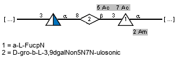
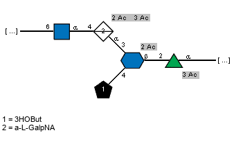

# Report of ssn-clustering run 2205171701
## Metadata
CD-HIT threshold: 99%

Length filter: min 320, max 600Expansion threshold: e-value 1e-30

SSN threshold: score 200

## Info
Total number of proteins in network: 3880 

Number of singletons: 170 

Number of nodes in clusters: 3710 

Number of clusters: 333 

[File with accessions in each cluster](https://github.com/idameitil/phd/tree/master/data/wzy/ssn-clusterings/clustering/2205171701/clusters.tsv)

## Clusters
### Cluster 3
Total number of members in cluster: 531

Number of seeds in cluster: 10

Seeds in cluster:

| protein_accession   | order            | family             | genus       | species             | serotype                            |
|:--------------------|:-----------------|:-------------------|:------------|:--------------------|:------------------------------------|
| ACF61556.1          | Enterobacterales | Enterobacteriaceae | Salmonella  | Salmonella enterica | ssp. enterica sv. Newport           |
| ACF69242.1          | Enterobacterales | Enterobacteriaceae | Salmonella  | Salmonella enterica | Heidelberg                          |
| WP_000055605.1      | Enterobacterales | Enterobacteriaceae | Salmonella  | nan                 | ssp. enterica sv. Kentucky O8 98/39 |
| ACF89798.1          | Enterobacterales | Enterobacteriaceae | Salmonella  | Salmonella enterica | Schwarzengrund                      |
| ACH73921.1          | Enterobacterales | Enterobacteriaceae | Salmonella  | Salmonella enterica | Dublin                              |
| ACH50550.1          | Enterobacterales | Enterobacteriaceae | Salmonella  | Salmonella enterica | Agona                               |
| CAS11643.1          | Enterobacterales | Enterobacteriaceae | Escherichia | Escherichia coli    | O127                                |
| CAR10598.2          | Enterobacterales | Enterobacteriaceae | Escherichia | Escherichia coli    | O81                                 |
| BAI33073.1          | Enterobacterales | Enterobacteriaceae | Escherichia | Escherichia coli    | O103                                |
| ADT77417.1          | Enterobacterales | Enterobacteriaceae | Escherichia | Escherichia coli    | O6                                  |

Number of blast hits in cluster: 521

[MSA fasta](https://github.com/idameitil/phd/tree/master/data/wzy/ssn-clusterings/clustering/2205171701/clusters/0531_3/sequences.afa)

[Malign view](https://github.com/idameitil/phd/tree/master/data/wzy/ssn-clusterings/clustering/2205171701/clusters/0531_3/sequences.malign)

[Fasta of members](https://github.com/idameitil/phd/tree/master/data/wzy/ssn-clusterings/clustering/2205171701/clusters/0531_3/sequences.fa)

[Logoplot](https://github.com/idameitil/phd/tree/master/data/wzy/ssn-clusterings/clustering/2205171701/clusters/0531_3/sequences.logo-001.jpg) (OBS: this is still the old tool)

Sugars in cluster:

['ACF61556.1', 'ACF69242.1', 'WP_000055605.1', 'ACF89798.1', 'ACH73921.1', 'ACH50550.1', 'CAS11643.1', 'CAR10598.2', 'BAI33073.1', 'ADT77417.1']:

Alphafold models for cluster:

[ACH50550.1](https://github.com/idameitil/phd/tree/master/data/wzy/alphafold/2205031317-wzy_missing/af_out/ACH50550.1/ranked_0.pdb)

### Cluster 31
Total number of members in cluster: 135

Number of seeds in cluster: 3

Seeds in cluster:

| protein_accession   | order        | family        | genus         | species                 | serotype   |
|:--------------------|:-------------|:--------------|:--------------|:------------------------|:-----------|
| AHB32215.1          | Moraxellales | Moraxellaceae | Acinetobacter | Acinetobacter baumannii | O1         |
| AHB32861.1          | Moraxellales | Moraxellaceae | Acinetobacter | Acinetobacter baumannii | O25        |
| AHB32799.1          | Moraxellales | Moraxellaceae | Acinetobacter | Acinetobacter baumannii | O26        |

Number of blast hits in cluster: 132

[MSA fasta](https://github.com/idameitil/phd/tree/master/data/wzy/ssn-clusterings/clustering/2205171701/clusters/0135_31/sequences.afa)

[Malign view](https://github.com/idameitil/phd/tree/master/data/wzy/ssn-clusterings/clustering/2205171701/clusters/0135_31/sequences.malign)

[Fasta of members](https://github.com/idameitil/phd/tree/master/data/wzy/ssn-clusterings/clustering/2205171701/clusters/0135_31/sequences.fa)

[Logoplot](https://github.com/idameitil/phd/tree/master/data/wzy/ssn-clusterings/clustering/2205171701/clusters/0135_31/sequences.logo-001.jpg) (OBS: this is still the old tool)

Sugars in cluster:

['AHB32215.1']:

['AHB32861.1', 'AHB32799.1']:

Alphafold models for cluster:

[AHB32215.1](https://github.com/idameitil/phd/tree/master/data/wzy/alphafold/2202060002-wzy_100/af_out/AHB32215.1/ranked_0.pdb)

[AHB32861.1](https://github.com/idameitil/phd/tree/master/data/wzy/alphafold/2202060002-wzy_100/af_out/AHB32861.1/ranked_0.pdb)

### Cluster 32
Total number of members in cluster: 128

Number of seeds in cluster: 1

Seeds in cluster:

| protein_accession   | order            | family             | genus       | species          | serotype   |
|:--------------------|:-----------------|:-------------------|:------------|:-----------------|:-----------|
| BAQ00795.1          | Enterobacterales | Enterobacteriaceae | Escherichia | Escherichia coli | O33        |

Number of blast hits in cluster: 127

[MSA fasta](https://github.com/idameitil/phd/tree/master/data/wzy/ssn-clusterings/clustering/2205171701/clusters/0128_32/sequences.afa)

[Malign view](https://github.com/idameitil/phd/tree/master/data/wzy/ssn-clusterings/clustering/2205171701/clusters/0128_32/sequences.malign)

[Fasta of members](https://github.com/idameitil/phd/tree/master/data/wzy/ssn-clusterings/clustering/2205171701/clusters/0128_32/sequences.fa)

[Logoplot](https://github.com/idameitil/phd/tree/master/data/wzy/ssn-clusterings/clustering/2205171701/clusters/0128_32/sequences.logo-001.jpg) (OBS: this is still the old tool)

Sugars in cluster:

['BAQ00795.1']:

Alphafold models for cluster:

[BAQ00795.1](https://github.com/idameitil/phd/tree/master/data/wzy/alphafold/2202060002-wzy_100/af_out/BAQ00795.1/ranked_0.pdb)

### Cluster 10
Total number of members in cluster: 57

Number of seeds in cluster: 1

Seeds in cluster:

| protein_accession   | order           | family           | genus         | species                  |   serotype |
|:--------------------|:----------------|:-----------------|:--------------|:-------------------------|-----------:|
| CAI34369.1          | Lactobacillales | Streptococcaceae | Streptococcus | Streptococcus pneumoniae |         36 |

Number of blast hits in cluster: 56

[MSA fasta](https://github.com/idameitil/phd/tree/master/data/wzy/ssn-clusterings/clustering/2205171701/clusters/0057_10/sequences.afa)

[Malign view](https://github.com/idameitil/phd/tree/master/data/wzy/ssn-clusterings/clustering/2205171701/clusters/0057_10/sequences.malign)

[Fasta of members](https://github.com/idameitil/phd/tree/master/data/wzy/ssn-clusterings/clustering/2205171701/clusters/0057_10/sequences.fa)

[Logoplot](https://github.com/idameitil/phd/tree/master/data/wzy/ssn-clusterings/clustering/2205171701/clusters/0057_10/sequences.logo-001.jpg) (OBS: this is still the old tool)

Sugars in cluster:

['CAI34369.1']:

Alphafold models for cluster:

[CAI34369.1](https://github.com/idameitil/phd/tree/master/data/wzy/alphafold/2202060002-wzy_100/af_out/CAI34369.1/ranked_0.pdb)

### Cluster 92
Total number of members in cluster: 55

Number of seeds in cluster: 7

Seeds in cluster:

| protein_accession   | order           | family           | genus         | species                  | serotype   |
|:--------------------|:----------------|:-----------------|:--------------|:-------------------------|:-----------|
| CAI34080.1          | Lactobacillales | Streptococcaceae | Streptococcus | Streptococcus pneumoniae | 29         |
| CAI34348.1          | Lactobacillales | Streptococcaceae | Streptococcus | Streptococcus pneumoniae | 35F        |
| CAI34286.1          | Lactobacillales | Streptococcaceae | Streptococcus | Streptococcus pneumoniae | 35A        |
| CAI34310.1          | Lactobacillales | Streptococcaceae | Streptococcus | Streptococcus pneumoniae | 35B        |
| CAI34328.1          | Lactobacillales | Streptococcaceae | Streptococcus | Streptococcus pneumoniae | 35C        |
| CAI34519.1          | Lactobacillales | Streptococcaceae | Streptococcus | Streptococcus pneumoniae | 42         |
| CAI34657.1          | Lactobacillales | Streptococcaceae | Streptococcus | Streptococcus pneumoniae | 47F        |

Number of blast hits in cluster: 48

[MSA fasta](https://github.com/idameitil/phd/tree/master/data/wzy/ssn-clusterings/clustering/2205171701/clusters/0055_92/sequences.afa)

[Malign view](https://github.com/idameitil/phd/tree/master/data/wzy/ssn-clusterings/clustering/2205171701/clusters/0055_92/sequences.malign)

[Fasta of members](https://github.com/idameitil/phd/tree/master/data/wzy/ssn-clusterings/clustering/2205171701/clusters/0055_92/sequences.fa)

[Logoplot](https://github.com/idameitil/phd/tree/master/data/wzy/ssn-clusterings/clustering/2205171701/clusters/0055_92/sequences.logo-001.jpg) (OBS: this is still the old tool)

Sugars in cluster:

['CAI34080.1']:

['CAI34348.1']:

['CAI34286.1']:

['CAI34310.1']:

['CAI34328.1']:

['CAI34519.1']:

['CAI34657.1']:

Alphafold models for cluster:

### Cluster 71
Total number of members in cluster: 49

Number of seeds in cluster: 1

Seeds in cluster:

| protein_accession   | order        | family        | genus         | species                 | serotype   |
|:--------------------|:-------------|:--------------|:--------------|:------------------------|:-----------|
| AHB32411.1          | Moraxellales | Moraxellaceae | Acinetobacter | Acinetobacter baumannii | O10        |

Number of blast hits in cluster: 48

[MSA fasta](https://github.com/idameitil/phd/tree/master/data/wzy/ssn-clusterings/clustering/2205171701/clusters/0049_71/sequences.afa)

[Malign view](https://github.com/idameitil/phd/tree/master/data/wzy/ssn-clusterings/clustering/2205171701/clusters/0049_71/sequences.malign)

[Fasta of members](https://github.com/idameitil/phd/tree/master/data/wzy/ssn-clusterings/clustering/2205171701/clusters/0049_71/sequences.fa)

[Logoplot](https://github.com/idameitil/phd/tree/master/data/wzy/ssn-clusterings/clustering/2205171701/clusters/0049_71/sequences.logo-001.jpg) (OBS: this is still the old tool)

Sugars in cluster:

['AHB32411.1']:

Alphafold models for cluster:

[AHB32411.1](https://github.com/idameitil/phd/tree/master/data/wzy/alphafold/2202060002-wzy_100/af_out/AHB32411.1/ranked_0.pdb)

### Cluster 20
Total number of members in cluster: 49

Number of seeds in cluster: 4

Seeds in cluster:

| protein_accession   | order           | family           | genus         | species                  | serotype   |
|:--------------------|:----------------|:-----------------|:--------------|:-------------------------|:-----------|
| CAI32823.1          | Lactobacillales | Streptococcaceae | Streptococcus | Streptococcus pneumoniae | 6A         |
| CAI32843.1          | Lactobacillales | Streptococcaceae | Streptococcus | Streptococcus pneumoniae | 6B         |
| CAI33700.1          | Lactobacillales | Streptococcaceae | Streptococcus | Streptococcus pneumoniae | 19F        |
| CAI33631.1          | Lactobacillales | Streptococcaceae | Streptococcus | Streptococcus pneumoniae | 19A        |

Number of blast hits in cluster: 45

[MSA fasta](https://github.com/idameitil/phd/tree/master/data/wzy/ssn-clusterings/clustering/2205171701/clusters/0049_20/sequences.afa)

[Malign view](https://github.com/idameitil/phd/tree/master/data/wzy/ssn-clusterings/clustering/2205171701/clusters/0049_20/sequences.malign)

[Fasta of members](https://github.com/idameitil/phd/tree/master/data/wzy/ssn-clusterings/clustering/2205171701/clusters/0049_20/sequences.fa)

[Logoplot](https://github.com/idameitil/phd/tree/master/data/wzy/ssn-clusterings/clustering/2205171701/clusters/0049_20/sequences.logo-001.jpg) (OBS: this is still the old tool)

Sugars in cluster:

['CAI32823.1']:

['CAI32843.1']:

['CAI33700.1']:

['CAI33631.1']:

Alphafold models for cluster:

### Cluster 5
Total number of members in cluster: 48

Number of seeds in cluster: 1

Seeds in cluster:

| protein_accession   | order            | family             | genus       | species          | serotype   |
|:--------------------|:-----------------|:-------------------|:------------|:-----------------|:-----------|
| AFN02899.1          | Enterobacterales | Enterobacteriaceae | Escherichia | Escherichia coli | O180       |

Number of blast hits in cluster: 47

[MSA fasta](https://github.com/idameitil/phd/tree/master/data/wzy/ssn-clusterings/clustering/2205171701/clusters/0048_5/sequences.afa)

[Malign view](https://github.com/idameitil/phd/tree/master/data/wzy/ssn-clusterings/clustering/2205171701/clusters/0048_5/sequences.malign)

[Fasta of members](https://github.com/idameitil/phd/tree/master/data/wzy/ssn-clusterings/clustering/2205171701/clusters/0048_5/sequences.fa)

[Logoplot](https://github.com/idameitil/phd/tree/master/data/wzy/ssn-clusterings/clustering/2205171701/clusters/0048_5/sequences.logo-001.jpg) (OBS: this is still the old tool)

Sugars in cluster:

['AFN02899.1']:

Alphafold models for cluster:

### Cluster 34
Total number of members in cluster: 48

Number of seeds in cluster: 2

Seeds in cluster:

| protein_accession   | order        | family        | genus         | species                 | serotype   |
|:--------------------|:-------------|:--------------|:--------------|:------------------------|:-----------|
| AHB32715.1          | Moraxellales | Moraxellaceae | Acinetobacter | Acinetobacter baumannii | O16        |
| AHB32637.1          | Moraxellales | Moraxellaceae | Acinetobacter | Acinetobacter baumannii | O23        |

Number of blast hits in cluster: 46

[MSA fasta](https://github.com/idameitil/phd/tree/master/data/wzy/ssn-clusterings/clustering/2205171701/clusters/0048_34/sequences.afa)

[Malign view](https://github.com/idameitil/phd/tree/master/data/wzy/ssn-clusterings/clustering/2205171701/clusters/0048_34/sequences.malign)

[Fasta of members](https://github.com/idameitil/phd/tree/master/data/wzy/ssn-clusterings/clustering/2205171701/clusters/0048_34/sequences.fa)

[Logoplot](https://github.com/idameitil/phd/tree/master/data/wzy/ssn-clusterings/clustering/2205171701/clusters/0048_34/sequences.logo-001.jpg) (OBS: this is still the old tool)

Sugars in cluster:

['AHB32715.1']:

['AHB32637.1']:

Alphafold models for cluster:

### Cluster 2
Total number of members in cluster: 43

Number of seeds in cluster: 8

Seeds in cluster:

| protein_accession   | order            | family             | genus      | species             | serotype                   |
|:--------------------|:-----------------|:-------------------|:-----------|:--------------------|:---------------------------|
| WP_000905563.1      | Enterobacterales | Enterobacteriaceae | Salmonella | nan                 | Typhi                      |
| AAO68867.1          | Enterobacterales | Enterobacteriaceae | Salmonella | Salmonella enterica | Typhi                      |
| AAV77445.1          | Enterobacterales | Enterobacteriaceae | Salmonella | Salmonella enterica | Paratyphi A                |
| ACF69726.1          | Enterobacterales | Enterobacteriaceae | Salmonella | Salmonella enterica | Heidelberg                 |
| CAR59582.1          | Enterobacterales | Enterobacteriaceae | Salmonella | Salmonella enterica | Paratyphi A                |
| ACH74809.1          | Enterobacterales | Enterobacteriaceae | Salmonella | Salmonella enterica | Dublin                     |
| CAR37642.1          | Enterobacterales | Enterobacteriaceae | Salmonella | Salmonella enterica | Gallinarum bv. Pullorum 11 |
| AAL20257.1          | Enterobacterales | Enterobacteriaceae | Salmonella | Salmonella enterica | O4 (B) Typhimurium         |

Number of blast hits in cluster: 35

[MSA fasta](https://github.com/idameitil/phd/tree/master/data/wzy/ssn-clusterings/clustering/2205171701/clusters/0043_2/sequences.afa)

[Malign view](https://github.com/idameitil/phd/tree/master/data/wzy/ssn-clusterings/clustering/2205171701/clusters/0043_2/sequences.malign)

[Fasta of members](https://github.com/idameitil/phd/tree/master/data/wzy/ssn-clusterings/clustering/2205171701/clusters/0043_2/sequences.fa)

[Logoplot](https://github.com/idameitil/phd/tree/master/data/wzy/ssn-clusterings/clustering/2205171701/clusters/0043_2/sequences.logo-001.jpg) (OBS: this is still the old tool)

Sugars in cluster:

['WP_000905563.1', 'AAO68867.1']:

['AAV77445.1', 'CAR59582.1']:

['ACF69726.1', 'ACH74809.1']:

['CAR37642.1']:

['AAL20257.1']:

Alphafold models for cluster:

[WP_000905563.1](https://github.com/idameitil/phd/tree/master/data/wzy/alphafold/2202060002-wzy_100/af_out/WP_000905563.1/ranked_0.pdb)

### Cluster 19
Total number of members in cluster: 39

Number of seeds in cluster: 2

Seeds in cluster:

| protein_accession   | order            | family             | genus         | species                 | serotype   |
|:--------------------|:-----------------|:-------------------|:--------------|:------------------------|:-----------|
| AHB32687.1          | Moraxellales     | Moraxellaceae      | Acinetobacter | Acinetobacter baumannii | O14        |
| BAQ01743.1          | Enterobacterales | Enterobacteriaceae | Escherichia   | Escherichia coli        | O144       |

Number of blast hits in cluster: 37

[MSA fasta](https://github.com/idameitil/phd/tree/master/data/wzy/ssn-clusterings/clustering/2205171701/clusters/0039_19/sequences.afa)

[Malign view](https://github.com/idameitil/phd/tree/master/data/wzy/ssn-clusterings/clustering/2205171701/clusters/0039_19/sequences.malign)

[Fasta of members](https://github.com/idameitil/phd/tree/master/data/wzy/ssn-clusterings/clustering/2205171701/clusters/0039_19/sequences.fa)

[Logoplot](https://github.com/idameitil/phd/tree/master/data/wzy/ssn-clusterings/clustering/2205171701/clusters/0039_19/sequences.logo-001.jpg) (OBS: this is still the old tool)

Sugars in cluster:

['AHB32687.1', 'BAQ01743.1']:

Alphafold models for cluster:

[AHB32687.1](https://github.com/idameitil/phd/tree/master/data/wzy/alphafold/2202060002-wzy_100/af_out/AHB32687.1/ranked_0.pdb)

[BAQ01743.1](https://github.com/idameitil/phd/tree/master/data/wzy/alphafold/2202060002-wzy_100/af_out/BAQ01743.1/ranked_0.pdb)

### Cluster 109
Total number of members in cluster: 38

Number of seeds in cluster: 10

Seeds in cluster:

| protein_accession   | order            | family             | genus       | species                     | serotype   |
|:--------------------|:-----------------|:-------------------|:------------|:----------------------------|:-----------|
| AKA20935.1          | Enterobacterales | Yersiniaceae       | Yersinia    | Yersinia pseudotuberculosis | O:2c       |
| AKA20966.1          | Enterobacterales | Yersiniaceae       | Yersinia    | Yersinia pseudotuberculosis | O:4a       |
| AKL88154.1          | Enterobacterales | Yersiniaceae       | Yersinia    | Yersinia pseudotuberculosis | O:8        |
| AAY23739.1          | Enterobacterales | Enterobacteriaceae | Escherichia | Escherichia coli            | O77        |
| AAY23733.1          | Enterobacterales | Enterobacteriaceae | Escherichia | Escherichia coli            | O73        |
| AAY23745.1          | Enterobacterales | Enterobacteriaceae | Escherichia | Escherichia coli            | O106       |
| BAQ01935.1          | Enterobacterales | Enterobacteriaceae | Escherichia | Escherichia coli            | O176       |
| BAQ02177.1          | Enterobacterales | Enterobacteriaceae | Escherichia | Escherichia coli            | O77        |
| BAQ02105.1          | Enterobacterales | Enterobacteriaceae | Escherichia | Escherichia coli            | O17        |
| BAQ00945.1          | Enterobacterales | Enterobacteriaceae | Escherichia | Escherichia coli            | O44        |

Number of blast hits in cluster: 28

[MSA fasta](https://github.com/idameitil/phd/tree/master/data/wzy/ssn-clusterings/clustering/2205171701/clusters/0038_109/sequences.afa)

[Malign view](https://github.com/idameitil/phd/tree/master/data/wzy/ssn-clusterings/clustering/2205171701/clusters/0038_109/sequences.malign)

[Fasta of members](https://github.com/idameitil/phd/tree/master/data/wzy/ssn-clusterings/clustering/2205171701/clusters/0038_109/sequences.fa)

[Logoplot](https://github.com/idameitil/phd/tree/master/data/wzy/ssn-clusterings/clustering/2205171701/clusters/0038_109/sequences.logo-001.jpg) (OBS: this is still the old tool)

Sugars in cluster:

['AKA20935.1']:

['AKA20966.1']:

['AKL88154.1']:

['AAY23739.1', 'BAQ02177.1']:

['AAY23733.1']:

['AAY23745.1']:

['BAQ01935.1']:

['BAQ02105.1']:

['BAQ00945.1']:

Alphafold models for cluster:

[AKA20935.1](https://github.com/idameitil/phd/tree/master/data/wzy/alphafold/2202060002-wzy_100/af_out/AKA20935.1/ranked_0.pdb)

### Cluster 103
Total number of members in cluster: 35

Number of seeds in cluster: 2

Seeds in cluster:

| protein_accession   | order           | family           | genus       | species                | serotype   |
|:--------------------|:----------------|:-----------------|:------------|:-----------------------|:-----------|
| AAM27560.1          | Pseudomonadales | Pseudomonadaceae | Pseudomonas | Pseudomonas aeruginosa | O10        |
| AAM27711.1          | Pseudomonadales | Pseudomonadaceae | Pseudomonas | Pseudomonas aeruginosa | O19        |

Number of blast hits in cluster: 33

[MSA fasta](https://github.com/idameitil/phd/tree/master/data/wzy/ssn-clusterings/clustering/2205171701/clusters/0035_103/sequences.afa)

[Malign view](https://github.com/idameitil/phd/tree/master/data/wzy/ssn-clusterings/clustering/2205171701/clusters/0035_103/sequences.malign)

[Fasta of members](https://github.com/idameitil/phd/tree/master/data/wzy/ssn-clusterings/clustering/2205171701/clusters/0035_103/sequences.fa)

[Logoplot](https://github.com/idameitil/phd/tree/master/data/wzy/ssn-clusterings/clustering/2205171701/clusters/0035_103/sequences.logo-001.jpg) (OBS: this is still the old tool)

Sugars in cluster:

['AAM27560.1']:

['AAM27711.1']:

Alphafold models for cluster:

### Cluster 52
Total number of members in cluster: 34

Number of seeds in cluster: 1

Seeds in cluster:

| protein_accession   | order            | family             | genus       | species          | serotype   |
|:--------------------|:-----------------|:-------------------|:------------|:-----------------|:-----------|
| ACD75796.1          | Enterobacterales | Enterobacteriaceae | Escherichia | Escherichia coli | O63        |

Number of blast hits in cluster: 33

[MSA fasta](https://github.com/idameitil/phd/tree/master/data/wzy/ssn-clusterings/clustering/2205171701/clusters/0034_52/sequences.afa)

[Malign view](https://github.com/idameitil/phd/tree/master/data/wzy/ssn-clusterings/clustering/2205171701/clusters/0034_52/sequences.malign)

[Fasta of members](https://github.com/idameitil/phd/tree/master/data/wzy/ssn-clusterings/clustering/2205171701/clusters/0034_52/sequences.fa)

[Logoplot](https://github.com/idameitil/phd/tree/master/data/wzy/ssn-clusterings/clustering/2205171701/clusters/0034_52/sequences.logo-001.jpg) (OBS: this is still the old tool)

Sugars in cluster:

['ACD75796.1']:

Alphafold models for cluster:

[ACD75796.1](https://github.com/idameitil/phd/tree/master/data/wzy/alphafold/2202060002-wzy_100/af_out/ACD75796.1/ranked_0.pdb)

### Cluster 121
Total number of members in cluster: 33

Number of seeds in cluster: 0

Seeds in cluster:

| protein_accession   | order   | family   | genus   | species   | serotype   |
|---------------------|---------|----------|---------|-----------|------------|

Number of blast hits in cluster: 33

[MSA fasta](https://github.com/idameitil/phd/tree/master/data/wzy/ssn-clusterings/clustering/2205171701/clusters/0033_121/sequences.afa)

[Malign view](https://github.com/idameitil/phd/tree/master/data/wzy/ssn-clusterings/clustering/2205171701/clusters/0033_121/sequences.malign)

[Fasta of members](https://github.com/idameitil/phd/tree/master/data/wzy/ssn-clusterings/clustering/2205171701/clusters/0033_121/sequences.fa)

[Logoplot](https://github.com/idameitil/phd/tree/master/data/wzy/ssn-clusterings/clustering/2205171701/clusters/0033_121/sequences.logo-001.jpg) (OBS: this is still the old tool)

Sugars in cluster:

Alphafold models for cluster:

### Cluster 144
Total number of members in cluster: 30

Number of seeds in cluster: 1

Seeds in cluster:

| protein_accession   | order            | family             | genus       | species          | serotype   |
|:--------------------|:-----------------|:-------------------|:------------|:-----------------|:-----------|
| ADI43271.1          | Enterobacterales | Enterobacteriaceae | Escherichia | Escherichia coli | O27        |

Number of blast hits in cluster: 29

[MSA fasta](https://github.com/idameitil/phd/tree/master/data/wzy/ssn-clusterings/clustering/2205171701/clusters/0030_144/sequences.afa)

[Malign view](https://github.com/idameitil/phd/tree/master/data/wzy/ssn-clusterings/clustering/2205171701/clusters/0030_144/sequences.malign)

[Fasta of members](https://github.com/idameitil/phd/tree/master/data/wzy/ssn-clusterings/clustering/2205171701/clusters/0030_144/sequences.fa)

[Logoplot](https://github.com/idameitil/phd/tree/master/data/wzy/ssn-clusterings/clustering/2205171701/clusters/0030_144/sequences.logo-001.jpg) (OBS: this is still the old tool)

Sugars in cluster:

['ADI43271.1']:

Alphafold models for cluster:

[ADI43271.1](https://github.com/idameitil/phd/tree/master/data/wzy/alphafold/2202060002-wzy_100/af_out/ADI43271.1/ranked_0.pdb)

### Cluster 107
Total number of members in cluster: 29

Number of seeds in cluster: 2

Seeds in cluster:

| protein_accession   | order            | family             | genus       | species                | serotype   |
|:--------------------|:-----------------|:-------------------|:------------|:-----------------------|:-----------|
| AAZ85713.1          | Enterobacterales | Enterobacteriaceae | Escherichia | Escherichia coli       | O138       |
| AAM27615.1          | Pseudomonadales  | Pseudomonadaceae   | Pseudomonas | Pseudomonas aeruginosa | O13        |

Number of blast hits in cluster: 27

[MSA fasta](https://github.com/idameitil/phd/tree/master/data/wzy/ssn-clusterings/clustering/2205171701/clusters/0029_107/sequences.afa)

[Malign view](https://github.com/idameitil/phd/tree/master/data/wzy/ssn-clusterings/clustering/2205171701/clusters/0029_107/sequences.malign)

[Fasta of members](https://github.com/idameitil/phd/tree/master/data/wzy/ssn-clusterings/clustering/2205171701/clusters/0029_107/sequences.fa)

[Logoplot](https://github.com/idameitil/phd/tree/master/data/wzy/ssn-clusterings/clustering/2205171701/clusters/0029_107/sequences.logo-001.jpg) (OBS: this is still the old tool)

Sugars in cluster:

['AAZ85713.1']:

['AAM27615.1']:

Alphafold models for cluster:

[AAM27615.1](https://github.com/idameitil/phd/tree/master/data/wzy/alphafold/2205031317-wzy/af_out/AAM27615.1/ranked_0.pdb)

### Cluster 72
Total number of members in cluster: 27

Number of seeds in cluster: 7

Seeds in cluster:

| protein_accession   | order           | family           | genus       | species                | serotype   |
|:--------------------|:----------------|:-----------------|:------------|:-----------------------|:-----------|
| AAA97573.1          | Pseudomonadales | Pseudomonadaceae | Pseudomonas | Pseudomonas aeruginosa | O5         |
| AAC45857.1          | Pseudomonadales | Pseudomonadaceae | Pseudomonas | Pseudomonas aeruginosa | O5         |
| AAM27728.1          | Pseudomonadales | Pseudomonadaceae | Pseudomonas | Pseudomonas aeruginosa | O2         |
| AAM27801.1          | Pseudomonadales | Pseudomonadaceae | Pseudomonas | Pseudomonas aeruginosa | O5         |
| AAM27662.1          | Pseudomonadales | Pseudomonadaceae | Pseudomonas | Pseudomonas aeruginosa | O16        |
| AAM27693.1          | Pseudomonadales | Pseudomonadaceae | Pseudomonas | Pseudomonas aeruginosa | O18        |
| AAM27748.1          | Pseudomonadales | Pseudomonadaceae | Pseudomonas | Pseudomonas aeruginosa | O20        |

Number of blast hits in cluster: 20

[MSA fasta](https://github.com/idameitil/phd/tree/master/data/wzy/ssn-clusterings/clustering/2205171701/clusters/0027_72/sequences.afa)

[Malign view](https://github.com/idameitil/phd/tree/master/data/wzy/ssn-clusterings/clustering/2205171701/clusters/0027_72/sequences.malign)

[Fasta of members](https://github.com/idameitil/phd/tree/master/data/wzy/ssn-clusterings/clustering/2205171701/clusters/0027_72/sequences.fa)

[Logoplot](https://github.com/idameitil/phd/tree/master/data/wzy/ssn-clusterings/clustering/2205171701/clusters/0027_72/sequences.logo-001.jpg) (OBS: this is still the old tool)

Sugars in cluster:

['AAA97573.1', 'AAC45857.1', 'AAM27801.1']:

['AAM27728.1']:

['AAM27662.1']:

['AAM27693.1']:

['AAM27748.1']:

Alphafold models for cluster:

[AAA97573.1](https://github.com/idameitil/phd/tree/master/data/wzy/alphafold/2202060002-wzy_100/af_out/AAA97573.1/ranked_0.pdb)

[AAC45857.1](https://github.com/idameitil/phd/tree/master/data/wzy/alphafold/2202060002-wzy_100/af_out/AAC45857.1/ranked_0.pdb)

### Cluster 11
Total number of members in cluster: 27

Number of seeds in cluster: 5

Seeds in cluster:

| protein_accession   | order            | family             | genus       | species             | serotype   |
|:--------------------|:-----------------|:-------------------|:------------|:--------------------|:-----------|
| BAQ01024.1          | Enterobacterales | Enterobacteriaceae | Escherichia | Escherichia coli    | O51        |
| BAQ00622.1          | Enterobacterales | Enterobacteriaceae | Escherichia | Escherichia coli    | O10        |
| AQU71752.1          | Enterobacterales | Enterobacteriaceae | Escherichia | Escherichia coli    | O1         |
| AQU71805.1          | Enterobacterales | Enterobacteriaceae | Escherichia | Escherichia coli    | O2         |
| AFW04883.1          | Enterobacterales | Enterobacteriaceae | Salmonella  | Salmonella enterica | O57        |

Number of blast hits in cluster: 22

[MSA fasta](https://github.com/idameitil/phd/tree/master/data/wzy/ssn-clusterings/clustering/2205171701/clusters/0027_11/sequences.afa)

[Malign view](https://github.com/idameitil/phd/tree/master/data/wzy/ssn-clusterings/clustering/2205171701/clusters/0027_11/sequences.malign)

[Fasta of members](https://github.com/idameitil/phd/tree/master/data/wzy/ssn-clusterings/clustering/2205171701/clusters/0027_11/sequences.fa)

[Logoplot](https://github.com/idameitil/phd/tree/master/data/wzy/ssn-clusterings/clustering/2205171701/clusters/0027_11/sequences.logo-001.jpg) (OBS: this is still the old tool)

Sugars in cluster:

['BAQ01024.1']:

['BAQ00622.1']:

['AQU71752.1']:

['AQU71805.1']:

['AFW04883.1']:

Alphafold models for cluster:

### Cluster 70
Total number of members in cluster: 25

Number of seeds in cluster: 1

Seeds in cluster:

| protein_accession   | order           | family           | genus         | species                  |   serotype |
|:--------------------|:----------------|:-----------------|:--------------|:-------------------------|-----------:|
| CAI34269.1          | Lactobacillales | Streptococcaceae | Streptococcus | Streptococcus pneumoniae |         34 |

Number of blast hits in cluster: 24

[MSA fasta](https://github.com/idameitil/phd/tree/master/data/wzy/ssn-clusterings/clustering/2205171701/clusters/0025_70/sequences.afa)

[Malign view](https://github.com/idameitil/phd/tree/master/data/wzy/ssn-clusterings/clustering/2205171701/clusters/0025_70/sequences.malign)

[Fasta of members](https://github.com/idameitil/phd/tree/master/data/wzy/ssn-clusterings/clustering/2205171701/clusters/0025_70/sequences.fa)

[Logoplot](https://github.com/idameitil/phd/tree/master/data/wzy/ssn-clusterings/clustering/2205171701/clusters/0025_70/sequences.logo-001.jpg) (OBS: this is still the old tool)

Sugars in cluster:

['CAI34269.1']:

Alphafold models for cluster:

### Cluster 145
Total number of members in cluster: 25

Number of seeds in cluster: 3

Seeds in cluster:

| protein_accession   | order            | family             | genus       | species           | serotype   |
|:--------------------|:-----------------|:-------------------|:------------|:------------------|:-----------|
| ABE98437.1          | Enterobacterales | Enterobacteriaceae | Escherichia | Escherichia coli  | O146       |
| ABI98986.1          | Enterobacterales | Enterobacteriaceae | Escherichia | Escherichia coli  | O147       |
| ABU80601.1          | Enterobacterales | Enterobacteriaceae | Shigella    | Shigella flexneri | 6          |

Number of blast hits in cluster: 22

[MSA fasta](https://github.com/idameitil/phd/tree/master/data/wzy/ssn-clusterings/clustering/2205171701/clusters/0025_145/sequences.afa)

[Malign view](https://github.com/idameitil/phd/tree/master/data/wzy/ssn-clusterings/clustering/2205171701/clusters/0025_145/sequences.malign)

[Fasta of members](https://github.com/idameitil/phd/tree/master/data/wzy/ssn-clusterings/clustering/2205171701/clusters/0025_145/sequences.fa)

[Logoplot](https://github.com/idameitil/phd/tree/master/data/wzy/ssn-clusterings/clustering/2205171701/clusters/0025_145/sequences.logo-001.jpg) (OBS: this is still the old tool)

Sugars in cluster:

['ABE98437.1']:

['ABI98986.1']:

['ABU80601.1']:

Alphafold models for cluster:

[ABI98986.1](https://github.com/idameitil/phd/tree/master/data/wzy/alphafold/2202060002-wzy_100/af_out/ABI98986.1/ranked_0.pdb)

### Cluster 83
Total number of members in cluster: 24

Number of seeds in cluster: 5

Seeds in cluster:

| protein_accession   | order           | family           | genus         | species                  | serotype   |
|:--------------------|:----------------|:-----------------|:--------------|:-------------------------|:-----------|
| CAI33105.1          | Lactobacillales | Streptococcaceae | Streptococcus | Streptococcus pneumoniae | 10F        |
| CAI33048.1          | Lactobacillales | Streptococcaceae | Streptococcus | Streptococcus pneumoniae | 10A        |
| CAI34733.1          | Lactobacillales | Streptococcaceae | Streptococcus | Streptococcus pneumoniae | 10B        |
| CAI33084.1          | Lactobacillales | Streptococcaceae | Streptococcus | Streptococcus pneumoniae | 10C        |
| CAI34436.1          | Lactobacillales | Streptococcaceae | Streptococcus | Streptococcus pneumoniae | 39         |

Number of blast hits in cluster: 19

[MSA fasta](https://github.com/idameitil/phd/tree/master/data/wzy/ssn-clusterings/clustering/2205171701/clusters/0024_83/sequences.afa)

[Malign view](https://github.com/idameitil/phd/tree/master/data/wzy/ssn-clusterings/clustering/2205171701/clusters/0024_83/sequences.malign)

[Fasta of members](https://github.com/idameitil/phd/tree/master/data/wzy/ssn-clusterings/clustering/2205171701/clusters/0024_83/sequences.fa)

[Logoplot](https://github.com/idameitil/phd/tree/master/data/wzy/ssn-clusterings/clustering/2205171701/clusters/0024_83/sequences.logo-001.jpg) (OBS: this is still the old tool)

Sugars in cluster:

['CAI33105.1']:

['CAI33048.1']:

['CAI34733.1']:

['CAI33084.1']:

['CAI34436.1']:

Alphafold models for cluster:

[CAI33105.1](https://github.com/idameitil/phd/tree/master/data/wzy/alphafold/2201200806-polymerases_AlphaFold_batch1/af_out/CAI33105.1/ranked_0.pdb)

[CAI33084.1](https://github.com/idameitil/phd/tree/master/data/wzy/alphafold/2205031317-wzy/af_out/CAI33084.1/ranked_0.pdb)

### Cluster 216
Total number of members in cluster: 24

Number of seeds in cluster: 2

Seeds in cluster:

| protein_accession   | order        | family        | genus         | species                    | serotype   |
|:--------------------|:-------------|:--------------|:--------------|:---------------------------|:-----------|
| AHB32666.1          | Moraxellales | Moraxellaceae | Acinetobacter | Acinetobacter nosocomialis | O4         |
| AHB32888.2          | Moraxellales | Moraxellaceae | Acinetobacter | Acinetobacter baumannii    | O7         |

Number of blast hits in cluster: 22

[MSA fasta](https://github.com/idameitil/phd/tree/master/data/wzy/ssn-clusterings/clustering/2205171701/clusters/0024_216/sequences.afa)

[Malign view](https://github.com/idameitil/phd/tree/master/data/wzy/ssn-clusterings/clustering/2205171701/clusters/0024_216/sequences.malign)

[Fasta of members](https://github.com/idameitil/phd/tree/master/data/wzy/ssn-clusterings/clustering/2205171701/clusters/0024_216/sequences.fa)

[Logoplot](https://github.com/idameitil/phd/tree/master/data/wzy/ssn-clusterings/clustering/2205171701/clusters/0024_216/sequences.logo-001.jpg) (OBS: this is still the old tool)

Sugars in cluster:

['AHB32666.1']:

['AHB32888.2']:

Alphafold models for cluster:

[AHB32666.1](https://github.com/idameitil/phd/tree/master/data/wzy/alphafold/2202060002-wzy_100/af_out/AHB32666.1/ranked_0.pdb)

[AHB32888.2](https://github.com/idameitil/phd/tree/master/data/wzy/alphafold/2202060002-wzy_100/af_out/AHB32888.2/ranked_0.pdb)

### Cluster 134
Total number of members in cluster: 24

Number of seeds in cluster: 1

Seeds in cluster:

| protein_accession   | order            | family             | genus      | species             | serotype   |
|:--------------------|:-----------------|:-------------------|:-----------|:--------------------|:-----------|
| AFW04828.1          | Enterobacterales | Enterobacteriaceae | Salmonella | Salmonella enterica | O44        |

Number of blast hits in cluster: 23

[MSA fasta](https://github.com/idameitil/phd/tree/master/data/wzy/ssn-clusterings/clustering/2205171701/clusters/0024_134/sequences.afa)

[Malign view](https://github.com/idameitil/phd/tree/master/data/wzy/ssn-clusterings/clustering/2205171701/clusters/0024_134/sequences.malign)

[Fasta of members](https://github.com/idameitil/phd/tree/master/data/wzy/ssn-clusterings/clustering/2205171701/clusters/0024_134/sequences.fa)

[Logoplot](https://github.com/idameitil/phd/tree/master/data/wzy/ssn-clusterings/clustering/2205171701/clusters/0024_134/sequences.logo-001.jpg) (OBS: this is still the old tool)

Sugars in cluster:

['AFW04828.1']:

Alphafold models for cluster:

### Cluster 6
Total number of members in cluster: 23

Number of seeds in cluster: 1

Seeds in cluster:

| protein_accession   | order           | family           | genus       | species                | serotype   |
|:--------------------|:----------------|:-----------------|:------------|:-----------------------|:-----------|
| AAM27595.1          | Pseudomonadales | Pseudomonadaceae | Pseudomonas | Pseudomonas aeruginosa | O12        |

Number of blast hits in cluster: 22

[MSA fasta](https://github.com/idameitil/phd/tree/master/data/wzy/ssn-clusterings/clustering/2205171701/clusters/0023_6/sequences.afa)

[Malign view](https://github.com/idameitil/phd/tree/master/data/wzy/ssn-clusterings/clustering/2205171701/clusters/0023_6/sequences.malign)

[Fasta of members](https://github.com/idameitil/phd/tree/master/data/wzy/ssn-clusterings/clustering/2205171701/clusters/0023_6/sequences.fa)

[Logoplot](https://github.com/idameitil/phd/tree/master/data/wzy/ssn-clusterings/clustering/2205171701/clusters/0023_6/sequences.logo-001.jpg) (OBS: this is still the old tool)

Sugars in cluster:

['AAM27595.1']:

Alphafold models for cluster:

### Cluster 120
Total number of members in cluster: 23

Number of seeds in cluster: 2

Seeds in cluster:

| protein_accession   | order           | family           | genus         | species                  | serotype   |
|:--------------------|:----------------|:-----------------|:--------------|:-------------------------|:-----------|
| CAI33798.1          | Lactobacillales | Streptococcaceae | Streptococcus | Streptococcus pneumoniae | 22F        |
| CAI33774.1          | Lactobacillales | Streptococcaceae | Streptococcus | Streptococcus pneumoniae | 22A        |

Number of blast hits in cluster: 21

[MSA fasta](https://github.com/idameitil/phd/tree/master/data/wzy/ssn-clusterings/clustering/2205171701/clusters/0023_120/sequences.afa)

[Malign view](https://github.com/idameitil/phd/tree/master/data/wzy/ssn-clusterings/clustering/2205171701/clusters/0023_120/sequences.malign)

[Fasta of members](https://github.com/idameitil/phd/tree/master/data/wzy/ssn-clusterings/clustering/2205171701/clusters/0023_120/sequences.fa)

[Logoplot](https://github.com/idameitil/phd/tree/master/data/wzy/ssn-clusterings/clustering/2205171701/clusters/0023_120/sequences.logo-001.jpg) (OBS: this is still the old tool)

Sugars in cluster:

['CAI33798.1']:

['CAI33774.1']:

Alphafold models for cluster:

[CAI33798.1](https://github.com/idameitil/phd/tree/master/data/wzy/alphafold/2202060002-wzy_100/af_out/CAI33798.1/ranked_0.pdb)

### Cluster 147
Total number of members in cluster: 22

Number of seeds in cluster: 2

Seeds in cluster:

| protein_accession   | order           | family           | genus         | species                  | serotype   |
|:--------------------|:----------------|:-----------------|:--------------|:-------------------------|:-----------|
| CAI33862.1          | Lactobacillales | Streptococcaceae | Streptococcus | Streptococcus pneumoniae | 23F        |
| CAI33840.1          | Lactobacillales | Streptococcaceae | Streptococcus | Streptococcus pneumoniae | 23B        |

Number of blast hits in cluster: 20

[MSA fasta](https://github.com/idameitil/phd/tree/master/data/wzy/ssn-clusterings/clustering/2205171701/clusters/0022_147/sequences.afa)

[Malign view](https://github.com/idameitil/phd/tree/master/data/wzy/ssn-clusterings/clustering/2205171701/clusters/0022_147/sequences.malign)

[Fasta of members](https://github.com/idameitil/phd/tree/master/data/wzy/ssn-clusterings/clustering/2205171701/clusters/0022_147/sequences.fa)

[Logoplot](https://github.com/idameitil/phd/tree/master/data/wzy/ssn-clusterings/clustering/2205171701/clusters/0022_147/sequences.logo-001.jpg) (OBS: this is still the old tool)

Sugars in cluster:

['CAI33862.1']:

['CAI33840.1']:

Alphafold models for cluster:

[CAI33862.1](https://github.com/idameitil/phd/tree/master/data/wzy/alphafold/2202060002-wzy_100/af_out/CAI33862.1/ranked_0.pdb)

### Cluster 168
Total number of members in cluster: 21

Number of seeds in cluster: 6

Seeds in cluster:

| protein_accession   | order            | family             | genus      | species             | serotype                     |
|:--------------------|:-----------------|:-------------------|:-----------|:--------------------|:-----------------------------|
| CAA43077.1          | Enterobacterales | Enterobacteriaceae | Salmonella | Salmonella enterica | O3,10 (E1) Anatum            |
| AAB48190.1          | Enterobacterales | Enterobacteriaceae | Salmonella | Salmonella enterica | ssp. enterica sv. Strasbourg |
| WP_000231472.1      | Enterobacterales | Enterobacteriaceae | Salmonella | Salmonella enterica | Weltevreden                  |
| AGS07316.1          | Enterobacterales | Enterobacteriaceae | Salmonella | Salmonella enterica | O1,3,19 (E4) Senftenberg     |
| AGS07327.1          | Enterobacterales | Enterobacteriaceae | Salmonella | Salmonella enterica | O3,10 (E1) Anatum            |
| AGS07363.1          | Enterobacterales | Enterobacteriaceae | Salmonella | Salmonella enterica | ssp. enterica sv. Strasbourg |

Number of blast hits in cluster: 15

[MSA fasta](https://github.com/idameitil/phd/tree/master/data/wzy/ssn-clusterings/clustering/2205171701/clusters/0021_168/sequences.afa)

[Malign view](https://github.com/idameitil/phd/tree/master/data/wzy/ssn-clusterings/clustering/2205171701/clusters/0021_168/sequences.malign)

[Fasta of members](https://github.com/idameitil/phd/tree/master/data/wzy/ssn-clusterings/clustering/2205171701/clusters/0021_168/sequences.fa)

[Logoplot](https://github.com/idameitil/phd/tree/master/data/wzy/ssn-clusterings/clustering/2205171701/clusters/0021_168/sequences.logo-001.jpg) (OBS: this is still the old tool)

Sugars in cluster:

['CAA43077.1', 'AGS07327.1']:

['AAB48190.1', 'AGS07363.1']:

['WP_000231472.1']:

['AGS07316.1']:

Alphafold models for cluster:

### Cluster 80
Total number of members in cluster: 20

Number of seeds in cluster: 1

Seeds in cluster:

| protein_accession   | order            | family             | genus       | species          | serotype   |
|:--------------------|:-----------------|:-------------------|:------------|:-----------------|:-----------|
| AAC45844.1          | Enterobacterales | Enterobacteriaceae | Escherichia | Escherichia coli | O8         |

Number of blast hits in cluster: 19

[MSA fasta](https://github.com/idameitil/phd/tree/master/data/wzy/ssn-clusterings/clustering/2205171701/clusters/0020_80/sequences.afa)

[Malign view](https://github.com/idameitil/phd/tree/master/data/wzy/ssn-clusterings/clustering/2205171701/clusters/0020_80/sequences.malign)

[Fasta of members](https://github.com/idameitil/phd/tree/master/data/wzy/ssn-clusterings/clustering/2205171701/clusters/0020_80/sequences.fa)

[Logoplot](https://github.com/idameitil/phd/tree/master/data/wzy/ssn-clusterings/clustering/2205171701/clusters/0020_80/sequences.logo-001.jpg) (OBS: this is still the old tool)

Sugars in cluster:

['AAC45844.1']:

Alphafold models for cluster:

### Cluster 53
Total number of members in cluster: 20

Number of seeds in cluster: 7

Seeds in cluster:

| protein_accession   | order            | family             | genus       | species          | serotype   |
|:--------------------|:-----------------|:-------------------|:------------|:-----------------|:-----------|
| ABK27355.1          | Enterobacterales | Enterobacteriaceae | Escherichia | Escherichia coli | O103       |
| ABK27354.1          | Enterobacterales | Enterobacteriaceae | Escherichia | Escherichia coli | O103       |
| ABK27351.1          | Enterobacterales | Enterobacteriaceae | Escherichia | Escherichia coli | O103       |
| BAI31288.1          | Enterobacterales | Enterobacteriaceae | Escherichia | Escherichia coli | O103       |
| ABK27350.1          | Enterobacterales | Enterobacteriaceae | Escherichia | Escherichia coli | O103       |
| ABK27321.1          | Enterobacterales | Enterobacteriaceae | Escherichia | Escherichia coli | O103       |
| ABK27352.1          | Enterobacterales | Enterobacteriaceae | Escherichia | Escherichia coli | O103       |

Number of blast hits in cluster: 13

[MSA fasta](https://github.com/idameitil/phd/tree/master/data/wzy/ssn-clusterings/clustering/2205171701/clusters/0020_53/sequences.afa)

[Malign view](https://github.com/idameitil/phd/tree/master/data/wzy/ssn-clusterings/clustering/2205171701/clusters/0020_53/sequences.malign)

[Fasta of members](https://github.com/idameitil/phd/tree/master/data/wzy/ssn-clusterings/clustering/2205171701/clusters/0020_53/sequences.fa)

[Logoplot](https://github.com/idameitil/phd/tree/master/data/wzy/ssn-clusterings/clustering/2205171701/clusters/0020_53/sequences.logo-001.jpg) (OBS: this is still the old tool)

Sugars in cluster:

['ABK27355.1', 'ABK27354.1', 'ABK27351.1', 'BAI31288.1', 'ABK27350.1', 'ABK27321.1', 'ABK27352.1']:

Alphafold models for cluster:

[ABK27355.1](https://github.com/idameitil/phd/tree/master/data/wzy/alphafold/2205031317-wzy/af_out/ABK27355.1/ranked_0.pdb)

### Cluster 255
Total number of members in cluster: 20

Number of seeds in cluster: 0

Seeds in cluster:

| protein_accession   | order   | family   | genus   | species   | serotype   |
|---------------------|---------|----------|---------|-----------|------------|

Number of blast hits in cluster: 20

[MSA fasta](https://github.com/idameitil/phd/tree/master/data/wzy/ssn-clusterings/clustering/2205171701/clusters/0020_255/sequences.afa)

[Malign view](https://github.com/idameitil/phd/tree/master/data/wzy/ssn-clusterings/clustering/2205171701/clusters/0020_255/sequences.malign)

[Fasta of members](https://github.com/idameitil/phd/tree/master/data/wzy/ssn-clusterings/clustering/2205171701/clusters/0020_255/sequences.fa)

[Logoplot](https://github.com/idameitil/phd/tree/master/data/wzy/ssn-clusterings/clustering/2205171701/clusters/0020_255/sequences.logo-001.jpg) (OBS: this is still the old tool)

Sugars in cluster:

Alphafold models for cluster:

### Cluster 13
Total number of members in cluster: 20

Number of seeds in cluster: 5

Seeds in cluster:

| protein_accession   | order            | family             | genus       | species              | serotype   |
|:--------------------|:-----------------|:-------------------|:------------|:---------------------|:-----------|
| AFC91472.1          | Enterobacterales | Enterobacteriaceae | Escherichia | Escherichia coli     | O121       |
| AFC91514.1          | Enterobacterales | Enterobacteriaceae | Escherichia | Escherichia coli     | O121       |
| AAO39700.1          | Enterobacterales | Enterobacteriaceae | Escherichia | Escherichia coli     | O121       |
| AFC91570.1          | Enterobacterales | Enterobacteriaceae | Escherichia | Escherichia coli     | O121       |
| AAR97964.1          | Enterobacterales | Enterobacteriaceae | Shigella    | Shigella dysenteriae | 7          |

Number of blast hits in cluster: 15

[MSA fasta](https://github.com/idameitil/phd/tree/master/data/wzy/ssn-clusterings/clustering/2205171701/clusters/0020_13/sequences.afa)

[Malign view](https://github.com/idameitil/phd/tree/master/data/wzy/ssn-clusterings/clustering/2205171701/clusters/0020_13/sequences.malign)

[Fasta of members](https://github.com/idameitil/phd/tree/master/data/wzy/ssn-clusterings/clustering/2205171701/clusters/0020_13/sequences.fa)

[Logoplot](https://github.com/idameitil/phd/tree/master/data/wzy/ssn-clusterings/clustering/2205171701/clusters/0020_13/sequences.logo-001.jpg) (OBS: this is still the old tool)

Sugars in cluster:

['AFC91472.1', 'AFC91514.1', 'AAO39700.1', 'AFC91570.1']:

['AAR97964.1']:

Alphafold models for cluster:

[AFC91472.1](https://github.com/idameitil/phd/tree/master/data/wzy/alphafold/2202060002-wzy_100/af_out/AFC91472.1/ranked_0.pdb)

### Cluster 99
Total number of members in cluster: 19

Number of seeds in cluster: 1

Seeds in cluster:

| protein_accession   | order            | family       | genus    | species          | serotype   |
|:--------------------|:-----------------|:-------------|:---------|:-----------------|:-----------|
| CDF66396.1          | Enterobacterales | Yersiniaceae | Yersinia | Yersinia similis | O:9        |

Number of blast hits in cluster: 18

[MSA fasta](https://github.com/idameitil/phd/tree/master/data/wzy/ssn-clusterings/clustering/2205171701/clusters/0019_99/sequences.afa)

[Malign view](https://github.com/idameitil/phd/tree/master/data/wzy/ssn-clusterings/clustering/2205171701/clusters/0019_99/sequences.malign)

[Fasta of members](https://github.com/idameitil/phd/tree/master/data/wzy/ssn-clusterings/clustering/2205171701/clusters/0019_99/sequences.fa)

[Logoplot](https://github.com/idameitil/phd/tree/master/data/wzy/ssn-clusterings/clustering/2205171701/clusters/0019_99/sequences.logo-001.jpg) (OBS: this is still the old tool)

Sugars in cluster:

['CDF66396.1']:

Alphafold models for cluster:

[CDF66396.1](https://github.com/idameitil/phd/tree/master/data/wzy/alphafold/2205031317-wzy/af_out/CDF66396.1/ranked_0.pdb)

### Cluster 55
Total number of members in cluster: 19

Number of seeds in cluster: 4

Seeds in cluster:

| protein_accession   | order            | family             | genus       | species          | serotype   |
|:--------------------|:-----------------|:-------------------|:------------|:-----------------|:-----------|
| ADC54950.1          | Enterobacterales | Enterobacteriaceae | Escherichia | Escherichia coli | O18        |
| BAQ00669.1          | Enterobacterales | Enterobacteriaceae | Escherichia | Escherichia coli | O18ab      |
| BAQ01732.1          | Enterobacterales | Enterobacteriaceae | Escherichia | Escherichia coli | O142       |
| BAQ00687.1          | Enterobacterales | Enterobacteriaceae | Escherichia | Escherichia coli | O18ac      |

Number of blast hits in cluster: 15

[MSA fasta](https://github.com/idameitil/phd/tree/master/data/wzy/ssn-clusterings/clustering/2205171701/clusters/0019_55/sequences.afa)

[Malign view](https://github.com/idameitil/phd/tree/master/data/wzy/ssn-clusterings/clustering/2205171701/clusters/0019_55/sequences.malign)

[Fasta of members](https://github.com/idameitil/phd/tree/master/data/wzy/ssn-clusterings/clustering/2205171701/clusters/0019_55/sequences.fa)

[Logoplot](https://github.com/idameitil/phd/tree/master/data/wzy/ssn-clusterings/clustering/2205171701/clusters/0019_55/sequences.logo-001.jpg) (OBS: this is still the old tool)

Sugars in cluster:

['ADC54950.1']:

['BAQ00669.1']:

['BAQ01732.1']:

['BAQ00687.1']:

Alphafold models for cluster:

[ADC54950.1](https://github.com/idameitil/phd/tree/master/data/wzy/alphafold/2205031317-wzy/af_out/ADC54950.1/ranked_0.pdb)

### Cluster 209
Total number of members in cluster: 19

Number of seeds in cluster: 6

Seeds in cluster:

| protein_accession   | order            | family             | genus      | species             | serotype                            |
|:--------------------|:-----------------|:-------------------|:-----------|:--------------------|:------------------------------------|
| CAA43912.1          | Enterobacterales | Enterobacteriaceae | Salmonella | Salmonella enterica | Muenchen                            |
| WP_001529369.1      | Enterobacterales | Enterobacteriaceae | Salmonella | Salmonella enterica | ssp. enterica sv. Kentucky O8 98/39 |
| WP_000936592.1      | Enterobacterales | Enterobacteriaceae | Salmonella | Salmonella enterica | ssp. enterica sv. Newport           |
| WP_000936591.1      | Enterobacterales | Enterobacteriaceae | Salmonella | nan                 | Hadar                               |
| ACF64132.1          | Enterobacterales | Enterobacteriaceae | Salmonella | Salmonella enterica | ssp. enterica sv. Newport           |
| WP_000936589.1      | Enterobacterales | Enterobacteriaceae | Salmonella | nan                 | ssp. enterica sv. Kentucky O8 98/39 |

Number of blast hits in cluster: 13

[MSA fasta](https://github.com/idameitil/phd/tree/master/data/wzy/ssn-clusterings/clustering/2205171701/clusters/0019_209/sequences.afa)

[Malign view](https://github.com/idameitil/phd/tree/master/data/wzy/ssn-clusterings/clustering/2205171701/clusters/0019_209/sequences.malign)

[Fasta of members](https://github.com/idameitil/phd/tree/master/data/wzy/ssn-clusterings/clustering/2205171701/clusters/0019_209/sequences.fa)

[Logoplot](https://github.com/idameitil/phd/tree/master/data/wzy/ssn-clusterings/clustering/2205171701/clusters/0019_209/sequences.logo-001.jpg) (OBS: this is still the old tool)

Sugars in cluster:

['CAA43912.1', 'WP_000936591.1']:

['WP_001529369.1', 'WP_000936589.1']:

['WP_000936592.1', 'ACF64132.1']:

Alphafold models for cluster:

### Cluster 115
Total number of members in cluster: 19

Number of seeds in cluster: 4

Seeds in cluster:

| protein_accession   | order            | family             | genus       | species          | serotype      |
|:--------------------|:-----------------|:-------------------|:------------|:-----------------|:--------------|
| ACD37165.1          | Enterobacterales | Enterobacteriaceae | Escherichia | Escherichia coli | O13           |
| ACD37173.1          | Enterobacterales | Enterobacteriaceae | Escherichia | Escherichia coli | O135          |
| ACD37181.1          | Enterobacterales | Enterobacteriaceae | Escherichia | Escherichia coli | O129          |
| BAQ02259.1          | Enterobacterales | Enterobacteriaceae | Escherichia | Escherichia coli | O13/O129/O135 |

Number of blast hits in cluster: 15

[MSA fasta](https://github.com/idameitil/phd/tree/master/data/wzy/ssn-clusterings/clustering/2205171701/clusters/0019_115/sequences.afa)

[Malign view](https://github.com/idameitil/phd/tree/master/data/wzy/ssn-clusterings/clustering/2205171701/clusters/0019_115/sequences.malign)

[Fasta of members](https://github.com/idameitil/phd/tree/master/data/wzy/ssn-clusterings/clustering/2205171701/clusters/0019_115/sequences.fa)

[Logoplot](https://github.com/idameitil/phd/tree/master/data/wzy/ssn-clusterings/clustering/2205171701/clusters/0019_115/sequences.logo-001.jpg) (OBS: this is still the old tool)

Sugars in cluster:

['ACD37165.1']:

['ACD37173.1']:

['ACD37181.1']:

['BAQ02259.1']:

Alphafold models for cluster:

[ACD37165.1](https://github.com/idameitil/phd/tree/master/data/wzy/alphafold/2202060002-wzy_100/af_out/ACD37165.1/ranked_0.pdb)

### Cluster 113
Total number of members in cluster: 19

Number of seeds in cluster: 1

Seeds in cluster:

| protein_accession   | order            | family             | genus       | species               | serotype   |
|:--------------------|:-----------------|:-------------------|:------------|:----------------------|:-----------|
| ABX51892.1          | Enterobacterales | Enterobacteriaceae | Cronobacter | Cronobacter sakazakii | O2         |

Number of blast hits in cluster: 18

[MSA fasta](https://github.com/idameitil/phd/tree/master/data/wzy/ssn-clusterings/clustering/2205171701/clusters/0019_113/sequences.afa)

[Malign view](https://github.com/idameitil/phd/tree/master/data/wzy/ssn-clusterings/clustering/2205171701/clusters/0019_113/sequences.malign)

[Fasta of members](https://github.com/idameitil/phd/tree/master/data/wzy/ssn-clusterings/clustering/2205171701/clusters/0019_113/sequences.fa)

[Logoplot](https://github.com/idameitil/phd/tree/master/data/wzy/ssn-clusterings/clustering/2205171701/clusters/0019_113/sequences.logo-001.jpg) (OBS: this is still the old tool)

Sugars in cluster:

['ABX51892.1']:

Alphafold models for cluster:

### Cluster 42
Total number of members in cluster: 18

Number of seeds in cluster: 1

Seeds in cluster:

| protein_accession   | order            | family             | genus       | species          | serotype   |
|:--------------------|:-----------------|:-------------------|:------------|:-----------------|:-----------|
| AAT85653.1          | Enterobacterales | Enterobacteriaceae | Escherichia | Escherichia coli | O4         |

Number of blast hits in cluster: 17

[MSA fasta](https://github.com/idameitil/phd/tree/master/data/wzy/ssn-clusterings/clustering/2205171701/clusters/0018_42/sequences.afa)

[Malign view](https://github.com/idameitil/phd/tree/master/data/wzy/ssn-clusterings/clustering/2205171701/clusters/0018_42/sequences.malign)

[Fasta of members](https://github.com/idameitil/phd/tree/master/data/wzy/ssn-clusterings/clustering/2205171701/clusters/0018_42/sequences.fa)

[Logoplot](https://github.com/idameitil/phd/tree/master/data/wzy/ssn-clusterings/clustering/2205171701/clusters/0018_42/sequences.logo-001.jpg) (OBS: this is still the old tool)

Sugars in cluster:

['AAT85653.1']:

Alphafold models for cluster:

### Cluster 105
Total number of members in cluster: 18

Number of seeds in cluster: 3

Seeds in cluster:

| protein_accession   | order            | family             | genus       | species          | serotype   |
|:--------------------|:-----------------|:-------------------|:------------|:-----------------|:-----------|
| BAQ01361.1          | Enterobacterales | Enterobacteriaceae | Escherichia | Escherichia coli | O90        |
| CAS09721.1          | Enterobacterales | Enterobacteriaceae | Escherichia | Escherichia coli | O127       |
| AAR90892.1          | Enterobacterales | Enterobacteriaceae | Escherichia | Escherichia coli | O127       |

Number of blast hits in cluster: 15

[MSA fasta](https://github.com/idameitil/phd/tree/master/data/wzy/ssn-clusterings/clustering/2205171701/clusters/0018_105/sequences.afa)

[Malign view](https://github.com/idameitil/phd/tree/master/data/wzy/ssn-clusterings/clustering/2205171701/clusters/0018_105/sequences.malign)

[Fasta of members](https://github.com/idameitil/phd/tree/master/data/wzy/ssn-clusterings/clustering/2205171701/clusters/0018_105/sequences.fa)

[Logoplot](https://github.com/idameitil/phd/tree/master/data/wzy/ssn-clusterings/clustering/2205171701/clusters/0018_105/sequences.logo-001.jpg) (OBS: this is still the old tool)

Sugars in cluster:

['BAQ01361.1']:

['CAS09721.1', 'AAR90892.1']:

Alphafold models for cluster:

### Cluster 63
Total number of members in cluster: 17

Number of seeds in cluster: 1

Seeds in cluster:

| protein_accession   | order            | family             | genus       | species          | serotype   |
|:--------------------|:-----------------|:-------------------|:------------|:-----------------|:-----------|
| BAQ01716.1          | Enterobacterales | Enterobacteriaceae | Escherichia | Escherichia coli | O140       |

Number of blast hits in cluster: 16

[MSA fasta](https://github.com/idameitil/phd/tree/master/data/wzy/ssn-clusterings/clustering/2205171701/clusters/0017_63/sequences.afa)

[Malign view](https://github.com/idameitil/phd/tree/master/data/wzy/ssn-clusterings/clustering/2205171701/clusters/0017_63/sequences.malign)

[Fasta of members](https://github.com/idameitil/phd/tree/master/data/wzy/ssn-clusterings/clustering/2205171701/clusters/0017_63/sequences.fa)

[Logoplot](https://github.com/idameitil/phd/tree/master/data/wzy/ssn-clusterings/clustering/2205171701/clusters/0017_63/sequences.logo-001.jpg) (OBS: this is still the old tool)

Sugars in cluster:

['BAQ01716.1']:

Alphafold models for cluster:

[BAQ01716.1](https://github.com/idameitil/phd/tree/master/data/wzy/alphafold/2202060002-wzy_100/af_out/BAQ01716.1/ranked_0.pdb)

### Cluster 28
Total number of members in cluster: 17

Number of seeds in cluster: 1

Seeds in cluster:

| protein_accession   | order            | family             | genus       | species          | serotype   |
|:--------------------|:-----------------|:-------------------|:------------|:-----------------|:-----------|
| BAQ01843.1          | Enterobacterales | Enterobacteriaceae | Escherichia | Escherichia coli | O163       |

Number of blast hits in cluster: 16

[MSA fasta](https://github.com/idameitil/phd/tree/master/data/wzy/ssn-clusterings/clustering/2205171701/clusters/0017_28/sequences.afa)

[Malign view](https://github.com/idameitil/phd/tree/master/data/wzy/ssn-clusterings/clustering/2205171701/clusters/0017_28/sequences.malign)

[Fasta of members](https://github.com/idameitil/phd/tree/master/data/wzy/ssn-clusterings/clustering/2205171701/clusters/0017_28/sequences.fa)

[Logoplot](https://github.com/idameitil/phd/tree/master/data/wzy/ssn-clusterings/clustering/2205171701/clusters/0017_28/sequences.logo-001.jpg) (OBS: this is still the old tool)

Sugars in cluster:

['BAQ01843.1']:

Alphafold models for cluster:

[BAQ01843.1](https://github.com/idameitil/phd/tree/master/data/wzy/alphafold/2202060002-wzy_100/af_out/BAQ01843.1/ranked_0.pdb)

### Cluster 164
Total number of members in cluster: 17

Number of seeds in cluster: 1

Seeds in cluster:

| protein_accession   | order           | family           | genus         | species                  |   serotype |
|:--------------------|:----------------|:-----------------|:--------------|:-------------------------|-----------:|
| CAI32772.1          | Lactobacillales | Streptococcaceae | Streptococcus | Streptococcus pneumoniae |          4 |

Number of blast hits in cluster: 16

[MSA fasta](https://github.com/idameitil/phd/tree/master/data/wzy/ssn-clusterings/clustering/2205171701/clusters/0017_164/sequences.afa)

[Malign view](https://github.com/idameitil/phd/tree/master/data/wzy/ssn-clusterings/clustering/2205171701/clusters/0017_164/sequences.malign)

[Fasta of members](https://github.com/idameitil/phd/tree/master/data/wzy/ssn-clusterings/clustering/2205171701/clusters/0017_164/sequences.fa)

[Logoplot](https://github.com/idameitil/phd/tree/master/data/wzy/ssn-clusterings/clustering/2205171701/clusters/0017_164/sequences.logo-001.jpg) (OBS: this is still the old tool)

Sugars in cluster:

['CAI32772.1']:

Alphafold models for cluster:

[CAI32772.1](https://github.com/idameitil/phd/tree/master/data/wzy/alphafold/2201200806-polymerases_AlphaFold_batch1/af_out/CAI32772.1/ranked_0.pdb)

### Cluster 149
Total number of members in cluster: 17

Number of seeds in cluster: 0

Seeds in cluster:

| protein_accession   | order   | family   | genus   | species   | serotype   |
|---------------------|---------|----------|---------|-----------|------------|

Number of blast hits in cluster: 17

[MSA fasta](https://github.com/idameitil/phd/tree/master/data/wzy/ssn-clusterings/clustering/2205171701/clusters/0017_149/sequences.afa)

[Malign view](https://github.com/idameitil/phd/tree/master/data/wzy/ssn-clusterings/clustering/2205171701/clusters/0017_149/sequences.malign)

[Fasta of members](https://github.com/idameitil/phd/tree/master/data/wzy/ssn-clusterings/clustering/2205171701/clusters/0017_149/sequences.fa)

[Logoplot](https://github.com/idameitil/phd/tree/master/data/wzy/ssn-clusterings/clustering/2205171701/clusters/0017_149/sequences.logo-001.jpg) (OBS: this is still the old tool)

Sugars in cluster:

Alphafold models for cluster:

### Cluster 142
Total number of members in cluster: 17

Number of seeds in cluster: 2

Seeds in cluster:

| protein_accession   | order           | family           | genus         | species                  | serotype   |
|:--------------------|:----------------|:-----------------|:--------------|:-------------------------|:-----------|
| CAI33515.1          | Lactobacillales | Streptococcaceae | Streptococcus | Streptococcus pneumoniae | 17F        |
| CAI33491.1          | Lactobacillales | Streptococcaceae | Streptococcus | Streptococcus pneumoniae | 17A        |

Number of blast hits in cluster: 15

[MSA fasta](https://github.com/idameitil/phd/tree/master/data/wzy/ssn-clusterings/clustering/2205171701/clusters/0017_142/sequences.afa)

[Malign view](https://github.com/idameitil/phd/tree/master/data/wzy/ssn-clusterings/clustering/2205171701/clusters/0017_142/sequences.malign)

[Fasta of members](https://github.com/idameitil/phd/tree/master/data/wzy/ssn-clusterings/clustering/2205171701/clusters/0017_142/sequences.fa)

[Logoplot](https://github.com/idameitil/phd/tree/master/data/wzy/ssn-clusterings/clustering/2205171701/clusters/0017_142/sequences.logo-001.jpg) (OBS: this is still the old tool)

Sugars in cluster:

['CAI33515.1']:

['CAI33491.1']:

Alphafold models for cluster:

[CAI33491.1](https://github.com/idameitil/phd/tree/master/data/wzy/alphafold/2205031317-wzy/af_out/CAI33491.1/ranked_0.pdb)

### Cluster 78
Total number of members in cluster: 16

Number of seeds in cluster: 2

Seeds in cluster:

| protein_accession   | order            | family             | genus       | species             | serotype   |
|:--------------------|:-----------------|:-------------------|:------------|:--------------------|:-----------|
| ADC54967.1          | Enterobacterales | Enterobacteriaceae | Escherichia | Escherichia coli    | O75        |
| AFW04820.1          | Enterobacterales | Enterobacteriaceae | Salmonella  | Salmonella enterica | O11        |

Number of blast hits in cluster: 14

[MSA fasta](https://github.com/idameitil/phd/tree/master/data/wzy/ssn-clusterings/clustering/2205171701/clusters/0016_78/sequences.afa)

[Malign view](https://github.com/idameitil/phd/tree/master/data/wzy/ssn-clusterings/clustering/2205171701/clusters/0016_78/sequences.malign)

[Fasta of members](https://github.com/idameitil/phd/tree/master/data/wzy/ssn-clusterings/clustering/2205171701/clusters/0016_78/sequences.fa)

[Logoplot](https://github.com/idameitil/phd/tree/master/data/wzy/ssn-clusterings/clustering/2205171701/clusters/0016_78/sequences.logo-001.jpg) (OBS: this is still the old tool)

Sugars in cluster:

['ADC54967.1']:

['AFW04820.1']:

Alphafold models for cluster:

[ADC54967.1](https://github.com/idameitil/phd/tree/master/data/wzy/alphafold/2202060002-wzy_100/af_out/ADC54967.1/ranked_0.pdb)

### Cluster 61
Total number of members in cluster: 16

Number of seeds in cluster: 1

Seeds in cluster:

| protein_accession   | order           | family           | genus         | species                  | serotype   |
|:--------------------|:----------------|:-----------------|:--------------|:-------------------------|:-----------|
| CAI33817.1          | Lactobacillales | Streptococcaceae | Streptococcus | Streptococcus pneumoniae | 23A        |

Number of blast hits in cluster: 15

[MSA fasta](https://github.com/idameitil/phd/tree/master/data/wzy/ssn-clusterings/clustering/2205171701/clusters/0016_61/sequences.afa)

[Malign view](https://github.com/idameitil/phd/tree/master/data/wzy/ssn-clusterings/clustering/2205171701/clusters/0016_61/sequences.malign)

[Fasta of members](https://github.com/idameitil/phd/tree/master/data/wzy/ssn-clusterings/clustering/2205171701/clusters/0016_61/sequences.fa)

[Logoplot](https://github.com/idameitil/phd/tree/master/data/wzy/ssn-clusterings/clustering/2205171701/clusters/0016_61/sequences.logo-001.jpg) (OBS: this is still the old tool)

Sugars in cluster:

['CAI33817.1']:

Alphafold models for cluster:

[CAI33817.1](https://github.com/idameitil/phd/tree/master/data/wzy/alphafold/2202060002-wzy_100/af_out/CAI33817.1/ranked_0.pdb)

### Cluster 211
Total number of members in cluster: 16

Number of seeds in cluster: 4

Seeds in cluster:

| protein_accession   | order            | family             | genus       | species             | serotype   |
|:--------------------|:-----------------|:-------------------|:------------|:--------------------|:-----------|
| CAD19991.1          | Enterobacterales | Enterobacteriaceae | Escherichia | Escherichia coli    | O6         |
| WP_000864940.1      | Enterobacterales | Enterobacteriaceae | Escherichia | Escherichia coli    | O6         |
| ADT75640.1          | Enterobacterales | Enterobacteriaceae | Escherichia | Escherichia coli    | O6         |
| AFW04706.1          | Enterobacterales | Enterobacteriaceae | Salmonella  | Salmonella enterica | O40        |

Number of blast hits in cluster: 12

[MSA fasta](https://github.com/idameitil/phd/tree/master/data/wzy/ssn-clusterings/clustering/2205171701/clusters/0016_211/sequences.afa)

[Malign view](https://github.com/idameitil/phd/tree/master/data/wzy/ssn-clusterings/clustering/2205171701/clusters/0016_211/sequences.malign)

[Fasta of members](https://github.com/idameitil/phd/tree/master/data/wzy/ssn-clusterings/clustering/2205171701/clusters/0016_211/sequences.fa)

[Logoplot](https://github.com/idameitil/phd/tree/master/data/wzy/ssn-clusterings/clustering/2205171701/clusters/0016_211/sequences.logo-001.jpg) (OBS: this is still the old tool)

Sugars in cluster:

['CAD19991.1', 'WP_000864940.1', 'ADT75640.1']:

['AFW04706.1']:

Alphafold models for cluster:

### Cluster 201
Total number of members in cluster: 16

Number of seeds in cluster: 3

Seeds in cluster:

| protein_accession   | order            | family       | genus    | species                     | serotype   |
|:--------------------|:-----------------|:-------------|:---------|:----------------------------|:-----------|
| AAN23041.1          | Enterobacterales | Yersiniaceae | Yersinia | Yersinia pseudotuberculosis | O:1A       |
| AAN23078.1          | Enterobacterales | Yersiniaceae | Yersinia | Yersinia pseudotuberculosis | O:2a       |
| AAN23057.1          | Enterobacterales | Yersiniaceae | Yersinia | Yersinia pseudotuberculosis | O:4b       |

Number of blast hits in cluster: 13

[MSA fasta](https://github.com/idameitil/phd/tree/master/data/wzy/ssn-clusterings/clustering/2205171701/clusters/0016_201/sequences.afa)

[Malign view](https://github.com/idameitil/phd/tree/master/data/wzy/ssn-clusterings/clustering/2205171701/clusters/0016_201/sequences.malign)

[Fasta of members](https://github.com/idameitil/phd/tree/master/data/wzy/ssn-clusterings/clustering/2205171701/clusters/0016_201/sequences.fa)

[Logoplot](https://github.com/idameitil/phd/tree/master/data/wzy/ssn-clusterings/clustering/2205171701/clusters/0016_201/sequences.logo-001.jpg) (OBS: this is still the old tool)

Sugars in cluster:

['AAN23041.1']:

['AAN23078.1']:

['AAN23057.1']:

Alphafold models for cluster:

[AAN23041.1](https://github.com/idameitil/phd/tree/master/data/wzy/alphafold/2202060002-wzy_100/af_out/AAN23041.1/ranked_0.pdb)

### Cluster 43
Total number of members in cluster: 15

Number of seeds in cluster: 1

Seeds in cluster:

| protein_accession   | order            | family             | genus       | species          | serotype   |
|:--------------------|:-----------------|:-------------------|:------------|:-----------------|:-----------|
| ABB04486.1          | Enterobacterales | Enterobacteriaceae | Escherichia | Escherichia coli | O98        |

Number of blast hits in cluster: 14

[MSA fasta](https://github.com/idameitil/phd/tree/master/data/wzy/ssn-clusterings/clustering/2205171701/clusters/0015_43/sequences.afa)

[Malign view](https://github.com/idameitil/phd/tree/master/data/wzy/ssn-clusterings/clustering/2205171701/clusters/0015_43/sequences.malign)

[Fasta of members](https://github.com/idameitil/phd/tree/master/data/wzy/ssn-clusterings/clustering/2205171701/clusters/0015_43/sequences.fa)

[Logoplot](https://github.com/idameitil/phd/tree/master/data/wzy/ssn-clusterings/clustering/2205171701/clusters/0015_43/sequences.logo-001.jpg) (OBS: this is still the old tool)

Sugars in cluster:

['ABB04486.1']:

Alphafold models for cluster:

### Cluster 27
Total number of members in cluster: 15

Number of seeds in cluster: 6

Seeds in cluster:

| protein_accession   | order           | family           | genus         | species                  | serotype   |
|:--------------------|:----------------|:-----------------|:--------------|:-------------------------|:-----------|
| CAI34254.1          | Lactobacillales | Streptococcaceae | Streptococcus | Streptococcus pneumoniae | 33F        |
| CAI34177.1          | Lactobacillales | Streptococcaceae | Streptococcus | Streptococcus pneumoniae | 33A        |
| CAI34198.1          | Lactobacillales | Streptococcaceae | Streptococcus | Streptococcus pneumoniae | 33B        |
| CAI34217.1          | Lactobacillales | Streptococcaceae | Streptococcus | Streptococcus pneumoniae | 33C        |
| CAI34236.1          | Lactobacillales | Streptococcaceae | Streptococcus | Streptococcus pneumoniae | 33D        |
| CAI34388.1          | Lactobacillales | Streptococcaceae | Streptococcus | Streptococcus pneumoniae | 37         |

Number of blast hits in cluster: 9

[MSA fasta](https://github.com/idameitil/phd/tree/master/data/wzy/ssn-clusterings/clustering/2205171701/clusters/0015_27/sequences.afa)

[Malign view](https://github.com/idameitil/phd/tree/master/data/wzy/ssn-clusterings/clustering/2205171701/clusters/0015_27/sequences.malign)

[Fasta of members](https://github.com/idameitil/phd/tree/master/data/wzy/ssn-clusterings/clustering/2205171701/clusters/0015_27/sequences.fa)

[Logoplot](https://github.com/idameitil/phd/tree/master/data/wzy/ssn-clusterings/clustering/2205171701/clusters/0015_27/sequences.logo-001.jpg) (OBS: this is still the old tool)

Sugars in cluster:

['CAI34254.1']:

['CAI34177.1']:

['CAI34198.1']:

['CAI34217.1']:

['CAI34236.1']:

['CAI34388.1']:

Alphafold models for cluster:

[CAI34254.1](https://github.com/idameitil/phd/tree/master/data/wzy/alphafold/2202060002-wzy_100/af_out/CAI34254.1/ranked_0.pdb)

[CAI34198.1](https://github.com/idameitil/phd/tree/master/data/wzy/alphafold/2202060002-wzy_100/af_out/CAI34198.1/ranked_0.pdb)

[CAI34217.1](https://github.com/idameitil/phd/tree/master/data/wzy/alphafold/2202060002-wzy_100/af_out/CAI34217.1/ranked_0.pdb)

### Cluster 21
Total number of members in cluster: 15

Number of seeds in cluster: 1

Seeds in cluster:

| protein_accession   | order            | family             | genus      | species             | serotype   |
|:--------------------|:-----------------|:-------------------|:-----------|:--------------------|:-----------|
| AFW04757.1          | Enterobacterales | Enterobacteriaceae | Salmonella | Salmonella enterica | O61        |

Number of blast hits in cluster: 14

[MSA fasta](https://github.com/idameitil/phd/tree/master/data/wzy/ssn-clusterings/clustering/2205171701/clusters/0015_21/sequences.afa)

[Malign view](https://github.com/idameitil/phd/tree/master/data/wzy/ssn-clusterings/clustering/2205171701/clusters/0015_21/sequences.malign)

[Fasta of members](https://github.com/idameitil/phd/tree/master/data/wzy/ssn-clusterings/clustering/2205171701/clusters/0015_21/sequences.fa)

[Logoplot](https://github.com/idameitil/phd/tree/master/data/wzy/ssn-clusterings/clustering/2205171701/clusters/0015_21/sequences.logo-001.jpg) (OBS: this is still the old tool)

Sugars in cluster:

['AFW04757.1']:

Alphafold models for cluster:

### Cluster 155
Total number of members in cluster: 15

Number of seeds in cluster: 1

Seeds in cluster:

| protein_accession   | order           | family           | genus         | species                  |   serotype |
|:--------------------|:----------------|:-----------------|:--------------|:-------------------------|-----------:|
| CAI34008.1          | Lactobacillales | Streptococcaceae | Streptococcus | Streptococcus pneumoniae |         27 |

Number of blast hits in cluster: 14

[MSA fasta](https://github.com/idameitil/phd/tree/master/data/wzy/ssn-clusterings/clustering/2205171701/clusters/0015_155/sequences.afa)

[Malign view](https://github.com/idameitil/phd/tree/master/data/wzy/ssn-clusterings/clustering/2205171701/clusters/0015_155/sequences.malign)

[Fasta of members](https://github.com/idameitil/phd/tree/master/data/wzy/ssn-clusterings/clustering/2205171701/clusters/0015_155/sequences.fa)

[Logoplot](https://github.com/idameitil/phd/tree/master/data/wzy/ssn-clusterings/clustering/2205171701/clusters/0015_155/sequences.logo-001.jpg) (OBS: this is still the old tool)

Sugars in cluster:

['CAI34008.1']:

Alphafold models for cluster:

[CAI34008.1](https://github.com/idameitil/phd/tree/master/data/wzy/alphafold/2202060002-wzy_100/af_out/CAI34008.1/ranked_0.pdb)

### Cluster 76
Total number of members in cluster: 14

Number of seeds in cluster: 1

Seeds in cluster:

| protein_accession   | order            | family             | genus       | species          | serotype   |
|:--------------------|:-----------------|:-------------------|:------------|:-----------------|:-----------|
| BAQ01675.1          | Enterobacterales | Enterobacteriaceae | Escherichia | Escherichia coli | O133       |

Number of blast hits in cluster: 13

[MSA fasta](https://github.com/idameitil/phd/tree/master/data/wzy/ssn-clusterings/clustering/2205171701/clusters/0014_76/sequences.afa)

[Malign view](https://github.com/idameitil/phd/tree/master/data/wzy/ssn-clusterings/clustering/2205171701/clusters/0014_76/sequences.malign)

[Fasta of members](https://github.com/idameitil/phd/tree/master/data/wzy/ssn-clusterings/clustering/2205171701/clusters/0014_76/sequences.fa)

[Logoplot](https://github.com/idameitil/phd/tree/master/data/wzy/ssn-clusterings/clustering/2205171701/clusters/0014_76/sequences.logo-001.jpg) (OBS: this is still the old tool)

Sugars in cluster:

['BAQ01675.1']:

Alphafold models for cluster:

### Cluster 51
Total number of members in cluster: 14

Number of seeds in cluster: 1

Seeds in cluster:

| protein_accession   | order            | family             | genus       | species          | serotype   |
|:--------------------|:-----------------|:-------------------|:------------|:-----------------|:-----------|
| CBN82200.1          | Enterobacterales | Enterobacteriaceae | Escherichia | Escherichia coli | O70        |

Number of blast hits in cluster: 13

[MSA fasta](https://github.com/idameitil/phd/tree/master/data/wzy/ssn-clusterings/clustering/2205171701/clusters/0014_51/sequences.afa)

[Malign view](https://github.com/idameitil/phd/tree/master/data/wzy/ssn-clusterings/clustering/2205171701/clusters/0014_51/sequences.malign)

[Fasta of members](https://github.com/idameitil/phd/tree/master/data/wzy/ssn-clusterings/clustering/2205171701/clusters/0014_51/sequences.fa)

[Logoplot](https://github.com/idameitil/phd/tree/master/data/wzy/ssn-clusterings/clustering/2205171701/clusters/0014_51/sequences.logo-001.jpg) (OBS: this is still the old tool)

Sugars in cluster:

['CBN82200.1']:

Alphafold models for cluster:

[CBN82200.1](https://github.com/idameitil/phd/tree/master/data/wzy/alphafold/2202060002-wzy_100/af_out/CBN82200.1/ranked_0.pdb)

### Cluster 39
Total number of members in cluster: 14

Number of seeds in cluster: 4

Seeds in cluster:

| protein_accession   | order            | family             | genus       | species             | serotype   |
|:--------------------|:-----------------|:-------------------|:------------|:--------------------|:-----------|
| AHG15281.1          | Enterobacterales | Enterobacteriaceae | Escherichia | Escherichia coli    | O145       |
| AFD18613.1          | Enterobacterales | Enterobacteriaceae | Escherichia | Escherichia coli    | O145       |
| AAX58762.1          | Enterobacterales | Enterobacteriaceae | Escherichia | Escherichia coli    | O145       |
| AFW04668.1          | Enterobacterales | Enterobacteriaceae | Salmonella  | Salmonella enterica | O48        |

Number of blast hits in cluster: 10

[MSA fasta](https://github.com/idameitil/phd/tree/master/data/wzy/ssn-clusterings/clustering/2205171701/clusters/0014_39/sequences.afa)

[Malign view](https://github.com/idameitil/phd/tree/master/data/wzy/ssn-clusterings/clustering/2205171701/clusters/0014_39/sequences.malign)

[Fasta of members](https://github.com/idameitil/phd/tree/master/data/wzy/ssn-clusterings/clustering/2205171701/clusters/0014_39/sequences.fa)

[Logoplot](https://github.com/idameitil/phd/tree/master/data/wzy/ssn-clusterings/clustering/2205171701/clusters/0014_39/sequences.logo-001.jpg) (OBS: this is still the old tool)

Sugars in cluster:

['AHG15281.1', 'AFD18613.1', 'AAX58762.1']:

['AFW04668.1']:

Alphafold models for cluster:

[AFW04668.1](https://github.com/idameitil/phd/tree/master/data/wzy/alphafold/2205031317-wzy/af_out/AFW04668.1/ranked_0.pdb)

### Cluster 178
Total number of members in cluster: 14

Number of seeds in cluster: 4

Seeds in cluster:

| protein_accession   | order           | family           | genus         | species                  | serotype   |
|:--------------------|:----------------|:-----------------|:--------------|:-------------------------|:-----------|
| CAI32973.1          | Lactobacillales | Streptococcaceae | Streptococcus | Streptococcus pneumoniae | 9A         |
| CAI32993.1          | Lactobacillales | Streptococcaceae | Streptococcus | Streptococcus pneumoniae | 9L         |
| CAI33011.1          | Lactobacillales | Streptococcaceae | Streptococcus | Streptococcus pneumoniae | 9N         |
| CAI33029.1          | Lactobacillales | Streptococcaceae | Streptococcus | Streptococcus pneumoniae | 9V         |

Number of blast hits in cluster: 10

[MSA fasta](https://github.com/idameitil/phd/tree/master/data/wzy/ssn-clusterings/clustering/2205171701/clusters/0014_178/sequences.afa)

[Malign view](https://github.com/idameitil/phd/tree/master/data/wzy/ssn-clusterings/clustering/2205171701/clusters/0014_178/sequences.malign)

[Fasta of members](https://github.com/idameitil/phd/tree/master/data/wzy/ssn-clusterings/clustering/2205171701/clusters/0014_178/sequences.fa)

[Logoplot](https://github.com/idameitil/phd/tree/master/data/wzy/ssn-clusterings/clustering/2205171701/clusters/0014_178/sequences.logo-001.jpg) (OBS: this is still the old tool)

Sugars in cluster:

['CAI32973.1']:

['CAI32993.1']:

['CAI33011.1']:

['CAI33029.1']:

Alphafold models for cluster:

[CAI33029.1](https://github.com/idameitil/phd/tree/master/data/wzy/alphafold/2202060002-wzy_100/af_out/CAI33029.1/ranked_0.pdb)

### Cluster 150
Total number of members in cluster: 14

Number of seeds in cluster: 2

Seeds in cluster:

| protein_accession   | order            | family             | genus       | species              | serotype   |
|:--------------------|:-----------------|:-------------------|:------------|:---------------------|:-----------|
| ACA24852.1          | Enterobacterales | Enterobacteriaceae | Escherichia | Escherichia coli     | O29        |
| ACA24840.1          | Enterobacterales | Enterobacteriaceae | Shigella    | Shigella dysenteriae | 11         |

Number of blast hits in cluster: 12

[MSA fasta](https://github.com/idameitil/phd/tree/master/data/wzy/ssn-clusterings/clustering/2205171701/clusters/0014_150/sequences.afa)

[Malign view](https://github.com/idameitil/phd/tree/master/data/wzy/ssn-clusterings/clustering/2205171701/clusters/0014_150/sequences.malign)

[Fasta of members](https://github.com/idameitil/phd/tree/master/data/wzy/ssn-clusterings/clustering/2205171701/clusters/0014_150/sequences.fa)

[Logoplot](https://github.com/idameitil/phd/tree/master/data/wzy/ssn-clusterings/clustering/2205171701/clusters/0014_150/sequences.logo-001.jpg) (OBS: this is still the old tool)

Sugars in cluster:

['ACA24852.1']:

['ACA24840.1']:

Alphafold models for cluster:

[ACA24852.1](https://github.com/idameitil/phd/tree/master/data/wzy/alphafold/2202060002-wzy_100/af_out/ACA24852.1/ranked_0.pdb)

### Cluster 133
Total number of members in cluster: 14

Number of seeds in cluster: 1

Seeds in cluster:

| protein_accession   | order        | family        | genus         | species                 | serotype   |
|:--------------------|:-------------|:--------------|:--------------|:------------------------|:-----------|
| AHB32563.2          | Moraxellales | Moraxellaceae | Acinetobacter | Acinetobacter baumannii | O3         |

Number of blast hits in cluster: 13

[MSA fasta](https://github.com/idameitil/phd/tree/master/data/wzy/ssn-clusterings/clustering/2205171701/clusters/0014_133/sequences.afa)

[Malign view](https://github.com/idameitil/phd/tree/master/data/wzy/ssn-clusterings/clustering/2205171701/clusters/0014_133/sequences.malign)

[Fasta of members](https://github.com/idameitil/phd/tree/master/data/wzy/ssn-clusterings/clustering/2205171701/clusters/0014_133/sequences.fa)

[Logoplot](https://github.com/idameitil/phd/tree/master/data/wzy/ssn-clusterings/clustering/2205171701/clusters/0014_133/sequences.logo-001.jpg) (OBS: this is still the old tool)

Sugars in cluster:

['AHB32563.2']:

Alphafold models for cluster:

### Cluster 96
Total number of members in cluster: 13

Number of seeds in cluster: 3

Seeds in cluster:

| protein_accession   | order            | family             | genus       | species             | serotype   |
|:--------------------|:-----------------|:-------------------|:------------|:--------------------|:-----------|
| ADQ37335.1          | Enterobacterales | Enterobacteriaceae | Escherichia | Escherichia coli    | O118       |
| ADQ37322.1          | Enterobacterales | Enterobacteriaceae | Escherichia | Escherichia coli    | O151       |
| AFW04867.1          | Enterobacterales | Enterobacteriaceae | Salmonella  | Salmonella enterica | O47        |

Number of blast hits in cluster: 10

[MSA fasta](https://github.com/idameitil/phd/tree/master/data/wzy/ssn-clusterings/clustering/2205171701/clusters/0013_96/sequences.afa)

[Malign view](https://github.com/idameitil/phd/tree/master/data/wzy/ssn-clusterings/clustering/2205171701/clusters/0013_96/sequences.malign)

[Fasta of members](https://github.com/idameitil/phd/tree/master/data/wzy/ssn-clusterings/clustering/2205171701/clusters/0013_96/sequences.fa)

[Logoplot](https://github.com/idameitil/phd/tree/master/data/wzy/ssn-clusterings/clustering/2205171701/clusters/0013_96/sequences.logo-001.jpg) (OBS: this is still the old tool)

Sugars in cluster:

['ADQ37335.1']:

['ADQ37322.1']:

['AFW04867.1']:

Alphafold models for cluster:

### Cluster 75
Total number of members in cluster: 13

Number of seeds in cluster: 1

Seeds in cluster:

| protein_accession   | order            | family             | genus       | species          | serotype   |
|:--------------------|:-----------------|:-------------------|:------------|:-----------------|:-----------|
| BAQ01317.1          | Enterobacterales | Enterobacteriaceae | Escherichia | Escherichia coli | O88        |

Number of blast hits in cluster: 12

[MSA fasta](https://github.com/idameitil/phd/tree/master/data/wzy/ssn-clusterings/clustering/2205171701/clusters/0013_75/sequences.afa)

[Malign view](https://github.com/idameitil/phd/tree/master/data/wzy/ssn-clusterings/clustering/2205171701/clusters/0013_75/sequences.malign)

[Fasta of members](https://github.com/idameitil/phd/tree/master/data/wzy/ssn-clusterings/clustering/2205171701/clusters/0013_75/sequences.fa)

[Logoplot](https://github.com/idameitil/phd/tree/master/data/wzy/ssn-clusterings/clustering/2205171701/clusters/0013_75/sequences.logo-001.jpg) (OBS: this is still the old tool)

Sugars in cluster:

['BAQ01317.1']:

Alphafold models for cluster:

### Cluster 74
Total number of members in cluster: 13

Number of seeds in cluster: 8

Seeds in cluster:

| protein_accession   | order            | family             | genus       | species              | serotype   |
|:--------------------|:-----------------|:-------------------|:------------|:---------------------|:-----------|
| EKI39969.1          | Enterobacterales | Enterobacteriaceae | Escherichia | Escherichia coli     | O157       |
| BAK68980.1          | Enterobacterales | Enterobacteriaceae | Escherichia | Escherichia coli     | O157       |
| EKK44895.1          | Enterobacterales | Enterobacteriaceae | Escherichia | Escherichia coli     | O157       |
| BAK69191.1          | Enterobacterales | Enterobacteriaceae | Escherichia | Escherichia coli     | O157       |
| BAK69033.1          | Enterobacterales | Enterobacteriaceae | Escherichia | Escherichia coli     | O157       |
| AAC32340.1          | Enterobacterales | Enterobacteriaceae | Escherichia | Escherichia coli     | O157       |
| EKI95922.1          | Enterobacterales | Enterobacteriaceae | Escherichia | Escherichia coli     | O157       |
| AAV34494.1          | Enterobacterales | Enterobacteriaceae | Citrobacter | Citrobacter freundii | 90         |

Number of blast hits in cluster: 5

[MSA fasta](https://github.com/idameitil/phd/tree/master/data/wzy/ssn-clusterings/clustering/2205171701/clusters/0013_74/sequences.afa)

[Malign view](https://github.com/idameitil/phd/tree/master/data/wzy/ssn-clusterings/clustering/2205171701/clusters/0013_74/sequences.malign)

[Fasta of members](https://github.com/idameitil/phd/tree/master/data/wzy/ssn-clusterings/clustering/2205171701/clusters/0013_74/sequences.fa)

[Logoplot](https://github.com/idameitil/phd/tree/master/data/wzy/ssn-clusterings/clustering/2205171701/clusters/0013_74/sequences.logo-001.jpg) (OBS: this is still the old tool)

Sugars in cluster:

['EKI39969.1', 'BAK68980.1', 'EKK44895.1', 'BAK69191.1', 'BAK69033.1', 'AAC32340.1', 'EKI95922.1']:

['AAV34494.1']:

Alphafold models for cluster:

[AAC32340.1](https://github.com/idameitil/phd/tree/master/data/wzy/alphafold/2205031317-wzy/af_out/AAC32340.1/ranked_0.pdb)

[EKI95922.1](https://github.com/idameitil/phd/tree/master/data/wzy/alphafold/2201200806-polymerases_AlphaFold_batch1/af_out/EKI95922.1/ranked_0.pdb)

### Cluster 7
Total number of members in cluster: 13

Number of seeds in cluster: 1

Seeds in cluster:

| protein_accession   | order            | family             | genus    | species         |   serotype |
|:--------------------|:-----------------|:-------------------|:---------|:----------------|-----------:|
| ACD37026.1          | Enterobacterales | Enterobacteriaceae | Shigella | Shigella boydii |         12 |

Number of blast hits in cluster: 12

[MSA fasta](https://github.com/idameitil/phd/tree/master/data/wzy/ssn-clusterings/clustering/2205171701/clusters/0013_7/sequences.afa)

[Malign view](https://github.com/idameitil/phd/tree/master/data/wzy/ssn-clusterings/clustering/2205171701/clusters/0013_7/sequences.malign)

[Fasta of members](https://github.com/idameitil/phd/tree/master/data/wzy/ssn-clusterings/clustering/2205171701/clusters/0013_7/sequences.fa)

[Logoplot](https://github.com/idameitil/phd/tree/master/data/wzy/ssn-clusterings/clustering/2205171701/clusters/0013_7/sequences.logo-001.jpg) (OBS: this is still the old tool)

Sugars in cluster:

['ACD37026.1']:

Alphafold models for cluster:

### Cluster 200
Total number of members in cluster: 13

Number of seeds in cluster: 2

Seeds in cluster:

| protein_accession   | order            | family             | genus       | species              | serotype   |
|:--------------------|:-----------------|:-------------------|:------------|:---------------------|:-----------|
| ACA24882.1          | Enterobacterales | Enterobacteriaceae | Escherichia | Escherichia coli     | O58        |
| ACA24868.1          | Enterobacterales | Enterobacteriaceae | Shigella    | Shigella dysenteriae | 5          |

Number of blast hits in cluster: 11

[MSA fasta](https://github.com/idameitil/phd/tree/master/data/wzy/ssn-clusterings/clustering/2205171701/clusters/0013_200/sequences.afa)

[Malign view](https://github.com/idameitil/phd/tree/master/data/wzy/ssn-clusterings/clustering/2205171701/clusters/0013_200/sequences.malign)

[Fasta of members](https://github.com/idameitil/phd/tree/master/data/wzy/ssn-clusterings/clustering/2205171701/clusters/0013_200/sequences.fa)

[Logoplot](https://github.com/idameitil/phd/tree/master/data/wzy/ssn-clusterings/clustering/2205171701/clusters/0013_200/sequences.logo-001.jpg) (OBS: this is still the old tool)

Sugars in cluster:

['ACA24882.1']:

['ACA24868.1']:

Alphafold models for cluster:

[ACA24882.1](https://github.com/idameitil/phd/tree/master/data/wzy/alphafold/2202060002-wzy_100/af_out/ACA24882.1/ranked_0.pdb)

### Cluster 171
Total number of members in cluster: 13

Number of seeds in cluster: 2

Seeds in cluster:

| protein_accession   | order           | family           | genus       | species                | serotype   |
|:--------------------|:----------------|:-----------------|:------------|:-----------------------|:-----------|
| AAM27766.1          | Pseudomonadales | Pseudomonadaceae | Pseudomonas | Pseudomonas aeruginosa | O3         |
| AAM27645.1          | Pseudomonadales | Pseudomonadaceae | Pseudomonas | Pseudomonas aeruginosa | O15        |

Number of blast hits in cluster: 11

[MSA fasta](https://github.com/idameitil/phd/tree/master/data/wzy/ssn-clusterings/clustering/2205171701/clusters/0013_171/sequences.afa)

[Malign view](https://github.com/idameitil/phd/tree/master/data/wzy/ssn-clusterings/clustering/2205171701/clusters/0013_171/sequences.malign)

[Fasta of members](https://github.com/idameitil/phd/tree/master/data/wzy/ssn-clusterings/clustering/2205171701/clusters/0013_171/sequences.fa)

[Logoplot](https://github.com/idameitil/phd/tree/master/data/wzy/ssn-clusterings/clustering/2205171701/clusters/0013_171/sequences.logo-001.jpg) (OBS: this is still the old tool)

Sugars in cluster:

['AAM27766.1']:

['AAM27645.1']:

Alphafold models for cluster:

### Cluster 163
Total number of members in cluster: 13

Number of seeds in cluster: 3

Seeds in cluster:

| protein_accession   | order            | family             | genus       | species             | serotype   |
|:--------------------|:-----------------|:-------------------|:------------|:--------------------|:-----------|
| AQU71717.1          | Enterobacterales | Enterobacteriaceae | Escherichia | Escherichia coli    | O1         |
| AQU71739.1          | Enterobacterales | Enterobacteriaceae | Escherichia | Escherichia coli    | O1         |
| AFW04812.1          | Enterobacterales | Enterobacteriaceae | Salmonella  | Salmonella enterica | O42        |

Number of blast hits in cluster: 10

[MSA fasta](https://github.com/idameitil/phd/tree/master/data/wzy/ssn-clusterings/clustering/2205171701/clusters/0013_163/sequences.afa)

[Malign view](https://github.com/idameitil/phd/tree/master/data/wzy/ssn-clusterings/clustering/2205171701/clusters/0013_163/sequences.malign)

[Fasta of members](https://github.com/idameitil/phd/tree/master/data/wzy/ssn-clusterings/clustering/2205171701/clusters/0013_163/sequences.fa)

[Logoplot](https://github.com/idameitil/phd/tree/master/data/wzy/ssn-clusterings/clustering/2205171701/clusters/0013_163/sequences.logo-001.jpg) (OBS: this is still the old tool)

Sugars in cluster:

['AQU71717.1', 'AQU71739.1']:

['AFW04812.1']:

Alphafold models for cluster:

### Cluster 151
Total number of members in cluster: 13

Number of seeds in cluster: 0

Seeds in cluster:

| protein_accession   | order   | family   | genus   | species   | serotype   |
|---------------------|---------|----------|---------|-----------|------------|

Number of blast hits in cluster: 13

[MSA fasta](https://github.com/idameitil/phd/tree/master/data/wzy/ssn-clusterings/clustering/2205171701/clusters/0013_151/sequences.afa)

[Malign view](https://github.com/idameitil/phd/tree/master/data/wzy/ssn-clusterings/clustering/2205171701/clusters/0013_151/sequences.malign)

[Fasta of members](https://github.com/idameitil/phd/tree/master/data/wzy/ssn-clusterings/clustering/2205171701/clusters/0013_151/sequences.fa)

[Logoplot](https://github.com/idameitil/phd/tree/master/data/wzy/ssn-clusterings/clustering/2205171701/clusters/0013_151/sequences.logo-001.jpg) (OBS: this is still the old tool)

Sugars in cluster:

Alphafold models for cluster:

### Cluster 129
Total number of members in cluster: 13

Number of seeds in cluster: 1

Seeds in cluster:

| protein_accession   | order           | family           | genus         | species                  |   serotype |
|:--------------------|:----------------|:-----------------|:--------------|:-------------------------|-----------:|
| CAI33309.1          | Lactobacillales | Streptococcaceae | Streptococcus | Streptococcus pneumoniae |         13 |

Number of blast hits in cluster: 12

[MSA fasta](https://github.com/idameitil/phd/tree/master/data/wzy/ssn-clusterings/clustering/2205171701/clusters/0013_129/sequences.afa)

[Malign view](https://github.com/idameitil/phd/tree/master/data/wzy/ssn-clusterings/clustering/2205171701/clusters/0013_129/sequences.malign)

[Fasta of members](https://github.com/idameitil/phd/tree/master/data/wzy/ssn-clusterings/clustering/2205171701/clusters/0013_129/sequences.fa)

[Logoplot](https://github.com/idameitil/phd/tree/master/data/wzy/ssn-clusterings/clustering/2205171701/clusters/0013_129/sequences.logo-001.jpg) (OBS: this is still the old tool)

Sugars in cluster:

['CAI33309.1']:

Alphafold models for cluster:

[CAI33309.1](https://github.com/idameitil/phd/tree/master/data/wzy/alphafold/2202060002-wzy_100/af_out/CAI33309.1/ranked_0.pdb)

### Cluster 91
Total number of members in cluster: 12

Number of seeds in cluster: 1

Seeds in cluster:

| protein_accession   | order            | family             | genus    | species         |   serotype |
|:--------------------|:-----------------|:-------------------|:---------|:----------------|-----------:|
| ABI55342.1          | Enterobacterales | Enterobacteriaceae | Shigella | Shigella boydii |         17 |

Number of blast hits in cluster: 11

[MSA fasta](https://github.com/idameitil/phd/tree/master/data/wzy/ssn-clusterings/clustering/2205171701/clusters/0012_91/sequences.afa)

[Malign view](https://github.com/idameitil/phd/tree/master/data/wzy/ssn-clusterings/clustering/2205171701/clusters/0012_91/sequences.malign)

[Fasta of members](https://github.com/idameitil/phd/tree/master/data/wzy/ssn-clusterings/clustering/2205171701/clusters/0012_91/sequences.fa)

[Logoplot](https://github.com/idameitil/phd/tree/master/data/wzy/ssn-clusterings/clustering/2205171701/clusters/0012_91/sequences.logo-001.jpg) (OBS: this is still the old tool)

Sugars in cluster:

['ABI55342.1']:

Alphafold models for cluster:

[ABI55342.1](https://github.com/idameitil/phd/tree/master/data/wzy/alphafold/2205031317-wzy/af_out/ABI55342.1/ranked_0.pdb)

### Cluster 87
Total number of members in cluster: 12

Number of seeds in cluster: 1

Seeds in cluster:

| protein_accession   | order            | family             | genus       | species          | serotype   |
|:--------------------|:-----------------|:-------------------|:------------|:-----------------|:-----------|
| BAQ01533.1          | Enterobacterales | Enterobacteriaceae | Escherichia | Escherichia coli | O110       |

Number of blast hits in cluster: 11

[MSA fasta](https://github.com/idameitil/phd/tree/master/data/wzy/ssn-clusterings/clustering/2205171701/clusters/0012_87/sequences.afa)

[Malign view](https://github.com/idameitil/phd/tree/master/data/wzy/ssn-clusterings/clustering/2205171701/clusters/0012_87/sequences.malign)

[Fasta of members](https://github.com/idameitil/phd/tree/master/data/wzy/ssn-clusterings/clustering/2205171701/clusters/0012_87/sequences.fa)

[Logoplot](https://github.com/idameitil/phd/tree/master/data/wzy/ssn-clusterings/clustering/2205171701/clusters/0012_87/sequences.logo-001.jpg) (OBS: this is still the old tool)

Sugars in cluster:

['BAQ01533.1']:

Alphafold models for cluster:

[BAQ01533.1](https://github.com/idameitil/phd/tree/master/data/wzy/alphafold/2202060002-wzy_100/af_out/BAQ01533.1/ranked_0.pdb)

### Cluster 66
Total number of members in cluster: 12

Number of seeds in cluster: 3

Seeds in cluster:

| protein_accession   | order            | family             | genus       | species             | serotype   |
|:--------------------|:-----------------|:-------------------|:------------|:--------------------|:-----------|
| WP_000482333.1      | Enterobacterales | Enterobacteriaceae | Escherichia | Escherichia coli    | O55        |
| BAG11898.1          | Enterobacterales | Enterobacteriaceae | Escherichia | Escherichia coli    | O55        |
| AAV34523.1          | Enterobacterales | Enterobacteriaceae | Salmonella  | Salmonella enterica | 50         |

Number of blast hits in cluster: 9

[MSA fasta](https://github.com/idameitil/phd/tree/master/data/wzy/ssn-clusterings/clustering/2205171701/clusters/0012_66/sequences.afa)

[Malign view](https://github.com/idameitil/phd/tree/master/data/wzy/ssn-clusterings/clustering/2205171701/clusters/0012_66/sequences.malign)

[Fasta of members](https://github.com/idameitil/phd/tree/master/data/wzy/ssn-clusterings/clustering/2205171701/clusters/0012_66/sequences.fa)

[Logoplot](https://github.com/idameitil/phd/tree/master/data/wzy/ssn-clusterings/clustering/2205171701/clusters/0012_66/sequences.logo-001.jpg) (OBS: this is still the old tool)

Sugars in cluster:

['WP_000482333.1', 'BAG11898.1']:

['AAV34523.1']:

Alphafold models for cluster:

[BAG11898.1](https://github.com/idameitil/phd/tree/master/data/wzy/alphafold/2205031317-wzy/af_out/BAG11898.1/ranked_0.pdb)

### Cluster 47
Total number of members in cluster: 12

Number of seeds in cluster: 2

Seeds in cluster:

| protein_accession   | order            | family             | genus       | species          | serotype   |
|:--------------------|:-----------------|:-------------------|:------------|:-----------------|:-----------|
| ACA24764.1          | Enterobacterales | Enterobacteriaceae | Escherichia | Escherichia coli | O143       |
| ACA24754.1          | Enterobacterales | Enterobacteriaceae | Shigella    | Shigella boydii  | 8          |

Number of blast hits in cluster: 10

[MSA fasta](https://github.com/idameitil/phd/tree/master/data/wzy/ssn-clusterings/clustering/2205171701/clusters/0012_47/sequences.afa)

[Malign view](https://github.com/idameitil/phd/tree/master/data/wzy/ssn-clusterings/clustering/2205171701/clusters/0012_47/sequences.malign)

[Fasta of members](https://github.com/idameitil/phd/tree/master/data/wzy/ssn-clusterings/clustering/2205171701/clusters/0012_47/sequences.fa)

[Logoplot](https://github.com/idameitil/phd/tree/master/data/wzy/ssn-clusterings/clustering/2205171701/clusters/0012_47/sequences.logo-001.jpg) (OBS: this is still the old tool)

Sugars in cluster:

['ACA24764.1', 'ACA24754.1']:

Alphafold models for cluster:

[ACA24754.1](https://github.com/idameitil/phd/tree/master/data/wzy/alphafold/2205031317-wzy/af_out/ACA24754.1/ranked_0.pdb)

### Cluster 36
Total number of members in cluster: 12

Number of seeds in cluster: 2

Seeds in cluster:

| protein_accession   | order           | family           | genus       | species                | serotype   |
|:--------------------|:----------------|:-----------------|:------------|:-----------------------|:-----------|
| AAD45264.1          | Pseudomonadales | Pseudomonadaceae | Pseudomonas | Pseudomonas aeruginosa | O11        |
| AAM27574.1          | Pseudomonadales | Pseudomonadaceae | Pseudomonas | Pseudomonas aeruginosa | O11        |

Number of blast hits in cluster: 10

[MSA fasta](https://github.com/idameitil/phd/tree/master/data/wzy/ssn-clusterings/clustering/2205171701/clusters/0012_36/sequences.afa)

[Malign view](https://github.com/idameitil/phd/tree/master/data/wzy/ssn-clusterings/clustering/2205171701/clusters/0012_36/sequences.malign)

[Fasta of members](https://github.com/idameitil/phd/tree/master/data/wzy/ssn-clusterings/clustering/2205171701/clusters/0012_36/sequences.fa)

[Logoplot](https://github.com/idameitil/phd/tree/master/data/wzy/ssn-clusterings/clustering/2205171701/clusters/0012_36/sequences.logo-001.jpg) (OBS: this is still the old tool)

Sugars in cluster:

['AAD45264.1', 'AAM27574.1']:

Alphafold models for cluster:

[AAD45264.1](https://github.com/idameitil/phd/tree/master/data/wzy/alphafold/2202060002-wzy_100/af_out/AAD45264.1/ranked_0.pdb)

### Cluster 202
Total number of members in cluster: 12

Number of seeds in cluster: 1

Seeds in cluster:

| protein_accession   | order            | family             | genus       | species          | serotype   |
|:--------------------|:-----------------|:-------------------|:------------|:-----------------|:-----------|
| ADI43263.1          | Enterobacterales | Enterobacteriaceae | Escherichia | Escherichia coli | O25        |

Number of blast hits in cluster: 11

[MSA fasta](https://github.com/idameitil/phd/tree/master/data/wzy/ssn-clusterings/clustering/2205171701/clusters/0012_202/sequences.afa)

[Malign view](https://github.com/idameitil/phd/tree/master/data/wzy/ssn-clusterings/clustering/2205171701/clusters/0012_202/sequences.malign)

[Fasta of members](https://github.com/idameitil/phd/tree/master/data/wzy/ssn-clusterings/clustering/2205171701/clusters/0012_202/sequences.fa)

[Logoplot](https://github.com/idameitil/phd/tree/master/data/wzy/ssn-clusterings/clustering/2205171701/clusters/0012_202/sequences.logo-001.jpg) (OBS: this is still the old tool)

Sugars in cluster:

['ADI43263.1']:

Alphafold models for cluster:

[ADI43263.1](https://github.com/idameitil/phd/tree/master/data/wzy/alphafold/2202060002-wzy_100/af_out/ADI43263.1/ranked_0.pdb)

### Cluster 197
Total number of members in cluster: 12

Number of seeds in cluster: 8

Seeds in cluster:

| protein_accession   | order            | family             | genus      | species             | serotype           |
|:--------------------|:-----------------|:-------------------|:-----------|:--------------------|:-------------------|
| AAC38177.1          | Enterobacterales | Enterobacteriaceae | Salmonella | Salmonella enterica | 1,9,12,46,27:c:z39 |
| AAL91079.1          | Enterobacterales | Enterobacteriaceae | Salmonella | Salmonella enterica | Schleissheim       |
| AAL91080.1          | Enterobacterales | Enterobacteriaceae | Salmonella | Salmonella enterica | Vellore            |
| AAL91081.1          | Enterobacterales | Enterobacteriaceae | Salmonella | Salmonella enterica | II 4,12,27:i:z35   |
| AAL91082.1          | Enterobacterales | Enterobacteriaceae | Salmonella | Salmonella enterica | Sloterdijk         |
| WP_237703389.1      | Enterobacterales | Enterobacteriaceae | Salmonella | Salmonella enterica | Schwarzengrund     |
| ACF92750.1          | Enterobacterales | Enterobacteriaceae | Salmonella | Salmonella enterica | Schwarzengrund     |
| AGS07346.1          | Enterobacterales | Enterobacteriaceae | Salmonella | Salmonella enterica | D3                 |

Number of blast hits in cluster: 4

[MSA fasta](https://github.com/idameitil/phd/tree/master/data/wzy/ssn-clusterings/clustering/2205171701/clusters/0012_197/sequences.afa)

[Malign view](https://github.com/idameitil/phd/tree/master/data/wzy/ssn-clusterings/clustering/2205171701/clusters/0012_197/sequences.malign)

[Fasta of members](https://github.com/idameitil/phd/tree/master/data/wzy/ssn-clusterings/clustering/2205171701/clusters/0012_197/sequences.fa)

[Logoplot](https://github.com/idameitil/phd/tree/master/data/wzy/ssn-clusterings/clustering/2205171701/clusters/0012_197/sequences.logo-001.jpg) (OBS: this is still the old tool)

Sugars in cluster:

['AAC38177.1', 'AAL91079.1', 'AAL91080.1', 'AAL91081.1', 'AAL91082.1', 'WP_237703389.1', 'ACF92750.1']:

['AGS07346.1']:

Alphafold models for cluster:

[AAC38177.1](https://github.com/idameitil/phd/tree/master/data/wzy/alphafold/2205031317-wzy/af_out/AAC38177.1/ranked_0.pdb)

### Cluster 138
Total number of members in cluster: 12

Number of seeds in cluster: 3

Seeds in cluster:

| protein_accession   | order            | family             | genus       | species          | serotype   |
|:--------------------|:-----------------|:-------------------|:------------|:-----------------|:-----------|
| ACD37157.1          | Enterobacterales | Enterobacteriaceae | Escherichia | Escherichia coli | O130       |
| BAQ01494.1          | Enterobacterales | Enterobacteriaceae | Escherichia | Escherichia coli | O102       |
| AFS33314.1          | Enterobacterales | Enterobacteriaceae | Escherichia | Escherichia coli | O102       |

Number of blast hits in cluster: 9

[MSA fasta](https://github.com/idameitil/phd/tree/master/data/wzy/ssn-clusterings/clustering/2205171701/clusters/0012_138/sequences.afa)

[Malign view](https://github.com/idameitil/phd/tree/master/data/wzy/ssn-clusterings/clustering/2205171701/clusters/0012_138/sequences.malign)

[Fasta of members](https://github.com/idameitil/phd/tree/master/data/wzy/ssn-clusterings/clustering/2205171701/clusters/0012_138/sequences.fa)

[Logoplot](https://github.com/idameitil/phd/tree/master/data/wzy/ssn-clusterings/clustering/2205171701/clusters/0012_138/sequences.logo-001.jpg) (OBS: this is still the old tool)

Sugars in cluster:

['ACD37157.1']:

['BAQ01494.1', 'AFS33314.1']:

Alphafold models for cluster:

[ACD37157.1](https://github.com/idameitil/phd/tree/master/data/wzy/alphafold/2202060002-wzy_100/af_out/ACD37157.1/ranked_0.pdb)

### Cluster 106
Total number of members in cluster: 12

Number of seeds in cluster: 1

Seeds in cluster:

| protein_accession   | order            | family             | genus       | species          | serotype   |
|:--------------------|:-----------------|:-------------------|:------------|:-----------------|:-----------|
| BAQ00975.1          | Enterobacterales | Enterobacteriaceae | Escherichia | Escherichia coli | O48        |

Number of blast hits in cluster: 11

[MSA fasta](https://github.com/idameitil/phd/tree/master/data/wzy/ssn-clusterings/clustering/2205171701/clusters/0012_106/sequences.afa)

[Malign view](https://github.com/idameitil/phd/tree/master/data/wzy/ssn-clusterings/clustering/2205171701/clusters/0012_106/sequences.malign)

[Fasta of members](https://github.com/idameitil/phd/tree/master/data/wzy/ssn-clusterings/clustering/2205171701/clusters/0012_106/sequences.fa)

[Logoplot](https://github.com/idameitil/phd/tree/master/data/wzy/ssn-clusterings/clustering/2205171701/clusters/0012_106/sequences.logo-001.jpg) (OBS: this is still the old tool)

Sugars in cluster:

['BAQ00975.1']:

Alphafold models for cluster:

### Cluster 68
Total number of members in cluster: 11

Number of seeds in cluster: 3

Seeds in cluster:

| protein_accession   | order            | family             | genus       | species              | serotype   |
|:--------------------|:-----------------|:-------------------|:------------|:---------------------|:-----------|
| ACA24821.1          | Enterobacterales | Enterobacteriaceae | Escherichia | Escherichia coli     | O152       |
| ADN43894.1          | Enterobacterales | Enterobacteriaceae | Escherichia | Escherichia coli     | O173       |
| ACA24811.1          | Enterobacterales | Enterobacteriaceae | Shigella    | Shigella dysenteriae | 12         |

Number of blast hits in cluster: 8

[MSA fasta](https://github.com/idameitil/phd/tree/master/data/wzy/ssn-clusterings/clustering/2205171701/clusters/0011_68/sequences.afa)

[Malign view](https://github.com/idameitil/phd/tree/master/data/wzy/ssn-clusterings/clustering/2205171701/clusters/0011_68/sequences.malign)

[Fasta of members](https://github.com/idameitil/phd/tree/master/data/wzy/ssn-clusterings/clustering/2205171701/clusters/0011_68/sequences.fa)

[Logoplot](https://github.com/idameitil/phd/tree/master/data/wzy/ssn-clusterings/clustering/2205171701/clusters/0011_68/sequences.logo-001.jpg) (OBS: this is still the old tool)

Sugars in cluster:

['ACA24821.1', 'ACA24811.1']:

['ADN43894.1']:

Alphafold models for cluster:

[ACA24821.1](https://github.com/idameitil/phd/tree/master/data/wzy/alphafold/2202060002-wzy_100/af_out/ACA24821.1/ranked_0.pdb)

### Cluster 48
Total number of members in cluster: 11

Number of seeds in cluster: 4

Seeds in cluster:

| protein_accession   | order           | family           | genus         | species                  | serotype   |
|:--------------------|:----------------|:-----------------|:--------------|:-------------------------|:-----------|
| CAI33610.1          | Lactobacillales | Streptococcaceae | Streptococcus | Streptococcus pneumoniae | 18F        |
| CAI33537.1          | Lactobacillales | Streptococcaceae | Streptococcus | Streptococcus pneumoniae | 18A        |
| CAI33561.1          | Lactobacillales | Streptococcaceae | Streptococcus | Streptococcus pneumoniae | 18B        |
| CAI33585.1          | Lactobacillales | Streptococcaceae | Streptococcus | Streptococcus pneumoniae | 18C        |

Number of blast hits in cluster: 7

[MSA fasta](https://github.com/idameitil/phd/tree/master/data/wzy/ssn-clusterings/clustering/2205171701/clusters/0011_48/sequences.afa)

[Malign view](https://github.com/idameitil/phd/tree/master/data/wzy/ssn-clusterings/clustering/2205171701/clusters/0011_48/sequences.malign)

[Fasta of members](https://github.com/idameitil/phd/tree/master/data/wzy/ssn-clusterings/clustering/2205171701/clusters/0011_48/sequences.fa)

[Logoplot](https://github.com/idameitil/phd/tree/master/data/wzy/ssn-clusterings/clustering/2205171701/clusters/0011_48/sequences.logo-001.jpg) (OBS: this is still the old tool)

Sugars in cluster:

['CAI33610.1']:

['CAI33537.1']:

['CAI33561.1']:

['CAI33585.1']:

Alphafold models for cluster:

### Cluster 270
Total number of members in cluster: 11

Number of seeds in cluster: 1

Seeds in cluster:

| protein_accession   | order           | family           | genus       | species                | serotype   |
|:--------------------|:----------------|:-----------------|:------------|:-----------------------|:-----------|
| AAM27546.1          | Pseudomonadales | Pseudomonadaceae | Pseudomonas | Pseudomonas aeruginosa | O1         |

Number of blast hits in cluster: 10

[MSA fasta](https://github.com/idameitil/phd/tree/master/data/wzy/ssn-clusterings/clustering/2205171701/clusters/0011_270/sequences.afa)

[Malign view](https://github.com/idameitil/phd/tree/master/data/wzy/ssn-clusterings/clustering/2205171701/clusters/0011_270/sequences.malign)

[Fasta of members](https://github.com/idameitil/phd/tree/master/data/wzy/ssn-clusterings/clustering/2205171701/clusters/0011_270/sequences.fa)

[Logoplot](https://github.com/idameitil/phd/tree/master/data/wzy/ssn-clusterings/clustering/2205171701/clusters/0011_270/sequences.logo-001.jpg) (OBS: this is still the old tool)

Sugars in cluster:

['AAM27546.1']:

Alphafold models for cluster:

### Cluster 225
Total number of members in cluster: 11

Number of seeds in cluster: 1

Seeds in cluster:

| protein_accession   | order            | family             | genus       | species          | serotype   |
|:--------------------|:-----------------|:-------------------|:------------|:-----------------|:-----------|
| ACH97162.1          | Enterobacterales | Enterobacteriaceae | Escherichia | Escherichia coli | O21        |

Number of blast hits in cluster: 10

[MSA fasta](https://github.com/idameitil/phd/tree/master/data/wzy/ssn-clusterings/clustering/2205171701/clusters/0011_225/sequences.afa)

[Malign view](https://github.com/idameitil/phd/tree/master/data/wzy/ssn-clusterings/clustering/2205171701/clusters/0011_225/sequences.malign)

[Fasta of members](https://github.com/idameitil/phd/tree/master/data/wzy/ssn-clusterings/clustering/2205171701/clusters/0011_225/sequences.fa)

[Logoplot](https://github.com/idameitil/phd/tree/master/data/wzy/ssn-clusterings/clustering/2205171701/clusters/0011_225/sequences.logo-001.jpg) (OBS: this is still the old tool)

Sugars in cluster:

['ACH97162.1']:

Alphafold models for cluster:

[ACH97162.1](https://github.com/idameitil/phd/tree/master/data/wzy/alphafold/2202060002-wzy_100/af_out/ACH97162.1/ranked_0.pdb)

### Cluster 189
Total number of members in cluster: 11

Number of seeds in cluster: 2

Seeds in cluster:

| protein_accession   | order            | family             | genus       | species              | serotype   |
|:--------------------|:-----------------|:-------------------|:------------|:---------------------|:-----------|
| BAQ00858.1          | Enterobacterales | Enterobacteriaceae | Escherichia | Escherichia coli     | O38        |
| ACA24776.1          | Enterobacterales | Enterobacteriaceae | Shigella    | Shigella dysenteriae | 8          |

Number of blast hits in cluster: 9

[MSA fasta](https://github.com/idameitil/phd/tree/master/data/wzy/ssn-clusterings/clustering/2205171701/clusters/0011_189/sequences.afa)

[Malign view](https://github.com/idameitil/phd/tree/master/data/wzy/ssn-clusterings/clustering/2205171701/clusters/0011_189/sequences.malign)

[Fasta of members](https://github.com/idameitil/phd/tree/master/data/wzy/ssn-clusterings/clustering/2205171701/clusters/0011_189/sequences.fa)

[Logoplot](https://github.com/idameitil/phd/tree/master/data/wzy/ssn-clusterings/clustering/2205171701/clusters/0011_189/sequences.logo-001.jpg) (OBS: this is still the old tool)

Sugars in cluster:

['BAQ00858.1']:

['ACA24776.1']:

Alphafold models for cluster:

### Cluster 17
Total number of members in cluster: 11

Number of seeds in cluster: 2

Seeds in cluster:

| protein_accession   | order           | family           | genus         | species                  | serotype   |
|:--------------------|:----------------|:-----------------|:--------------|:-------------------------|:-----------|
| CAI34150.1          | Lactobacillales | Streptococcaceae | Streptococcus | Streptococcus pneumoniae | 32F        |
| CAI34124.1          | Lactobacillales | Streptococcaceae | Streptococcus | Streptococcus pneumoniae | 32A        |

Number of blast hits in cluster: 9

[MSA fasta](https://github.com/idameitil/phd/tree/master/data/wzy/ssn-clusterings/clustering/2205171701/clusters/0011_17/sequences.afa)

[Malign view](https://github.com/idameitil/phd/tree/master/data/wzy/ssn-clusterings/clustering/2205171701/clusters/0011_17/sequences.malign)

[Fasta of members](https://github.com/idameitil/phd/tree/master/data/wzy/ssn-clusterings/clustering/2205171701/clusters/0011_17/sequences.fa)

[Logoplot](https://github.com/idameitil/phd/tree/master/data/wzy/ssn-clusterings/clustering/2205171701/clusters/0011_17/sequences.logo-001.jpg) (OBS: this is still the old tool)

Sugars in cluster:

['CAI34150.1']:

['CAI34124.1']:

Alphafold models for cluster:

[CAI34124.1](https://github.com/idameitil/phd/tree/master/data/wzy/alphafold/2205031317-wzy/af_out/CAI34124.1/ranked_0.pdb)

### Cluster 159
Total number of members in cluster: 11

Number of seeds in cluster: 0

Seeds in cluster:

| protein_accession   | order   | family   | genus   | species   | serotype   |
|---------------------|---------|----------|---------|-----------|------------|

Number of blast hits in cluster: 11

[MSA fasta](https://github.com/idameitil/phd/tree/master/data/wzy/ssn-clusterings/clustering/2205171701/clusters/0011_159/sequences.afa)

[Malign view](https://github.com/idameitil/phd/tree/master/data/wzy/ssn-clusterings/clustering/2205171701/clusters/0011_159/sequences.malign)

[Fasta of members](https://github.com/idameitil/phd/tree/master/data/wzy/ssn-clusterings/clustering/2205171701/clusters/0011_159/sequences.fa)

[Logoplot](https://github.com/idameitil/phd/tree/master/data/wzy/ssn-clusterings/clustering/2205171701/clusters/0011_159/sequences.logo-001.jpg) (OBS: this is still the old tool)

Sugars in cluster:

Alphafold models for cluster:

### Cluster 148
Total number of members in cluster: 11

Number of seeds in cluster: 2

Seeds in cluster:

| protein_accession   | order        | family        | genus         | species                 | serotype   |
|:--------------------|:-------------|:--------------|:--------------|:------------------------|:-----------|
| AHB32774.1          | Moraxellales | Moraxellaceae | Acinetobacter | Acinetobacter baumannii | O12        |
| AHB32438.2          | Moraxellales | Moraxellaceae | Acinetobacter | Acinetobacter baumannii | O22        |

Number of blast hits in cluster: 9

[MSA fasta](https://github.com/idameitil/phd/tree/master/data/wzy/ssn-clusterings/clustering/2205171701/clusters/0011_148/sequences.afa)

[Malign view](https://github.com/idameitil/phd/tree/master/data/wzy/ssn-clusterings/clustering/2205171701/clusters/0011_148/sequences.malign)

[Fasta of members](https://github.com/idameitil/phd/tree/master/data/wzy/ssn-clusterings/clustering/2205171701/clusters/0011_148/sequences.fa)

[Logoplot](https://github.com/idameitil/phd/tree/master/data/wzy/ssn-clusterings/clustering/2205171701/clusters/0011_148/sequences.logo-001.jpg) (OBS: this is still the old tool)

Sugars in cluster:

['AHB32774.1']:

['AHB32438.2']:

Alphafold models for cluster:

[AHB32438.2](https://github.com/idameitil/phd/tree/master/data/wzy/alphafold/2202060002-wzy_100/af_out/AHB32438.2/ranked_0.pdb)

### Cluster 111
Total number of members in cluster: 11

Number of seeds in cluster: 3

Seeds in cluster:

| protein_accession   | order            | family             | genus       | species              | serotype   |
|:--------------------|:-----------------|:-------------------|:------------|:---------------------|:-----------|
| ACD37138.1          | Enterobacterales | Enterobacteriaceae | Escherichia | Escherichia coli     | O124       |
| ACD37146.1          | Enterobacterales | Enterobacteriaceae | Escherichia | Escherichia coli     | O164       |
| ACD37105.1          | Enterobacterales | Enterobacteriaceae | Shigella    | Shigella dysenteriae | 3          |

Number of blast hits in cluster: 8

[MSA fasta](https://github.com/idameitil/phd/tree/master/data/wzy/ssn-clusterings/clustering/2205171701/clusters/0011_111/sequences.afa)

[Malign view](https://github.com/idameitil/phd/tree/master/data/wzy/ssn-clusterings/clustering/2205171701/clusters/0011_111/sequences.malign)

[Fasta of members](https://github.com/idameitil/phd/tree/master/data/wzy/ssn-clusterings/clustering/2205171701/clusters/0011_111/sequences.fa)

[Logoplot](https://github.com/idameitil/phd/tree/master/data/wzy/ssn-clusterings/clustering/2205171701/clusters/0011_111/sequences.logo-001.jpg) (OBS: this is still the old tool)

Sugars in cluster:

['ACD37138.1']:

['ACD37146.1']:

['ACD37105.1']:

Alphafold models for cluster:

### Cluster 108
Total number of members in cluster: 11

Number of seeds in cluster: 2

Seeds in cluster:

| protein_accession   | order            | family             | genus       | species              | serotype   |
|:--------------------|:-----------------|:-------------------|:------------|:---------------------|:-----------|
| ACA24803.1          | Enterobacterales | Enterobacteriaceae | Escherichia | Escherichia coli     | O150       |
| ACA24792.1          | Enterobacterales | Enterobacteriaceae | Shigella    | Shigella dysenteriae | 13         |

Number of blast hits in cluster: 9

[MSA fasta](https://github.com/idameitil/phd/tree/master/data/wzy/ssn-clusterings/clustering/2205171701/clusters/0011_108/sequences.afa)

[Malign view](https://github.com/idameitil/phd/tree/master/data/wzy/ssn-clusterings/clustering/2205171701/clusters/0011_108/sequences.malign)

[Fasta of members](https://github.com/idameitil/phd/tree/master/data/wzy/ssn-clusterings/clustering/2205171701/clusters/0011_108/sequences.fa)

[Logoplot](https://github.com/idameitil/phd/tree/master/data/wzy/ssn-clusterings/clustering/2205171701/clusters/0011_108/sequences.logo-001.jpg) (OBS: this is still the old tool)

Sugars in cluster:

['ACA24803.1']:

['ACA24792.1']:

Alphafold models for cluster:

### Cluster 67
Total number of members in cluster: 10

Number of seeds in cluster: 4

Seeds in cluster:

| protein_accession   | order            | family             | genus       | species          | serotype   |
|:--------------------|:-----------------|:-------------------|:------------|:-----------------|:-----------|
| EHX11459.1          | Enterobacterales | Enterobacteriaceae | Escherichia | Escherichia coli | O45        |
| AFC91458.1          | Enterobacterales | Enterobacteriaceae | Escherichia | Escherichia coli | O45        |
| AFC91419.1          | Enterobacterales | Enterobacteriaceae | Escherichia | Escherichia coli | O45        |
| AAX07747.1          | Enterobacterales | Enterobacteriaceae | Escherichia | Escherichia coli | O45        |

Number of blast hits in cluster: 6

[MSA fasta](https://github.com/idameitil/phd/tree/master/data/wzy/ssn-clusterings/clustering/2205171701/clusters/0010_67/sequences.afa)

[Malign view](https://github.com/idameitil/phd/tree/master/data/wzy/ssn-clusterings/clustering/2205171701/clusters/0010_67/sequences.malign)

[Fasta of members](https://github.com/idameitil/phd/tree/master/data/wzy/ssn-clusterings/clustering/2205171701/clusters/0010_67/sequences.fa)

[Logoplot](https://github.com/idameitil/phd/tree/master/data/wzy/ssn-clusterings/clustering/2205171701/clusters/0010_67/sequences.logo-001.jpg) (OBS: this is still the old tool)

Sugars in cluster:

['EHX11459.1', 'AFC91458.1', 'AFC91419.1', 'AAX07747.1']:

Alphafold models for cluster:

[EHX11459.1](https://github.com/idameitil/phd/tree/master/data/wzy/alphafold/2201200806-polymerases_AlphaFold_batch1/af_out/EHX11459.1/ranked_0.pdb)

### Cluster 65
Total number of members in cluster: 10

Number of seeds in cluster: 1

Seeds in cluster:

| protein_accession   | order           | family           | genus       | species                | serotype   |
|:--------------------|:----------------|:-----------------|:------------|:-----------------------|:-----------|
| AAM27782.1          | Pseudomonadales | Pseudomonadaceae | Pseudomonas | Pseudomonas aeruginosa | O4         |

Number of blast hits in cluster: 9

[MSA fasta](https://github.com/idameitil/phd/tree/master/data/wzy/ssn-clusterings/clustering/2205171701/clusters/0010_65/sequences.afa)

[Malign view](https://github.com/idameitil/phd/tree/master/data/wzy/ssn-clusterings/clustering/2205171701/clusters/0010_65/sequences.malign)

[Fasta of members](https://github.com/idameitil/phd/tree/master/data/wzy/ssn-clusterings/clustering/2205171701/clusters/0010_65/sequences.fa)

[Logoplot](https://github.com/idameitil/phd/tree/master/data/wzy/ssn-clusterings/clustering/2205171701/clusters/0010_65/sequences.logo-001.jpg) (OBS: this is still the old tool)

Sugars in cluster:

['AAM27782.1']:

Alphafold models for cluster:

### Cluster 41
Total number of members in cluster: 10

Number of seeds in cluster: 0

Seeds in cluster:

| protein_accession   | order   | family   | genus   | species   | serotype   |
|---------------------|---------|----------|---------|-----------|------------|

Number of blast hits in cluster: 10

[MSA fasta](https://github.com/idameitil/phd/tree/master/data/wzy/ssn-clusterings/clustering/2205171701/clusters/0010_41/sequences.afa)

[Malign view](https://github.com/idameitil/phd/tree/master/data/wzy/ssn-clusterings/clustering/2205171701/clusters/0010_41/sequences.malign)

[Fasta of members](https://github.com/idameitil/phd/tree/master/data/wzy/ssn-clusterings/clustering/2205171701/clusters/0010_41/sequences.fa)

[Logoplot](https://github.com/idameitil/phd/tree/master/data/wzy/ssn-clusterings/clustering/2205171701/clusters/0010_41/sequences.logo-001.jpg) (OBS: this is still the old tool)

Sugars in cluster:

Alphafold models for cluster:

### Cluster 40
Total number of members in cluster: 10

Number of seeds in cluster: 1

Seeds in cluster:

| protein_accession   | order            | family             | genus       | species               | serotype   |
|:--------------------|:-----------------|:-------------------|:------------|:----------------------|:-----------|
| ABX51880.1          | Enterobacterales | Enterobacteriaceae | Cronobacter | Cronobacter sakazakii | O1         |

Number of blast hits in cluster: 9

[MSA fasta](https://github.com/idameitil/phd/tree/master/data/wzy/ssn-clusterings/clustering/2205171701/clusters/0010_40/sequences.afa)

[Malign view](https://github.com/idameitil/phd/tree/master/data/wzy/ssn-clusterings/clustering/2205171701/clusters/0010_40/sequences.malign)

[Fasta of members](https://github.com/idameitil/phd/tree/master/data/wzy/ssn-clusterings/clustering/2205171701/clusters/0010_40/sequences.fa)

[Logoplot](https://github.com/idameitil/phd/tree/master/data/wzy/ssn-clusterings/clustering/2205171701/clusters/0010_40/sequences.logo-001.jpg) (OBS: this is still the old tool)

Sugars in cluster:

['ABX51880.1']:

Alphafold models for cluster:

### Cluster 258
Total number of members in cluster: 10

Number of seeds in cluster: 2

Seeds in cluster:

| protein_accession   | order            | family             | genus       | species             | serotype   |
|:--------------------|:-----------------|:-------------------|:------------|:--------------------|:-----------|
| AAO37717.1          | Enterobacterales | Enterobacteriaceae | Escherichia | Escherichia coli    | O86        |
| AFW04802.1          | Enterobacterales | Enterobacteriaceae | Salmonella  | Salmonella enterica | O43        |

Number of blast hits in cluster: 8

[MSA fasta](https://github.com/idameitil/phd/tree/master/data/wzy/ssn-clusterings/clustering/2205171701/clusters/0010_258/sequences.afa)

[Malign view](https://github.com/idameitil/phd/tree/master/data/wzy/ssn-clusterings/clustering/2205171701/clusters/0010_258/sequences.malign)

[Fasta of members](https://github.com/idameitil/phd/tree/master/data/wzy/ssn-clusterings/clustering/2205171701/clusters/0010_258/sequences.fa)

[Logoplot](https://github.com/idameitil/phd/tree/master/data/wzy/ssn-clusterings/clustering/2205171701/clusters/0010_258/sequences.logo-001.jpg) (OBS: this is still the old tool)

Sugars in cluster:

['AAO37717.1']:

['AFW04802.1']:

Alphafold models for cluster:

### Cluster 243
Total number of members in cluster: 10

Number of seeds in cluster: 2

Seeds in cluster:

| protein_accession   | order            | family             | genus       | species             | serotype   |
|:--------------------|:-----------------|:-------------------|:------------|:--------------------|:-----------|
| ACV67297.1          | Enterobacterales | Enterobacteriaceae | Escherichia | Escherichia coli    | O78        |
| AFW04684.1          | Enterobacterales | Enterobacteriaceae | Salmonella  | Salmonella enterica | O65        |

Number of blast hits in cluster: 8

[MSA fasta](https://github.com/idameitil/phd/tree/master/data/wzy/ssn-clusterings/clustering/2205171701/clusters/0010_243/sequences.afa)

[Malign view](https://github.com/idameitil/phd/tree/master/data/wzy/ssn-clusterings/clustering/2205171701/clusters/0010_243/sequences.malign)

[Fasta of members](https://github.com/idameitil/phd/tree/master/data/wzy/ssn-clusterings/clustering/2205171701/clusters/0010_243/sequences.fa)

[Logoplot](https://github.com/idameitil/phd/tree/master/data/wzy/ssn-clusterings/clustering/2205171701/clusters/0010_243/sequences.logo-001.jpg) (OBS: this is still the old tool)

Sugars in cluster:

['ACV67297.1']:

['AFW04684.1']:

Alphafold models for cluster:

[ACV67297.1](https://github.com/idameitil/phd/tree/master/data/wzy/alphafold/2202060002-wzy_100/af_out/ACV67297.1/ranked_0.pdb)

### Cluster 227
Total number of members in cluster: 10

Number of seeds in cluster: 1

Seeds in cluster:

| protein_accession   | order            | family             | genus       | species          | serotype   |
|:--------------------|:-----------------|:-------------------|:------------|:-----------------|:-----------|
| BAQ00879.1          | Enterobacterales | Enterobacteriaceae | Escherichia | Escherichia coli | O39        |

Number of blast hits in cluster: 9

[MSA fasta](https://github.com/idameitil/phd/tree/master/data/wzy/ssn-clusterings/clustering/2205171701/clusters/0010_227/sequences.afa)

[Malign view](https://github.com/idameitil/phd/tree/master/data/wzy/ssn-clusterings/clustering/2205171701/clusters/0010_227/sequences.malign)

[Fasta of members](https://github.com/idameitil/phd/tree/master/data/wzy/ssn-clusterings/clustering/2205171701/clusters/0010_227/sequences.fa)

[Logoplot](https://github.com/idameitil/phd/tree/master/data/wzy/ssn-clusterings/clustering/2205171701/clusters/0010_227/sequences.logo-001.jpg) (OBS: this is still the old tool)

Sugars in cluster:

['BAQ00879.1']:

Alphafold models for cluster:

### Cluster 204
Total number of members in cluster: 10

Number of seeds in cluster: 1

Seeds in cluster:

| protein_accession   | order            | family             | genus       | species          | serotype   |
|:--------------------|:-----------------|:-------------------|:------------|:-----------------|:-----------|
| AAK60458.1          | Enterobacterales | Enterobacteriaceae | Escherichia | Escherichia coli | O91        |

Number of blast hits in cluster: 9

[MSA fasta](https://github.com/idameitil/phd/tree/master/data/wzy/ssn-clusterings/clustering/2205171701/clusters/0010_204/sequences.afa)

[Malign view](https://github.com/idameitil/phd/tree/master/data/wzy/ssn-clusterings/clustering/2205171701/clusters/0010_204/sequences.malign)

[Fasta of members](https://github.com/idameitil/phd/tree/master/data/wzy/ssn-clusterings/clustering/2205171701/clusters/0010_204/sequences.fa)

[Logoplot](https://github.com/idameitil/phd/tree/master/data/wzy/ssn-clusterings/clustering/2205171701/clusters/0010_204/sequences.logo-001.jpg) (OBS: this is still the old tool)

Sugars in cluster:

['AAK60458.1']:

Alphafold models for cluster:

[AAK60458.1](https://github.com/idameitil/phd/tree/master/data/wzy/alphafold/2202060002-wzy_100/af_out/AAK60458.1/ranked_0.pdb)

### Cluster 198
Total number of members in cluster: 10

Number of seeds in cluster: 1

Seeds in cluster:

| protein_accession   | order            | family             | genus       | species          | serotype   |
|:--------------------|:-----------------|:-------------------|:------------|:-----------------|:-----------|
| BAQ01238.1          | Enterobacterales | Enterobacteriaceae | Escherichia | Escherichia coli | O80        |

Number of blast hits in cluster: 9

[MSA fasta](https://github.com/idameitil/phd/tree/master/data/wzy/ssn-clusterings/clustering/2205171701/clusters/0010_198/sequences.afa)

[Malign view](https://github.com/idameitil/phd/tree/master/data/wzy/ssn-clusterings/clustering/2205171701/clusters/0010_198/sequences.malign)

[Fasta of members](https://github.com/idameitil/phd/tree/master/data/wzy/ssn-clusterings/clustering/2205171701/clusters/0010_198/sequences.fa)

[Logoplot](https://github.com/idameitil/phd/tree/master/data/wzy/ssn-clusterings/clustering/2205171701/clusters/0010_198/sequences.logo-001.jpg) (OBS: this is still the old tool)

Sugars in cluster:

['BAQ01238.1']:

Alphafold models for cluster:

### Cluster 18
Total number of members in cluster: 10

Number of seeds in cluster: 1

Seeds in cluster:

| protein_accession   | order        | family        | genus         | species                 | serotype   |
|:--------------------|:-------------|:--------------|:--------------|:------------------------|:-----------|
| AHB32490.1          | Moraxellales | Moraxellaceae | Acinetobacter | Acinetobacter baumannii | O15        |

Number of blast hits in cluster: 9

[MSA fasta](https://github.com/idameitil/phd/tree/master/data/wzy/ssn-clusterings/clustering/2205171701/clusters/0010_18/sequences.afa)

[Malign view](https://github.com/idameitil/phd/tree/master/data/wzy/ssn-clusterings/clustering/2205171701/clusters/0010_18/sequences.malign)

[Fasta of members](https://github.com/idameitil/phd/tree/master/data/wzy/ssn-clusterings/clustering/2205171701/clusters/0010_18/sequences.fa)

[Logoplot](https://github.com/idameitil/phd/tree/master/data/wzy/ssn-clusterings/clustering/2205171701/clusters/0010_18/sequences.logo-001.jpg) (OBS: this is still the old tool)

Sugars in cluster:

['AHB32490.1']:

Alphafold models for cluster:

[AHB32490.1](https://github.com/idameitil/phd/tree/master/data/wzy/alphafold/2201200806-polymerases_AlphaFold_batch1/af_out/AHB32490.1/ranked_0.pdb)

### Cluster 166
Total number of members in cluster: 10

Number of seeds in cluster: 3

Seeds in cluster:

| protein_accession   | order           | family           | genus         | species                  | serotype   |
|:--------------------|:----------------|:-----------------|:--------------|:-------------------------|:-----------|
| CAI33983.1          | Lactobacillales | Streptococcaceae | Streptococcus | Streptococcus pneumoniae | 25F        |
| CAI33966.2          | Lactobacillales | Streptococcaceae | Streptococcus | Streptococcus pneumoniae | 25A        |
| CAI34407.1          | Lactobacillales | Streptococcaceae | Streptococcus | Streptococcus pneumoniae | 38         |

Number of blast hits in cluster: 7

[MSA fasta](https://github.com/idameitil/phd/tree/master/data/wzy/ssn-clusterings/clustering/2205171701/clusters/0010_166/sequences.afa)

[Malign view](https://github.com/idameitil/phd/tree/master/data/wzy/ssn-clusterings/clustering/2205171701/clusters/0010_166/sequences.malign)

[Fasta of members](https://github.com/idameitil/phd/tree/master/data/wzy/ssn-clusterings/clustering/2205171701/clusters/0010_166/sequences.fa)

[Logoplot](https://github.com/idameitil/phd/tree/master/data/wzy/ssn-clusterings/clustering/2205171701/clusters/0010_166/sequences.logo-001.jpg) (OBS: this is still the old tool)

Sugars in cluster:

['CAI33983.1', 'CAI33966.2', 'CAI34407.1']:

Alphafold models for cluster:

### Cluster 161
Total number of members in cluster: 10

Number of seeds in cluster: 0

Seeds in cluster:

| protein_accession   | order   | family   | genus   | species   | serotype   |
|---------------------|---------|----------|---------|-----------|------------|

Number of blast hits in cluster: 10

[MSA fasta](https://github.com/idameitil/phd/tree/master/data/wzy/ssn-clusterings/clustering/2205171701/clusters/0010_161/sequences.afa)

[Malign view](https://github.com/idameitil/phd/tree/master/data/wzy/ssn-clusterings/clustering/2205171701/clusters/0010_161/sequences.malign)

[Fasta of members](https://github.com/idameitil/phd/tree/master/data/wzy/ssn-clusterings/clustering/2205171701/clusters/0010_161/sequences.fa)

[Logoplot](https://github.com/idameitil/phd/tree/master/data/wzy/ssn-clusterings/clustering/2205171701/clusters/0010_161/sequences.logo-001.jpg) (OBS: this is still the old tool)

Sugars in cluster:

Alphafold models for cluster:

### Cluster 152
Total number of members in cluster: 10

Number of seeds in cluster: 2

Seeds in cluster:

| protein_accession   | order            | family             | genus       | species             | serotype   |
|:--------------------|:-----------------|:-------------------|:------------|:--------------------|:-----------|
| BAQ00746.1          | Enterobacterales | Enterobacteriaceae | Escherichia | Escherichia coli    | O23        |
| AFW04888.1          | Enterobacterales | Enterobacteriaceae | Salmonella  | Salmonella enterica | O51        |

Number of blast hits in cluster: 8

[MSA fasta](https://github.com/idameitil/phd/tree/master/data/wzy/ssn-clusterings/clustering/2205171701/clusters/0010_152/sequences.afa)

[Malign view](https://github.com/idameitil/phd/tree/master/data/wzy/ssn-clusterings/clustering/2205171701/clusters/0010_152/sequences.malign)

[Fasta of members](https://github.com/idameitil/phd/tree/master/data/wzy/ssn-clusterings/clustering/2205171701/clusters/0010_152/sequences.fa)

[Logoplot](https://github.com/idameitil/phd/tree/master/data/wzy/ssn-clusterings/clustering/2205171701/clusters/0010_152/sequences.logo-001.jpg) (OBS: this is still the old tool)

Sugars in cluster:

['BAQ00746.1']:

['AFW04888.1']:

Alphafold models for cluster:

[BAQ00746.1](https://github.com/idameitil/phd/tree/master/data/wzy/alphafold/2202060002-wzy_100/af_out/BAQ00746.1/ranked_0.pdb)

### Cluster 137
Total number of members in cluster: 10

Number of seeds in cluster: 1

Seeds in cluster:

| protein_accession   | order            | family             | genus       | species          | serotype   |
|:--------------------|:-----------------|:-------------------|:------------|:-----------------|:-----------|
| ADC54957.1          | Enterobacterales | Enterobacteriaceae | Escherichia | Escherichia coli | O166       |

Number of blast hits in cluster: 9

[MSA fasta](https://github.com/idameitil/phd/tree/master/data/wzy/ssn-clusterings/clustering/2205171701/clusters/0010_137/sequences.afa)

[Malign view](https://github.com/idameitil/phd/tree/master/data/wzy/ssn-clusterings/clustering/2205171701/clusters/0010_137/sequences.malign)

[Fasta of members](https://github.com/idameitil/phd/tree/master/data/wzy/ssn-clusterings/clustering/2205171701/clusters/0010_137/sequences.fa)

[Logoplot](https://github.com/idameitil/phd/tree/master/data/wzy/ssn-clusterings/clustering/2205171701/clusters/0010_137/sequences.logo-001.jpg) (OBS: this is still the old tool)

Sugars in cluster:

['ADC54957.1']:

Alphafold models for cluster:

### Cluster 79
Total number of members in cluster: 9

Number of seeds in cluster: 2

Seeds in cluster:

| protein_accession   | order            | family             | genus       | species          | serotype   |
|:--------------------|:-----------------|:-------------------|:------------|:-----------------|:-----------|
| ABI98966.1          | Enterobacterales | Enterobacteriaceae | Escherichia | Escherichia coli | O149       |
| AAV41072.1          | Enterobacterales | Enterobacteriaceae | Shigella    | Shigella boydii  | O1         |

Number of blast hits in cluster: 7

[MSA fasta](https://github.com/idameitil/phd/tree/master/data/wzy/ssn-clusterings/clustering/2205171701/clusters/0009_79/sequences.afa)

[Malign view](https://github.com/idameitil/phd/tree/master/data/wzy/ssn-clusterings/clustering/2205171701/clusters/0009_79/sequences.malign)

[Fasta of members](https://github.com/idameitil/phd/tree/master/data/wzy/ssn-clusterings/clustering/2205171701/clusters/0009_79/sequences.fa)

[Logoplot](https://github.com/idameitil/phd/tree/master/data/wzy/ssn-clusterings/clustering/2205171701/clusters/0009_79/sequences.logo-001.jpg) (OBS: this is still the old tool)

Sugars in cluster:

['ABI98966.1']:

['AAV41072.1']:

Alphafold models for cluster:

[ABI98966.1](https://github.com/idameitil/phd/tree/master/data/wzy/alphafold/2202060002-wzy_100/af_out/ABI98966.1/ranked_0.pdb)

### Cluster 56
Total number of members in cluster: 9

Number of seeds in cluster: 0

Seeds in cluster:

| protein_accession   | order   | family   | genus   | species   | serotype   |
|---------------------|---------|----------|---------|-----------|------------|

Number of blast hits in cluster: 9

[MSA fasta](https://github.com/idameitil/phd/tree/master/data/wzy/ssn-clusterings/clustering/2205171701/clusters/0009_56/sequences.afa)

[Malign view](https://github.com/idameitil/phd/tree/master/data/wzy/ssn-clusterings/clustering/2205171701/clusters/0009_56/sequences.malign)

[Fasta of members](https://github.com/idameitil/phd/tree/master/data/wzy/ssn-clusterings/clustering/2205171701/clusters/0009_56/sequences.fa)

[Logoplot](https://github.com/idameitil/phd/tree/master/data/wzy/ssn-clusterings/clustering/2205171701/clusters/0009_56/sequences.logo-001.jpg) (OBS: this is still the old tool)

Sugars in cluster:

Alphafold models for cluster:

### Cluster 46
Total number of members in cluster: 9

Number of seeds in cluster: 0

Seeds in cluster:

| protein_accession   | order   | family   | genus   | species   | serotype   |
|---------------------|---------|----------|---------|-----------|------------|

Number of blast hits in cluster: 9

[MSA fasta](https://github.com/idameitil/phd/tree/master/data/wzy/ssn-clusterings/clustering/2205171701/clusters/0009_46/sequences.afa)

[Malign view](https://github.com/idameitil/phd/tree/master/data/wzy/ssn-clusterings/clustering/2205171701/clusters/0009_46/sequences.malign)

[Fasta of members](https://github.com/idameitil/phd/tree/master/data/wzy/ssn-clusterings/clustering/2205171701/clusters/0009_46/sequences.fa)

[Logoplot](https://github.com/idameitil/phd/tree/master/data/wzy/ssn-clusterings/clustering/2205171701/clusters/0009_46/sequences.logo-001.jpg) (OBS: this is still the old tool)

Sugars in cluster:

Alphafold models for cluster:

### Cluster 286
Total number of members in cluster: 9

Number of seeds in cluster: 2

Seeds in cluster:

| protein_accession   | order           | family           | genus         | species                  | serotype   |
|:--------------------|:----------------|:-----------------|:--------------|:-------------------------|:-----------|
| CAI33652.1          | Lactobacillales | Streptococcaceae | Streptococcus | Streptococcus pneumoniae | 19B        |
| CAI33675.1          | Lactobacillales | Streptococcaceae | Streptococcus | Streptococcus pneumoniae | 19C        |

Number of blast hits in cluster: 7

[MSA fasta](https://github.com/idameitil/phd/tree/master/data/wzy/ssn-clusterings/clustering/2205171701/clusters/0009_286/sequences.afa)

[Malign view](https://github.com/idameitil/phd/tree/master/data/wzy/ssn-clusterings/clustering/2205171701/clusters/0009_286/sequences.malign)

[Fasta of members](https://github.com/idameitil/phd/tree/master/data/wzy/ssn-clusterings/clustering/2205171701/clusters/0009_286/sequences.fa)

[Logoplot](https://github.com/idameitil/phd/tree/master/data/wzy/ssn-clusterings/clustering/2205171701/clusters/0009_286/sequences.logo-001.jpg) (OBS: this is still the old tool)

Sugars in cluster:

['CAI33652.1']:

['CAI33675.1']:

Alphafold models for cluster:

### Cluster 280
Total number of members in cluster: 9

Number of seeds in cluster: 2

Seeds in cluster:

| protein_accession   | order           | family           | genus         | species                  | serotype   |
|:--------------------|:----------------|:-----------------|:--------------|:-------------------------|:-----------|
| CAI32935.1          | Lactobacillales | Streptococcaceae | Streptococcus | Streptococcus pneumoniae | 7F         |
| CAI32867.1          | Lactobacillales | Streptococcaceae | Streptococcus | Streptococcus pneumoniae | 7A         |

Number of blast hits in cluster: 7

[MSA fasta](https://github.com/idameitil/phd/tree/master/data/wzy/ssn-clusterings/clustering/2205171701/clusters/0009_280/sequences.afa)

[Malign view](https://github.com/idameitil/phd/tree/master/data/wzy/ssn-clusterings/clustering/2205171701/clusters/0009_280/sequences.malign)

[Fasta of members](https://github.com/idameitil/phd/tree/master/data/wzy/ssn-clusterings/clustering/2205171701/clusters/0009_280/sequences.fa)

[Logoplot](https://github.com/idameitil/phd/tree/master/data/wzy/ssn-clusterings/clustering/2205171701/clusters/0009_280/sequences.logo-001.jpg) (OBS: this is still the old tool)

Sugars in cluster:

['CAI32935.1']:

['CAI32867.1']:

Alphafold models for cluster:

### Cluster 231
Total number of members in cluster: 9

Number of seeds in cluster: 2

Seeds in cluster:

| protein_accession   | order            | family             | genus       | species             | serotype   |
|:--------------------|:-----------------|:-------------------|:------------|:--------------------|:-----------|
| ACV67289.1          | Enterobacterales | Enterobacteriaceae | Escherichia | Escherichia coli    | O35        |
| AFW04785.1          | Enterobacterales | Enterobacteriaceae | Salmonella  | Salmonella enterica | O62        |

Number of blast hits in cluster: 7

[MSA fasta](https://github.com/idameitil/phd/tree/master/data/wzy/ssn-clusterings/clustering/2205171701/clusters/0009_231/sequences.afa)

[Malign view](https://github.com/idameitil/phd/tree/master/data/wzy/ssn-clusterings/clustering/2205171701/clusters/0009_231/sequences.malign)

[Fasta of members](https://github.com/idameitil/phd/tree/master/data/wzy/ssn-clusterings/clustering/2205171701/clusters/0009_231/sequences.fa)

[Logoplot](https://github.com/idameitil/phd/tree/master/data/wzy/ssn-clusterings/clustering/2205171701/clusters/0009_231/sequences.logo-001.jpg) (OBS: this is still the old tool)

Sugars in cluster:

['ACV67289.1']:

['AFW04785.1']:

Alphafold models for cluster:

### Cluster 23
Total number of members in cluster: 9

Number of seeds in cluster: 2

Seeds in cluster:

| protein_accession   | order           | family           | genus         | species                  | serotype   |
|:--------------------|:----------------|:-----------------|:--------------|:-------------------------|:-----------|
| CAI33412.1          | Lactobacillales | Streptococcaceae | Streptococcus | Streptococcus pneumoniae | 15F        |
| CAI33343.1          | Lactobacillales | Streptococcaceae | Streptococcus | Streptococcus pneumoniae | 15A        |

Number of blast hits in cluster: 7

[MSA fasta](https://github.com/idameitil/phd/tree/master/data/wzy/ssn-clusterings/clustering/2205171701/clusters/0009_23/sequences.afa)

[Malign view](https://github.com/idameitil/phd/tree/master/data/wzy/ssn-clusterings/clustering/2205171701/clusters/0009_23/sequences.malign)

[Fasta of members](https://github.com/idameitil/phd/tree/master/data/wzy/ssn-clusterings/clustering/2205171701/clusters/0009_23/sequences.fa)

[Logoplot](https://github.com/idameitil/phd/tree/master/data/wzy/ssn-clusterings/clustering/2205171701/clusters/0009_23/sequences.logo-001.jpg) (OBS: this is still the old tool)

Sugars in cluster:

['CAI33412.1']:

['CAI33343.1']:

Alphafold models for cluster:

[CAI33412.1](https://github.com/idameitil/phd/tree/master/data/wzy/alphafold/2205031317-wzy/af_out/CAI33412.1/ranked_0.pdb)

### Cluster 218
Total number of members in cluster: 9

Number of seeds in cluster: 2

Seeds in cluster:

| protein_accession   | order            | family             | genus       | species          | serotype   |
|:--------------------|:-----------------|:-------------------|:------------|:-----------------|:-----------|
| AAO37701.1          | Enterobacterales | Enterobacteriaceae | Escherichia | Escherichia coli | O128ab     |
| WP_024244058.1      | Enterobacterales | Enterobacteriaceae | Escherichia | Escherichia coli | O128ac     |

Number of blast hits in cluster: 7

[MSA fasta](https://github.com/idameitil/phd/tree/master/data/wzy/ssn-clusterings/clustering/2205171701/clusters/0009_218/sequences.afa)

[Malign view](https://github.com/idameitil/phd/tree/master/data/wzy/ssn-clusterings/clustering/2205171701/clusters/0009_218/sequences.malign)

[Fasta of members](https://github.com/idameitil/phd/tree/master/data/wzy/ssn-clusterings/clustering/2205171701/clusters/0009_218/sequences.fa)

[Logoplot](https://github.com/idameitil/phd/tree/master/data/wzy/ssn-clusterings/clustering/2205171701/clusters/0009_218/sequences.logo-001.jpg) (OBS: this is still the old tool)

Sugars in cluster:

['AAO37701.1', 'WP_024244058.1']:

Alphafold models for cluster:

[WP_024244058.1](https://github.com/idameitil/phd/tree/master/data/wzy/alphafold/2205031317-wzy/af_out/WP_024244058.1/ranked_0.pdb)

### Cluster 213
Total number of members in cluster: 9

Number of seeds in cluster: 1

Seeds in cluster:

| protein_accession   | order           | family           | genus         | species                  |   serotype |
|:--------------------|:----------------|:-----------------|:--------------|:-------------------------|-----------:|
| CAI33718.1          | Lactobacillales | Streptococcaceae | Streptococcus | Streptococcus pneumoniae |         20 |

Number of blast hits in cluster: 8

[MSA fasta](https://github.com/idameitil/phd/tree/master/data/wzy/ssn-clusterings/clustering/2205171701/clusters/0009_213/sequences.afa)

[Malign view](https://github.com/idameitil/phd/tree/master/data/wzy/ssn-clusterings/clustering/2205171701/clusters/0009_213/sequences.malign)

[Fasta of members](https://github.com/idameitil/phd/tree/master/data/wzy/ssn-clusterings/clustering/2205171701/clusters/0009_213/sequences.fa)

[Logoplot](https://github.com/idameitil/phd/tree/master/data/wzy/ssn-clusterings/clustering/2205171701/clusters/0009_213/sequences.logo-001.jpg) (OBS: this is still the old tool)

Sugars in cluster:

['CAI33718.1']:

Alphafold models for cluster:

### Cluster 203
Total number of members in cluster: 9

Number of seeds in cluster: 1

Seeds in cluster:

| protein_accession   | order           | family           | genus         | species                  |   serotype |
|:--------------------|:----------------|:-----------------|:--------------|:-------------------------|-----------:|
| CAI32705.1          | Lactobacillales | Streptococcaceae | Streptococcus | Streptococcus pneumoniae |          1 |

Number of blast hits in cluster: 8

[MSA fasta](https://github.com/idameitil/phd/tree/master/data/wzy/ssn-clusterings/clustering/2205171701/clusters/0009_203/sequences.afa)

[Malign view](https://github.com/idameitil/phd/tree/master/data/wzy/ssn-clusterings/clustering/2205171701/clusters/0009_203/sequences.malign)

[Fasta of members](https://github.com/idameitil/phd/tree/master/data/wzy/ssn-clusterings/clustering/2205171701/clusters/0009_203/sequences.fa)

[Logoplot](https://github.com/idameitil/phd/tree/master/data/wzy/ssn-clusterings/clustering/2205171701/clusters/0009_203/sequences.logo-001.jpg) (OBS: this is still the old tool)

Sugars in cluster:

['CAI32705.1']:

Alphafold models for cluster:

[CAI32705.1](https://github.com/idameitil/phd/tree/master/data/wzy/alphafold/2201200806-polymerases_AlphaFold_batch1/af_out/CAI32705.1/ranked_0.pdb)

### Cluster 194
Total number of members in cluster: 9

Number of seeds in cluster: 1

Seeds in cluster:

| protein_accession   | order            | family             | genus       | species          | serotype   |
|:--------------------|:-----------------|:-------------------|:------------|:-----------------|:-----------|
| AAV74543.1          | Enterobacterales | Enterobacteriaceae | Escherichia | Escherichia coli | O15        |

Number of blast hits in cluster: 8

[MSA fasta](https://github.com/idameitil/phd/tree/master/data/wzy/ssn-clusterings/clustering/2205171701/clusters/0009_194/sequences.afa)

[Malign view](https://github.com/idameitil/phd/tree/master/data/wzy/ssn-clusterings/clustering/2205171701/clusters/0009_194/sequences.malign)

[Fasta of members](https://github.com/idameitil/phd/tree/master/data/wzy/ssn-clusterings/clustering/2205171701/clusters/0009_194/sequences.fa)

[Logoplot](https://github.com/idameitil/phd/tree/master/data/wzy/ssn-clusterings/clustering/2205171701/clusters/0009_194/sequences.logo-001.jpg) (OBS: this is still the old tool)

Sugars in cluster:

['AAV74543.1']:

Alphafold models for cluster:

### Cluster 192
Total number of members in cluster: 9

Number of seeds in cluster: 1

Seeds in cluster:

| protein_accession   | order            | family             | genus       | species          | serotype   |
|:--------------------|:-----------------|:-------------------|:------------|:-----------------|:-----------|
| BAQ00705.1          | Enterobacterales | Enterobacteriaceae | Escherichia | Escherichia coli | O19        |

Number of blast hits in cluster: 8

[MSA fasta](https://github.com/idameitil/phd/tree/master/data/wzy/ssn-clusterings/clustering/2205171701/clusters/0009_192/sequences.afa)

[Malign view](https://github.com/idameitil/phd/tree/master/data/wzy/ssn-clusterings/clustering/2205171701/clusters/0009_192/sequences.malign)

[Fasta of members](https://github.com/idameitil/phd/tree/master/data/wzy/ssn-clusterings/clustering/2205171701/clusters/0009_192/sequences.fa)

[Logoplot](https://github.com/idameitil/phd/tree/master/data/wzy/ssn-clusterings/clustering/2205171701/clusters/0009_192/sequences.logo-001.jpg) (OBS: this is still the old tool)

Sugars in cluster:

['BAQ00705.1']:

Alphafold models for cluster:

### Cluster 170
Total number of members in cluster: 9

Number of seeds in cluster: 1

Seeds in cluster:

| protein_accession   | order            | family             | genus       | species          | serotype   |
|:--------------------|:-----------------|:-------------------|:------------|:-----------------|:-----------|
| ADR74237.1          | Enterobacterales | Enterobacteriaceae | Escherichia | Escherichia coli | O109       |

Number of blast hits in cluster: 8

[MSA fasta](https://github.com/idameitil/phd/tree/master/data/wzy/ssn-clusterings/clustering/2205171701/clusters/0009_170/sequences.afa)

[Malign view](https://github.com/idameitil/phd/tree/master/data/wzy/ssn-clusterings/clustering/2205171701/clusters/0009_170/sequences.malign)

[Fasta of members](https://github.com/idameitil/phd/tree/master/data/wzy/ssn-clusterings/clustering/2205171701/clusters/0009_170/sequences.fa)

[Logoplot](https://github.com/idameitil/phd/tree/master/data/wzy/ssn-clusterings/clustering/2205171701/clusters/0009_170/sequences.logo-001.jpg) (OBS: this is still the old tool)

Sugars in cluster:

['ADR74237.1']:

Alphafold models for cluster:

[ADR74237.1](https://github.com/idameitil/phd/tree/master/data/wzy/alphafold/2202060002-wzy_100/af_out/ADR74237.1/ranked_0.pdb)

### Cluster 141
Total number of members in cluster: 9

Number of seeds in cluster: 4

Seeds in cluster:

| protein_accession   | order            | family       | genus    | species                     | serotype   |
|:--------------------|:-----------------|:-------------|:---------|:----------------------------|:-----------|
| CAB63298.1          | Enterobacterales | Yersiniaceae | Yersinia | Yersinia pseudotuberculosis | O:1B       |
| AKA20948.1          | Enterobacterales | Yersiniaceae | Yersinia | Yersinia pseudotuberculosis | O:3        |
| ACV52983.1          | Enterobacterales | Yersiniaceae | Yersinia | Yersinia pseudotuberculosis | O:11       |
| ACV53000.1          | Enterobacterales | Yersiniaceae | Yersinia | Yersinia pseudotuberculosis | O:14       |

Number of blast hits in cluster: 5

[MSA fasta](https://github.com/idameitil/phd/tree/master/data/wzy/ssn-clusterings/clustering/2205171701/clusters/0009_141/sequences.afa)

[Malign view](https://github.com/idameitil/phd/tree/master/data/wzy/ssn-clusterings/clustering/2205171701/clusters/0009_141/sequences.malign)

[Fasta of members](https://github.com/idameitil/phd/tree/master/data/wzy/ssn-clusterings/clustering/2205171701/clusters/0009_141/sequences.fa)

[Logoplot](https://github.com/idameitil/phd/tree/master/data/wzy/ssn-clusterings/clustering/2205171701/clusters/0009_141/sequences.logo-001.jpg) (OBS: this is still the old tool)

Sugars in cluster:

['CAB63298.1', 'ACV53000.1']:

['AKA20948.1']:

['ACV52983.1']:

Alphafold models for cluster:

[CAB63298.1](https://github.com/idameitil/phd/tree/master/data/wzy/alphafold/2202060002-wzy_100/af_out/CAB63298.1/ranked_0.pdb)

### Cluster 125
Total number of members in cluster: 9

Number of seeds in cluster: 4

Seeds in cluster:

| protein_accession   | order            | family             | genus       | species          | serotype   |
|:--------------------|:-----------------|:-------------------|:------------|:-----------------|:-----------|
| ABG81806.1          | Enterobacterales | Enterobacteriaceae | Escherichia | Escherichia coli | O123       |
| BAQ02068.1          | Enterobacterales | Enterobacteriaceae | Escherichia | Escherichia coli | O186       |
| AJR19430.1          | Enterobacterales | Enterobacteriaceae | Escherichia | Escherichia coli | O186       |
| BAQ02224.1          | Enterobacterales | Enterobacteriaceae | Escherichia | Escherichia coli | O123       |

Number of blast hits in cluster: 5

[MSA fasta](https://github.com/idameitil/phd/tree/master/data/wzy/ssn-clusterings/clustering/2205171701/clusters/0009_125/sequences.afa)

[Malign view](https://github.com/idameitil/phd/tree/master/data/wzy/ssn-clusterings/clustering/2205171701/clusters/0009_125/sequences.malign)

[Fasta of members](https://github.com/idameitil/phd/tree/master/data/wzy/ssn-clusterings/clustering/2205171701/clusters/0009_125/sequences.fa)

[Logoplot](https://github.com/idameitil/phd/tree/master/data/wzy/ssn-clusterings/clustering/2205171701/clusters/0009_125/sequences.logo-001.jpg) (OBS: this is still the old tool)

Sugars in cluster:

['ABG81806.1', 'BAQ02224.1']:

['BAQ02068.1', 'AJR19430.1']:

Alphafold models for cluster:

[ABG81806.1](https://github.com/idameitil/phd/tree/master/data/wzy/alphafold/2202060002-wzy_100/af_out/ABG81806.1/ranked_0.pdb)

[BAQ02224.1](https://github.com/idameitil/phd/tree/master/data/wzy/alphafold/2201200806-polymerases_AlphaFold_batch1/af_out/BAQ02224.1/ranked_0.pdb)

### Cluster 118
Total number of members in cluster: 9

Number of seeds in cluster: 0

Seeds in cluster:

| protein_accession   | order   | family   | genus   | species   | serotype   |
|---------------------|---------|----------|---------|-----------|------------|

Number of blast hits in cluster: 9

[MSA fasta](https://github.com/idameitil/phd/tree/master/data/wzy/ssn-clusterings/clustering/2205171701/clusters/0009_118/sequences.afa)

[Malign view](https://github.com/idameitil/phd/tree/master/data/wzy/ssn-clusterings/clustering/2205171701/clusters/0009_118/sequences.malign)

[Fasta of members](https://github.com/idameitil/phd/tree/master/data/wzy/ssn-clusterings/clustering/2205171701/clusters/0009_118/sequences.fa)

[Logoplot](https://github.com/idameitil/phd/tree/master/data/wzy/ssn-clusterings/clustering/2205171701/clusters/0009_118/sequences.logo-001.jpg) (OBS: this is still the old tool)

Sugars in cluster:

Alphafold models for cluster:

### Cluster 110
Total number of members in cluster: 9

Number of seeds in cluster: 5

Seeds in cluster:

| protein_accession   | order           | family           | genus         | species                  | serotype   |
|:--------------------|:----------------|:-----------------|:--------------|:-------------------------|:-----------|
| CAI33278.1          | Lactobacillales | Streptococcaceae | Streptococcus | Streptococcus pneumoniae | 12F        |
| CAI33226.1          | Lactobacillales | Streptococcaceae | Streptococcus | Streptococcus pneumoniae | 12A        |
| CAI33252.1          | Lactobacillales | Streptococcaceae | Streptococcus | Streptococcus pneumoniae | 12B        |
| CAI34753.1          | Lactobacillales | Streptococcaceae | Streptococcus | Streptococcus pneumoniae | 44         |
| CAI34613.1          | Lactobacillales | Streptococcaceae | Streptococcus | Streptococcus pneumoniae | 46         |

Number of blast hits in cluster: 4

[MSA fasta](https://github.com/idameitil/phd/tree/master/data/wzy/ssn-clusterings/clustering/2205171701/clusters/0009_110/sequences.afa)

[Malign view](https://github.com/idameitil/phd/tree/master/data/wzy/ssn-clusterings/clustering/2205171701/clusters/0009_110/sequences.malign)

[Fasta of members](https://github.com/idameitil/phd/tree/master/data/wzy/ssn-clusterings/clustering/2205171701/clusters/0009_110/sequences.fa)

[Logoplot](https://github.com/idameitil/phd/tree/master/data/wzy/ssn-clusterings/clustering/2205171701/clusters/0009_110/sequences.logo-001.jpg) (OBS: this is still the old tool)

Sugars in cluster:

['CAI33278.1']:

['CAI33226.1']:

['CAI33252.1', 'CAI34753.1', 'CAI34613.1']:

Alphafold models for cluster:

### Cluster 104
Total number of members in cluster: 9

Number of seeds in cluster: 2

Seeds in cluster:

| protein_accession   | order            | family             | genus       | species             | serotype   |
|:--------------------|:-----------------|:-------------------|:------------|:--------------------|:-----------|
| BAQ02031.1          | Enterobacterales | Enterobacteriaceae | Escherichia | Escherichia coli    | O184       |
| AFW04696.1          | Enterobacterales | Enterobacteriaceae | Salmonella  | Salmonella enterica | O39        |

Number of blast hits in cluster: 7

[MSA fasta](https://github.com/idameitil/phd/tree/master/data/wzy/ssn-clusterings/clustering/2205171701/clusters/0009_104/sequences.afa)

[Malign view](https://github.com/idameitil/phd/tree/master/data/wzy/ssn-clusterings/clustering/2205171701/clusters/0009_104/sequences.malign)

[Fasta of members](https://github.com/idameitil/phd/tree/master/data/wzy/ssn-clusterings/clustering/2205171701/clusters/0009_104/sequences.fa)

[Logoplot](https://github.com/idameitil/phd/tree/master/data/wzy/ssn-clusterings/clustering/2205171701/clusters/0009_104/sequences.logo-001.jpg) (OBS: this is still the old tool)

Sugars in cluster:

['BAQ02031.1']:

['AFW04696.1']:

Alphafold models for cluster:

[BAQ02031.1](https://github.com/idameitil/phd/tree/master/data/wzy/alphafold/2202060002-wzy_100/af_out/BAQ02031.1/ranked_0.pdb)

### Cluster 94
Total number of members in cluster: 8

Number of seeds in cluster: 2

Seeds in cluster:

| protein_accession   | order            | family             | genus       | species             | serotype   |
|:--------------------|:-----------------|:-------------------|:------------|:--------------------|:-----------|
| BAQ00846.1          | Enterobacterales | Enterobacteriaceae | Escherichia | Escherichia coli    | O37        |
| AFW04741.1          | Enterobacterales | Enterobacteriaceae | Salmonella  | Salmonella enterica | O21        |

Number of blast hits in cluster: 6

[MSA fasta](https://github.com/idameitil/phd/tree/master/data/wzy/ssn-clusterings/clustering/2205171701/clusters/0008_94/sequences.afa)

[Malign view](https://github.com/idameitil/phd/tree/master/data/wzy/ssn-clusterings/clustering/2205171701/clusters/0008_94/sequences.malign)

[Fasta of members](https://github.com/idameitil/phd/tree/master/data/wzy/ssn-clusterings/clustering/2205171701/clusters/0008_94/sequences.fa)

[Logoplot](https://github.com/idameitil/phd/tree/master/data/wzy/ssn-clusterings/clustering/2205171701/clusters/0008_94/sequences.logo-001.jpg) (OBS: this is still the old tool)

Sugars in cluster:

['BAQ00846.1']:

['AFW04741.1']:

Alphafold models for cluster:

### Cluster 88
Total number of members in cluster: 8

Number of seeds in cluster: 5

Seeds in cluster:

| protein_accession   | order           | family           | genus         | species                  | serotype   |
|:--------------------|:----------------|:-----------------|:--------------|:-------------------------|:-----------|
| CAI33207.1          | Lactobacillales | Streptococcaceae | Streptococcus | Streptococcus pneumoniae | 11F        |
| CAI33128.1          | Lactobacillales | Streptococcaceae | Streptococcus | Streptococcus pneumoniae | 11A        |
| CAI33149.1          | Lactobacillales | Streptococcaceae | Streptococcus | Streptococcus pneumoniae | 11B        |
| CAI33169.1          | Lactobacillales | Streptococcaceae | Streptococcus | Streptococcus pneumoniae | 11C        |
| CAI33188.1          | Lactobacillales | Streptococcaceae | Streptococcus | Streptococcus pneumoniae | 11D        |

Number of blast hits in cluster: 3

[MSA fasta](https://github.com/idameitil/phd/tree/master/data/wzy/ssn-clusterings/clustering/2205171701/clusters/0008_88/sequences.afa)

[Malign view](https://github.com/idameitil/phd/tree/master/data/wzy/ssn-clusterings/clustering/2205171701/clusters/0008_88/sequences.malign)

[Fasta of members](https://github.com/idameitil/phd/tree/master/data/wzy/ssn-clusterings/clustering/2205171701/clusters/0008_88/sequences.fa)

[Logoplot](https://github.com/idameitil/phd/tree/master/data/wzy/ssn-clusterings/clustering/2205171701/clusters/0008_88/sequences.logo-001.jpg) (OBS: this is still the old tool)

Sugars in cluster:

['CAI33207.1']:

['CAI33128.1']:

['CAI33149.1']:

['CAI33169.1']:

['CAI33188.1']:

Alphafold models for cluster:

[CAI33149.1](https://github.com/idameitil/phd/tree/master/data/wzy/alphafold/2202060002-wzy_100/af_out/CAI33149.1/ranked_0.pdb)

### Cluster 57
Total number of members in cluster: 8

Number of seeds in cluster: 0

Seeds in cluster:

| protein_accession   | order   | family   | genus   | species   | serotype   |
|---------------------|---------|----------|---------|-----------|------------|

Number of blast hits in cluster: 8

[MSA fasta](https://github.com/idameitil/phd/tree/master/data/wzy/ssn-clusterings/clustering/2205171701/clusters/0008_57/sequences.afa)

[Malign view](https://github.com/idameitil/phd/tree/master/data/wzy/ssn-clusterings/clustering/2205171701/clusters/0008_57/sequences.malign)

[Fasta of members](https://github.com/idameitil/phd/tree/master/data/wzy/ssn-clusterings/clustering/2205171701/clusters/0008_57/sequences.fa)

[Logoplot](https://github.com/idameitil/phd/tree/master/data/wzy/ssn-clusterings/clustering/2205171701/clusters/0008_57/sequences.logo-001.jpg) (OBS: this is still the old tool)

Sugars in cluster:

Alphafold models for cluster:

### Cluster 246
Total number of members in cluster: 8

Number of seeds in cluster: 1

Seeds in cluster:

| protein_accession   | order           | family           | genus         | species                  |   serotype |
|:--------------------|:----------------|:-----------------|:--------------|:-------------------------|-----------:|
| CAI34587.1          | Lactobacillales | Streptococcaceae | Streptococcus | Streptococcus pneumoniae |         45 |

Number of blast hits in cluster: 7

[MSA fasta](https://github.com/idameitil/phd/tree/master/data/wzy/ssn-clusterings/clustering/2205171701/clusters/0008_246/sequences.afa)

[Malign view](https://github.com/idameitil/phd/tree/master/data/wzy/ssn-clusterings/clustering/2205171701/clusters/0008_246/sequences.malign)

[Fasta of members](https://github.com/idameitil/phd/tree/master/data/wzy/ssn-clusterings/clustering/2205171701/clusters/0008_246/sequences.fa)

[Logoplot](https://github.com/idameitil/phd/tree/master/data/wzy/ssn-clusterings/clustering/2205171701/clusters/0008_246/sequences.logo-001.jpg) (OBS: this is still the old tool)

Sugars in cluster:

['CAI34587.1']:

Alphafold models for cluster:

[CAI34587.1](https://github.com/idameitil/phd/tree/master/data/wzy/alphafold/2202060002-wzy_100/af_out/CAI34587.1/ranked_0.pdb)

### Cluster 223
Total number of members in cluster: 8

Number of seeds in cluster: 2

Seeds in cluster:

| protein_accession   | order            | family             | genus       | species             | serotype   |
|:--------------------|:-----------------|:-------------------|:------------|:--------------------|:-----------|
| BAQ00994.1          | Enterobacterales | Enterobacteriaceae | Escherichia | Escherichia coli    | O49        |
| AFW04837.1          | Enterobacterales | Enterobacteriaceae | Salmonella  | Salmonella enterica | O53        |

Number of blast hits in cluster: 6

[MSA fasta](https://github.com/idameitil/phd/tree/master/data/wzy/ssn-clusterings/clustering/2205171701/clusters/0008_223/sequences.afa)

[Malign view](https://github.com/idameitil/phd/tree/master/data/wzy/ssn-clusterings/clustering/2205171701/clusters/0008_223/sequences.malign)

[Fasta of members](https://github.com/idameitil/phd/tree/master/data/wzy/ssn-clusterings/clustering/2205171701/clusters/0008_223/sequences.fa)

[Logoplot](https://github.com/idameitil/phd/tree/master/data/wzy/ssn-clusterings/clustering/2205171701/clusters/0008_223/sequences.logo-001.jpg) (OBS: this is still the old tool)

Sugars in cluster:

['BAQ00994.1']:

['AFW04837.1']:

Alphafold models for cluster:

[BAQ00994.1](https://github.com/idameitil/phd/tree/master/data/wzy/alphafold/2202060002-wzy_100/af_out/BAQ00994.1/ranked_0.pdb)

### Cluster 199
Total number of members in cluster: 8

Number of seeds in cluster: 2

Seeds in cluster:

| protein_accession   | order            | family             | genus       | species          | serotype   |
|:--------------------|:-----------------|:-------------------|:------------|:-----------------|:-----------|
| ACA24739.1          | Enterobacterales | Enterobacteriaceae | Escherichia | Escherichia coli | O79        |
| AAL27327.1          | Enterobacterales | Enterobacteriaceae | Shigella    | Shigella boydii  | 5          |

Number of blast hits in cluster: 6

[MSA fasta](https://github.com/idameitil/phd/tree/master/data/wzy/ssn-clusterings/clustering/2205171701/clusters/0008_199/sequences.afa)

[Malign view](https://github.com/idameitil/phd/tree/master/data/wzy/ssn-clusterings/clustering/2205171701/clusters/0008_199/sequences.malign)

[Fasta of members](https://github.com/idameitil/phd/tree/master/data/wzy/ssn-clusterings/clustering/2205171701/clusters/0008_199/sequences.fa)

[Logoplot](https://github.com/idameitil/phd/tree/master/data/wzy/ssn-clusterings/clustering/2205171701/clusters/0008_199/sequences.logo-001.jpg) (OBS: this is still the old tool)

Sugars in cluster:

['ACA24739.1']:

['AAL27327.1']:

Alphafold models for cluster:

[ACA24739.1](https://github.com/idameitil/phd/tree/master/data/wzy/alphafold/2202060002-wzy_100/af_out/ACA24739.1/ranked_0.pdb)

### Cluster 181
Total number of members in cluster: 8

Number of seeds in cluster: 1

Seeds in cluster:

| protein_accession   | order            | family             | genus       | species          | serotype   |
|:--------------------|:-----------------|:-------------------|:------------|:-----------------|:-----------|
| AAK64372.1          | Enterobacterales | Enterobacteriaceae | Escherichia | Escherichia coli | O104       |

Number of blast hits in cluster: 7

[MSA fasta](https://github.com/idameitil/phd/tree/master/data/wzy/ssn-clusterings/clustering/2205171701/clusters/0008_181/sequences.afa)

[Malign view](https://github.com/idameitil/phd/tree/master/data/wzy/ssn-clusterings/clustering/2205171701/clusters/0008_181/sequences.malign)

[Fasta of members](https://github.com/idameitil/phd/tree/master/data/wzy/ssn-clusterings/clustering/2205171701/clusters/0008_181/sequences.fa)

[Logoplot](https://github.com/idameitil/phd/tree/master/data/wzy/ssn-clusterings/clustering/2205171701/clusters/0008_181/sequences.logo-001.jpg) (OBS: this is still the old tool)

Sugars in cluster:

['AAK64372.1']:

Alphafold models for cluster:

[AAK64372.1](https://github.com/idameitil/phd/tree/master/data/wzy/alphafold/2202060002-wzy_100/af_out/AAK64372.1/ranked_0.pdb)

### Cluster 157
Total number of members in cluster: 8

Number of seeds in cluster: 2

Seeds in cluster:

| protein_accession   | order            | family             | genus       | species          | serotype   |
|:--------------------|:-----------------|:-------------------|:------------|:-----------------|:-----------|
| BAQ01598.1          | Enterobacterales | Enterobacteriaceae | Escherichia | Escherichia coli | O125ac     |
| WP_038349068.1      | Enterobacterales | Enterobacteriaceae | nan         | nan              | O125ab     |

Number of blast hits in cluster: 6

[MSA fasta](https://github.com/idameitil/phd/tree/master/data/wzy/ssn-clusterings/clustering/2205171701/clusters/0008_157/sequences.afa)

[Malign view](https://github.com/idameitil/phd/tree/master/data/wzy/ssn-clusterings/clustering/2205171701/clusters/0008_157/sequences.malign)

[Fasta of members](https://github.com/idameitil/phd/tree/master/data/wzy/ssn-clusterings/clustering/2205171701/clusters/0008_157/sequences.fa)

[Logoplot](https://github.com/idameitil/phd/tree/master/data/wzy/ssn-clusterings/clustering/2205171701/clusters/0008_157/sequences.logo-001.jpg) (OBS: this is still the old tool)

Sugars in cluster:

['BAQ01598.1', 'WP_038349068.1']:

Alphafold models for cluster:

### Cluster 15
Total number of members in cluster: 8

Number of seeds in cluster: 1

Seeds in cluster:

| protein_accession   | order            | family             | genus       | species          | serotype   |
|:--------------------|:-----------------|:-------------------|:------------|:-----------------|:-----------|
| BAQ01563.1          | Enterobacterales | Enterobacteriaceae | Escherichia | Escherichia coli | O116       |

Number of blast hits in cluster: 7

[MSA fasta](https://github.com/idameitil/phd/tree/master/data/wzy/ssn-clusterings/clustering/2205171701/clusters/0008_15/sequences.afa)

[Malign view](https://github.com/idameitil/phd/tree/master/data/wzy/ssn-clusterings/clustering/2205171701/clusters/0008_15/sequences.malign)

[Fasta of members](https://github.com/idameitil/phd/tree/master/data/wzy/ssn-clusterings/clustering/2205171701/clusters/0008_15/sequences.fa)

[Logoplot](https://github.com/idameitil/phd/tree/master/data/wzy/ssn-clusterings/clustering/2205171701/clusters/0008_15/sequences.logo-001.jpg) (OBS: this is still the old tool)

Sugars in cluster:

['BAQ01563.1']:

Alphafold models for cluster:

### Cluster 123
Total number of members in cluster: 8

Number of seeds in cluster: 2

Seeds in cluster:

| protein_accession   | order            | family             | genus       | species              | serotype   |
|:--------------------|:-----------------|:-------------------|:------------|:---------------------|:-----------|
| ACD37014.1          | Enterobacterales | Enterobacteriaceae | Escherichia | Escherichia coli     | O112ac     |
| ACD37006.1          | Enterobacterales | Enterobacteriaceae | Shigella    | Shigella dysenteriae | 2          |

Number of blast hits in cluster: 6

[MSA fasta](https://github.com/idameitil/phd/tree/master/data/wzy/ssn-clusterings/clustering/2205171701/clusters/0008_123/sequences.afa)

[Malign view](https://github.com/idameitil/phd/tree/master/data/wzy/ssn-clusterings/clustering/2205171701/clusters/0008_123/sequences.malign)

[Fasta of members](https://github.com/idameitil/phd/tree/master/data/wzy/ssn-clusterings/clustering/2205171701/clusters/0008_123/sequences.fa)

[Logoplot](https://github.com/idameitil/phd/tree/master/data/wzy/ssn-clusterings/clustering/2205171701/clusters/0008_123/sequences.logo-001.jpg) (OBS: this is still the old tool)

Sugars in cluster:

['ACD37014.1']:

['ACD37006.1']:

Alphafold models for cluster:

[ACD37014.1](https://github.com/idameitil/phd/tree/master/data/wzy/alphafold/2202060002-wzy_100/af_out/ACD37014.1/ranked_0.pdb)

### Cluster 122
Total number of members in cluster: 8

Number of seeds in cluster: 2

Seeds in cluster:

| protein_accession   | order            | family             | genus         | species                 | serotype   |
|:--------------------|:-----------------|:-------------------|:--------------|:------------------------|:-----------|
| AHB32586.1          | Moraxellales     | Moraxellaceae      | Acinetobacter | Acinetobacter baumannii | O24        |
| BAQ01516.1          | Enterobacterales | Enterobacteriaceae | Escherichia   | Escherichia coli        | O108       |

Number of blast hits in cluster: 6

[MSA fasta](https://github.com/idameitil/phd/tree/master/data/wzy/ssn-clusterings/clustering/2205171701/clusters/0008_122/sequences.afa)

[Malign view](https://github.com/idameitil/phd/tree/master/data/wzy/ssn-clusterings/clustering/2205171701/clusters/0008_122/sequences.malign)

[Fasta of members](https://github.com/idameitil/phd/tree/master/data/wzy/ssn-clusterings/clustering/2205171701/clusters/0008_122/sequences.fa)

[Logoplot](https://github.com/idameitil/phd/tree/master/data/wzy/ssn-clusterings/clustering/2205171701/clusters/0008_122/sequences.logo-001.jpg) (OBS: this is still the old tool)

Sugars in cluster:

['AHB32586.1']:

['BAQ01516.1']:

Alphafold models for cluster:

[BAQ01516.1](https://github.com/idameitil/phd/tree/master/data/wzy/alphafold/2202060002-wzy_100/af_out/BAQ01516.1/ranked_0.pdb)

### Cluster 114
Total number of members in cluster: 8

Number of seeds in cluster: 0

Seeds in cluster:

| protein_accession   | order   | family   | genus   | species   | serotype   |
|---------------------|---------|----------|---------|-----------|------------|

Number of blast hits in cluster: 8

[MSA fasta](https://github.com/idameitil/phd/tree/master/data/wzy/ssn-clusterings/clustering/2205171701/clusters/0008_114/sequences.afa)

[Malign view](https://github.com/idameitil/phd/tree/master/data/wzy/ssn-clusterings/clustering/2205171701/clusters/0008_114/sequences.malign)

[Fasta of members](https://github.com/idameitil/phd/tree/master/data/wzy/ssn-clusterings/clustering/2205171701/clusters/0008_114/sequences.fa)

[Logoplot](https://github.com/idameitil/phd/tree/master/data/wzy/ssn-clusterings/clustering/2205171701/clusters/0008_114/sequences.logo-001.jpg) (OBS: this is still the old tool)

Sugars in cluster:

Alphafold models for cluster:

### Cluster 1
Total number of members in cluster: 8

Number of seeds in cluster: 0

Seeds in cluster:

| protein_accession   | order   | family   | genus   | species   | serotype   |
|---------------------|---------|----------|---------|-----------|------------|

Number of blast hits in cluster: 8

[MSA fasta](https://github.com/idameitil/phd/tree/master/data/wzy/ssn-clusterings/clustering/2205171701/clusters/0008_1/sequences.afa)

[Malign view](https://github.com/idameitil/phd/tree/master/data/wzy/ssn-clusterings/clustering/2205171701/clusters/0008_1/sequences.malign)

[Fasta of members](https://github.com/idameitil/phd/tree/master/data/wzy/ssn-clusterings/clustering/2205171701/clusters/0008_1/sequences.fa)

[Logoplot](https://github.com/idameitil/phd/tree/master/data/wzy/ssn-clusterings/clustering/2205171701/clusters/0008_1/sequences.logo-001.jpg) (OBS: this is still the old tool)

Sugars in cluster:

Alphafold models for cluster:

### Cluster 97
Total number of members in cluster: 7

Number of seeds in cluster: 2

Seeds in cluster:

| protein_accession   | order            | family             | genus       | species              | serotype   |
|:--------------------|:-----------------|:-------------------|:------------|:---------------------|:-----------|
| ACD37117.1          | Enterobacterales | Enterobacteriaceae | Escherichia | Escherichia coli     | O40        |
| ACD37111.1          | Enterobacterales | Enterobacteriaceae | Shigella    | Shigella dysenteriae | 9          |

Number of blast hits in cluster: 5

[MSA fasta](https://github.com/idameitil/phd/tree/master/data/wzy/ssn-clusterings/clustering/2205171701/clusters/0007_97/sequences.afa)

[Malign view](https://github.com/idameitil/phd/tree/master/data/wzy/ssn-clusterings/clustering/2205171701/clusters/0007_97/sequences.malign)

[Fasta of members](https://github.com/idameitil/phd/tree/master/data/wzy/ssn-clusterings/clustering/2205171701/clusters/0007_97/sequences.fa)

[Logoplot](https://github.com/idameitil/phd/tree/master/data/wzy/ssn-clusterings/clustering/2205171701/clusters/0007_97/sequences.logo-001.jpg) (OBS: this is still the old tool)

Sugars in cluster:

['ACD37117.1']:

['ACD37111.1']:

Alphafold models for cluster:

[ACD37111.1](https://github.com/idameitil/phd/tree/master/data/wzy/alphafold/2205031317-wzy/af_out/ACD37111.1/ranked_0.pdb)

### Cluster 89
Total number of members in cluster: 7

Number of seeds in cluster: 3

Seeds in cluster:

| protein_accession   | order            | family             | genus       | species          | serotype   |
|:--------------------|:-----------------|:-------------------|:------------|:-----------------|:-----------|
| ABI98976.1          | Enterobacterales | Enterobacteriaceae | Escherichia | Escherichia coli | O141       |
| WP_046788607.1      | Enterobacterales | Enterobacteriaceae | Escherichia | Escherichia coli | O141ab     |
| WP_000456161.1      | Enterobacterales | Enterobacteriaceae | Escherichia | Escherichia coli | O141ac     |

Number of blast hits in cluster: 4

[MSA fasta](https://github.com/idameitil/phd/tree/master/data/wzy/ssn-clusterings/clustering/2205171701/clusters/0007_89/sequences.afa)

[Malign view](https://github.com/idameitil/phd/tree/master/data/wzy/ssn-clusterings/clustering/2205171701/clusters/0007_89/sequences.malign)

[Fasta of members](https://github.com/idameitil/phd/tree/master/data/wzy/ssn-clusterings/clustering/2205171701/clusters/0007_89/sequences.fa)

[Logoplot](https://github.com/idameitil/phd/tree/master/data/wzy/ssn-clusterings/clustering/2205171701/clusters/0007_89/sequences.logo-001.jpg) (OBS: this is still the old tool)

Sugars in cluster:

['ABI98976.1']:

['WP_046788607.1', 'WP_000456161.1']:

Alphafold models for cluster:

[ABI98976.1](https://github.com/idameitil/phd/tree/master/data/wzy/alphafold/2205031317-wzy/af_out/ABI98976.1/ranked_0.pdb)

### Cluster 8
Total number of members in cluster: 7

Number of seeds in cluster: 2

Seeds in cluster:

| protein_accession   | order            | family             | genus       | species          | serotype   |
|:--------------------|:-----------------|:-------------------|:------------|:-----------------|:-----------|
| AFE83402.1          | Enterobacterales | Enterobacteriaceae | Escherichia | Escherichia coli | O111       |
| WP_001300154.1      | Enterobacterales | Enterobacteriaceae | Escherichia | Escherichia coli | O111       |

Number of blast hits in cluster: 5

[MSA fasta](https://github.com/idameitil/phd/tree/master/data/wzy/ssn-clusterings/clustering/2205171701/clusters/0007_8/sequences.afa)

[Malign view](https://github.com/idameitil/phd/tree/master/data/wzy/ssn-clusterings/clustering/2205171701/clusters/0007_8/sequences.malign)

[Fasta of members](https://github.com/idameitil/phd/tree/master/data/wzy/ssn-clusterings/clustering/2205171701/clusters/0007_8/sequences.fa)

[Logoplot](https://github.com/idameitil/phd/tree/master/data/wzy/ssn-clusterings/clustering/2205171701/clusters/0007_8/sequences.logo-001.jpg) (OBS: this is still the old tool)

Sugars in cluster:

['AFE83402.1', 'WP_001300154.1']:

Alphafold models for cluster:

[WP_001300154.1](https://github.com/idameitil/phd/tree/master/data/wzy/alphafold/2205031317-wzy/af_out/WP_001300154.1/ranked_0.pdb)

### Cluster 69
Total number of members in cluster: 7

Number of seeds in cluster: 1

Seeds in cluster:

| protein_accession   | order            | family             | genus       | species          | serotype   |
|:--------------------|:-----------------|:-------------------|:------------|:-----------------|:-----------|
| AIG62684.1          | Enterobacterales | Enterobacteriaceae | Escherichia | Escherichia coli | O20        |

Number of blast hits in cluster: 6

[MSA fasta](https://github.com/idameitil/phd/tree/master/data/wzy/ssn-clusterings/clustering/2205171701/clusters/0007_69/sequences.afa)

[Malign view](https://github.com/idameitil/phd/tree/master/data/wzy/ssn-clusterings/clustering/2205171701/clusters/0007_69/sequences.malign)

[Fasta of members](https://github.com/idameitil/phd/tree/master/data/wzy/ssn-clusterings/clustering/2205171701/clusters/0007_69/sequences.fa)

[Logoplot](https://github.com/idameitil/phd/tree/master/data/wzy/ssn-clusterings/clustering/2205171701/clusters/0007_69/sequences.logo-001.jpg) (OBS: this is still the old tool)

Sugars in cluster:

['AIG62684.1']:

Alphafold models for cluster:

### Cluster 50
Total number of members in cluster: 7

Number of seeds in cluster: 0

Seeds in cluster:

| protein_accession   | order   | family   | genus   | species   | serotype   |
|---------------------|---------|----------|---------|-----------|------------|

Number of blast hits in cluster: 7

[MSA fasta](https://github.com/idameitil/phd/tree/master/data/wzy/ssn-clusterings/clustering/2205171701/clusters/0007_50/sequences.afa)

[Malign view](https://github.com/idameitil/phd/tree/master/data/wzy/ssn-clusterings/clustering/2205171701/clusters/0007_50/sequences.malign)

[Fasta of members](https://github.com/idameitil/phd/tree/master/data/wzy/ssn-clusterings/clustering/2205171701/clusters/0007_50/sequences.fa)

[Logoplot](https://github.com/idameitil/phd/tree/master/data/wzy/ssn-clusterings/clustering/2205171701/clusters/0007_50/sequences.logo-001.jpg) (OBS: this is still the old tool)

Sugars in cluster:

Alphafold models for cluster:

### Cluster 49
Total number of members in cluster: 7

Number of seeds in cluster: 2

Seeds in cluster:

| protein_accession   | order            | family             | genus       | species          | serotype   |
|:--------------------|:-----------------|:-------------------|:------------|:-----------------|:-----------|
| ACD75809.1          | Enterobacterales | Enterobacteriaceae | Escherichia | Escherichia coli | O2         |
| BAQ01012.1          | Enterobacterales | Enterobacteriaceae | Escherichia | Escherichia coli | O50        |

Number of blast hits in cluster: 5

[MSA fasta](https://github.com/idameitil/phd/tree/master/data/wzy/ssn-clusterings/clustering/2205171701/clusters/0007_49/sequences.afa)

[Malign view](https://github.com/idameitil/phd/tree/master/data/wzy/ssn-clusterings/clustering/2205171701/clusters/0007_49/sequences.malign)

[Fasta of members](https://github.com/idameitil/phd/tree/master/data/wzy/ssn-clusterings/clustering/2205171701/clusters/0007_49/sequences.fa)

[Logoplot](https://github.com/idameitil/phd/tree/master/data/wzy/ssn-clusterings/clustering/2205171701/clusters/0007_49/sequences.logo-001.jpg) (OBS: this is still the old tool)

Sugars in cluster:

['ACD75809.1']:

['BAQ01012.1']:

Alphafold models for cluster:

### Cluster 26
Total number of members in cluster: 7

Number of seeds in cluster: 3

Seeds in cluster:

| protein_accession   | order            | family             | genus       | species          | serotype   |
|:--------------------|:-----------------|:-------------------|:------------|:-----------------|:-----------|
| ACD37058.1          | Enterobacterales | Enterobacteriaceae | Escherichia | Escherichia coli | O32        |
| BAQ01277.1          | Enterobacterales | Enterobacteriaceae | Escherichia | Escherichia coli | O83        |
| ACD37051.1          | Enterobacterales | Enterobacteriaceae | Shigella    | Shigella boydii  | 14         |

Number of blast hits in cluster: 4

[MSA fasta](https://github.com/idameitil/phd/tree/master/data/wzy/ssn-clusterings/clustering/2205171701/clusters/0007_26/sequences.afa)

[Malign view](https://github.com/idameitil/phd/tree/master/data/wzy/ssn-clusterings/clustering/2205171701/clusters/0007_26/sequences.malign)

[Fasta of members](https://github.com/idameitil/phd/tree/master/data/wzy/ssn-clusterings/clustering/2205171701/clusters/0007_26/sequences.fa)

[Logoplot](https://github.com/idameitil/phd/tree/master/data/wzy/ssn-clusterings/clustering/2205171701/clusters/0007_26/sequences.logo-001.jpg) (OBS: this is still the old tool)

Sugars in cluster:

['ACD37058.1']:

['BAQ01277.1']:

['ACD37051.1']:

Alphafold models for cluster:

### Cluster 247
Total number of members in cluster: 7

Number of seeds in cluster: 2

Seeds in cluster:

| protein_accession   | order            | family             | genus       | species          | serotype   |
|:--------------------|:-----------------|:-------------------|:------------|:-----------------|:-----------|
| ABB29906.1          | Enterobacterales | Enterobacteriaceae | Escherichia | Escherichia coli | O24        |
| ABB29916.1          | Enterobacterales | Enterobacteriaceae | Escherichia | Escherichia coli | O56        |

Number of blast hits in cluster: 5

[MSA fasta](https://github.com/idameitil/phd/tree/master/data/wzy/ssn-clusterings/clustering/2205171701/clusters/0007_247/sequences.afa)

[Malign view](https://github.com/idameitil/phd/tree/master/data/wzy/ssn-clusterings/clustering/2205171701/clusters/0007_247/sequences.malign)

[Fasta of members](https://github.com/idameitil/phd/tree/master/data/wzy/ssn-clusterings/clustering/2205171701/clusters/0007_247/sequences.fa)

[Logoplot](https://github.com/idameitil/phd/tree/master/data/wzy/ssn-clusterings/clustering/2205171701/clusters/0007_247/sequences.logo-001.jpg) (OBS: this is still the old tool)

Sugars in cluster:

['ABB29906.1']:

['ABB29916.1']:

Alphafold models for cluster:

[ABB29906.1](https://github.com/idameitil/phd/tree/master/data/wzy/alphafold/2202060002-wzy_100/af_out/ABB29906.1/ranked_0.pdb)

### Cluster 224
Total number of members in cluster: 7

Number of seeds in cluster: 0

Seeds in cluster:

| protein_accession   | order   | family   | genus   | species   | serotype   |
|---------------------|---------|----------|---------|-----------|------------|

Number of blast hits in cluster: 7

[MSA fasta](https://github.com/idameitil/phd/tree/master/data/wzy/ssn-clusterings/clustering/2205171701/clusters/0007_224/sequences.afa)

[Malign view](https://github.com/idameitil/phd/tree/master/data/wzy/ssn-clusterings/clustering/2205171701/clusters/0007_224/sequences.malign)

[Fasta of members](https://github.com/idameitil/phd/tree/master/data/wzy/ssn-clusterings/clustering/2205171701/clusters/0007_224/sequences.fa)

[Logoplot](https://github.com/idameitil/phd/tree/master/data/wzy/ssn-clusterings/clustering/2205171701/clusters/0007_224/sequences.logo-001.jpg) (OBS: this is still the old tool)

Sugars in cluster:

Alphafold models for cluster:

### Cluster 207
Total number of members in cluster: 7

Number of seeds in cluster: 1

Seeds in cluster:

| protein_accession   | order            | family             | genus       | species          | serotype   |
|:--------------------|:-----------------|:-------------------|:------------|:-----------------|:-----------|
| BAQ00569.1          | Enterobacterales | Enterobacteriaceae | Escherichia | Escherichia coli | O5         |

Number of blast hits in cluster: 6

[MSA fasta](https://github.com/idameitil/phd/tree/master/data/wzy/ssn-clusterings/clustering/2205171701/clusters/0007_207/sequences.afa)

[Malign view](https://github.com/idameitil/phd/tree/master/data/wzy/ssn-clusterings/clustering/2205171701/clusters/0007_207/sequences.malign)

[Fasta of members](https://github.com/idameitil/phd/tree/master/data/wzy/ssn-clusterings/clustering/2205171701/clusters/0007_207/sequences.fa)

[Logoplot](https://github.com/idameitil/phd/tree/master/data/wzy/ssn-clusterings/clustering/2205171701/clusters/0007_207/sequences.logo-001.jpg) (OBS: this is still the old tool)

Sugars in cluster:

['BAQ00569.1']:

Alphafold models for cluster:

### Cluster 195
Total number of members in cluster: 7

Number of seeds in cluster: 1

Seeds in cluster:

| protein_accession   | order            | family             | genus       | species          | serotype   |
|:--------------------|:-----------------|:-------------------|:------------|:-----------------|:-----------|
| BAQ01960.1          | Enterobacterales | Enterobacteriaceae | Escherichia | Escherichia coli | O179       |

Number of blast hits in cluster: 6

[MSA fasta](https://github.com/idameitil/phd/tree/master/data/wzy/ssn-clusterings/clustering/2205171701/clusters/0007_195/sequences.afa)

[Malign view](https://github.com/idameitil/phd/tree/master/data/wzy/ssn-clusterings/clustering/2205171701/clusters/0007_195/sequences.malign)

[Fasta of members](https://github.com/idameitil/phd/tree/master/data/wzy/ssn-clusterings/clustering/2205171701/clusters/0007_195/sequences.fa)

[Logoplot](https://github.com/idameitil/phd/tree/master/data/wzy/ssn-clusterings/clustering/2205171701/clusters/0007_195/sequences.logo-001.jpg) (OBS: this is still the old tool)

Sugars in cluster:

['BAQ01960.1']:

Alphafold models for cluster:

[BAQ01960.1](https://github.com/idameitil/phd/tree/master/data/wzy/alphafold/2202060002-wzy_100/af_out/BAQ01960.1/ranked_0.pdb)

### Cluster 188
Total number of members in cluster: 7

Number of seeds in cluster: 1

Seeds in cluster:

| protein_accession   | order        | family        | genus         | species                 | serotype   |
|:--------------------|:-------------|:--------------|:--------------|:------------------------|:-----------|
| AHB32462.1          | Moraxellales | Moraxellaceae | Acinetobacter | Acinetobacter baumannii | O17        |

Number of blast hits in cluster: 6

[MSA fasta](https://github.com/idameitil/phd/tree/master/data/wzy/ssn-clusterings/clustering/2205171701/clusters/0007_188/sequences.afa)

[Malign view](https://github.com/idameitil/phd/tree/master/data/wzy/ssn-clusterings/clustering/2205171701/clusters/0007_188/sequences.malign)

[Fasta of members](https://github.com/idameitil/phd/tree/master/data/wzy/ssn-clusterings/clustering/2205171701/clusters/0007_188/sequences.fa)

[Logoplot](https://github.com/idameitil/phd/tree/master/data/wzy/ssn-clusterings/clustering/2205171701/clusters/0007_188/sequences.logo-001.jpg) (OBS: this is still the old tool)

Sugars in cluster:

['AHB32462.1']:

Alphafold models for cluster:

### Cluster 182
Total number of members in cluster: 7

Number of seeds in cluster: 1

Seeds in cluster:

| protein_accession   | order            | family             | genus      | species             | serotype   |
|:--------------------|:-----------------|:-------------------|:-----------|:--------------------|:-----------|
| AFW04716.1          | Enterobacterales | Enterobacteriaceae | Salmonella | Salmonella enterica | O45        |

Number of blast hits in cluster: 6

[MSA fasta](https://github.com/idameitil/phd/tree/master/data/wzy/ssn-clusterings/clustering/2205171701/clusters/0007_182/sequences.afa)

[Malign view](https://github.com/idameitil/phd/tree/master/data/wzy/ssn-clusterings/clustering/2205171701/clusters/0007_182/sequences.malign)

[Fasta of members](https://github.com/idameitil/phd/tree/master/data/wzy/ssn-clusterings/clustering/2205171701/clusters/0007_182/sequences.fa)

[Logoplot](https://github.com/idameitil/phd/tree/master/data/wzy/ssn-clusterings/clustering/2205171701/clusters/0007_182/sequences.logo-001.jpg) (OBS: this is still the old tool)

Sugars in cluster:

['AFW04716.1']:

Alphafold models for cluster:

### Cluster 172
Total number of members in cluster: 7

Number of seeds in cluster: 2

Seeds in cluster:

| protein_accession   | order            | family             | genus       | species          | serotype   |
|:--------------------|:-----------------|:-------------------|:------------|:-----------------|:-----------|
| ABZ79721.1          | Enterobacterales | Enterobacteriaceae | Escherichia | Escherichia coli | O53        |
| ABB65530.1          | Enterobacterales | Enterobacteriaceae | Shigella    | Shigella boydii  | 4          |

Number of blast hits in cluster: 5

[MSA fasta](https://github.com/idameitil/phd/tree/master/data/wzy/ssn-clusterings/clustering/2205171701/clusters/0007_172/sequences.afa)

[Malign view](https://github.com/idameitil/phd/tree/master/data/wzy/ssn-clusterings/clustering/2205171701/clusters/0007_172/sequences.malign)

[Fasta of members](https://github.com/idameitil/phd/tree/master/data/wzy/ssn-clusterings/clustering/2205171701/clusters/0007_172/sequences.fa)

[Logoplot](https://github.com/idameitil/phd/tree/master/data/wzy/ssn-clusterings/clustering/2205171701/clusters/0007_172/sequences.logo-001.jpg) (OBS: this is still the old tool)

Sugars in cluster:

['ABZ79721.1', 'ABB65530.1']:

Alphafold models for cluster:

### Cluster 146
Total number of members in cluster: 7

Number of seeds in cluster: 0

Seeds in cluster:

| protein_accession   | order   | family   | genus   | species   | serotype   |
|---------------------|---------|----------|---------|-----------|------------|

Number of blast hits in cluster: 7

[MSA fasta](https://github.com/idameitil/phd/tree/master/data/wzy/ssn-clusterings/clustering/2205171701/clusters/0007_146/sequences.afa)

[Malign view](https://github.com/idameitil/phd/tree/master/data/wzy/ssn-clusterings/clustering/2205171701/clusters/0007_146/sequences.malign)

[Fasta of members](https://github.com/idameitil/phd/tree/master/data/wzy/ssn-clusterings/clustering/2205171701/clusters/0007_146/sequences.fa)

[Logoplot](https://github.com/idameitil/phd/tree/master/data/wzy/ssn-clusterings/clustering/2205171701/clusters/0007_146/sequences.logo-001.jpg) (OBS: this is still the old tool)

Sugars in cluster:

Alphafold models for cluster:

### Cluster 143
Total number of members in cluster: 7

Number of seeds in cluster: 2

Seeds in cluster:

| protein_accession   | order            | family             | genus       | species             | serotype   |
|:--------------------|:-----------------|:-------------------|:------------|:--------------------|:-----------|
| AJE24464.1          | Enterobacterales | Enterobacteriaceae | Escherichia | Escherichia coli    | O153       |
| AFW04790.1          | Enterobacterales | Enterobacteriaceae | Salmonella  | Salmonella enterica | O52        |

Number of blast hits in cluster: 5

[MSA fasta](https://github.com/idameitil/phd/tree/master/data/wzy/ssn-clusterings/clustering/2205171701/clusters/0007_143/sequences.afa)

[Malign view](https://github.com/idameitil/phd/tree/master/data/wzy/ssn-clusterings/clustering/2205171701/clusters/0007_143/sequences.malign)

[Fasta of members](https://github.com/idameitil/phd/tree/master/data/wzy/ssn-clusterings/clustering/2205171701/clusters/0007_143/sequences.fa)

[Logoplot](https://github.com/idameitil/phd/tree/master/data/wzy/ssn-clusterings/clustering/2205171701/clusters/0007_143/sequences.logo-001.jpg) (OBS: this is still the old tool)

Sugars in cluster:

['AJE24464.1']:

['AFW04790.1']:

Alphafold models for cluster:

[AJE24464.1](https://github.com/idameitil/phd/tree/master/data/wzy/alphafold/2202060002-wzy_100/af_out/AJE24464.1/ranked_0.pdb)

### Cluster 136
Total number of members in cluster: 7

Number of seeds in cluster: 1

Seeds in cluster:

| protein_accession   | order            | family             | genus       | species          | serotype   |
|:--------------------|:-----------------|:-------------------|:------------|:-----------------|:-----------|
| BAQ02116.1          | Enterobacterales | Enterobacteriaceae | Escherichia | Escherichia coli | O54        |

Number of blast hits in cluster: 6

[MSA fasta](https://github.com/idameitil/phd/tree/master/data/wzy/ssn-clusterings/clustering/2205171701/clusters/0007_136/sequences.afa)

[Malign view](https://github.com/idameitil/phd/tree/master/data/wzy/ssn-clusterings/clustering/2205171701/clusters/0007_136/sequences.malign)

[Fasta of members](https://github.com/idameitil/phd/tree/master/data/wzy/ssn-clusterings/clustering/2205171701/clusters/0007_136/sequences.fa)

[Logoplot](https://github.com/idameitil/phd/tree/master/data/wzy/ssn-clusterings/clustering/2205171701/clusters/0007_136/sequences.logo-001.jpg) (OBS: this is still the old tool)

Sugars in cluster:

['BAQ02116.1']:

Alphafold models for cluster:

### Cluster 135
Total number of members in cluster: 7

Number of seeds in cluster: 1

Seeds in cluster:

| protein_accession   | order        | family        | genus         | species                    | serotype   |
|:--------------------|:-------------|:--------------|:--------------|:---------------------------|:-----------|
| AHB32538.1          | Moraxellales | Moraxellaceae | Acinetobacter | Acinetobacter nosocomialis | O2         |

Number of blast hits in cluster: 6

[MSA fasta](https://github.com/idameitil/phd/tree/master/data/wzy/ssn-clusterings/clustering/2205171701/clusters/0007_135/sequences.afa)

[Malign view](https://github.com/idameitil/phd/tree/master/data/wzy/ssn-clusterings/clustering/2205171701/clusters/0007_135/sequences.malign)

[Fasta of members](https://github.com/idameitil/phd/tree/master/data/wzy/ssn-clusterings/clustering/2205171701/clusters/0007_135/sequences.fa)

[Logoplot](https://github.com/idameitil/phd/tree/master/data/wzy/ssn-clusterings/clustering/2205171701/clusters/0007_135/sequences.logo-001.jpg) (OBS: this is still the old tool)

Sugars in cluster:

['AHB32538.1']:

Alphafold models for cluster:

[AHB32538.1](https://github.com/idameitil/phd/tree/master/data/wzy/alphafold/2201200806-polymerases_AlphaFold_batch1/af_out/AHB32538.1/ranked_0.pdb)

### Cluster 128
Total number of members in cluster: 7

Number of seeds in cluster: 1

Seeds in cluster:

| protein_accession   | order            | family             | genus       | species          | serotype   |
|:--------------------|:-----------------|:-------------------|:------------|:-----------------|:-----------|
| AAY28249.1          | Enterobacterales | Enterobacteriaceae | Escherichia | Escherichia coli | O174       |

Number of blast hits in cluster: 6

[MSA fasta](https://github.com/idameitil/phd/tree/master/data/wzy/ssn-clusterings/clustering/2205171701/clusters/0007_128/sequences.afa)

[Malign view](https://github.com/idameitil/phd/tree/master/data/wzy/ssn-clusterings/clustering/2205171701/clusters/0007_128/sequences.malign)

[Fasta of members](https://github.com/idameitil/phd/tree/master/data/wzy/ssn-clusterings/clustering/2205171701/clusters/0007_128/sequences.fa)

[Logoplot](https://github.com/idameitil/phd/tree/master/data/wzy/ssn-clusterings/clustering/2205171701/clusters/0007_128/sequences.logo-001.jpg) (OBS: this is still the old tool)

Sugars in cluster:

['AAY28249.1']:

Alphafold models for cluster:

[AAY28249.1](https://github.com/idameitil/phd/tree/master/data/wzy/alphafold/2202060002-wzy_100/af_out/AAY28249.1/ranked_0.pdb)

### Cluster 126
Total number of members in cluster: 7

Number of seeds in cluster: 1

Seeds in cluster:

| protein_accession   | order            | family             | genus       | species          | serotype   |
|:--------------------|:-----------------|:-------------------|:------------|:-----------------|:-----------|
| BAQ01218.1          | Enterobacterales | Enterobacteriaceae | Escherichia | Escherichia coli | O76        |

Number of blast hits in cluster: 6

[MSA fasta](https://github.com/idameitil/phd/tree/master/data/wzy/ssn-clusterings/clustering/2205171701/clusters/0007_126/sequences.afa)

[Malign view](https://github.com/idameitil/phd/tree/master/data/wzy/ssn-clusterings/clustering/2205171701/clusters/0007_126/sequences.malign)

[Fasta of members](https://github.com/idameitil/phd/tree/master/data/wzy/ssn-clusterings/clustering/2205171701/clusters/0007_126/sequences.fa)

[Logoplot](https://github.com/idameitil/phd/tree/master/data/wzy/ssn-clusterings/clustering/2205171701/clusters/0007_126/sequences.logo-001.jpg) (OBS: this is still the old tool)

Sugars in cluster:

['BAQ01218.1']:

Alphafold models for cluster:

### Cluster 124
Total number of members in cluster: 7

Number of seeds in cluster: 2

Seeds in cluster:

| protein_accession   | order            | family             | genus       | species          | serotype   |
|:--------------------|:-----------------|:-------------------|:------------|:-----------------|:-----------|
| ABF01010.1          | Enterobacterales | Enterobacteriaceae | Escherichia | Escherichia coli | O28ac      |
| ACK44379.1          | Enterobacterales | Enterobacteriaceae | Escherichia | Escherichia coli | O42        |

Number of blast hits in cluster: 5

[MSA fasta](https://github.com/idameitil/phd/tree/master/data/wzy/ssn-clusterings/clustering/2205171701/clusters/0007_124/sequences.afa)

[Malign view](https://github.com/idameitil/phd/tree/master/data/wzy/ssn-clusterings/clustering/2205171701/clusters/0007_124/sequences.malign)

[Fasta of members](https://github.com/idameitil/phd/tree/master/data/wzy/ssn-clusterings/clustering/2205171701/clusters/0007_124/sequences.fa)

[Logoplot](https://github.com/idameitil/phd/tree/master/data/wzy/ssn-clusterings/clustering/2205171701/clusters/0007_124/sequences.logo-001.jpg) (OBS: this is still the old tool)

Sugars in cluster:

['ABF01010.1']:

['ACK44379.1']:

Alphafold models for cluster:

### Cluster 100
Total number of members in cluster: 7

Number of seeds in cluster: 3

Seeds in cluster:

| protein_accession   | order           | family           | genus         | species                  | serotype   |
|:--------------------|:----------------|:-----------------|:--------------|:-------------------------|:-----------|
| CAI33324.1          | Lactobacillales | Streptococcaceae | Streptococcus | Streptococcus pneumoniae | 14         |
| CAI33366.1          | Lactobacillales | Streptococcaceae | Streptococcus | Streptococcus pneumoniae | 15B        |
| CAI33389.1          | Lactobacillales | Streptococcaceae | Streptococcus | Streptococcus pneumoniae | 15C        |

Number of blast hits in cluster: 4

[MSA fasta](https://github.com/idameitil/phd/tree/master/data/wzy/ssn-clusterings/clustering/2205171701/clusters/0007_100/sequences.afa)

[Malign view](https://github.com/idameitil/phd/tree/master/data/wzy/ssn-clusterings/clustering/2205171701/clusters/0007_100/sequences.malign)

[Fasta of members](https://github.com/idameitil/phd/tree/master/data/wzy/ssn-clusterings/clustering/2205171701/clusters/0007_100/sequences.fa)

[Logoplot](https://github.com/idameitil/phd/tree/master/data/wzy/ssn-clusterings/clustering/2205171701/clusters/0007_100/sequences.logo-001.jpg) (OBS: this is still the old tool)

Sugars in cluster:

['CAI33324.1']:

['CAI33366.1']:

['CAI33389.1']:

Alphafold models for cluster:

[CAI33324.1](https://github.com/idameitil/phd/tree/master/data/wzy/alphafold/2202060002-wzy_100/af_out/CAI33324.1/ranked_0.pdb)

[CAI33366.1](https://github.com/idameitil/phd/tree/master/data/wzy/alphafold/2202060002-wzy_100/af_out/CAI33366.1/ranked_0.pdb)

### Cluster 9
Total number of members in cluster: 6

Number of seeds in cluster: 1

Seeds in cluster:

| protein_accession   | order            | family             | genus       | species          | serotype   |
|:--------------------|:-----------------|:-------------------|:------------|:-----------------|:-----------|
| BAQ01456.1          | Enterobacterales | Enterobacteriaceae | Escherichia | Escherichia coli | O100       |

Number of blast hits in cluster: 5

[MSA fasta](https://github.com/idameitil/phd/tree/master/data/wzy/ssn-clusterings/clustering/2205171701/clusters/0006_9/sequences.afa)

[Malign view](https://github.com/idameitil/phd/tree/master/data/wzy/ssn-clusterings/clustering/2205171701/clusters/0006_9/sequences.malign)

[Fasta of members](https://github.com/idameitil/phd/tree/master/data/wzy/ssn-clusterings/clustering/2205171701/clusters/0006_9/sequences.fa)

[Logoplot](https://github.com/idameitil/phd/tree/master/data/wzy/ssn-clusterings/clustering/2205171701/clusters/0006_9/sequences.logo-001.jpg) (OBS: this is still the old tool)

Sugars in cluster:

['BAQ01456.1']:

Alphafold models for cluster:

### Cluster 86
Total number of members in cluster: 6

Number of seeds in cluster: 2

Seeds in cluster:

| protein_accession   | order            | family             | genus       | species          | serotype   |
|:--------------------|:-----------------|:-------------------|:------------|:-----------------|:-----------|
| AAT28922.1          | Enterobacterales | Enterobacteriaceae | Escherichia | Escherichia coli | O172       |
| AAR24270.1          | Enterobacterales | Enterobacteriaceae | Shigella    | Shigella boydii  | 13         |

Number of blast hits in cluster: 4

[MSA fasta](https://github.com/idameitil/phd/tree/master/data/wzy/ssn-clusterings/clustering/2205171701/clusters/0006_86/sequences.afa)

[Malign view](https://github.com/idameitil/phd/tree/master/data/wzy/ssn-clusterings/clustering/2205171701/clusters/0006_86/sequences.malign)

[Fasta of members](https://github.com/idameitil/phd/tree/master/data/wzy/ssn-clusterings/clustering/2205171701/clusters/0006_86/sequences.fa)

[Logoplot](https://github.com/idameitil/phd/tree/master/data/wzy/ssn-clusterings/clustering/2205171701/clusters/0006_86/sequences.logo-001.jpg) (OBS: this is still the old tool)

Sugars in cluster:

['AAT28922.1']:

['AAR24270.1']:

Alphafold models for cluster:

### Cluster 84
Total number of members in cluster: 6

Number of seeds in cluster: 1

Seeds in cluster:

| protein_accession   | order            | family             | genus       | species          | serotype   |
|:--------------------|:-----------------|:-------------------|:------------|:-----------------|:-----------|
| BAQ02015.1          | Enterobacterales | Enterobacteriaceae | Escherichia | Escherichia coli | O182       |

Number of blast hits in cluster: 5

[MSA fasta](https://github.com/idameitil/phd/tree/master/data/wzy/ssn-clusterings/clustering/2205171701/clusters/0006_84/sequences.afa)

[Malign view](https://github.com/idameitil/phd/tree/master/data/wzy/ssn-clusterings/clustering/2205171701/clusters/0006_84/sequences.malign)

[Fasta of members](https://github.com/idameitil/phd/tree/master/data/wzy/ssn-clusterings/clustering/2205171701/clusters/0006_84/sequences.fa)

[Logoplot](https://github.com/idameitil/phd/tree/master/data/wzy/ssn-clusterings/clustering/2205171701/clusters/0006_84/sequences.logo-001.jpg) (OBS: this is still the old tool)

Sugars in cluster:

['BAQ02015.1']:

Alphafold models for cluster:

### Cluster 77
Total number of members in cluster: 6

Number of seeds in cluster: 0

Seeds in cluster:

| protein_accession   | order   | family   | genus   | species   | serotype   |
|---------------------|---------|----------|---------|-----------|------------|

Number of blast hits in cluster: 6

[MSA fasta](https://github.com/idameitil/phd/tree/master/data/wzy/ssn-clusterings/clustering/2205171701/clusters/0006_77/sequences.afa)

[Malign view](https://github.com/idameitil/phd/tree/master/data/wzy/ssn-clusterings/clustering/2205171701/clusters/0006_77/sequences.malign)

[Fasta of members](https://github.com/idameitil/phd/tree/master/data/wzy/ssn-clusterings/clustering/2205171701/clusters/0006_77/sequences.fa)

[Logoplot](https://github.com/idameitil/phd/tree/master/data/wzy/ssn-clusterings/clustering/2205171701/clusters/0006_77/sequences.logo-001.jpg) (OBS: this is still the old tool)

Sugars in cluster:

Alphafold models for cluster:

### Cluster 73
Total number of members in cluster: 6

Number of seeds in cluster: 2

Seeds in cluster:

| protein_accession   | order            | family             | genus       | species             | serotype   |
|:--------------------|:-----------------|:-------------------|:------------|:--------------------|:-----------|
| AQU71788.1          | Enterobacterales | Enterobacteriaceae | Escherichia | Escherichia coli    | O2         |
| AFW04860.1          | Enterobacterales | Enterobacteriaceae | Salmonella  | Salmonella enterica | O60        |

Number of blast hits in cluster: 4

[MSA fasta](https://github.com/idameitil/phd/tree/master/data/wzy/ssn-clusterings/clustering/2205171701/clusters/0006_73/sequences.afa)

[Malign view](https://github.com/idameitil/phd/tree/master/data/wzy/ssn-clusterings/clustering/2205171701/clusters/0006_73/sequences.malign)

[Fasta of members](https://github.com/idameitil/phd/tree/master/data/wzy/ssn-clusterings/clustering/2205171701/clusters/0006_73/sequences.fa)

[Logoplot](https://github.com/idameitil/phd/tree/master/data/wzy/ssn-clusterings/clustering/2205171701/clusters/0006_73/sequences.logo-001.jpg) (OBS: this is still the old tool)

Sugars in cluster:

['AQU71788.1']:

['AFW04860.1']:

Alphafold models for cluster:

[AQU71788.1](https://github.com/idameitil/phd/tree/master/data/wzy/alphafold/2202060002-wzy_100/af_out/AQU71788.1/ranked_0.pdb)

### Cluster 62
Total number of members in cluster: 6

Number of seeds in cluster: 1

Seeds in cluster:

| protein_accession   | order        | family        | genus         | species                 | serotype   |
|:--------------------|:-------------|:--------------|:--------------|:------------------------|:-----------|
| AHB32311.1          | Moraxellales | Moraxellaceae | Acinetobacter | Acinetobacter baumannii | O8         |

Number of blast hits in cluster: 5

[MSA fasta](https://github.com/idameitil/phd/tree/master/data/wzy/ssn-clusterings/clustering/2205171701/clusters/0006_62/sequences.afa)

[Malign view](https://github.com/idameitil/phd/tree/master/data/wzy/ssn-clusterings/clustering/2205171701/clusters/0006_62/sequences.malign)

[Fasta of members](https://github.com/idameitil/phd/tree/master/data/wzy/ssn-clusterings/clustering/2205171701/clusters/0006_62/sequences.fa)

[Logoplot](https://github.com/idameitil/phd/tree/master/data/wzy/ssn-clusterings/clustering/2205171701/clusters/0006_62/sequences.logo-001.jpg) (OBS: this is still the old tool)

Sugars in cluster:

['AHB32311.1']:

Alphafold models for cluster:

### Cluster 54
Total number of members in cluster: 6

Number of seeds in cluster: 2

Seeds in cluster:

| protein_accession   | order            | family             | genus       | species          | serotype   |
|:--------------------|:-----------------|:-------------------|:------------|:-----------------|:-----------|
| ACA24829.1          | Enterobacterales | Enterobacteriaceae | Escherichia | Escherichia coli | O105       |
| AAS98031.1          | Enterobacterales | Enterobacteriaceae | Shigella    | Shigella boydii  | 11         |

Number of blast hits in cluster: 4

[MSA fasta](https://github.com/idameitil/phd/tree/master/data/wzy/ssn-clusterings/clustering/2205171701/clusters/0006_54/sequences.afa)

[Malign view](https://github.com/idameitil/phd/tree/master/data/wzy/ssn-clusterings/clustering/2205171701/clusters/0006_54/sequences.malign)

[Fasta of members](https://github.com/idameitil/phd/tree/master/data/wzy/ssn-clusterings/clustering/2205171701/clusters/0006_54/sequences.fa)

[Logoplot](https://github.com/idameitil/phd/tree/master/data/wzy/ssn-clusterings/clustering/2205171701/clusters/0006_54/sequences.logo-001.jpg) (OBS: this is still the old tool)

Sugars in cluster:

['ACA24829.1', 'AAS98031.1']:

Alphafold models for cluster:

[AAS98031.1](https://github.com/idameitil/phd/tree/master/data/wzy/alphafold/2205031317-wzy/af_out/AAS98031.1/ranked_0.pdb)

### Cluster 44
Total number of members in cluster: 6

Number of seeds in cluster: 3

Seeds in cluster:

| protein_accession   | order            | family             | genus       | species          | serotype   |
|:--------------------|:-----------------|:-------------------|:------------|:-----------------|:-----------|
| BAQ01860.1          | Enterobacterales | Enterobacteriaceae | Escherichia | Escherichia coli | O169       |
| BAL03056.1          | Enterobacterales | Enterobacteriaceae | Escherichia | Escherichia coli | O183       |
| AAL27339.1          | Enterobacterales | Enterobacteriaceae | Shigella    | Shigella boydii  | 6          |

Number of blast hits in cluster: 3

[MSA fasta](https://github.com/idameitil/phd/tree/master/data/wzy/ssn-clusterings/clustering/2205171701/clusters/0006_44/sequences.afa)

[Malign view](https://github.com/idameitil/phd/tree/master/data/wzy/ssn-clusterings/clustering/2205171701/clusters/0006_44/sequences.malign)

[Fasta of members](https://github.com/idameitil/phd/tree/master/data/wzy/ssn-clusterings/clustering/2205171701/clusters/0006_44/sequences.fa)

[Logoplot](https://github.com/idameitil/phd/tree/master/data/wzy/ssn-clusterings/clustering/2205171701/clusters/0006_44/sequences.logo-001.jpg) (OBS: this is still the old tool)

Sugars in cluster:

['BAQ01860.1']:

['BAL03056.1']:

['AAL27339.1']:

Alphafold models for cluster:

[BAQ01860.1](https://github.com/idameitil/phd/tree/master/data/wzy/alphafold/2202060002-wzy_100/af_out/BAQ01860.1/ranked_0.pdb)

### Cluster 4
Total number of members in cluster: 6

Number of seeds in cluster: 1

Seeds in cluster:

| protein_accession   | order            | family             | genus       | species          | serotype   |
|:--------------------|:-----------------|:-------------------|:------------|:-----------------|:-----------|
| BAQ00634.1          | Enterobacterales | Enterobacteriaceae | Escherichia | Escherichia coli | O12        |

Number of blast hits in cluster: 5

[MSA fasta](https://github.com/idameitil/phd/tree/master/data/wzy/ssn-clusterings/clustering/2205171701/clusters/0006_4/sequences.afa)

[Malign view](https://github.com/idameitil/phd/tree/master/data/wzy/ssn-clusterings/clustering/2205171701/clusters/0006_4/sequences.malign)

[Fasta of members](https://github.com/idameitil/phd/tree/master/data/wzy/ssn-clusterings/clustering/2205171701/clusters/0006_4/sequences.fa)

[Logoplot](https://github.com/idameitil/phd/tree/master/data/wzy/ssn-clusterings/clustering/2205171701/clusters/0006_4/sequences.logo-001.jpg) (OBS: this is still the old tool)

Sugars in cluster:

['BAQ00634.1']:

Alphafold models for cluster:

### Cluster 37
Total number of members in cluster: 6

Number of seeds in cluster: 1

Seeds in cluster:

| protein_accession   | order            | family             | genus       | species          | serotype   |
|:--------------------|:-----------------|:-------------------|:------------|:-----------------|:-----------|
| BAQ01293.1          | Enterobacterales | Enterobacteriaceae | Escherichia | Escherichia coli | O84        |

Number of blast hits in cluster: 5

[MSA fasta](https://github.com/idameitil/phd/tree/master/data/wzy/ssn-clusterings/clustering/2205171701/clusters/0006_37/sequences.afa)

[Malign view](https://github.com/idameitil/phd/tree/master/data/wzy/ssn-clusterings/clustering/2205171701/clusters/0006_37/sequences.malign)

[Fasta of members](https://github.com/idameitil/phd/tree/master/data/wzy/ssn-clusterings/clustering/2205171701/clusters/0006_37/sequences.fa)

[Logoplot](https://github.com/idameitil/phd/tree/master/data/wzy/ssn-clusterings/clustering/2205171701/clusters/0006_37/sequences.logo-001.jpg) (OBS: this is still the old tool)

Sugars in cluster:

['BAQ01293.1']:

Alphafold models for cluster:

### Cluster 329
Total number of members in cluster: 6

Number of seeds in cluster: 1

Seeds in cluster:

| protein_accession   | order            | family             | genus       | species          | serotype   |
|:--------------------|:-----------------|:-------------------|:------------|:-----------------|:-----------|
| ADJ19217.1          | Enterobacterales | Enterobacteriaceae | Escherichia | Escherichia coli | O61        |

Number of blast hits in cluster: 5

[MSA fasta](https://github.com/idameitil/phd/tree/master/data/wzy/ssn-clusterings/clustering/2205171701/clusters/0006_329/sequences.afa)

[Malign view](https://github.com/idameitil/phd/tree/master/data/wzy/ssn-clusterings/clustering/2205171701/clusters/0006_329/sequences.malign)

[Fasta of members](https://github.com/idameitil/phd/tree/master/data/wzy/ssn-clusterings/clustering/2205171701/clusters/0006_329/sequences.fa)

[Logoplot](https://github.com/idameitil/phd/tree/master/data/wzy/ssn-clusterings/clustering/2205171701/clusters/0006_329/sequences.logo-001.jpg) (OBS: this is still the old tool)

Sugars in cluster:

['ADJ19217.1']:

Alphafold models for cluster:

[ADJ19217.1](https://github.com/idameitil/phd/tree/master/data/wzy/alphafold/2202060002-wzy_100/af_out/ADJ19217.1/ranked_0.pdb)

### Cluster 284
Total number of members in cluster: 6

Number of seeds in cluster: 2

Seeds in cluster:

| protein_accession   | order            | family             | genus       | species          | serotype   |
|:--------------------|:-----------------|:-------------------|:------------|:-----------------|:-----------|
| ACD37086.1          | Enterobacterales | Enterobacteriaceae | Escherichia | Escherichia coli | O112ab     |
| ACD37078.1          | Enterobacterales | Enterobacteriaceae | Shigella    | Shigella boydii  | 15         |

Number of blast hits in cluster: 4

[MSA fasta](https://github.com/idameitil/phd/tree/master/data/wzy/ssn-clusterings/clustering/2205171701/clusters/0006_284/sequences.afa)

[Malign view](https://github.com/idameitil/phd/tree/master/data/wzy/ssn-clusterings/clustering/2205171701/clusters/0006_284/sequences.malign)

[Fasta of members](https://github.com/idameitil/phd/tree/master/data/wzy/ssn-clusterings/clustering/2205171701/clusters/0006_284/sequences.fa)

[Logoplot](https://github.com/idameitil/phd/tree/master/data/wzy/ssn-clusterings/clustering/2205171701/clusters/0006_284/sequences.logo-001.jpg) (OBS: this is still the old tool)

Sugars in cluster:

['ACD37086.1']:

['ACD37078.1']:

Alphafold models for cluster:

[ACD37078.1](https://github.com/idameitil/phd/tree/master/data/wzy/alphafold/2205031317-wzy/af_out/ACD37078.1/ranked_0.pdb)

### Cluster 279
Total number of members in cluster: 6

Number of seeds in cluster: 1

Seeds in cluster:

| protein_accession   | order            | family             | genus       | species          | serotype   |
|:--------------------|:-----------------|:-------------------|:------------|:-----------------|:-----------|
| ADV17650.1          | Enterobacterales | Enterobacteriaceae | Escherichia | Escherichia coli | O11        |

Number of blast hits in cluster: 5

[MSA fasta](https://github.com/idameitil/phd/tree/master/data/wzy/ssn-clusterings/clustering/2205171701/clusters/0006_279/sequences.afa)

[Malign view](https://github.com/idameitil/phd/tree/master/data/wzy/ssn-clusterings/clustering/2205171701/clusters/0006_279/sequences.malign)

[Fasta of members](https://github.com/idameitil/phd/tree/master/data/wzy/ssn-clusterings/clustering/2205171701/clusters/0006_279/sequences.fa)

[Logoplot](https://github.com/idameitil/phd/tree/master/data/wzy/ssn-clusterings/clustering/2205171701/clusters/0006_279/sequences.logo-001.jpg) (OBS: this is still the old tool)

Sugars in cluster:

['ADV17650.1']:

Alphafold models for cluster:

### Cluster 274
Total number of members in cluster: 6

Number of seeds in cluster: 1

Seeds in cluster:

| protein_accession   | order            | family             | genus       | species          | serotype   |
|:--------------------|:-----------------|:-------------------|:------------|:-----------------|:-----------|
| AAD50486.1          | Enterobacterales | Enterobacteriaceae | Escherichia | Escherichia coli | O113       |

Number of blast hits in cluster: 5

[MSA fasta](https://github.com/idameitil/phd/tree/master/data/wzy/ssn-clusterings/clustering/2205171701/clusters/0006_274/sequences.afa)

[Malign view](https://github.com/idameitil/phd/tree/master/data/wzy/ssn-clusterings/clustering/2205171701/clusters/0006_274/sequences.malign)

[Fasta of members](https://github.com/idameitil/phd/tree/master/data/wzy/ssn-clusterings/clustering/2205171701/clusters/0006_274/sequences.fa)

[Logoplot](https://github.com/idameitil/phd/tree/master/data/wzy/ssn-clusterings/clustering/2205171701/clusters/0006_274/sequences.logo-001.jpg) (OBS: this is still the old tool)

Sugars in cluster:

['AAD50486.1']:

Alphafold models for cluster:

[AAD50486.1](https://github.com/idameitil/phd/tree/master/data/wzy/alphafold/2202060002-wzy_100/af_out/AAD50486.1/ranked_0.pdb)

### Cluster 273
Total number of members in cluster: 6

Number of seeds in cluster: 1

Seeds in cluster:

| protein_accession   | order           | family           | genus         | species                  |   serotype |
|:--------------------|:----------------|:-----------------|:--------------|:-------------------------|-----------:|
| CAI33745.1          | Lactobacillales | Streptococcaceae | Streptococcus | Streptococcus pneumoniae |         21 |

Number of blast hits in cluster: 5

[MSA fasta](https://github.com/idameitil/phd/tree/master/data/wzy/ssn-clusterings/clustering/2205171701/clusters/0006_273/sequences.afa)

[Malign view](https://github.com/idameitil/phd/tree/master/data/wzy/ssn-clusterings/clustering/2205171701/clusters/0006_273/sequences.malign)

[Fasta of members](https://github.com/idameitil/phd/tree/master/data/wzy/ssn-clusterings/clustering/2205171701/clusters/0006_273/sequences.fa)

[Logoplot](https://github.com/idameitil/phd/tree/master/data/wzy/ssn-clusterings/clustering/2205171701/clusters/0006_273/sequences.logo-001.jpg) (OBS: this is still the old tool)

Sugars in cluster:

['CAI33745.1']:

Alphafold models for cluster:

### Cluster 268
Total number of members in cluster: 6

Number of seeds in cluster: 1

Seeds in cluster:

| protein_accession   | order            | family             | genus       | species          | serotype   |
|:--------------------|:-----------------|:-------------------|:------------|:-----------------|:-----------|
| ADB02825.1          | Enterobacterales | Enterobacteriaceae | Escherichia | Escherichia coli | O119       |

Number of blast hits in cluster: 5

[MSA fasta](https://github.com/idameitil/phd/tree/master/data/wzy/ssn-clusterings/clustering/2205171701/clusters/0006_268/sequences.afa)

[Malign view](https://github.com/idameitil/phd/tree/master/data/wzy/ssn-clusterings/clustering/2205171701/clusters/0006_268/sequences.malign)

[Fasta of members](https://github.com/idameitil/phd/tree/master/data/wzy/ssn-clusterings/clustering/2205171701/clusters/0006_268/sequences.fa)

[Logoplot](https://github.com/idameitil/phd/tree/master/data/wzy/ssn-clusterings/clustering/2205171701/clusters/0006_268/sequences.logo-001.jpg) (OBS: this is still the old tool)

Sugars in cluster:

['ADB02825.1']:

Alphafold models for cluster:

### Cluster 252
Total number of members in cluster: 6

Number of seeds in cluster: 0

Seeds in cluster:

| protein_accession   | order   | family   | genus   | species   | serotype   |
|---------------------|---------|----------|---------|-----------|------------|

Number of blast hits in cluster: 6

[MSA fasta](https://github.com/idameitil/phd/tree/master/data/wzy/ssn-clusterings/clustering/2205171701/clusters/0006_252/sequences.afa)

[Malign view](https://github.com/idameitil/phd/tree/master/data/wzy/ssn-clusterings/clustering/2205171701/clusters/0006_252/sequences.malign)

[Fasta of members](https://github.com/idameitil/phd/tree/master/data/wzy/ssn-clusterings/clustering/2205171701/clusters/0006_252/sequences.fa)

[Logoplot](https://github.com/idameitil/phd/tree/master/data/wzy/ssn-clusterings/clustering/2205171701/clusters/0006_252/sequences.logo-001.jpg) (OBS: this is still the old tool)

Sugars in cluster:

Alphafold models for cluster:

### Cluster 244
Total number of members in cluster: 6

Number of seeds in cluster: 0

Seeds in cluster:

| protein_accession   | order   | family   | genus   | species   | serotype   |
|---------------------|---------|----------|---------|-----------|------------|

Number of blast hits in cluster: 6

[MSA fasta](https://github.com/idameitil/phd/tree/master/data/wzy/ssn-clusterings/clustering/2205171701/clusters/0006_244/sequences.afa)

[Malign view](https://github.com/idameitil/phd/tree/master/data/wzy/ssn-clusterings/clustering/2205171701/clusters/0006_244/sequences.malign)

[Fasta of members](https://github.com/idameitil/phd/tree/master/data/wzy/ssn-clusterings/clustering/2205171701/clusters/0006_244/sequences.fa)

[Logoplot](https://github.com/idameitil/phd/tree/master/data/wzy/ssn-clusterings/clustering/2205171701/clusters/0006_244/sequences.logo-001.jpg) (OBS: this is still the old tool)

Sugars in cluster:

Alphafold models for cluster:

### Cluster 236
Total number of members in cluster: 6

Number of seeds in cluster: 2

Seeds in cluster:

| protein_accession   | order            | family             | genus       | species          | serotype   |
|:--------------------|:-----------------|:-------------------|:------------|:-----------------|:-----------|
| AAD44158.1          | Enterobacterales | Enterobacteriaceae | Escherichia | Escherichia coli | O7         |
| BAH24292.1          | Enterobacterales | Enterobacteriaceae | Escherichia | Escherichia coli | O7         |

Number of blast hits in cluster: 4

[MSA fasta](https://github.com/idameitil/phd/tree/master/data/wzy/ssn-clusterings/clustering/2205171701/clusters/0006_236/sequences.afa)

[Malign view](https://github.com/idameitil/phd/tree/master/data/wzy/ssn-clusterings/clustering/2205171701/clusters/0006_236/sequences.malign)

[Fasta of members](https://github.com/idameitil/phd/tree/master/data/wzy/ssn-clusterings/clustering/2205171701/clusters/0006_236/sequences.fa)

[Logoplot](https://github.com/idameitil/phd/tree/master/data/wzy/ssn-clusterings/clustering/2205171701/clusters/0006_236/sequences.logo-001.jpg) (OBS: this is still the old tool)

Sugars in cluster:

['AAD44158.1', 'BAH24292.1']:

Alphafold models for cluster:

### Cluster 226
Total number of members in cluster: 6

Number of seeds in cluster: 1

Seeds in cluster:

| protein_accession   | order            | family             | genus       | species          | serotype   |
|:--------------------|:-----------------|:-------------------|:------------|:-----------------|:-----------|
| BAQ00736.1          | Enterobacterales | Enterobacteriaceae | Escherichia | Escherichia coli | O22        |

Number of blast hits in cluster: 5

[MSA fasta](https://github.com/idameitil/phd/tree/master/data/wzy/ssn-clusterings/clustering/2205171701/clusters/0006_226/sequences.afa)

[Malign view](https://github.com/idameitil/phd/tree/master/data/wzy/ssn-clusterings/clustering/2205171701/clusters/0006_226/sequences.malign)

[Fasta of members](https://github.com/idameitil/phd/tree/master/data/wzy/ssn-clusterings/clustering/2205171701/clusters/0006_226/sequences.fa)

[Logoplot](https://github.com/idameitil/phd/tree/master/data/wzy/ssn-clusterings/clustering/2205171701/clusters/0006_226/sequences.logo-001.jpg) (OBS: this is still the old tool)

Sugars in cluster:

['BAQ00736.1']:

Alphafold models for cluster:

[BAQ00736.1](https://github.com/idameitil/phd/tree/master/data/wzy/alphafold/2201200806-polymerases_AlphaFold_batch1/af_out/BAQ00736.1/ranked_0.pdb)

### Cluster 22
Total number of members in cluster: 6

Number of seeds in cluster: 1

Seeds in cluster:

| protein_accession   | order            | family             | genus       | species          | serotype   |
|:--------------------|:-----------------|:-------------------|:------------|:-----------------|:-----------|
| BAQ01266.1          | Enterobacterales | Enterobacteriaceae | Escherichia | Escherichia coli | O82        |

Number of blast hits in cluster: 5

[MSA fasta](https://github.com/idameitil/phd/tree/master/data/wzy/ssn-clusterings/clustering/2205171701/clusters/0006_22/sequences.afa)

[Malign view](https://github.com/idameitil/phd/tree/master/data/wzy/ssn-clusterings/clustering/2205171701/clusters/0006_22/sequences.malign)

[Fasta of members](https://github.com/idameitil/phd/tree/master/data/wzy/ssn-clusterings/clustering/2205171701/clusters/0006_22/sequences.fa)

[Logoplot](https://github.com/idameitil/phd/tree/master/data/wzy/ssn-clusterings/clustering/2205171701/clusters/0006_22/sequences.logo-001.jpg) (OBS: this is still the old tool)

Sugars in cluster:

['BAQ01266.1']:

Alphafold models for cluster:

### Cluster 206
Total number of members in cluster: 6

Number of seeds in cluster: 1

Seeds in cluster:

| protein_accession   | order            | family             | genus       | species          | serotype   |
|:--------------------|:-----------------|:-------------------|:------------|:-----------------|:-----------|
| BAQ01917.1          | Enterobacterales | Enterobacteriaceae | Escherichia | Escherichia coli | O175       |

Number of blast hits in cluster: 5

[MSA fasta](https://github.com/idameitil/phd/tree/master/data/wzy/ssn-clusterings/clustering/2205171701/clusters/0006_206/sequences.afa)

[Malign view](https://github.com/idameitil/phd/tree/master/data/wzy/ssn-clusterings/clustering/2205171701/clusters/0006_206/sequences.malign)

[Fasta of members](https://github.com/idameitil/phd/tree/master/data/wzy/ssn-clusterings/clustering/2205171701/clusters/0006_206/sequences.fa)

[Logoplot](https://github.com/idameitil/phd/tree/master/data/wzy/ssn-clusterings/clustering/2205171701/clusters/0006_206/sequences.logo-001.jpg) (OBS: this is still the old tool)

Sugars in cluster:

['BAQ01917.1']:

Alphafold models for cluster:

[BAQ01917.1](https://github.com/idameitil/phd/tree/master/data/wzy/alphafold/2202060002-wzy_100/af_out/BAQ01917.1/ranked_0.pdb)

### Cluster 187
Total number of members in cluster: 6

Number of seeds in cluster: 2

Seeds in cluster:

| protein_accession   | order            | family             | genus       | species          | serotype   |
|:--------------------|:-----------------|:-------------------|:------------|:-----------------|:-----------|
| BAQ00957.1          | Enterobacterales | Enterobacteriaceae | Escherichia | Escherichia coli | O46        |
| BAQ01687.1          | Enterobacterales | Enterobacteriaceae | Escherichia | Escherichia coli | O134       |

Number of blast hits in cluster: 4

[MSA fasta](https://github.com/idameitil/phd/tree/master/data/wzy/ssn-clusterings/clustering/2205171701/clusters/0006_187/sequences.afa)

[Malign view](https://github.com/idameitil/phd/tree/master/data/wzy/ssn-clusterings/clustering/2205171701/clusters/0006_187/sequences.malign)

[Fasta of members](https://github.com/idameitil/phd/tree/master/data/wzy/ssn-clusterings/clustering/2205171701/clusters/0006_187/sequences.fa)

[Logoplot](https://github.com/idameitil/phd/tree/master/data/wzy/ssn-clusterings/clustering/2205171701/clusters/0006_187/sequences.logo-001.jpg) (OBS: this is still the old tool)

Sugars in cluster:

['BAQ00957.1']:

['BAQ01687.1']:

Alphafold models for cluster:

[BAQ00957.1](https://github.com/idameitil/phd/tree/master/data/wzy/alphafold/2202060002-wzy_100/af_out/BAQ00957.1/ranked_0.pdb)

### Cluster 175
Total number of members in cluster: 6

Number of seeds in cluster: 1

Seeds in cluster:

| protein_accession   | order            | family             | genus       | species          | serotype   |
|:--------------------|:-----------------|:-------------------|:------------|:-----------------|:-----------|
| ABI34565.1          | Enterobacterales | Enterobacteriaceae | Escherichia | Escherichia coli | O22        |

Number of blast hits in cluster: 5

[MSA fasta](https://github.com/idameitil/phd/tree/master/data/wzy/ssn-clusterings/clustering/2205171701/clusters/0006_175/sequences.afa)

[Malign view](https://github.com/idameitil/phd/tree/master/data/wzy/ssn-clusterings/clustering/2205171701/clusters/0006_175/sequences.malign)

[Fasta of members](https://github.com/idameitil/phd/tree/master/data/wzy/ssn-clusterings/clustering/2205171701/clusters/0006_175/sequences.fa)

[Logoplot](https://github.com/idameitil/phd/tree/master/data/wzy/ssn-clusterings/clustering/2205171701/clusters/0006_175/sequences.logo-001.jpg) (OBS: this is still the old tool)

Sugars in cluster:

['ABI34565.1']:

Alphafold models for cluster:

[ABI34565.1](https://github.com/idameitil/phd/tree/master/data/wzy/alphafold/2202060002-wzy_100/af_out/ABI34565.1/ranked_0.pdb)

### Cluster 173
Total number of members in cluster: 6

Number of seeds in cluster: 1

Seeds in cluster:

| protein_accession   | order            | family             | genus       | species          | serotype   |
|:--------------------|:-----------------|:-------------------|:------------|:-----------------|:-----------|
| BAQ01894.1          | Enterobacterales | Enterobacteriaceae | Escherichia | Escherichia coli | O171       |

Number of blast hits in cluster: 5

[MSA fasta](https://github.com/idameitil/phd/tree/master/data/wzy/ssn-clusterings/clustering/2205171701/clusters/0006_173/sequences.afa)

[Malign view](https://github.com/idameitil/phd/tree/master/data/wzy/ssn-clusterings/clustering/2205171701/clusters/0006_173/sequences.malign)

[Fasta of members](https://github.com/idameitil/phd/tree/master/data/wzy/ssn-clusterings/clustering/2205171701/clusters/0006_173/sequences.fa)

[Logoplot](https://github.com/idameitil/phd/tree/master/data/wzy/ssn-clusterings/clustering/2205171701/clusters/0006_173/sequences.logo-001.jpg) (OBS: this is still the old tool)

Sugars in cluster:

['BAQ01894.1']:

Alphafold models for cluster:

[BAQ01894.1](https://github.com/idameitil/phd/tree/master/data/wzy/alphafold/2202060002-wzy_100/af_out/BAQ01894.1/ranked_0.pdb)

### Cluster 167
Total number of members in cluster: 6

Number of seeds in cluster: 1

Seeds in cluster:

| protein_accession   | order        | family        | genus         | species                 | serotype   |
|:--------------------|:-------------|:--------------|:--------------|:------------------------|:-----------|
| AHB32334.1          | Moraxellales | Moraxellaceae | Acinetobacter | Acinetobacter baumannii | O18        |

Number of blast hits in cluster: 5

[MSA fasta](https://github.com/idameitil/phd/tree/master/data/wzy/ssn-clusterings/clustering/2205171701/clusters/0006_167/sequences.afa)

[Malign view](https://github.com/idameitil/phd/tree/master/data/wzy/ssn-clusterings/clustering/2205171701/clusters/0006_167/sequences.malign)

[Fasta of members](https://github.com/idameitil/phd/tree/master/data/wzy/ssn-clusterings/clustering/2205171701/clusters/0006_167/sequences.fa)

[Logoplot](https://github.com/idameitil/phd/tree/master/data/wzy/ssn-clusterings/clustering/2205171701/clusters/0006_167/sequences.logo-001.jpg) (OBS: this is still the old tool)

Sugars in cluster:

['AHB32334.1']:

Alphafold models for cluster:

[AHB32334.1](https://github.com/idameitil/phd/tree/master/data/wzy/alphafold/2202060002-wzy_100/af_out/AHB32334.1/ranked_0.pdb)

### Cluster 156
Total number of members in cluster: 6

Number of seeds in cluster: 1

Seeds in cluster:

| protein_accession   | order            | family             | genus       | species          | serotype   |
|:--------------------|:-----------------|:-------------------|:------------|:-----------------|:-----------|
| AAZ20761.1          | Enterobacterales | Enterobacteriaceae | Escherichia | Escherichia coli | O66        |

Number of blast hits in cluster: 5

[MSA fasta](https://github.com/idameitil/phd/tree/master/data/wzy/ssn-clusterings/clustering/2205171701/clusters/0006_156/sequences.afa)

[Malign view](https://github.com/idameitil/phd/tree/master/data/wzy/ssn-clusterings/clustering/2205171701/clusters/0006_156/sequences.malign)

[Fasta of members](https://github.com/idameitil/phd/tree/master/data/wzy/ssn-clusterings/clustering/2205171701/clusters/0006_156/sequences.fa)

[Logoplot](https://github.com/idameitil/phd/tree/master/data/wzy/ssn-clusterings/clustering/2205171701/clusters/0006_156/sequences.logo-001.jpg) (OBS: this is still the old tool)

Sugars in cluster:

['AAZ20761.1']:

Alphafold models for cluster:

### Cluster 140
Total number of members in cluster: 6

Number of seeds in cluster: 1

Seeds in cluster:

| protein_accession   | order        | family        | genus         | species                 | serotype   |
|:--------------------|:-------------|:--------------|:--------------|:------------------------|:-----------|
| AHB32357.1          | Moraxellales | Moraxellaceae | Acinetobacter | Acinetobacter baumannii | O27        |

Number of blast hits in cluster: 5

[MSA fasta](https://github.com/idameitil/phd/tree/master/data/wzy/ssn-clusterings/clustering/2205171701/clusters/0006_140/sequences.afa)

[Malign view](https://github.com/idameitil/phd/tree/master/data/wzy/ssn-clusterings/clustering/2205171701/clusters/0006_140/sequences.malign)

[Fasta of members](https://github.com/idameitil/phd/tree/master/data/wzy/ssn-clusterings/clustering/2205171701/clusters/0006_140/sequences.fa)

[Logoplot](https://github.com/idameitil/phd/tree/master/data/wzy/ssn-clusterings/clustering/2205171701/clusters/0006_140/sequences.logo-001.jpg) (OBS: this is still the old tool)

Sugars in cluster:

['AHB32357.1']:

Alphafold models for cluster:

### Cluster 14
Total number of members in cluster: 6

Number of seeds in cluster: 0

Seeds in cluster:

| protein_accession   | order   | family   | genus   | species   | serotype   |
|---------------------|---------|----------|---------|-----------|------------|

Number of blast hits in cluster: 6

[MSA fasta](https://github.com/idameitil/phd/tree/master/data/wzy/ssn-clusterings/clustering/2205171701/clusters/0006_14/sequences.afa)

[Malign view](https://github.com/idameitil/phd/tree/master/data/wzy/ssn-clusterings/clustering/2205171701/clusters/0006_14/sequences.malign)

[Fasta of members](https://github.com/idameitil/phd/tree/master/data/wzy/ssn-clusterings/clustering/2205171701/clusters/0006_14/sequences.fa)

[Logoplot](https://github.com/idameitil/phd/tree/master/data/wzy/ssn-clusterings/clustering/2205171701/clusters/0006_14/sequences.logo-001.jpg) (OBS: this is still the old tool)

Sugars in cluster:

Alphafold models for cluster:

### Cluster 117
Total number of members in cluster: 6

Number of seeds in cluster: 1

Seeds in cluster:

| protein_accession   | order            | family             | genus       | species          | serotype   |
|:--------------------|:-----------------|:-------------------|:------------|:-----------------|:-----------|
| ADC54974.1          | Enterobacterales | Enterobacteriaceae | Escherichia | Escherichia coli | O85        |

Number of blast hits in cluster: 5

[MSA fasta](https://github.com/idameitil/phd/tree/master/data/wzy/ssn-clusterings/clustering/2205171701/clusters/0006_117/sequences.afa)

[Malign view](https://github.com/idameitil/phd/tree/master/data/wzy/ssn-clusterings/clustering/2205171701/clusters/0006_117/sequences.malign)

[Fasta of members](https://github.com/idameitil/phd/tree/master/data/wzy/ssn-clusterings/clustering/2205171701/clusters/0006_117/sequences.fa)

[Logoplot](https://github.com/idameitil/phd/tree/master/data/wzy/ssn-clusterings/clustering/2205171701/clusters/0006_117/sequences.logo-001.jpg) (OBS: this is still the old tool)

Sugars in cluster:

['ADC54974.1']:

Alphafold models for cluster:

### Cluster 98
Total number of members in cluster: 5

Number of seeds in cluster: 3

Seeds in cluster:

| protein_accession   | order            | family       | genus    | species                     | serotype   |
|:--------------------|:-----------------|:-------------|:---------|:----------------------------|:-----------|
| AKA20981.1          | Enterobacterales | Yersiniaceae | Yersinia | Yersinia pseudotuberculosis | O:5a       |
| AKA20999.1          | Enterobacterales | Yersiniaceae | Yersinia | Yersinia pseudotuberculosis | O:5b       |
| CAX18360.1          | Enterobacterales | Yersiniaceae | Yersinia | Yersinia pseudotuberculosis | O:15       |

Number of blast hits in cluster: 2

[MSA fasta](https://github.com/idameitil/phd/tree/master/data/wzy/ssn-clusterings/clustering/2205171701/clusters/0005_98/sequences.afa)

[Malign view](https://github.com/idameitil/phd/tree/master/data/wzy/ssn-clusterings/clustering/2205171701/clusters/0005_98/sequences.malign)

[Fasta of members](https://github.com/idameitil/phd/tree/master/data/wzy/ssn-clusterings/clustering/2205171701/clusters/0005_98/sequences.fa)

[Logoplot](https://github.com/idameitil/phd/tree/master/data/wzy/ssn-clusterings/clustering/2205171701/clusters/0005_98/sequences.logo-001.jpg) (OBS: this is still the old tool)

Sugars in cluster:

['AKA20981.1']:

['AKA20999.1']:

['CAX18360.1']:

Alphafold models for cluster:

[AKA20981.1](https://github.com/idameitil/phd/tree/master/data/wzy/alphafold/2202060002-wzy_100/af_out/AKA20981.1/ranked_0.pdb)

[AKA20999.1](https://github.com/idameitil/phd/tree/master/data/wzy/alphafold/2202060002-wzy_100/af_out/AKA20999.1/ranked_0.pdb)

### Cluster 95
Total number of members in cluster: 5

Number of seeds in cluster: 1

Seeds in cluster:

| protein_accession   | order            | family             | genus       | species          | serotype   |
|:--------------------|:-----------------|:-------------------|:------------|:-----------------|:-----------|
| BAQ01641.1          | Enterobacterales | Enterobacteriaceae | Escherichia | Escherichia coli | O131       |

Number of blast hits in cluster: 4

[MSA fasta](https://github.com/idameitil/phd/tree/master/data/wzy/ssn-clusterings/clustering/2205171701/clusters/0005_95/sequences.afa)

[Malign view](https://github.com/idameitil/phd/tree/master/data/wzy/ssn-clusterings/clustering/2205171701/clusters/0005_95/sequences.malign)

[Fasta of members](https://github.com/idameitil/phd/tree/master/data/wzy/ssn-clusterings/clustering/2205171701/clusters/0005_95/sequences.fa)

[Logoplot](https://github.com/idameitil/phd/tree/master/data/wzy/ssn-clusterings/clustering/2205171701/clusters/0005_95/sequences.logo-001.jpg) (OBS: this is still the old tool)

Sugars in cluster:

['BAQ01641.1']:

Alphafold models for cluster:

[BAQ01641.1](https://github.com/idameitil/phd/tree/master/data/wzy/alphafold/2202060002-wzy_100/af_out/BAQ01641.1/ranked_0.pdb)

### Cluster 58
Total number of members in cluster: 5

Number of seeds in cluster: 1

Seeds in cluster:

| protein_accession   | order        | family        | genus         | species                 | serotype   |
|:--------------------|:-------------|:--------------|:--------------|:------------------------|:-----------|
| AHB32832.1          | Moraxellales | Moraxellaceae | Acinetobacter | Acinetobacter baumannii | O19        |

Number of blast hits in cluster: 4

[MSA fasta](https://github.com/idameitil/phd/tree/master/data/wzy/ssn-clusterings/clustering/2205171701/clusters/0005_58/sequences.afa)

[Malign view](https://github.com/idameitil/phd/tree/master/data/wzy/ssn-clusterings/clustering/2205171701/clusters/0005_58/sequences.malign)

[Fasta of members](https://github.com/idameitil/phd/tree/master/data/wzy/ssn-clusterings/clustering/2205171701/clusters/0005_58/sequences.fa)

[Logoplot](https://github.com/idameitil/phd/tree/master/data/wzy/ssn-clusterings/clustering/2205171701/clusters/0005_58/sequences.logo-001.jpg) (OBS: this is still the old tool)

Sugars in cluster:

['AHB32832.1']:

Alphafold models for cluster:

### Cluster 33
Total number of members in cluster: 5

Number of seeds in cluster: 1

Seeds in cluster:

| protein_accession   | order            | family             | genus       | species          | serotype   |
|:--------------------|:-----------------|:-------------------|:------------|:-----------------|:-----------|
| BAQ01207.1          | Enterobacterales | Enterobacteriaceae | Escherichia | Escherichia coli | O74        |

Number of blast hits in cluster: 4

[MSA fasta](https://github.com/idameitil/phd/tree/master/data/wzy/ssn-clusterings/clustering/2205171701/clusters/0005_33/sequences.afa)

[Malign view](https://github.com/idameitil/phd/tree/master/data/wzy/ssn-clusterings/clustering/2205171701/clusters/0005_33/sequences.malign)

[Fasta of members](https://github.com/idameitil/phd/tree/master/data/wzy/ssn-clusterings/clustering/2205171701/clusters/0005_33/sequences.fa)

[Logoplot](https://github.com/idameitil/phd/tree/master/data/wzy/ssn-clusterings/clustering/2205171701/clusters/0005_33/sequences.logo-001.jpg) (OBS: this is still the old tool)

Sugars in cluster:

['BAQ01207.1']:

Alphafold models for cluster:

[BAQ01207.1](https://github.com/idameitil/phd/tree/master/data/wzy/alphafold/2202060002-wzy_100/af_out/BAQ01207.1/ranked_0.pdb)

### Cluster 30
Total number of members in cluster: 5

Number of seeds in cluster: 1

Seeds in cluster:

| protein_accession   | order           | family           | genus         | species                  |   serotype |
|:--------------------|:----------------|:-----------------|:--------------|:-------------------------|-----------:|
| CAI34680.1          | Lactobacillales | Streptococcaceae | Streptococcus | Streptococcus pneumoniae |         48 |

Number of blast hits in cluster: 4

[MSA fasta](https://github.com/idameitil/phd/tree/master/data/wzy/ssn-clusterings/clustering/2205171701/clusters/0005_30/sequences.afa)

[Malign view](https://github.com/idameitil/phd/tree/master/data/wzy/ssn-clusterings/clustering/2205171701/clusters/0005_30/sequences.malign)

[Fasta of members](https://github.com/idameitil/phd/tree/master/data/wzy/ssn-clusterings/clustering/2205171701/clusters/0005_30/sequences.fa)

[Logoplot](https://github.com/idameitil/phd/tree/master/data/wzy/ssn-clusterings/clustering/2205171701/clusters/0005_30/sequences.logo-001.jpg) (OBS: this is still the old tool)

Sugars in cluster:

['CAI34680.1']:

Alphafold models for cluster:

### Cluster 291
Total number of members in cluster: 5

Number of seeds in cluster: 1

Seeds in cluster:

| protein_accession   | order           | family           | genus         | species                  | serotype   |
|:--------------------|:----------------|:-----------------|:--------------|:-------------------------|:-----------|
| CAI33466.1          | Lactobacillales | Streptococcaceae | Streptococcus | Streptococcus pneumoniae | 16F        |

Number of blast hits in cluster: 4

[MSA fasta](https://github.com/idameitil/phd/tree/master/data/wzy/ssn-clusterings/clustering/2205171701/clusters/0005_291/sequences.afa)

[Malign view](https://github.com/idameitil/phd/tree/master/data/wzy/ssn-clusterings/clustering/2205171701/clusters/0005_291/sequences.malign)

[Fasta of members](https://github.com/idameitil/phd/tree/master/data/wzy/ssn-clusterings/clustering/2205171701/clusters/0005_291/sequences.fa)

[Logoplot](https://github.com/idameitil/phd/tree/master/data/wzy/ssn-clusterings/clustering/2205171701/clusters/0005_291/sequences.logo-001.jpg) (OBS: this is still the old tool)

Sugars in cluster:

['CAI33466.1']:

Alphafold models for cluster:

### Cluster 277
Total number of members in cluster: 5

Number of seeds in cluster: 0

Seeds in cluster:

| protein_accession   | order   | family   | genus   | species   | serotype   |
|---------------------|---------|----------|---------|-----------|------------|

Number of blast hits in cluster: 5

[MSA fasta](https://github.com/idameitil/phd/tree/master/data/wzy/ssn-clusterings/clustering/2205171701/clusters/0005_277/sequences.afa)

[Malign view](https://github.com/idameitil/phd/tree/master/data/wzy/ssn-clusterings/clustering/2205171701/clusters/0005_277/sequences.malign)

[Fasta of members](https://github.com/idameitil/phd/tree/master/data/wzy/ssn-clusterings/clustering/2205171701/clusters/0005_277/sequences.fa)

[Logoplot](https://github.com/idameitil/phd/tree/master/data/wzy/ssn-clusterings/clustering/2205171701/clusters/0005_277/sequences.logo-001.jpg) (OBS: this is still the old tool)

Sugars in cluster:

Alphafold models for cluster:

### Cluster 275
Total number of members in cluster: 5

Number of seeds in cluster: 3

Seeds in cluster:

| protein_accession   | order           | family           | genus         | species                  | serotype   |
|:--------------------|:----------------|:-----------------|:--------------|:-------------------------|:-----------|
| CAI32889.1          | Lactobacillales | Streptococcaceae | Streptococcus | Streptococcus pneumoniae | 7B         |
| CAI32910.1          | Lactobacillales | Streptococcaceae | Streptococcus | Streptococcus pneumoniae | 7C         |
| CAI34454.1          | Lactobacillales | Streptococcaceae | Streptococcus | Streptococcus pneumoniae | 40         |

Number of blast hits in cluster: 2

[MSA fasta](https://github.com/idameitil/phd/tree/master/data/wzy/ssn-clusterings/clustering/2205171701/clusters/0005_275/sequences.afa)

[Malign view](https://github.com/idameitil/phd/tree/master/data/wzy/ssn-clusterings/clustering/2205171701/clusters/0005_275/sequences.malign)

[Fasta of members](https://github.com/idameitil/phd/tree/master/data/wzy/ssn-clusterings/clustering/2205171701/clusters/0005_275/sequences.fa)

[Logoplot](https://github.com/idameitil/phd/tree/master/data/wzy/ssn-clusterings/clustering/2205171701/clusters/0005_275/sequences.logo-001.jpg) (OBS: this is still the old tool)

Sugars in cluster:

['CAI32889.1']:

['CAI32910.1']:

['CAI34454.1']:

Alphafold models for cluster:

[CAI34454.1](https://github.com/idameitil/phd/tree/master/data/wzy/alphafold/2205031317-wzy/af_out/CAI34454.1/ranked_0.pdb)

### Cluster 269
Total number of members in cluster: 5

Number of seeds in cluster: 2

Seeds in cluster:

| protein_accession   | order           | family           | genus         | species                  | serotype   |
|:--------------------|:----------------|:-----------------|:--------------|:-------------------------|:-----------|
| CAI34057.2          | Lactobacillales | Streptococcaceae | Streptococcus | Streptococcus pneumoniae | 28F        |
| CAI34032.1          | Lactobacillales | Streptococcaceae | Streptococcus | Streptococcus pneumoniae | 28A        |

Number of blast hits in cluster: 3

[MSA fasta](https://github.com/idameitil/phd/tree/master/data/wzy/ssn-clusterings/clustering/2205171701/clusters/0005_269/sequences.afa)

[Malign view](https://github.com/idameitil/phd/tree/master/data/wzy/ssn-clusterings/clustering/2205171701/clusters/0005_269/sequences.malign)

[Fasta of members](https://github.com/idameitil/phd/tree/master/data/wzy/ssn-clusterings/clustering/2205171701/clusters/0005_269/sequences.fa)

[Logoplot](https://github.com/idameitil/phd/tree/master/data/wzy/ssn-clusterings/clustering/2205171701/clusters/0005_269/sequences.logo-001.jpg) (OBS: this is still the old tool)

Sugars in cluster:

['CAI34057.2', 'CAI34032.1']:

Alphafold models for cluster:

### Cluster 267
Total number of members in cluster: 5

Number of seeds in cluster: 1

Seeds in cluster:

| protein_accession   | order           | family           | genus         | species                  |   serotype |
|:--------------------|:----------------|:-----------------|:--------------|:-------------------------|-----------:|
| CAI32727.1          | Lactobacillales | Streptococcaceae | Streptococcus | Streptococcus pneumoniae |          2 |

Number of blast hits in cluster: 4

[MSA fasta](https://github.com/idameitil/phd/tree/master/data/wzy/ssn-clusterings/clustering/2205171701/clusters/0005_267/sequences.afa)

[Malign view](https://github.com/idameitil/phd/tree/master/data/wzy/ssn-clusterings/clustering/2205171701/clusters/0005_267/sequences.malign)

[Fasta of members](https://github.com/idameitil/phd/tree/master/data/wzy/ssn-clusterings/clustering/2205171701/clusters/0005_267/sequences.fa)

[Logoplot](https://github.com/idameitil/phd/tree/master/data/wzy/ssn-clusterings/clustering/2205171701/clusters/0005_267/sequences.logo-001.jpg) (OBS: this is still the old tool)

Sugars in cluster:

['CAI32727.1']:

Alphafold models for cluster:

### Cluster 265
Total number of members in cluster: 5

Number of seeds in cluster: 3

Seeds in cluster:

| protein_accession   | order           | family           | genus         | species                  | serotype   |
|:--------------------|:----------------|:-----------------|:--------------|:-------------------------|:-----------|
| CAI33941.1          | Lactobacillales | Streptococcaceae | Streptococcus | Streptococcus pneumoniae | 24F        |
| CAI33890.1          | Lactobacillales | Streptococcaceae | Streptococcus | Streptococcus pneumoniae | 24A        |
| CAI33915.1          | Lactobacillales | Streptococcaceae | Streptococcus | Streptococcus pneumoniae | 24B        |

Number of blast hits in cluster: 2

[MSA fasta](https://github.com/idameitil/phd/tree/master/data/wzy/ssn-clusterings/clustering/2205171701/clusters/0005_265/sequences.afa)

[Malign view](https://github.com/idameitil/phd/tree/master/data/wzy/ssn-clusterings/clustering/2205171701/clusters/0005_265/sequences.malign)

[Fasta of members](https://github.com/idameitil/phd/tree/master/data/wzy/ssn-clusterings/clustering/2205171701/clusters/0005_265/sequences.fa)

[Logoplot](https://github.com/idameitil/phd/tree/master/data/wzy/ssn-clusterings/clustering/2205171701/clusters/0005_265/sequences.logo-001.jpg) (OBS: this is still the old tool)

Sugars in cluster:

['CAI33941.1', 'CAI33890.1', 'CAI33915.1']:

Alphafold models for cluster:

### Cluster 249
Total number of members in cluster: 5

Number of seeds in cluster: 1

Seeds in cluster:

| protein_accession   | order        | family        | genus         | species                 | serotype   |
|:--------------------|:-------------|:--------------|:--------------|:------------------------|:-----------|
| AHB32283.1          | Moraxellales | Moraxellaceae | Acinetobacter | Acinetobacter baumannii | O21        |

Number of blast hits in cluster: 4

[MSA fasta](https://github.com/idameitil/phd/tree/master/data/wzy/ssn-clusterings/clustering/2205171701/clusters/0005_249/sequences.afa)

[Malign view](https://github.com/idameitil/phd/tree/master/data/wzy/ssn-clusterings/clustering/2205171701/clusters/0005_249/sequences.malign)

[Fasta of members](https://github.com/idameitil/phd/tree/master/data/wzy/ssn-clusterings/clustering/2205171701/clusters/0005_249/sequences.fa)

[Logoplot](https://github.com/idameitil/phd/tree/master/data/wzy/ssn-clusterings/clustering/2205171701/clusters/0005_249/sequences.logo-001.jpg) (OBS: this is still the old tool)

Sugars in cluster:

['AHB32283.1']:

Alphafold models for cluster:

### Cluster 248
Total number of members in cluster: 5

Number of seeds in cluster: 1

Seeds in cluster:

| protein_accession   | order            | family       | genus    | species          | serotype   |
|:--------------------|:-----------------|:-------------|:---------|:-----------------|:-----------|
| AFV46136.1          | Enterobacterales | Yersiniaceae | Yersinia | Yersinia similis | O:12       |

Number of blast hits in cluster: 4

[MSA fasta](https://github.com/idameitil/phd/tree/master/data/wzy/ssn-clusterings/clustering/2205171701/clusters/0005_248/sequences.afa)

[Malign view](https://github.com/idameitil/phd/tree/master/data/wzy/ssn-clusterings/clustering/2205171701/clusters/0005_248/sequences.malign)

[Fasta of members](https://github.com/idameitil/phd/tree/master/data/wzy/ssn-clusterings/clustering/2205171701/clusters/0005_248/sequences.fa)

[Logoplot](https://github.com/idameitil/phd/tree/master/data/wzy/ssn-clusterings/clustering/2205171701/clusters/0005_248/sequences.logo-001.jpg) (OBS: this is still the old tool)

Sugars in cluster:

['AFV46136.1']:

Alphafold models for cluster:

### Cluster 232
Total number of members in cluster: 5

Number of seeds in cluster: 0

Seeds in cluster:

| protein_accession   | order   | family   | genus   | species   | serotype   |
|---------------------|---------|----------|---------|-----------|------------|

Number of blast hits in cluster: 5

[MSA fasta](https://github.com/idameitil/phd/tree/master/data/wzy/ssn-clusterings/clustering/2205171701/clusters/0005_232/sequences.afa)

[Malign view](https://github.com/idameitil/phd/tree/master/data/wzy/ssn-clusterings/clustering/2205171701/clusters/0005_232/sequences.malign)

[Fasta of members](https://github.com/idameitil/phd/tree/master/data/wzy/ssn-clusterings/clustering/2205171701/clusters/0005_232/sequences.fa)

[Logoplot](https://github.com/idameitil/phd/tree/master/data/wzy/ssn-clusterings/clustering/2205171701/clusters/0005_232/sequences.logo-001.jpg) (OBS: this is still the old tool)

Sugars in cluster:

Alphafold models for cluster:

### Cluster 229
Total number of members in cluster: 5

Number of seeds in cluster: 0

Seeds in cluster:

| protein_accession   | order   | family   | genus   | species   | serotype   |
|---------------------|---------|----------|---------|-----------|------------|

Number of blast hits in cluster: 5

[MSA fasta](https://github.com/idameitil/phd/tree/master/data/wzy/ssn-clusterings/clustering/2205171701/clusters/0005_229/sequences.afa)

[Malign view](https://github.com/idameitil/phd/tree/master/data/wzy/ssn-clusterings/clustering/2205171701/clusters/0005_229/sequences.malign)

[Fasta of members](https://github.com/idameitil/phd/tree/master/data/wzy/ssn-clusterings/clustering/2205171701/clusters/0005_229/sequences.fa)

[Logoplot](https://github.com/idameitil/phd/tree/master/data/wzy/ssn-clusterings/clustering/2205171701/clusters/0005_229/sequences.logo-001.jpg) (OBS: this is still the old tool)

Sugars in cluster:

Alphafold models for cluster:

### Cluster 219
Total number of members in cluster: 5

Number of seeds in cluster: 1

Seeds in cluster:

| protein_accession   | order            | family             | genus       | species          | serotype   |
|:--------------------|:-----------------|:-------------------|:------------|:-----------------|:-----------|
| BAQ01999.1          | Enterobacterales | Enterobacteriaceae | Escherichia | Escherichia coli | O181       |

Number of blast hits in cluster: 4

[MSA fasta](https://github.com/idameitil/phd/tree/master/data/wzy/ssn-clusterings/clustering/2205171701/clusters/0005_219/sequences.afa)

[Malign view](https://github.com/idameitil/phd/tree/master/data/wzy/ssn-clusterings/clustering/2205171701/clusters/0005_219/sequences.malign)

[Fasta of members](https://github.com/idameitil/phd/tree/master/data/wzy/ssn-clusterings/clustering/2205171701/clusters/0005_219/sequences.fa)

[Logoplot](https://github.com/idameitil/phd/tree/master/data/wzy/ssn-clusterings/clustering/2205171701/clusters/0005_219/sequences.logo-001.jpg) (OBS: this is still the old tool)

Sugars in cluster:

['BAQ01999.1']:

Alphafold models for cluster:

### Cluster 215
Total number of members in cluster: 5

Number of seeds in cluster: 0

Seeds in cluster:

| protein_accession   | order   | family   | genus   | species   | serotype   |
|---------------------|---------|----------|---------|-----------|------------|

Number of blast hits in cluster: 5

[MSA fasta](https://github.com/idameitil/phd/tree/master/data/wzy/ssn-clusterings/clustering/2205171701/clusters/0005_215/sequences.afa)

[Malign view](https://github.com/idameitil/phd/tree/master/data/wzy/ssn-clusterings/clustering/2205171701/clusters/0005_215/sequences.malign)

[Fasta of members](https://github.com/idameitil/phd/tree/master/data/wzy/ssn-clusterings/clustering/2205171701/clusters/0005_215/sequences.fa)

[Logoplot](https://github.com/idameitil/phd/tree/master/data/wzy/ssn-clusterings/clustering/2205171701/clusters/0005_215/sequences.logo-001.jpg) (OBS: this is still the old tool)

Sugars in cluster:

Alphafold models for cluster:

### Cluster 210
Total number of members in cluster: 5

Number of seeds in cluster: 1

Seeds in cluster:

| protein_accession   | order            | family             | genus    | species              |   serotype |
|:--------------------|:-----------------|:-------------------|:---------|:---------------------|-----------:|
| ACA24912.1          | Enterobacterales | Enterobacteriaceae | Shigella | Shigella dysenteriae |         10 |

Number of blast hits in cluster: 4

[MSA fasta](https://github.com/idameitil/phd/tree/master/data/wzy/ssn-clusterings/clustering/2205171701/clusters/0005_210/sequences.afa)

[Malign view](https://github.com/idameitil/phd/tree/master/data/wzy/ssn-clusterings/clustering/2205171701/clusters/0005_210/sequences.malign)

[Fasta of members](https://github.com/idameitil/phd/tree/master/data/wzy/ssn-clusterings/clustering/2205171701/clusters/0005_210/sequences.fa)

[Logoplot](https://github.com/idameitil/phd/tree/master/data/wzy/ssn-clusterings/clustering/2205171701/clusters/0005_210/sequences.logo-001.jpg) (OBS: this is still the old tool)

Sugars in cluster:

['ACA24912.1']:

Alphafold models for cluster:

### Cluster 205
Total number of members in cluster: 5

Number of seeds in cluster: 2

Seeds in cluster:

| protein_accession   | order            | family             | genus       | species          | serotype   |
|:--------------------|:-----------------|:-------------------|:------------|:-----------------|:-----------|
| ABE98419.1          | Enterobacterales | Enterobacteriaceae | Escherichia | Escherichia coli | O126       |
| ADN43845.1          | Enterobacterales | Enterobacteriaceae | Escherichia | Escherichia coli | O126       |

Number of blast hits in cluster: 3

[MSA fasta](https://github.com/idameitil/phd/tree/master/data/wzy/ssn-clusterings/clustering/2205171701/clusters/0005_205/sequences.afa)

[Malign view](https://github.com/idameitil/phd/tree/master/data/wzy/ssn-clusterings/clustering/2205171701/clusters/0005_205/sequences.malign)

[Fasta of members](https://github.com/idameitil/phd/tree/master/data/wzy/ssn-clusterings/clustering/2205171701/clusters/0005_205/sequences.fa)

[Logoplot](https://github.com/idameitil/phd/tree/master/data/wzy/ssn-clusterings/clustering/2205171701/clusters/0005_205/sequences.logo-001.jpg) (OBS: this is still the old tool)

Sugars in cluster:

['ABE98419.1', 'ADN43845.1']:

Alphafold models for cluster:

[ABE98419.1](https://github.com/idameitil/phd/tree/master/data/wzy/alphafold/2202060002-wzy_100/af_out/ABE98419.1/ranked_0.pdb)

### Cluster 190
Total number of members in cluster: 5

Number of seeds in cluster: 1

Seeds in cluster:

| protein_accession   | order           | family           | genus         | species                  | serotype   |
|:--------------------|:----------------|:-----------------|:--------------|:-------------------------|:-----------|
| CAI33441.1          | Lactobacillales | Streptococcaceae | Streptococcus | Streptococcus pneumoniae | 16A        |

Number of blast hits in cluster: 4

[MSA fasta](https://github.com/idameitil/phd/tree/master/data/wzy/ssn-clusterings/clustering/2205171701/clusters/0005_190/sequences.afa)

[Malign view](https://github.com/idameitil/phd/tree/master/data/wzy/ssn-clusterings/clustering/2205171701/clusters/0005_190/sequences.malign)

[Fasta of members](https://github.com/idameitil/phd/tree/master/data/wzy/ssn-clusterings/clustering/2205171701/clusters/0005_190/sequences.fa)

[Logoplot](https://github.com/idameitil/phd/tree/master/data/wzy/ssn-clusterings/clustering/2205171701/clusters/0005_190/sequences.logo-001.jpg) (OBS: this is still the old tool)

Sugars in cluster:

['CAI33441.1']:

Alphafold models for cluster:

### Cluster 176
Total number of members in cluster: 5

Number of seeds in cluster: 1

Seeds in cluster:

| protein_accession   | order            | family             | genus    | species         |   serotype |
|:--------------------|:-----------------|:-------------------|:---------|:----------------|-----------:|
| ACD37126.1          | Enterobacterales | Enterobacteriaceae | Shigella | Shigella boydii |          2 |

Number of blast hits in cluster: 4

[MSA fasta](https://github.com/idameitil/phd/tree/master/data/wzy/ssn-clusterings/clustering/2205171701/clusters/0005_176/sequences.afa)

[Malign view](https://github.com/idameitil/phd/tree/master/data/wzy/ssn-clusterings/clustering/2205171701/clusters/0005_176/sequences.malign)

[Fasta of members](https://github.com/idameitil/phd/tree/master/data/wzy/ssn-clusterings/clustering/2205171701/clusters/0005_176/sequences.fa)

[Logoplot](https://github.com/idameitil/phd/tree/master/data/wzy/ssn-clusterings/clustering/2205171701/clusters/0005_176/sequences.logo-001.jpg) (OBS: this is still the old tool)

Sugars in cluster:

['ACD37126.1']:

Alphafold models for cluster:

### Cluster 162
Total number of members in cluster: 5

Number of seeds in cluster: 1

Seeds in cluster:

| protein_accession   | order            | family             | genus       | species          | serotype   |
|:--------------------|:-----------------|:-------------------|:------------|:-----------------|:-----------|
| BAQ00780.1          | Enterobacterales | Enterobacteriaceae | Escherichia | Escherichia coli | O30        |

Number of blast hits in cluster: 4

[MSA fasta](https://github.com/idameitil/phd/tree/master/data/wzy/ssn-clusterings/clustering/2205171701/clusters/0005_162/sequences.afa)

[Malign view](https://github.com/idameitil/phd/tree/master/data/wzy/ssn-clusterings/clustering/2205171701/clusters/0005_162/sequences.malign)

[Fasta of members](https://github.com/idameitil/phd/tree/master/data/wzy/ssn-clusterings/clustering/2205171701/clusters/0005_162/sequences.fa)

[Logoplot](https://github.com/idameitil/phd/tree/master/data/wzy/ssn-clusterings/clustering/2205171701/clusters/0005_162/sequences.logo-001.jpg) (OBS: this is still the old tool)

Sugars in cluster:

['BAQ00780.1']:

Alphafold models for cluster:

### Cluster 160
Total number of members in cluster: 5

Number of seeds in cluster: 3

Seeds in cluster:

| protein_accession   | order            | family             | genus       | species          | serotype   |
|:--------------------|:-----------------|:-------------------|:------------|:-----------------|:-----------|
| ACH97132.1          | Enterobacterales | Enterobacteriaceae | Escherichia | Escherichia coli | O107       |
| ACH97143.1          | Enterobacterales | Enterobacteriaceae | Escherichia | Escherichia coli | O117       |
| ABE98413.1          | Enterobacterales | Enterobacteriaceae | Escherichia | Escherichia coli | O117       |

Number of blast hits in cluster: 2

[MSA fasta](https://github.com/idameitil/phd/tree/master/data/wzy/ssn-clusterings/clustering/2205171701/clusters/0005_160/sequences.afa)

[Malign view](https://github.com/idameitil/phd/tree/master/data/wzy/ssn-clusterings/clustering/2205171701/clusters/0005_160/sequences.malign)

[Fasta of members](https://github.com/idameitil/phd/tree/master/data/wzy/ssn-clusterings/clustering/2205171701/clusters/0005_160/sequences.fa)

[Logoplot](https://github.com/idameitil/phd/tree/master/data/wzy/ssn-clusterings/clustering/2205171701/clusters/0005_160/sequences.logo-001.jpg) (OBS: this is still the old tool)

Sugars in cluster:

['ACH97132.1']:

['ACH97143.1', 'ABE98413.1']:

Alphafold models for cluster:

### Cluster 131
Total number of members in cluster: 5

Number of seeds in cluster: 0

Seeds in cluster:

| protein_accession   | order   | family   | genus   | species   | serotype   |
|---------------------|---------|----------|---------|-----------|------------|

Number of blast hits in cluster: 5

[MSA fasta](https://github.com/idameitil/phd/tree/master/data/wzy/ssn-clusterings/clustering/2205171701/clusters/0005_131/sequences.afa)

[Malign view](https://github.com/idameitil/phd/tree/master/data/wzy/ssn-clusterings/clustering/2205171701/clusters/0005_131/sequences.malign)

[Fasta of members](https://github.com/idameitil/phd/tree/master/data/wzy/ssn-clusterings/clustering/2205171701/clusters/0005_131/sequences.fa)

[Logoplot](https://github.com/idameitil/phd/tree/master/data/wzy/ssn-clusterings/clustering/2205171701/clusters/0005_131/sequences.logo-001.jpg) (OBS: this is still the old tool)

Sugars in cluster:

Alphafold models for cluster:

### Cluster 127
Total number of members in cluster: 5

Number of seeds in cluster: 1

Seeds in cluster:

| protein_accession   | order            | family             | genus       | species          | serotype   |
|:--------------------|:-----------------|:-------------------|:------------|:-----------------|:-----------|
| AAT77177.1          | Enterobacterales | Enterobacteriaceae | Escherichia | Escherichia coli | O114       |

Number of blast hits in cluster: 4

[MSA fasta](https://github.com/idameitil/phd/tree/master/data/wzy/ssn-clusterings/clustering/2205171701/clusters/0005_127/sequences.afa)

[Malign view](https://github.com/idameitil/phd/tree/master/data/wzy/ssn-clusterings/clustering/2205171701/clusters/0005_127/sequences.malign)

[Fasta of members](https://github.com/idameitil/phd/tree/master/data/wzy/ssn-clusterings/clustering/2205171701/clusters/0005_127/sequences.fa)

[Logoplot](https://github.com/idameitil/phd/tree/master/data/wzy/ssn-clusterings/clustering/2205171701/clusters/0005_127/sequences.logo-001.jpg) (OBS: this is still the old tool)

Sugars in cluster:

['AAT77177.1']:

Alphafold models for cluster:

[AAT77177.1](https://github.com/idameitil/phd/tree/master/data/wzy/alphafold/2202060002-wzy_100/af_out/AAT77177.1/ranked_0.pdb)

### Cluster 101
Total number of members in cluster: 5

Number of seeds in cluster: 0

Seeds in cluster:

| protein_accession   | order   | family   | genus   | species   | serotype   |
|---------------------|---------|----------|---------|-----------|------------|

Number of blast hits in cluster: 5

[MSA fasta](https://github.com/idameitil/phd/tree/master/data/wzy/ssn-clusterings/clustering/2205171701/clusters/0005_101/sequences.afa)

[Malign view](https://github.com/idameitil/phd/tree/master/data/wzy/ssn-clusterings/clustering/2205171701/clusters/0005_101/sequences.malign)

[Fasta of members](https://github.com/idameitil/phd/tree/master/data/wzy/ssn-clusterings/clustering/2205171701/clusters/0005_101/sequences.fa)

[Logoplot](https://github.com/idameitil/phd/tree/master/data/wzy/ssn-clusterings/clustering/2205171701/clusters/0005_101/sequences.logo-001.jpg) (OBS: this is still the old tool)

Sugars in cluster:

Alphafold models for cluster:

### Cluster 64
Total number of members in cluster: 4

Number of seeds in cluster: 0

Seeds in cluster:

| protein_accession   | order   | family   | genus   | species   | serotype   |
|---------------------|---------|----------|---------|-----------|------------|

Number of blast hits in cluster: 4

[MSA fasta](https://github.com/idameitil/phd/tree/master/data/wzy/ssn-clusterings/clustering/2205171701/clusters/0004_64/sequences.afa)

[Malign view](https://github.com/idameitil/phd/tree/master/data/wzy/ssn-clusterings/clustering/2205171701/clusters/0004_64/sequences.malign)

[Fasta of members](https://github.com/idameitil/phd/tree/master/data/wzy/ssn-clusterings/clustering/2205171701/clusters/0004_64/sequences.fa)

[Logoplot](https://github.com/idameitil/phd/tree/master/data/wzy/ssn-clusterings/clustering/2205171701/clusters/0004_64/sequences.logo-001.jpg) (OBS: this is still the old tool)

Sugars in cluster:

Alphafold models for cluster:

### Cluster 60
Total number of members in cluster: 4

Number of seeds in cluster: 0

Seeds in cluster:

| protein_accession   | order   | family   | genus   | species   | serotype   |
|---------------------|---------|----------|---------|-----------|------------|

Number of blast hits in cluster: 4

[MSA fasta](https://github.com/idameitil/phd/tree/master/data/wzy/ssn-clusterings/clustering/2205171701/clusters/0004_60/sequences.afa)

[Malign view](https://github.com/idameitil/phd/tree/master/data/wzy/ssn-clusterings/clustering/2205171701/clusters/0004_60/sequences.malign)

[Fasta of members](https://github.com/idameitil/phd/tree/master/data/wzy/ssn-clusterings/clustering/2205171701/clusters/0004_60/sequences.fa)

[Logoplot](https://github.com/idameitil/phd/tree/master/data/wzy/ssn-clusterings/clustering/2205171701/clusters/0004_60/sequences.logo-001.jpg) (OBS: this is still the old tool)

Sugars in cluster:

Alphafold models for cluster:

### Cluster 45
Total number of members in cluster: 4

Number of seeds in cluster: 1

Seeds in cluster:

| protein_accession   | order            | family             | genus       | species          | serotype   |
|:--------------------|:-----------------|:-------------------|:------------|:-----------------|:-----------|
| CAN87666.1          | Enterobacterales | Enterobacteriaceae | Escherichia | Escherichia coli | O45        |

Number of blast hits in cluster: 3

[MSA fasta](https://github.com/idameitil/phd/tree/master/data/wzy/ssn-clusterings/clustering/2205171701/clusters/0004_45/sequences.afa)

[Malign view](https://github.com/idameitil/phd/tree/master/data/wzy/ssn-clusterings/clustering/2205171701/clusters/0004_45/sequences.malign)

[Fasta of members](https://github.com/idameitil/phd/tree/master/data/wzy/ssn-clusterings/clustering/2205171701/clusters/0004_45/sequences.fa)

[Logoplot](https://github.com/idameitil/phd/tree/master/data/wzy/ssn-clusterings/clustering/2205171701/clusters/0004_45/sequences.logo-001.jpg) (OBS: this is still the old tool)

Sugars in cluster:

['CAN87666.1']:

Alphafold models for cluster:

### Cluster 35
Total number of members in cluster: 4

Number of seeds in cluster: 1

Seeds in cluster:

| protein_accession   | order            | family             | genus       | species          | serotype   |
|:--------------------|:-----------------|:-------------------|:------------|:-----------------|:-----------|
| ADC54929.1          | Enterobacterales | Enterobacteriaceae | Escherichia | Escherichia coli | O1         |

Number of blast hits in cluster: 3

[MSA fasta](https://github.com/idameitil/phd/tree/master/data/wzy/ssn-clusterings/clustering/2205171701/clusters/0004_35/sequences.afa)

[Malign view](https://github.com/idameitil/phd/tree/master/data/wzy/ssn-clusterings/clustering/2205171701/clusters/0004_35/sequences.malign)

[Fasta of members](https://github.com/idameitil/phd/tree/master/data/wzy/ssn-clusterings/clustering/2205171701/clusters/0004_35/sequences.fa)

[Logoplot](https://github.com/idameitil/phd/tree/master/data/wzy/ssn-clusterings/clustering/2205171701/clusters/0004_35/sequences.logo-001.jpg) (OBS: this is still the old tool)

Sugars in cluster:

['ADC54929.1']:

Alphafold models for cluster:

### Cluster 317
Total number of members in cluster: 4

Number of seeds in cluster: 1

Seeds in cluster:

| protein_accession   | order            | family             | genus       | species          | serotype   |
|:--------------------|:-----------------|:-------------------|:------------|:-----------------|:-----------|
| BAQ00893.1          | Enterobacterales | Enterobacteriaceae | Escherichia | Escherichia coli | O41        |

Number of blast hits in cluster: 3

[MSA fasta](https://github.com/idameitil/phd/tree/master/data/wzy/ssn-clusterings/clustering/2205171701/clusters/0004_317/sequences.afa)

[Malign view](https://github.com/idameitil/phd/tree/master/data/wzy/ssn-clusterings/clustering/2205171701/clusters/0004_317/sequences.malign)

[Fasta of members](https://github.com/idameitil/phd/tree/master/data/wzy/ssn-clusterings/clustering/2205171701/clusters/0004_317/sequences.fa)

[Logoplot](https://github.com/idameitil/phd/tree/master/data/wzy/ssn-clusterings/clustering/2205171701/clusters/0004_317/sequences.logo-001.jpg) (OBS: this is still the old tool)

Sugars in cluster:

['BAQ00893.1']:

Alphafold models for cluster:

[BAQ00893.1](https://github.com/idameitil/phd/tree/master/data/wzy/alphafold/2202060002-wzy_100/af_out/BAQ00893.1/ranked_0.pdb)

### Cluster 315
Total number of members in cluster: 4

Number of seeds in cluster: 2

Seeds in cluster:

| protein_accession   | order           | family           | genus         | species                  | serotype   |
|:--------------------|:----------------|:-----------------|:--------------|:-------------------------|:-----------|
| CAI34544.1          | Lactobacillales | Streptococcaceae | Streptococcus | Streptococcus pneumoniae | 43         |
| CAI34641.1          | Lactobacillales | Streptococcaceae | Streptococcus | Streptococcus pneumoniae | 47A        |

Number of blast hits in cluster: 2

[MSA fasta](https://github.com/idameitil/phd/tree/master/data/wzy/ssn-clusterings/clustering/2205171701/clusters/0004_315/sequences.afa)

[Malign view](https://github.com/idameitil/phd/tree/master/data/wzy/ssn-clusterings/clustering/2205171701/clusters/0004_315/sequences.malign)

[Fasta of members](https://github.com/idameitil/phd/tree/master/data/wzy/ssn-clusterings/clustering/2205171701/clusters/0004_315/sequences.fa)

[Logoplot](https://github.com/idameitil/phd/tree/master/data/wzy/ssn-clusterings/clustering/2205171701/clusters/0004_315/sequences.logo-001.jpg) (OBS: this is still the old tool)

Sugars in cluster:

['CAI34544.1']:

['CAI34641.1']:

Alphafold models for cluster:

### Cluster 314
Total number of members in cluster: 4

Number of seeds in cluster: 1

Seeds in cluster:

| protein_accession   | order            | family             | genus       | species          | serotype   |
|:--------------------|:-----------------|:-------------------|:------------|:-----------------|:-----------|
| BAQ01793.1          | Enterobacterales | Enterobacteriaceae | Escherichia | Escherichia coli | O156       |

Number of blast hits in cluster: 3

[MSA fasta](https://github.com/idameitil/phd/tree/master/data/wzy/ssn-clusterings/clustering/2205171701/clusters/0004_314/sequences.afa)

[Malign view](https://github.com/idameitil/phd/tree/master/data/wzy/ssn-clusterings/clustering/2205171701/clusters/0004_314/sequences.malign)

[Fasta of members](https://github.com/idameitil/phd/tree/master/data/wzy/ssn-clusterings/clustering/2205171701/clusters/0004_314/sequences.fa)

[Logoplot](https://github.com/idameitil/phd/tree/master/data/wzy/ssn-clusterings/clustering/2205171701/clusters/0004_314/sequences.logo-001.jpg) (OBS: this is still the old tool)

Sugars in cluster:

['BAQ01793.1']:

Alphafold models for cluster:

[BAQ01793.1](https://github.com/idameitil/phd/tree/master/data/wzy/alphafold/2202060002-wzy_100/af_out/BAQ01793.1/ranked_0.pdb)

### Cluster 299
Total number of members in cluster: 4

Number of seeds in cluster: 0

Seeds in cluster:

| protein_accession   | order   | family   | genus   | species   | serotype   |
|---------------------|---------|----------|---------|-----------|------------|

Number of blast hits in cluster: 4

[MSA fasta](https://github.com/idameitil/phd/tree/master/data/wzy/ssn-clusterings/clustering/2205171701/clusters/0004_299/sequences.afa)

[Malign view](https://github.com/idameitil/phd/tree/master/data/wzy/ssn-clusterings/clustering/2205171701/clusters/0004_299/sequences.malign)

[Fasta of members](https://github.com/idameitil/phd/tree/master/data/wzy/ssn-clusterings/clustering/2205171701/clusters/0004_299/sequences.fa)

[Logoplot](https://github.com/idameitil/phd/tree/master/data/wzy/ssn-clusterings/clustering/2205171701/clusters/0004_299/sequences.logo-001.jpg) (OBS: this is still the old tool)

Sugars in cluster:

Alphafold models for cluster:

### Cluster 296
Total number of members in cluster: 4

Number of seeds in cluster: 2

Seeds in cluster:

| protein_accession   | order            | family       | genus    | species                     | serotype   |
|:--------------------|:-----------------|:-------------|:---------|:----------------------------|:-----------|
| ADI59429.1          | Enterobacterales | Yersiniaceae | Yersinia | Yersinia pseudotuberculosis | O:1c       |
| ADI59445.1          | Enterobacterales | Yersiniaceae | Yersinia | Yersinia pseudotuberculosis | O:2b       |

Number of blast hits in cluster: 2

[MSA fasta](https://github.com/idameitil/phd/tree/master/data/wzy/ssn-clusterings/clustering/2205171701/clusters/0004_296/sequences.afa)

[Malign view](https://github.com/idameitil/phd/tree/master/data/wzy/ssn-clusterings/clustering/2205171701/clusters/0004_296/sequences.malign)

[Fasta of members](https://github.com/idameitil/phd/tree/master/data/wzy/ssn-clusterings/clustering/2205171701/clusters/0004_296/sequences.fa)

[Logoplot](https://github.com/idameitil/phd/tree/master/data/wzy/ssn-clusterings/clustering/2205171701/clusters/0004_296/sequences.logo-001.jpg) (OBS: this is still the old tool)

Sugars in cluster:

['ADI59429.1']:

['ADI59445.1']:

Alphafold models for cluster:

[ADI59429.1](https://github.com/idameitil/phd/tree/master/data/wzy/alphafold/2202060002-wzy_100/af_out/ADI59429.1/ranked_0.pdb)

### Cluster 292
Total number of members in cluster: 4

Number of seeds in cluster: 0

Seeds in cluster:

| protein_accession   | order   | family   | genus   | species   | serotype   |
|---------------------|---------|----------|---------|-----------|------------|

Number of blast hits in cluster: 4

[MSA fasta](https://github.com/idameitil/phd/tree/master/data/wzy/ssn-clusterings/clustering/2205171701/clusters/0004_292/sequences.afa)

[Malign view](https://github.com/idameitil/phd/tree/master/data/wzy/ssn-clusterings/clustering/2205171701/clusters/0004_292/sequences.malign)

[Fasta of members](https://github.com/idameitil/phd/tree/master/data/wzy/ssn-clusterings/clustering/2205171701/clusters/0004_292/sequences.fa)

[Logoplot](https://github.com/idameitil/phd/tree/master/data/wzy/ssn-clusterings/clustering/2205171701/clusters/0004_292/sequences.logo-001.jpg) (OBS: this is still the old tool)

Sugars in cluster:

Alphafold models for cluster:

### Cluster 289
Total number of members in cluster: 4

Number of seeds in cluster: 2

Seeds in cluster:

| protein_accession   | order            | family             | genus       | species              | serotype   |
|:--------------------|:-----------------|:-------------------|:------------|:---------------------|:-----------|
| ACD36996.1          | Enterobacterales | Enterobacteriaceae | Escherichia | Escherichia coli     | O168       |
| ACD36984.1          | Enterobacterales | Enterobacteriaceae | Shigella    | Shigella dysenteriae | 4          |

Number of blast hits in cluster: 2

[MSA fasta](https://github.com/idameitil/phd/tree/master/data/wzy/ssn-clusterings/clustering/2205171701/clusters/0004_289/sequences.afa)

[Malign view](https://github.com/idameitil/phd/tree/master/data/wzy/ssn-clusterings/clustering/2205171701/clusters/0004_289/sequences.malign)

[Fasta of members](https://github.com/idameitil/phd/tree/master/data/wzy/ssn-clusterings/clustering/2205171701/clusters/0004_289/sequences.fa)

[Logoplot](https://github.com/idameitil/phd/tree/master/data/wzy/ssn-clusterings/clustering/2205171701/clusters/0004_289/sequences.logo-001.jpg) (OBS: this is still the old tool)

Sugars in cluster:

['ACD36996.1']:

['ACD36984.1']:

Alphafold models for cluster:

### Cluster 287
Total number of members in cluster: 4

Number of seeds in cluster: 1

Seeds in cluster:

| protein_accession   | order        | family        | genus         | species                    | serotype   |
|:--------------------|:-------------|:--------------|:--------------|:---------------------------|:-----------|
| AHB32510.1          | Moraxellales | Moraxellaceae | Acinetobacter | Acinetobacter nosocomialis | O11        |

Number of blast hits in cluster: 3

[MSA fasta](https://github.com/idameitil/phd/tree/master/data/wzy/ssn-clusterings/clustering/2205171701/clusters/0004_287/sequences.afa)

[Malign view](https://github.com/idameitil/phd/tree/master/data/wzy/ssn-clusterings/clustering/2205171701/clusters/0004_287/sequences.malign)

[Fasta of members](https://github.com/idameitil/phd/tree/master/data/wzy/ssn-clusterings/clustering/2205171701/clusters/0004_287/sequences.fa)

[Logoplot](https://github.com/idameitil/phd/tree/master/data/wzy/ssn-clusterings/clustering/2205171701/clusters/0004_287/sequences.logo-001.jpg) (OBS: this is still the old tool)

Sugars in cluster:

['AHB32510.1']:

Alphafold models for cluster:

### Cluster 282
Total number of members in cluster: 4

Number of seeds in cluster: 1

Seeds in cluster:

| protein_accession   | order            | family             | genus       | species          | serotype   |
|:--------------------|:-----------------|:-------------------|:------------|:-----------------|:-----------|
| BAQ01386.1          | Enterobacterales | Enterobacteriaceae | Escherichia | Escherichia coli | O93        |

Number of blast hits in cluster: 3

[MSA fasta](https://github.com/idameitil/phd/tree/master/data/wzy/ssn-clusterings/clustering/2205171701/clusters/0004_282/sequences.afa)

[Malign view](https://github.com/idameitil/phd/tree/master/data/wzy/ssn-clusterings/clustering/2205171701/clusters/0004_282/sequences.malign)

[Fasta of members](https://github.com/idameitil/phd/tree/master/data/wzy/ssn-clusterings/clustering/2205171701/clusters/0004_282/sequences.fa)

[Logoplot](https://github.com/idameitil/phd/tree/master/data/wzy/ssn-clusterings/clustering/2205171701/clusters/0004_282/sequences.logo-001.jpg) (OBS: this is still the old tool)

Sugars in cluster:

['BAQ01386.1']:

Alphafold models for cluster:

[BAQ01386.1](https://github.com/idameitil/phd/tree/master/data/wzy/alphafold/2202060002-wzy_100/af_out/BAQ01386.1/ranked_0.pdb)

### Cluster 281
Total number of members in cluster: 4

Number of seeds in cluster: 1

Seeds in cluster:

| protein_accession   | order            | family             | genus       | species          | serotype   |
|:--------------------|:-----------------|:-------------------|:------------|:-----------------|:-----------|
| ADI77033.1          | Enterobacterales | Enterobacteriaceae | Escherichia | Escherichia coli | O71        |

Number of blast hits in cluster: 3

[MSA fasta](https://github.com/idameitil/phd/tree/master/data/wzy/ssn-clusterings/clustering/2205171701/clusters/0004_281/sequences.afa)

[Malign view](https://github.com/idameitil/phd/tree/master/data/wzy/ssn-clusterings/clustering/2205171701/clusters/0004_281/sequences.malign)

[Fasta of members](https://github.com/idameitil/phd/tree/master/data/wzy/ssn-clusterings/clustering/2205171701/clusters/0004_281/sequences.fa)

[Logoplot](https://github.com/idameitil/phd/tree/master/data/wzy/ssn-clusterings/clustering/2205171701/clusters/0004_281/sequences.logo-001.jpg) (OBS: this is still the old tool)

Sugars in cluster:

['ADI77033.1']:

Alphafold models for cluster:

### Cluster 278
Total number of members in cluster: 4

Number of seeds in cluster: 0

Seeds in cluster:

| protein_accession   | order   | family   | genus   | species   | serotype   |
|---------------------|---------|----------|---------|-----------|------------|

Number of blast hits in cluster: 4

[MSA fasta](https://github.com/idameitil/phd/tree/master/data/wzy/ssn-clusterings/clustering/2205171701/clusters/0004_278/sequences.afa)

[Malign view](https://github.com/idameitil/phd/tree/master/data/wzy/ssn-clusterings/clustering/2205171701/clusters/0004_278/sequences.malign)

[Fasta of members](https://github.com/idameitil/phd/tree/master/data/wzy/ssn-clusterings/clustering/2205171701/clusters/0004_278/sequences.fa)

[Logoplot](https://github.com/idameitil/phd/tree/master/data/wzy/ssn-clusterings/clustering/2205171701/clusters/0004_278/sequences.logo-001.jpg) (OBS: this is still the old tool)

Sugars in cluster:

Alphafold models for cluster:

### Cluster 266
Total number of members in cluster: 4

Number of seeds in cluster: 1

Seeds in cluster:

| protein_accession   | order            | family             | genus       | species          | serotype   |
|:--------------------|:-----------------|:-------------------|:------------|:-----------------|:-----------|
| ADN43838.1          | Enterobacterales | Enterobacteriaceae | Escherichia | Escherichia coli | O115       |

Number of blast hits in cluster: 3

[MSA fasta](https://github.com/idameitil/phd/tree/master/data/wzy/ssn-clusterings/clustering/2205171701/clusters/0004_266/sequences.afa)

[Malign view](https://github.com/idameitil/phd/tree/master/data/wzy/ssn-clusterings/clustering/2205171701/clusters/0004_266/sequences.malign)

[Fasta of members](https://github.com/idameitil/phd/tree/master/data/wzy/ssn-clusterings/clustering/2205171701/clusters/0004_266/sequences.fa)

[Logoplot](https://github.com/idameitil/phd/tree/master/data/wzy/ssn-clusterings/clustering/2205171701/clusters/0004_266/sequences.logo-001.jpg) (OBS: this is still the old tool)

Sugars in cluster:

['ADN43838.1']:

Alphafold models for cluster:

### Cluster 264
Total number of members in cluster: 4

Number of seeds in cluster: 1

Seeds in cluster:

| protein_accession   | order            | family             | genus       | species          | serotype   |
|:--------------------|:-----------------|:-------------------|:------------|:-----------------|:-----------|
| ABA42232.1          | Enterobacterales | Enterobacteriaceae | Escherichia | Escherichia coli | O148       |

Number of blast hits in cluster: 2

[MSA fasta](https://github.com/idameitil/phd/tree/master/data/wzy/ssn-clusterings/clustering/2205171701/clusters/0004_264/sequences.afa)

[Malign view](https://github.com/idameitil/phd/tree/master/data/wzy/ssn-clusterings/clustering/2205171701/clusters/0004_264/sequences.malign)

[Fasta of members](https://github.com/idameitil/phd/tree/master/data/wzy/ssn-clusterings/clustering/2205171701/clusters/0004_264/sequences.fa)

[Logoplot](https://github.com/idameitil/phd/tree/master/data/wzy/ssn-clusterings/clustering/2205171701/clusters/0004_264/sequences.logo-001.jpg) (OBS: this is still the old tool)

Sugars in cluster:

['ABA42232.1']:

Alphafold models for cluster:

[ABA42232.1](https://github.com/idameitil/phd/tree/master/data/wzy/alphafold/2202060002-wzy_100/af_out/ABA42232.1/ranked_0.pdb)

### Cluster 263
Total number of members in cluster: 4

Number of seeds in cluster: 1

Seeds in cluster:

| protein_accession   | order            | family             | genus       | species          | serotype   |
|:--------------------|:-----------------|:-------------------|:------------|:-----------------|:-----------|
| BAQ00830.1          | Enterobacterales | Enterobacteriaceae | Escherichia | Escherichia coli | O36        |

Number of blast hits in cluster: 3

[MSA fasta](https://github.com/idameitil/phd/tree/master/data/wzy/ssn-clusterings/clustering/2205171701/clusters/0004_263/sequences.afa)

[Malign view](https://github.com/idameitil/phd/tree/master/data/wzy/ssn-clusterings/clustering/2205171701/clusters/0004_263/sequences.malign)

[Fasta of members](https://github.com/idameitil/phd/tree/master/data/wzy/ssn-clusterings/clustering/2205171701/clusters/0004_263/sequences.fa)

[Logoplot](https://github.com/idameitil/phd/tree/master/data/wzy/ssn-clusterings/clustering/2205171701/clusters/0004_263/sequences.logo-001.jpg) (OBS: this is still the old tool)

Sugars in cluster:

['BAQ00830.1']:

Alphafold models for cluster:

[BAQ00830.1](https://github.com/idameitil/phd/tree/master/data/wzy/alphafold/2205031317-wzy/af_out/BAQ00830.1/ranked_0.pdb)

### Cluster 261
Total number of members in cluster: 4

Number of seeds in cluster: 0

Seeds in cluster:

| protein_accession   | order   | family   | genus   | species   | serotype   |
|---------------------|---------|----------|---------|-----------|------------|

Number of blast hits in cluster: 4

[MSA fasta](https://github.com/idameitil/phd/tree/master/data/wzy/ssn-clusterings/clustering/2205171701/clusters/0004_261/sequences.afa)

[Malign view](https://github.com/idameitil/phd/tree/master/data/wzy/ssn-clusterings/clustering/2205171701/clusters/0004_261/sequences.malign)

[Fasta of members](https://github.com/idameitil/phd/tree/master/data/wzy/ssn-clusterings/clustering/2205171701/clusters/0004_261/sequences.fa)

[Logoplot](https://github.com/idameitil/phd/tree/master/data/wzy/ssn-clusterings/clustering/2205171701/clusters/0004_261/sequences.logo-001.jpg) (OBS: this is still the old tool)

Sugars in cluster:

Alphafold models for cluster:

### Cluster 257
Total number of members in cluster: 4

Number of seeds in cluster: 1

Seeds in cluster:

| protein_accession   | order            | family             | genus       | species          | serotype   |
|:--------------------|:-----------------|:-------------------|:------------|:-----------------|:-----------|
| BAQ01584.1          | Enterobacterales | Enterobacteriaceae | Escherichia | Escherichia coli | O120       |

Number of blast hits in cluster: 3

[MSA fasta](https://github.com/idameitil/phd/tree/master/data/wzy/ssn-clusterings/clustering/2205171701/clusters/0004_257/sequences.afa)

[Malign view](https://github.com/idameitil/phd/tree/master/data/wzy/ssn-clusterings/clustering/2205171701/clusters/0004_257/sequences.malign)

[Fasta of members](https://github.com/idameitil/phd/tree/master/data/wzy/ssn-clusterings/clustering/2205171701/clusters/0004_257/sequences.fa)

[Logoplot](https://github.com/idameitil/phd/tree/master/data/wzy/ssn-clusterings/clustering/2205171701/clusters/0004_257/sequences.logo-001.jpg) (OBS: this is still the old tool)

Sugars in cluster:

['BAQ01584.1']:

Alphafold models for cluster:

### Cluster 250
Total number of members in cluster: 4

Number of seeds in cluster: 1

Seeds in cluster:

| protein_accession   | order           | family           | genus       | species                | serotype   |
|:--------------------|:----------------|:-----------------|:------------|:-----------------------|:-----------|
| AAM27879.1          | Pseudomonadales | Pseudomonadaceae | Pseudomonas | Pseudomonas aeruginosa | O9         |

Number of blast hits in cluster: 3

[MSA fasta](https://github.com/idameitil/phd/tree/master/data/wzy/ssn-clusterings/clustering/2205171701/clusters/0004_250/sequences.afa)

[Malign view](https://github.com/idameitil/phd/tree/master/data/wzy/ssn-clusterings/clustering/2205171701/clusters/0004_250/sequences.malign)

[Fasta of members](https://github.com/idameitil/phd/tree/master/data/wzy/ssn-clusterings/clustering/2205171701/clusters/0004_250/sequences.fa)

[Logoplot](https://github.com/idameitil/phd/tree/master/data/wzy/ssn-clusterings/clustering/2205171701/clusters/0004_250/sequences.logo-001.jpg) (OBS: this is still the old tool)

Sugars in cluster:

['AAM27879.1']:

Alphafold models for cluster:

### Cluster 24
Total number of members in cluster: 4

Number of seeds in cluster: 1

Seeds in cluster:

| protein_accession   | order            | family             | genus       | species          | serotype   |
|:--------------------|:-----------------|:-------------------|:------------|:-----------------|:-----------|
| AAZ85718.1          | Enterobacterales | Enterobacteriaceae | Escherichia | Escherichia coli | O139       |

Number of blast hits in cluster: 3

[MSA fasta](https://github.com/idameitil/phd/tree/master/data/wzy/ssn-clusterings/clustering/2205171701/clusters/0004_24/sequences.afa)

[Malign view](https://github.com/idameitil/phd/tree/master/data/wzy/ssn-clusterings/clustering/2205171701/clusters/0004_24/sequences.malign)

[Fasta of members](https://github.com/idameitil/phd/tree/master/data/wzy/ssn-clusterings/clustering/2205171701/clusters/0004_24/sequences.fa)

[Logoplot](https://github.com/idameitil/phd/tree/master/data/wzy/ssn-clusterings/clustering/2205171701/clusters/0004_24/sequences.logo-001.jpg) (OBS: this is still the old tool)

Sugars in cluster:

['AAZ85718.1']:

Alphafold models for cluster:

[AAZ85718.1](https://github.com/idameitil/phd/tree/master/data/wzy/alphafold/2202060002-wzy_100/af_out/AAZ85718.1/ranked_0.pdb)

### Cluster 238
Total number of members in cluster: 4

Number of seeds in cluster: 1

Seeds in cluster:

| protein_accession   | order            | family             | genus       | species          | serotype   |
|:--------------------|:-----------------|:-------------------|:------------|:-----------------|:-----------|
| AAN60459.1          | Enterobacterales | Enterobacteriaceae | Escherichia | Escherichia coli | O26        |

Number of blast hits in cluster: 3

[MSA fasta](https://github.com/idameitil/phd/tree/master/data/wzy/ssn-clusterings/clustering/2205171701/clusters/0004_238/sequences.afa)

[Malign view](https://github.com/idameitil/phd/tree/master/data/wzy/ssn-clusterings/clustering/2205171701/clusters/0004_238/sequences.malign)

[Fasta of members](https://github.com/idameitil/phd/tree/master/data/wzy/ssn-clusterings/clustering/2205171701/clusters/0004_238/sequences.fa)

[Logoplot](https://github.com/idameitil/phd/tree/master/data/wzy/ssn-clusterings/clustering/2205171701/clusters/0004_238/sequences.logo-001.jpg) (OBS: this is still the old tool)

Sugars in cluster:

['AAN60459.1']:

Alphafold models for cluster:

### Cluster 234
Total number of members in cluster: 4

Number of seeds in cluster: 0

Seeds in cluster:

| protein_accession   | order   | family   | genus   | species   | serotype   |
|---------------------|---------|----------|---------|-----------|------------|

Number of blast hits in cluster: 4

[MSA fasta](https://github.com/idameitil/phd/tree/master/data/wzy/ssn-clusterings/clustering/2205171701/clusters/0004_234/sequences.afa)

[Malign view](https://github.com/idameitil/phd/tree/master/data/wzy/ssn-clusterings/clustering/2205171701/clusters/0004_234/sequences.malign)

[Fasta of members](https://github.com/idameitil/phd/tree/master/data/wzy/ssn-clusterings/clustering/2205171701/clusters/0004_234/sequences.fa)

[Logoplot](https://github.com/idameitil/phd/tree/master/data/wzy/ssn-clusterings/clustering/2205171701/clusters/0004_234/sequences.logo-001.jpg) (OBS: this is still the old tool)

Sugars in cluster:

Alphafold models for cluster:

### Cluster 228
Total number of members in cluster: 4

Number of seeds in cluster: 1

Seeds in cluster:

| protein_accession   | order            | family             | genus       | species          | serotype   |
|:--------------------|:-----------------|:-------------------|:------------|:-----------------|:-----------|
| BAQ00653.1          | Enterobacterales | Enterobacteriaceae | Escherichia | Escherichia coli | O16        |

Number of blast hits in cluster: 3

[MSA fasta](https://github.com/idameitil/phd/tree/master/data/wzy/ssn-clusterings/clustering/2205171701/clusters/0004_228/sequences.afa)

[Malign view](https://github.com/idameitil/phd/tree/master/data/wzy/ssn-clusterings/clustering/2205171701/clusters/0004_228/sequences.malign)

[Fasta of members](https://github.com/idameitil/phd/tree/master/data/wzy/ssn-clusterings/clustering/2205171701/clusters/0004_228/sequences.fa)

[Logoplot](https://github.com/idameitil/phd/tree/master/data/wzy/ssn-clusterings/clustering/2205171701/clusters/0004_228/sequences.logo-001.jpg) (OBS: this is still the old tool)

Sugars in cluster:

['BAQ00653.1']:

Alphafold models for cluster:

[BAQ00653.1](https://github.com/idameitil/phd/tree/master/data/wzy/alphafold/2202060002-wzy_100/af_out/BAQ00653.1/ranked_0.pdb)

### Cluster 217
Total number of members in cluster: 4

Number of seeds in cluster: 0

Seeds in cluster:

| protein_accession   | order   | family   | genus   | species   | serotype   |
|---------------------|---------|----------|---------|-----------|------------|

Number of blast hits in cluster: 4

[MSA fasta](https://github.com/idameitil/phd/tree/master/data/wzy/ssn-clusterings/clustering/2205171701/clusters/0004_217/sequences.afa)

[Malign view](https://github.com/idameitil/phd/tree/master/data/wzy/ssn-clusterings/clustering/2205171701/clusters/0004_217/sequences.malign)

[Fasta of members](https://github.com/idameitil/phd/tree/master/data/wzy/ssn-clusterings/clustering/2205171701/clusters/0004_217/sequences.fa)

[Logoplot](https://github.com/idameitil/phd/tree/master/data/wzy/ssn-clusterings/clustering/2205171701/clusters/0004_217/sequences.logo-001.jpg) (OBS: this is still the old tool)

Sugars in cluster:

Alphafold models for cluster:

### Cluster 212
Total number of members in cluster: 4

Number of seeds in cluster: 0

Seeds in cluster:

| protein_accession   | order   | family   | genus   | species   | serotype   |
|---------------------|---------|----------|---------|-----------|------------|

Number of blast hits in cluster: 4

[MSA fasta](https://github.com/idameitil/phd/tree/master/data/wzy/ssn-clusterings/clustering/2205171701/clusters/0004_212/sequences.afa)

[Malign view](https://github.com/idameitil/phd/tree/master/data/wzy/ssn-clusterings/clustering/2205171701/clusters/0004_212/sequences.malign)

[Fasta of members](https://github.com/idameitil/phd/tree/master/data/wzy/ssn-clusterings/clustering/2205171701/clusters/0004_212/sequences.fa)

[Logoplot](https://github.com/idameitil/phd/tree/master/data/wzy/ssn-clusterings/clustering/2205171701/clusters/0004_212/sequences.logo-001.jpg) (OBS: this is still the old tool)

Sugars in cluster:

Alphafold models for cluster:

### Cluster 180
Total number of members in cluster: 4

Number of seeds in cluster: 0

Seeds in cluster:

| protein_accession   | order   | family   | genus   | species   | serotype   |
|---------------------|---------|----------|---------|-----------|------------|

Number of blast hits in cluster: 4

[MSA fasta](https://github.com/idameitil/phd/tree/master/data/wzy/ssn-clusterings/clustering/2205171701/clusters/0004_180/sequences.afa)

[Malign view](https://github.com/idameitil/phd/tree/master/data/wzy/ssn-clusterings/clustering/2205171701/clusters/0004_180/sequences.malign)

[Fasta of members](https://github.com/idameitil/phd/tree/master/data/wzy/ssn-clusterings/clustering/2205171701/clusters/0004_180/sequences.fa)

[Logoplot](https://github.com/idameitil/phd/tree/master/data/wzy/ssn-clusterings/clustering/2205171701/clusters/0004_180/sequences.logo-001.jpg) (OBS: this is still the old tool)

Sugars in cluster:

Alphafold models for cluster:

### Cluster 177
Total number of members in cluster: 4

Number of seeds in cluster: 1

Seeds in cluster:

| protein_accession   | order            | family             | genus       | species          | serotype   |
|:--------------------|:-----------------|:-------------------|:------------|:-----------------|:-----------|
| BAQ02048.1          | Enterobacterales | Enterobacteriaceae | Escherichia | Escherichia coli | O185       |

Number of blast hits in cluster: 3

[MSA fasta](https://github.com/idameitil/phd/tree/master/data/wzy/ssn-clusterings/clustering/2205171701/clusters/0004_177/sequences.afa)

[Malign view](https://github.com/idameitil/phd/tree/master/data/wzy/ssn-clusterings/clustering/2205171701/clusters/0004_177/sequences.malign)

[Fasta of members](https://github.com/idameitil/phd/tree/master/data/wzy/ssn-clusterings/clustering/2205171701/clusters/0004_177/sequences.fa)

[Logoplot](https://github.com/idameitil/phd/tree/master/data/wzy/ssn-clusterings/clustering/2205171701/clusters/0004_177/sequences.logo-001.jpg) (OBS: this is still the old tool)

Sugars in cluster:

['BAQ02048.1']:

Alphafold models for cluster:

### Cluster 169
Total number of members in cluster: 4

Number of seeds in cluster: 0

Seeds in cluster:

| protein_accession   | order   | family   | genus   | species   | serotype   |
|---------------------|---------|----------|---------|-----------|------------|

Number of blast hits in cluster: 4

[MSA fasta](https://github.com/idameitil/phd/tree/master/data/wzy/ssn-clusterings/clustering/2205171701/clusters/0004_169/sequences.afa)

[Malign view](https://github.com/idameitil/phd/tree/master/data/wzy/ssn-clusterings/clustering/2205171701/clusters/0004_169/sequences.malign)

[Fasta of members](https://github.com/idameitil/phd/tree/master/data/wzy/ssn-clusterings/clustering/2205171701/clusters/0004_169/sequences.fa)

[Logoplot](https://github.com/idameitil/phd/tree/master/data/wzy/ssn-clusterings/clustering/2205171701/clusters/0004_169/sequences.logo-001.jpg) (OBS: this is still the old tool)

Sugars in cluster:

Alphafold models for cluster:

### Cluster 16
Total number of members in cluster: 4

Number of seeds in cluster: 1

Seeds in cluster:

| protein_accession   | order            | family             | genus       | species          | serotype   |
|:--------------------|:-----------------|:-------------------|:------------|:-----------------|:-----------|
| BAQ01419.1          | Enterobacterales | Enterobacteriaceae | Escherichia | Escherichia coli | O96        |

Number of blast hits in cluster: 3

[MSA fasta](https://github.com/idameitil/phd/tree/master/data/wzy/ssn-clusterings/clustering/2205171701/clusters/0004_16/sequences.afa)

[Malign view](https://github.com/idameitil/phd/tree/master/data/wzy/ssn-clusterings/clustering/2205171701/clusters/0004_16/sequences.malign)

[Fasta of members](https://github.com/idameitil/phd/tree/master/data/wzy/ssn-clusterings/clustering/2205171701/clusters/0004_16/sequences.fa)

[Logoplot](https://github.com/idameitil/phd/tree/master/data/wzy/ssn-clusterings/clustering/2205171701/clusters/0004_16/sequences.logo-001.jpg) (OBS: this is still the old tool)

Sugars in cluster:

['BAQ01419.1']:

Alphafold models for cluster:

[BAQ01419.1](https://github.com/idameitil/phd/tree/master/data/wzy/alphafold/2202060002-wzy_100/af_out/BAQ01419.1/ranked_0.pdb)

### Cluster 153
Total number of members in cluster: 4

Number of seeds in cluster: 1

Seeds in cluster:

| protein_accession   | order            | family             | genus    | species         |   serotype |
|:--------------------|:-----------------|:-------------------|:---------|:----------------|-----------:|
| AAZ91245.1          | Enterobacterales | Enterobacteriaceae | Shigella | Shigella sonnei |        nan |

Number of blast hits in cluster: 3

[MSA fasta](https://github.com/idameitil/phd/tree/master/data/wzy/ssn-clusterings/clustering/2205171701/clusters/0004_153/sequences.afa)

[Malign view](https://github.com/idameitil/phd/tree/master/data/wzy/ssn-clusterings/clustering/2205171701/clusters/0004_153/sequences.malign)

[Fasta of members](https://github.com/idameitil/phd/tree/master/data/wzy/ssn-clusterings/clustering/2205171701/clusters/0004_153/sequences.fa)

[Logoplot](https://github.com/idameitil/phd/tree/master/data/wzy/ssn-clusterings/clustering/2205171701/clusters/0004_153/sequences.logo-001.jpg) (OBS: this is still the old tool)

Sugars in cluster:

['AAZ91245.1']:

Alphafold models for cluster:

### Cluster 132
Total number of members in cluster: 4

Number of seeds in cluster: 2

Seeds in cluster:

| protein_accession   | order            | family             | genus       | species          | serotype   |
|:--------------------|:-----------------|:-------------------|:------------|:-----------------|:-----------|
| ACD37046.1          | Enterobacterales | Enterobacteriaceae | Escherichia | Escherichia coli | O167       |
| ACD37037.1          | Enterobacterales | Enterobacteriaceae | Shigella    | Shigella boydii  | 3          |

Number of blast hits in cluster: 2

[MSA fasta](https://github.com/idameitil/phd/tree/master/data/wzy/ssn-clusterings/clustering/2205171701/clusters/0004_132/sequences.afa)

[Malign view](https://github.com/idameitil/phd/tree/master/data/wzy/ssn-clusterings/clustering/2205171701/clusters/0004_132/sequences.malign)

[Fasta of members](https://github.com/idameitil/phd/tree/master/data/wzy/ssn-clusterings/clustering/2205171701/clusters/0004_132/sequences.fa)

[Logoplot](https://github.com/idameitil/phd/tree/master/data/wzy/ssn-clusterings/clustering/2205171701/clusters/0004_132/sequences.logo-001.jpg) (OBS: this is still the old tool)

Sugars in cluster:

['ACD37046.1', 'ACD37037.1']:

Alphafold models for cluster:

### Cluster 119
Total number of members in cluster: 4

Number of seeds in cluster: 0

Seeds in cluster:

| protein_accession   | order   | family   | genus   | species   | serotype   |
|---------------------|---------|----------|---------|-----------|------------|

Number of blast hits in cluster: 4

[MSA fasta](https://github.com/idameitil/phd/tree/master/data/wzy/ssn-clusterings/clustering/2205171701/clusters/0004_119/sequences.afa)

[Malign view](https://github.com/idameitil/phd/tree/master/data/wzy/ssn-clusterings/clustering/2205171701/clusters/0004_119/sequences.malign)

[Fasta of members](https://github.com/idameitil/phd/tree/master/data/wzy/ssn-clusterings/clustering/2205171701/clusters/0004_119/sequences.fa)

[Logoplot](https://github.com/idameitil/phd/tree/master/data/wzy/ssn-clusterings/clustering/2205171701/clusters/0004_119/sequences.logo-001.jpg) (OBS: this is still the old tool)

Sugars in cluster:

Alphafold models for cluster:

### Cluster 93
Total number of members in cluster: 3

Number of seeds in cluster: 2

Seeds in cluster:

| protein_accession   | order            | family             | genus       | species          | serotype   |
|:--------------------|:-----------------|:-------------------|:------------|:-----------------|:-----------|
| WP_074526664.1      | Enterobacterales | Enterobacteriaceae | Escherichia | Escherichia coli | O188       |
| ABD19779.1          | Enterobacterales | Enterobacteriaceae | Shigella    | Shigella boydii  | 16         |

Number of blast hits in cluster: 1

[MSA fasta](https://github.com/idameitil/phd/tree/master/data/wzy/ssn-clusterings/clustering/2205171701/clusters/0003_93/sequences.afa)

[Malign view](https://github.com/idameitil/phd/tree/master/data/wzy/ssn-clusterings/clustering/2205171701/clusters/0003_93/sequences.malign)

[Fasta of members](https://github.com/idameitil/phd/tree/master/data/wzy/ssn-clusterings/clustering/2205171701/clusters/0003_93/sequences.fa)

[Logoplot](https://github.com/idameitil/phd/tree/master/data/wzy/ssn-clusterings/clustering/2205171701/clusters/0003_93/sequences.logo-001.jpg) (OBS: this is still the old tool)

Sugars in cluster:

['WP_074526664.1']:

['ABD19779.1']:

Alphafold models for cluster:

[WP_074526664.1](https://github.com/idameitil/phd/tree/master/data/wzy/alphafold/2205031317-wzy/af_out/WP_074526664.1/ranked_0.pdb)

### Cluster 82
Total number of members in cluster: 3

Number of seeds in cluster: 1

Seeds in cluster:

| protein_accession   | order            | family             | genus       | species          | serotype   |
|:--------------------|:-----------------|:-------------------|:------------|:-----------------|:-----------|
| BAQ01702.1          | Enterobacterales | Enterobacteriaceae | Escherichia | Escherichia coli | O136       |

Number of blast hits in cluster: 2

[MSA fasta](https://github.com/idameitil/phd/tree/master/data/wzy/ssn-clusterings/clustering/2205171701/clusters/0003_82/sequences.afa)

[Malign view](https://github.com/idameitil/phd/tree/master/data/wzy/ssn-clusterings/clustering/2205171701/clusters/0003_82/sequences.malign)

[Fasta of members](https://github.com/idameitil/phd/tree/master/data/wzy/ssn-clusterings/clustering/2205171701/clusters/0003_82/sequences.fa)

[Logoplot](https://github.com/idameitil/phd/tree/master/data/wzy/ssn-clusterings/clustering/2205171701/clusters/0003_82/sequences.logo-001.jpg) (OBS: this is still the old tool)

Sugars in cluster:

['BAQ01702.1']:

Alphafold models for cluster:

### Cluster 81
Total number of members in cluster: 3

Number of seeds in cluster: 1

Seeds in cluster:

| protein_accession   | order            | family             | genus       | species          | serotype   |
|:--------------------|:-----------------|:-------------------|:------------|:-----------------|:-----------|
| BAQ01155.1          | Enterobacterales | Enterobacteriaceae | Escherichia | Escherichia coli | O68        |

Number of blast hits in cluster: 2

[MSA fasta](https://github.com/idameitil/phd/tree/master/data/wzy/ssn-clusterings/clustering/2205171701/clusters/0003_81/sequences.afa)

[Malign view](https://github.com/idameitil/phd/tree/master/data/wzy/ssn-clusterings/clustering/2205171701/clusters/0003_81/sequences.malign)

[Fasta of members](https://github.com/idameitil/phd/tree/master/data/wzy/ssn-clusterings/clustering/2205171701/clusters/0003_81/sequences.fa)

[Logoplot](https://github.com/idameitil/phd/tree/master/data/wzy/ssn-clusterings/clustering/2205171701/clusters/0003_81/sequences.logo-001.jpg) (OBS: this is still the old tool)

Sugars in cluster:

['BAQ01155.1']:

Alphafold models for cluster:

### Cluster 59
Total number of members in cluster: 3

Number of seeds in cluster: 1

Seeds in cluster:

| protein_accession   | order        | family        | genus         | species                 | serotype   |
|:--------------------|:-------------|:--------------|:--------------|:------------------------|:-----------|
| AHB32267.1          | Moraxellales | Moraxellaceae | Acinetobacter | Acinetobacter baumannii | O6         |

Number of blast hits in cluster: 2

[MSA fasta](https://github.com/idameitil/phd/tree/master/data/wzy/ssn-clusterings/clustering/2205171701/clusters/0003_59/sequences.afa)

[Malign view](https://github.com/idameitil/phd/tree/master/data/wzy/ssn-clusterings/clustering/2205171701/clusters/0003_59/sequences.malign)

[Fasta of members](https://github.com/idameitil/phd/tree/master/data/wzy/ssn-clusterings/clustering/2205171701/clusters/0003_59/sequences.fa)

[Logoplot](https://github.com/idameitil/phd/tree/master/data/wzy/ssn-clusterings/clustering/2205171701/clusters/0003_59/sequences.logo-001.jpg) (OBS: this is still the old tool)

Sugars in cluster:

['AHB32267.1']:

Alphafold models for cluster:

[AHB32267.1](https://github.com/idameitil/phd/tree/master/data/wzy/alphafold/2202060002-wzy_100/af_out/AHB32267.1/ranked_0.pdb)

### Cluster 326
Total number of members in cluster: 3

Number of seeds in cluster: 0

Seeds in cluster:

| protein_accession   | order   | family   | genus   | species   | serotype   |
|---------------------|---------|----------|---------|-----------|------------|

Number of blast hits in cluster: 3

[MSA fasta](https://github.com/idameitil/phd/tree/master/data/wzy/ssn-clusterings/clustering/2205171701/clusters/0003_326/sequences.afa)

[Malign view](https://github.com/idameitil/phd/tree/master/data/wzy/ssn-clusterings/clustering/2205171701/clusters/0003_326/sequences.malign)

[Fasta of members](https://github.com/idameitil/phd/tree/master/data/wzy/ssn-clusterings/clustering/2205171701/clusters/0003_326/sequences.fa)

[Logoplot](https://github.com/idameitil/phd/tree/master/data/wzy/ssn-clusterings/clustering/2205171701/clusters/0003_326/sequences.logo-001.jpg) (OBS: this is still the old tool)

Sugars in cluster:

Alphafold models for cluster:

### Cluster 324
Total number of members in cluster: 3

Number of seeds in cluster: 0

Seeds in cluster:

| protein_accession   | order   | family   | genus   | species   | serotype   |
|---------------------|---------|----------|---------|-----------|------------|

Number of blast hits in cluster: 3

[MSA fasta](https://github.com/idameitil/phd/tree/master/data/wzy/ssn-clusterings/clustering/2205171701/clusters/0003_324/sequences.afa)

[Malign view](https://github.com/idameitil/phd/tree/master/data/wzy/ssn-clusterings/clustering/2205171701/clusters/0003_324/sequences.malign)

[Fasta of members](https://github.com/idameitil/phd/tree/master/data/wzy/ssn-clusterings/clustering/2205171701/clusters/0003_324/sequences.fa)

[Logoplot](https://github.com/idameitil/phd/tree/master/data/wzy/ssn-clusterings/clustering/2205171701/clusters/0003_324/sequences.logo-001.jpg) (OBS: this is still the old tool)

Sugars in cluster:

Alphafold models for cluster:

### Cluster 322
Total number of members in cluster: 3

Number of seeds in cluster: 1

Seeds in cluster:

| protein_accession   | order            | family             | genus       | species          | serotype   |
|:--------------------|:-----------------|:-------------------|:------------|:-----------------|:-----------|
| BAQ01137.1          | Enterobacterales | Enterobacteriaceae | Escherichia | Escherichia coli | O65        |

Number of blast hits in cluster: 2

[MSA fasta](https://github.com/idameitil/phd/tree/master/data/wzy/ssn-clusterings/clustering/2205171701/clusters/0003_322/sequences.afa)

[Malign view](https://github.com/idameitil/phd/tree/master/data/wzy/ssn-clusterings/clustering/2205171701/clusters/0003_322/sequences.malign)

[Fasta of members](https://github.com/idameitil/phd/tree/master/data/wzy/ssn-clusterings/clustering/2205171701/clusters/0003_322/sequences.fa)

[Logoplot](https://github.com/idameitil/phd/tree/master/data/wzy/ssn-clusterings/clustering/2205171701/clusters/0003_322/sequences.logo-001.jpg) (OBS: this is still the old tool)

Sugars in cluster:

['BAQ01137.1']:

Alphafold models for cluster:

### Cluster 321
Total number of members in cluster: 3

Number of seeds in cluster: 0

Seeds in cluster:

| protein_accession   | order   | family   | genus   | species   | serotype   |
|---------------------|---------|----------|---------|-----------|------------|

Number of blast hits in cluster: 3

[MSA fasta](https://github.com/idameitil/phd/tree/master/data/wzy/ssn-clusterings/clustering/2205171701/clusters/0003_321/sequences.afa)

[Malign view](https://github.com/idameitil/phd/tree/master/data/wzy/ssn-clusterings/clustering/2205171701/clusters/0003_321/sequences.malign)

[Fasta of members](https://github.com/idameitil/phd/tree/master/data/wzy/ssn-clusterings/clustering/2205171701/clusters/0003_321/sequences.fa)

[Logoplot](https://github.com/idameitil/phd/tree/master/data/wzy/ssn-clusterings/clustering/2205171701/clusters/0003_321/sequences.logo-001.jpg) (OBS: this is still the old tool)

Sugars in cluster:

Alphafold models for cluster:

### Cluster 320
Total number of members in cluster: 3

Number of seeds in cluster: 1

Seeds in cluster:

| protein_accession   | order            | family             | genus       | species          | serotype   |
|:--------------------|:-----------------|:-------------------|:------------|:-----------------|:-----------|
| BAQ01878.1          | Enterobacterales | Enterobacteriaceae | Escherichia | Escherichia coli | O170       |

Number of blast hits in cluster: 2

[MSA fasta](https://github.com/idameitil/phd/tree/master/data/wzy/ssn-clusterings/clustering/2205171701/clusters/0003_320/sequences.afa)

[Malign view](https://github.com/idameitil/phd/tree/master/data/wzy/ssn-clusterings/clustering/2205171701/clusters/0003_320/sequences.malign)

[Fasta of members](https://github.com/idameitil/phd/tree/master/data/wzy/ssn-clusterings/clustering/2205171701/clusters/0003_320/sequences.fa)

[Logoplot](https://github.com/idameitil/phd/tree/master/data/wzy/ssn-clusterings/clustering/2205171701/clusters/0003_320/sequences.logo-001.jpg) (OBS: this is still the old tool)

Sugars in cluster:

['BAQ01878.1']:

Alphafold models for cluster:

### Cluster 319
Total number of members in cluster: 3

Number of seeds in cluster: 1

Seeds in cluster:

| protein_accession   | order            | family             | genus       | species          | serotype   |
|:--------------------|:-----------------|:-------------------|:------------|:-----------------|:-----------|
| ACA24901.1          | Enterobacterales | Enterobacteriaceae | Escherichia | Escherichia coli | O87        |

Number of blast hits in cluster: 2

[MSA fasta](https://github.com/idameitil/phd/tree/master/data/wzy/ssn-clusterings/clustering/2205171701/clusters/0003_319/sequences.afa)

[Malign view](https://github.com/idameitil/phd/tree/master/data/wzy/ssn-clusterings/clustering/2205171701/clusters/0003_319/sequences.malign)

[Fasta of members](https://github.com/idameitil/phd/tree/master/data/wzy/ssn-clusterings/clustering/2205171701/clusters/0003_319/sequences.fa)

[Logoplot](https://github.com/idameitil/phd/tree/master/data/wzy/ssn-clusterings/clustering/2205171701/clusters/0003_319/sequences.logo-001.jpg) (OBS: this is still the old tool)

Sugars in cluster:

['ACA24901.1']:

Alphafold models for cluster:

### Cluster 312
Total number of members in cluster: 3

Number of seeds in cluster: 1

Seeds in cluster:

| protein_accession   | order            | family             | genus      | species             | serotype   |
|:--------------------|:-----------------|:-------------------|:-----------|:--------------------|:-----------|
| AFW04847.1          | Enterobacterales | Enterobacteriaceae | Salmonella | Salmonella enterica | O59        |

Number of blast hits in cluster: 2

[MSA fasta](https://github.com/idameitil/phd/tree/master/data/wzy/ssn-clusterings/clustering/2205171701/clusters/0003_312/sequences.afa)

[Malign view](https://github.com/idameitil/phd/tree/master/data/wzy/ssn-clusterings/clustering/2205171701/clusters/0003_312/sequences.malign)

[Fasta of members](https://github.com/idameitil/phd/tree/master/data/wzy/ssn-clusterings/clustering/2205171701/clusters/0003_312/sequences.fa)

[Logoplot](https://github.com/idameitil/phd/tree/master/data/wzy/ssn-clusterings/clustering/2205171701/clusters/0003_312/sequences.logo-001.jpg) (OBS: this is still the old tool)

Sugars in cluster:

['AFW04847.1']:

Alphafold models for cluster:

### Cluster 310
Total number of members in cluster: 3

Number of seeds in cluster: 0

Seeds in cluster:

| protein_accession   | order   | family   | genus   | species   | serotype   |
|---------------------|---------|----------|---------|-----------|------------|

Number of blast hits in cluster: 3

[MSA fasta](https://github.com/idameitil/phd/tree/master/data/wzy/ssn-clusterings/clustering/2205171701/clusters/0003_310/sequences.afa)

[Malign view](https://github.com/idameitil/phd/tree/master/data/wzy/ssn-clusterings/clustering/2205171701/clusters/0003_310/sequences.malign)

[Fasta of members](https://github.com/idameitil/phd/tree/master/data/wzy/ssn-clusterings/clustering/2205171701/clusters/0003_310/sequences.fa)

[Logoplot](https://github.com/idameitil/phd/tree/master/data/wzy/ssn-clusterings/clustering/2205171701/clusters/0003_310/sequences.logo-001.jpg) (OBS: this is still the old tool)

Sugars in cluster:

Alphafold models for cluster:

### Cluster 308
Total number of members in cluster: 3

Number of seeds in cluster: 0

Seeds in cluster:

| protein_accession   | order   | family   | genus   | species   | serotype   |
|---------------------|---------|----------|---------|-----------|------------|

Number of blast hits in cluster: 3

[MSA fasta](https://github.com/idameitil/phd/tree/master/data/wzy/ssn-clusterings/clustering/2205171701/clusters/0003_308/sequences.afa)

[Malign view](https://github.com/idameitil/phd/tree/master/data/wzy/ssn-clusterings/clustering/2205171701/clusters/0003_308/sequences.malign)

[Fasta of members](https://github.com/idameitil/phd/tree/master/data/wzy/ssn-clusterings/clustering/2205171701/clusters/0003_308/sequences.fa)

[Logoplot](https://github.com/idameitil/phd/tree/master/data/wzy/ssn-clusterings/clustering/2205171701/clusters/0003_308/sequences.logo-001.jpg) (OBS: this is still the old tool)

Sugars in cluster:

Alphafold models for cluster:

### Cluster 307
Total number of members in cluster: 3

Number of seeds in cluster: 1

Seeds in cluster:

| protein_accession   | order            | family             | genus       | species          | serotype   |
|:--------------------|:-----------------|:-------------------|:------------|:-----------------|:-----------|
| ADN43858.1          | Enterobacterales | Enterobacteriaceae | Escherichia | Escherichia coli | O137       |

Number of blast hits in cluster: 2

[MSA fasta](https://github.com/idameitil/phd/tree/master/data/wzy/ssn-clusterings/clustering/2205171701/clusters/0003_307/sequences.afa)

[Malign view](https://github.com/idameitil/phd/tree/master/data/wzy/ssn-clusterings/clustering/2205171701/clusters/0003_307/sequences.malign)

[Fasta of members](https://github.com/idameitil/phd/tree/master/data/wzy/ssn-clusterings/clustering/2205171701/clusters/0003_307/sequences.fa)

[Logoplot](https://github.com/idameitil/phd/tree/master/data/wzy/ssn-clusterings/clustering/2205171701/clusters/0003_307/sequences.logo-001.jpg) (OBS: this is still the old tool)

Sugars in cluster:

['ADN43858.1']:

Alphafold models for cluster:

[ADN43858.1](https://github.com/idameitil/phd/tree/master/data/wzy/alphafold/2202060002-wzy_100/af_out/ADN43858.1/ranked_0.pdb)

### Cluster 306
Total number of members in cluster: 3

Number of seeds in cluster: 0

Seeds in cluster:

| protein_accession   | order   | family   | genus   | species   | serotype   |
|---------------------|---------|----------|---------|-----------|------------|

Number of blast hits in cluster: 3

[MSA fasta](https://github.com/idameitil/phd/tree/master/data/wzy/ssn-clusterings/clustering/2205171701/clusters/0003_306/sequences.afa)

[Malign view](https://github.com/idameitil/phd/tree/master/data/wzy/ssn-clusterings/clustering/2205171701/clusters/0003_306/sequences.malign)

[Fasta of members](https://github.com/idameitil/phd/tree/master/data/wzy/ssn-clusterings/clustering/2205171701/clusters/0003_306/sequences.fa)

[Logoplot](https://github.com/idameitil/phd/tree/master/data/wzy/ssn-clusterings/clustering/2205171701/clusters/0003_306/sequences.logo-001.jpg) (OBS: this is still the old tool)

Sugars in cluster:

Alphafold models for cluster:

### Cluster 304
Total number of members in cluster: 3

Number of seeds in cluster: 1

Seeds in cluster:

| protein_accession   | order            | family             | genus       | species          | serotype   |
|:--------------------|:-----------------|:-------------------|:------------|:-----------------|:-----------|
| BAQ01169.1          | Enterobacterales | Enterobacteriaceae | Escherichia | Escherichia coli | O69        |

Number of blast hits in cluster: 2

[MSA fasta](https://github.com/idameitil/phd/tree/master/data/wzy/ssn-clusterings/clustering/2205171701/clusters/0003_304/sequences.afa)

[Malign view](https://github.com/idameitil/phd/tree/master/data/wzy/ssn-clusterings/clustering/2205171701/clusters/0003_304/sequences.malign)

[Fasta of members](https://github.com/idameitil/phd/tree/master/data/wzy/ssn-clusterings/clustering/2205171701/clusters/0003_304/sequences.fa)

[Logoplot](https://github.com/idameitil/phd/tree/master/data/wzy/ssn-clusterings/clustering/2205171701/clusters/0003_304/sequences.logo-001.jpg) (OBS: this is still the old tool)

Sugars in cluster:

['BAQ01169.1']:

Alphafold models for cluster:

### Cluster 301
Total number of members in cluster: 3

Number of seeds in cluster: 0

Seeds in cluster:

| protein_accession   | order   | family   | genus   | species   | serotype   |
|---------------------|---------|----------|---------|-----------|------------|

Number of blast hits in cluster: 3

[MSA fasta](https://github.com/idameitil/phd/tree/master/data/wzy/ssn-clusterings/clustering/2205171701/clusters/0003_301/sequences.afa)

[Malign view](https://github.com/idameitil/phd/tree/master/data/wzy/ssn-clusterings/clustering/2205171701/clusters/0003_301/sequences.malign)

[Fasta of members](https://github.com/idameitil/phd/tree/master/data/wzy/ssn-clusterings/clustering/2205171701/clusters/0003_301/sequences.fa)

[Logoplot](https://github.com/idameitil/phd/tree/master/data/wzy/ssn-clusterings/clustering/2205171701/clusters/0003_301/sequences.logo-001.jpg) (OBS: this is still the old tool)

Sugars in cluster:

Alphafold models for cluster:

### Cluster 294
Total number of members in cluster: 3

Number of seeds in cluster: 1

Seeds in cluster:

| protein_accession   | order            | family             | genus    | species         |   serotype |
|:--------------------|:-----------------|:-------------------|:---------|:----------------|-----------:|
| ACD37072.1          | Enterobacterales | Enterobacteriaceae | Shigella | Shigella boydii |          7 |

Number of blast hits in cluster: 2

[MSA fasta](https://github.com/idameitil/phd/tree/master/data/wzy/ssn-clusterings/clustering/2205171701/clusters/0003_294/sequences.afa)

[Malign view](https://github.com/idameitil/phd/tree/master/data/wzy/ssn-clusterings/clustering/2205171701/clusters/0003_294/sequences.malign)

[Fasta of members](https://github.com/idameitil/phd/tree/master/data/wzy/ssn-clusterings/clustering/2205171701/clusters/0003_294/sequences.fa)

[Logoplot](https://github.com/idameitil/phd/tree/master/data/wzy/ssn-clusterings/clustering/2205171701/clusters/0003_294/sequences.logo-001.jpg) (OBS: this is still the old tool)

Sugars in cluster:

['ACD37072.1']:

Alphafold models for cluster:

### Cluster 288
Total number of members in cluster: 3

Number of seeds in cluster: 1

Seeds in cluster:

| protein_accession   | order            | family             | genus       | species          | serotype   |
|:--------------------|:-----------------|:-------------------|:------------|:-----------------|:-----------|
| BAQ00758.1          | Enterobacterales | Enterobacteriaceae | Escherichia | Escherichia coli | O28ab      |

Number of blast hits in cluster: 2

[MSA fasta](https://github.com/idameitil/phd/tree/master/data/wzy/ssn-clusterings/clustering/2205171701/clusters/0003_288/sequences.afa)

[Malign view](https://github.com/idameitil/phd/tree/master/data/wzy/ssn-clusterings/clustering/2205171701/clusters/0003_288/sequences.malign)

[Fasta of members](https://github.com/idameitil/phd/tree/master/data/wzy/ssn-clusterings/clustering/2205171701/clusters/0003_288/sequences.fa)

[Logoplot](https://github.com/idameitil/phd/tree/master/data/wzy/ssn-clusterings/clustering/2205171701/clusters/0003_288/sequences.logo-001.jpg) (OBS: this is still the old tool)

Sugars in cluster:

['BAQ00758.1']:

Alphafold models for cluster:

### Cluster 285
Total number of members in cluster: 3

Number of seeds in cluster: 0

Seeds in cluster:

| protein_accession   | order   | family   | genus   | species   | serotype   |
|---------------------|---------|----------|---------|-----------|------------|

Number of blast hits in cluster: 3

[MSA fasta](https://github.com/idameitil/phd/tree/master/data/wzy/ssn-clusterings/clustering/2205171701/clusters/0003_285/sequences.afa)

[Malign view](https://github.com/idameitil/phd/tree/master/data/wzy/ssn-clusterings/clustering/2205171701/clusters/0003_285/sequences.malign)

[Fasta of members](https://github.com/idameitil/phd/tree/master/data/wzy/ssn-clusterings/clustering/2205171701/clusters/0003_285/sequences.fa)

[Logoplot](https://github.com/idameitil/phd/tree/master/data/wzy/ssn-clusterings/clustering/2205171701/clusters/0003_285/sequences.logo-001.jpg) (OBS: this is still the old tool)

Sugars in cluster:

Alphafold models for cluster:

### Cluster 271
Total number of members in cluster: 3

Number of seeds in cluster: 1

Seeds in cluster:

| protein_accession   | order            | family             | genus       | species          | serotype   |
|:--------------------|:-----------------|:-------------------|:------------|:-----------------|:-----------|
| ADN43871.1          | Enterobacterales | Enterobacteriaceae | Escherichia | Escherichia coli | O158       |

Number of blast hits in cluster: 2

[MSA fasta](https://github.com/idameitil/phd/tree/master/data/wzy/ssn-clusterings/clustering/2205171701/clusters/0003_271/sequences.afa)

[Malign view](https://github.com/idameitil/phd/tree/master/data/wzy/ssn-clusterings/clustering/2205171701/clusters/0003_271/sequences.malign)

[Fasta of members](https://github.com/idameitil/phd/tree/master/data/wzy/ssn-clusterings/clustering/2205171701/clusters/0003_271/sequences.fa)

[Logoplot](https://github.com/idameitil/phd/tree/master/data/wzy/ssn-clusterings/clustering/2205171701/clusters/0003_271/sequences.logo-001.jpg) (OBS: this is still the old tool)

Sugars in cluster:

['ADN43871.1']:

Alphafold models for cluster:

[ADN43871.1](https://github.com/idameitil/phd/tree/master/data/wzy/alphafold/2202060002-wzy_100/af_out/ADN43871.1/ranked_0.pdb)

### Cluster 262
Total number of members in cluster: 3

Number of seeds in cluster: 0

Seeds in cluster:

| protein_accession   | order   | family   | genus   | species   | serotype   |
|---------------------|---------|----------|---------|-----------|------------|

Number of blast hits in cluster: 3

[MSA fasta](https://github.com/idameitil/phd/tree/master/data/wzy/ssn-clusterings/clustering/2205171701/clusters/0003_262/sequences.afa)

[Malign view](https://github.com/idameitil/phd/tree/master/data/wzy/ssn-clusterings/clustering/2205171701/clusters/0003_262/sequences.malign)

[Fasta of members](https://github.com/idameitil/phd/tree/master/data/wzy/ssn-clusterings/clustering/2205171701/clusters/0003_262/sequences.fa)

[Logoplot](https://github.com/idameitil/phd/tree/master/data/wzy/ssn-clusterings/clustering/2205171701/clusters/0003_262/sequences.logo-001.jpg) (OBS: this is still the old tool)

Sugars in cluster:

Alphafold models for cluster:

### Cluster 260
Total number of members in cluster: 3

Number of seeds in cluster: 1

Seeds in cluster:

| protein_accession   | order            | family             | genus       | species          | serotype   |
|:--------------------|:-----------------|:-------------------|:------------|:-----------------|:-----------|
| BAQ00927.1          | Enterobacterales | Enterobacteriaceae | Escherichia | Escherichia coli | O43        |

Number of blast hits in cluster: 2

[MSA fasta](https://github.com/idameitil/phd/tree/master/data/wzy/ssn-clusterings/clustering/2205171701/clusters/0003_260/sequences.afa)

[Malign view](https://github.com/idameitil/phd/tree/master/data/wzy/ssn-clusterings/clustering/2205171701/clusters/0003_260/sequences.malign)

[Fasta of members](https://github.com/idameitil/phd/tree/master/data/wzy/ssn-clusterings/clustering/2205171701/clusters/0003_260/sequences.fa)

[Logoplot](https://github.com/idameitil/phd/tree/master/data/wzy/ssn-clusterings/clustering/2205171701/clusters/0003_260/sequences.logo-001.jpg) (OBS: this is still the old tool)

Sugars in cluster:

['BAQ00927.1']:

Alphafold models for cluster:

### Cluster 254
Total number of members in cluster: 3

Number of seeds in cluster: 2

Seeds in cluster:

| protein_accession   | order           | family           | genus         | species                  | serotype   |
|:--------------------|:----------------|:-----------------|:--------------|:-------------------------|:-----------|
| CAI34498.1          | Lactobacillales | Streptococcaceae | Streptococcus | Streptococcus pneumoniae | 41F        |
| CAI34475.1          | Lactobacillales | Streptococcaceae | Streptococcus | Streptococcus pneumoniae | 41A        |

Number of blast hits in cluster: 1

[MSA fasta](https://github.com/idameitil/phd/tree/master/data/wzy/ssn-clusterings/clustering/2205171701/clusters/0003_254/sequences.afa)

[Malign view](https://github.com/idameitil/phd/tree/master/data/wzy/ssn-clusterings/clustering/2205171701/clusters/0003_254/sequences.malign)

[Fasta of members](https://github.com/idameitil/phd/tree/master/data/wzy/ssn-clusterings/clustering/2205171701/clusters/0003_254/sequences.fa)

[Logoplot](https://github.com/idameitil/phd/tree/master/data/wzy/ssn-clusterings/clustering/2205171701/clusters/0003_254/sequences.logo-001.jpg) (OBS: this is still the old tool)

Sugars in cluster:

['CAI34498.1']:

['CAI34475.1']:

Alphafold models for cluster:

[CAI34475.1](https://github.com/idameitil/phd/tree/master/data/wzy/alphafold/2205031317-wzy/af_out/CAI34475.1/ranked_0.pdb)

### Cluster 253
Total number of members in cluster: 3

Number of seeds in cluster: 1

Seeds in cluster:

| protein_accession   | order           | family           | genus         | species                  |   serotype |
|:--------------------|:----------------|:-----------------|:--------------|:-------------------------|-----------:|
| CAI32797.1          | Lactobacillales | Streptococcaceae | Streptococcus | Streptococcus pneumoniae |          5 |

Number of blast hits in cluster: 2

[MSA fasta](https://github.com/idameitil/phd/tree/master/data/wzy/ssn-clusterings/clustering/2205171701/clusters/0003_253/sequences.afa)

[Malign view](https://github.com/idameitil/phd/tree/master/data/wzy/ssn-clusterings/clustering/2205171701/clusters/0003_253/sequences.malign)

[Fasta of members](https://github.com/idameitil/phd/tree/master/data/wzy/ssn-clusterings/clustering/2205171701/clusters/0003_253/sequences.fa)

[Logoplot](https://github.com/idameitil/phd/tree/master/data/wzy/ssn-clusterings/clustering/2205171701/clusters/0003_253/sequences.logo-001.jpg) (OBS: this is still the old tool)

Sugars in cluster:

['CAI32797.1']:

Alphafold models for cluster:

[CAI32797.1](https://github.com/idameitil/phd/tree/master/data/wzy/alphafold/2202060002-wzy_100/af_out/CAI32797.1/ranked_0.pdb)

### Cluster 245
Total number of members in cluster: 3

Number of seeds in cluster: 0

Seeds in cluster:

| protein_accession   | order   | family   | genus   | species   | serotype   |
|---------------------|---------|----------|---------|-----------|------------|

Number of blast hits in cluster: 3

[MSA fasta](https://github.com/idameitil/phd/tree/master/data/wzy/ssn-clusterings/clustering/2205171701/clusters/0003_245/sequences.afa)

[Malign view](https://github.com/idameitil/phd/tree/master/data/wzy/ssn-clusterings/clustering/2205171701/clusters/0003_245/sequences.malign)

[Fasta of members](https://github.com/idameitil/phd/tree/master/data/wzy/ssn-clusterings/clustering/2205171701/clusters/0003_245/sequences.fa)

[Logoplot](https://github.com/idameitil/phd/tree/master/data/wzy/ssn-clusterings/clustering/2205171701/clusters/0003_245/sequences.logo-001.jpg) (OBS: this is still the old tool)

Sugars in cluster:

Alphafold models for cluster:

### Cluster 240
Total number of members in cluster: 3

Number of seeds in cluster: 1

Seeds in cluster:

| protein_accession   | order            | family             | genus       | species          | serotype   |
|:--------------------|:-----------------|:-------------------|:------------|:-----------------|:-----------|
| BAQ02088.1          | Enterobacterales | Enterobacteriaceae | Escherichia | Escherichia coli | O187       |

Number of blast hits in cluster: 2

[MSA fasta](https://github.com/idameitil/phd/tree/master/data/wzy/ssn-clusterings/clustering/2205171701/clusters/0003_240/sequences.afa)

[Malign view](https://github.com/idameitil/phd/tree/master/data/wzy/ssn-clusterings/clustering/2205171701/clusters/0003_240/sequences.malign)

[Fasta of members](https://github.com/idameitil/phd/tree/master/data/wzy/ssn-clusterings/clustering/2205171701/clusters/0003_240/sequences.fa)

[Logoplot](https://github.com/idameitil/phd/tree/master/data/wzy/ssn-clusterings/clustering/2205171701/clusters/0003_240/sequences.logo-001.jpg) (OBS: this is still the old tool)

Sugars in cluster:

['BAQ02088.1']:

Alphafold models for cluster:

[BAQ02088.1](https://github.com/idameitil/phd/tree/master/data/wzy/alphafold/2202060002-wzy_100/af_out/BAQ02088.1/ranked_0.pdb)

### Cluster 237
Total number of members in cluster: 3

Number of seeds in cluster: 0

Seeds in cluster:

| protein_accession   | order   | family   | genus   | species   | serotype   |
|---------------------|---------|----------|---------|-----------|------------|

Number of blast hits in cluster: 3

[MSA fasta](https://github.com/idameitil/phd/tree/master/data/wzy/ssn-clusterings/clustering/2205171701/clusters/0003_237/sequences.afa)

[Malign view](https://github.com/idameitil/phd/tree/master/data/wzy/ssn-clusterings/clustering/2205171701/clusters/0003_237/sequences.malign)

[Fasta of members](https://github.com/idameitil/phd/tree/master/data/wzy/ssn-clusterings/clustering/2205171701/clusters/0003_237/sequences.fa)

[Logoplot](https://github.com/idameitil/phd/tree/master/data/wzy/ssn-clusterings/clustering/2205171701/clusters/0003_237/sequences.logo-001.jpg) (OBS: this is still the old tool)

Sugars in cluster:

Alphafold models for cluster:

### Cluster 221
Total number of members in cluster: 3

Number of seeds in cluster: 0

Seeds in cluster:

| protein_accession   | order   | family   | genus   | species   | serotype   |
|---------------------|---------|----------|---------|-----------|------------|

Number of blast hits in cluster: 3

[MSA fasta](https://github.com/idameitil/phd/tree/master/data/wzy/ssn-clusterings/clustering/2205171701/clusters/0003_221/sequences.afa)

[Malign view](https://github.com/idameitil/phd/tree/master/data/wzy/ssn-clusterings/clustering/2205171701/clusters/0003_221/sequences.malign)

[Fasta of members](https://github.com/idameitil/phd/tree/master/data/wzy/ssn-clusterings/clustering/2205171701/clusters/0003_221/sequences.fa)

[Logoplot](https://github.com/idameitil/phd/tree/master/data/wzy/ssn-clusterings/clustering/2205171701/clusters/0003_221/sequences.logo-001.jpg) (OBS: this is still the old tool)

Sugars in cluster:

Alphafold models for cluster:

### Cluster 220
Total number of members in cluster: 3

Number of seeds in cluster: 1

Seeds in cluster:

| protein_accession   | order            | family             | genus       | species          | serotype   |
|:--------------------|:-----------------|:-------------------|:------------|:-----------------|:-----------|
| AAY28257.1          | Enterobacterales | Enterobacteriaceae | Escherichia | Escherichia coli | O177       |

Number of blast hits in cluster: 2

[MSA fasta](https://github.com/idameitil/phd/tree/master/data/wzy/ssn-clusterings/clustering/2205171701/clusters/0003_220/sequences.afa)

[Malign view](https://github.com/idameitil/phd/tree/master/data/wzy/ssn-clusterings/clustering/2205171701/clusters/0003_220/sequences.malign)

[Fasta of members](https://github.com/idameitil/phd/tree/master/data/wzy/ssn-clusterings/clustering/2205171701/clusters/0003_220/sequences.fa)

[Logoplot](https://github.com/idameitil/phd/tree/master/data/wzy/ssn-clusterings/clustering/2205171701/clusters/0003_220/sequences.logo-001.jpg) (OBS: this is still the old tool)

Sugars in cluster:

['AAY28257.1']:

Alphafold models for cluster:

### Cluster 214
Total number of members in cluster: 3

Number of seeds in cluster: 1

Seeds in cluster:

| protein_accession   | order           | family           | genus         | species                  |   serotype |
|:--------------------|:----------------|:-----------------|:--------------|:-------------------------|-----------:|
| CAI34099.1          | Lactobacillales | Streptococcaceae | Streptococcus | Streptococcus pneumoniae |         31 |

Number of blast hits in cluster: 2

[MSA fasta](https://github.com/idameitil/phd/tree/master/data/wzy/ssn-clusterings/clustering/2205171701/clusters/0003_214/sequences.afa)

[Malign view](https://github.com/idameitil/phd/tree/master/data/wzy/ssn-clusterings/clustering/2205171701/clusters/0003_214/sequences.malign)

[Fasta of members](https://github.com/idameitil/phd/tree/master/data/wzy/ssn-clusterings/clustering/2205171701/clusters/0003_214/sequences.fa)

[Logoplot](https://github.com/idameitil/phd/tree/master/data/wzy/ssn-clusterings/clustering/2205171701/clusters/0003_214/sequences.logo-001.jpg) (OBS: this is still the old tool)

Sugars in cluster:

['CAI34099.1']:

Alphafold models for cluster:

### Cluster 208
Total number of members in cluster: 3

Number of seeds in cluster: 0

Seeds in cluster:

| protein_accession   | order   | family   | genus   | species   | serotype   |
|---------------------|---------|----------|---------|-----------|------------|

Number of blast hits in cluster: 3

[MSA fasta](https://github.com/idameitil/phd/tree/master/data/wzy/ssn-clusterings/clustering/2205171701/clusters/0003_208/sequences.afa)

[Malign view](https://github.com/idameitil/phd/tree/master/data/wzy/ssn-clusterings/clustering/2205171701/clusters/0003_208/sequences.malign)

[Fasta of members](https://github.com/idameitil/phd/tree/master/data/wzy/ssn-clusterings/clustering/2205171701/clusters/0003_208/sequences.fa)

[Logoplot](https://github.com/idameitil/phd/tree/master/data/wzy/ssn-clusterings/clustering/2205171701/clusters/0003_208/sequences.logo-001.jpg) (OBS: this is still the old tool)

Sugars in cluster:

Alphafold models for cluster:

### Cluster 196
Total number of members in cluster: 3

Number of seeds in cluster: 0

Seeds in cluster:

| protein_accession   | order   | family   | genus   | species   | serotype   |
|---------------------|---------|----------|---------|-----------|------------|

Number of blast hits in cluster: 3

[MSA fasta](https://github.com/idameitil/phd/tree/master/data/wzy/ssn-clusterings/clustering/2205171701/clusters/0003_196/sequences.afa)

[Malign view](https://github.com/idameitil/phd/tree/master/data/wzy/ssn-clusterings/clustering/2205171701/clusters/0003_196/sequences.malign)

[Fasta of members](https://github.com/idameitil/phd/tree/master/data/wzy/ssn-clusterings/clustering/2205171701/clusters/0003_196/sequences.fa)

[Logoplot](https://github.com/idameitil/phd/tree/master/data/wzy/ssn-clusterings/clustering/2205171701/clusters/0003_196/sequences.logo-001.jpg) (OBS: this is still the old tool)

Sugars in cluster:

Alphafold models for cluster:

### Cluster 179
Total number of members in cluster: 3

Number of seeds in cluster: 1

Seeds in cluster:

| protein_accession   | order            | family       | genus    | species                     | serotype   |
|:--------------------|:-----------------|:-------------|:---------|:----------------------------|:-----------|
| AEP25500.1          | Enterobacterales | Yersiniaceae | Yersinia | Yersinia pseudotuberculosis | O:6        |

Number of blast hits in cluster: 2

[MSA fasta](https://github.com/idameitil/phd/tree/master/data/wzy/ssn-clusterings/clustering/2205171701/clusters/0003_179/sequences.afa)

[Malign view](https://github.com/idameitil/phd/tree/master/data/wzy/ssn-clusterings/clustering/2205171701/clusters/0003_179/sequences.malign)

[Fasta of members](https://github.com/idameitil/phd/tree/master/data/wzy/ssn-clusterings/clustering/2205171701/clusters/0003_179/sequences.fa)

[Logoplot](https://github.com/idameitil/phd/tree/master/data/wzy/ssn-clusterings/clustering/2205171701/clusters/0003_179/sequences.logo-001.jpg) (OBS: this is still the old tool)

Sugars in cluster:

['AEP25500.1']:

Alphafold models for cluster:

### Cluster 174
Total number of members in cluster: 3

Number of seeds in cluster: 0

Seeds in cluster:

| protein_accession   | order   | family   | genus   | species   | serotype   |
|---------------------|---------|----------|---------|-----------|------------|

Number of blast hits in cluster: 3

[MSA fasta](https://github.com/idameitil/phd/tree/master/data/wzy/ssn-clusterings/clustering/2205171701/clusters/0003_174/sequences.afa)

[Malign view](https://github.com/idameitil/phd/tree/master/data/wzy/ssn-clusterings/clustering/2205171701/clusters/0003_174/sequences.malign)

[Fasta of members](https://github.com/idameitil/phd/tree/master/data/wzy/ssn-clusterings/clustering/2205171701/clusters/0003_174/sequences.fa)

[Logoplot](https://github.com/idameitil/phd/tree/master/data/wzy/ssn-clusterings/clustering/2205171701/clusters/0003_174/sequences.logo-001.jpg) (OBS: this is still the old tool)

Sugars in cluster:

Alphafold models for cluster:

### Cluster 165
Total number of members in cluster: 3

Number of seeds in cluster: 0

Seeds in cluster:

| protein_accession   | order   | family   | genus   | species   | serotype   |
|---------------------|---------|----------|---------|-----------|------------|

Number of blast hits in cluster: 3

[MSA fasta](https://github.com/idameitil/phd/tree/master/data/wzy/ssn-clusterings/clustering/2205171701/clusters/0003_165/sequences.afa)

[Malign view](https://github.com/idameitil/phd/tree/master/data/wzy/ssn-clusterings/clustering/2205171701/clusters/0003_165/sequences.malign)

[Fasta of members](https://github.com/idameitil/phd/tree/master/data/wzy/ssn-clusterings/clustering/2205171701/clusters/0003_165/sequences.fa)

[Logoplot](https://github.com/idameitil/phd/tree/master/data/wzy/ssn-clusterings/clustering/2205171701/clusters/0003_165/sequences.logo-001.jpg) (OBS: this is still the old tool)

Sugars in cluster:

Alphafold models for cluster:

### Cluster 154
Total number of members in cluster: 3

Number of seeds in cluster: 0

Seeds in cluster:

| protein_accession   | order   | family   | genus   | species   | serotype   |
|---------------------|---------|----------|---------|-----------|------------|

Number of blast hits in cluster: 3

[MSA fasta](https://github.com/idameitil/phd/tree/master/data/wzy/ssn-clusterings/clustering/2205171701/clusters/0003_154/sequences.afa)

[Malign view](https://github.com/idameitil/phd/tree/master/data/wzy/ssn-clusterings/clustering/2205171701/clusters/0003_154/sequences.malign)

[Fasta of members](https://github.com/idameitil/phd/tree/master/data/wzy/ssn-clusterings/clustering/2205171701/clusters/0003_154/sequences.fa)

[Logoplot](https://github.com/idameitil/phd/tree/master/data/wzy/ssn-clusterings/clustering/2205171701/clusters/0003_154/sequences.logo-001.jpg) (OBS: this is still the old tool)

Sugars in cluster:

Alphafold models for cluster:

### Cluster 12
Total number of members in cluster: 3

Number of seeds in cluster: 0

Seeds in cluster:

| protein_accession   | order   | family   | genus   | species   | serotype   |
|---------------------|---------|----------|---------|-----------|------------|

Number of blast hits in cluster: 3

[MSA fasta](https://github.com/idameitil/phd/tree/master/data/wzy/ssn-clusterings/clustering/2205171701/clusters/0003_12/sequences.afa)

[Malign view](https://github.com/idameitil/phd/tree/master/data/wzy/ssn-clusterings/clustering/2205171701/clusters/0003_12/sequences.malign)

[Fasta of members](https://github.com/idameitil/phd/tree/master/data/wzy/ssn-clusterings/clustering/2205171701/clusters/0003_12/sequences.fa)

[Logoplot](https://github.com/idameitil/phd/tree/master/data/wzy/ssn-clusterings/clustering/2205171701/clusters/0003_12/sequences.logo-001.jpg) (OBS: this is still the old tool)

Sugars in cluster:

Alphafold models for cluster:

### Cluster 112
Total number of members in cluster: 3

Number of seeds in cluster: 1

Seeds in cluster:

| protein_accession   | order        | family        | genus         | species                 | serotype   |
|:--------------------|:-------------|:--------------|:--------------|:------------------------|:-----------|
| AHB32386.1          | Moraxellales | Moraxellaceae | Acinetobacter | Acinetobacter baumannii | O13        |

Number of blast hits in cluster: 2

[MSA fasta](https://github.com/idameitil/phd/tree/master/data/wzy/ssn-clusterings/clustering/2205171701/clusters/0003_112/sequences.afa)

[Malign view](https://github.com/idameitil/phd/tree/master/data/wzy/ssn-clusterings/clustering/2205171701/clusters/0003_112/sequences.malign)

[Fasta of members](https://github.com/idameitil/phd/tree/master/data/wzy/ssn-clusterings/clustering/2205171701/clusters/0003_112/sequences.fa)

[Logoplot](https://github.com/idameitil/phd/tree/master/data/wzy/ssn-clusterings/clustering/2205171701/clusters/0003_112/sequences.logo-001.jpg) (OBS: this is still the old tool)

Sugars in cluster:

['AHB32386.1']:

Alphafold models for cluster:

[AHB32386.1](https://github.com/idameitil/phd/tree/master/data/wzy/alphafold/2201200806-polymerases_AlphaFold_batch1/af_out/AHB32386.1/ranked_0.pdb)

### Cluster 90
Total number of members in cluster: 2

Number of seeds in cluster: 0

Seeds in cluster:

| protein_accession   | order   | family   | genus   | species   | serotype   |
|---------------------|---------|----------|---------|-----------|------------|

Number of blast hits in cluster: 2

[MSA fasta](https://github.com/idameitil/phd/tree/master/data/wzy/ssn-clusterings/clustering/2205171701/clusters/0002_90/sequences.afa)

[Malign view](https://github.com/idameitil/phd/tree/master/data/wzy/ssn-clusterings/clustering/2205171701/clusters/0002_90/sequences.malign)

[Fasta of members](https://github.com/idameitil/phd/tree/master/data/wzy/ssn-clusterings/clustering/2205171701/clusters/0002_90/sequences.fa)

[Logoplot](https://github.com/idameitil/phd/tree/master/data/wzy/ssn-clusterings/clustering/2205171701/clusters/0002_90/sequences.logo-001.jpg) (OBS: this is still the old tool)

Sugars in cluster:

Alphafold models for cluster:

### Cluster 85
Total number of members in cluster: 2

Number of seeds in cluster: 1

Seeds in cluster:

| protein_accession   | order            | family       | genus    | species                     | serotype   |
|:--------------------|:-----------------|:-------------|:---------|:----------------------------|:-----------|
| ADX97403.1          | Enterobacterales | Yersiniaceae | Yersinia | Yersinia pseudotuberculosis | O:10       |

Number of blast hits in cluster: 1

[MSA fasta](https://github.com/idameitil/phd/tree/master/data/wzy/ssn-clusterings/clustering/2205171701/clusters/0002_85/sequences.afa)

[Malign view](https://github.com/idameitil/phd/tree/master/data/wzy/ssn-clusterings/clustering/2205171701/clusters/0002_85/sequences.malign)

[Fasta of members](https://github.com/idameitil/phd/tree/master/data/wzy/ssn-clusterings/clustering/2205171701/clusters/0002_85/sequences.fa)

[Logoplot](https://github.com/idameitil/phd/tree/master/data/wzy/ssn-clusterings/clustering/2205171701/clusters/0002_85/sequences.logo-001.jpg) (OBS: this is still the old tool)

Sugars in cluster:

['ADX97403.1']:

Alphafold models for cluster:

[ADX97403.1](https://github.com/idameitil/phd/tree/master/data/wzy/alphafold/2201200806-polymerases_AlphaFold_batch1/af_out/ADX97403.1/ranked_0.pdb)

### Cluster 38
Total number of members in cluster: 2

Number of seeds in cluster: 0

Seeds in cluster:

| protein_accession   | order   | family   | genus   | species   | serotype   |
|---------------------|---------|----------|---------|-----------|------------|

Number of blast hits in cluster: 2

[MSA fasta](https://github.com/idameitil/phd/tree/master/data/wzy/ssn-clusterings/clustering/2205171701/clusters/0002_38/sequences.afa)

[Malign view](https://github.com/idameitil/phd/tree/master/data/wzy/ssn-clusterings/clustering/2205171701/clusters/0002_38/sequences.malign)

[Fasta of members](https://github.com/idameitil/phd/tree/master/data/wzy/ssn-clusterings/clustering/2205171701/clusters/0002_38/sequences.fa)

[Logoplot](https://github.com/idameitil/phd/tree/master/data/wzy/ssn-clusterings/clustering/2205171701/clusters/0002_38/sequences.logo-001.jpg) (OBS: this is still the old tool)

Sugars in cluster:

Alphafold models for cluster:

### Cluster 333
Total number of members in cluster: 2

Number of seeds in cluster: 0

Seeds in cluster:

| protein_accession   | order   | family   | genus   | species   | serotype   |
|---------------------|---------|----------|---------|-----------|------------|

Number of blast hits in cluster: 2

[MSA fasta](https://github.com/idameitil/phd/tree/master/data/wzy/ssn-clusterings/clustering/2205171701/clusters/0002_333/sequences.afa)

[Malign view](https://github.com/idameitil/phd/tree/master/data/wzy/ssn-clusterings/clustering/2205171701/clusters/0002_333/sequences.malign)

[Fasta of members](https://github.com/idameitil/phd/tree/master/data/wzy/ssn-clusterings/clustering/2205171701/clusters/0002_333/sequences.fa)

[Logoplot](https://github.com/idameitil/phd/tree/master/data/wzy/ssn-clusterings/clustering/2205171701/clusters/0002_333/sequences.logo-001.jpg) (OBS: this is still the old tool)

Sugars in cluster:

Alphafold models for cluster:

### Cluster 332
Total number of members in cluster: 2

Number of seeds in cluster: 1

Seeds in cluster:

| protein_accession   | order            | family             | genus       | species          | serotype   |
|:--------------------|:-----------------|:-------------------|:------------|:-----------------|:-----------|
| WP_016238111.1      | Enterobacterales | Enterobacteriaceae | Escherichia | Escherichia coli | O81        |

Number of blast hits in cluster: 1

[MSA fasta](https://github.com/idameitil/phd/tree/master/data/wzy/ssn-clusterings/clustering/2205171701/clusters/0002_332/sequences.afa)

[Malign view](https://github.com/idameitil/phd/tree/master/data/wzy/ssn-clusterings/clustering/2205171701/clusters/0002_332/sequences.malign)

[Fasta of members](https://github.com/idameitil/phd/tree/master/data/wzy/ssn-clusterings/clustering/2205171701/clusters/0002_332/sequences.fa)

[Logoplot](https://github.com/idameitil/phd/tree/master/data/wzy/ssn-clusterings/clustering/2205171701/clusters/0002_332/sequences.logo-001.jpg) (OBS: this is still the old tool)

Sugars in cluster:

['WP_016238111.1']:

Alphafold models for cluster:

[WP_016238111.1](https://github.com/idameitil/phd/tree/master/data/wzy/alphafold/2202060002-wzy_100/af_out/WP_016238111.1/ranked_0.pdb)

### Cluster 331
Total number of members in cluster: 2

Number of seeds in cluster: 0

Seeds in cluster:

| protein_accession   | order   | family   | genus   | species   | serotype   |
|---------------------|---------|----------|---------|-----------|------------|

Number of blast hits in cluster: 2

[MSA fasta](https://github.com/idameitil/phd/tree/master/data/wzy/ssn-clusterings/clustering/2205171701/clusters/0002_331/sequences.afa)

[Malign view](https://github.com/idameitil/phd/tree/master/data/wzy/ssn-clusterings/clustering/2205171701/clusters/0002_331/sequences.malign)

[Fasta of members](https://github.com/idameitil/phd/tree/master/data/wzy/ssn-clusterings/clustering/2205171701/clusters/0002_331/sequences.fa)

[Logoplot](https://github.com/idameitil/phd/tree/master/data/wzy/ssn-clusterings/clustering/2205171701/clusters/0002_331/sequences.logo-001.jpg) (OBS: this is still the old tool)

Sugars in cluster:

Alphafold models for cluster:

### Cluster 330
Total number of members in cluster: 2

Number of seeds in cluster: 1

Seeds in cluster:

| protein_accession   | order            | family             | genus    | species         |   serotype |
|:--------------------|:-----------------|:-------------------|:---------|:----------------|-----------:|
| AAL27351.1          | Enterobacterales | Enterobacteriaceae | Shigella | Shigella boydii |          9 |

Number of blast hits in cluster: 1

[MSA fasta](https://github.com/idameitil/phd/tree/master/data/wzy/ssn-clusterings/clustering/2205171701/clusters/0002_330/sequences.afa)

[Malign view](https://github.com/idameitil/phd/tree/master/data/wzy/ssn-clusterings/clustering/2205171701/clusters/0002_330/sequences.malign)

[Fasta of members](https://github.com/idameitil/phd/tree/master/data/wzy/ssn-clusterings/clustering/2205171701/clusters/0002_330/sequences.fa)

[Logoplot](https://github.com/idameitil/phd/tree/master/data/wzy/ssn-clusterings/clustering/2205171701/clusters/0002_330/sequences.logo-001.jpg) (OBS: this is still the old tool)

Sugars in cluster:

['AAL27351.1']:

Alphafold models for cluster:

### Cluster 328
Total number of members in cluster: 2

Number of seeds in cluster: 0

Seeds in cluster:

| protein_accession   | order   | family   | genus   | species   | serotype   |
|---------------------|---------|----------|---------|-----------|------------|

Number of blast hits in cluster: 2

[MSA fasta](https://github.com/idameitil/phd/tree/master/data/wzy/ssn-clusterings/clustering/2205171701/clusters/0002_328/sequences.afa)

[Malign view](https://github.com/idameitil/phd/tree/master/data/wzy/ssn-clusterings/clustering/2205171701/clusters/0002_328/sequences.malign)

[Fasta of members](https://github.com/idameitil/phd/tree/master/data/wzy/ssn-clusterings/clustering/2205171701/clusters/0002_328/sequences.fa)

[Logoplot](https://github.com/idameitil/phd/tree/master/data/wzy/ssn-clusterings/clustering/2205171701/clusters/0002_328/sequences.logo-001.jpg) (OBS: this is still the old tool)

Sugars in cluster:

Alphafold models for cluster:

### Cluster 327
Total number of members in cluster: 2

Number of seeds in cluster: 0

Seeds in cluster:

| protein_accession   | order   | family   | genus   | species   | serotype   |
|---------------------|---------|----------|---------|-----------|------------|

Number of blast hits in cluster: 2

[MSA fasta](https://github.com/idameitil/phd/tree/master/data/wzy/ssn-clusterings/clustering/2205171701/clusters/0002_327/sequences.afa)

[Malign view](https://github.com/idameitil/phd/tree/master/data/wzy/ssn-clusterings/clustering/2205171701/clusters/0002_327/sequences.malign)

[Fasta of members](https://github.com/idameitil/phd/tree/master/data/wzy/ssn-clusterings/clustering/2205171701/clusters/0002_327/sequences.fa)

[Logoplot](https://github.com/idameitil/phd/tree/master/data/wzy/ssn-clusterings/clustering/2205171701/clusters/0002_327/sequences.logo-001.jpg) (OBS: this is still the old tool)

Sugars in cluster:

Alphafold models for cluster:

### Cluster 325
Total number of members in cluster: 2

Number of seeds in cluster: 0

Seeds in cluster:

| protein_accession   | order   | family   | genus   | species   | serotype   |
|---------------------|---------|----------|---------|-----------|------------|

Number of blast hits in cluster: 2

[MSA fasta](https://github.com/idameitil/phd/tree/master/data/wzy/ssn-clusterings/clustering/2205171701/clusters/0002_325/sequences.afa)

[Malign view](https://github.com/idameitil/phd/tree/master/data/wzy/ssn-clusterings/clustering/2205171701/clusters/0002_325/sequences.malign)

[Fasta of members](https://github.com/idameitil/phd/tree/master/data/wzy/ssn-clusterings/clustering/2205171701/clusters/0002_325/sequences.fa)

[Logoplot](https://github.com/idameitil/phd/tree/master/data/wzy/ssn-clusterings/clustering/2205171701/clusters/0002_325/sequences.logo-001.jpg) (OBS: this is still the old tool)

Sugars in cluster:

Alphafold models for cluster:

### Cluster 323
Total number of members in cluster: 2

Number of seeds in cluster: 1

Seeds in cluster:

| protein_accession   | order            | family             | genus       | species          | serotype   |
|:--------------------|:-----------------|:-------------------|:------------|:-----------------|:-----------|
| BAQ01812.1          | Enterobacterales | Enterobacteriaceae | Escherichia | Escherichia coli | O160       |

Number of blast hits in cluster: 1

[MSA fasta](https://github.com/idameitil/phd/tree/master/data/wzy/ssn-clusterings/clustering/2205171701/clusters/0002_323/sequences.afa)

[Malign view](https://github.com/idameitil/phd/tree/master/data/wzy/ssn-clusterings/clustering/2205171701/clusters/0002_323/sequences.malign)

[Fasta of members](https://github.com/idameitil/phd/tree/master/data/wzy/ssn-clusterings/clustering/2205171701/clusters/0002_323/sequences.fa)

[Logoplot](https://github.com/idameitil/phd/tree/master/data/wzy/ssn-clusterings/clustering/2205171701/clusters/0002_323/sequences.logo-001.jpg) (OBS: this is still the old tool)

Sugars in cluster:

['BAQ01812.1']:

Alphafold models for cluster:

### Cluster 318
Total number of members in cluster: 2

Number of seeds in cluster: 0

Seeds in cluster:

| protein_accession   | order   | family   | genus   | species   | serotype   |
|---------------------|---------|----------|---------|-----------|------------|

Number of blast hits in cluster: 2

[MSA fasta](https://github.com/idameitil/phd/tree/master/data/wzy/ssn-clusterings/clustering/2205171701/clusters/0002_318/sequences.afa)

[Malign view](https://github.com/idameitil/phd/tree/master/data/wzy/ssn-clusterings/clustering/2205171701/clusters/0002_318/sequences.malign)

[Fasta of members](https://github.com/idameitil/phd/tree/master/data/wzy/ssn-clusterings/clustering/2205171701/clusters/0002_318/sequences.fa)

[Logoplot](https://github.com/idameitil/phd/tree/master/data/wzy/ssn-clusterings/clustering/2205171701/clusters/0002_318/sequences.logo-001.jpg) (OBS: this is still the old tool)

Sugars in cluster:

Alphafold models for cluster:

### Cluster 316
Total number of members in cluster: 2

Number of seeds in cluster: 0

Seeds in cluster:

| protein_accession   | order   | family   | genus   | species   | serotype   |
|---------------------|---------|----------|---------|-----------|------------|

Number of blast hits in cluster: 2

[MSA fasta](https://github.com/idameitil/phd/tree/master/data/wzy/ssn-clusterings/clustering/2205171701/clusters/0002_316/sequences.afa)

[Malign view](https://github.com/idameitil/phd/tree/master/data/wzy/ssn-clusterings/clustering/2205171701/clusters/0002_316/sequences.malign)

[Fasta of members](https://github.com/idameitil/phd/tree/master/data/wzy/ssn-clusterings/clustering/2205171701/clusters/0002_316/sequences.fa)

[Logoplot](https://github.com/idameitil/phd/tree/master/data/wzy/ssn-clusterings/clustering/2205171701/clusters/0002_316/sequences.logo-001.jpg) (OBS: this is still the old tool)

Sugars in cluster:

Alphafold models for cluster:

### Cluster 313
Total number of members in cluster: 2

Number of seeds in cluster: 0

Seeds in cluster:

| protein_accession   | order   | family   | genus   | species   | serotype   |
|---------------------|---------|----------|---------|-----------|------------|

Number of blast hits in cluster: 2

[MSA fasta](https://github.com/idameitil/phd/tree/master/data/wzy/ssn-clusterings/clustering/2205171701/clusters/0002_313/sequences.afa)

[Malign view](https://github.com/idameitil/phd/tree/master/data/wzy/ssn-clusterings/clustering/2205171701/clusters/0002_313/sequences.malign)

[Fasta of members](https://github.com/idameitil/phd/tree/master/data/wzy/ssn-clusterings/clustering/2205171701/clusters/0002_313/sequences.fa)

[Logoplot](https://github.com/idameitil/phd/tree/master/data/wzy/ssn-clusterings/clustering/2205171701/clusters/0002_313/sequences.logo-001.jpg) (OBS: this is still the old tool)

Sugars in cluster:

Alphafold models for cluster:

### Cluster 311
Total number of members in cluster: 2

Number of seeds in cluster: 1

Seeds in cluster:

| protein_accession   | order            | family             | genus       | species          | serotype   |
|:--------------------|:-----------------|:-------------------|:------------|:-----------------|:-----------|
| AIG62747.1          | Enterobacterales | Enterobacteriaceae | Escherichia | Escherichia coli | O178       |

Number of blast hits in cluster: 1

[MSA fasta](https://github.com/idameitil/phd/tree/master/data/wzy/ssn-clusterings/clustering/2205171701/clusters/0002_311/sequences.afa)

[Malign view](https://github.com/idameitil/phd/tree/master/data/wzy/ssn-clusterings/clustering/2205171701/clusters/0002_311/sequences.malign)

[Fasta of members](https://github.com/idameitil/phd/tree/master/data/wzy/ssn-clusterings/clustering/2205171701/clusters/0002_311/sequences.fa)

[Logoplot](https://github.com/idameitil/phd/tree/master/data/wzy/ssn-clusterings/clustering/2205171701/clusters/0002_311/sequences.logo-001.jpg) (OBS: this is still the old tool)

Sugars in cluster:

['AIG62747.1']:

Alphafold models for cluster:

[AIG62747.1](https://github.com/idameitil/phd/tree/master/data/wzy/alphafold/2202060002-wzy_100/af_out/AIG62747.1/ranked_0.pdb)

### Cluster 309
Total number of members in cluster: 2

Number of seeds in cluster: 0

Seeds in cluster:

| protein_accession   | order   | family   | genus   | species   | serotype   |
|---------------------|---------|----------|---------|-----------|------------|

Number of blast hits in cluster: 2

[MSA fasta](https://github.com/idameitil/phd/tree/master/data/wzy/ssn-clusterings/clustering/2205171701/clusters/0002_309/sequences.afa)

[Malign view](https://github.com/idameitil/phd/tree/master/data/wzy/ssn-clusterings/clustering/2205171701/clusters/0002_309/sequences.malign)

[Fasta of members](https://github.com/idameitil/phd/tree/master/data/wzy/ssn-clusterings/clustering/2205171701/clusters/0002_309/sequences.fa)

[Logoplot](https://github.com/idameitil/phd/tree/master/data/wzy/ssn-clusterings/clustering/2205171701/clusters/0002_309/sequences.logo-001.jpg) (OBS: this is still the old tool)

Sugars in cluster:

Alphafold models for cluster:

### Cluster 305
Total number of members in cluster: 2

Number of seeds in cluster: 1

Seeds in cluster:

| protein_accession   | order            | family             | genus       | species          | serotype   |
|:--------------------|:-----------------|:-------------------|:------------|:-----------------|:-----------|
| BAQ01114.1          | Enterobacterales | Enterobacteriaceae | Escherichia | Escherichia coli | O64        |

Number of blast hits in cluster: 1

[MSA fasta](https://github.com/idameitil/phd/tree/master/data/wzy/ssn-clusterings/clustering/2205171701/clusters/0002_305/sequences.afa)

[Malign view](https://github.com/idameitil/phd/tree/master/data/wzy/ssn-clusterings/clustering/2205171701/clusters/0002_305/sequences.malign)

[Fasta of members](https://github.com/idameitil/phd/tree/master/data/wzy/ssn-clusterings/clustering/2205171701/clusters/0002_305/sequences.fa)

[Logoplot](https://github.com/idameitil/phd/tree/master/data/wzy/ssn-clusterings/clustering/2205171701/clusters/0002_305/sequences.logo-001.jpg) (OBS: this is still the old tool)

Sugars in cluster:

['BAQ01114.1']:

Alphafold models for cluster:

### Cluster 303
Total number of members in cluster: 2

Number of seeds in cluster: 0

Seeds in cluster:

| protein_accession   | order   | family   | genus   | species   | serotype   |
|---------------------|---------|----------|---------|-----------|------------|

Number of blast hits in cluster: 2

[MSA fasta](https://github.com/idameitil/phd/tree/master/data/wzy/ssn-clusterings/clustering/2205171701/clusters/0002_303/sequences.afa)

[Malign view](https://github.com/idameitil/phd/tree/master/data/wzy/ssn-clusterings/clustering/2205171701/clusters/0002_303/sequences.malign)

[Fasta of members](https://github.com/idameitil/phd/tree/master/data/wzy/ssn-clusterings/clustering/2205171701/clusters/0002_303/sequences.fa)

[Logoplot](https://github.com/idameitil/phd/tree/master/data/wzy/ssn-clusterings/clustering/2205171701/clusters/0002_303/sequences.logo-001.jpg) (OBS: this is still the old tool)

Sugars in cluster:

Alphafold models for cluster:

### Cluster 302
Total number of members in cluster: 2

Number of seeds in cluster: 0

Seeds in cluster:

| protein_accession   | order   | family   | genus   | species   | serotype   |
|---------------------|---------|----------|---------|-----------|------------|

Number of blast hits in cluster: 2

[MSA fasta](https://github.com/idameitil/phd/tree/master/data/wzy/ssn-clusterings/clustering/2205171701/clusters/0002_302/sequences.afa)

[Malign view](https://github.com/idameitil/phd/tree/master/data/wzy/ssn-clusterings/clustering/2205171701/clusters/0002_302/sequences.malign)

[Fasta of members](https://github.com/idameitil/phd/tree/master/data/wzy/ssn-clusterings/clustering/2205171701/clusters/0002_302/sequences.fa)

[Logoplot](https://github.com/idameitil/phd/tree/master/data/wzy/ssn-clusterings/clustering/2205171701/clusters/0002_302/sequences.logo-001.jpg) (OBS: this is still the old tool)

Sugars in cluster:

Alphafold models for cluster:

### Cluster 300
Total number of members in cluster: 2

Number of seeds in cluster: 1

Seeds in cluster:

| protein_accession   | order            | family             | genus       | species          | serotype   |
|:--------------------|:-----------------|:-------------------|:------------|:-----------------|:-----------|
| ADJ19203.1          | Enterobacterales | Enterobacteriaceae | Escherichia | Escherichia coli | O161       |

Number of blast hits in cluster: 1

[MSA fasta](https://github.com/idameitil/phd/tree/master/data/wzy/ssn-clusterings/clustering/2205171701/clusters/0002_300/sequences.afa)

[Malign view](https://github.com/idameitil/phd/tree/master/data/wzy/ssn-clusterings/clustering/2205171701/clusters/0002_300/sequences.malign)

[Fasta of members](https://github.com/idameitil/phd/tree/master/data/wzy/ssn-clusterings/clustering/2205171701/clusters/0002_300/sequences.fa)

[Logoplot](https://github.com/idameitil/phd/tree/master/data/wzy/ssn-clusterings/clustering/2205171701/clusters/0002_300/sequences.logo-001.jpg) (OBS: this is still the old tool)

Sugars in cluster:

['ADJ19203.1']:

Alphafold models for cluster:

[ADJ19203.1](https://github.com/idameitil/phd/tree/master/data/wzy/alphafold/2202060002-wzy_100/af_out/ADJ19203.1/ranked_0.pdb)

### Cluster 298
Total number of members in cluster: 2

Number of seeds in cluster: 0

Seeds in cluster:

| protein_accession   | order   | family   | genus   | species   | serotype   |
|---------------------|---------|----------|---------|-----------|------------|

Number of blast hits in cluster: 2

[MSA fasta](https://github.com/idameitil/phd/tree/master/data/wzy/ssn-clusterings/clustering/2205171701/clusters/0002_298/sequences.afa)

[Malign view](https://github.com/idameitil/phd/tree/master/data/wzy/ssn-clusterings/clustering/2205171701/clusters/0002_298/sequences.malign)

[Fasta of members](https://github.com/idameitil/phd/tree/master/data/wzy/ssn-clusterings/clustering/2205171701/clusters/0002_298/sequences.fa)

[Logoplot](https://github.com/idameitil/phd/tree/master/data/wzy/ssn-clusterings/clustering/2205171701/clusters/0002_298/sequences.logo-001.jpg) (OBS: this is still the old tool)

Sugars in cluster:

Alphafold models for cluster:

### Cluster 297
Total number of members in cluster: 2

Number of seeds in cluster: 0

Seeds in cluster:

| protein_accession   | order   | family   | genus   | species   | serotype   |
|---------------------|---------|----------|---------|-----------|------------|

Number of blast hits in cluster: 2

[MSA fasta](https://github.com/idameitil/phd/tree/master/data/wzy/ssn-clusterings/clustering/2205171701/clusters/0002_297/sequences.afa)

[Malign view](https://github.com/idameitil/phd/tree/master/data/wzy/ssn-clusterings/clustering/2205171701/clusters/0002_297/sequences.malign)

[Fasta of members](https://github.com/idameitil/phd/tree/master/data/wzy/ssn-clusterings/clustering/2205171701/clusters/0002_297/sequences.fa)

[Logoplot](https://github.com/idameitil/phd/tree/master/data/wzy/ssn-clusterings/clustering/2205171701/clusters/0002_297/sequences.logo-001.jpg) (OBS: this is still the old tool)

Sugars in cluster:

Alphafold models for cluster:

### Cluster 295
Total number of members in cluster: 2

Number of seeds in cluster: 0

Seeds in cluster:

| protein_accession   | order   | family   | genus   | species   | serotype   |
|---------------------|---------|----------|---------|-----------|------------|

Number of blast hits in cluster: 2

[MSA fasta](https://github.com/idameitil/phd/tree/master/data/wzy/ssn-clusterings/clustering/2205171701/clusters/0002_295/sequences.afa)

[Malign view](https://github.com/idameitil/phd/tree/master/data/wzy/ssn-clusterings/clustering/2205171701/clusters/0002_295/sequences.malign)

[Fasta of members](https://github.com/idameitil/phd/tree/master/data/wzy/ssn-clusterings/clustering/2205171701/clusters/0002_295/sequences.fa)

[Logoplot](https://github.com/idameitil/phd/tree/master/data/wzy/ssn-clusterings/clustering/2205171701/clusters/0002_295/sequences.logo-001.jpg) (OBS: this is still the old tool)

Sugars in cluster:

Alphafold models for cluster:

### Cluster 293
Total number of members in cluster: 2

Number of seeds in cluster: 0

Seeds in cluster:

| protein_accession   | order   | family   | genus   | species   | serotype   |
|---------------------|---------|----------|---------|-----------|------------|

Number of blast hits in cluster: 2

[MSA fasta](https://github.com/idameitil/phd/tree/master/data/wzy/ssn-clusterings/clustering/2205171701/clusters/0002_293/sequences.afa)

[Malign view](https://github.com/idameitil/phd/tree/master/data/wzy/ssn-clusterings/clustering/2205171701/clusters/0002_293/sequences.malign)

[Fasta of members](https://github.com/idameitil/phd/tree/master/data/wzy/ssn-clusterings/clustering/2205171701/clusters/0002_293/sequences.fa)

[Logoplot](https://github.com/idameitil/phd/tree/master/data/wzy/ssn-clusterings/clustering/2205171701/clusters/0002_293/sequences.logo-001.jpg) (OBS: this is still the old tool)

Sugars in cluster:

Alphafold models for cluster:

### Cluster 290
Total number of members in cluster: 2

Number of seeds in cluster: 0

Seeds in cluster:

| protein_accession   | order   | family   | genus   | species   | serotype   |
|---------------------|---------|----------|---------|-----------|------------|

Number of blast hits in cluster: 2

[MSA fasta](https://github.com/idameitil/phd/tree/master/data/wzy/ssn-clusterings/clustering/2205171701/clusters/0002_290/sequences.afa)

[Malign view](https://github.com/idameitil/phd/tree/master/data/wzy/ssn-clusterings/clustering/2205171701/clusters/0002_290/sequences.malign)

[Fasta of members](https://github.com/idameitil/phd/tree/master/data/wzy/ssn-clusterings/clustering/2205171701/clusters/0002_290/sequences.fa)

[Logoplot](https://github.com/idameitil/phd/tree/master/data/wzy/ssn-clusterings/clustering/2205171701/clusters/0002_290/sequences.logo-001.jpg) (OBS: this is still the old tool)

Sugars in cluster:

Alphafold models for cluster:

### Cluster 29
Total number of members in cluster: 2

Number of seeds in cluster: 0

Seeds in cluster:

| protein_accession   | order   | family   | genus   | species   | serotype   |
|---------------------|---------|----------|---------|-----------|------------|

Number of blast hits in cluster: 2

[MSA fasta](https://github.com/idameitil/phd/tree/master/data/wzy/ssn-clusterings/clustering/2205171701/clusters/0002_29/sequences.afa)

[Malign view](https://github.com/idameitil/phd/tree/master/data/wzy/ssn-clusterings/clustering/2205171701/clusters/0002_29/sequences.malign)

[Fasta of members](https://github.com/idameitil/phd/tree/master/data/wzy/ssn-clusterings/clustering/2205171701/clusters/0002_29/sequences.fa)

[Logoplot](https://github.com/idameitil/phd/tree/master/data/wzy/ssn-clusterings/clustering/2205171701/clusters/0002_29/sequences.logo-001.jpg) (OBS: this is still the old tool)

Sugars in cluster:

Alphafold models for cluster:

### Cluster 283
Total number of members in cluster: 2

Number of seeds in cluster: 1

Seeds in cluster:

| protein_accession   | order        | family        | genus         | species                 | serotype   |
|:--------------------|:-------------|:--------------|:--------------|:------------------------|:-----------|
| AHB32242.2          | Moraxellales | Moraxellaceae | Acinetobacter | Acinetobacter baumannii | O5         |

Number of blast hits in cluster: 1

[MSA fasta](https://github.com/idameitil/phd/tree/master/data/wzy/ssn-clusterings/clustering/2205171701/clusters/0002_283/sequences.afa)

[Malign view](https://github.com/idameitil/phd/tree/master/data/wzy/ssn-clusterings/clustering/2205171701/clusters/0002_283/sequences.malign)

[Fasta of members](https://github.com/idameitil/phd/tree/master/data/wzy/ssn-clusterings/clustering/2205171701/clusters/0002_283/sequences.fa)

[Logoplot](https://github.com/idameitil/phd/tree/master/data/wzy/ssn-clusterings/clustering/2205171701/clusters/0002_283/sequences.logo-001.jpg) (OBS: this is still the old tool)

Sugars in cluster:

['AHB32242.2']:

Alphafold models for cluster:

[AHB32242.2](https://github.com/idameitil/phd/tree/master/data/wzy/alphafold/2202060002-wzy_100/af_out/AHB32242.2/ranked_0.pdb)

### Cluster 276
Total number of members in cluster: 2

Number of seeds in cluster: 0

Seeds in cluster:

| protein_accession   | order   | family   | genus   | species   | serotype   |
|---------------------|---------|----------|---------|-----------|------------|

Number of blast hits in cluster: 2

[MSA fasta](https://github.com/idameitil/phd/tree/master/data/wzy/ssn-clusterings/clustering/2205171701/clusters/0002_276/sequences.afa)

[Malign view](https://github.com/idameitil/phd/tree/master/data/wzy/ssn-clusterings/clustering/2205171701/clusters/0002_276/sequences.malign)

[Fasta of members](https://github.com/idameitil/phd/tree/master/data/wzy/ssn-clusterings/clustering/2205171701/clusters/0002_276/sequences.fa)

[Logoplot](https://github.com/idameitil/phd/tree/master/data/wzy/ssn-clusterings/clustering/2205171701/clusters/0002_276/sequences.logo-001.jpg) (OBS: this is still the old tool)

Sugars in cluster:

Alphafold models for cluster:

### Cluster 272
Total number of members in cluster: 2

Number of seeds in cluster: 1

Seeds in cluster:

| protein_accession   | order            | family             | genus       | species          | serotype   |
|:--------------------|:-----------------|:-------------------|:------------|:-----------------|:-----------|
| ACH97152.1          | Enterobacterales | Enterobacteriaceae | Escherichia | Escherichia coli | O3         |

Number of blast hits in cluster: 1

[MSA fasta](https://github.com/idameitil/phd/tree/master/data/wzy/ssn-clusterings/clustering/2205171701/clusters/0002_272/sequences.afa)

[Malign view](https://github.com/idameitil/phd/tree/master/data/wzy/ssn-clusterings/clustering/2205171701/clusters/0002_272/sequences.malign)

[Fasta of members](https://github.com/idameitil/phd/tree/master/data/wzy/ssn-clusterings/clustering/2205171701/clusters/0002_272/sequences.fa)

[Logoplot](https://github.com/idameitil/phd/tree/master/data/wzy/ssn-clusterings/clustering/2205171701/clusters/0002_272/sequences.logo-001.jpg) (OBS: this is still the old tool)

Sugars in cluster:

['ACH97152.1']:

Alphafold models for cluster:

### Cluster 259
Total number of members in cluster: 2

Number of seeds in cluster: 0

Seeds in cluster:

| protein_accession   | order   | family   | genus   | species   | serotype   |
|---------------------|---------|----------|---------|-----------|------------|

Number of blast hits in cluster: 2

[MSA fasta](https://github.com/idameitil/phd/tree/master/data/wzy/ssn-clusterings/clustering/2205171701/clusters/0002_259/sequences.afa)

[Malign view](https://github.com/idameitil/phd/tree/master/data/wzy/ssn-clusterings/clustering/2205171701/clusters/0002_259/sequences.malign)

[Fasta of members](https://github.com/idameitil/phd/tree/master/data/wzy/ssn-clusterings/clustering/2205171701/clusters/0002_259/sequences.fa)

[Logoplot](https://github.com/idameitil/phd/tree/master/data/wzy/ssn-clusterings/clustering/2205171701/clusters/0002_259/sequences.logo-001.jpg) (OBS: this is still the old tool)

Sugars in cluster:

Alphafold models for cluster:

### Cluster 256
Total number of members in cluster: 2

Number of seeds in cluster: 1

Seeds in cluster:

| protein_accession   | order            | family             | genus       | species          | serotype   |
|:--------------------|:-----------------|:-------------------|:------------|:-----------------|:-----------|
| BAQ01780.1          | Enterobacterales | Enterobacteriaceae | Escherichia | Escherichia coli | O154       |

Number of blast hits in cluster: 1

[MSA fasta](https://github.com/idameitil/phd/tree/master/data/wzy/ssn-clusterings/clustering/2205171701/clusters/0002_256/sequences.afa)

[Malign view](https://github.com/idameitil/phd/tree/master/data/wzy/ssn-clusterings/clustering/2205171701/clusters/0002_256/sequences.malign)

[Fasta of members](https://github.com/idameitil/phd/tree/master/data/wzy/ssn-clusterings/clustering/2205171701/clusters/0002_256/sequences.fa)

[Logoplot](https://github.com/idameitil/phd/tree/master/data/wzy/ssn-clusterings/clustering/2205171701/clusters/0002_256/sequences.logo-001.jpg) (OBS: this is still the old tool)

Sugars in cluster:

['BAQ01780.1']:

Alphafold models for cluster:

[BAQ01780.1](https://github.com/idameitil/phd/tree/master/data/wzy/alphafold/2202060002-wzy_100/af_out/BAQ01780.1/ranked_0.pdb)

### Cluster 251
Total number of members in cluster: 2

Number of seeds in cluster: 0

Seeds in cluster:

| protein_accession   | order   | family   | genus   | species   | serotype   |
|---------------------|---------|----------|---------|-----------|------------|

Number of blast hits in cluster: 2

[MSA fasta](https://github.com/idameitil/phd/tree/master/data/wzy/ssn-clusterings/clustering/2205171701/clusters/0002_251/sequences.afa)

[Malign view](https://github.com/idameitil/phd/tree/master/data/wzy/ssn-clusterings/clustering/2205171701/clusters/0002_251/sequences.malign)

[Fasta of members](https://github.com/idameitil/phd/tree/master/data/wzy/ssn-clusterings/clustering/2205171701/clusters/0002_251/sequences.fa)

[Logoplot](https://github.com/idameitil/phd/tree/master/data/wzy/ssn-clusterings/clustering/2205171701/clusters/0002_251/sequences.logo-001.jpg) (OBS: this is still the old tool)

Sugars in cluster:

Alphafold models for cluster:

### Cluster 25
Total number of members in cluster: 2

Number of seeds in cluster: 0

Seeds in cluster:

| protein_accession   | order   | family   | genus   | species   | serotype   |
|---------------------|---------|----------|---------|-----------|------------|

Number of blast hits in cluster: 2

[MSA fasta](https://github.com/idameitil/phd/tree/master/data/wzy/ssn-clusterings/clustering/2205171701/clusters/0002_25/sequences.afa)

[Malign view](https://github.com/idameitil/phd/tree/master/data/wzy/ssn-clusterings/clustering/2205171701/clusters/0002_25/sequences.malign)

[Fasta of members](https://github.com/idameitil/phd/tree/master/data/wzy/ssn-clusterings/clustering/2205171701/clusters/0002_25/sequences.fa)

[Logoplot](https://github.com/idameitil/phd/tree/master/data/wzy/ssn-clusterings/clustering/2205171701/clusters/0002_25/sequences.logo-001.jpg) (OBS: this is still the old tool)

Sugars in cluster:

Alphafold models for cluster:

### Cluster 242
Total number of members in cluster: 2

Number of seeds in cluster: 0

Seeds in cluster:

| protein_accession   | order   | family   | genus   | species   | serotype   |
|---------------------|---------|----------|---------|-----------|------------|

Number of blast hits in cluster: 2

[MSA fasta](https://github.com/idameitil/phd/tree/master/data/wzy/ssn-clusterings/clustering/2205171701/clusters/0002_242/sequences.afa)

[Malign view](https://github.com/idameitil/phd/tree/master/data/wzy/ssn-clusterings/clustering/2205171701/clusters/0002_242/sequences.malign)

[Fasta of members](https://github.com/idameitil/phd/tree/master/data/wzy/ssn-clusterings/clustering/2205171701/clusters/0002_242/sequences.fa)

[Logoplot](https://github.com/idameitil/phd/tree/master/data/wzy/ssn-clusterings/clustering/2205171701/clusters/0002_242/sequences.logo-001.jpg) (OBS: this is still the old tool)

Sugars in cluster:

Alphafold models for cluster:

### Cluster 241
Total number of members in cluster: 2

Number of seeds in cluster: 1

Seeds in cluster:

| protein_accession   | order            | family             | genus       | species          | serotype   |
|:--------------------|:-----------------|:-------------------|:------------|:-----------------|:-----------|
| BAQ01659.1          | Enterobacterales | Enterobacteriaceae | Escherichia | Escherichia coli | O132       |

Number of blast hits in cluster: 1

[MSA fasta](https://github.com/idameitil/phd/tree/master/data/wzy/ssn-clusterings/clustering/2205171701/clusters/0002_241/sequences.afa)

[Malign view](https://github.com/idameitil/phd/tree/master/data/wzy/ssn-clusterings/clustering/2205171701/clusters/0002_241/sequences.malign)

[Fasta of members](https://github.com/idameitil/phd/tree/master/data/wzy/ssn-clusterings/clustering/2205171701/clusters/0002_241/sequences.fa)

[Logoplot](https://github.com/idameitil/phd/tree/master/data/wzy/ssn-clusterings/clustering/2205171701/clusters/0002_241/sequences.logo-001.jpg) (OBS: this is still the old tool)

Sugars in cluster:

['BAQ01659.1']:

Alphafold models for cluster:

[BAQ01659.1](https://github.com/idameitil/phd/tree/master/data/wzy/alphafold/2202060002-wzy_100/af_out/BAQ01659.1/ranked_0.pdb)

### Cluster 239
Total number of members in cluster: 2

Number of seeds in cluster: 0

Seeds in cluster:

| protein_accession   | order   | family   | genus   | species   | serotype   |
|---------------------|---------|----------|---------|-----------|------------|

Number of blast hits in cluster: 2

[MSA fasta](https://github.com/idameitil/phd/tree/master/data/wzy/ssn-clusterings/clustering/2205171701/clusters/0002_239/sequences.afa)

[Malign view](https://github.com/idameitil/phd/tree/master/data/wzy/ssn-clusterings/clustering/2205171701/clusters/0002_239/sequences.malign)

[Fasta of members](https://github.com/idameitil/phd/tree/master/data/wzy/ssn-clusterings/clustering/2205171701/clusters/0002_239/sequences.fa)

[Logoplot](https://github.com/idameitil/phd/tree/master/data/wzy/ssn-clusterings/clustering/2205171701/clusters/0002_239/sequences.logo-001.jpg) (OBS: this is still the old tool)

Sugars in cluster:

Alphafold models for cluster:

### Cluster 235
Total number of members in cluster: 2

Number of seeds in cluster: 0

Seeds in cluster:

| protein_accession   | order   | family   | genus   | species   | serotype   |
|---------------------|---------|----------|---------|-----------|------------|

Number of blast hits in cluster: 2

[MSA fasta](https://github.com/idameitil/phd/tree/master/data/wzy/ssn-clusterings/clustering/2205171701/clusters/0002_235/sequences.afa)

[Malign view](https://github.com/idameitil/phd/tree/master/data/wzy/ssn-clusterings/clustering/2205171701/clusters/0002_235/sequences.malign)

[Fasta of members](https://github.com/idameitil/phd/tree/master/data/wzy/ssn-clusterings/clustering/2205171701/clusters/0002_235/sequences.fa)

[Logoplot](https://github.com/idameitil/phd/tree/master/data/wzy/ssn-clusterings/clustering/2205171701/clusters/0002_235/sequences.logo-001.jpg) (OBS: this is still the old tool)

Sugars in cluster:

Alphafold models for cluster:

### Cluster 233
Total number of members in cluster: 2

Number of seeds in cluster: 0

Seeds in cluster:

| protein_accession   | order   | family   | genus   | species   | serotype   |
|---------------------|---------|----------|---------|-----------|------------|

Number of blast hits in cluster: 2

[MSA fasta](https://github.com/idameitil/phd/tree/master/data/wzy/ssn-clusterings/clustering/2205171701/clusters/0002_233/sequences.afa)

[Malign view](https://github.com/idameitil/phd/tree/master/data/wzy/ssn-clusterings/clustering/2205171701/clusters/0002_233/sequences.malign)

[Fasta of members](https://github.com/idameitil/phd/tree/master/data/wzy/ssn-clusterings/clustering/2205171701/clusters/0002_233/sequences.fa)

[Logoplot](https://github.com/idameitil/phd/tree/master/data/wzy/ssn-clusterings/clustering/2205171701/clusters/0002_233/sequences.logo-001.jpg) (OBS: this is still the old tool)

Sugars in cluster:

Alphafold models for cluster:

### Cluster 230
Total number of members in cluster: 2

Number of seeds in cluster: 0

Seeds in cluster:

| protein_accession   | order   | family   | genus   | species   | serotype   |
|---------------------|---------|----------|---------|-----------|------------|

Number of blast hits in cluster: 2

[MSA fasta](https://github.com/idameitil/phd/tree/master/data/wzy/ssn-clusterings/clustering/2205171701/clusters/0002_230/sequences.afa)

[Malign view](https://github.com/idameitil/phd/tree/master/data/wzy/ssn-clusterings/clustering/2205171701/clusters/0002_230/sequences.malign)

[Fasta of members](https://github.com/idameitil/phd/tree/master/data/wzy/ssn-clusterings/clustering/2205171701/clusters/0002_230/sequences.fa)

[Logoplot](https://github.com/idameitil/phd/tree/master/data/wzy/ssn-clusterings/clustering/2205171701/clusters/0002_230/sequences.logo-001.jpg) (OBS: this is still the old tool)

Sugars in cluster:

Alphafold models for cluster:

### Cluster 222
Total number of members in cluster: 2

Number of seeds in cluster: 1

Seeds in cluster:

| protein_accession   | order        | family        | genus         | species                 | serotype   |
|:--------------------|:-------------|:--------------|:--------------|:------------------------|:-----------|
| AHB32614.2          | Moraxellales | Moraxellaceae | Acinetobacter | Acinetobacter baumannii | O20        |

Number of blast hits in cluster: 1

[MSA fasta](https://github.com/idameitil/phd/tree/master/data/wzy/ssn-clusterings/clustering/2205171701/clusters/0002_222/sequences.afa)

[Malign view](https://github.com/idameitil/phd/tree/master/data/wzy/ssn-clusterings/clustering/2205171701/clusters/0002_222/sequences.malign)

[Fasta of members](https://github.com/idameitil/phd/tree/master/data/wzy/ssn-clusterings/clustering/2205171701/clusters/0002_222/sequences.fa)

[Logoplot](https://github.com/idameitil/phd/tree/master/data/wzy/ssn-clusterings/clustering/2205171701/clusters/0002_222/sequences.logo-001.jpg) (OBS: this is still the old tool)

Sugars in cluster:

['AHB32614.2']:

Alphafold models for cluster:

### Cluster 193
Total number of members in cluster: 2

Number of seeds in cluster: 0

Seeds in cluster:

| protein_accession   | order   | family   | genus   | species   | serotype   |
|---------------------|---------|----------|---------|-----------|------------|

Number of blast hits in cluster: 2

[MSA fasta](https://github.com/idameitil/phd/tree/master/data/wzy/ssn-clusterings/clustering/2205171701/clusters/0002_193/sequences.afa)

[Malign view](https://github.com/idameitil/phd/tree/master/data/wzy/ssn-clusterings/clustering/2205171701/clusters/0002_193/sequences.malign)

[Fasta of members](https://github.com/idameitil/phd/tree/master/data/wzy/ssn-clusterings/clustering/2205171701/clusters/0002_193/sequences.fa)

[Logoplot](https://github.com/idameitil/phd/tree/master/data/wzy/ssn-clusterings/clustering/2205171701/clusters/0002_193/sequences.logo-001.jpg) (OBS: this is still the old tool)

Sugars in cluster:

Alphafold models for cluster:

### Cluster 191
Total number of members in cluster: 2

Number of seeds in cluster: 0

Seeds in cluster:

| protein_accession   | order   | family   | genus   | species   | serotype   |
|---------------------|---------|----------|---------|-----------|------------|

Number of blast hits in cluster: 2

[MSA fasta](https://github.com/idameitil/phd/tree/master/data/wzy/ssn-clusterings/clustering/2205171701/clusters/0002_191/sequences.afa)

[Malign view](https://github.com/idameitil/phd/tree/master/data/wzy/ssn-clusterings/clustering/2205171701/clusters/0002_191/sequences.malign)

[Fasta of members](https://github.com/idameitil/phd/tree/master/data/wzy/ssn-clusterings/clustering/2205171701/clusters/0002_191/sequences.fa)

[Logoplot](https://github.com/idameitil/phd/tree/master/data/wzy/ssn-clusterings/clustering/2205171701/clusters/0002_191/sequences.logo-001.jpg) (OBS: this is still the old tool)

Sugars in cluster:

Alphafold models for cluster:

### Cluster 186
Total number of members in cluster: 2

Number of seeds in cluster: 1

Seeds in cluster:

| protein_accession   | order            | family             | genus       | species          | serotype   |
|:--------------------|:-----------------|:-------------------|:------------|:-----------------|:-----------|
| BAQ00812.1          | Enterobacterales | Enterobacteriaceae | Escherichia | Escherichia coli | O34        |

Number of blast hits in cluster: 1

[MSA fasta](https://github.com/idameitil/phd/tree/master/data/wzy/ssn-clusterings/clustering/2205171701/clusters/0002_186/sequences.afa)

[Malign view](https://github.com/idameitil/phd/tree/master/data/wzy/ssn-clusterings/clustering/2205171701/clusters/0002_186/sequences.malign)

[Fasta of members](https://github.com/idameitil/phd/tree/master/data/wzy/ssn-clusterings/clustering/2205171701/clusters/0002_186/sequences.fa)

[Logoplot](https://github.com/idameitil/phd/tree/master/data/wzy/ssn-clusterings/clustering/2205171701/clusters/0002_186/sequences.logo-001.jpg) (OBS: this is still the old tool)

Sugars in cluster:

['BAQ00812.1']:

Alphafold models for cluster:

### Cluster 185
Total number of members in cluster: 2

Number of seeds in cluster: 0

Seeds in cluster:

| protein_accession   | order   | family   | genus   | species   | serotype   |
|---------------------|---------|----------|---------|-----------|------------|

Number of blast hits in cluster: 2

[MSA fasta](https://github.com/idameitil/phd/tree/master/data/wzy/ssn-clusterings/clustering/2205171701/clusters/0002_185/sequences.afa)

[Malign view](https://github.com/idameitil/phd/tree/master/data/wzy/ssn-clusterings/clustering/2205171701/clusters/0002_185/sequences.malign)

[Fasta of members](https://github.com/idameitil/phd/tree/master/data/wzy/ssn-clusterings/clustering/2205171701/clusters/0002_185/sequences.fa)

[Logoplot](https://github.com/idameitil/phd/tree/master/data/wzy/ssn-clusterings/clustering/2205171701/clusters/0002_185/sequences.logo-001.jpg) (OBS: this is still the old tool)

Sugars in cluster:

Alphafold models for cluster:

### Cluster 184
Total number of members in cluster: 2

Number of seeds in cluster: 1

Seeds in cluster:

| protein_accession   | order            | family             | genus       | species          | serotype   |
|:--------------------|:-----------------|:-------------------|:------------|:-----------------|:-----------|
| ACA24890.1          | Enterobacterales | Enterobacteriaceae | Escherichia | Escherichia coli | O159       |

Number of blast hits in cluster: 1

[MSA fasta](https://github.com/idameitil/phd/tree/master/data/wzy/ssn-clusterings/clustering/2205171701/clusters/0002_184/sequences.afa)

[Malign view](https://github.com/idameitil/phd/tree/master/data/wzy/ssn-clusterings/clustering/2205171701/clusters/0002_184/sequences.malign)

[Fasta of members](https://github.com/idameitil/phd/tree/master/data/wzy/ssn-clusterings/clustering/2205171701/clusters/0002_184/sequences.fa)

[Logoplot](https://github.com/idameitil/phd/tree/master/data/wzy/ssn-clusterings/clustering/2205171701/clusters/0002_184/sequences.logo-001.jpg) (OBS: this is still the old tool)

Sugars in cluster:

['ACA24890.1']:

Alphafold models for cluster:

### Cluster 183
Total number of members in cluster: 2

Number of seeds in cluster: 0

Seeds in cluster:

| protein_accession   | order   | family   | genus   | species   | serotype   |
|---------------------|---------|----------|---------|-----------|------------|

Number of blast hits in cluster: 2

[MSA fasta](https://github.com/idameitil/phd/tree/master/data/wzy/ssn-clusterings/clustering/2205171701/clusters/0002_183/sequences.afa)

[Malign view](https://github.com/idameitil/phd/tree/master/data/wzy/ssn-clusterings/clustering/2205171701/clusters/0002_183/sequences.malign)

[Fasta of members](https://github.com/idameitil/phd/tree/master/data/wzy/ssn-clusterings/clustering/2205171701/clusters/0002_183/sequences.fa)

[Logoplot](https://github.com/idameitil/phd/tree/master/data/wzy/ssn-clusterings/clustering/2205171701/clusters/0002_183/sequences.logo-001.jpg) (OBS: this is still the old tool)

Sugars in cluster:

Alphafold models for cluster:

### Cluster 158
Total number of members in cluster: 2

Number of seeds in cluster: 1

Seeds in cluster:

| protein_accession   | order            | family             | genus      | species             | serotype   |
|:--------------------|:-----------------|:-------------------|:-----------|:--------------------|:-----------|
| AFW04735.1          | Enterobacterales | Enterobacteriaceae | Salmonella | Salmonella enterica | O63        |

Number of blast hits in cluster: 1

[MSA fasta](https://github.com/idameitil/phd/tree/master/data/wzy/ssn-clusterings/clustering/2205171701/clusters/0002_158/sequences.afa)

[Malign view](https://github.com/idameitil/phd/tree/master/data/wzy/ssn-clusterings/clustering/2205171701/clusters/0002_158/sequences.malign)

[Fasta of members](https://github.com/idameitil/phd/tree/master/data/wzy/ssn-clusterings/clustering/2205171701/clusters/0002_158/sequences.fa)

[Logoplot](https://github.com/idameitil/phd/tree/master/data/wzy/ssn-clusterings/clustering/2205171701/clusters/0002_158/sequences.logo-001.jpg) (OBS: this is still the old tool)

Sugars in cluster:

['AFW04735.1']:

Alphafold models for cluster:

### Cluster 139
Total number of members in cluster: 2

Number of seeds in cluster: 0

Seeds in cluster:

| protein_accession   | order   | family   | genus   | species   | serotype   |
|---------------------|---------|----------|---------|-----------|------------|

Number of blast hits in cluster: 2

[MSA fasta](https://github.com/idameitil/phd/tree/master/data/wzy/ssn-clusterings/clustering/2205171701/clusters/0002_139/sequences.afa)

[Malign view](https://github.com/idameitil/phd/tree/master/data/wzy/ssn-clusterings/clustering/2205171701/clusters/0002_139/sequences.malign)

[Fasta of members](https://github.com/idameitil/phd/tree/master/data/wzy/ssn-clusterings/clustering/2205171701/clusters/0002_139/sequences.fa)

[Logoplot](https://github.com/idameitil/phd/tree/master/data/wzy/ssn-clusterings/clustering/2205171701/clusters/0002_139/sequences.logo-001.jpg) (OBS: this is still the old tool)

Sugars in cluster:

Alphafold models for cluster:

### Cluster 130
Total number of members in cluster: 2

Number of seeds in cluster: 1

Seeds in cluster:

| protein_accession   | order           | family           | genus         | species                  |   serotype |
|:--------------------|:----------------|:-----------------|:--------------|:-------------------------|-----------:|
| CAI32957.1          | Lactobacillales | Streptococcaceae | Streptococcus | Streptococcus pneumoniae |          8 |

Number of blast hits in cluster: 1

[MSA fasta](https://github.com/idameitil/phd/tree/master/data/wzy/ssn-clusterings/clustering/2205171701/clusters/0002_130/sequences.afa)

[Malign view](https://github.com/idameitil/phd/tree/master/data/wzy/ssn-clusterings/clustering/2205171701/clusters/0002_130/sequences.malign)

[Fasta of members](https://github.com/idameitil/phd/tree/master/data/wzy/ssn-clusterings/clustering/2205171701/clusters/0002_130/sequences.fa)

[Logoplot](https://github.com/idameitil/phd/tree/master/data/wzy/ssn-clusterings/clustering/2205171701/clusters/0002_130/sequences.logo-001.jpg) (OBS: this is still the old tool)

Sugars in cluster:

['CAI32957.1']:

Alphafold models for cluster:

### Cluster 116
Total number of members in cluster: 2

Number of seeds in cluster: 0

Seeds in cluster:

| protein_accession   | order   | family   | genus   | species   | serotype   |
|---------------------|---------|----------|---------|-----------|------------|

Number of blast hits in cluster: 2

[MSA fasta](https://github.com/idameitil/phd/tree/master/data/wzy/ssn-clusterings/clustering/2205171701/clusters/0002_116/sequences.afa)

[Malign view](https://github.com/idameitil/phd/tree/master/data/wzy/ssn-clusterings/clustering/2205171701/clusters/0002_116/sequences.malign)

[Fasta of members](https://github.com/idameitil/phd/tree/master/data/wzy/ssn-clusterings/clustering/2205171701/clusters/0002_116/sequences.fa)

[Logoplot](https://github.com/idameitil/phd/tree/master/data/wzy/ssn-clusterings/clustering/2205171701/clusters/0002_116/sequences.logo-001.jpg) (OBS: this is still the old tool)

Sugars in cluster:

Alphafold models for cluster:

### Cluster 102
Total number of members in cluster: 2

Number of seeds in cluster: 1

Seeds in cluster:

| protein_accession   | order            | family             | genus       | species          | serotype   |
|:--------------------|:-----------------|:-------------------|:------------|:-----------------|:-----------|
| ADN43883.1          | Enterobacterales | Enterobacteriaceae | Escherichia | Escherichia coli | O165       |

Number of blast hits in cluster: 1

[MSA fasta](https://github.com/idameitil/phd/tree/master/data/wzy/ssn-clusterings/clustering/2205171701/clusters/0002_102/sequences.afa)

[Malign view](https://github.com/idameitil/phd/tree/master/data/wzy/ssn-clusterings/clustering/2205171701/clusters/0002_102/sequences.malign)

[Fasta of members](https://github.com/idameitil/phd/tree/master/data/wzy/ssn-clusterings/clustering/2205171701/clusters/0002_102/sequences.fa)

[Logoplot](https://github.com/idameitil/phd/tree/master/data/wzy/ssn-clusterings/clustering/2205171701/clusters/0002_102/sequences.logo-001.jpg) (OBS: this is still the old tool)

Sugars in cluster:

['ADN43883.1']:

Alphafold models for cluster:

